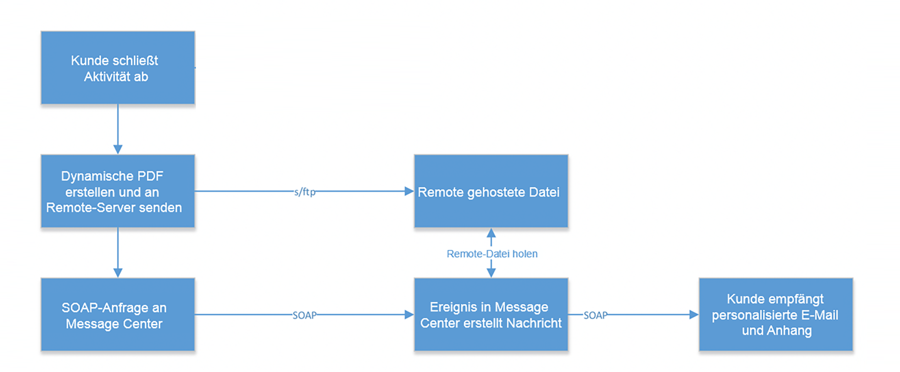
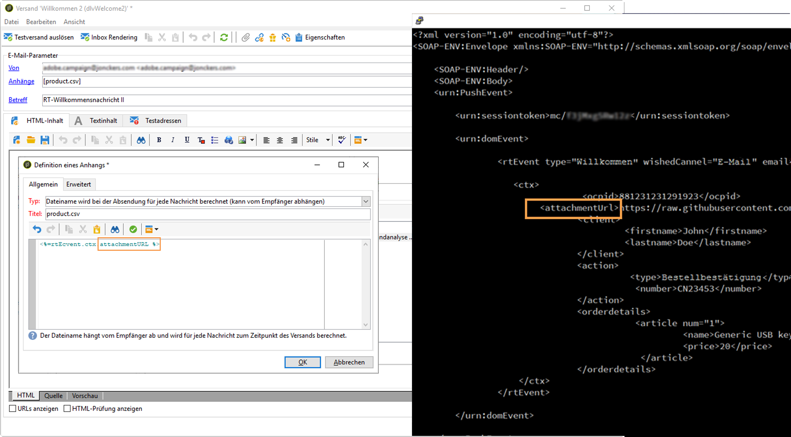

# Anwendungsbeispiel: Senden von Transaktions-E-Mails mit Anhängen{#transactional-email-with-attachments}

In diesem Anwendungsbeispiel sollen E-Mail-Anhänge dynamisch zu ausgehenden Sendungen hinzugefügt werden.

## Die wichtigsten Schritte {#key-steps}

In diesem Szenario erfahren Sie, wie Sie Transaktions-E-Mails mit individuellen und/oder personalisierten Anhängen versenden können. Die Anhänge werden nicht vorab auf den Transaktionsnachrichtenversand-Server hochgeladen, sondern dynamisch generiert.

Wenn Sie Kundeninteraktionen oder Daten erfassen, müssen Sie diese Informationen unter Umständen am Ende dieses Vorgangs beispielsweise in Form einer an eine E-Mail angehängten PDF-Datei an den Kunden zurücksenden.

Hier werden die allgemeinen Schritte für diesen Vorgang beschrieben.

1. Der Kunde öffnet die Webseite und findet ein Produkt, das er kaufen möchte.
1. Der Kunde wählt das Produkt aus und passt einige Optionen an.
1. Der Kunde schließt die Transaktion ab.
1. Dem Kunden wird eine E-Mail zur Bestätigung der Transaktion gesendet. Da davon abzuraten ist, in der E-Mail personenbezogene Daten (Personally Identifiable Information, PII) zu senden, wird eine sichere PDF-Datei erzeugt und an die E-Mail angehängt.
1. Der Kunde erhält die E-Mail und den Anhang mit den relevanten Daten.

In diesem Szenario werden die Anhänge nicht vorab erstellt, sondern den ausgehenden E-Mails dynamisch hinzugefügt, was folgende Vorteile bietet:

* Sie können den Inhalt des Anhangs personalisieren.
* Wenn der Anhang mit einer Transaktion verknüpft ist (wie im oben beschriebenen Beispiel), kann er dynamische Daten enthalten, die im Laufe des Kundenprozesses generiert werden.
* Das Anhängen von PDF-Dateien erhöht die Sicherheit, da Sie diese verschlüsseln und über HTTPS senden können.

>[!NOTE]
>
>Um Leistungsprobleme zu vermeiden, sollten Bilder, die Sie direkt von einer personalisierten URL als Anlage herunterladen, standardmäßig nicht mehr als 100.000 Byte umfassen. Dieser empfohlene Schwellenwert kann über [die Liste der Campaign Classic-Optionen](../../installation/using/configuring-campaign-options.md#delivery)konfiguriert werden.

## Empfehlungen   {#important-notes}

Bevor Sie dieses Szenario implementieren, lesen Sie die folgenden Leitlinien sorgfältig durch:

* Die Transaktionsnachricht-Instanzen sollten nicht zum Speichern, Exportieren oder Hochladen von Dateien oder Daten verwendet werden. Sie dürfen nur für Ereignisdaten und zugehörige Informationen verwendet werden. Sie dürfen nicht als Dateispeichersystem betrachtet werden.
* Da es außerhalb von Adobe keinen direkten Zugriff auf die Transaktionsnachricht-Instanzen oder Server gibt, ist keine Standardmethode zum Übertragen solcher Dateien auf diese Server verfügbar (kein FTP-Zugriff).
* Laut Vertrag darf der Speicherplatz in Transaktionsnachricht-Instanzen nicht zum Speichern beliebiger Dateitypen verwendet werden, auch nicht für Anhänge.
* Sie müssen zum Hosten dieser Dateien ein anderes Online-Speichersystem verwenden. Sie benötigen FTP-Zugriff auf das System und müssen Dateien schreiben und löschen können.

>[!NOTE]
>
>Zur Vermeidung von Leistungsproblemen wird empfohlen, nicht mehr als einen Anhang pro E-Mail einzuschließen. Der empfohlene Schwellenwert kann über [die Liste der Campaign Classic-Optionen](../../installation/using/configuring-campaign-options.md#delivery)konfiguriert werden.

## Implementierung{#implementation}

Das folgende Diagramm zeigt die verschiedenen Schritte bei der Implementierung dieses Szenarios:



Gehen Sie wie folgt vor, um einer Transaktionsnachricht dynamisch einen E-Mail-Anhang hinzuzufügen:

1. Gestalten Sie zunächst Ihren Anhang. Weiterführende Informationen hierzu finden Sie in [diesem Abschnitt](../../delivery/using/attaching-files.md#attach-a-personalized-file).

   So können Sie die Dateien an eine E-Mail anhängen, selbst wenn sie nicht in der Ausführungsinstanz gehostet werden.

1. Sie können E-Mails über einen SOAP-Nachrichtenauslöser senden. Im SOAP-Aufruf gibt es einen URL-Parameter (attachmentURL).

   Weitere Informationen zu SOAP-Anfragen finden Sie unter [Ereignisbeschreibung](../../message-center/using/event-description.md).

1. Klicken Sie beim Erstellen Ihrer E-Mail auf **[!UICONTROL Anhang]**.

1. Geben Sie im Bildschirm **[!UICONTROL Definition eines Anhangs]** den SOAP-Anhangsparameter ein:

   ```
   <%= rtEvent.ctx.attachementUrl %>
   ```

1. Bei der Verarbeitung der Nachricht ruft das System die Datei vom Remote-Speicherort (Drittpartei-Server) ab und hängt sie an die jeweilige Nachricht an.

   Da es sich bei diesem Parameter um eine Variable handeln kann, sollte die Nachricht die über den SOAP-Aufruf gesendete vollständige Remote-URL-Variable Ihrer Datei akzeptieren.

   
