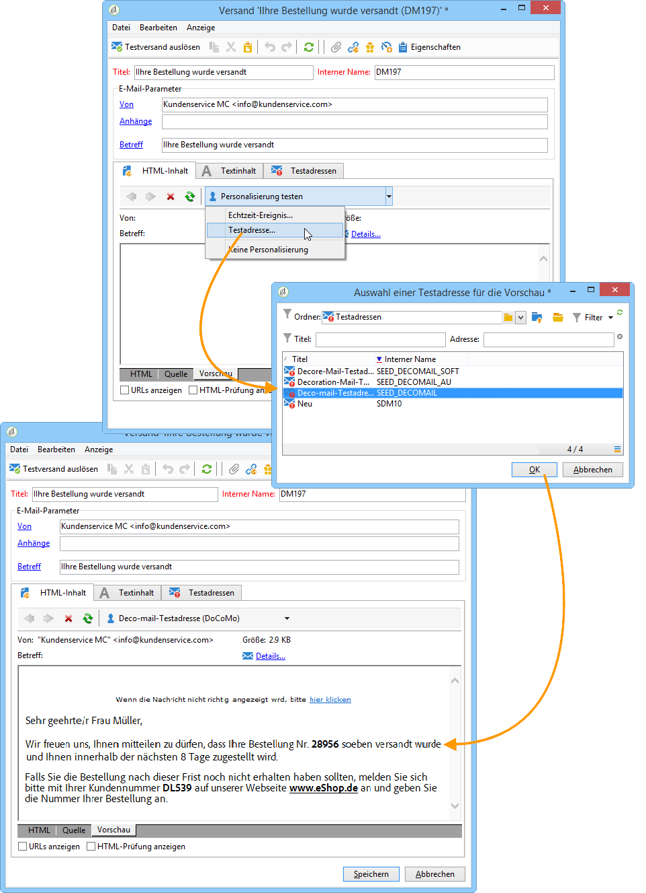

# Transaktionsnachrichten-Vorschau{#transactional-message-preview}

Nach der Erstellung einer oder mehrerer Testadressen sowie des Nachrichteninhalts können Sie eine Vorschau Ihrer Nachricht erzeugen und ihre Personalisierung überprüfen:

1. Klicken Sie in der Nachrichtenvorlage auf den Tab **[!UICONTROL Vorschau]**.

   

1. Klicken Sie in der Dropdown-Liste auf **[!UICONTROL Testadresse...]**.

   

1. Wählen Sie eine der vorab erstellten Testadressen aus, um die personalisierte Nachrichtenvorschau zu erzeugen.

   

