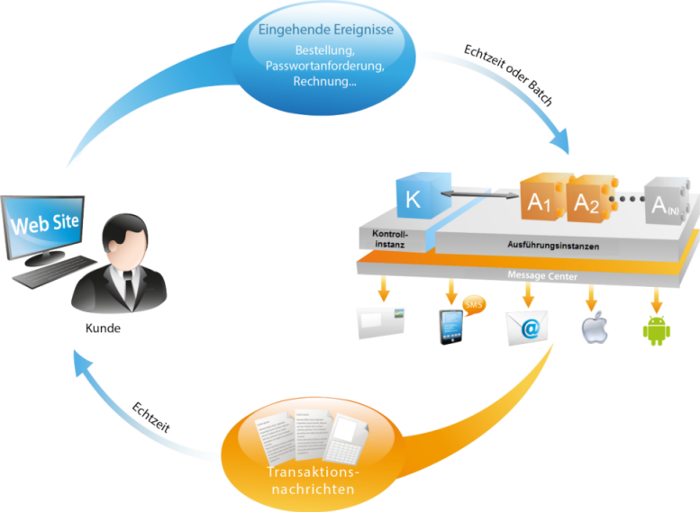
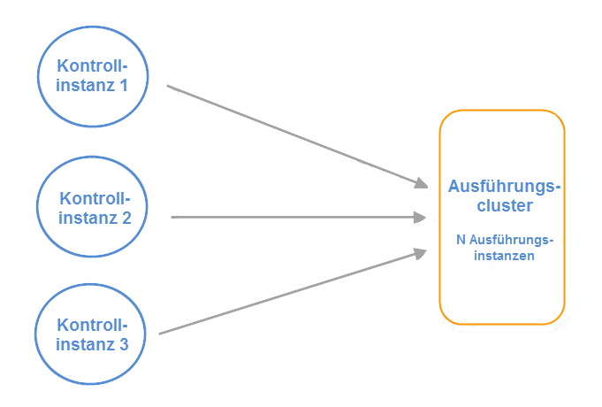
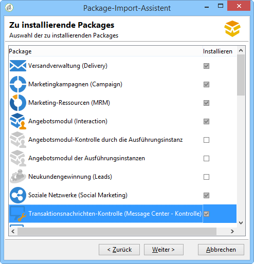
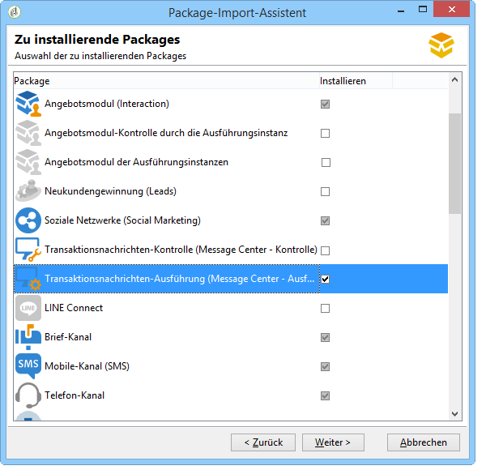
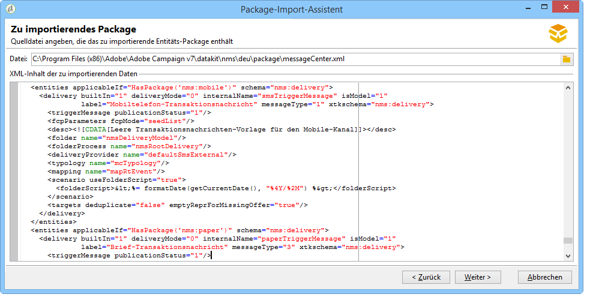
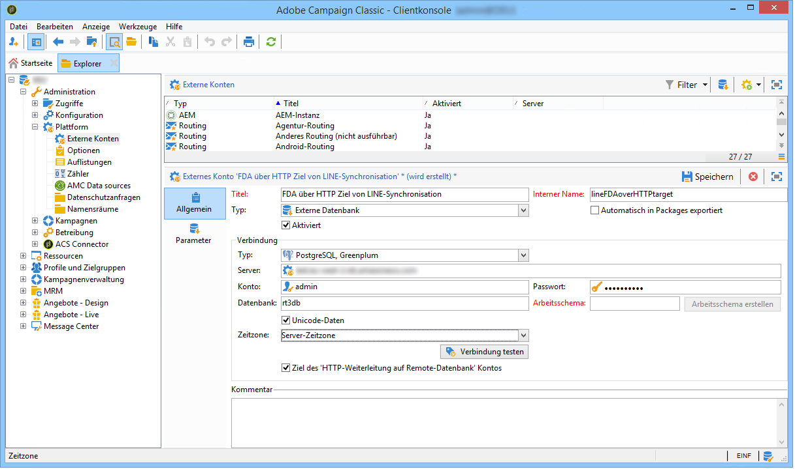
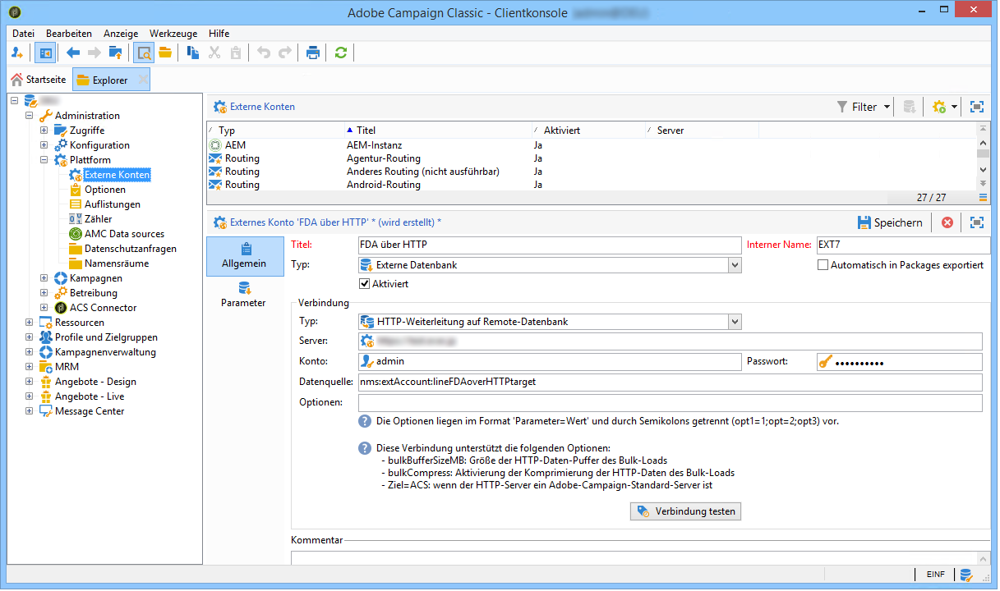
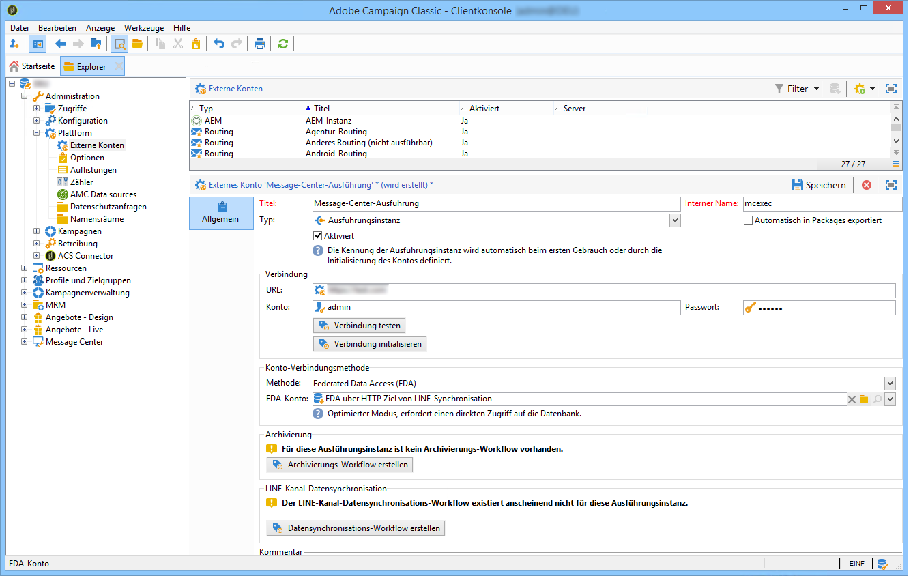

# Transaktionsnachrichten-Architektur{#transactional-messaging-architecture}

## Über Ausführungs- und Kontrollinstanzen {#about-execution-and-control-instances}

Die Transaktionsnachrichtenfunktion in Adobe Campaign (auch Message Center genannt) gewährleistet optimale Skalierbarkeit und Rund-um-die-Uhr-Betrieb. Hierfür besteht die Anwendung aus mehreren Instanzen:

* mindestens einer Kontrollinstanz, in der die Nachrichtenvorlagen erstellt werden;
* einer oder mehrerer Ausführungsinstanzen, in denen die Ereignisse empfangen und Transaktionsnachrichten versandt werden.

Um diese Funktionen zu nutzen, können Benutzer von Adobe Campaign in der Kontrollinstanz Vorlagen für Transaktionsnachrichten erstellen, eine Nachrichtenvorschau mithilfe einer Testadresse erzeugen, Berichte anzeigen und Ausführungsinstanzen überwachen.

Ausführungsinstanzen empfangen die Ereignisse des Informationssystems, ordnen diese den verfügbaren Transaktionsnachrichten-Vorlagen zu und senden schließlich jedem Kontakt auf den Vorlagen basierende personalisierte Nachrichten.



## Mehrere Kontrollinstanzen {#supporting-several-control-instances}

>[!CAUTION]
>
>Die Freigabe eines Ausführungs-Clusters mit mehreren Kontrollinstanzen wird nur bei On-Premise-Umgebungen unterstützt.

Mehrere Kontrollinstanzen können einen Ausführungscluster gemeinsam nutzen. Wenn Sie beispielsweise unterschiedliche spezialisierte Marken führen, haben Sie die Möglichkeit, für jede Marke eine Kontrollinstanz zu konfigurieren und alle Kontrollinstanzen mit dem gleichen Ausführungscluster zu verbinden.



>[!NOTE]
>
>Weitere Informationen zur erforderlichen Konfiguration finden Sie unter [Mehrere Kontrollinstanzen verwenden](../../message-center/using/creating-a-shared-connection.md#using-several-control-instances).

## Instanzeninstallation {#installing-instances}

Bei der Installation der Transaktionsnachrichten-Packages sind mehrere Vorsichtsmaßnahmen erforderlich. Es wird empfohlen, in einer Testumgebung zu arbeiten, bevor Sie in Produktion gehen. Des Weiteren ist der Besitz einer entsprechenden Adobe-Campaign-Lizenz erforderlich. Nehmen Sie für weiterführende Informationen mit Ihrem Adobe-Kundenbetreuer Kontakt auf.

>[!CAUTION]
>
>Die Kontroll- und die Ausführungsinstanz(en) müssen auf unterschiedlichen Computern installiert werden. Sie können aber nicht auf derselben Campaign-Instanz ausgeführt werden.

Wenn Sie mehrere Kanäle benötigen, müssen Sie die entsprechenden Packages installieren und konfigurieren, bevor Sie die Transaktionsnachrichten-Packages installieren. Siehe [Hinzufügen von Versandkanälen](#adding-a-delivery-channel).

* Um eine Kontrollinstanz auf Ihrem Gerät zu installieren, wählen Sie das Package **[!UICONTROL Transaktionsnachrichten-Kontrolle]** aus.

   

* Um eine Ausführungsinstanz auf Ihrem Gerät zu installieren, wählen Sie das Modul **[!UICONTROL Transaktionsnachrichten-Ausführung]** aus.

   

## Hinzufügen von Versandkanälen {#adding-a-delivery-channel}

Versandkanäle (Mobile (SMS), Mobile App etc.) müssen unbedingt vor der Installation der Transaktionsnachrichten-Packages hinzugefügt werden. Falls Sie bereits ein Transaktionsnachrichten-Projekt über den E-Mail-Kanal begonnen haben und im Laufe des Projekts einen weiteren Kanal hinzufügen möchten, gehen Sie wie folgt vor:

1. Installieren Sie den benötigten Kanal, zum Beispiel den **Mobile-Kanal**, mithilfe des Package-Import-Assistenten (**[!UICONTROL Werkzeuge > Erweitert > Package importieren... > Adobe-Campaign-Package]** ).
1. Führen Sie einen Dateiimport durch (**[!UICONTROL Tools > Erweitert > Package-Import... > Datei]**) und wählen Sie die Datei **datakitnms **`[Your language]`**packaageCenter.xml** aus.
1. Behalten Sie im Bereich **[!UICONTROL XML-Inhalt der zu importierenden Daten]** nur die Versandvorlage bei, die dem hinzugefügten Kanal entspricht. Wenn Sie beispielsweise den **Mobile-Kanal** gewählt haben, behalten Sie nur das Element **Entitäten** bei, das der Vorlage **[!UICONTROL Mobiltelefon-Transaktionsnachricht]** (smsTriggerMessage) entspricht. Wenn Sie den **Mobile-App-Kanal** hinzugefügt haben, behalten Sie nur die Vorlagen **iOS-Transaktionsnachricht** (iosTriggerMessage) und **Android-Transaktionsnachricht** (androidTriggerMessage) bei.

   

<!--## Transactional messages and inbound Interaction {#transactional-messages-and-inbound-interaction}

When combined with the Inbound Interaction module, transactional messaging enables you to insert a marketing offer dedicated to the recipient into the message.

>[!NOTE]
>
>The Interaction module is detailed in [Interaction](../../interaction/using/interaction-and-offer-management.md).

To use transactional messaging with Interaction, you need to apply the following configurations:

* Install the **Interaction** package onto the control instance and configure your offer catalog.

  >[!CAUTION]
  >
  >Do not replicate the offers onto the execution instances.

* The event must include an identifier linked to the recipients, for personalizing offers. The **@externalId** attribute must contain the value of this identifier. **Interaction** is configured by default to identify the recipient of the primary key:

  ```
  <rtEvent type="order_confirmation" email="john.doe@adobe.com" externalId="1242"> 
  ```

  You can configure **Interaction** so that identification takes place in the field of your choice, for example on the email address:

  ```
  <rtEvent type="order_confirmation" email="john.doe@adobe.com" externalId="john.doe@yahoo.com"> 
  ```

Create your delivery templates the way you would for an email campaign:

* Add the offer to your transactional message template.
* Check the preview, send a proof and publish the template.

You also have to enable the unitary mode on your offer spaces. For more on this, refer to [this section](../../interaction/using/creating-offer-spaces.md).-->

## Transaktionsnachrichten und Push-Benachrichtigungen {#transactional-messaging-and-push-notifications}

In Kombination mit dem Mobile-App-Kanal-Modul können Sie über Benachrichtigungen Transaktionsnachrichten an Mobilgeräte senden.

>[!NOTE]
>
>Der Mobile-App-Kanal wird in [diesem Abschnitt](../../delivery/using/about-mobile-app-channel.md) im Detail beschrieben.

Um Transaktionsnachrichten-Module in Verbindung mit dem Mobile-App-Kanal zu nutzen, sind folgende Konfigurationen notwendig:

1. Installieren Sie das Package **Mobile App Channel** in den Kontroll- und Ausführungsinstanzen.
1. Replizieren Sie den Dienst sowie die Applikationen, die dieser in den Ausführungsinstanzen enthält.****

Das betreffende Ereignis muss folgende Elemente enthalten:

* Die Kennung des Mobilgeräts (**registrationId** für Android und **deviceToken** für iOS). Diese Kennung repräsentiert die &quot;Adresse&quot;, an die die Benachrichtigung gesendet wird.
* Die Definition der Relation zu der Mobile App oder dem Integrationsschlüssel (**uuid**), die den Abruf der App-spezifischen Verbindungsinformationen erlaubt.
* Den Kanal über den die Benachrichtigung gesendet wird (**wishedChannel**): 41 für iOS und 42 für Android.
* Alle für die Personalisierung nützlichen Daten.

Beispiel der Verarbeitung eines diese Informationen enthaltenden Ereignisses:

```
<SOAP-ENV:Envelope xmlns:xsd="http://www.w3.org/2001/XMLSchema" xmlns:xsi="http://www.w3.org/2001/XMLSchema-instance" xmlns:SOAP-ENV="http://schemas.xmlsoap.org/soap/envelope/">
   <SOAP-ENV:Body>
     <urn:PushEvent>
         <urn:sessiontoken>mc/</urn:sessiontoken>
         <urn:domEvent>

              <rtEvent wishedChannel="41" type="DELIVERY" registrationToken="2cefnefzef758398493srefzefkzq483974">
                <mobileApp _operation=”none” uuid="com.adobe.NeoMiles"/>
                <ctx>
                    <deliveryTime>1:30 PM</deliveryTime>
                    <url>http://www.adobe.com</url>
                </ctx>
              </rtEvent>

         </urn:domEvent>
     </urn:PushEvent>           
   </SOAP-ENV:Body>
</SOAP-ENV:Envelope>
```

>[!NOTE]
>
>Die Erstellung der Nachrichtenvorlagen folgt der üblichen Vorgehensweise.

## Transaktionsnachricht und LINE {#transactional-messaging-and-line}

In Kombination mit dem LINE-Kanal ermöglichen Ihnen Transaktionsnachrichten, Echtzeit-Nachrichten über die im Mobilgerät installierte LINE-App zu senden. Dies dient zum Senden der Willkommensnachricht, wenn ein LINE-Benutzer die Seite Ihrer Marke hinzufügt.

Um das Transaktionsnachrichtenmodul mit LINE zu verwenden, sind die folgenden Elemente zur Konfiguration Ihrer **Marketinginstanz** und Ihrer Ausführungsinstanz **erforderlich**:

* Installieren Sie das Package **[!UICONTROL LINE Connect]** auf beiden Instanzen.
* Installieren Sie das Package **[!UICONTROL Transaktionsnachrichten-Kontrolle]** auf Ihrer Marketinginstanz und das Package **[!UICONTROL Transaktionsnachrichten-Ausführung]** auf der Ausführungsinstanz.
* Erstellen Sie ein **externes LINE-Konto** und den entsprechenden **Service** auf beiden Instanzen mit identischen Namen, damit sie synchronisiert werden können. Weiterführende Informationen zum Erstellen eines externen LINE-Kontos und Services finden Sie auf dieser [Seite](../../delivery/using/line-channel.md#creating-a-line-account-and-an-external-account-).

Konfigurieren Sie dann im **[!UICONTROL Explorer]** unter **[!UICONTROL Plattform]** > **[!UICONTROL Externes Konto]** unterschiedliche externe Konten auf beiden Instanzen:

1. Erstellen Sie in der **Ausführungsinstanz** das externe Konto **[!UICONTROL Externe Datenbank]** mit der folgenden Konfiguration:

   

   * **[!UICONTROL Titel]** und **[!UICONTROL Interner Name]**: Benennen Sie Ihr externes Konto beliebig.
   * **[!UICONTROL Typ]**: Wählen Sie **[!UICONTROL Externe Datenbank]** .
   * Die Option **[!UICONTROL Aktiviert]** muss aktiviert sein.
   In der Kategorie **[!UICONTROL Verbindung]**:

   * **[!UICONTROL Typ]**: Wählen Sie Ihren Datenbankserver aus, z. B. PostgresSQL.
   * **[!UICONTROL Server]**: Geben Sie Ihre Datenbankserver-URL ein.
   * **[!UICONTROL Konto]**: Geben Sie Ihr Datenbankkonto ein.

      >[!NOTE]
      >
      >Ein Datenbankbenutzer benötigt für die FDA-Verbindung Lesezugriff auf die folgenden Tabellen: XtkOption, NmsVisitor, NmsVisitorSub, NmsService, NmsBroadLogRtEvent, NmsBroadLogBatchEvent, NmsTrackingLogRtEvent, NmsTrackingLogBatchEvent, NmsRtEvent, NmsBatchEvent, NmsBroadLogMsg, NmsTrackingUrl, NmsDelivery, NmsWebTrackingLogXtkFolder.

   * **[!UICONTROL Passwort]**: Geben Sie das Passwort für Ihr Datenbankkonto ein.
   * **[!UICONTROL Datenbank]**: Geben Sie den Datenbanknamen der Ausführungsinstanz ein.
   * Die Option **[!UICONTROL Ziel des &#39;HTTP-Weiterleitung auf Remote-Datenbank&#39; Kontos]** muss aktiviert sein.


1. Erstellen Sie in der **Marketinginstanz** das Konto **[!UICONTROL Externe Datenbank]** mit der folgenden Konfiguration:

   

   * **[!UICONTROL Titel]** und **[!UICONTROL Interner Name]**: Benennen Sie Ihr externes Konto beliebig.
   * **[!UICONTROL Typ]**: Wählen Sie **[!UICONTROL Externe Datenbank]** .
   * Die Option &quot;Aktiviert&quot; muss aktiviert sein.
   In der Kategorie **[!UICONTROL Verbindung]**:

   * **[!UICONTROL Typ]**: Wählen Sie **[!UICONTROL HTTP-Weiterleitung auf Remote-Datenbank]** aus .
   * **[!UICONTROL Server]**: Geben Sie die Kampagnenserver-URL der Ausführungsinstanz ein.
   * **[!UICONTROL Konto]**: Geben Sie das Konto ein, über das auf Ihre Ausführungsinstanz zugegriffen wird.
   * **[!UICONTROL Passwort]**: Geben Sie das Passwort für das Konto ein, über das auf Ihre Ausführungsinstanz zugegriffen wird.
   * **[!UICONTROL Datenquelle]**: Geben Sie die folgende Syntax ein: **[!UICONTROL nms:extAccount:ID of your external database account in the execution instance]** .


1. Erstellen Sie in der **Marketinginstanz** das externe Konto **[!UICONTROL Ausführungsinstanz]** mit der folgenden Konfiguration, um den Datensynchronisations-Workflow zu erstellen:

   

   * **[!UICONTROL Titel]** und **[!UICONTROL Interner Name]**: Benennen Sie Ihr externes Konto beliebig.
   * **[!UICONTROL Typ]**: Wählen Sie **[!UICONTROL Ausführungsinstanz]** aus .
   * Die Option &quot;Aktiviert&quot; muss aktiviert sein.
   In der Kategorie **[!UICONTROL Verbindung]**:

   * **[!UICONTROL URL]**: Geben Sie die URL der Ausführungsinstanz ein.
   * **[!UICONTROL Konto]**: Geben Sie das Konto ein, über das auf Ihre Ausführungsinstanz zugegriffen wird.
   * **[!UICONTROL Passwort]**: Geben Sie das Passwort für das Konto ein, über das auf Ihre Ausführungsinstanz zugegriffen wird.
   In der Kategorie **[!UICONTROL Konto-Verbindungsmethode]**:

   * **[!UICONTROL Methode]**: Wählen Sie **[!UICONTROL Federated Data Access (FDA)]** aus.
   * **[!UICONTROL FDA-Konto]**: Wählen Sie Ihr FDA-Konto aus der Dropdown-Liste aus.
   * Wählen Sie die Schaltfläche **[!UICONTROL Archivierungs-Workflow erstellen]** aus.
   * Wählen Sie die Schaltfläche **[!UICONTROL Datensynchronisations-Workflow erstellen]** aus, um den LINE-Datensynchronisations-Workflow zu erstellen.


1. Jetzt können Sie Transaktionsnachrichten erstellen. Weiterführende Informationen dazu finden Sie auf dieser [Seite](../../message-center/using/introduction.md).
