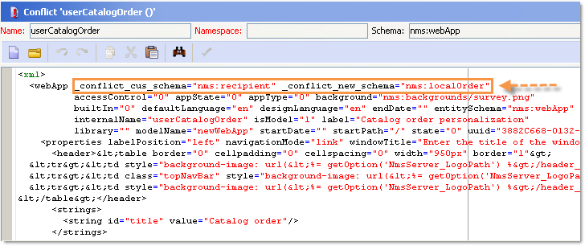

# Allgemeine Konfigurationen{#general-configurations}

In diesem Abschnitt wird die Konfiguration beschrieben, die in Adobe Campaign v7 ausgeführt werden soll, wenn Sie von Version 5.11 oder Version 6.02 migrieren.

Zusätzlich:

* Wenn Sie von Version 5.11 migrieren, müssen Sie auch die Konfiguration durchführen, die im Abschnitt [Spezifische Konfigurationen in Version 5.11](../../migration/using/specific-configurations-in-v5-11.md) beschrieben ist.
* Wenn Sie von Version 6.02 migrieren, müssen Sie auch die Konfiguration durchführen, die im Abschnitt [Spezifische Konfigurationen in Version 6.02](../../migration/using/specific-configurations-in-v6-02.md) beschrieben ist.

## Zeitzonen {#time-zones}

### Zeitzonenmodus {#multi-time-zone-mode}

In Version 6.02 war der &quot;Zeitzonenmodus&quot;nur für PostgreSQL-Datenbankmaschinen verfügbar. Es wird nun unabhängig vom verwendeten Datenbanktyp angeboten. Wir empfehlen dringend, dass Sie Ihre Basis in eine &quot;Multi-Zeitzone&quot;-Basis umwandeln.

Um den TIMESTAMP MIT TIMEZONE-Modus zu verwenden, müssen Sie auch die Option **-userTimestamptz:1** zur Befehlszeile nach der Aktualisierung hinzufügen.

>[!IMPORTANT]
>
>Wenn der Parameter **-usetimestamptz:1** mit einer inkompatiblen Datenbank-Engine verwendet wird, wird Ihre Datenbank beschädigt und Sie müssen eine Sicherung Ihrer Datenbank wiederherstellen und den oben genannten Befehl erneut ausführen.

>[!NOTE]
>
>Es ist möglich, die Zeitzone nach der Migration über die Konsole zu ändern (**[!UICONTROL Administration > Platform > Optionen > WdbcTimeZone]** -Knoten).
>
>For more on time zone management, refer to [this section](../../installation/using/time-zone-management.md).

### Oracle {#oracle}

Wenn Sie während der Aktualisierung einen **ORA 01805** -Fehler erhalten, bedeutet dies, dass die Oracle-Zeitzonendateien zwischen dem Anwendungsserver und dem Datenbankserver nicht synchronisiert sind. Um sie erneut zu synchronisieren, führen Sie die folgenden Schritte aus:

1. Führen Sie den folgenden Befehl aus, um die verwendete Zeitzonendatei zu identifizieren:

   ```
   select * from v$timezone_file
   ```

   Zeitzonendateien befinden sich normalerweise im Ordner **ORACLE_HOME/oracore/zoneinfo/** .

1. Stellen Sie sicher, dass die Zeitzonendateien auf beiden Servern identisch sind.

Weitere Informationen finden Sie unter: [https://docs.oracle.com/cd/E11882_01/server.112/e10729/ch4datetime.htm#NLSPG004](https://docs.oracle.com/cd/E11882_01/server.112/e10729/ch4datetime.htm#NLSPG004).

Eine Fehlausrichtung der Zeitzone zwischen Client und Server kann ebenfalls zu Verzögerungen führen. Daher empfehlen wir, dieselbe Version der Oracle-Bibliothek auf Client- und Serverseite zu verwenden. Beide Zeitzonen müssen gleich sein.

So prüfen Sie, ob sich beide Seiten in denselben Zeitzonen befinden:

1. Überprüfen Sie die Version der Zeitzonendatei auf der Clientseite, indem Sie den folgenden Befehl ausführen:

   ```
   genezi -v
   ```

   genezi ist eine Binärdatei im **$ORACLE_HOME/bin** Repository.

1. Überprüfen Sie die Version der Zeitzonendatei auf dem Server, indem Sie den folgenden Befehl ausführen:

   ```
   select * from v$timezone_file
   ```

1. Um die Zeitzonendatei auf Clientseite zu ändern, verwenden Sie die Variable **ORA_TZFILE** -Umgebung.

## Sicherheit {#security}

### Sicherheitszonen {#security-zones}

>[!IMPORTANT]
>
>Aus Sicherheitsgründen ist die Adobe Campaign-Plattform standardmäßig nicht mehr verfügbar: Sie müssen die Sicherheitszonen konfigurieren und daher IP-Adressen der Bediener erfassen.

Adobe Campaign v7 umfasst das Konzept der **Sicherheitszonen**. Jeder Benutzer muss mit einer Zone verknüpft sein, um sich bei einer Instanz anzumelden, und die IP-Adresse des Benutzers muss in die Adressen oder Adressbereiche eingeschlossen sein, die in der Sicherheitszone definiert sind. Das Konfigurieren der Sicherheitszonen kann in der Konfigurationsdatei des Adobe Campaign-Servers erfolgen. Die Sicherheitszone, der ein Benutzer zugeordnet ist, muss in der Konsole definiert werden (**[!UICONTROL Administration > Zugriffsverwaltung > Operatoren]**).

**Bitten Sie vor der Migration** Ihren Netzwerkadministrator, die Sicherheitszonen zu definieren, die nach der Migration aktiviert werden sollen.

**Nach der Aktualisierung** (vor dem Neustart des Servers) müssen Sie die Sicherheitszonen konfigurieren.

Die Konfiguration der Sicherheitszone finden Sie in [diesem Abschnitt](../../installation/using/configuring-campaign-server.md#defining-security-zones).

### Benutzerkennwörter {#user-passwords}

In v7 muss die **interne** Verbindung mit dem **Operator** mit einem Kennwort gesichert werden. Es wird dringend empfohlen, diesen Konten und allen Operatorkonten **vor der Migration** Passwörter zuzuweisen. Wenn Sie kein Kennwort für **intern** angegeben haben, können Sie keine Verbindung herstellen. Geben Sie den folgenden Befehl ein, um ein Kennwort **intern** zuzuweisen:

```
nlserver config -internalpassword
```

>[!IMPORTANT]
>
>Das **interne** Kennwort muss für alle Tracking-Server identisch sein. Weitere Informationen finden Sie in [diesem Abschnitt](../../installation/using/campaign-server-configuration.md#internal-identifier) und in [diesem Abschnitt](../../platform/using/access-management.md#about-permissions).

### Neue Funktionen in v7 {#new-features-in-v7}

* Benutzer ohne Berechtigungen können keine Verbindung mehr mit Adobe Campaign herstellen. Ihre Berechtigungen müssen manuell hinzugefügt werden, z. B. durch die Erstellung einer Berechtigung namens **connect**.

   Benutzer, die von dieser Änderung betroffen sind, werden nach der Aktualisierung identifiziert und aufgelistet.

* Die Verfolgung funktioniert nicht mehr, wenn das Kennwort leer ist. Ist dies der Fall, wird eine Fehlermeldung angezeigt, die Sie darüber informiert und Sie auffordert, sie neu zu konfigurieren.
* Benutzerkennwörter werden nicht mehr im **xtk:sessionInfo** -Schema gespeichert.
* Administratorberechtigungen sind jetzt erforderlich, um die **Funktionen xtk:builder:EvaluateJavaScript** und **xtk:builder:EvaluateJavaScriptTemplate** zu verwenden.

Einige vordefinierte Schema wurden geändert und sind jetzt standardmäßig nur mit Schreibzugriff für Operatoren mit **Administratorberechtigung** verfügbar:

* ncm:veröffentlichen
* nl:monitoring
* nms:calendar
* xtk:builder
* xtk:connections
* xtk:dbInit
* xtk:entityBackupNew
* xtk:entityBackupOriginal
* xtk:entityOriginal
* xtk:form
* xtk:funcList
* xtk:fusion
* xtk:image
* xtk:javascript
* xtk:jssp
* xtk:jst
* xtk:navtree
* xtk:operatorGroup
* xtk:package
* xtk:queryDef
* xtk:resourceMenu
* xtk:rights
* xtk:Schema
* xtk:scriptContext
* xtk:specFile
* xtk:sql
* xtk:sqlSchema
* xtk:srcSchema
* xtk:strings
* xtk:xslt

### Sessiontoken-Parameter {#sessiontoken-parameter}

In v5 funktionierte der Parameter **sessiontoken** auf beiden Clientseiten (Liste der Übersichtstypbildschirme, Link-Editor usw.) und serverseitig (Webanwendungen, Berichte, jsp, jssp usw.) In v7 funktioniert es nur auf Serverseite. Wenn Sie wieder zur vollen Funktionalität wie auf v5 zurückkehren möchten, müssen Sie die Links mit diesem Parameter ändern und über die Verbindungsseite weiterleiten:

Link-Beispiel:

```
/view/recipientOverview?__sessiontoken=<trusted login>
```

Neuer Link auf der Seite &quot;Verbindung&quot;:

```
/nl/jsp/logon.jsp?login=<trusted login>&action=submit&target=/view/recipientOverview
```

>[!IMPORTANT]
>
>Wenn Sie einen Operator verwenden, der mit einer vertrauenswürdigen IP-Maske verknüpft ist, überprüfen Sie, ob er über die Mindestrechte verfügt und sich im **sessionTokenOnly** -Modus in einer Sicherheitszone befindet.

### SQL-Funktionen {#sql-functions}

Unbekannte SQL-Funktionsaufrufe werden nicht mehr automatisch an den Server gesendet. Derzeit müssen alle SQL-Funktionen dem **xtk:funcList** -Schema hinzugefügt werden (weitere Informationen finden Sie in [diesem Abschnitt](../../configuration/using/adding-additional-sql-functions.md)). Bei der Migration wird während der Nachrüstung eine Option hinzugefügt, mit der Sie die Kompatibilität mit alten nicht deklarierten SQL-Funktionen aufrechterhalten können. Wenn Sie diese Funktionen weiterhin verwenden möchten, stellen Sie sicher, dass die Option **XtkPassUnknownSQLFunctionsToRDBMS** tatsächlich auf der Knotenebene **[!UICONTROL Administration > Platform > Optionen]** definiert ist.

>[!IMPORTANT]
>
>Wir empfehlen dringend, diese Option aufgrund der mit ihr verbundenen Sicherheitsrisiken nicht zu verwenden.

### JSSP {#jssp}

Wenn Sie den Zugriff auf bestimmte Seiten über das HTTP-Protokoll (nicht über HTTPS) genehmigen möchten, müssen Sie beispielsweise in Ihren Web-Apps unabhängig von der in den Sicherheitszonen ausgeführten Konfiguration den Parameter **httpAllowed=&quot;true&quot;** in der entsprechenden Relaisregel angeben.

Wenn Sie anonyme JSSPs verwenden, müssen Sie den **Parameter httpAllowed=&quot;true&quot;** in eine Relaisregel für Ihre JSSP-Datei (**[!UICONTROL serverConf.xml]** -Datei) einfügen:

Beispiel:

```
<url IPMask="" deny="" hostMask="" httpAllowed="true" relayHost="true" relayPath="true"
           status="blocklist" targetUrl="https://localhost:8080" timeout="" urlPath="*/cus/myPublicPage.jssp"/>
```

## Syntax {#syntax}

### JavaScript {#javascript}

Adobe Campaign v7 integriert einen neueren JavaScript-Interpreter. Dieses Update kann jedoch zu Fehlfunktionen bei bestimmten Skripten führen. Da der vorherige Motor eher permissiv war, würden bestimmte Syntaxen funktionieren, was bei der neuen Version des Motors nicht mehr der Fall ist.

Das **[!UICONTROL myObject.Die @attribute]** -Syntax ist jetzt nur für XML-Objekte gültig. Diese Syntax kann zur Personalisierung von Versänden und Content-Management verwendet werden. Wenn Sie diesen Syntaxtyp für ein Nicht-XML-Objekt verwendet haben, funktionieren die Personalisierungsfunktionen nicht mehr.

Bei allen anderen Objekttypen lautet die Syntax jetzt **[!UICONTROL myObject`[`&quot;attribute&quot;`]`]**. Beispiel: Ein Nicht-XML-Objekt, das die folgende Syntax verwendet hat:**[!UICONTROL  angestellt.@sn ]**muss jetzt die folgende Syntax verwenden:**[!UICONTROL  employee`[`&quot;sn&quot;`]`]**.

* Frühere Syntax:

   ```
   employee.@sn
   ```

* Neue Syntax:

   ```
   employee["sn"]
   ```

Um einen Wert in einem XML-Objekt zu ändern, müssen Sie jetzt den Beginn aktualisieren, bevor Sie den XML-Knoten hinzufügen:

* Alter JavaScript-Code:

   ```
   var cellStyle = node.style.copy();
   this.styles.appendChild(cellStyle);
   cellStyle.@width = column.@width;
   ```

* Neuer JavaScript-Code:

   ```
   var cellStyle = node.style.copy();
   cellStyle.@width = column.@width;
   this.styles.appendChild(cellStyle);
   ```

Sie können kein XML-Attribut mehr als Tabellenschlüssel verwenden.

* Frühere Syntax:

   ```
   if(serverForm.activities[ctx.activityHistory.activity[0].@name].type !="end")
   ```

* Neue Syntax:

   ```
   if(serverForm.activities[String(ctx.activityHistory.activity[0].@name)].type !="end"
   ```

### SQLData {#sqldata}

Um die Instanzsicherheit zu erhöhen, wurde in Adobe Campaign v7 eine neue Syntax eingeführt, die die Syntax auf der Grundlage von SQLData ersetzt. Wenn Sie diese Codeelemente mit dieser Syntax verwenden, müssen Sie sie ändern. Die wichtigsten Punkte sind:

* Filtern nach Untergruppen-Abfragen: Die neue Syntax basiert auf dem `<subQuery>` Element, um eine Unter-Abfrage zu definieren.
* Aggregate: die neue Syntax lautet &quot;Aggregat function(collection)&quot;
* Filtern nach Verbindung: die neue Syntax `[schemaName:alias:xPath]`

Das Schema queryDef (xtk:queryDef) wurde geändert:

* Es steht ein neues `<subQuery>` Element zur Verfügung, um die in SQLData enthaltene SELECT-Anweisung zu ersetzen.
* Es werden zwei neue Werte, &quot;IN&quot;und &quot;NOT IN&quot;für das Attribut &quot;@setOperator&quot;eingeführt
* ein neues `<where>` Element, das dem `<node>` Element untergeordnet ist: Dadurch können Sie &quot;Unter-Selektionen&quot;in SELECT vornehmen

Wenn ein Attribut &quot;@expr&quot;verwendet wird, ist die SQLData möglicherweise vorhanden. Eine Suche nach den folgenden Begriffen kann durchgeführt werden: &quot;SQLData&quot;, &quot;aliasSqlTable&quot;, &quot;sql&quot;.

Adobe Campaign v7-Instanzen sind standardmäßig gesichert. Sicherheit wird in Form von Definitionen der Sicherheitszonen in der Datei &quot; **[!UICONTROL serverConf.xml]** &quot;bereitgestellt: Das **Attribut allowSQLInject** verwaltet die SQL-Syntaxsicherheit.

Tritt während der Ausführung nach der Aktualisierung ein &quot;SQLData&quot;-Fehler auf, müssen Sie dieses Attribut ändern, um vorübergehend die Verwendung von &quot;SQLData&quot;-basierten Syntaxen zuzulassen, sodass Sie den Code umschreiben können. Dazu muss die folgende Option in der Datei &quot; **serverConf.xml** &quot;geändert werden:

```
allowSQLInjection="true"
```

Starten Sie daher die Nachaktualisierung mit dem folgenden Befehl neu:

```
nlserver config -postupgrade -instance:<instance_name> -force
```

Sie müssen die Sicherheitszonen konfigurieren (siehe [Sicherheit](#security)) und dann die Sicherheit erneut aktivieren, indem Sie die Option ändern:

```
allowSQLInjection="false"
```

Nachstehend finden Sie komparative Beispiele für die alte und die neue Syntax.

**Filtern nach Unter-Abfragen**

* Frühere Syntax:

   ```
   <condition expr="@id NOT IN ([SQLDATA[SELECT iOperatorId FROM XtkOperatorGroup WHERE iGroupId = $(../@owner-id)]])" enabledIf="$(/ignored/@ownerType)=1"/>
   ```

* Neue Syntax:

   ```
   <condition setOperator="NOT IN" expr="@id" enabledIf="$(/ignored/@ownerType)=1">
     <subQuery schema="xtk:operatorGroup">
        <select>
          <node expr="[@operator-id]" />
        </select>
        <where>
          <condition expr="[@group-id]=$long(../@owner-id)"/>
        </where>
      </subQuery>
   </condition>
   ```

* Frühere Syntax:

   ```
   <queryFilter name="dupEmail" label="Emails duplicated in the folder" schema="nms:recipient">
       <where>
         <condition sql="sEmail in (select sEmail from nmsRecipient where iFolderId=$(folderId) group by sEmail having count(sEmail)>1)" internalId="1"/>
       </where>
       <folder _operation="none" name="nmsSegment"/>
     </queryFilter>
   ```

* Neue Syntax:

   ```
   <queryFilter name="dupEmail" label=" Emails duplicated in the folder " schema="nms:recipient">
       <where>
         <condition expr="@email" setOperator="IN" internalId="1">
           <subQuery schema="nms:recipient">
             <select><node expr="@email"/></select>
             <where><condition expr="[@folder-id]=$(folderId)"/></where>
             <groupBy><node expr="@email"/></groupBy>
             <having><condition expr="count(@email)>1"/></having>
           </subQuery>
         </condition>
       </where>
       <folder _operation="none" name="nmsSegment"/>
     </queryFilter>
   ```

**Das Aggregat**

Aggregat function(collection)

* Frühere Syntax:

   ```
   <node sql="(select count(*) from NmsNewsgroup WHERE O0.iOperationId=iOperationId)" alias="@nbMessages"/>
   ```

* Neue Syntax:

   ```
   <node expr="count([newsgroup/@id])" alias="../@nbMessages"/>
   ```

   >[!NOTE]
   >
   >Die Verbindungen werden automatisch für die Aggregat-Funktionen ausgeführt. Es ist nicht mehr erforderlich, die Bedingung WO O0.iOperationId=iOperationId anzugeben.
   >
   >Die Funktion &quot;count(*)&quot;ist nicht mehr möglich. Sie müssen &quot;count()&quot;verwenden.

* Frühere Syntax:

   ```
   <node sql="(select Sum(iToDeliver) from NmsDelivery WHERE O0.iOperationId=iOperationId AND iSandboxMode=0 AND iState>=45)" alias="@nbMessages"/>
   ```

* Neue Syntax:

   ```
   <node expr="Sum([delivery-linkedDelivery/properties/@toDeliver])" alias= "../@sumToDeliver">
                     <where><condition expr="[validation/@sandboxMode]=0 AND @state>=45" /></where></node>
   ```

**Filter nach Verbindung**

`[schemaName:alias:xPath]`

Der Alias ist optional

* Frühere Syntax:

   ```
   <condition expr={"[" + joinPart.destination.nodePath + "] = [SQLDATA[W." + joinPart.source.SQLName + "]]"}
                                            aliasSqlTable={nodeSchemaRoot.SQLTable + " W"}/>
   ```

* Neue Syntax:

   ```
   <condition expr={"[" + joinPart.destination.nodePath + "] = [" + nodeSchema.id + ":" + joinPart.source.nodePath + "]]"}/>
   ```

**Tipps und Tricks**

Verwenden Sie in einem `<subQuery>` Element die folgende Syntax, um auf ein Feld &quot;field&quot;des `<queryDef>` Hauptelements zu verweisen: `[../@field]`

Beispiel:

```
<queryDef operation="select" schema="xtk:jobLog" startPath="/" xtkschema="xtk:queryDef">
  <select>
    <node expr="[job/@pid]" alias="@pid"/>
    <node expr="@id" ordered="true"/>
    <node expr="@logType"/>
  </select>
  <where>
    <condition expr="[@job-id]=99"/>
    <condition expr="@logType" setOperator="IN">
      <subQuery schema="xtk:jobLog">
        <select><node expr="@logType"/></select>
        <where><condition expr="[@job-id]=[../job/@id]"/></where>
        <groupBy><node expr="@logType"/></groupBy>
        <having><condition expr="count(@logType)>1"/></having>
      </subQuery>
    </condition>
  </where>
</queryDef>
```

## Konflikte {#conflicts}

Die Migration wird nach der Aktualisierung durchgeführt und Konflikte können in Berichten, Formularen oder Webanwendungen auftreten. Diese Konflikte können über die Konsole gelöst werden.

Nach der Ressourcensynchronisierung können Sie mit dem Befehl **nach der Aktualisierung** erkennen, ob die Synchronisierung Fehler oder Warnungen hervorruft.

### Ansicht des Synchronisierungsergebnisses {#view-the-synchronization-result}

Das Synchronisierungsergebnis kann auf zwei Arten angezeigt werden:

* In the command-line interface, errors are materialized by a triple chevron **>>>** and synchronization is stopped automatically. Warnings are materialized by a double chevron **>>** and must be resolved once synchronization is complete. At the end of the postupgrade, a summary is displayed in the command prompt. Beispiel:

   ```
   2013-04-09 07:48:39.749Z        00002E7A          1     info    log     =========Summary of the update==========
   2013-04-09 07:48:39.749Z        00002E7A          1     info    log     test instance, 6 warning(s) and 0 error(s) during the update.
   2013-04-09 07:48:39.749Z        00002E7A          1     warning log     The document with identifier 'mobileAppDeliveryFeedback' and type 'xtk:report' is in conflict with the new version.
   2013-04-09 07:48:39.749Z        00002E7A          1     warning log     The document with identifier 'opensByUserAgent' and type 'xtk:report' is in conflict with the new version.
   2013-04-09 07:48:39.750Z        00002E7A          1     warning log     The document with identifier 'deliveryValidation' and type 'nms:webApp' is in conflict with the new version.
   2013-04-09 07:48:39.750Z        00002E7A          1     warning log     Document of identifier 'nms:includeView' and type 'xtk:srcSchema' updated in the database and found in the file system. You will have to merge the two versions manually.
   ```

   Wenn es sich bei der Warnung um einen Ressourcenkonflikt handelt, muss der Operator darauf achten, ihn zu beheben.

* Die Datei &quot; **postupgrade_`<server version number>`_time&quot;der Datei &quot;postupgrade`>`.log** &quot;enthält das Synchronisierungsergebnis. Er ist standardmäßig im folgenden Verzeichnis verfügbar: **Installationsordner/var/`<instance>`postupgrade**. Fehler und Warnungen werden durch die **Attribute &quot;error** &quot;und &quot; **warning** &quot;angezeigt.

### Beheben eines Konflikts {#resolve-a-conflict}

Die Behebung von Konflikten darf nur von fortgeschrittenen Operatoren und solchen, denen &quot;Administratorrechte&quot;erteilt wurden, durchgeführt werden.

Um einen Konflikt zu lösen, wenden Sie den folgenden Prozess an:

1. Platzieren Sie den Cursor in der Baumstruktur des Adobe Campaigns über **[!UICONTROL Administration > Konfiguration > Paketverwaltung > Konflikte]** bearbeiten.
1. Wählen Sie den Konflikt aus, den Sie in der Liste lösen möchten.

Es gibt drei Möglichkeiten, einen Konflikt zu lösen:

* **[!UICONTROL Als gelöst]** deklariert: erfordert eine vorherige Intervention des Betreibers.
* **[!UICONTROL Die neue Version]** akzeptieren: empfohlen, wenn die mit Adobe Campaign bereitgestellten Ressourcen vom Benutzer nicht geändert wurden.
* **[!UICONTROL Aktuelle Version]** beibehalten: bedeutet, dass die Aktualisierung abgelehnt wird.

   >[!IMPORTANT]
   Wenn Sie diesen Auflösungsmodus auswählen, laufen Sie Gefahr, Patches in der neuen Version zu verlieren. Es wird daher dringend empfohlen, diese Option nicht zu verwenden oder nur den Betreibern von Fachleuten vorzubehalten.

Wenn Sie den Konflikt manuell lösen möchten, gehen Sie wie folgt vor:

1. Suchen Sie im unteren Bereich des Fensters nach der **`_conflict_ string`** zum Auffinden der Entitäten mit Konflikten. Die mit der neuen Version installierte Entität enthält das **neue** Argument. Die Entität, die mit der vorherigen Version übereinstimmt, enthält das **cus** -Argument.

   

1. Löschen Sie die Version, die Sie nicht behalten möchten. Löschen Sie die **`_conflict_argument_ string`** Entität, die Sie behalten möchten.

   

1. Gehen Sie zu dem Konflikt, den Sie gelöst hätten. Klicken Sie auf das Symbol **[!UICONTROL Aktionen]** und wählen Sie **[!UICONTROL Als aufgelöst]** deklarieren.
1. Speichern Sie Ihre Änderungen: Der Konflikt ist jetzt gelöst.

## Tomcat {#tomcat}

Der integrierte Tomcat-Server in Adobe Campaign v7 hat die Version geändert (Tomcat 7). Sein Installationsordner (tomcat-6) hat sich daher ebenfalls geändert (tomcat 7). Vergewissern Sie sich nach der Aktualisierung, dass die Pfade mit dem aktualisierten Ordner verknüpft sind (in der Datei &quot; **[!UICONTROL serverConf.xml]** &quot;):

```
$(XTK_INSTALL_DIR)/tomcat-7/bin/bootstrap.jar 
$(XTK_INSTALL_DIR)/tomcat-7/bin/tomcat-juli.jar
$(XTK_INSTALL_DIR)/tomcat-7/lib/tomcat-util.jar
$(XTK_INSTALL_DIR)/tomcat-7/lib/tomcat-api.jar
$(XTK_INSTALL_DIR)/tomcat-7/lib/servlet-api.jar
$(XTK_INSTALL_DIR)/tomcat-7/lib/jsp-api.jar
$(XTK_INSTALL_DIR)/tomcat-7/lib/el-api.jar
```

## Interaction {#interaction}

### Voraussetzungen {#prerequisites}

**Vor der Nachaktualisierung** müssen Sie alle in Version 7 nicht mehr vorhandenen Schema-Verweise aus Version 6.02 löschen.

* nms:emailOfferView
* nms:webOfferView
* nms:callCenterOfferView
* nms:mobileOfferView
* nms:paperOfferView

### Angebot {#offer-content}

In v7 wurde der Angebot-Inhalt verschoben. In Version 6.02 befanden sich die Inhalte in jedem Repräsentations-Schema (**nms:emailOfferView**). In v7 befindet sich der Inhalt jetzt im Angebot-Schema. Nach der Aktualisierung ist der Inhalt daher nicht mehr in der Oberfläche sichtbar. Nach der Aktualisierung müssen Sie den Inhalt des Angebots neu erstellen oder ein Skript entwickeln, das den Inhalt automatisch vom Schema der Darstellung in das Schema des Angebots verschiebt.

>[!IMPORTANT]
Wenn einige Versand, die konfigurierte Angebot verwenden, nach der Migration gesendet werden sollen, müssen Sie alle diese Versand in v7 löschen und neu erstellen. Wenn dies nicht möglich ist, wird ein &quot;Kompatibilitätsmodus&quot;angeboten. Dieser Modus wird nicht empfohlen, da Sie nicht von allen neuen Funktionen in Interaction v7 profitieren werden. Dies ist ein Übergangsmodus, mit dem Sie laufende Kampagnen vor der eigentlichen 6.1-Migration abschließen können. Für weitere Informationen zu diesem Modus kontaktieren Sie uns bitte.

Ein Beispiel für ein Bewegungsskript (**interactionTo610_full_XX.js**) ist im Ordner &quot; **Migration** &quot;im Ordner &quot;Adobe Campaign v7&quot;verfügbar. Diese Datei zeigt ein Skript für einen Client, das eine einzelne E-Mail-Darstellung pro Angebot verwendet (die **[!UICONTROL Felder htmlSource]** und **[!UICONTROL textSource]** ). Der in der **Tabelle &quot;NmsEmailOfferView** &quot;enthaltene Inhalt wurde in die Tabelle &quot;Angebot&quot;verschoben.

>[!NOTE]
Die Verwendung dieses Skripts erlaubt Ihnen nicht, die Optionen &quot;Content-Management&quot;und &quot;Renderfunktionen&quot;zu nutzen. Um von diesen Funktionen profitieren zu können, müssen Sie die Katalogfunktionen, insbesondere die Angebot zum Angebot und die Konfigurationsräume, überdenken.

```
loadLibrary("/nl/core/shared/nl.js");

NL.require("/nl/core/shared/xtk.js");

// 1. Restore old emailOfferView schema
logInfo("Restoring old emailOfferView schema");
var oldOfferViewSchemas = <entities schema="xtk:srcSchema"/>;

oldOfferViewSchemas.appendChild(
  <srcSchema img="nms:offerView.png"
             label="Email offer representations"
             labelSingular="Email offer representation"
             name="emailOfferView" namespace="nlmig"
             genAccessors="false" implements="xtk:persist">
    <element name="emailOfferView" template="nms:offerView" sqltable="NmsEmailOfferView">
      <element name="offer" revLabel="Email representation" revIntegrity="owncopy"/>
      <element   name="htmlSource"      type="html" label="HTML content"  xml="true"/>
      <element   name="textSource"      type="CDATA" label="Text content" xml="true"/>
      <element   name="htmlSource_jst"  type="CDATA" label="HTML script"  desc="HTML content calculation script."  xml="true" advanced="true"/>
      <element   name="textSource_jst"  type="CDATA" label="Text script" desc="Text content calculation script." xml="true" advanced="true"/>
    </element>
  </srcSchema>);

var oldOfferViewsPkg = <builder><package buildNumber="*">{oldOfferViewSchemas}</package></builder>;
xtk.builder.InstallPackage(oldOfferViewsPkg);

// 2. Migrate data from old emailOfferView table to nms:offer
logInfo("Moving data from old EmailOfferView table to NmsOffer");
var OFFER_STATUS_VALIDATED = 3;

var queryDef = xtk.queryDef.create(
  <queryDef operation="select" schema="nlmig:emailOfferView">
    <select>
      <node expr="[@offer-id]"/>
      <node expr="[@space-id]"/>
      <node expr="htmlSource_jst"/>
      <node expr="textSource_jst"/>
    </select>
  </queryDef>);
var res = queryDef.ExecuteQuery();

var processedOffers = {};
for each( var emailOfferView in res.emailOfferView )
{
  if( processedOffers[String(emailOfferView.@["offer-id"])] != undefined )
  {
    logWarning("Found 2 or more eff fffffmail representations for offer " + String(emailOfferView.@["offer-id"]) + ". Only keep the first one here.");
    continue;
  }
  xtk.session.Write(
    <offer id={emailOfferView.@["offer-id"]} status={OFFER_STATUS_VALIDATED} xtkschema="nms:offer">
      <view>
        {emailOfferView.mdSource_jst}
        {emailOfferView.textSource_jst}
      </view>
    </offer>
  );
  processedOffers[String(emailOfferView.@["offer-id"])] = 1;
}

// 3. Get rid of emailOfferView schema now that data has been moved.
logInfo("Deleting EmailOfferView schema");
xtk.session.Write(<srcSchema xtkschema="xtk:srcSchema" name="emailOfferView" namespace="nlmig" _operation="delete"/>);

logInfo("Done");
```

### Tests und Konfiguration {#tests-and-configuration}

Im Folgenden finden Sie die Vorgehensweise, nach der Sie den Angebot-Inhalt verschoben haben, wenn Sie nur eine Umgebung haben. Nehmen wir in diesem Fall &quot;ENV&quot; als Beispiel.

1. Aktualisieren Sie in allen Platzierungen der &quot;ENV&quot;-Umgebung die Liste der verwendeten Felder. Für eine Platzierung, die nur **[!UICONTROL htmlSource]** verwendet, müssen Sie beispielsweise die **[!UICONTROL Ansicht/htmlSource]** hinzufügen.

   

1. Wählen Sie auf der Registerkarte &quot; **[!UICONTROL Allgemein]** &quot;im Feld &quot; **[!UICONTROL Typ der Umgebung]** &quot;die Option &quot; **[!UICONTROL Live]**&quot;aus.

   

1. Erstellen Sie eine Design-Umgebung (&quot;ENV_DESIGN&quot;) und verbinden Sie sie mit der ENV-Online-Umgebung.

   

1. Stellen Sie alle Platzierungen der Umgebung &quot;ENV&quot;bereit (klicken Sie mit der rechten Maustaste > **[!UICONTROL Aktionen > Bereitstellen]**) und wählen Sie die Umgebung &quot;ENV_DESIGN&quot;aus.

   

1. Führen Sie das gleiche für alle Angebot der &quot;ENV&quot;-Umgebung aus.
1. Aktivieren Sie alle Umgebung-Angebot &quot;ENV_DESIGN&quot;auf den entsprechenden Kanälen.
1. Testen Sie, wie Sie ein Angebot live machen. Wenn keine Probleme auftreten, führen Sie ausstehende Aufgaben in der neuesten Benachrichtigung **[!UICONTROL zum Workflow-Aufgabe-]** Angebot (offerMgt) aus, um alle Angebot zu aktivieren.

   

1. Durchführen umfassender Tests.

   >[!NOTE]
   Die Namen von Kategorien und Angeboten online werden nach der Live-Übertragung geändert. Aktualisieren Sie auf dem eingehenden Kanal alle Verweise auf Angebot und Kategorien.

## Berichte {#reports}

### Standardberichte {#standard-reports}

Alle Standardberichte verwenden derzeit die Render-Engine v6.x. Wenn Sie diesen Berichten JavaScript hinzugefügt haben, funktionieren bestimmte Elemente möglicherweise nicht mehr. Tatsächlich ist die alte Version von JavaScript nicht mit der Render-Engine v6.x kompatibel. Sie müssen daher den JavaScript-Code überprüfen und ihn später anpassen. Sie sollten jeden Bericht, insbesondere die Exportfunktion, testen.

### Personalisierte Berichte {#personalized-reports}

Wenn Sie das blaue Banner von v7 verwenden möchten (sodass Sie Zugriff auf die Universen haben), müssen Sie die Berichte erneut veröffentlichen. Wenn Probleme auftreten, können Sie die v6.0-Rendering-Engine erzwingen. Gehen Sie dazu zu **[!UICONTROL Eigenschaften]** im Bericht, klicken Sie auf **[!UICONTROL Rendern]** und wählen Sie die Rendering-Engine der **[!UICONTROL Version 6.0 (Flash &amp; OpenOffice)]** .


Wenn Sie von den neuen Berichtfunktionen profitieren möchten, müssen Sie die v.6.x-Rendering-Engine auswählen. Überprüfen Sie in diesem Fall alle Skripten und ändern Sie sie bei Bedarf. Wenn Sie für den PDF-Export ein bestimmtes Skript für OpenOffice hinzugefügt haben, funktioniert dies nicht mehr mit der neuen PDF Export Engine (PhantomJS).

## Webanwendungen {#web-applications}

Es gibt zwei Webanwendungsfamilien:

* identifizierte Webanwendungen (zusammen betrachtet, Genehmigungsformulare, interne Entwicklungen im Extranet),
* Anonyme Webanwendungen (Web- oder Fragebogenformulare).

### Identifizierte Webanwendungen {#identified-web-applications}

Genau wie bei Berichten (siehe [Berichte](#reports)) müssen Sie, wenn Sie JavaScript hinzugefügt haben, bei Bedarf prüfen und anpassen. Wenn Sie vom blauen Banner der Version 7 (mit den Universen) profitieren möchten, müssen Sie die Webanwendung erneut veröffentlichen. Wenn Ihr JavaScript-Code funktioniert, können Sie die Rendering-Engine v6.x auswählen. Ist dies nicht der Fall, können Sie die v6.0-Rendering-Engine verwenden, während Sie Ihren Code anpassen, und dann die v6.x-Rendering-Engine verwenden.

>[!NOTE]
Die Schritte zur Auswahl der Rendering-Engine entsprechen denen zur Auswahl der Berichte. Siehe [Personalisierte Berichte](#personalized-reports).

Webanwendung Verbindungsmethoden wurden in v7 geändert. Wenn Sie Verbindungsprobleme in Ihren identifizierten Webanwendungen feststellen, müssen Sie die Optionen **allowUserPassword** und **sessionTokenOnly** in der Datei **serverConf.xml** vorübergehend aktivieren. Ändern Sie nach der Aktualisierung die folgenden Optionswerte:

```
allowUserPassword="true"
```

```
sessionTokenOnly="true"
```

Starten Sie daher die Nachaktualisierung mit dem folgenden Befehl neu:

```
nlserver config -postupgrade -instance:<instance_name> -force
```

Testen Sie Ihre Webanwendungen in der v6.x-Rendering-Engine, bevor Sie sie veröffentlichen. Deaktivieren Sie dann diese beiden Optionen.

```
allowUserPassword="false"
```

```
sessionTokenOnly="false"
```

### Anonyme Webanwendungen {#anonymous-web-applications}

Wenn Probleme auftreten, veröffentlichen Sie die Webanwendung erneut. Wenn das Problem weiterhin besteht, können Sie die v6.0-Rendering-Engine auswählen. Da Sie kein JavaScript hinzugefügt haben, können Sie die v6.x Rendering Engine auswählen und von den neuen Funktionen profitieren.

>[!NOTE]
Die Schritte zur Auswahl der Rendering-Engine entsprechen denen zur Auswahl der Berichte. Siehe [Personalisierte Berichte](#personalized-reports).

## Red-Hat {#red-hat}

Wenn in Version 6.02 oder Version 5.11 vordefinierte Schema gelöscht wurden, können Sie Ihre Schema nach der Aktualisierung möglicherweise nicht mehr bearbeiten. In diesem Fall führen Sie den Befehl aus:

```
su - neolane
nlserver config -postupgrade -instance:<instance name> -force
```
