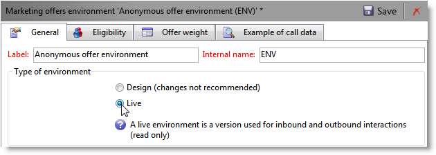

# Allgemeine Konfigurationen{#general-configurations}


In diesem Abschnitt wird die Konfiguration beschrieben, die in Adobe Campaign v7 bei der Migration von v5.11 oder v6.02 durchgeführt werden soll.

Achten Sie außerdem auf Folgendes:

* Wenn Sie von Version 5.11 migrieren, müssen Sie auch die in [diesem Abschnitt](../../migration/using/configuring-your-platform.md#specific-configurations-in-v5-11) beschriebene Konfiguration durchführen.
* Wenn Sie von v6.02 migrieren, müssen Sie auch die in [diesem Abschnitt](../../migration/using/configuring-your-platform.md#specific-configurations-in-v6-02) beschriebene Konfiguration durchführen.

## Zeitzonen {#time-zones}

### Mehrzeitzonenmodus {#multi-time-zone-mode}

In v6.02 war der Modus &quot;Zeitzone mit mehreren Zeitzonen&quot;nur für PostgreSQL-Datenbank-Engines verfügbar. Es wird nun unabhängig vom verwendeten Datenbankmodul angeboten. Wir empfehlen dringend, Ihre Basis in eine &quot;Zeitzone mit mehreren Zeitzonen&quot;umzuwandeln.

Um den TIMESTAMP MIT TIMEZONE-Modus zu verwenden, müssen Sie außerdem die Option **-userTimestamptz:1** zur Befehlszeile nach dem Upgrade hinzufügen.

>[!IMPORTANT]
>
>Wenn der Parameter **-usetimestamptz:1** mit einer inkompatiblen Datenbank-Engine verwendet wird, ist Ihre Datenbank beschädigt und Sie müssen eine Sicherung Ihrer Datenbank wiederherstellen und den oben genannten Befehl erneut ausführen.

>[!NOTE]
>
>Sie können die Zeitzone nach der Migration über die Konsole ändern (**[!UICONTROL Knoten Administration > Plattform > Optionen > WdbcTimeZone]** ).
>
>Weiterführende Informationen zur Zeitzonen-Verwaltung finden Sie in [diesem Abschnitt](../../installation/using/time-zone-management.md).

### Oracle {#oracle}

Wenn beim Postupgrade ein Fehler vom Typ **ORA 01805** auftritt, bedeutet dies, dass die Oracle-Zeitzonendateien zwischen dem Anwendungsserver und dem Datenbankserver nicht synchronisiert sind. Gehen Sie wie folgt vor, um sie erneut zu synchronisieren:

1. Führen Sie den folgenden Befehl aus, um die verwendete Zeitzonendatei zu identifizieren:

   ```
   select * from v$timezone_file
   ```

   Zeitzonendateien befinden sich normalerweise im Ordner **ORACLE_HOME/oracore/zoneinfo/** .

1. Stellen Sie sicher, dass die Zeitzonendateien auf beiden Servern identisch sind.

Weitere Informationen finden Sie unter: [https://docs.oracle.com/cd/E11882_01/server.112/e10729/ch4datetime.htm#NLSPG004](https://docs.oracle.com/cd/E11882_01/server.112/e10729/ch4datetime.htm#NLSPG004).

Eine Zeitzonenabweichung zwischen Client und Server kann ebenfalls zu Verzögerungen führen. Daher empfehlen wir die Verwendung derselben Oracle-Bibliotheksversion auf Client- und Server-Seite. Beide Zeitzonen müssen identisch sein.

So prüfen Sie, ob sich beide Seiten in denselben Zeitzonen befinden:

1. Überprüfen Sie die Version der Zeitzonendatei auf Client-Seite, indem Sie den folgenden Befehl ausführen:

   ```
   genezi -v
   ```

   genezi ist eine Binärdatei im Repository **$ORACLE_HOME/bin**.

1. Überprüfen Sie die Version der Zeitzonendatei auf der Serverseite, indem Sie den folgenden Befehl ausführen:

   ```
   select * from v$timezone_file
   ```

1. Verwenden Sie die Umgebungsvariable **ORA_TZFILE** , um die Zeitzonendatei Client-seitig zu ändern.

## Sicherheit {#security}

### Sicherheitszonen {#security-zones}

>[!IMPORTANT]
>
>Aus Sicherheitsgründen ist die Adobe Campaign-Plattform standardmäßig nicht mehr zugänglich: Sie müssen die Sicherheitszonen konfigurieren und daher IP-Adressen der Benutzer erfassen.

Adobe Campaign v7 beinhaltet das Konzept der **Sicherheitszonen**. Jeder Benutzer muss einer Zone zugeordnet sein, um sich bei einer Instanz anmelden zu können, und die IP-Adresse des Benutzers muss in die in der Sicherheitszone definierten Adressen oder Adressbereiche aufgenommen werden. Die Konfiguration der Sicherheitszonen kann in der Adobe Campaign-Serverkonfigurationsdatei vorgenommen werden. Die Sicherheitszone, der ein Benutzer zugeordnet ist, muss in der Konsole definiert werden (**[!UICONTROL Administration > Zugriffe > Benutzer]**).

**Bitten Sie vor der Migration** Ihren Netzwerkadministrator, Ihnen bei der Definition der Sicherheitszonen zu helfen, die nach der Migration aktiviert werden sollen.

**Nach dem Postupgrade** (vor dem Neustart des Servers) müssen Sie die Sicherheitszonen konfigurieren.

Die Konfiguration der Sicherheitszone finden Sie in [diesem Abschnitt](../../installation/using/security-zones.md).

### Benutzerkennwörter {#user-passwords}

In v7 muss die Verbindung für den Operator **internal** und den Operator **admin** durch ein Kennwort gesichert werden. Es wird dringend empfohlen, diesen Konten und allen Benutzerkonten **vor der Migration** Passwörter zuzuweisen. Wenn Sie kein Kennwort für **internal** angegeben haben, können Sie keine Verbindung herstellen. Geben Sie den folgenden Befehl ein, um **internal** ein Kennwort zuzuweisen:

```
nlserver config -internalpassword
```

>[!IMPORTANT]
>
>Das Kennwort für **internal** muss für alle Tracking-Server identisch sein. Weitere Informationen finden Sie in [diesem Abschnitt](../../installation/using/configuring-campaign-server.md#internal-identifier) und [diesem Abschnitt](../../platform/using/access-management.md).

### Neue Funktionen in v7 {#new-features-in-v7}

* Benutzer ohne Berechtigungen können keine Verbindung mehr zu Adobe Campaign herstellen. Ihre Berechtigungen müssen manuell hinzugefügt werden, z. B. durch Erstellen einer Berechtigung namens **connect**.

  Benutzer, die von dieser Änderung betroffen sind, werden während des Postupgrades identifiziert und aufgeführt.

* Das Tracking funktioniert nicht mehr, wenn das Kennwort leer ist. Sollte dies der Fall sein, wird eine Fehlermeldung angezeigt, die Sie darüber informiert und auffordert, sie neu zu konfigurieren.
* Benutzerkennwörter werden nicht mehr im Schema **xtk:sessionInfo** gespeichert.
* Für die Verwendung der Funktionen **`xtk:builder:EvaluateJavaScript`** und **`xtk:builder:EvaluateJavaScriptTemplate`** sind nun Administratorberechtigungen erforderlich.

Bestimmte vordefinierte Schemata wurden geändert und sind jetzt standardmäßig nur mit Schreibzugriff für Benutzer mit der Berechtigung **admin** verfügbar:

* ncm:publishing
* nl:monitoring
* nms:calendar
* xtk:builder
* xtk:connections
* xtk:dbInit
* xtk:entityBackupNew
* xtk:entityBackupOriginal
* xtk:entityOriginal
* xtk:form
* xtk:funcList
* xtk:fusion
* xtk:image
* xtk:javascript
* xtk:jssp
* xtk:jst
* xtk:navtree
* xtk:operatorGroup
* xtk:package
* xtk:queryDef
* xtk:resourceMenu
* xtk:rights
* xtk:schema
* xtk:scriptContext
* xtk:specFile
* xtk:sql
* xtk:sqlSchema
* xtk:srcSchema
* xtk:strings
* xtk:xslt

### Sessiontoken-Parameter {#sessiontoken-parameter}

In v5 funktionierte der Parameter **sessiontoken** Client-seitig (Liste der Übersichtstypen-Bildschirme, Link-Editor usw.) und serverseitig (Webanwendungen, Berichte, JSP, JSSP usw.). In v7 funktioniert dies nur serverseitig. Wenn Sie zur vollständigen Funktionalität von v5 zurückkehren möchten, müssen Sie die Links mithilfe dieses Parameters ändern und über die Verbindungs-Seite weitergeben:

Link-Beispiel:

```
/view/recipientOverview?__sessiontoken=<trusted login>
```

Neuer Link unter Verwendung der Verbindungsseite:

```
/nl/jsp/logon.jsp?login=<trusted login>&action=submit&target=/view/recipientOverview
```

>[!IMPORTANT]
>
>Wenn Sie einen mit einer vertrauenswürdigen IP-Maske verknüpften Operator verwenden, überprüfen Sie, ob er über die Mindestrechte verfügt und sich im Modus **sessionTokenOnly** in einer Sicherheitszone befindet.

### SQL-Funktionen {#sql-functions}

Unbekannte SQL-Funktionsaufrufe werden nicht mehr automatisch an den Server gesendet. Derzeit müssen alle SQL-Funktionen dem Schema **xtk:funcList** hinzugefügt werden (weitere Informationen hierzu finden Sie in [diesem Abschnitt](../../configuration/using/adding-additional-sql-functions.md)). Bei der Migration wird während des Postupgrades eine Option hinzugefügt, mit der Sie die Kompatibilität mit alten nicht deklarierten SQL-Funktionen gewährleisten können. Wenn Sie diese Funktionen weiterhin verwenden möchten, überprüfen Sie, ob die Option **XtkPassUnknownSQLFunctionsToRDBMS** tatsächlich auf der Knotenebene **[!UICONTROL Administration > Plattform > Optionen]** definiert ist.

>[!IMPORTANT]
>
>Wir empfehlen dringend, diese Option aufgrund der mit ihr verbundenen Sicherheitsrisiken nicht zu verwenden.

### JSSP {#jssp}

Wenn Sie den Zugriff auf bestimmte Seiten über das HTTP-Protokoll (nicht HTTPS) zulassen möchten, müssen Sie beispielsweise in Ihren Web-Apps unabhängig von der Konfiguration in den Sicherheitszonen den Parameter **httpAllowed=&quot;true&quot;** in der entsprechenden Relais-Regel angeben.

Wenn Sie anonyme JSSPs verwenden, müssen Sie den Parameter **httpAllowed=&quot;true&quot;** in einer Relais-Regel für Ihre JSSP (**[!UICONTROL serverConf.xml]** -Datei) hinzufügen:

Beispiel:

```
<url IPMask="" deny="" hostMask="" httpAllowed="true" relayHost="true" relayPath="true"
           status="blacklist" targetUrl="https://localhost:8080" timeout="" urlPath="*/cus/myPublicPage.jssp"/>
```

## Syntax {#syntax}

### JavaScript {#javascript}

Adobe Campaign v7 integriert einen neueren JavaScript-Interpreter. Diese Aktualisierung kann jedoch zu Fehlfunktionen bestimmter Skripte führen. Da die vorherige Engine eher permissiv war, funktionierten bestimmte Syntaxen, was bei der neuen Version der Engine nicht mehr der Fall ist.

Das **[!UICONTROL myObject.Die Syntax @attribute]** ist jetzt nur für XML-Objekte gültig. Diese Syntax kann zur Personalisierung von Sendungen und zum Content Management verwendet werden. Wenn Sie diesen Syntaxtyp für ein Nicht-XML-Objekt verwendet haben, funktionieren die Personalisierungsfunktionen nicht mehr.

Bei allen anderen Objektarten lautet die Syntax nun **[!UICONTROL myObject`[`&quot;attribute&quot;`]`]**. Beispielsweise ein Nicht-XML-Objekt, das die folgende Syntax verwendet hat: **[!UICONTROL employee.@sn]**, muss jetzt die folgende Syntax verwenden: **[!UICONTROL employee`[`&quot;sn&quot;`]`]**.

* Frühere Syntax:

  ```
  employee.@sn
  ```

* Neue Syntax:

  ```
  employee["sn"]
  ```

Um einen Wert in einem XML-Objekt zu ändern, müssen Sie jetzt den Wert aktualisieren, bevor Sie den XML-Knoten hinzufügen:

* Alter JavaScript-Code:

  ```
  var cellStyle = node.style.copy();
  this.styles.appendChild(cellStyle);
  cellStyle.@width = column.@width;
  ```

* Neuer JavaScript-Code:

  ```
  var cellStyle = node.style.copy();
  cellStyle.@width = column.@width;
  this.styles.appendChild(cellStyle);
  ```

Sie können ein XML-Attribut nicht mehr als Tabellenschlüssel verwenden.

* Frühere Syntax:

  ```
  if(serverForm.activities[ctx.activityHistory.activity[0].@name].type !="end")
  ```

* Neue Syntax:

  ```
  if(serverForm.activities[String(ctx.activityHistory.activity[0].@name)].type !="end"
  ```

### SQLData {#sqldata}

Um die Instanzsicherheit zu verbessern, wurde in Adobe Campaign v7 eine neue Syntax eingeführt, die die auf SQLData basierende Syntax ersetzt. Wenn Sie diese Code-Elemente mit dieser Syntax verwenden, müssen Sie sie ändern. Die wichtigsten Punkte sind:

* Filterung nach Unterabfrage: Die neue Syntax basiert auf dem Element `<subQuery>` , um eine Unterabfrage zu definieren
* Aggregate: Die neue Syntax lautet &quot;aggregate function(collection)&quot;
* Filtern nach Join: Die neue Syntax lautet `[schemaName:alias:xPath]`

Das Schema queryDef (xtk:queryDef) wurde geändert:

* Es ist ein neues `<subQuery>` -Element verfügbar, das die in SQLData enthaltene SELECT-Anweisung ersetzt
* Für das Attribut @setOperator werden zwei neue Werte eingeführt: &quot;IN&quot;und &quot;NOT IN&quot;.
* ein neues Element `<where>`, das dem Element `<node>` untergeordnet ist: Hierüber können Sie &quot;Unter-Selektionen&quot;in SELECT vornehmen

Wenn ein &quot;@expr&quot;-Attribut verwendet wird, ist SQLData möglicherweise vorhanden. Es kann nach folgenden Begriffen gesucht werden: &quot;SQLData&quot;, &quot;aliasSqlTable&quot;, &quot;sql&quot;.

Adobe Campaign v7-Instanzen sind standardmäßig gesichert. Die Sicherheit bezieht sich auf die Definitionen der Sicherheitszonen in der Datei **[!UICONTROL serverConf.xml]**: Das Attribut **allowSQLInjection** verwaltet die SQL-Syntaxsicherheit.

Wenn bei der Ausführung des Postupgrades ein SQLData-Fehler auftritt, müssen Sie dieses Attribut ändern, um vorübergehend die Verwendung von SQLData-basierten Syntaxen zuzulassen, sodass Sie den Code neu schreiben können. Dazu muss die folgende Option in der Datei **serverConf.xml** geändert werden:

```
allowSQLInjection="true"
```

Starten Sie daher das Postupgrade mit dem folgenden Befehl neu:

```
nlserver config -postupgrade -instance:<instance_name> -force
```

Sie müssen die Sicherheitszonen konfigurieren (siehe [Sicherheit](#security)) und dann die Sicherheit erneut aktivieren, indem Sie die Option ändern:

```
allowSQLInjection="false"
```

Nachstehend finden Sie komparative Beispiele für die alte und die neue Syntax.

**Filtern nach Unterabfragen**

* Frühere Syntax:

  ```
  <condition expr="@id NOT IN ([SQLDATA[SELECT iOperatorId FROM XtkOperatorGroup WHERE iGroupId = $(../@owner-id)]])" enabledIf="$(/ignored/@ownerType)=1"/>
  ```

* Neue Syntax:

  ```
  <condition setOperator="NOT IN" expr="@id" enabledIf="$(/ignored/@ownerType)=1">
    <subQuery schema="xtk:operatorGroup">
       <select>
         <node expr="[@operator-id]" />
       </select>
       <where>
         <condition expr="[@group-id]=$long(../@owner-id)"/>
       </where>
     </subQuery>
  </condition>
  ```

* Frühere Syntax:

  ```
  <queryFilter name="dupEmail" label="Emails duplicated in the folder" schema="nms:recipient">
      <where>
        <condition sql="sEmail in (select sEmail from nmsRecipient where iFolderId=$(folderId) group by sEmail having count(sEmail)>1)" internalId="1"/>
      </where>
      <folder _operation="none" name="nmsSegment"/>
    </queryFilter>
  ```

* Neue Syntax:

  ```
  <queryFilter name="dupEmail" label=" Emails duplicated in the folder " schema="nms:recipient">
      <where>
        <condition expr="@email" setOperator="IN" internalId="1">
          <subQuery schema="nms:recipient">
            <select><node expr="@email"/></select>
            <where><condition expr="[@folder-id]=$(folderId)"/></where>
            <groupBy><node expr="@email"/></groupBy>
            <having><condition expr="count(@email)>1"/></having>
          </subQuery>
        </condition>
      </where>
      <folder _operation="none" name="nmsSegment"/>
    </queryFilter>
  ```

**Das Aggregat**

Aggregatfunktion(Sammlung)

* Frühere Syntax:

  ```
  <node sql="(select count(*) from NmsNewsgroup WHERE O0.iOperationId=iOperationId)" alias="@nbMessages"/>
  ```

* Neue Syntax:

  ```
  <node expr="count([newsgroup/@id])" alias="../@nbMessages"/>
  ```

  >[!NOTE]
  >
  >Verbindungen werden automatisch für die Aggregatfunktionen ausgeführt. Es ist nicht mehr erforderlich, die Bedingung WHERE O0.iOperationId=iOperationId anzugeben.
  >
  >Es ist nicht mehr möglich, die Funktion &quot;count(&#42;)&quot;zu verwenden. Sie müssen &quot;count()&quot;verwenden.

* Frühere Syntax:

  ```
  <node sql="(select Sum(iToDeliver) from NmsDelivery WHERE O0.iOperationId=iOperationId AND iSandboxMode=0 AND iState>=45)" alias="@nbMessages"/>
  ```

* Neue Syntax:

  ```
  <node expr="Sum([delivery-linkedDelivery/properties/@toDeliver])" alias= "../@sumToDeliver">
                    <where><condition expr="[validation/@sandboxMode]=0 AND @state>=45" /></where></node>
  ```

**Filtert nach Joins**

`[schemaName:alias:xPath]`

Der Alias ist optional

* Frühere Syntax:

  ```
  <condition expr={"[" + joinPart.destination.nodePath + "] = [SQLDATA[W." + joinPart.source.SQLName + "]]"}
                                           aliasSqlTable={nodeSchemaRoot.SQLTable + " W"}/>
  ```

* Neue Syntax:

  ```
  <condition expr={"[" + joinPart.destination.nodePath + "] = [" + nodeSchema.id + ":" + joinPart.source.nodePath + "]]"}/>
  ```

**Tipps und Tricks**

In einem Element `<subQuery>` , um auf ein Feld &quot;field&quot;des Hauptelements `<queryDef>` zu verweisen   -Element verwenden Sie die folgende Syntax: `[../@field]`

Beispiel:

```
<queryDef operation="select" schema="xtk:jobLog" startPath="/" xtkschema="xtk:queryDef">
  <select>
    <node expr="[job/@pid]" alias="@pid"/>
    <node expr="@id" ordered="true"/>
    <node expr="@logType"/>
  </select>
  <where>
    <condition expr="[@job-id]=99"/>
    <condition expr="@logType" setOperator="IN">
      <subQuery schema="xtk:jobLog">
        <select><node expr="@logType"/></select>
        <where><condition expr="[@job-id]=[../job/@id]"/></where>
        <groupBy><node expr="@logType"/></groupBy>
        <having><condition expr="count(@logType)>1"/></having>
      </subQuery>
    </condition>
  </where>
</queryDef>
```

## Konflikte {#conflicts}

Die Migration wird durch ein Postupgrade durchgeführt und Konflikte können in Berichten, Formularen oder Webanwendungen auftreten. Diese Konflikte können über die Konsole gelöst werden.

Nach der Synchronisierung der Ressource können Sie mit dem Befehl **postupgrade** erkennen, ob die Synchronisierung Fehler oder Warnungen erzeugt.

### Synchronisierungsergebnis anzeigen {#view-the-synchronization-result}

Das Synchronisationsergebnis kann auf zwei Arten angezeigt werden:

* In der Befehlszeilenschnittstelle werden Fehler durch einen dreifachen Chevron **>>** materialisiert und die Synchronisation wird automatisch angehalten. Warnungen werden durch einen doppelten Chevron **>>** materialisiert und müssen nach Abschluss der Synchronisation aufgelöst werden. Am Ende des Postupgrades wird an der Eingabeaufforderung eine Zusammenfassung angezeigt. Beispiel:

  ```
  2013-04-09 07:48:39.749Z        00002E7A          1     info    log     =========Summary of the update==========
  2013-04-09 07:48:39.749Z        00002E7A          1     info    log     test instance, 6 warning(s) and 0 error(s) during the update.
  2013-04-09 07:48:39.749Z        00002E7A          1     warning log     The document with identifier 'mobileAppDeliveryFeedback' and type 'xtk:report' is in conflict with the new version.
  2013-04-09 07:48:39.749Z        00002E7A          1     warning log     The document with identifier 'opensByUserAgent' and type 'xtk:report' is in conflict with the new version.
  2013-04-09 07:48:39.750Z        00002E7A          1     warning log     The document with identifier 'deliveryValidation' and type 'nms:webApp' is in conflict with the new version.
  2013-04-09 07:48:39.750Z        00002E7A          1     warning log     Document of identifier 'nms:includeView' and type 'xtk:srcSchema' updated in the database and found in the file system. You will have to merge the two versions manually.
  ```

  Wenn die Warnung einen Ressourcenkonflikt betrifft, muss der Benutzer darauf achten, diesen zu beheben.

* Die Datei **postupgrade_`<server version number>`_time of postupgrade`>`.log** enthält das Synchronisierungsergebnis. Sie ist standardmäßig im folgenden Ordner verfügbar: **Installationsordner/var/`<instance>`postupgrade**. Fehler und Warnungen werden durch die Attribute **error** und **warning** gekennzeichnet.

### Beheben eines Konflikts {#resolve-a-conflict}

Die Behebung von Konflikten darf nur durch erfahrene Benutzer und Benutzer mit Administratorrechten erfolgen.

Gehen Sie wie folgt vor, um einen Konflikt zu lösen:

1. Platzieren Sie in der Adobe Campaign-Baumstruktur den Cursor über **[!UICONTROL Administration > Konfiguration > Paketverwaltung > Konflikte bearbeiten]**.
1. Wählen Sie in der Liste den Konflikt aus, den Sie lösen möchten.

Es gibt drei Möglichkeiten, einen Konflikt zu lösen:

* **[!UICONTROL Als aufgelöst deklariert]**: erfordert vorab eine Operatorintervention.
* **[!UICONTROL Akzeptieren Sie die neue Version]**: Wird empfohlen, wenn die mit Adobe Campaign bereitgestellten Ressourcen vom Benutzer nicht geändert wurden.
* **[!UICONTROL Aktuelle Version beibehalten]**: bedeutet, dass die Aktualisierung abgelehnt wird.

  >[!IMPORTANT]
  >
  Wenn Sie diesen Auflösungsmodus auswählen, riskieren Sie, Patches in der neuen Version zu verlieren. Es wird daher dringend empfohlen, diese Option nicht zu verwenden oder nur erfahrenen Benutzern vorzubehalten.

Wenn Sie den Konflikt manuell lösen möchten, gehen Sie wie folgt vor:

1. Suchen Sie im unteren Bereich des Fensters nach dem Wert **`_conflict_ string`**, um die Entitäten mit Konflikten zu finden. Die mit der neuen Version installierte Entität enthält das **new** -Argument. Die Entität, die mit der vorherigen Version übereinstimmt, enthält das **cus** -Argument.

   

1. Löschen Sie die Version, die Sie nicht beibehalten möchten. Löschen Sie die **`_conflict_argument_ string`** der Entität, die Sie beibehalten.

   

1. Gehen Sie zu dem Konflikt, den Sie gelöst hätten. Klicken Sie auf das Symbol **[!UICONTROL Aktionen]** und wählen Sie **[!UICONTROL Als aufgelöst erklären]** aus.
1. Speichern Sie Ihre Änderungen: Der Konflikt ist jetzt gelöst.

<!--
## Tomcat {#tomcat}

The integrated Tomcat server in Adobe Campaign v7 has changed version. Its installation folder (tomcat-6) has therefore also changed (tomcat 7). After the postupgrade, make sure to check that the paths do link to the updated folder (in the **[!UICONTROL serverConf.xml]** file):

```
$(XTK_INSTALL_DIR)/tomcat-X/bin/bootstrap.jar 
$(XTK_INSTALL_DIR)/tomcat-X/bin/tomcat-juli.jar
$(XTK_INSTALL_DIR)/tomcat-X/lib/tomcat-util.jar
$(XTK_INSTALL_DIR)/tomcat-X/lib/tomcat-api.jar
$(XTK_INSTALL_DIR)/tomcat-X/lib/servlet-api.jar
$(XTK_INSTALL_DIR)/tomcat-X/lib/jsp-api.jar
$(XTK_INSTALL_DIR)/tomcat-X/lib/el-api.jar
```
-->

## Interaktion {#interaction}

### Voraussetzungen {#prerequisites}

**Vor dem Postupgrade** müssen Sie alle Schemareverweise aus 6.02 löschen, die nicht mehr in v7 vorhanden sind.

* nms:emailOfferView
* nms:webOfferView
* nms:callCenterOfferView
* nms:mobileOfferView
* nms:paperOfferView

### Angebotsinhalt {#offer-content}

In v7 wurde der Angebotsinhalt verschoben. In v6.02 befanden sich die Inhalte in jedem Darstellungsschema (**nms:emailOfferView**). In v7 befindet sich der Inhalt nun im Angebotsschema. Nach dem Postupgrade ist der Inhalt daher nicht mehr in der Benutzeroberfläche sichtbar. Nach dem Postupgrade müssen Sie den Angebotsinhalt neu erstellen oder ein Skript entwickeln, das den Inhalt automatisch vom Darstellungsschema in das Angebotsschema verschiebt.

>[!IMPORTANT]
>
Wenn einige Sendungen, die konfigurierte Angebote verwenden, nach der Migration gesendet werden sollen, müssen Sie alle diese Sendungen in v7 löschen und neu erstellen. Wenn dies nicht möglich ist, wird ein &quot;Kompatibilitätsmodus&quot;angeboten. Dieser Modus wird nicht empfohlen, da Sie nicht von allen neuen Funktionen in Interaction v7 profitieren werden. Dies ist ein Übergangsmodus, mit dem Sie laufende Kampagnen vor der aktuellen Migration von 6.1 abschließen können. Für weitere Informationen zu diesem Modus kontaktieren Sie uns bitte.

Ein Beispiel für ein Bewegungsskript (**interactionTo610_full_XX.js**) ist im Ordner **Migration** im Ordner Adobe Campaign v7 verfügbar. Diese Datei zeigt ein Beispiel eines Skripts für einen Client, der eine einzelne E-Mail-Darstellung pro Angebot verwendet (die Felder **[!UICONTROL htmlSource]** und **[!UICONTROL textSource]** ). Der Inhalt in der Tabelle **NmsEmailOfferView** wurde in die Angebotstabelle verschoben.

>[!NOTE]
>
Die Verwendung dieses Skripts ermöglicht es nicht, von den Optionen &quot;Content Management&quot; und &quot;Rendering-Funktionen&quot; zu profitieren. Um diese Funktionen nutzen zu können, müssen Sie die Angebote des Katalogs, insbesondere den Angebotsinhalt und die Konfigurationsbereiche, überdenken.

```
loadLibrary("/nl/core/shared/nl.js");

NL.require("/nl/core/shared/xtk.js");

// 1. Restore old emailOfferView schema
logInfo("Restoring old emailOfferView schema");
var oldOfferViewSchemas = <entities schema="xtk:srcSchema"/>;

oldOfferViewSchemas.appendChild(
  <srcSchema img="nms:offerView.png"
             label="Email offer representations"
             labelSingular="Email offer representation"
             name="emailOfferView" namespace="nlmig"
             genAccessors="false" implements="xtk:persist">
    <element name="emailOfferView" template="nms:offerView" sqltable="NmsEmailOfferView">
      <element name="offer" revLabel="Email representation" revIntegrity="owncopy"/>
      <element   name="htmlSource"      type="html" label="HTML content"  xml="true"/>
      <element   name="textSource"      type="CDATA" label="Text content" xml="true"/>
      <element   name="htmlSource_jst"  type="CDATA" label="HTML script"  desc="HTML content calculation script."  xml="true" advanced="true"/>
      <element   name="textSource_jst"  type="CDATA" label="Text script" desc="Text content calculation script." xml="true" advanced="true"/>
    </element>
  </srcSchema>);

var oldOfferViewsPkg = <builder><package buildNumber="*">{oldOfferViewSchemas}</package></builder>;
xtk.builder.InstallPackage(oldOfferViewsPkg);

// 2. Migrate data from old emailOfferView table to nms:offer
logInfo("Moving data from old EmailOfferView table to NmsOffer");
var OFFER_STATUS_VALIDATED = 3;

var queryDef = xtk.queryDef.create(
  <queryDef operation="select" schema="nlmig:emailOfferView">
    <select>
      <node expr="[@offer-id]"/>
      <node expr="[@space-id]"/>
      <node expr="htmlSource_jst"/>
      <node expr="textSource_jst"/>
    </select>
  </queryDef>);
var res = queryDef.ExecuteQuery();

var processedOffers = {};
for each( var emailOfferView in res.emailOfferView )
{
  if( processedOffers[String(emailOfferView.@["offer-id"])] != undefined )
  {
    logWarning("Found 2 or more eff fffffmail representations for offer " + String(emailOfferView.@["offer-id"]) + ". Only keep the first one here.");
    continue;
  }
  xtk.session.Write(
    <offer id={emailOfferView.@["offer-id"]} status={OFFER_STATUS_VALIDATED} xtkschema="nms:offer">
      <view>
        {emailOfferView.mdSource_jst}
        {emailOfferView.textSource_jst}
      </view>
    </offer>
  );
  processedOffers[String(emailOfferView.@["offer-id"])] = 1;
}

// 3. Get rid of emailOfferView schema now that data has been moved.
logInfo("Deleting EmailOfferView schema");
xtk.session.Write(<srcSchema xtkschema="xtk:srcSchema" name="emailOfferView" namespace="nlmig" _operation="delete"/>);

logInfo("Done");
```

### Tests und Konfiguration {#tests-and-configuration}

Gehen Sie wie folgt vor, nachdem Sie den Angebotsinhalt verschoben haben, wenn Sie nur über eine Umgebung verfügen. Nehmen wir in diesem Fall &quot;ENV&quot; als Beispiel.

1. Aktualisieren Sie in allen Angebotsplatzierungen der ENV-Umgebung die Liste der verwendeten Felder. Beispiel: Für eine Platzierung, die nur den Wert **[!UICONTROL htmlSource]** verwendet, müssen Sie den Wert **[!UICONTROL view/htmlSource]** hinzufügen.

   

1. Wählen Sie im Feld **[!UICONTROL Umgebungstyp]** auf der Registerkarte **[!UICONTROL Allgemein]** die Option **[!UICONTROL Live]** aus.

   

1. Erstellen Sie eine Design-Umgebung (z. B. &quot;ENV_DESIGN&quot;) und verbinden Sie sie mit der ENV-Online-Umgebung.

   

1. Stellen Sie alle Angebotsplatzierungen der Umgebung &quot;ENV&quot;bereit (klicken Sie mit der rechten Maustaste auf > **[!UICONTROL Aktionen > Bereitstellen]**) und wählen Sie die Umgebung &quot;ENV_DESIGN&quot;aus.

   

1. Führen Sie dasselbe für alle &quot;ENV&quot;-Umgebungsangebote aus.
1. Aktivieren Sie alle Umgebungsangebote &quot;ENV_DESIGN&quot; auf den entsprechenden Kanälen.
1. Testen, wie ein Angebot live geschaltet wird Wenn keine Probleme auftreten, führen Sie ausstehende Aufgaben für die letzte Workflow-Aufgabe **[!UICONTROL Angebotsbenachrichtigung]** (offerMgt) aus, damit alle Angebote live geschaltet werden.

   

1. Führen Sie umfassende Tests durch.

   >[!NOTE]
   >
   Die Namen der Kategorien und Angebote werden nach der Live-Schaltung geändert. Aktualisieren Sie im eingehenden Kanal alle Verweise auf Angebote und Kategorien.

## Berichte {#reports}

### Standardberichte {#standard-reports}

Alle Standardberichte verwenden derzeit die Rendering-Engine v6.x. Wenn Sie JavaScript zu diesen Berichten hinzugefügt haben, funktionieren bestimmte Elemente möglicherweise nicht mehr. Die alte Version von JavaScript ist nicht mit der Rendering-Engine v6.x kompatibel. Daher müssen Sie den JavaScript-Code überprüfen und ihn später anpassen. Sie sollten jeden Bericht testen, insbesondere die Exportfunktion.

### Personalisierte Berichte {#personalized-reports}

<!--If you want to have the blue banner from v7 (allowing you access to the tabs), you must republish reports. If you encounter problems, you can force the v6.0 rendering engine. To do this, go to **[!UICONTROL Properties]** within the report, click **[!UICONTROL Rendering]** and choose the **[!UICONTROL Version 6.0 (Flash & OpenOffice)]** rendering engine.


-->
Wenn Sie von den neuen Berichtfunktionen profitieren möchten, müssen Sie die Berichte erneut veröffentlichen. Überprüfen Sie in diesem Fall alle Skripte und ändern Sie sie bei Bedarf. Was den PDF-Export betrifft, so funktioniert dies nicht mehr mit der neuen PDF-Export-Engine (PhantomJS), wenn Sie ein spezifisches Skript für Open Office hinzugefügt haben.

## Web-Anwendungen {#web-applications}

Es gibt zwei Webanwendungsfamilien:

* identifizierte Webanwendungen (zusammengesehen, Validierungsformulare, interne Entwicklungen im Extranet),
* Anonyme Webanwendungen (Web- oder Fragebogenformulare).

### Identifizierte Webanwendungen {#identified-web-applications}

Genau wie bei Berichten ([Mehr erfahren](#reports)) müssen Sie, wenn Sie JavaScript hinzugefügt haben, diese bei Bedarf überprüfen und anpassen. Wenn Sie vom blauen Banner v7 (mit den blauen Tabs) profitieren möchten, müssen Sie die Webanwendung erneut veröffentlichen.

Die Verbindungsmethoden für Webanwendungen wurden in v7 geändert. Wenn in Ihren identifizierten Webanwendungen Verbindungsprobleme auftreten, müssen Sie die Optionen **allowUserPassword** und **sessionTokenOnly** in der Datei **serverConf.xml** vorübergehend aktivieren. Ändern Sie nach dem Postupgrade die folgenden Optionswerte:

```
allowUserPassword="true"
```

```
sessionTokenOnly="true"
```

Starten Sie daher das Postupgrade mit dem folgenden Befehl neu:

```
nlserver config -postupgrade -instance:<instance_name> -force
```

Testen Sie Ihre Webanwendungen in der v6.x-Rendering-Engine, bevor Sie sie veröffentlichen. Deaktivieren Sie dann diese beiden Optionen.

```
allowUserPassword="false"
```

```
sessionTokenOnly="false"
```

### Anonyme Webanwendungen {#anonymous-web-applications}

Wenn Probleme auftreten, veröffentlichen Sie die Webanwendung erneut.
