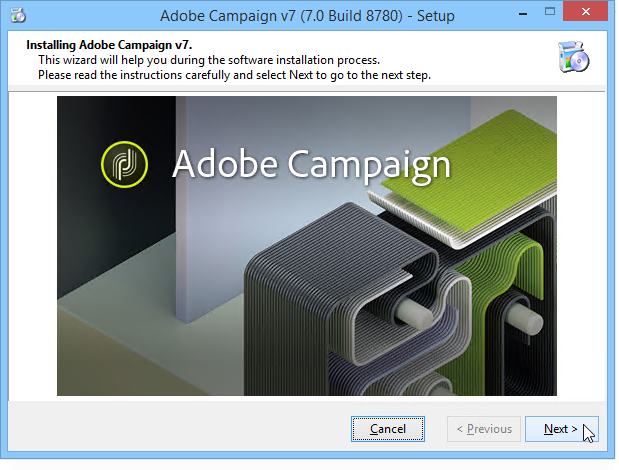

# Migrieren einer Microsoft Windows-Plattform zu Campaign v7{#migrating-in-windows-for-adobe-campaign}


Für eine Microsoft Windows-Umgebung sind die Migrationsschritte wie folgt:

1. Alle Dienste beenden - [Weitere Infos](#service-stop).
1. Datenbank sichern - [Weitere Infos](#back-up-the-database).
1. Plattform migrieren - [Weitere Infos](#deploying-adobe-campaign-v7).
1. Migrieren des Weiterleitungsservers (IIS) - [Weitere Infos](#migrating-the-redirection-server--iis-).
1. Re-Start-Dienst - [Weitere Infos](#re-starting-the-services).
1. Löschen und Bereinigen der vorherigen Adobe Campaign-Version - [Weitere Infos](#deleting-and-cleansing-adobe-campaign-previous-version).

## Service stop {#service-stop}

Beenden Sie zunächst alle Prozesse mit Zugriff auf die Datenbank auf allen betroffenen Computern.

1. Alle Server, die das Umleitungsmodul verwenden (**webmdl** -Dienst) angehalten werden. Führen Sie für IIS den folgenden Befehl aus:

   ```
   iisreset /stop
   ```

1. Die **mta** -Modul und die untergeordneten Module (**mtachild**) muss mit den folgenden Befehlen beendet werden:

   ```
   nlserver stop mta@<instance name>
   nlserver stop mtachild@<instance name>
   ```

1. Beenden Sie die Adobe Campaign-Dienste auf allen Servern. Melden Sie sich mit Administratorrechten an und führen Sie den folgenden Befehl aus:

   ```
   net stop nlserver6
   ```

   Wenn Sie von Version 5.11 migrieren, führen Sie den folgenden Befehl aus:

   ```
   net stop nlserver5
   ```

1. Stellen Sie für jeden Server sicher, dass die Adobe Campaign-Dienste ordnungsgemäß beendet sind. Melden Sie sich mit Administratorrechten an und führen Sie den folgenden Befehl aus:

   ```
   tasklist /FI "IMAGENAME eq nlserver*"
   ```

   Die Liste der aktiven Prozesse mit ihrer ID (PID) wird angezeigt.

   ```
   Image Name                     PID Session Name        Session#    Mem Usage
   ========================= ======== ================ =========== ============
   nlserver.exe                  3192 Console                    1     13,108 K
   ```

1. Wenn ein oder mehrere Adobe Campaign-Prozesse nach einigen Minuten noch aktiv sind oder blockiert werden, beenden Sie sie. Melden Sie sich mit Administratorrechten an und führen Sie den folgenden Befehl aus:

   ```
   taskkill /IM nlserver* /T
   ```

1. Wenn einige Prozesse nach einigen Minuten noch aktiv sind, können Sie sie mithilfe des Befehls zum Schließen zwingen:

   ```
   taskkill /F /IM nlserver* /T
   ```

## Sichern der Campaign-Datenbank {#back-up-the-database}

Das Verfahren hängt von Ihrer vorherigen Adobe Campaign-Version ab.

### Für Adobe Campaign v5.11 {#migrating-from-adobe-campaign-v5-11}

1. Erstellen Sie eine Sicherungskopie der Adobe Campaign-Datenbank.
1. Erstellen Sie eine Sicherungskopie der **Neolane v5** Verzeichnis mit dem folgenden Befehl:

   ```
   ren "Neolane v5" "Neolane v5.back"
   ```

   >[!IMPORTANT]
   >
   >Als Vorsichtsmaßnahme empfehlen wir Ihnen, die **Neolane v5.back** und speichern Sie sie an einem anderen sicheren Speicherort als dem Server.

1. Deaktivieren Sie in der Windows-Dienstverwaltungskonsole den automatischen Start des Anwendungsserverdienstes 5.11. Sie können auch den folgenden Befehl verwenden:

   ```
   sc config nlserver5 start= disabled
   ```

1. Bearbeiten Sie die **config-`<instance name>`.xml** (im **Neolane v5. back** -Ordner), um die **mta**, **wfserver**, **stat**, usw. Dienste automatisch starten. Ersetzen Sie beispielsweise **autoStart** mit **_autoStart**.

   ```
   <?xml version='1.0'?>
   <serverconf>
     <shared>
       <dataStore hosts="myServer*" lang="en_US">
         <dataSource name="default">
           <dbcnx encrypted="1" login="myLogin" password="myPassword"  provider="postgresql" server="myServer"/>
         </dataSource>
       </dataStore>
     </shared>
   
     <mta _autoStart="true" statServerAddress="myStatServer"/>
     <stat _autoStart="true"/>
     <wfserver _autoStart="true"/>
     <inMail _autoStart="true"/>
     <sms _autoStart="false"/>
   </serverconf>
   ```

### Für Adobe Campaign v6.02 {#migrating-from-adobe-campaign-v6-02}

1. Erstellen Sie eine Sicherungskopie der Adobe Campaign-Datenbank.
1. Erstellen Sie eine Sicherungskopie der **Neolane v6** Verzeichnis mit dem folgenden Befehl:

   ```
   ren "Neolane v6" "Neolane v6.back"
   ```

   >[!IMPORTANT]
   >
   >Als Vorsichtsmaßnahme empfehlen wir Ihnen, die **Neolane v6.back** und speichern Sie sie an einem anderen sicheren Speicherort als dem Server.

1. Deaktivieren Sie im Windows Service Manager den automatischen Start des 6.02-Anwendungsservers. Sie können auch den folgenden Befehl verwenden:

   ```
   sc config nlserver6 start= disabled
   ```

1. Bearbeiten Sie die **config-`<instance name>`.xml** (im **Neolane v6. back** -Ordner), um die **mta**, **wfserver**, **stat**, usw. Dienste automatisch starten. Ersetzen Sie beispielsweise **autoStart** mit **_autoStart**.

   ```
   <?xml version='1.0'?>
   <serverconf>
     <shared>
       <dataStore hosts="myServer*" lang="en_US">
         <dataSource name="default">
           <dbcnx encrypted="1" login="myLogin" password="myPassword" provider="postgresql" server="myServer"/>
         </dataSource>
       </dataStore>
     </shared>
   
     <mta _autoStart="true" statServerAddress="myStatServer"/>
     <stat _autoStart="true"/>
     <wfserver _autoStart="true"/>
     <inMail _autoStart="true"/>
     <sms _autoStart="false"/>
   </serverconf>
   ```

### Für Adobe Campaign v6.1 {#migrating-from-adobe-campaign-v6-1}

1. Erstellen Sie eine Sicherungskopie der Adobe Campaign-Datenbank.
1. Erstellen Sie eine Sicherungskopie der **Adobe Campaign v6** Verzeichnis mit dem folgenden Befehl:

   ```
   ren "Adobe Campaign v6" "Adobe Campaign v6.back"
   ```

   >[!IMPORTANT]
   >
   >Als Vorsichtsmaßnahme empfehlen wir Ihnen, die **Adobe Campaign v6.back** und speichern Sie sie an einem anderen sicheren Speicherort als dem Server.

1. Deaktivieren Sie in der Windows-Dienstverwaltungskonsole den automatischen Start des 6.11-Anwendungsserverdiensts. Sie können auch den folgenden Befehl verwenden:

   ```
   sc config nlserver6 start= disabled
   ```

## Adobe Campaign v7 bereitstellen {#deploying-adobe-campaign-v7}

Die Bereitstellung von Adobe Campaign erfolgt in zwei Schritten:

* Installieren von Build v7: Dieser Vorgang muss auf jedem Server ausgeführt werden.
* Nach der Aktualisierung: Dieser Befehl muss auf jeder Instanz gestartet werden.

Gehen Sie wie folgt vor, um Adobe Campaign bereitzustellen:

1. Installieren Sie den neuesten Adobe Campaign v7-Build, indem Sie die **setup.exe** Installationsdatei. Weitere Informationen zum Installieren des Adobe Campaign-Servers unter Windows finden Sie unter [diesem Abschnitt](../../installation/using/installing-the-server.md).

   

   >[!NOTE]
   >
   >Adobe Campaign v7 wird standardmäßig im **C:\Program Files\Adobe\Adobe Campaign v7** Verzeichnis.

1. Um das Installationsprogramm der Clientkonsole verfügbar zu machen, kopieren Sie die **setup-client-7.0.XXXX.exe** in den Adobe Campaign-Installationsordner: **C:\Program Files\Adobe\Adobe Campaign v7\datakit\nl\eng\jsp**.

   >[!NOTE]
   >
   >Weitere Informationen zur Installation von Adobe Campaign unter Windows finden Sie unter [diesem Abschnitt](../../installation/using/installing-the-server.md).

1. Starten Sie die Instanz für die erste Verwendung mit den folgenden Befehlen:

   ```
   net start nlserver6-v7
   net stop nlserver6-v7
   ```

   >[!NOTE]
   >
   >Mit diesen Befehlen können Sie das interne Dateisystem von Adobe Campaign v7 erstellen: **conf** Verzeichnis (mit dem **config-default.xml** und **serverConf.xml** -Dateien), **var** Verzeichnis usw.

1. Kopieren Sie die Konfigurationsdateien und Unterordner jeder Instanz über das **Neolane v5.back**, **Neolane v6.back** oder **Adobe Campaign v6.back** Backup-Datei (abhängig von der Version, von der Sie migrieren - siehe [diesem Abschnitt](#back-up-the-database-and-the-current-installation)).
1. Führen Sie je nach Version, von der Sie migrieren, die folgenden Befehle aus:

   ```
   copy "Neolane v5.back"/conf/config-<instance name>.xml "Adobe Campaign v7"/conf/
   copy "Neolane v5.back"/customers/* "Adobe Campaign v7"/customers/
   copy "Neolane v5.back"/var/* "Adobe Campaign v7"/var/
   ```

   ```
   copy "Neolane v6.back"/conf/config-<instance name>.xml "Adobe Campaign v7"/conf/
   copy "Neolane v6.back"/customers/* "Adobe Campaign v7"/customers/
   copy "Neolane v6.back"/var/* "Adobe Campaign v7"/var/
   ```

   ```
   copy "Adobe Campaign v6.back"/conf/config-<instance name>.xml "Adobe Campaign v7"/conf/
   copy "Adobe Campaign v6.back"/customers/* "Adobe Campaign v7"/customers/
   copy "Adobe Campaign v6.back"/var/* "Adobe Campaign v7"/var/
   ```

   >[!IMPORTANT]
   >
   >Kopieren Sie für den ersten oben genannten Befehl nicht die **config-default.xml** -Datei.

1. Im **serverConf.xml** und **config-default.xml** -Dateien von Adobe Campaign v7 die spezifischen Konfigurationen anwenden, die Sie in der vorherigen Version von Adobe Campaign hatten. Für **serverConf.xml** -Datei, verwenden Sie die **Neolane v5/conf/serverConf.xml.diff**, **Neolane v6/conf/serverConf.xml.diff** oder **Adobe Campaign v6/conf/serverConf.xml.diff** -Datei.

   >[!NOTE]
   >
   >Stellen Sie beim Reporting von Konfigurationen aus der vorherigen Version von Adobe Campaign in Adobe Campaign v7 sicher, dass die Pfade zu den physischen Ordnern zu Adobe Campaign v7 führen (und nicht zu Neolane v5, Neolane v6 oder Adobe Campaign v6).

1. Laden Sie die Adobe Campaign v7-Konfiguration mit dem folgenden Befehl neu:

   ```
   nlserver config -reload
   ```

1. Starten Sie den Postupgrade-Prozess mit dem folgenden Befehl:

   ```
   nlserver config -postupgrade -instance:<instance name>
   ```

>[!IMPORTANT]
>
>Starten Sie die Adobe Campaign-Dienste noch nicht: einige Änderungen müssen auf IIS vorgenommen werden.

## Migrieren des Weiterleitungsservers {#migrating-the-redirection-server--iis-}

In diesem Schritt muss der IIS-Server angehalten werden. Siehe [Service stop](#service-stop).

1. Öffnen Sie die **Internet Information Services (IIS) Manager** Konsole.
1. Ändern Sie die Bindungen (Listen-Ports) der Site, die für die vorherige Adobe Campaign-Version verwendet wird:

   * Klicken Sie mit der rechten Maustaste auf die für die vorherige Adobe Campaign-Version verwendete Site und wählen Sie **[!UICONTROL Bindungen bearbeiten]**.
   * Für jeden Typ von Überwachungsanschluss (**[!UICONTROL http]** und/oder **[!UICONTROL https]**), wählen Sie die gewünschte Zeile aus und klicken Sie auf **[!UICONTROL Bearbeiten]**.
   * Geben Sie einen anderen Anschluss ein. Standardmäßig beträgt der Listener-Port 80 für HTTP und 443 für HTTPS. Überprüfen Sie, ob der neue Port verfügbar ist.

      

      >[!NOTE]
      >
      >Wenn Ihr IIS-Server mehrere Websites für Adobe Campaign mit einer erweiterten Konfiguration (freigegebener Port und verschiedene IP-Adressen) enthält, wenden Sie sich an Ihren Administrator.

1. Erstellen Sie eine neue Website für Adobe Campaign v7:

   * Klicken Sie mit der rechten Maustaste auf die **[!UICONTROL Sites]** Ordner und wählen Sie **[!UICONTROL Website hinzufügen...]**.

      

   * Geben Sie den Namen der Site ein, **Adobe Campaign v7** beispielsweise.
   * Der Zugriffspfad zum Basisverzeichnis der Website wird nicht verwendet, aber die Variable **[!UICONTROL Pfad für physischen Zugriff]** angegeben werden. Geben Sie den standardmäßigen IIS-Zugriffspfad ein: **C:\inetpub\wwwroot**.
   * Klicken Sie auf **[!UICONTROL Verbinden als...]** und stellen Sie sicher, dass **[!UICONTROL Anwender]** ausgewählt ist.
   * Sie können die Standardwerte im **[!UICONTROL IP-Adresse]** und **[!UICONTROL Port]** -Felder. Wenn Sie andere Werte verwenden möchten, stellen Sie sicher, dass die IP-Adresse und/oder der Port verfügbar sind.
   * Überprüfen Sie die **[!UICONTROL Website sofort starten]** ankreuzen.

      

1. Führen Sie die **is_neolane_setup.vbs** -Skript zur automatischen Konfiguration der vom Adobe Campaign-Server für das zuvor erstellte virtuelle Verzeichnis verwendeten Ressourcen.

   * Diese Datei finden Sie im **`[Adobe Campaign v7]`\conf** Verzeichnis, wobei **`[Adobe Campaign v7]`** ist der Zugriffspfad zum Adobe Campaign-Installationsordner. Der Befehl zum Ausführen des Skripts lautet wie folgt (für Administratoren):

      ```
      cd C:\Program Files (x86)\Adobe Campaign\Adobe Campaign v7\conf
      cscript iis_neolane_setup.vbs
      ```

   * Klicken **[!UICONTROL OK]** , um die Ausführung des Skripts zu bestätigen.

      

   * Geben Sie die Nummer der zuvor für Adobe Campaign v7 erstellten Website ein und klicken Sie auf **[!UICONTROL OK]**.

      

   * Es sollte eine Bestätigungsmeldung angezeigt werden:

      

   * Im **[!UICONTROL Inhaltsansicht]** müssen Sie sicherstellen, dass die Website-Konfiguration korrekt mit Adobe Campaign-Ressourcen konfiguriert ist:

      

      >[!NOTE]
      >
      >Wenn die Baumstruktur nicht angezeigt wird, starten Sie IIS neu.
      >
      >Die folgenden IIS-Konfigurationsschritte werden im Abschnitt [diesem Abschnitt](../../installation/using/integration-into-a-web-server-for-windows.md#configuring-the-iis-web-server).

## Sicherheitszonen {#security-zones}

Wenn Sie von v6.02 oder früher migrieren, müssen Sie Ihre Sicherheitszonen konfigurieren, bevor Sie Dienste starten. [Weitere Informationen](../../migration/using/general-configurations.md#security)

## Re-Start-Dienste {#re-starting-the-services}

Starten Sie IIS- und Adobe Campaign-Dienste auf jedem der folgenden Server:

1. Tracking- und Weiterleitungsserver.
1. Mid-Sourcing-Server.
1. Marketing-Server.

Bevor Sie mit dem nächsten Schritt fortfahren, führen Sie einen vollständigen Test der neuen Installation durch, stellen Sie sicher, dass keine Regressionen vorhanden sind und dass alles funktioniert, indem Sie alle Empfehlungen unter [diese Seite](../../migration/using/general-configurations.md).

## Löschen der vorherigen Version {#deleting-and-cleansing-adobe-campaign-previous-version}

Das Verfahren hängt von Ihrer vorherigen Adobe Campaign-Version ab.

### Für Adobe Campaign v5 {#adobe-campaign-v5}

Bevor Sie die Adobe Campaign v5-Installation löschen und bereinigen, müssen Sie die folgenden Empfehlungen beachten:

* Holen Sie sich die Funktionsteams, um eine vollständige Prüfung der Neuinstallation durchzuführen.
* Deinstallieren Sie Adobe Campaign v5 nur, wenn Sie sicher sind, dass kein Rollback erforderlich ist.

1. Löschen Sie in IIS die **Neolane v5** Website, dann die **Neolane v5** Anwendungspool.
1. Benennen Sie die **Neolane v5.back** Ordner als **Neolane v5**.
1. Deinstallieren Sie Adobe Campaign v5 mithilfe des Assistenten zum Hinzufügen/Entfernen von Komponenten .

   

1. Löschen Sie die **nlserver5** Windows-Dienst mit dem folgenden Befehl:

   ```
   sc delete nlserver5
   ```

1. Starten Sie den Server neu.

### Für Adobe Campaign v6.02 {#adobe-campaign-v6-02}

Bevor Sie die Installation von Adobe Campaign v6.02 löschen und bereinigen, müssen Sie die folgenden Empfehlungen beachten:

* Holen Sie sich die Funktionsteams, um eine vollständige Prüfung der Neuinstallation durchzuführen.
* Deinstallieren Sie Adobe Campaign v6.02 nur, wenn Sie sicher sind, dass kein Rollback erforderlich ist.

1. Löschen Sie in IIS die **Neolane v6** Website, dann die **Neolane v6** Anwendungspool.
1. Benennen Sie die **Neolane v6.back** Ordner als **Neolane v6**.
1. Deinstallieren Sie Adobe Campaign v6.02 mithilfe des Assistenten zum Hinzufügen/Entfernen von Komponenten.

   

1. Starten Sie den Server neu.

### Für Adobe Campaign v6.1 {#adobe-campaign-v6-1}

Bevor Sie die Adobe Campaign v6-Installation löschen und bereinigen, müssen Sie die folgenden Empfehlungen beachten:

* Holen Sie sich die Funktionsteams, um eine vollständige Prüfung der Neuinstallation durchzuführen.
* Deinstallieren Sie Adobe Campaign v6 nur, wenn Sie sicher sind, dass kein Rollback erforderlich ist.

1. Löschen Sie in IIS die **Adobe Campaign v6** Website, dann die **Adobe Campaign v6** Anwendungspool.
1. Benennen Sie die **Adobe Campaign v6.back** Ordner als **Adobe Campaign v6**.
1. Deinstallieren Sie Adobe Campaign v6 mithilfe des Assistenten zum Hinzufügen/Entfernen von Komponenten.

   

1. Starten Sie den Server neu.
