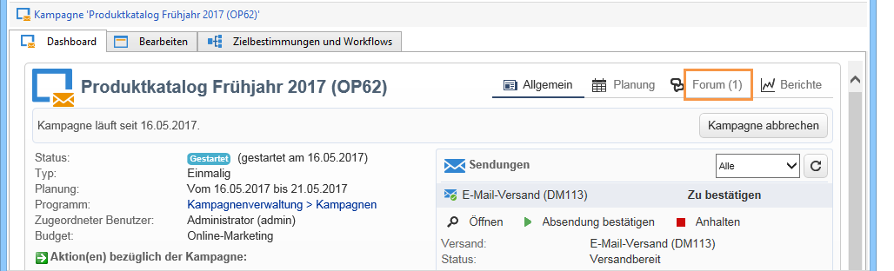
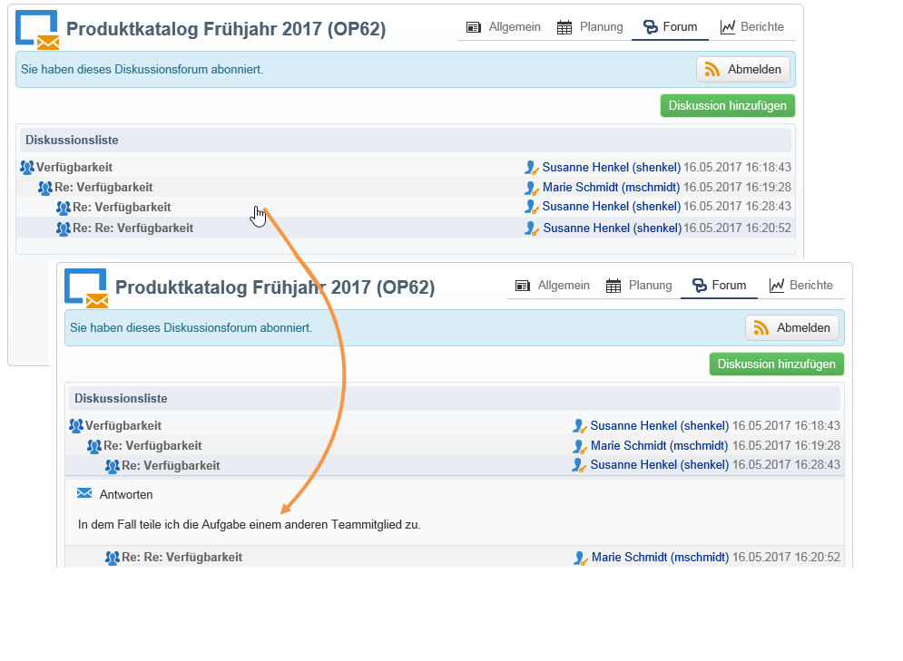
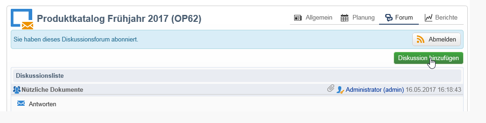
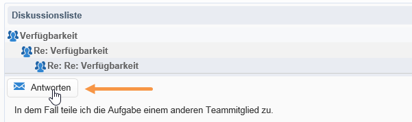
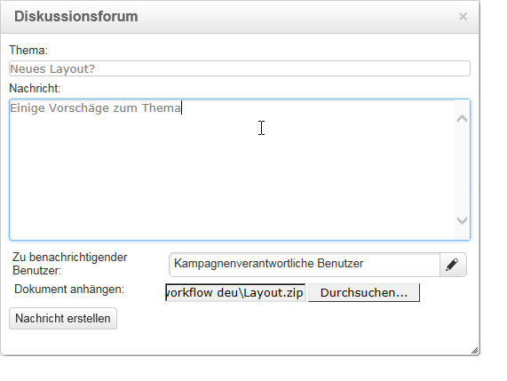
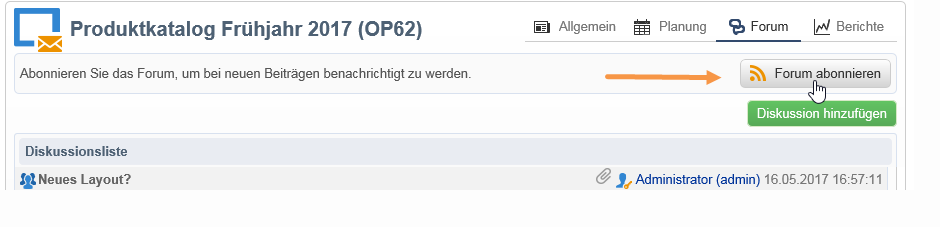
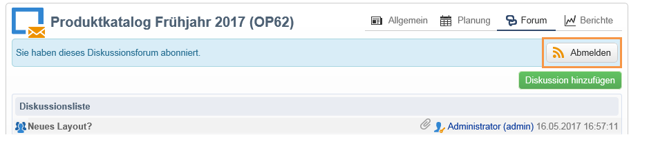
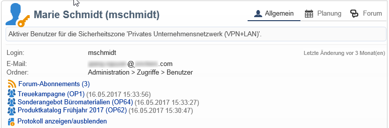
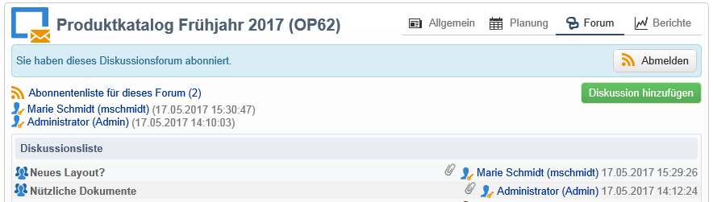

# Diskussionsforen{#discussion-forums}

Adobe Campaign-Benutzende können Diskussionsforen verwenden, um Informationen auszutauschen. Die folgenden Elemente verfügen jeweils über ein eigenes Forum: Pläne, Programme, Kampagnen, Ressourcen, Simulationen, Lager. Jeder Benutzer hat auch ein persönliches Forum. Alle Diskussionen sind öffentlich, auch in persönlichen Foren.

Benutzer können Foren abonnieren, um per E-Mail über jede gepostete Nachricht informiert zu werden.

## Zugriff auf ein Forum {#accessing-a-forum}

Um auf das Forum einer Kampagne, einer Benutzerin bzw. eines Benutzers usw. zuzugreifen, klicken Sie rechts oben im jeweiligen Dashboard auf den Link **[!UICONTROL Forum]**. Im Link ist auch die Gesamtzahl der Nachrichten im jeweiligen Forum angegeben.

## Forum verwenden {#using-a-forum}

Nachrichten und ihre Antworten werden chronologisch geordnet (von neu nach alt).

Um den Inhalt einer Nachricht anzuzeigen, klicken Sie auf ihren Header.

**Neue Diskussionen beginnen**

Um eine neue Diskussion zu beginnen, klicken Sie auf die Schaltfläche **[!UICONTROL Diskussion hinzufügen]** rechts oben. Das Feld **[!UICONTROL Diskussionsforum]** wird angezeigt (siehe unten).

**Nachrichten in einer existierenden Diskussion posten**

Um eine Nachricht in einer existierenden Diskussion zu posten, öffnen Sie die Nachricht, auf die Sie antworten möchten, und klicken Sie auf den Link **[!UICONTROL Antworten]** links oberhalb der Nachricht. Das Feld **[!UICONTROL Diskussionsforum]** wird angezeigt (siehe unten).

Wenn Sie auf eine Nachricht antworten, wird der Autor der Nachricht per E-Mail benachrichtigt.

**Eine Nachricht schreiben**

Gehen Sie ins Fenster **[!UICONTROL Diskussionsforum]**:

1. Geben Sie den gewünschten Text im Feld **[!UICONTROL Nachricht]** und gegebenenfalls einen Diskussionstitel im Feld **[!UICONTROL Thema]** ein.

   

1. Bei Bedarf:

   * Wenn Sie möchten, dass eine nicht beim Forum angemeldete Person an der Diskussion teilnimmt, nutzen Sie das Feld **[!UICONTROL Zu benachrichtigender Benutzer]**. Die Benutzerin bzw. der Benutzer erhält eine Benachrichtigungs-E-Mail für diese spezifische Nachricht (eine Anmeldung beim Forum erfolgt nicht). Um mehrere Benutzende zu benachrichtigen, wählen Sie eine Benutzergruppe aus.
   * Um der Nachricht einen Anhang hinzuzufügen, klicken Sie auf **[!UICONTROL Durchsuchen]**. Der Anhang wird auch der Benachrichtigungs-E-Mail hinzugefügt. Anhänge dürfen nur einzeln gesendet werden. Um mehrere Dateien zu senden, müssen Sie sie in einer ZIP-Datei komprimieren.

1. Klicken Sie auf **[!UICONTROL Nachricht erstellen]**, um eine Nachricht im Forum zu posten.

>[!NOTE]
>
>Wenn eine Nachricht in das Forum gepostet wurde, kann sie nicht mehr geändert oder gelöscht werden.

## Posts im persönlichen Benutzerforum eines Benutzers {#posting-to-the-personal-forum-of-an-operator}

Sie haben die Möglichkeit, eine Nachricht im persönlichen Forum einer Person zu posten, wenn sich diese zum Beispiel nicht auf eine bestimmte Kampagne bezieht, Sie jedoch den Diskussionsverlauf in Adobe Campaign nachverfolgen möchten. Persönliche Foren sind öffentlich und alle Benutzenden können Ihre Nachricht sehen. Die Benutzenden erhalten jedes Mal eine E-Mail-Benachrichtigung, wenn jemand etwas in ihren persönlichen Foren postet.

Es gibt folgende Möglichkeiten, auf ein Benutzerforum zuzugreifen:

* Wählen Sie, wenn Sie über die entsprechenden Berechtigungen verfügen, im Knoten **[!UICONTROL Administration > Zugriffe > Benutzer]** des Explorers das Dashboard des gewünschten Benutzers aus und klicken Sie auf den Link **[!UICONTROL Forum]** oben rechts.
* Wenn nicht, suchen Sie den Namen des Benutzers in Adobe Campaign (über eine von diesem Benutzer im Forum gepostete Nachricht, eine ihm zugewiesene Aufgabe) und klicken Sie darauf, um auf sein Dashboard zuzugreifen. Sie können Ihren Administrator auch bitten, eine Ansicht des Benutzerordners zu erstellen.

## Forum abonnieren {#subscribing-to-a-forum}

Wenn Sie ein Forum abonnieren, können Sie die Diskussionen verfolgen. Sie erhalten jedes Mal eine E-Mail-Benachrichtigung, wenn eine Nachricht im Forum gepostet wird. Diese E-Mail enthält den Nachrichtentext und alle Anhänge. Um eine Nachricht zu beantworten, klicken Sie auf den E-Mail-Text und melden Sie sich in der Web-Oberfläche von Adobe Campaign an. Wenn Sie ein Forum abonnieren, ist dies für alle sichtbar.

* Um ein Forum zu abonnieren, klicken Sie auf die Schaltfläche **[!UICONTROL Forum abonnieren]** rechts oberhalb der Diskussionsliste.

  

  Daraufhin erscheint ein blaues Band, in dem ihr Abonnement bestätigt wird.

* Wenn Sie sich von einem Forum abmelden möchten, klicken Sie auf die Schaltfläche **[!UICONTROL Abmelden]** in dem blauen Band.

  

* In Ihrem persönlichen Dashboard werden die von Ihnen abonnierten Foren aufgelistet. Klicken Sie auf den Link **[!UICONTROL Forum-Abonnements]**, um die Liste anzuzeigen, und anschließend auf das Forum, auf das Sie zugreifen möchten.

  

  Weitere Informationen zu persönlichen Dashboards finden Sie in [diesem Abschnitt](../../platform/using/access-management-operators.md).

* Um die Abonnenten eines Forums anzuzeigen, klicken Sie auf **[!UICONTROL Abonnentenliste für dieses Forum]** oberhalb der Nachrichtenliste.

  

## Versand einer Benachrichtigung überprüfen {#checking-notification-delivery}

Falls Abonnenten eines Forums nicht die erwarteten Benachrichtigungen erhalten, empfehlen wir folgende Vorgehensweise:

* Stellen Sie sicher, dass die Benutzer eine E-Mail-Adresse in ihrem Profil angebeben haben.
* Gehen Sie zum Knoten **[!UICONTROL Administration > Betreibung > Technische Workflows > Kampagnenprozesse]** und stellen Sie sicher, dass der Workflow **[!UICONTROL Aufträge in Diskussionsforen]** gestartet und nicht fehlgeschlagen ist.
* Überprüfen Sie die Versandlogs, die wie folgt zugänglich sind:

   * Gehen Sie von der Adobe Campaign-Startseite aus zu **[!UICONTROL Kampagnen > Navigation > Sendungen]** und öffnen Sie den Versand **[!UICONTROL Benachrichtigungen bezüglich Diskussionforen]**.
   * Gehen Sie im Explorer zum Knoten **[!UICONTROL Administration > Automatisch erstellte Objekte > Technische Sendungen > Workflow-Benachrichtigungen]** und klicken Sie auf **[!UICONTROL Benachrichtigungen bezüglich Diskussionsforen]**.

  Im Fenster **[!UICONTROL Benachrichtigungen bezüglich Diskussionsforen]** befinden sich die Versandlogs auf der Registerkarte **[!UICONTROL Bearbeiten > Versand]**. Überprüfen Sie ebenfalls die Tabs **[!UICONTROL Verfolgung > Protokoll]** und **[!UICONTROL Ausschlussgründe]**.
