# Marketing-Ressourcen verwalten{#managing-marketing-resources}

Mit Adobe Campaign können Sie die am Kampagnenlebenszyklus beteiligten Marketing-Ressourcen verwalten und verfolgen. Bei diesen Marketingressourcen kann es sich um eine Broschüre, eine visuelle Hilfe oder ein anderes Kommunikationsmedium handeln, an dem mehrere Benutzende beteiligt sind.

Status, Verlauf und aktuelle Version der über Adobe Campaign verwalteten Marketing-Ressourcen können jederzeit angezeigt werden.

## Hinzufügen von Marketing-Ressourcen {#adding-a-marketing-resource}

Marketing-Ressourcen sind über den Tab **[!UICONTROL Kampagnen]** zugänglich.

Um eine Ressource hinzuzufügen, klicken Sie auf die Schaltfläche **[!UICONTROL Erstellen]**.

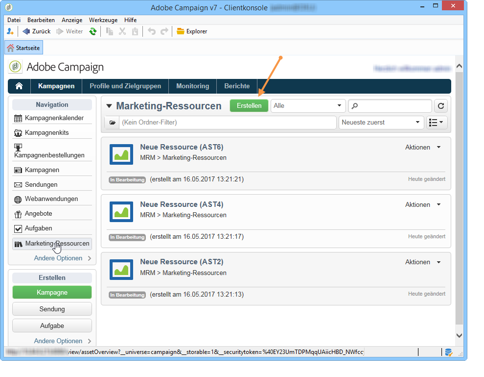

Um eine Ressource auf dem Adobe Campaign-Server verfügbar zu machen, legen Sie die gewünschte Ressource per Drag-and-Drop im mittleren Bereich des Editors ab. Sie können auch auf den Link **[!UICONTROL Datei auf den Server laden...]** klicken.

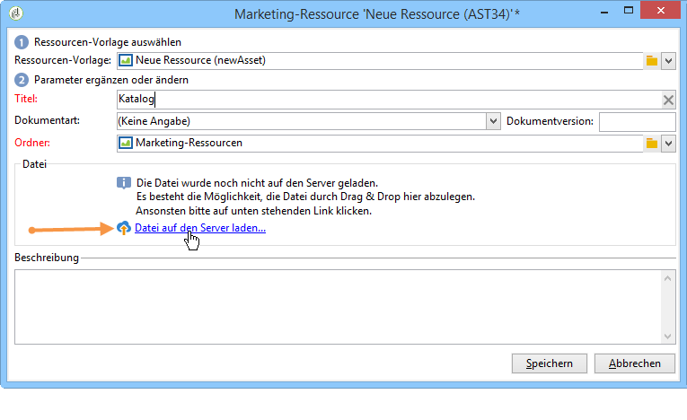

Über eine Bestätigungsnachricht kann der Upload gestartet werden.

Nach Abschluss des Hochladens wird die Ressource der Liste der verfügbaren Ressourcen hinzugefügt. Sie steht Adobe Campaign-Benutzern zur Verfügung. die Datei auf dem Server aktualisieren.**&#x200B;**&#x200B;**&#x200B;**

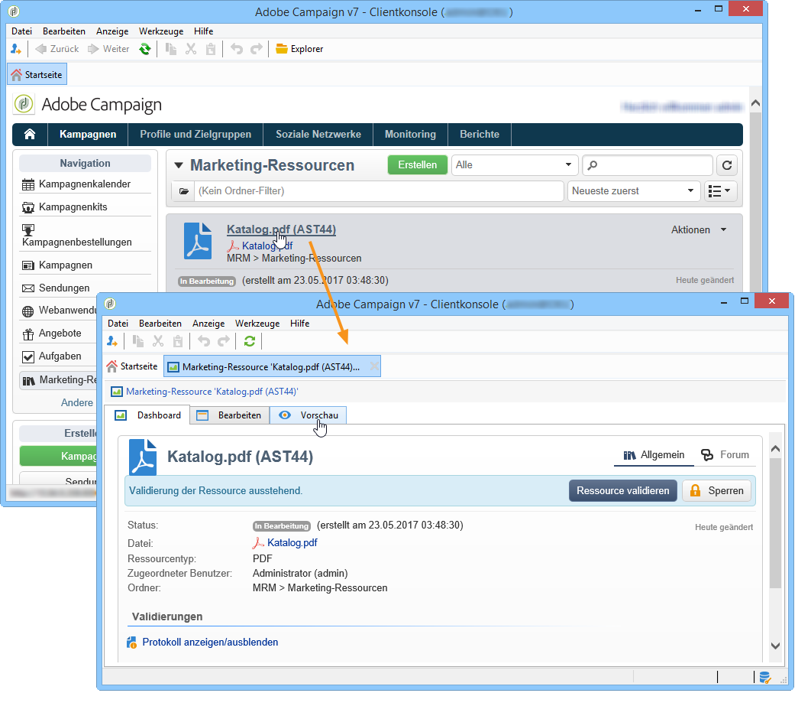

Klicken Sie auf **[!UICONTROL Allgemein]** zur Auswahl der Benutzer oder Benutzergruppen, die für die Überwachung, Verfolgung und Validierung dieser Ressource zuständig sind. Bestimmen Sie in den Rubriken **[!UICONTROL Erweiterte Parameter]** die für Kontrolle, Verfolgung und Validierung der Ressource verantwortlichen Benutzer oder Benutzergruppen.

* Der Benutzer, dem die Ressource zugeordnet wurde, ist für ihre Verfolgung verantwortlich.
* Der genehmigende Benutzer ist für die Genehmigung der Marketing-Ressource verantwortlich. Sie werden benachrichtigt, wenn der Ressourcenvalidierungsprozess gestartet wird.

  Wenn kein validierungsverantwortlicher Benutzer ausgewählt wurde, **[!UICONTROL kann]** die Ressource nicht zur Validierung unterbreitet werden.

* Bei Bedarf kann zudem in der Rubrik Verfolgung ein Korrekturleser bestimmt werden.

Sie können ein unverbindliches Verfügbarkeitsdatum für die Ressource festlegen. Nach diesem Datum wird sie mit dem Status **[!UICONTROL Überfällig]** angezeigt.

## Kollaboratives Arbeiten an Ressourcen {#collaborative-work-on-resources}

Sie können eine Marketing-Ressource ändern und aktualisieren und bei Bedarf andere Adobe Campaign-Benutzer darüber informieren. Sie haben folgende Möglichkeiten:

* Ressourcen lokal herunterladen, um sie zu bearbeiten;
* Dateien auf dem Server aktualisieren und für andere Benutzer zugänglich machen;
* Ressourcen sperren, um Änderungen durch andere Benutzer zu verbieten.

>[!NOTE]
>
>Die Registerkarte **[!UICONTROL Verlauf]** enthält das Download- und Aktualisierungsprotokoll für die Ressource. Über die Schaltfläche **[!UICONTROL Details]** können Sie die ausgewählte Version anzeigen.

### Ressourcen sperren/entsperren {#locking-unlocking-a-resource}

Nach ihrer Erstellung sind die Ressourcen für die Benutzer im Dashboard der Marketing-Ressourcen verfügbar und sie können bearbeitet und verändert werden.

Wenn ein Benutzer an einer Ressource arbeiten möchte, ist es besser, sie vor dem Beginn der Arbeit zu sperren, damit andere Benutzer sie nicht gleichzeitig ändern können. Die Ressource wird dann reserviert. Sie bleibt verfügbar, kann jedoch von einem anderen Benutzer nicht veröffentlicht oder auf dem Server aktualisiert werden.

Folgende Nachricht informiert Benutzer, die auf eine reservierte Ressource zugreifen möchten:

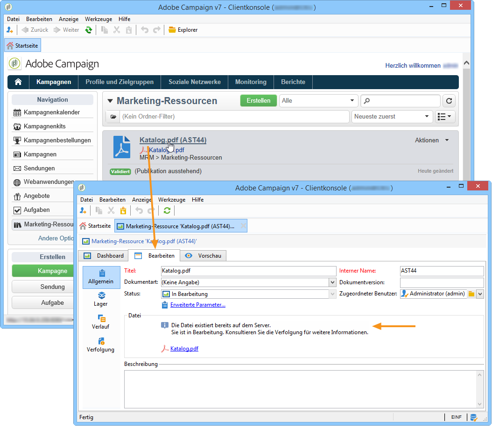

Im Tab **[!UICONTROL Verfolgung]** können der Name des Benutzers, der die Ressource gesperrt hat, sowie das vorgesehene Freigabedatum nachgelesen werden.

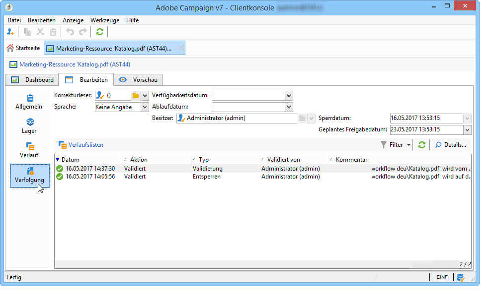

Um eine Ressource zu sperren, klicken Sie auf die Ressource und anschließend auf die Schaltfläche **[!UICONTROL Sperren]** im Ressourcen-Dashboard.

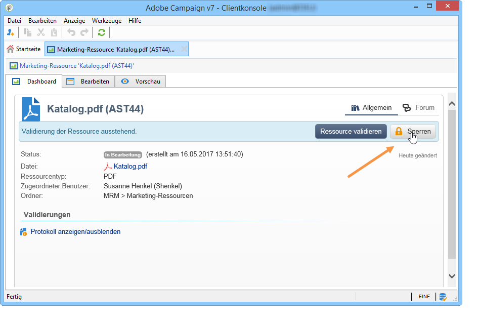

Sie können das geplante Rückgabedatum im Tab **[!UICONTROL Verfolgung]** der Ressource angeben.

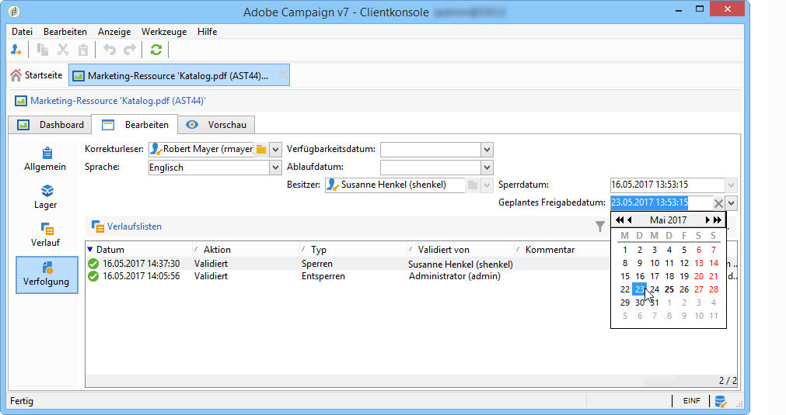

Auf diese Weise können andere Adobe Campaign-Benutzer darüber informiert werden, wann die Ressource wieder entsperrt wird.

Nach der Aktualisierung wird die Ressource automatisch entsperrt, um sie wieder für alle Benutzer verfügbar zu machen.

Sie kann jedoch bei Bedarf auch manuell über das Dashboard entsperrt werden.

>[!NOTE]
>
>Nur der Benutzer, der die Ressource gesperrt hat, und solche mit Administrator-Berechtigungen sind befugt, eine gesperrte Ressource zu entsperren.

### Diskussionsforen {#discussion-forums}

An einer Ressource beteiligte Benutzer haben im Tab **[!UICONTROL Forum]** die Möglichkeit, Informationen austauschen.

Die Funktionsweise von Foren in Adobe Campaign wird im Abschnitt [Diskussionforen](../../mrm/using/discussion-forums.md) dargestellt.

## Lebenszyklus von Marketing-Ressourcen {#life-cycle-of-a-marketing-resource}

Wenn die Ressource erstellt wird, werden Adobe Campaign-Benutzende damit beauftragt, die Ressource zu entwerfen, zu prüfen, zu genehmigen und zu veröffentlichen. Für diese Kampagnen kann eine Dauer festgelegt werden.

Der Tab **[!UICONTROL Verfolgung]** ermöglicht die Überprüfung der an der Ressource vorgenommenen Änderungen: Validierungen, Validierungsablehnungen, Kommentare und Veröffentlichungen.

Im Tab **[!UICONTROL Verlauf]** werden die für die jeweilige Ressource durchgeführten Dateiübertragungen angezeigt.

### Validierungsprozess {#approval-process}

Das erwartete Verfügbarkeitsdatum wird in den Ressourcendetails angezeigt, wenn es auf der Registerkarte **[!UICONTROL Tracking]** angegeben wurde. Sobald dieses Datum erreicht ist, können Sie den Validierungsprozess über die Schaltfläche **[!UICONTROL Zur Validierung unterbreiten]** im Ressourcen-Dashboard ausführen. Der Ressourcenstatus ändert sich dann in **[!UICONTROL Validierung in Gang]**.

Eine Ressource kann über die Schaltfläche **[!UICONTROL Ressource validieren]** in ihrem Dashboard validiert werden.

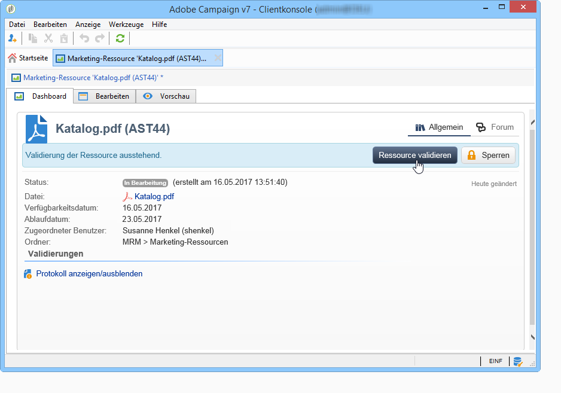

Autorisierte Benutzerinnen und Benutzer können dann die Validierung akzeptieren oder ablehnen. Diese Aktion kann über den Link in der Benachrichtigungs-E-Mail oder über die Schaltfläche **[!UICONTROL Validieren]** in der Konsole ausgeführt werden.

Im Validierungsfenster kann ein Kommentar eingegeben werden.

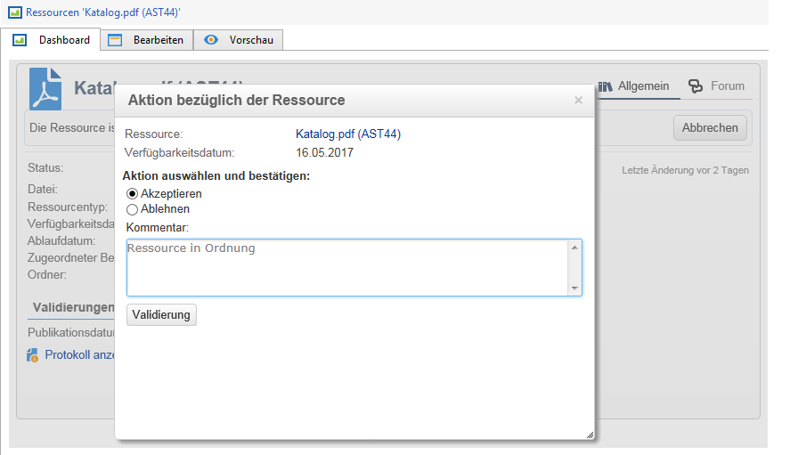

Im Tab **[!UICONTROL Verfolgung]** können alle Benutzer die unterschiedlichen Etappen des Validierungsprozesses verfolgen.

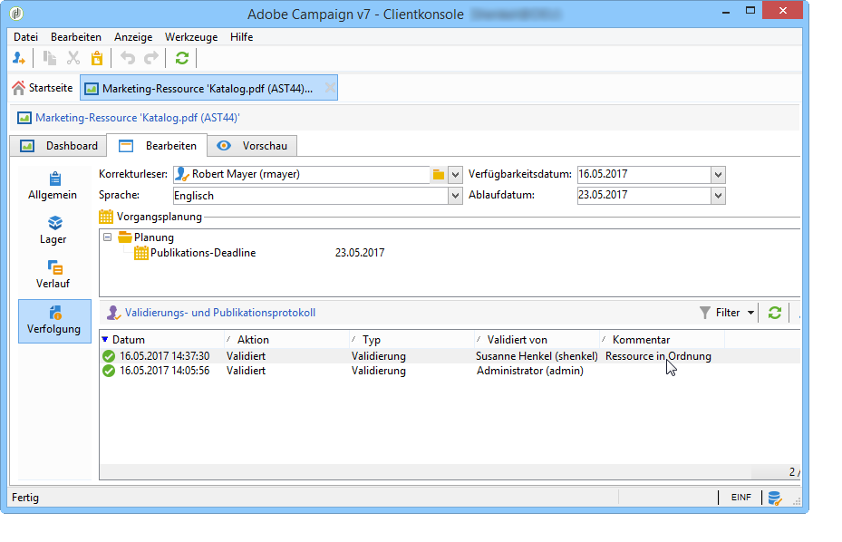

>[!NOTE]
>
>Neben dem in jeder Marketing-Ressource bestimmten Validierer sind auch Benutzer mit Administrator-Berechtigungen sowie der Ressourcen-Verantwortliche befugt, die jeweilige Ressource zu validieren.

### Ressourcen veröffentlichen {#publishing-a-resource}

Nach der Genehmigung muss die Marketing-Ressource veröffentlicht werden. Der Publikationsprozess muss entsprechend den Anforderungen des Unternehmens spezifisch implementiert werden. Das bedeutet, dass Ressourcen in einem Extranet oder auf einem anderen Server veröffentlicht werden können, bestimmte Informationen an einen externen Dienstleister gesendet werden können usw.

Geben Sie den Zugriff auf eine Ressource frei, indem Sie auf die Schaltfläche **[!UICONTROL Veröffentlichen]** in ihrem Dashboard klicken.

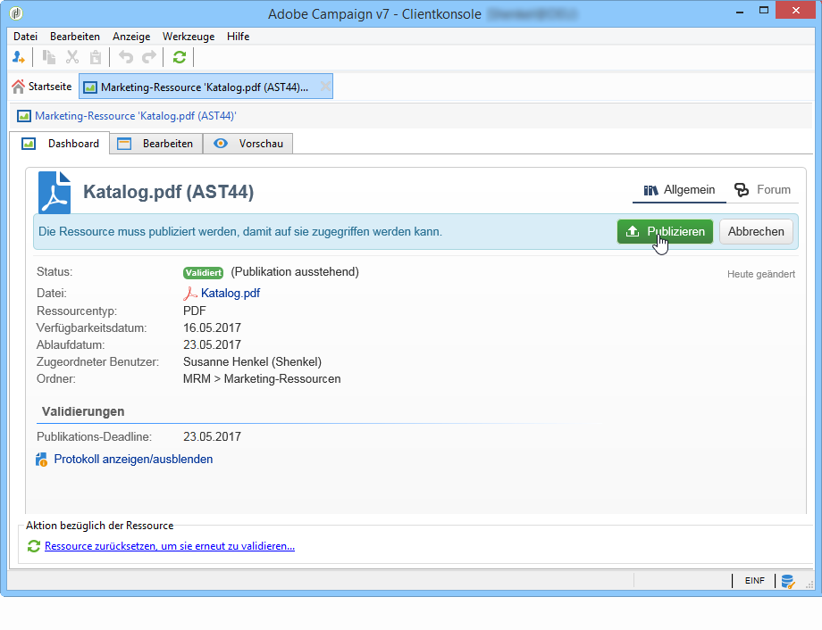

Die Ressourcenveröffentlichung kann auch über einen Workflow automatisiert werden.

Ressourcen veröffentlichen bedeutet, sie zur Verwendung bereitzustellen (z. B. durch eine andere Aufgabe). Die Veröffentlichung als solche hängt von der Art Ihrer Ressource ab: Für einen Flyer kann die Veröffentlichung bedeuten, dass die Datei an einen Drucker gesendet wird, für eine Web-Agentur, dass sie auf einer Website veröffentlicht wird usw.

Damit Adobe Campaign eine Ressource veröffentlichen kann, müssen Sie einen geeigneten Workflow erstellen und ihn mit der Ressource verknüpfen. Öffnen Sie hierzu den Link **[!UICONTROL Erweiterte Parameter]** der Ressource und wählen Sie den gewünschten Workflow im Feld **[!UICONTROL Anschlussvorgang]** aus.

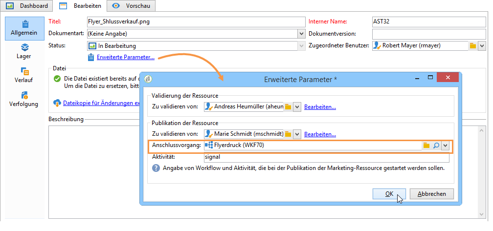

Der Workflow wird ausgeführt, wenn

* der Validierer der Veröffentlichung (oder, wenn dieser nicht definiert wurde, der Ressourcen-Verantwortliche) auf **[!UICONTROL Ressource veröffentlichen]** klickt
* die Ressource über eine Aufgabe zur Erstellung einer Marketing-Ressource verwaltet wird und die Aufgabe den Status **[!UICONTROL Abgeschlossen]** erhält; zudem muss die Option **[!UICONTROL Marketing-Ressource veröffentlichen]** in der Aufgabe aktiviert worden sein (siehe [Aufgabe „Erstellung einer Marketing-Ressource“](../../mrm/using/creating-and-managing-tasks.md#marketing-resource-creation-task))

Wenn der Workflow nicht unmittelbar gestartet wird (zum Beispiel wenn die Workflow-Engine angehalten ist), erhält die Ressource den Status **[!UICONTROL Veröffentlichung ausstehend]**. Nach dem Start des Workflows ändert sich der Status der Ressource in **[!UICONTROL Veröffentlicht]**. Dieser Status berücksichtigt keine möglichen Fehler im Veröffentlichungsprozess. Überprüfen Sie den Status Ihres Workflows, um sicherzustellen, dass er ordnungsgemäß ausgeführt wurde.

## Verknüpfung von Ressourcen mit einer Kampagne {#linking-a-resource-to-a-campaign}

### Ressourcen referenzieren {#referencing-a-marketing-resource}

Marketing-Ressourcen können mit Kampagnen verknüpft werden, sofern diese Option in der Kampagnenvorlage ausgewählt wurde.

>[!NOTE]
>
>Erstellung und Konfiguration der Kampagnenvorlagen werden im Abschnitt [&#128279;](../../campaign/using/marketing-campaign-templates.md#campaign-templates)kampagnenvorlagen dargestellt.

Gehen Sie hierzu im Dashboard der Kampagne zum Tab **[!UICONTROL Bearbeiten > Dokumente > Ressourcen]** und klicken Sie auf **[!UICONTROL Hinzufügen]**, um eine Ressource auszuwählen.

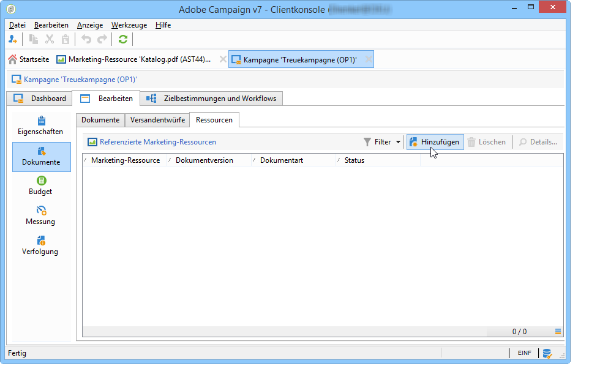

Sie können die Ressourcen nach Status, Dokumentart und Ressourcentyp filtern oder einen benutzerdefinierten Filter anwenden.

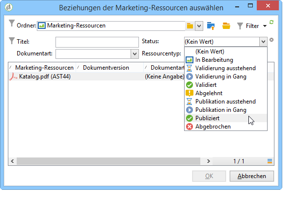

Klicken Sie auf die Schaltfläche **[!UICONTROL OK]**, um die ausgewählte Ressource der Liste der referenzierten Marketing-Ressourcen dieser Kampagne hinzuzufügen.

Über die Schaltfläche **[!UICONTROL Details]** kann die Ressource angesehen und bearbeitet werden.

Die hinzugefügten Ressourcen werden im Dashboard angezeigt. Sie können dort auch bearbeitet werden.

### Ressourcen einem Versandentwurf hinzufügen {#adding-a-marketing-resource-to-a-delivery-outline}

Marketing-Ressourcen können über Versandentwürfe mit Sendungen verknüpft werden.

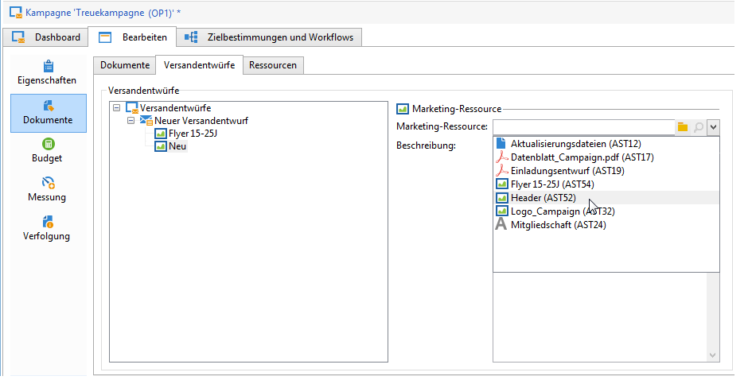

>[!NOTE]
>
>Weitere Informationen zu Versandentwürfen finden Sie unter [Ressourcen in einem Versandentwurf verknüpfen](../../campaign/using/marketing-campaign-deliveries.md#associating-and-structuring-resources-linked-via-a-delivery-outline).

## Lagerverwaltung {#stock-management}

Sie können eine Marketing-Ressource mit einem oder mehreren Lagern verknüpfen, um den Vorrat zu verwalten und bei unzureichendem Vorrat einen Warnhinweis im Dashboard anzuzeigen.

>[!NOTE]
>
>Nähere Informationen zur Lagerverwaltung in Adobe Campaign erhalten Sie im Abschnitt [Lagerverwaltung &#x200B;](../../campaign/using/providers-stocks-and-budgets.md#stock-management).

Um eine Marketing-Ressource mit einem Lager zu verknüpfen, bearbeiten Sie die Lagerzuordnung und bearbeiten oder erstellen Sie ein Lager. Fügen Sie eine Lagerposition hinzu und wählen Sie die entsprechende Marketing-Ressource aus.

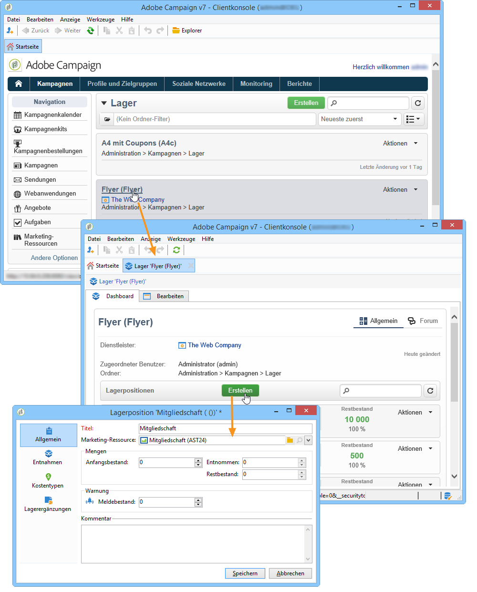

Bei Bedarf können Sie die Marketing-Ressource nach ihrer Auswahl über das Lupensymbol **[!UICONTROL Verknüpftes Element öffnen]** rechts von der Ressource bearbeiten.

Geben Sie den Anfangsbestand sowie den Meldebestand an und speichern Sie.

Das Lager wird im Detail der Ressource angegeben.

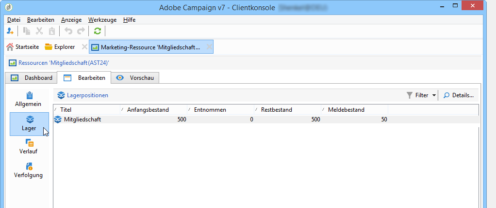

Wenn der Lagerbestand unzureichend ist, wird den zuständigen Benutzern ein Warnhinweis gesendet.

## Erweiterte Funktionen {#advanced-functions}

Im Dashboard Marketing-Ressourcen können Sie die üblichen Arten von Vorgängen ausführen: Hinzufügen, Bearbeiten, Sperren/Entsperren, Genehmigen, Veröffentlichen. Über die Adobe Campaign-Baumstruktur können Sie andere Arten von Marketing-Ressourcen erstellen und auf erweiterte Funktionen zugreifen. Klicken Sie hierzu auf der Adobe Campaign-Startseite auf die **[!UICONTROL Explorer]**-Schaltfläche.

Marketing-Ressourcen werden standardmäßig im Knoten **[!UICONTROL MRM > Marketing-Ressourcen]** des Navigationsbaums gespeichert.

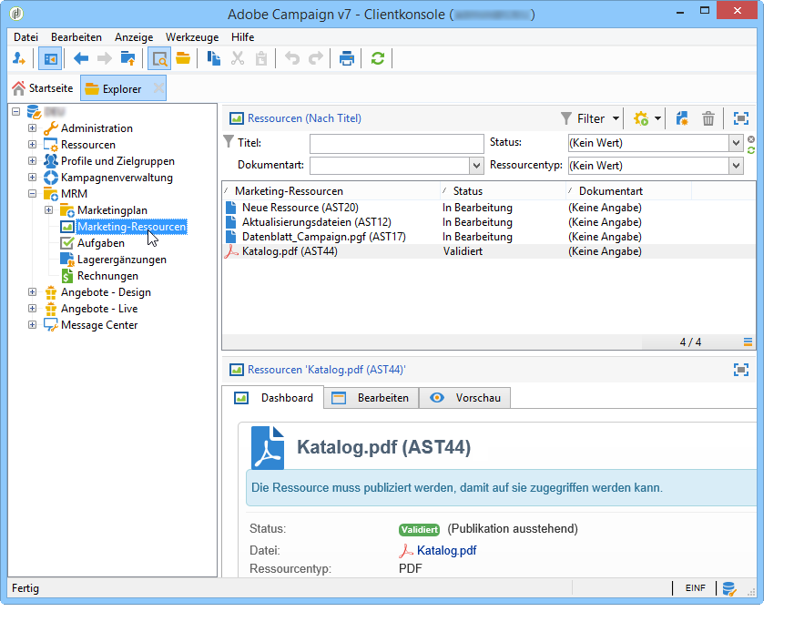

Folgende Ressourcen können über diese Ansicht hinzufügt werden:

* Datei
* HTML
* Text
* URL
