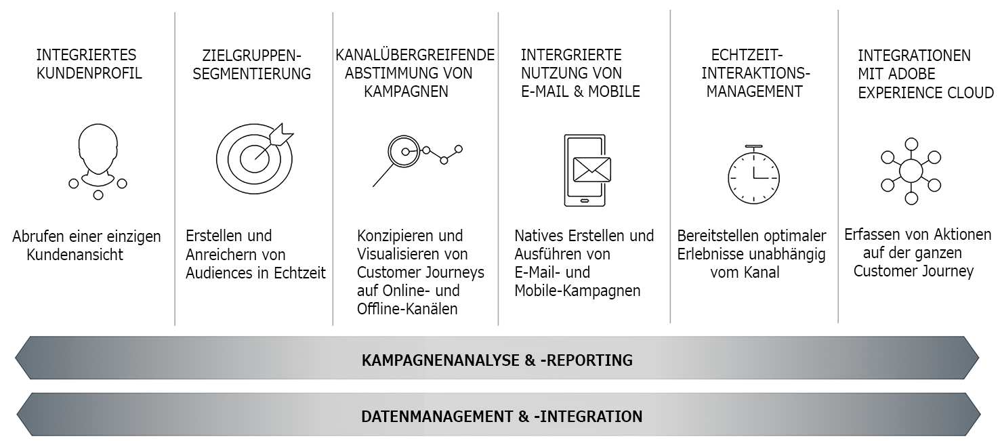

# Get Started with Campaign Classic{#about-adobe-campaign-classic}

Um ein hohes Maß an Kundeninteraktion und herausragende Erlebnisse zu schaffen, müssen Marken auf allen Kontaktpunkten eine konsistente Customer Journey bereitstellen. Jetzt können Marketer effizient kanalübergreifende Marketing-Kampagnen konzipieren, planen, verwalten und optimieren, die einen hohen ROI bieten und die Kundentreue fördern.

Adobe Campaign ermöglicht es, die verschiedenen Schritte zur Erstellung von Dialogmarketing-Kampagnen zu steuern. Adobe Campaign bietet innovative Tools, um Marketingprozesse und kundenbezogene Kommunikation zu entwickeln, zu optimieren und zu automatisieren.

>[!NOTE]
>
>Adobe Campaign Classic ist in v6.11 und v7 verfügbar. Außer wenn etwas anderes angegeben ist, gelten die Hilfematerialien für beide Versionen und die jeweils letzte Build-Nummer. Screenshots beziehen sich auf die Benutzeroberfläche von Campaign Classic v7.

## Wichtigste Funktionen {#key-capabilities}

Adobe Campaign bietet eine Plattform zur Konzeption kanalübergreifender Kundenerlebnisse und stellt dazu eine Umgebung für die Entwicklung visueller Kampagnen, die Verwaltung von Echtzeit-Interaktionen und die kanalübergreifende Umsetzung bereit.

Die Zyklen einer mit Adobe Campaign gesteuerten Marketingkampagne stellen die Hauptfunktionen der Software dar:

### Integriertes Kundenprofil {#integrated-customer-profile}

Alle Profile (Kunden, Interessenten, Newsletter-Abonnenten etc.) werden in der Adobe-Campaign-Datenbank zentral gespeichert. Die Akquise von Profilen und die Datenbankerstellung können auf verschiedenste Weisen geschehen: Online-Akquise über Webformulare, manueller oder automatisierter Import von Textdateien, Replikation von bereits existierenden Datenbanken oder Informationssystemen des Unternehmens. Mit Adobe Campaign können Sie den Marketingverlauf, Kaufinformationen, Präferenzen, CRM-Daten und relevante personenbezogene Daten integrieren, analysieren und nutzen.

In Adobe Campaign sind Empfänger die Standardprofile, an die Sendungen übermittelt werden (E-Mails, SMS etc.). Dank der in der Datenbank gespeicherten Empfängerdaten können Sie das Ziel filtern, das eine bestimmte Sendung erhält, und Personalisierungsdaten in Ihren Versandinhalten hinzufügen. In der Datenbank sind weitere Profiltypen vorhanden. Sie sind für andere Verwendungszwecke gedacht. Beispielsweise dienen Testprofile zum Testen von Sendungen, bevor sie tatsächlich an das endgültige Ziel übermittelt werden.

Die Grundlagen des Profil-Managements werden im Abschnitt [Über Profile](../../platform/using/about-profiles.md) erläutert.

### Zielgruppensegmentierung {#targeted-segmentation}

Adobe Campaign enthält leistungsstarke Analyse- und Zielgruppenbestimmungsfunktionen, die es Ihnen ermöglichen, sehr spezifische, dem Kundenprofil entsprechende Angebote zu erstellen. Dank der deskriptiven Analysefunktionen können Sie Informationen vor und nach Ihren Marketing-Kampagnen detailliert betrachten. Außerdem ermöglichen Filter und ein [benutzerfreundliches Abfragetool](../../platform/using/about-queries-in-campaign.md), registrierte Kontakte mithilfe unzähliger Kriterien zu kategorisieren und extrem genaue Zielgruppen zu definieren. Die Analyse- und Zielgruppenbestimmungsfunktionen werden auf [dieser Seite](../../reporting/using/about-descriptive-analysis.md) und im Abschnitt [Filter erstellen](../../platform/using/creating-filters.md) beschrieben.

Fortgeschrittene Data-Management-Funktionen erweitern die Datenverarbeitungskapazitäten. Sie vereinfachen und optimieren den Zielgruppenbestimmungsprozess, indem sie nicht modellierte Daten in den Data-Mart einschließen. Diese Funktionen werden auf [dieser Seite](../../workflow/using/targeting-data.md#data-management) genauer erläutert.

### Kanalübergreifende Abstimmung einer Kampagne {#cross-channel-campaign-orchestration}

Adobe Campaign unterstützt Sie bei der Konzeption und Durchführung von zielgerichteten und personalisierten Kampagnen unter Verwendung verschiedenster Kanäle: E-Mail, Briefpost, SMS und Push-Benachrichtigung. Über nur eine Plattform können Sie alle Ihre Kampagnen und Kommunikationen planen, steuern, konfigurieren, personalisieren, automatisieren, ausführen und messen. Planung und Ausführung von Kampagnen werden auf [dieser Seite](../../campaign/using/setting-up-marketing-campaigns.md) beschrieben.

### Personalisierung und Echtzeit-Interaktion {#personalization-and-real-time-interaction}

Erwecken Sie die Aufmerksamkeit Ihrer Kunden und verbessern Sie Ihre Antwortraten dank einer weitreichenden, dem Profil und den Vorlieben Ihrer Kunden entsprechenden Personalisierung des Inhalts und der Header Ihrer Nachrichten. Inhaltsverwaltung und Personalisierung werden auf [dieser Seite](../../delivery/using/about-personalization.md) beschrieben. In [diesem Abschnitt](../../campaign/using/about-marketing-resource-management.md) finden Sie weiterführende Informationen zu kollaborativer Inhaltsverwaltung, Benachrichtigungskreisläufen und zum Thema Validierung.

### Analyse und Reporting {#analysis-and-reporting}

Adobe Campaign ermöglicht es Ihnen, das Verhalten Ihrer Kunden zu verfolgen und besser zu verstehen, indem Sie Daten und Profile kontinuierlich anreichern. Dank der Berichts- und Analysewerkzeuge trägt jede neue Kampagne zur Optimierung Ihrer Datenbestände bei. Marketingmaßnahmen können besser auf die jeweiligen Zielgruppen abgestimmt werden und Wirksamkeit sowie ROI werden gesteigert. Weiterführende Informationen zu diesem Thema finden Sie auf [dieser Seite](../../reporting/using/delivery-reports.md).

### Integration mit Adobe Experience Cloud {#adobe-experience-cloud-integrations}

Sie können die Funktionen des Versands und der erweiterten Kampagnenverwaltung von Adobe Campaign mit einer Reihe von Lösungen kombinieren, um das Benutzererlebnis zu personalisieren, z. B. mit Adobe Experience Manager, Adobe Analytics, Adobe Target oder Adobe Experience Cloud-Triggers. Zudem können Sie auch eine Integration mit Adobe IMS vornehmen und sich mit Ihrer Adobe-ID bei Campaign anmelden. Weiterführende Informationen zu lösungsübergreifenden und Authentifizierungsintegrationen finden Sie in [diesem Abschnitt](../../integrations/using/about-adobe-id.md).

## Kernfunktionen und Add-ons {#core-capabilities-and-add-ons}

Adobe Campaign bietet je nach Ihren Anforderungen und Ihrer Architektur eine Reihe von Funktionen zur Implementierung und Optimierung kommunikativer Marketing-Funktionen. Bei manchen handelt es sich um Kernfunktionen, andere wiederum erfordern die Installation eines Packages und dessen Konfiguration. Eine detaillierte Produktbeschreibung erhalten Sie hier: [Produktbeschreibung von Adobe Campaign](https://helpx.adobe.com/legal/product-descriptions/adobe-campaign-classic---product-description.html).

Die folgenden Funktionen sind verfügbar. Die Nutzbarkeit dieser Funktionen hängt von Ihrem Lizenzvertrag ab.

* [Kanäle](../../delivery/using/steps-about-delivery-creation-steps.md): Konzeption und Durchführung von Sendungen auf unterschiedlichen Kanälen (E-Mail, SMS, LINE, Mobile App, Briefpost)
* [Campaign](../../campaign/using/designing-marketing-campaigns.md): Abstimmung von Cross-Channel-Marketingkampagnen
* [MRM](../../campaign/using/about-marketing-resource-management.md): Verwaltung von Marketing-Ressourcen und Budgets
* [Interaction](../../interaction/using/interaction-and-offer-management.md): Verwaltung von Angeboten mit Campaign
* [Message Center](../../message-center/using/about-transactional-messaging.md): Versand von Transaktionsnachrichten per E-Mail, SMS oder Mobile App
* [Social Marketing](../../social/using/about-social-marketing.md): Kommunikation in sozialen Netzwerken: Facebook, Twitter
* [Workflow](../../workflow/using/about-workflows.md)/Data Management: Automatisierung von Prozessen und Verwaltung von Daten mithilfe von Workflows
* [Webanwendungen](../../web/using/about-web-applications.md): Erstellen von Webseiten und Formularen
* [Survey Manager](../../web/using/about-surveys.md): Erstellung von Online-Umfragen
* [Inhaltsverwaltung (Content Manager)](../../delivery/using/about-content-management.md): Verwaltung von E-Mail-Inhalten
* [Dezentrales Marketing](../../campaign/using/about-distributed-marketing.md): Koordination von Kampagnen für zentrale/lokale Agenturen
* [Response Manager](../../campaign/using/about-response-manager.md): Reaktionsverwaltung
* [Connectoren](../../platform/using/about-connectors.md): Kommunikation mit externen Anwendungen und Datenbank-Engines
* [Webdienste](../../configuration/using/about-web-services.md): Verwendung von Campaign über APIs/Webdienst
* [Reporting](../../reporting/using/about-adobe-campaign-reporting-tools.md): Zugriff auf integrierte Berichte, Datenanalyse und Erstellung eigener Berichte

