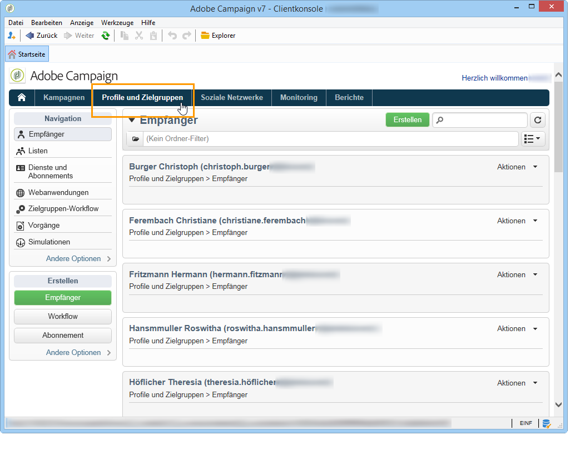
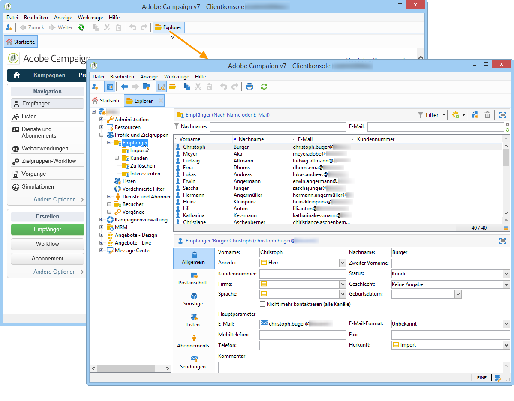

# Über Profile{#about-profiles}

Alle Profile (Kunden, Interessenten, Newsletter-Abonnenten usw.) werden in der Adobe Campaign-Datenbank zentral gespeichert. Die Akquise von Profilen und die Datenbankerstellung können auf verschiedenste Weisen geschehen: Online-Akquise über Web-Formulare, manueller oder automatisierter Import von Textdateien, Replikation von bereits existierenden Datenbanken oder Informationssystemen des Unternehmens. Mit Adobe Campaign können Sie Marketing-Verlauf, Kaufinformationen, Voreinstellungen, CRM-Daten und alle relevanten PI-Daten in eine konsolidierte Ansicht integrieren, um sie zu analysieren und Maßnahmen zu ergreifen.

In Adobe Campaign sind Empfänger die Standardprofile, an die Sendungen übermittelt werden (E-Mails, SMS etc.). Dank der in der Datenbank gespeicherten Empfängerdaten können Sie das Ziel filtern, das eine bestimmte Sendung erhält, und Personalisierungsdaten in Ihren Versandinhalten hinzufügen. In der Datenbank sind weitere Profiltypen vorhanden. Sie sind für andere Verwendungszwecke gedacht. Beispielsweise dienen Testprofile zum Testen von Sendungen, bevor sie tatsächlich an das endgültige Ziel übermittelt werden.

 [Informationen zum Profilkonzept finden Sie in diesem Video](#create-profiles-video)

## Profiltypen {#profile-types}

Die Adobe-Campaign-Plattform ermöglicht die Verwaltung von Profilen über den gesamten Zyklus hinweg, von der Erstellung oder dem Import über Zielgruppenbestimmung und Tracking bis hin zur Aktualisierung und anderen Aktivitäten.

Ein Profil entspricht einem Datensatz in der Datenbank, der alle nötigen Informationen enthält, um einen Kontakt zu qualifizieren, zu verfolgen und in Zielgruppen einzubeziehen.

Profile können verschiedenen Kategorien zugeteilt werden, welche sich im Speicherort widerspiegeln, zum Beispiel: einem Empfänger, einem Besucher, einem Benutzer, einem Abonnenten, einem Interessenten usw.

## Empfängerprofile {#recipient-profiles}

Versandempfänger werden in der Datenbank in Form von Profilen mit den entsprechenden Informationen – Nachname, Vorname, Adressdaten, Abonnements, Sendungen etc. – gespeichert. Sendungen innerhalb von Marketingkampagnen können sich an Empfängergruppen aus der Datenbank richten, die nach bestimmten – einfachen oder komplexen – Kriterien erstellt werden.

Eine weitere Möglichkeit besteht darin, Kampagnen für Profile zu erstellen, die nicht in der Datenbank, sondern in Dateien enthalten sind. In diesem Fall handelt es sich um s. g. externe Sendungen. Weitere Informationen hierzu finden Sie auf [dieser Seite](../../delivery/using/steps-defining-the-target-population.md#selecting-external-recipients).

Die gängigsten Methoden der Profilerstellung sind:

* direkte Erfassung in der Benutzeroberfläche,
* Import von Profildateien,
* Online-Akquise über Webformulare.

>[!NOTE]
>
>Dateiimport und Webformulare werden im Abschnitt [Allgemeine Importe und Exporte](../../platform/using/generic-imports-and-exports.md) vorgestellt.

## Profile und Zielgruppen {#profiles-and-targets}

Über den Link **[!UICONTROL Profile und Zielgruppen]** können Sie in der Datenbank enthaltene Empfängerprofile anzeigen. Sie können neue Empfänger erstellen, bestehende bearbeiten und auf Profile zugreifen. Lesen Sie hierzu auch [diese Seite](../../platform/using/editing-a-profile.md).

Außerdem haben Sie an dieser Stelle Zugriff auf:

* Listen; siehe [Listen erstellen und verwalten](../../platform/using/creating-and-managing-lists.md),
* Anmeldedienste; siehe [diese Seite](../../delivery/using/managing-subscriptions.md),
* Webanwendungen; siehe [diese Seite](../../web/using/about-web-applications.md),
* Importe und Exporte (Vorgänge); siehe [Allgemeine Importe und Exporte](../../platform/using/generic-imports-and-exports.md),
* Zielgruppen-Workflow; siehe [diese Seite](../../workflow/using/building-a-workflow.md#implementation-steps-),

Über die Empfängerseite sind die gängigsten Aktionen möglich. Sie können Profile bearbeiten, aktualisieren, sortieren, löschen oder neue Profile erstellen.

Erweiterte Funktionalitäten stehen über den Navigationsbaum zur Verfügung. Klicken Sie hierfür auf die **[!UICONTROL Explorer]**-Schaltfläche in der Symbolleiste der Adobe-Campaign-Startseite.

Standardmäßig sind die Empfänger im Verzeichnisknoten **[!UICONTROL Profile und Zielgruppen > Empfänger]** gespeichert. Sie haben an dieser Stelle nicht nur die Möglichkeit, Empfänger zu erstellen, sondern auch

* Profile der Datenbank sortieren und filtern; siehe [Filteroptionen](../../platform/using/filtering-options.md),
* Profile der Datenbank verschieben, kopieren oder löschen; siehe [Profile verwalten](../../platform/using/managing-profiles.md),
* Profile aktualisieren; siehe [Daten-Update](../../platform/using/updating-data.md),
* Exportempfänger; siehe [Profile im-/exportieren](../../platform/using/exporting-and-importing-profiles.md),
* Empfängergruppen erstellen; siehe [Listen erstellen und verwalten](../../platform/using/creating-and-managing-lists.md).

Erweiterte Funktionen und Konfigurationsmöglichkeiten stehen ausschließlich über den **[!UICONTROL Explorer]** zur Verfügung.

Das allgemeine Layout von Adobe Campaign-Explorer wird in [Adobe Campaign-Explorer verwenden](../../platform/using/adobe-campaign-workspace.md#using-adobe-campaign-explorer) beschrieben.

>[!NOTE]
>
>Durch Klick auf **[!UICONTROL Profile und Zielgruppen > Empfänger]** haben Sie Zugriff auf eine erweiterte Ansicht der Empfängerliste. Es besteht die Möglichkeit, sie Ihren Bedürfnissen entsprechend anzupassen. Sie können beispielsweise Spalten hinzufügen oder löschen und ihre Reihenfolge festlegen, Daten sortieren etc. Die Konfiguration der Listenanzeige wird unter [Adobe Campaign-Explorer verwenden](../../platform/using/adobe-campaign-workspace.md#using-adobe-campaign-explorer) beschrieben.
>
>Sie können auch Empfängeransichten definieren. Weitere Informationen zu dieser Funktion finden Sie unter [Ordner und Ansichten](../../platform/using/access-management.md#folders-and-views).

## Aktive Profile {#active-profiles}

Aktive Profile sind die Profile, die zu Fakturierungszwecken berücksichtigt werden.

>[!NOTE]
>
>Wenn Sie auf AWS gehostet werden und Campaign Classic aus Build 8931 verwenden, können Sie die Anzahl der in Ihren Instanzen verwendeten aktiven Profile auch direkt im Control Panel überwachen. Weitere Informationen hierzu finden Sie in der [Control Panel-Dokumentation](https://docs.adobe.com/content/help/de-DE/control-panel/using/performance-monitoring/active-profiles-monitoring.html).
>
>Beachten Sie, dass die Anzahl der aktiven Profile nur für **Marketing-Instanzen** verfügbar ist. Sie ist nicht für Ausführungsinstanzen verfügbar, d. h. MID (Mid-Sourcing)- und RT (Message Center-/Echtzeit-Messaging)-Instanzen.

**Profil** bezeichnet einen Datensatz, der einen Endkunden, einen Prospect oder Lead repräsentiert. Bei diesen Daten kann es sich z. B. um einen Datensatz in der nmsRecipient-Tabelle oder einer externen Tabelle handeln, die die Kennung eines Cookies, eines Kunden oder eines Mobiltelefons oder andere für einen bestimmten Kanal relevante Informationen enthält.

Für die Fakturierung werden nur **aktive** Profile berücksichtigt. Ein Profil wird als aktiv erachtet, wenn es in den vergangenen zwölf Monaten über einen beliebigen Kanal angesprochen wurde oder mit ihm kommuniziert wurde.

Die Profile, die während der Versandvorbereitung ausgeschlossen wurden (Typologieregeln, Quarantänen), werden nicht berücksichtigt. Ein Profil, das mehrere Sendungen erhalten hat, wird nur einmal gezählt.

>[!NOTE]
>
>Die Kanäle Facebook und Twitter werden nicht berücksichtigt.

Eine Übersicht über die **[!UICONTROL Anzahl der aktiven Profile]** erhalten Sie über das Menü **[!UICONTROL Administration > Kampagnenverwaltung > Kundenmetriken]** in Campaign Standard. Die tatsächliche Zählung erfolgt über den [technischen Workflow](../../workflow/using/deliveries.md) **[!UICONTROL Zählung aktiver Profile (Billing)]** (**[!UICONTROL billingActiveContactCount]**), der täglich ausgeführt wird. Dabei werden die neuen Daten für den aktuellen Zeitraum im Menü **[!UICONTROL Kundenmetriken]** zum vorhandenen Bericht hinzugefügt. Jeder Zeitraum hat eine Dauer von 12 Monaten.

## Erstellen und Verwalten von Profilen {#create-profiles-video}

Erfahren Sie, wie Sie auf Profildaten zugreifen, Profile sortieren und filtern und Profile manuell erstellen und verwalten können.

In diesem Video wird auch die Einhaltung der Datenschutz-Grundverordnung durch Adobe Campaign Classic erläutert.

>[!VIDEO](https://video.tv.adobe.com/v/35611?quality=12)

**Siehe auch**

* [Datenschutzmanagement in der Kampagne](https://helpx.adobe.com/de/campaign/kb/acc-privacy.html)

* [Bestimmen der Zielpopulation](../../delivery/using/define-the-right-audience.md)

* [Erstellen von Abfragen und Segmentdaten in Workflows](../../workflow/using/targeting-data.md)

* [Auswählen von Zielgruppen-Mapping](../../delivery/using/selecting-a-target-mapping.md)

* [Bestimmen der Zielgruppe – Best Practices](../../delivery/using/define-the-right-audience.md)
