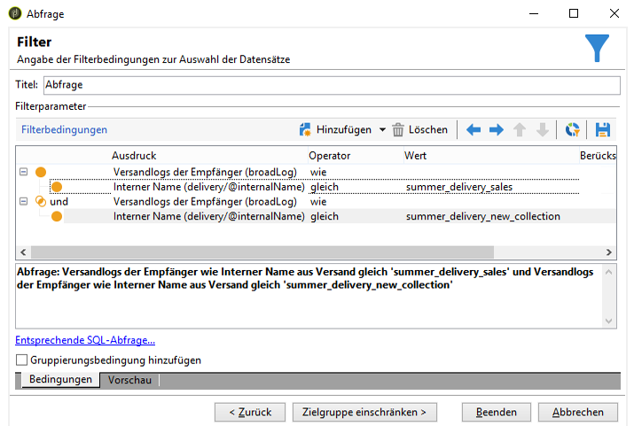

# Über Abfragen in Adobe Campaign{#about-queries-in-campaign}

Die Adobe-Campaign-Plattform bietet ein leistungsstarkes Abfragetool, das bei der Erfüllung verschiedener Funktionen wie Zielgruppenbestimmung, Segmentation des Kundenstamms, Extraktion und Filterung von Trackinglogs sowie Erstellung von Filtern zur Anwendung kommt.

Dieses so genannte generische Abfragetool hat die Form eines Assistenten und ermöglicht es, in der Datenbank gespeicherte Informationen abzurufen, zu organisieren, zu gruppieren, zu sortieren usw. So kann ein Benutzer beispielsweise die Empfänger abrufen, die innerhalb eines bestimmten Zeitraums mehr als x-mal auf einen Link in einem Newsletter geklickt haben. Die Ergebnisliste kann nach Bedarf sortiert und die Anzeige angepasst werden. Der Zugriff auf den Assistenten erfolgt über das Menü **[!UICONTROL Werkzeuge > Generisches Abfragetool...]**.

Alle Abfrageoptionen in Adobe Campaign werden über dieses Tool gesteuert. So lassen sich z. B. Einschränkungsfilter im Tool erstellen und speichern. Derart angelegte Benutzerfilter sind dadurch auch in der Abfrageaktivität eines Zielgruppen-Workflows verfügbar.

Abfragen werden entweder mit den in der ausgewählten Tabelle enthaltenen Feldern oder mithilfe einer Formel durchgeführt.

[Klicken Sie hier](../../workflow/using/query.md), um mehr über den Campaign-Abfrageeditor zu erfahren.

