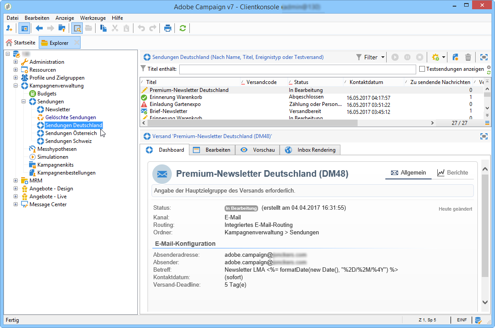
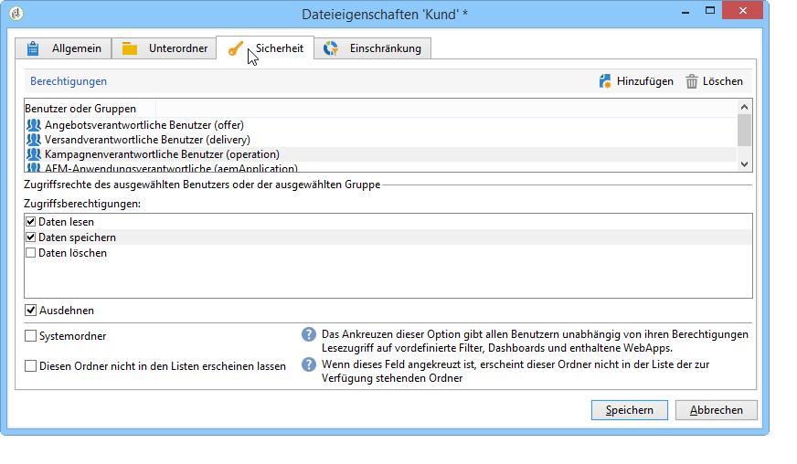

# Zugriff auf Ordner verwalten{#folder-access-management}

Jeder Ordner des Explorer-Navigationsbaums verfügt über Lese-, Schreib- und Löschzugriffsrechte. Um auf eine Datei zugreifen zu können, muss ein Benutzer oder eine Benutzergruppe zumindest über Lesezugriff verfügen.

>[!NOTE]
>
>Weitere Informationen zu Berechtigungen für Ordner finden Sie in der Dokumentation zu [ v8 ](https://experienceleague.adobe.com/de/docs/campaign/campaign-v8/admin/permissions/folder-permissions){target=_blank}.

## Ordner und Ansichten {#folders-and-views}

### Definition eines Ordners {#about-folders}

Ordner sind Knoten im Adobe Campaign-Navigationsbaum. Diese werden mit einem Klick der rechten Maustaste auf den Baum über das Menü **[!UICONTROL Ordner hinzufügen]** erstellt. Das erste Menü ermöglicht standardmäßig die Erstellung eines dem aktuellen Kontext entsprechenden Ordners.

Sie können den Navigationsbaum des Explorers anpassen. Erfahren Sie [in diesem Abschnitt](adobe-campaign-workspace.md) mehr über Konfigurationsschritte und Best Practices.

### Definition einer Ansicht {#about-views}

Es besteht außerdem die Möglichkeit, Ansichten zu erstellen, um den Datenzugriff einzuschränken und den Inhalt des Navigationsbaums Ihren Bedürfnissen entsprechend zu organisieren. Es ist darüber hinaus möglich, den jeweiligen Ansichten Berechtigungen zuzuordnen.

Eine Ansicht ist ein Ordner, der in einem oder mehreren anderen Ordnern des gleichen Typs gespeicherte Datensätze anzeigt. Wenn Sie beispielsweise einen Kampagnen-Ordner erstellen, der eine Ansicht ist, zeigt dieser standardmäßig alle in der Datenbank vorhandenen Kampagnen an, unabhängig von ihrer Herkunft. Ansichten bieten zudem die Möglichkeit, die enthaltenen Daten zu filtern.

Wenn ein Ordner zu einer Ansicht gemacht wird, werden alle dem Ordnertyp entsprechenden Daten, die in der Datenbank vorhanden sind, unabhängig von ihrer tatsächlichen Ordnerzuordnung angezeigt. Anschließend können sie gefiltert werden, um die Liste der angezeigten Daten einzuschränken.

>[!IMPORTANT]
>
>Ansichten fassen Daten zusammen und verleihen Zugriff auf sie. Die Daten sind jedoch nicht physisch im Ordner der Ansicht gespeichert. Der Benutzer muss über die der gewünschten Aktion entsprechenden Berechtigungen über den oder die Herkunftsordner der Daten verfügen (mindestens Lesezugriff).
>
>Um Zugriff auf eine Ansicht ohne Zugriff auf den Herkunftsordner zu verleihen, darf kein Lesezugriff auf den übergeordneten Knoten des Herkunftsordners gegeben werden.

Zur Unterscheidung zwischen Ansichten und Ordnern wird der Name der Ansichten in einer anderen Farbe angezeigt (dunkeltürkis).

### Ordner hinzufügen und Ansichten erstellen {#adding-folders-and-creating-views}

>[!IMPORTANT]
>
>Vorkonfigurierte Ordner sollten nicht als Ansicht markiert werden.

Im folgenden Beispiel werden wir neue Ordner erstellen, um bestimmte Daten darzustellen:

1. Erstellen Sie einen neuen Ordner vom Typ **[!UICONTROL Sendungen]** und nennen Sie ihn **Sendungen Deutschland**.
1. Klicken Sie mit der rechten Maustaste auf diesen Ordner und wählen Sie **[!UICONTROL Eigenschaften...]** aus.

   

1. Wählen Sie im Tab **[!UICONTROL Einschränkung]** die Option **[!UICONTROL Dieser Ordner ist eine Ansicht]**: Nun werden alle Sendungen der Datenbank in diesem Ordner angezeigt.

   

1. Bestimmen Sie mithilfe des Abfragetools im mittleren Abschnitt des Fensters die Bedingungen, nach denen die Sendungen gefiltert werden sollen: Es werden nur die dem Filter entsprechenden Sendungen angezeigt.

   >[!NOTE]
   >
   >Der Abfrageeditor wird in [diesem Abschnitt](../../platform/using/about-queries-in-campaign.md) beschrieben.

   Mit den folgenden Filterbedingungen:

werden folgende Sendungen in der Ansicht angezeigt:

>[!NOTE]
>
>Bei der Verwaltung von Ereignissen des Typs [Transaktionsnachrichten](../../message-center/using/about-transactional-messaging.md) dürfen die Ordner **[!UICONTROL Echtzeitereignis]** oder **[!UICONTROL Batch-Ereignis]** auf den Ausführungsinstanzen nicht als Ansichten festgelegt werden, da dies zu Problemen mit den Zugriffsrechten führen kann. Weiterführende Informationen zum Sammeln von Ereignissen finden Sie in [diesem Abschnitt](../../message-center/using/about-event-processing.md#event-collection).

<!--
## Permissions on a folder

### Edit permissions on a folder {#edit-permissions-on-a-folder}

To edit permissions on a specific folder of the tree, follow the steps below:

1. Right-click on the folder and select **[!UICONTROL Properties...]**.

   

1. Click the **[!UICONTROL Security]** tab to view authorizations on this folder.

   

### Modify permissions {#modify-permissions}

To modify permissions, you can:

* **Replace a group or an operator**. To do this, click one of the groups (or operators) with rights to the folder, and select a new group (or a new operator) from the drop-down list:

  

* **Authorize a group or an operator**. To do this, click the **[!UICONTROL Add]** button and select the group or operator to which you want to assign authorizations for this folder.
* **Forbid a group or an operator**. To do this, click **[!UICONTROL Delete]** and select the group or operator from which you want to remove authorization for this folder.
* **Select the rights assigned to a group or an operator**. To do this, click the group or operator concerned, then select the access rights you want to grant and deselect the others.

  

### Propagate permissions {#propagate-permissions}

You can propagate authorizations and access rights. To do this, select the **[!UICONTROL Propagate]** option in the folder properties.

The authorizations defined in this window will then be applied to all the sub-folders of the current node. You can then overload these authorizations for each of the sub-folders.

>[!NOTE]
>
>Clearing this option for a folder does not automatically clear it for the sub-folders. You must clear it explicitly for each of the sub-folders.

### Grant access to all operators {#grant-access-to-all-operators}

In the **[!UICONTROL Security]** tab, if the **[!UICONTROL System folder]** option is selected, all operators will have access to this data, regardless of their rights. If this option is cleared, you must explicitly add the operator (or their group) to the list of authorizations in order for them to have access.

-->