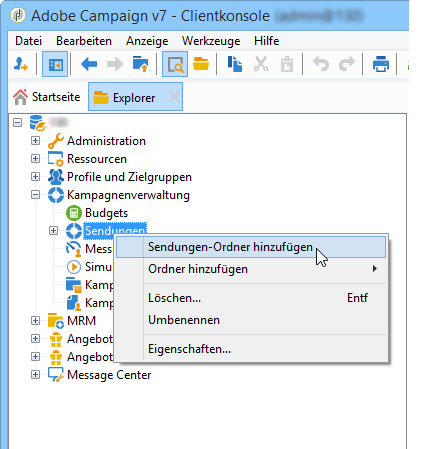
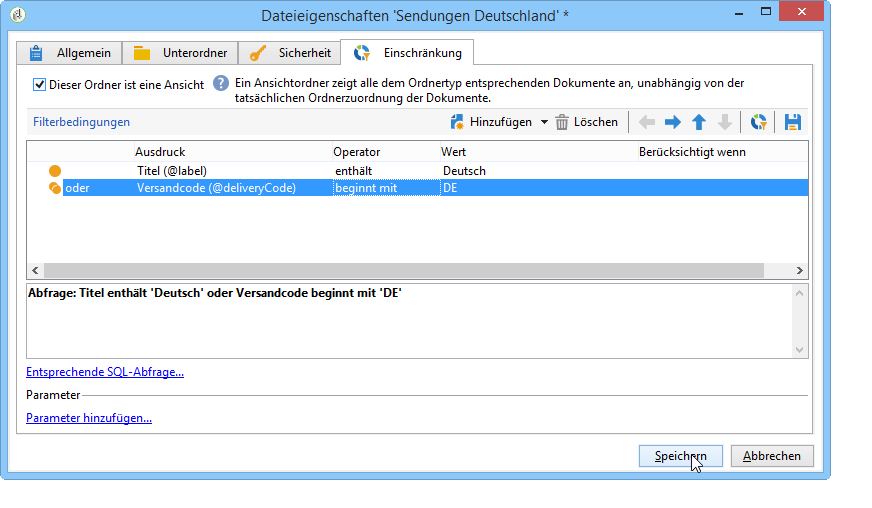
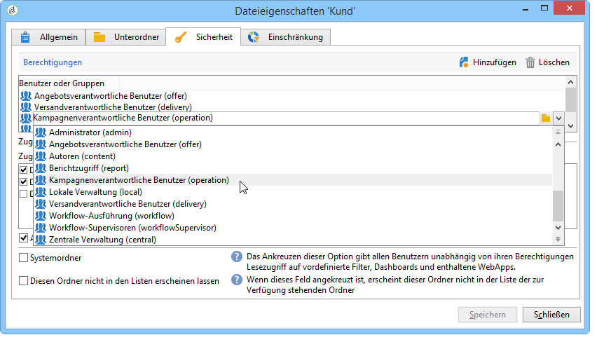
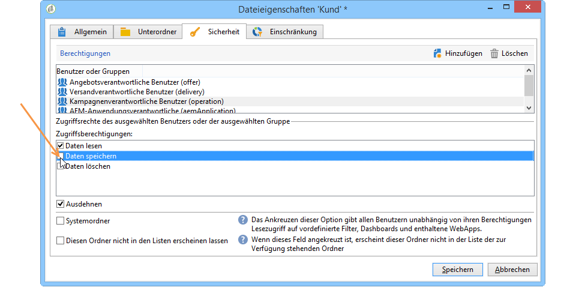

# Zugriff auf Ordner verwalten{#folder-access-management}

Jeder Ordner des Explorer-Navigationsbaums verfügt über Lese-, Schreib- und Löschzugriffsrechte. Um auf eine Datei zugreifen zu können, muss ein Benutzer oder eine Benutzergruppe zumindest über Lesezugriff verfügen.

## Ordner und Ansichten {#folders-and-views}

### Was ist ein Ordner {#about-folders}

Ordner sind Knoten im Adobe Campaign-Navigationsbaum. Diese werden mit einem Klick der rechten Maustaste auf den Baum über das Menü **[!UICONTROL Ordner hinzufügen]** erstellt. Das erste Menü ermöglicht standardmäßig die Erstellung eines dem aktuellen Kontext entsprechenden Ordners.

Sie können den Navigationsbaum des Explorers anpassen. Erfahren Sie [in diesem Abschnitt](adobe-campaign-workspace.md) mehr über Konfigurationsschritte und Best Practices.

### Was ist eine Ansicht {#about-views}

Es besteht außerdem die Möglichkeit, Ansichten zu erstellen, um den Datenzugriff einzuschränken und den Inhalt des Navigationsbaums Ihren Bedürfnissen entsprechend zu organisieren. Es ist darüber hinaus möglich, den jeweiligen Ansichten Berechtigungen zuzuordnen.

Eine Ansicht ist ein Ordner, der in einem oder mehreren anderen Ordnern des gleichen Typs gespeicherte Datensätze anzeigt. Wenn Sie beispielsweise einen Kampagnen-Ordner erstellen, der eine Ansicht ist, zeigt dieser standardmäßig alle in der Datenbank vorhandenen Kampagnen an, unabhängig von ihrer Herkunft. Ansichten bieten zudem die Möglichkeit, die enthaltenen Daten zu filtern.

Wenn ein Ordner zu einer Ansicht gemacht wird, werden alle dem Ordnertyp entsprechenden Daten, die in der Datenbank vorhanden sind, unabhängig von ihrer tatsächlichen Ordnerzuordnung angezeigt. Anschließend können sie gefiltert werden, um die Liste der angezeigten Daten einzuschränken.

>[!IMPORTANT]
>
>Ansichten fassen Daten zusammen und verleihen Zugriff auf sie. Die Daten sind jedoch nicht physisch im Ordner der Ansicht gespeichert. Der Benutzer muss über die der gewünschten Aktion entsprechenden Berechtigungen über den oder die Herkunftsordner der Daten verfügen (mindestens Lesezugriff).
>
>Um Zugriff auf eine Ansicht ohne Zugriff auf den Herkunftsordner zu verleihen, darf kein Lesezugriff auf den Elternknoten des Herkunftsordners gegeben werden.

Zur Unterscheidung zwischen Ansichten und Ordnern wird der Name der Ansichten in einer anderen Farbe angezeigt (dunkeltürkis).

### hinzufügen von Ordnern und Erstellen von Ansichten {#adding-folders-and-creating-views}

Im folgenden Beispiel werden wir neue Ordner erstellen, um bestimmte Daten darzustellen:

1. Erstellen Sie einen neuen Ordner vom Typ **[!UICONTROL Sendungen]** und nennen Sie ihn **Sendungen Deutschland**.
1. Klicken Sie mit der rechten Maustaste auf diesen Ordner und wählen Sie **[!UICONTROL Eigenschaften...]** aus.

   

1. Wählen Sie im Tab **[!UICONTROL Einschränkung]** die Option **[!UICONTROL Dieser Ordner ist eine Ansicht]**: Nun werden alle Sendungen der Datenbank in diesem Ordner angezeigt.

   

1. Bestimmen Sie mithilfe des Abfragetools im mittleren Abschnitt des Fensters die Bedingungen, nach denen die Sendungen gefiltert werden sollen: Es werden nur die dem Filter entsprechenden Sendungen angezeigt.

   >[!NOTE]
   >
   >Der Abfrageeditor wird in [diesem Abschnitt](../../platform/using/about-queries-in-campaign.md) beschrieben.

   Mit den folgenden Filterbedingungen:

werden folgende Sendungen in der Ansicht angezeigt:

>[!NOTE]
>
>Bei der Verwaltung von Ereignissen des Typs [Transaktionsnachrichten](../../message-center/using/about-transactional-messaging.md) dürfen die Ordner **[!UICONTROL Echtzeitereignis]** oder **[!UICONTROL Batch-Ereignis]** auf den Ausführungsinstanzen nicht als Ansichten festgelegt werden, da dies zu Problemen mit den Zugriffsrechten führen kann. Weiterführende Informationen zum Sammeln von Ereignissen finden Sie in [diesem Abschnitt](../../message-center/using/event-collection.md).

## Berechtigungen für einen Ordner

### Berechtigungen für einen Ordner bearbeiten {#edit-permissions-on-a-folder}

Um Berechtigungen für einen bestimmten Ordner des Baums zu bearbeiten, gehen Sie folgendermaßen vor:

1. Klicken Sie mit der rechten Maustaste auf den entsprechenden Ordner und wählen Sie **[!UICONTROL Eigenschaften...]**.

   

1. Klicken Sie auf den Tab **[!UICONTROL Sicherheit]**, um die Berechtigungen bezüglich des Ordners anzusehen.

   

### Berechtigungen ändern {#modify-permissions}

Zum Ändern von Berechtigungen haben Sie folgende Möglichkeiten:

* **Gruppe oder Benutzer ersetzen**: Klicken Sie hierzu auf eine der Gruppen (oder Benutzer), die über Berechtigungen bezüglich des Ordners verfügen, und wählen Sie eine neue Gruppe (oder einen neuen Benutzer) über die Auswahlliste aus:

   

* **Gruppe oder Benutzer berechtigen**: Klicken Sie hierzu auf die Schaltfläche **[!UICONTROL Hinzufügen]** und wählen Sie die Gruppe oder den Benutzer aus, denen Berechtigungen bezüglich des Ordners zugewiesen werden sollen.
* **Gruppe oder Benutzer verbieten**: Klicken Sie hierzu auf die Schaltfläche **[!UICONTROL Löschen]** und wählen Sie die Gruppe oder den Benutzer aus, denen Sie jegliche Berechtigung bezüglich des Ordners entziehen möchten.
* **Berechtigungen einer Gruppe oder eines Benutzers auswählen**: Klicken Sie hierzu auf die betroffene Gruppe oder den Benutzer und wählen Sie anschließend die Zugriffsberechtigungen aus bzw. ab, die Sie zuweisen oder entziehen möchten.

   

### Berechtigungen ausdehnen {#propagate-permissions}

Sie können Berechtigungen und Zugriffsberechtigungen ausdehnen. Wählen Sie dazu die Option **[!UICONTROL Ausdehnen]** in den Dateieigenschaften aus.

Die in diesem Fenster festgelegten Berechtigungen werden dadurch auf alle Unterordner des aktuellen Verzeichnisknotens ausgeweitet. Die Berechtigungen können anschließend für jeden einzelnen der Unterordner überschrieben werden.

>[!NOTE]
>
>Wenn Sie diese Option für einen Ordner abwählen, ist sie nicht automatisch auch für alle Unterordner dieses Ordners abgewählt. Sie muss für jeden Unterordner einzeln abgewählt werden.

### Allen Benutzern Zugriff gewähren {#grant-access-to-all-operators}

Wenn im Tab **[!UICONTROL Sicherheit]** die Option **[!UICONTROL Systemordner]** angekreuzt ist, haben alle Benutzer ungeachtet ihrer Berechtigungen Zugriff auf die Daten des Ordners. Wenn die Option nicht angekreuzt ist, muss ein Benutzer (oder seine Gruppe) der Liste ausdrücklich hinzugefügt werden, um Zugriff zu erhalten.

