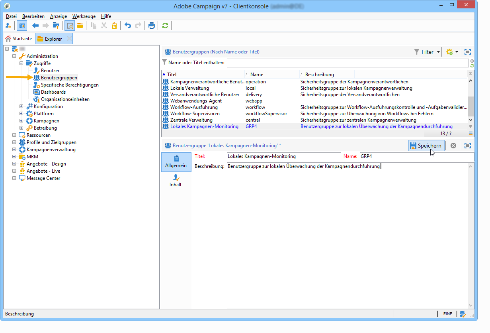
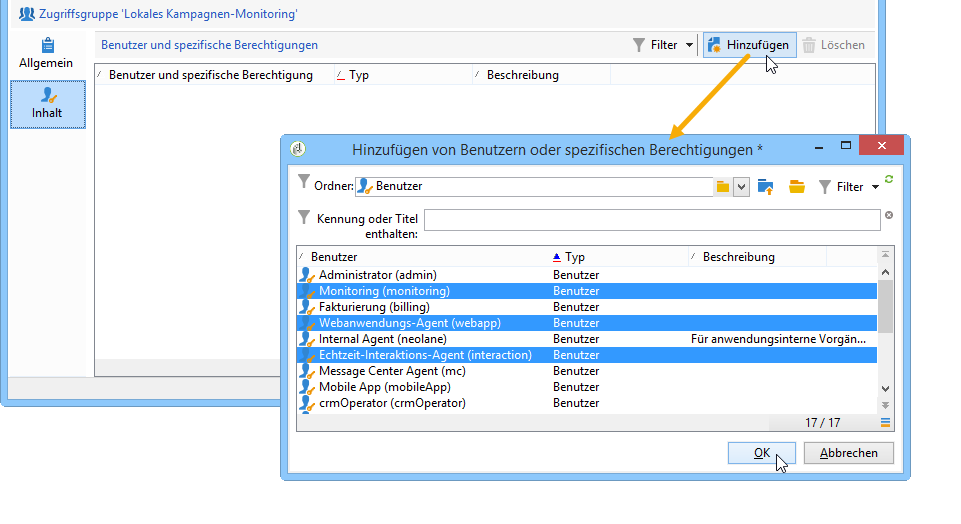

# Benutzergruppen erstellen und verwalten {#operator-groups}

Benutzergruppen werden über den Verzeichnisknoten **[!UICONTROL Administration > Zugriffe > Benutzergruppen]** erstellt.

## Erstellen einer neuen Benutzergruppe {#creating-a-new-operator-group}

Gehen Sie wie folgt vor, um eine neue Benutzergruppe zu erstellen:

1. Klicken Sie oberhalb der Gruppenliste auf die Schaltfläche **[!UICONTROL Neu]** oder klicken Sie mit der rechten Maustaste auf die Liste und wählen Sie **[!UICONTROL Neu]**.
1. Geben Sie im unteren Bereich des Fensters im Tab **[!UICONTROL Allgemein]** den Namen und die Beschreibung der Gruppe in die entsprechenden Felder ein.

   

1. Klicken Sie auf den Tab **[!UICONTROL Inhalt]**, um der Gruppe Berechtigungen einzuräumen.
1. Klicken Sie auf die Schaltfläche **[!UICONTROL Hinzufügen]**, um spezifische Berechtigungen oder Benutzer auszuwählen, die der Gruppe hinzugefügt werden sollen.
1. Klicken Sie auf die Dropdown-Liste oder auf das Ordnersymbol rechts neben dem Feld **[!UICONTROL Ordner]**, um die der Gruppe zuzuordnenden spezifischen Berechtigungen oder Benutzer zu lokalisieren und anzuzeigen.
1. Wählen Sie die hinzuzufügenden Berechtigungen oder Benutzer aus und klicken Sie zum Bestätigen auf **[!UICONTROL OK]**.

   

   Wiederholen Sie diese Schritte, um weitere Berechtigungen oder Benutzer hinzuzufügen.

1. Klicken Sie abschließend auf die Schaltfläche **[!UICONTROL Speichern]**, um die Gruppe der Liste hinzuzufügen.

## Standardgruppen {#default-groups}

Es existieren folgende Standardgruppen:

1. **[!UICONTROL Administrator]**

   Die Benutzer in dieser Gruppe haben vollen Zugriff auf die Instanz. Administratoren sind Benutzer, die Zugriff auf die meisten technischen Elemente der Benutzeroberfläche haben. Sie haben die **[!UICONTROL Administratorrolle]** inne und stellen sicher, dass die Plattform vollständig eingerichtet ist.

   Die Gruppe beinhaltet die folgende spezifische Berechtigung:

   * **[!UICONTROL ADMINISTRATION]**: Berechtigt zum Ausführen, Erstellen, Bearbeiten und Löschen von Objekten wie Workflows, Sendungen, Skripten usw.

1. **[!UICONTROL Versandverantwortliche Benutzer]**

   Die Benutzer dieser Gruppe sind für die Versandverwaltung verantwortlich. Die Gruppe verleiht Zugriff auf die für die Erstellung und Vorbereitung von Sendungen notwendigen Hauptressourcen (Kampagnentypologien, Versandmappings, Standardvorlagen, Gestaltungsbausteine etc.).

   Die Gruppe beinhaltet folgende spezifische Berechtigungen:

   * **[!UICONTROL SENDUNGEN VORBEREITEN]**: Berechtigt zum Erstellen, Bearbeiten und Starten der Versandanalyse;
   * **[!UICONTROL SENDUNGEN STARTEN]**: Berechtigt zur Validierung von zuvor analysierten Sendungen.

1. **[!UICONTROL Kampagnenverantwortliche Benutzer]**

   Die Benutzer dieser Gruppe können Marketing-Kampagnen verwalten. Diese Berechtigung verleiht Zugriff auf mit Kampagnen verbundene Elemente (Pläne, Programme, Workflows, Budgets etc.) im Rahmen von **[!UICONTROL Campaign]** (optionales Adobe Campaign-Modul).

   Die Gruppe beinhaltet folgende spezifische Berechtigungen:

   * **[!UICONTROL EINFÜGEN VON ORDNERN]**: Berechtigt zum Einfügen von Ordnern in den Adobe Campaign-Navigationsbaum (erfordert Schreibzugriff für betroffene Zweige);
   * **[!UICONTROL WORKFLOW]**: Berechtigt zur Nutzung von Workflows.
   >[!NOTE]
   >
   >Benutzer dieser Gruppe können keine Sendungen starten.

1. **[!UICONTROL Autoren]**

   Benutzer dieser Gruppe haben im Rahmen der **[!UICONTROL Inhaltsverwaltung]** (optionales Adobe Campaign-Modul Content Manager) Zugriff auf Inhaltsordner. Die Gruppe verleiht keine zusätzlichen Berechtigungen.

1. **[!UICONTROL Berichtzugriff]**

   Diese Gruppe ermöglicht es externen Benutzern, über einen Web-Zugriff Versandberichte einzusehen.

1. **[!UICONTROL Workflow-Ausführung]**

   Diese Gruppe verleiht Benutzern die Berechtigung, die von Kampagnen unabhängigen Workflows zu verwalten.

1. **[!UICONTROL Workflow-Supervisoren]**

   Die Benutzer dieser Gruppe werden im Falle von Meldungen bezüglich Kampagnen-Workflows per E-Mail benachrichtigt.

1. Lokale/Zentrale Verwaltung

   Diese Gruppen ermöglichen den Einsatz des **[!UICONTROL Dezentralen Marketings]** (optionales Adobe-Campaign-Modul).

1. **[!UICONTROL Angebotsverantwortliche Benutzer]**

   Die Benutzer in dieser Gruppe können Angebote erstellen und verwalten. Weiterführende Informationen dazu finden Sie auf dieser [Seite](../../interaction/using/operator-profiles.md).
Die Gruppe beinhaltet folgende spezifische Berechtigungen:

   * **[!UICONTROL EINFÜGEN VON ORDNERN]**: Berechtigt zum Einfügen von Ordnern in den Adobe Campaign-Navigationsbaum (erfordert Schreibzugriff für betroffene Zweige);
   * **[!UICONTROL BEARBEITUNG VON ORDNERN]**: Berechtigt zum Ändern von Ordnereigenschaften wie interner Name, Titel, verknüpftes Bild, Reihenfolge der Unterordner usw.
