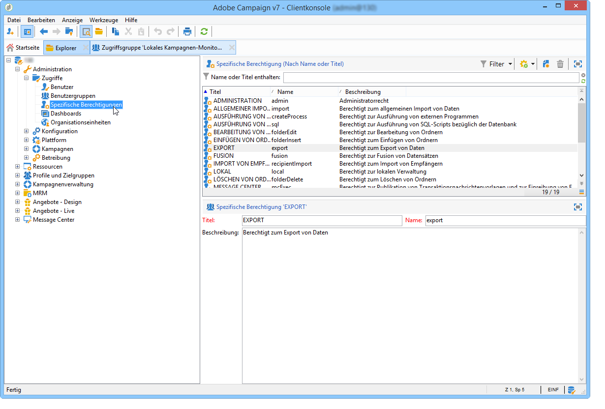
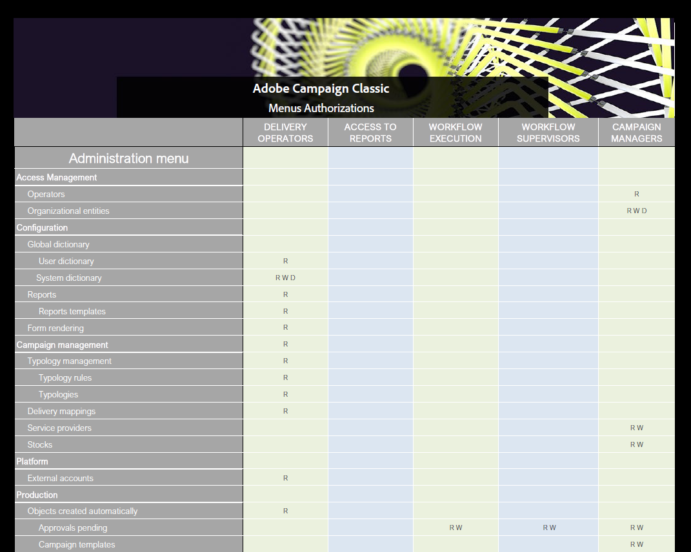

# Spezifische Berechtigungen zum Einrichten von Zugriffsberechtigungen verwenden{#named-rights}

Standardmäßig bietet Adobe Campaign eine Reihe von spezifischen Berechtigungen, mit denen Sie die den Benutzenden und Benutzergruppen zugewiesenen Berechtigungen definieren können. Diese Berechtigungen können über den Verzeichnisknoten **[!UICONTROL Administration > Zugriffsverwaltung > Spezifische Berechtigungen]** bearbeitet werden.

Es handelt sich um folgende Berechtigungen:

* **[!UICONTROL ADMINISTRATION]**: Benutzer mit **[!UICONTROL ADMINISTRATORRECHTEN]** haben vollen Zugriff auf die Instanz. Administratoren können Objekte wie Workflows, Sendungen, Skripte usw. ausführen, erstellen, bearbeiten und löschen.

  >[!IMPORTANT]
  >
  >**Nach der Migration zu IMS:** Sobald Sie zu Adobe Identity Management System (IMS) migriert haben, alle Produktprofile oder spezifischen Berechtigungen, die das Wort „admin“ im Namen enthalten (z. B. „administrators“, „admin“, „admins“ usw.) gewährt automatisch Zugriff auf das Campaign Control Panel. Es wird empfohlen, in spezifischen Berechtigungen oder Rollennamen nicht „admin“ zu verwenden, es sei denn, Sie möchten, dass diese Benutzer Zugriff auf das Control Panel haben. Erfahren Sie mehr über [IMS-Migration](../../technotes/using/migrate-users-to-ims.md) und [Verwalten des Control Panel-Zugriffs](https://experienceleague.adobe.com/docs/control-panel/using/discover-control-panel/managing-permissions.html?lang=de){target="_blank"}.

* **[!UICONTROL VALIDIERUNGSADMINISTRATION]**: Sie können verschiedene Validierungsschritte innerhalb von Workflows und Sendungen festlegen, um sicherzustellen, dass der aktuelle Status durch einen zugewiesenen Benutzer oder eine zugewiesene Gruppe validiert wurde. Benutzer mit der Berechtigung **[!UICONTROL VALIDIERUNGSADMINISTRATION]** können Validierungsschritte festlegen und auch einen Benutzer oder eine Benutzergruppe zuweisen, der bzw. die diese Schritte validieren soll.

  >[!IMPORTANT]
  >
  >**Nach der Migration zu IMS:** gewähren Produktprofile oder spezifische Berechtigungen, die das Wort „Admin“ enthalten (z. B. „Genehmigungsadministrator„), Zugriff auf das Campaign Control Panel. Erfahren Sie mehr über [IMS-Migration](../../technotes/using/migrate-users-to-ims.md) und [Verwalten des Control Panel-Zugriffs](https://experienceleague.adobe.com/docs/control-panel/using/discover-control-panel/managing-permissions.html?lang=de){target="_blank"}.

* **[!UICONTROL ZENTRAL]**: Berechtigt zur zentralen Verwaltung (Dezentrales Marketing).

* **[!UICONTROL LÖSCHEN VON ORDNERN]**: Berechtigt zum Löschen von Ordnern. Mit dieser Berechtigung können Benutzer Ordner aus der Explorer-Ansicht löschen.

* **[!UICONTROL BEARBEITUNG VON ORDNERN]**: Berechtigt zum Ändern von Ordnereigenschaften wie interner Name, Titel, verknüpftes Bild, Reihenfolge der Unterordner usw.

* **[!UICONTROL EXPORTIEREN]**: Mit der Workflow-Aktivität **[!UICONTROL EXPORTIEREN]** können Benutzer Daten aus ihren Adobe Campaign-Instanzen in eine Datei auf einem Server oder lokalen Computer exportieren.

* **[!UICONTROL ZUGRIFF AUF DATEIEN]**: Berechtigung für Lese- und Schreibzugriff auf Dateien über ein Skript, das in die **[!UICONTROL JavaScript]**-Workflow-Aktivität geschrieben werden kann, um Dateien auf einem Server zu lesen und zu schreiben.

* **[!UICONTROL ALLGEMEINER IMPORT]**: Berechtigt zum allgemeinen Import von Daten. Mit **[!UICONTROL ALLGEMEINER IMPORT]** können Sie Daten in eine andere Tabelle importieren, während die Berechtigung **[!UICONTROL BERECHTIGT ZUM IMPORT VON EMPFÄNGERN]** nur den Import in die Empfängertabelle erlaubt.

* **[!UICONTROL EINFÜGEN VON ORDNERN]**: Berechtigt zum Einfügen von Ordnern. Benutzer mit der Berechtigung **[!UICONTROL EINFÜGEN VON ORDNERN]** können in der Ordnerstruktur der Explorer-Ansicht neue Ordner erstellen.

* **[!UICONTROL LOKAL]**: Berechtigt zur lokalen Verwaltung (Dezentrales Marketing).

* **[!UICONTROL ZUSAMMENFÜHRUNG]**: Berechtigt zum Zusammenführen der ausgewählten Datensätze zu einem Datensatz. Wenn Empfänger als Duplikate vorhanden sind, kann der Benutzer mit der Berechtigung **[!UICONTROL ZUSAMMENFÜHRUNG]** die Duplikate auswählen und zu einem primären Empfänger vereinen.

* **[!UICONTROL SENDUNGEN VORBEREITEN]**: Berechtigung zum Erstellen, Bearbeiten und Speichern einer Sendung. Benutzer mit der Berechtigung **[!UICONTROL SENDUNGEN VORBEREITEN]** können auch den Prozess der Versandanalyse starten.

* **[!UICONTROL DATENSCHUTZRECHT]**: Berechtigt dazu, Datenschutzdaten zu sammeln und zu löschen. Weiterführende Informationen hierzu finden Sie auf dieser [Seite](https://helpx.adobe.com/de/campaign/kb/acc-privacy.html).

* **[!UICONTROL AUSFÜHRUNG VON PROGRAMMEN]**: Berechtigt dazu, Befehle in verschiedenen Programmiersprachen auszuführen.

* **[!UICONTROL IMPORT VON EMPFÄNGERN]**: Berechtigt zum Import von Empfängern. Benutzer mit der Berechtigung **[!UICONTROL IMPORT VON EMPFÄNGERN]** können eine lokale Datei in eine Empfängertabelle importieren.

* **[!UICONTROL AUSFÜHRUNG VON SQL-SCRIPTS]**: Berechtigt zur Ausführung von SQL-Befehlen direkt in der Datenbank.

* **[!UICONTROL SENDUNGEN STARTEN]**: Berechtigt zur Validierung von zuvor analysierten Sendungen. Nach der Versandanalyse wird der Versand bei verschiedenen Validierungsschritten angehalten und muss validiert werden, damit er wieder aufgenommen werden kann. Benutzer mit der Berechtigung **[!UICONTROL SENDUNGEN STARTEN]** können Sendungen validieren.

* **[!UICONTROL SQL-DATEN-MANAGEMENT-AKTIVITÄT VERWENDEN]**: Berechtigt zum Schreiben Ihrer eigenen SQL-Scripts unter Verwendung der SQL-Daten-Management-Aktivität, um Arbeitstabellen zu erstellen und zu füllen. Weitere Informationen finden Sie in der [Dokumentation zu Campaign v8](https://experienceleague.adobe.com/docs/campaign/automation/workflows/wf-activities/action-activities/sql-data-management.html?lang=de){target="_blank"}.

* **[!UICONTROL WORKFLOW]**: Berechtigt zur Ausführung von Workflows. Ohne diese Berechtigung können Benutzer Workflows nicht starten, anhalten oder neu starten.

* **[!UICONTROL WEBAPP]**: Berechtigt zur Nutzung von Web-Anwendungen.

>[!NOTE]
>
>Diese Liste kann je nach den auf der Plattform installierten Add-ons unterschiedlich aussehen.

## Matrix der Zugriffsberechtigungen {#access-rights-matrix}

Standardgruppen und spezifische Berechtigungen legen den Zugriff auf bestimmte Ordner des Navigationsbaums sowie die Art des Zugriffs fest: Lesezugriff, Schreibzugriff und Löschzugriff.

Die Matrix der Zugriffsberechtigungen von Adobe Campaign ist [hier](/help/platform/using/assets/access-rights-matrix.pdf) verfügbar.

