# Erstellen und Verwalten von Benutzern {#operators}

>[!CAUTION]
>
>Diese Verfahren gelten nur für Benutzende, die mit **nativer Authentifizierung der Vorgängerversion** eine Verbindung zu Campaign herstellen. Ab Campaign Classic v7.3.1 sollten alle Benutzenden das [Adobe-Identitäts-Management-System (IMS)](https://helpx.adobe.com/de/enterprise/using/identity.html){target="_blank"} verwenden, um eine Verbindung mit Campaign herzustellen. [Weitere Informationen](../../technotes/using/migrate-users-to-ims.md)
>
>Wenn Sie die Verbindung zu Campaign mit Ihrer Adobe ID herstellen, gilt der folgende Abschnitt nicht mehr. In der [Dokumentation zu Campaign v8](https://experienceleague.adobe.com/docs/campaign/campaign-v8/admin/permissions/gs-permissions.html?lang=de){target="_blank"} erfahren Sie, wie Sie Berechtigungen mit Adobe IMS einrichten können.

## Erste Schritte mit Campaign-Benutzenden {#about-operators}

>[!NOTE]
>
>Diese Verfahren gelten nur für Benutzende, die mit nativer Authentifizierung eine Verbindung zu Campaign herstellen. Informationen zur Adobe IMS-Authentifizierung finden Sie in [dieser Dokumentation](https://helpx.adobe.com/de/enterprise/using/manage-users-individually.html#_blank).

Ein Benutzer ist ein Benutzer von Adobe Campaign, der die Berechtigung besitzt, sich anzumelden und Aktionen durchzuführen.

Benutzerprofile werden standardmäßig im Knoten **[!UICONTROL Administration > Zugriffe > Benutzer]** gespeichert.

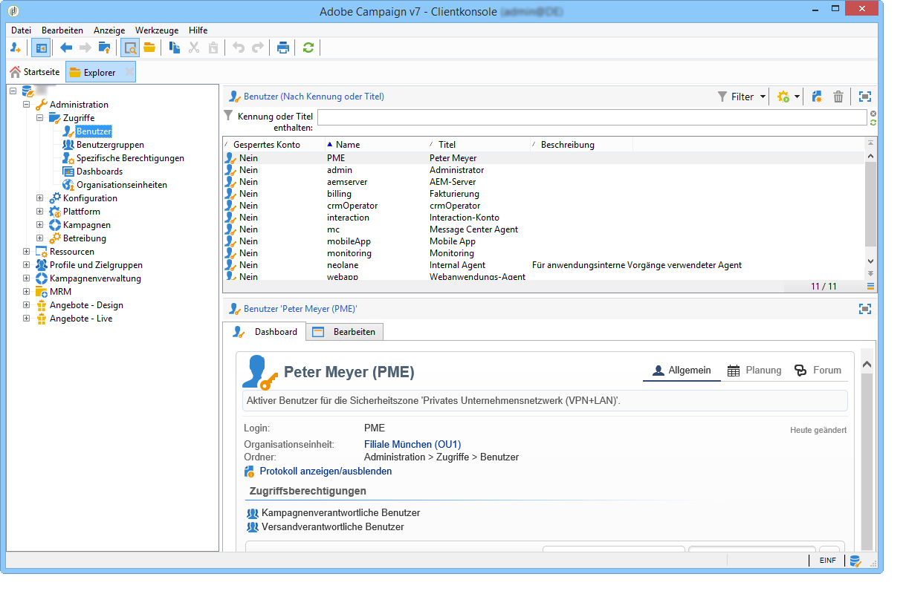

Benutzer können entweder manuell oder durch Mapping zu einem bestehenden LDAP-Verzeichnis erstellt werden.

Das Verfahren zum Erstellen eines Benutzers wird auf [dieser Seite](#creating-an-operator) erläutert.

Auf [dieser Seite](../../installation/using/connecting-through-ldap.md) finden Sie weitere Angaben zu Adobe Campaign und zur LDAP-Integration.

>[!IMPORTANT]
>
>Benutzer müssen einer Sicherheitszone zugeordnet sein, um sich auf einer Instanz anmelden zu können. Mehr Informationen über Sicherheitszonen in Adobe Campaign können auf [dieser Seite](../../installation/using/security-zones.md) nachgelesen werden.

Benutzer können auch über ihre Adobe ID eine direkt Verbindung mit Adobe Campaign herstellen. Weiterführende Informationen hierzu finden Sie auf [dieser Seite](../../integrations/using/about-adobe-id.md).

## Erstellen eines Benutzers {#creating-an-operator}

Gehen Sie wie folgt vor, um einen neuen Benutzer zu erstellen und Berechtigungen zu erteilen:

1. Klicken Sie auf die Schaltfläche **[!UICONTROL Neu]** oberhalb der Benutzerliste und erfassen Sie die Details des Benutzers.

   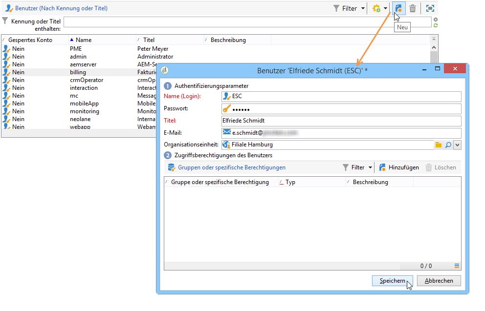

1. Geben Sie die **[!UICONTROL Identifizierungsparameter]** des Benutzers an: seinen Benutzernamen, sein Kennwort und seinen Namen. Der Benutzer verwendet seinen Benutzernamen und sein Passwort für die Anmeldung bei Adobe Campaign. Sobald die Benutzerin bzw. der Benutzer angemeldet ist, kann er oder sie das Passwort über das Menü **[!UICONTROL Tools > Passwort ändern]** ändern. Die E-Mail-Adresse der Benutzerin bzw. des Benutzers ist notwendig, um ihr oder ihm Benachrichtigungen zukommen zu lassen, beispielsweise wenn sie oder er für Validierungen verantwortlich ist.

   In diesem Abschnitt kann ein Benutzer zudem einer Organisationseinheit zugeordnet werden. Weiterführende Informationen finden Sie in der [Dokumentation zu Campaign v8](https://experienceleague.adobe.com/docs/campaign/automation/distributed-marketing/about-distributed-marketing.html?lang=de){target="_blank"}.

1. Wählen Sie die dem Benutzer erteilten Berechtigungen im Bereich **[!UICONTROL Zugriffsberechtigungen des Benutzers]** aus.

   Um dem Benutzer Berechtigungen einzuräumen, klicken Sie auf die Schaltfläche **[!UICONTROL Hinzufügen]** oberhalb der Liste der Berechtigungen. Wählen Sie anschließend eine Benutzergruppe in der Liste der verfügbaren Gruppen aus:

   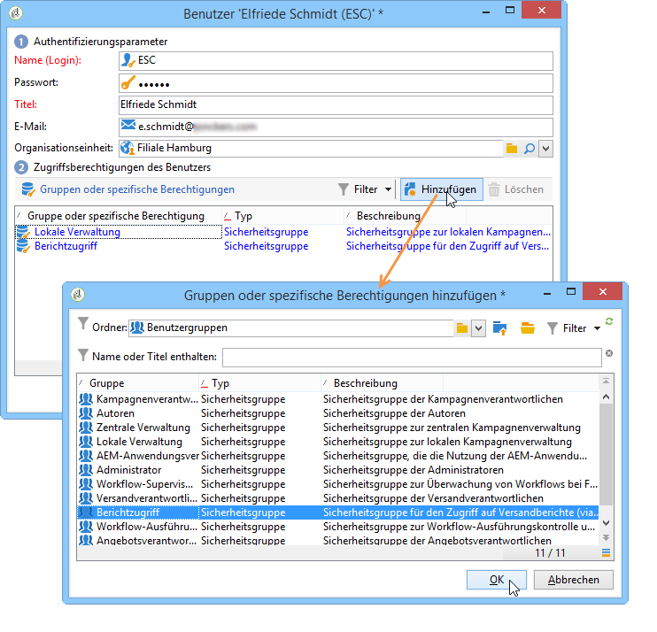

   Sie können auch eine oder mehrere spezifische Berechtigungen auswählen (siehe [Spezifische Berechtigungen](#named-rights)). Klicken Sie dazu auf den Pfeil rechts neben dem Feld **[!UICONTROL Ordner]** und wählen Sie **[!UICONTROL Spezifische Berechtigungen]** aus:

   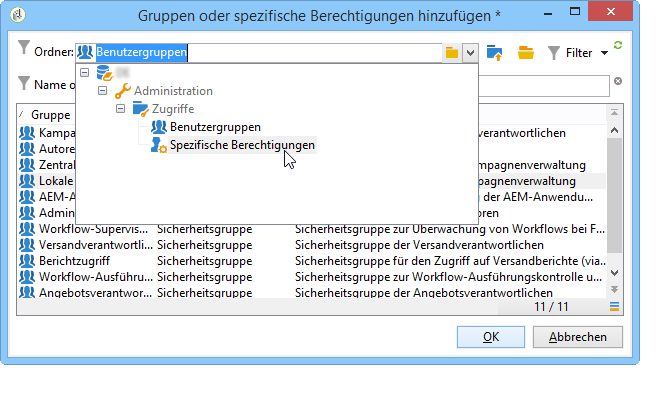

   Wählen Sie die jeweiligen Gruppen und/oder spezifischen Berechtigungen aus und klicken Sie zur Bestätigung auf **[!UICONTROL OK]**.

1. Klicken Sie auf **[!UICONTROL OK]**, um den Benutzer zu erstellen. Sein Profil wird der Liste der bereits existierenden Benutzer hinzugefügt.

   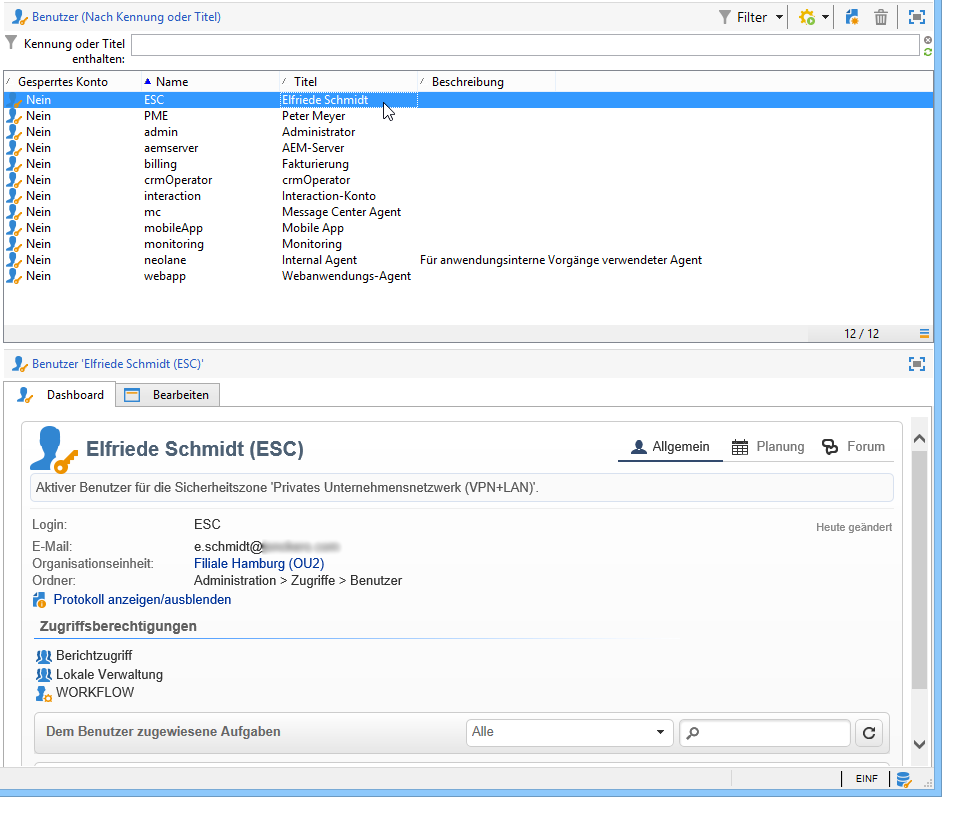

>[!NOTE]
>
>Die Benutzer können bei Bedarf verschiedenen Ordnern zugewiesen werden. Klicken Sie zur Erstellung weiterer Ordner mit der rechten Maustaste auf den Benutzer-Ordner und wählen Sie **[!UICONTROL Benutzer-Ordner hinzufügen]** aus.

Wenn das Benutzerprofil erstellt wurde, können darin enthaltende Informationen vervollständigt oder aktualisiert werden. Klicken Sie hierzu auf den Tab **[!UICONTROL Bearbeiten]**.

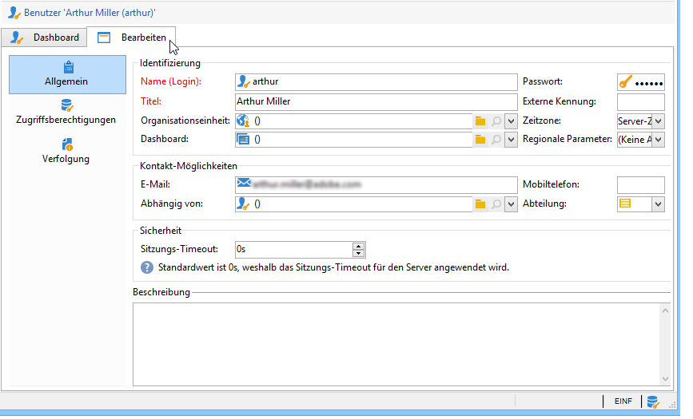

>[!NOTE]
>
>Im Feld **[!UICONTROL Sitzungs-Timeout]** können Sie die Verzögerung vor dem Timeout der FDA-Sitzung anpassen. Weitere Informationen finden Sie unter [Über Federated Data Access - FDA](../../installation/using/about-fda.md).

## Definieren der Zeitzone des Benutzers {#time-zone-of-the-operator}

Auf der Registerkarte **[!UICONTROL Allgemein]** können Sie die Zeitzone des Benutzers auswählen. Standardmäßig arbeiten Benutzende in der Zeitzone des Servers. Es ist jedoch möglich, über die Dropdown-Liste eine andere Zeitzone auszuwählen.

Die Konfiguration der Zeitzonen wird auf [dieser Seite](../../installation/using/time-zone-management.md) beschrieben.

>[!NOTE]
>
>Die Zusammenarbeit innerhalb verschiedener Zeitzonen erfordert die Speicherung von Daten in UTC. Datumsangaben werden in den folgenden Kontexten in die entsprechende Zeitzone konvertiert: Wenn ein Datum in der Zeitzone des Benutzers angezeigt wird, wenn Dateien importiert und exportiert werden, wenn ein E-Mail-Versand geplant wird oder wenn Aktivitäten in einem Workflow geplant sind (Planung, Wartezeit, Zeitbeschränkung usw.)
>
>Beschränkungen und Empfehlungen bezüglich dieser Verwendungskontexte werden in den entsprechenden Abschnitten der Adobe Campaign-Dokumentation beschrieben.

Zusätzlich können Sie aus der Dropdown-Liste **[!UICONTROL Regionale Parameter]** das Format auswählen, in dem das Datum und Zahlen dargestellt werden sollen.

## Hinzufügen von Berechtigungen {#access-rights-options}

Im Tab **[!UICONTROL Zugriffsberechtigungen]** können die dem Benutzer zugeordneten Gruppen und spezifischen Berechtigungen aktualisiert werden.

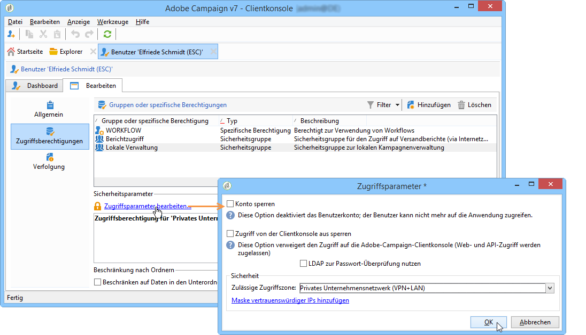

Über den Link **[!UICONTROL Zugriffsparameter bearbeiten...]** sind folgende Optionen verfügbar:

* Über die Option **[!UICONTROL Konto sperren]** kann das Benutzerkonto deaktiviert werden. Der Benutzer kann nicht mehr auf Adobe Campaign zugreifen.

  >[!NOTE]
  >
  >Auch wenn sein Konto deaktiviert ist, kann der Benutzer weiterhin Warnungen oder Benachrichtigungen von Campaign empfangen. Um das Senden von Campaign-Benachrichtigungen an diesen Benutzer zu stoppen, empfiehlt Adobe, die E-Mail-Adresse aus seinem Profil zu entfernen.

* Über die Option **[!UICONTROL Zugriff von der Clientkonsole aus sperren]** kann die Nutzung von Adobe Campaign auf den [Webzugriff](../../platform/using/adobe-campaign-workspace.md#console-and-web-access) oder den Zugriff über APIs beschränkt werden: Der Zugriff auf die Adobe Campaign-Clientkonsole ist nicht mehr verfügbar.
* Dem Benutzer kann eine Sicherheitszone zugeordnet werden. Weitere Informationen hierzu finden Sie auf [dieser Seite](../../installation/using/security-zones.md).
* Zudem kann über den entsprechenden Link eine Maske vertrauenswürdiger IP-Adressen hinzugefügt werden.

  Der Benutzer kann sich in Adobe Campaign einloggen, ohne sein Passwort erfassen zu müssen, wenn seine IP-Adresse in dieser Liste enthalten ist.

  Es besteht außerdem die Möglichkeit, einen IP-Adressen-Bereich anzugeben. Alle Benutzer, deren Adresse enthalten ist, können sich, wie in folgendem Beispiel, ohne Passwort einloggen:

  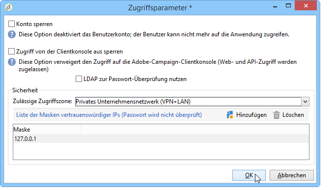

  >[!NOTE]
  >
  >Um den Zugriff auf Ihre Plattform zu sichern, ist diese Option jedoch mit Vorsicht anzuwenden.

* Mit **[!UICONTROL Option Auf in Unterordnern von gefundene Informationen beschränken]** können Sie die dem Benutzer eines Ordners zugewiesenen Rechte einschränken. Nur die Unterordner des in dieser Option angegebenen Knotens sind für den Benutzer sichtbar:

  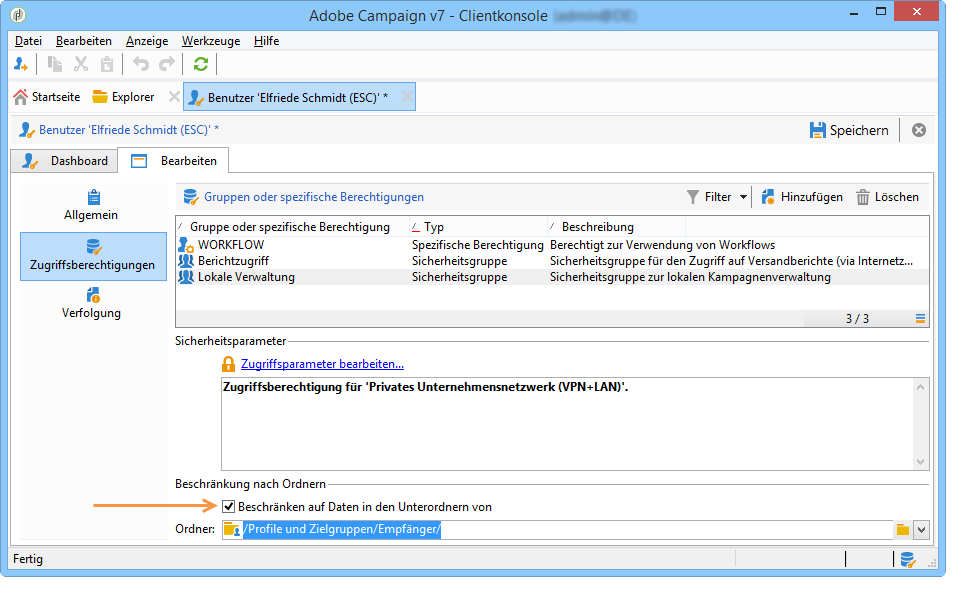

  >[!IMPORTANT]
  >
  >Dies ist eine sehr strenge Beschränkung, und sie muss mit Vorsicht angewendet werden. Ein Benutzer, der mit diesen Berechtigungen angemeldet ist, kann NUR den Inhalt des angegebenen Ordners sehen und über den Explorer auf keinen anderen Knoten der Baumstruktur zugreifen. Je nach den Funktionen hat dieser Benutzer jedoch Zugriff (z. B. auf Workflows). Der Benutzer kann Daten anzeigen, die normalerweise in Knoten gespeichert sind, auf die nicht zugegriffen werden kann.

### Überprüfen von Einstellungen {#check-settings}

Auf **[!UICONTROL Registerkarte]** Audit“ können Informationen zum Benutzer angezeigt werden. Die verschiedenen Registerkarten werden automatisch hinzugefügt, basierend auf den Einstellungen, die im Interventionsbereich des Benutzers definiert sind.

Sie haben Zugriff auf Folgendes:

* Liste der dem jeweiligen Benutzer zugeordneten Berechtigungen bezüglich Ordnern;

  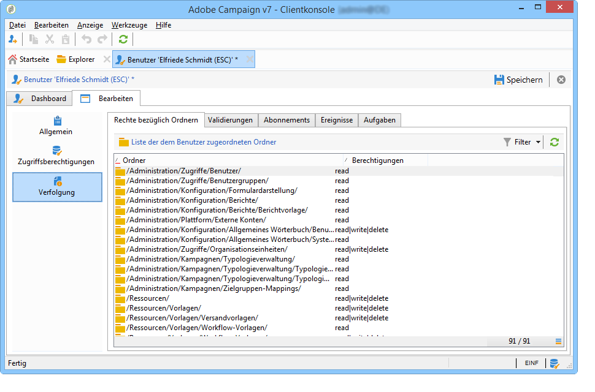

  >[!NOTE]
  >
  >Weitere Informationen hierzu finden Sie unter [Zugriffsverwaltungsordner](#folder-access-management).

* Validierungsprotokoll des Benutzers;

  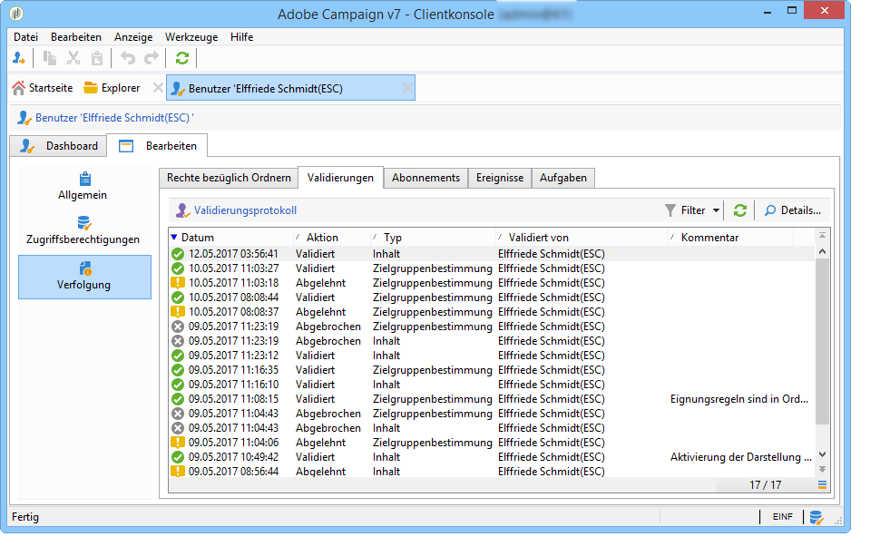

* Liste der Forumsdiskussionen, die der Benutzer abonniert hat;
* Ereignisse im Kalender des Benutzers;
* Liste der dem Benutzer zugeteilten Aufgaben.

## Standardbenutzer {#default-operators}

Adobe Campaign verwendet technische Benutzer mit standardmäßig konfigurierten Parametern: Administrator (&#39;admin&#39;), Fakturierung (&#39;billing&#39;), Monitoring, Webanwendungs-Agent (&#39;wepapp&#39;) etc. Einige hängen von den auf der Plattform installierten Anwendungen und Optionen ab: Beispielsweise sind die Benutzer &#39;central&#39; und &#39;local&#39; nur vorhanden, wenn die Option Distributed Marketing installiert ist.

>[!IMPORTANT]
>
>Diese technischen Benutzerinnen und Benutzer werden standardmäßig benachrichtigt, wenn von der Plattform Informationsmeldungen zurückgegeben werden. Es wird dringend empfohlen, eine Kontakt-E-Mail für sie bereitzustellen.
>
>Um eine korrekte Ausführung der Webanwendungen zu gewährleisten, empfehlen wir zudem, für den Benutzer &#39;webapp&#39; keine spezifischen regionalen Parameter anzugeben.

Standardmäßig verfügt der technische Benutzer der Web-Anwendung über die spezifische Berechtigung ADMINISTRATION , was zu Sicherheitsrisiken führen kann. Um dieses Problem zu beheben, empfehlen wir, dieses Recht zu entfernen. Gehen Sie dazu wie folgt vor:

1. Wählen Sie über den Knoten **[!UICONTROL Administration > Zugriffe > Spezifische Berechtigungen]** die Schaltfläche **[!UICONTROL Neu]** aus, um eine Berechtigung zu erstellen, die Sie z. B. WEBAPP nennen.

   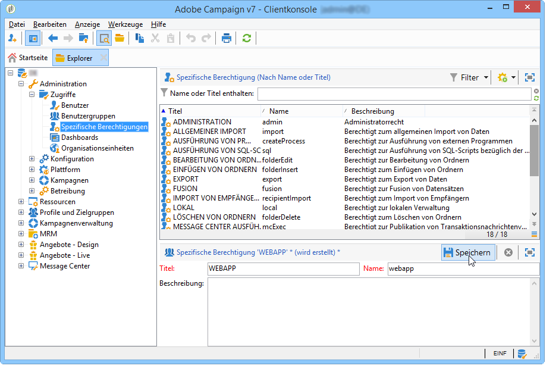

   Die spezifischen Berechtigungen werden im Abschnitt [Spezifische Berechtigungen](#named-rights) beschrieben.

1. Wählen Sie anschließend im Knoten **[!UICONTROL Administration > Zugriffe > Benutzer]** den Benutzer Webanwendungs-Agent (&#39;webapp&#39;).

   Gehen Sie in den Tab **[!UICONTROL Bearbeiten]**, dann in den Tab **[!UICONTROL Zugriffsberechtigungen]**, um die spezifische Berechtigung ADMINISTRATION aus der Liste zu löschen.

   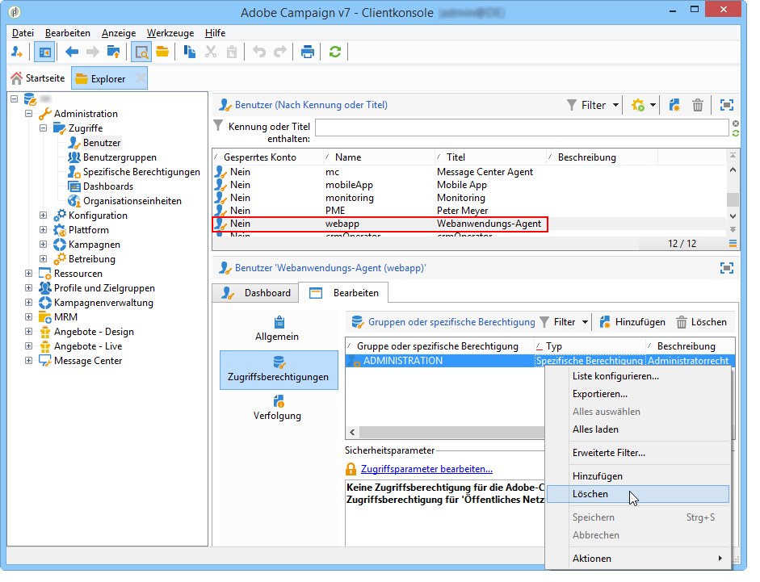

   Klicken Sie auf die Schaltfläche **[!UICONTROL Hinzufügen]** und wählen Sie die gerade von Ihnen erstellte Berechtigung WEBAPP aus, speichern Sie dann Ihre Änderungen.

   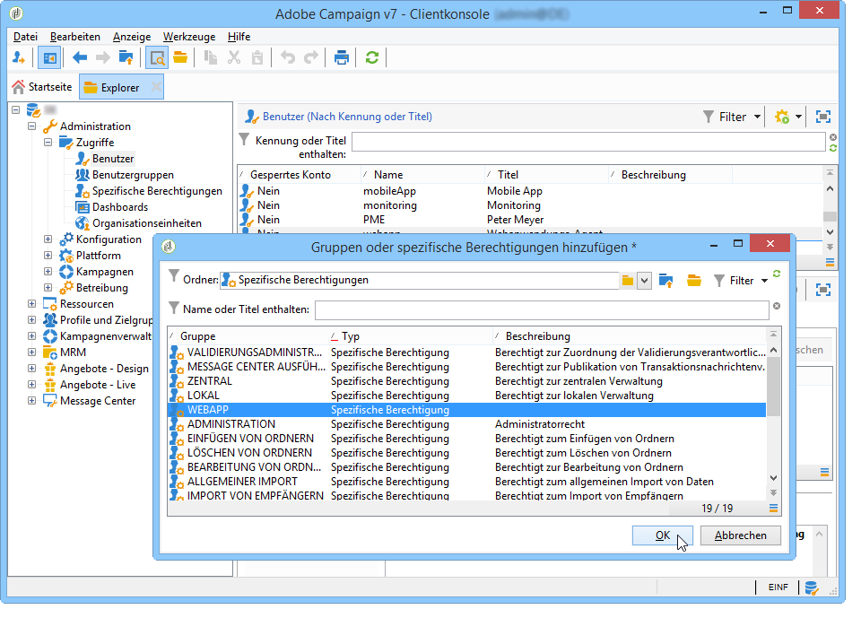

1. Erteilen Sie dem &#39;webapp&#39;-Benutzer Lese- und Schreibzugriffsberechtigungen für die ihn betreffenden Ordner, hier hauptsächlich für die &#39;Empfänger&#39;-Ordner.

   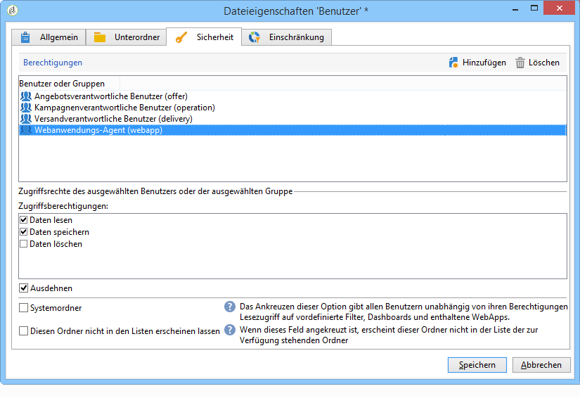

   Die Änderung von Berechtigungen bezüglich Ordnern im Navigationsbaum wird im Abschnitt [Zugriffsverwaltungsordner](#folder-access-management) beschrieben.

>[!NOTE]
>
>Weiterführende Informationen zu den Sicherheitsrichtlinien finden Sie unter [Checkliste von Adobe Campaign zur Sicherheitskonfiguration](https://experienceleague.adobe.com/de/docs/campaign-classic/using/installing-campaign-classic/security-privacy/get-started-security-privacy).