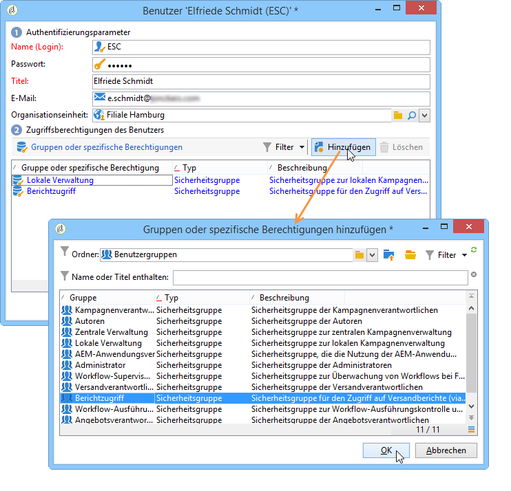
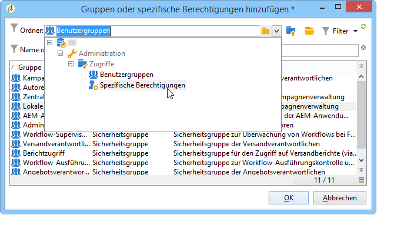
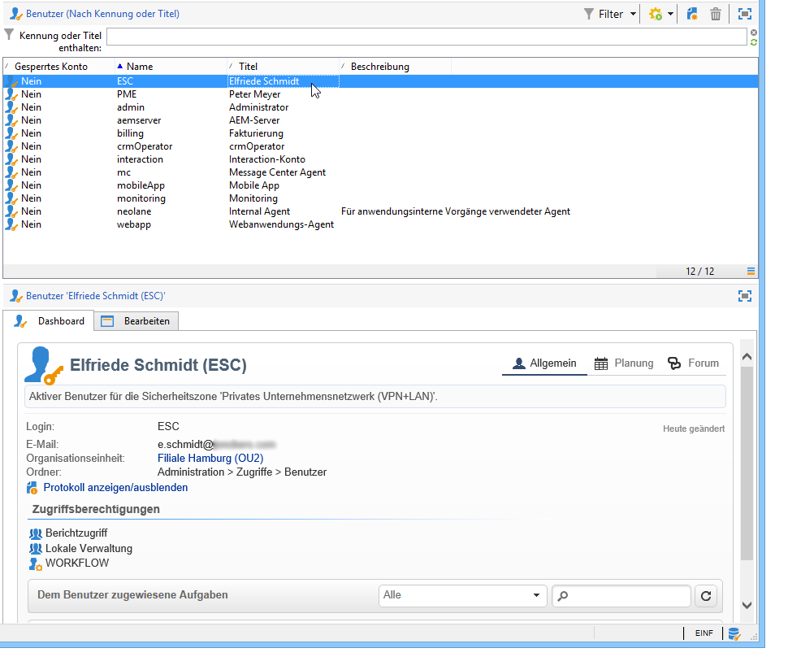
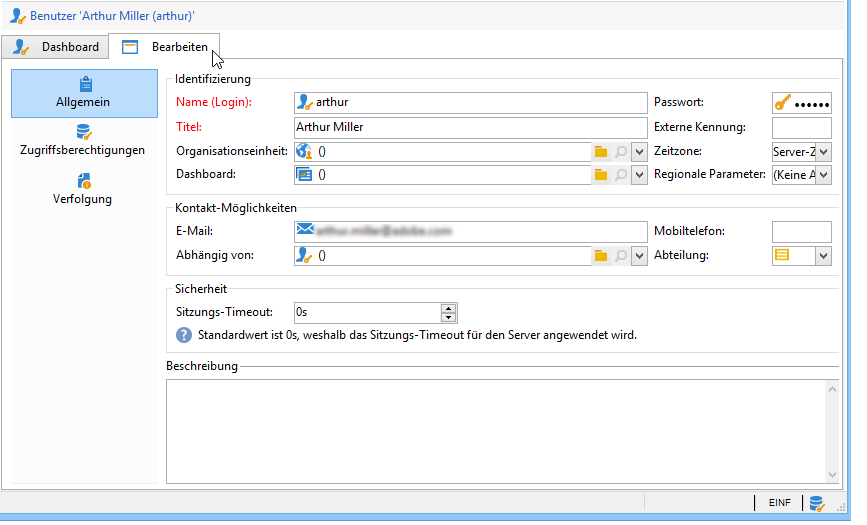
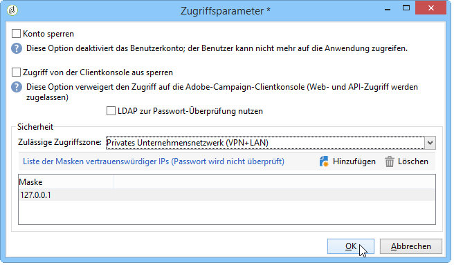
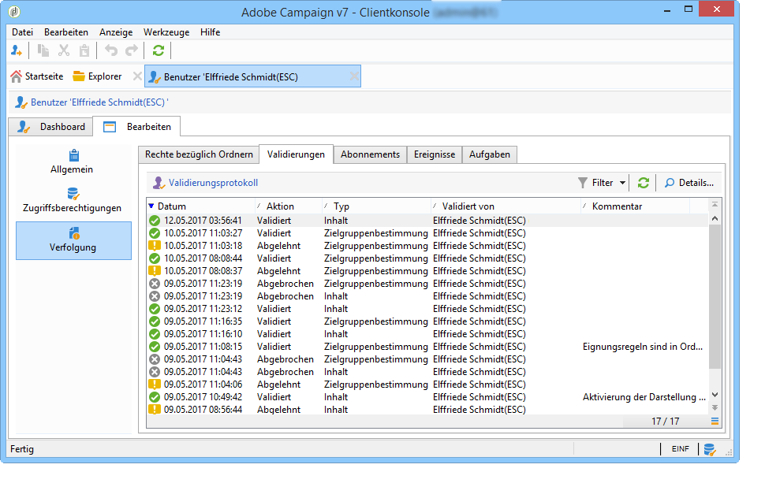
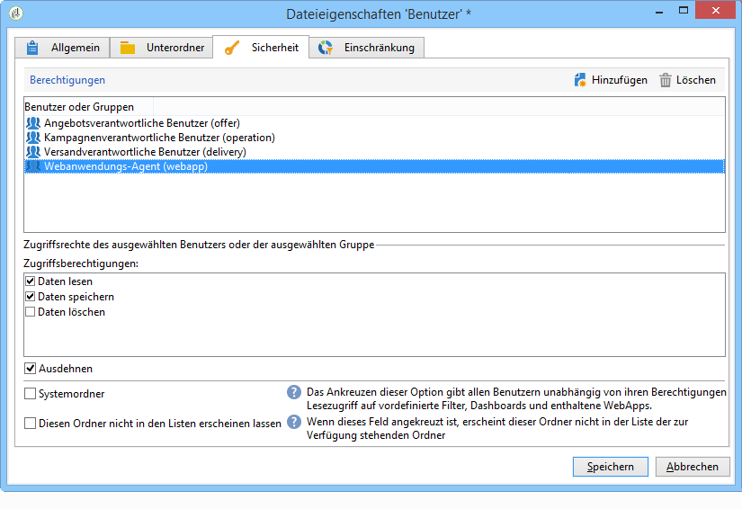

# Operatoren erstellen und verwalten {#operators}

## Erste Schritte mit den Kampagnen-Operatoren {#about-operators}

Ein Benutzer ist ein Benutzer von Adobe Campaign, der die Berechtigung besitzt, sich anzumelden und Aktionen durchzuführen.

Benutzerprofile werden standardmäßig im Knoten **[!UICONTROL Administration > Zugriffe > Benutzer]** gespeichert.

Benutzer können entweder manuell oder durch Mapping zu einem bestehenden LDAP-Verzeichnis erstellt werden.

Das Verfahren zum Erstellen eines Benutzers wird auf [dieser Seite](#creating-an-operator) erläutert.

Auf [dieser Seite](../../installation/using/connecting-through-ldap.md) finden Sie weitere Angaben zu Adobe Campaign und zur LDAP-Integration.

>[!IMPORTANT]
>
>Benutzer müssen einer Sicherheitszone zugeordnet sein, um sich auf einer Instanz anmelden zu können. Mehr Informationen über Sicherheitszonen in Adobe Campaign können auf [dieser Seite](../../installation/using/security-zones.md) nachgelesen werden.

Benutzer können auch über ihre Adobe ID eine direkt Verbindung mit Adobe Campaign herstellen. Weiterführende Informationen hierzu finden Sie auf dieser [Seite](../../integrations/using/about-adobe-id.md).

## Erstellen eines Operators {#creating-an-operator}

Gehen Sie wie folgt vor, um einen neuen Benutzer zu erstellen und Berechtigungen zu erteilen:

1. Klicken Sie auf die Schaltfläche **[!UICONTROL Neu]** oberhalb der Benutzerliste und erfassen Sie die Details des Benutzers.

   

1. Spezifizieren Sie die **[!UICONTROL Authentifizierungsparameter]** des Benutzers: Login, Password und Name. Login und Passwort werden vom jeweiligen Benutzer zur Anmeldung bei Adobe Campaign verwendet. Nach der Anmeldung kann der Benutzer sein Passwort im Menü **[!UICONTROL Werkzeuge > Passwort ändern...]** ändern. Die E-Mail-Adresse des Benutzers ist notwendig, um dem Benutzer Benachrichtigungen zukommen zu lassen, beispielsweise wenn er für Validierungen verantwortlich ist.

   In diesem Abschnitt kann ein Benutzer zudem einer Organisationseinheit zugeordnet werden. Siehe hierzu auch [diese Seite](../../campaign/using/about-distributed-marketing.md).

1. Wählen Sie die dem Benutzer erteilten Berechtigungen im Bereich **[!UICONTROL Zugriffsberechtigungen des Benutzers]** aus.

   Um dem Benutzer Berechtigungen einzuräumen, klicken Sie auf die Schaltfläche **[!UICONTROL Hinzufügen]** oberhalb der Liste der Berechtigungen. Wählen Sie anschließend eine Benutzergruppe in der Liste der verfügbaren Gruppen aus:

   

   Sie können auch eine oder mehrere spezifische Berechtigungen auswählen (siehe [Spezifische Berechtigungen](#named-rights)). Klicken Sie dazu auf den Pfeil rechts neben dem Feld **[!UICONTROL Ordner]** und wählen Sie **[!UICONTROL Spezifische Berechtigungen]** aus:

   

   Wählen Sie die jeweiligen Gruppen und/oder spezifischen Berechtigungen aus und klicken Sie zur Bestätigung auf **[!UICONTROL OK]**.

1. Klicken Sie auf **[!UICONTROL OK]**, um den Benutzer zu erstellen. Sein Profil wird der Liste der bereits existierenden Benutzer hinzugefügt.

   

>[!NOTE]
>
>Die Benutzer können bei Bedarf verschiedenen Ordnern zugewiesen werden. Klicken Sie zur Erstellung weiterer Ordner mit der rechten Maustaste auf den Benutzer-Ordner und wählen Sie **[!UICONTROL Benutzer-Ordner hinzufügen]** aus.

Wenn das Benutzerprofil erstellt wurde, können darin enthaltende Informationen vervollständigt oder aktualisiert werden. Klicken Sie hierzu auf den Tab **[!UICONTROL Bearbeiten]**.

>[!NOTE]
>
>Im Feld **[!UICONTROL Sitzungs-Timeout]** können Sie die Verzögerung vor dem Timeout der FDA-Sitzung anpassen. Weitere Informationen finden Sie unter [Über Federated Data Access - FDA](../../installation/using/about-fda.md).

## Definieren der Zeitzone des Operators {#time-zone-of-the-operator}

Im Tab **[!UICONTROL Allgemein]** können Sie die Zeitzone des Benutzers auswählen. Standardmäßig arbeiten die Benutzer in der Zeitzone des Servers. Es ist jedoch möglich, über die Dropdown-Liste eine andere Zeitzone auszuwählen.

Die Konfiguration der Zeitzonen wird auf [dieser Seite](../../installation/using/time-zone-management.md) beschrieben.

>[!NOTE]
>
>Eine Zusammenarbeit mehrerer Benutzer in unterschiedlichen Zeitzonen erfordert die Speicherung der Daten in UTC. Ein Datum wird in folgenden Kontexten in die adäquate Zeitzone konvertiert: wenn ein Datum in der Zeitzone des Benutzers angezeigt wird, wenn Dateien importiert und exportiert werden, wenn ein E-Mail-Versand terminiert ist, wenn Aktivitäten in einem Workflow terminiert sind (Planung, warten, zeitliche Beschränkung usw.)
>
>Beschränkungen und Empfehlungen bezüglich dieser Verwendungskontexte werden in den entsprechenden Abschnitten der Adobe-Campaign-Dokumentation beschrieben.

Zusätzlich können Sie aus der Dropdown-Liste **[!UICONTROL Regionale Parameter]** das Format auswählen, in dem das Datum und Zahlen dargestellt werden sollen.

## hinzufügen Berechtigungen {#access-rights-options}

Im Tab **[!UICONTROL Zugriffsberechtigungen]** können die dem Benutzer zugeordneten Gruppen und spezifischen Berechtigungen aktualisiert werden.

Über den Link **[!UICONTROL Zugriffsparameter bearbeiten...]** sind folgende Optionen verfügbar:

* Über die Option **[!UICONTROL Konto sperren]** kann das Benutzerkonto deaktiviert werden: Der Benutzer kann nicht mehr auf Adobe Campaign zugreifen.

   >[!NOTE]
   >
   >Auch wenn sein Konto deaktiviert ist, kann der Benutzer weiterhin Warnungen oder Benachrichtigungen von Campaign empfangen. Um das Senden von Campaign-Benachrichtigungen an diesen Benutzer zu stoppen, empfiehlt Adobe, die E-Mail-Adresse aus seinem Profil zu entfernen.

* Über die Option **[!UICONTROL Zugriff von der Clientkonsole aus sperren]** kann die Nutzung von Adobe Campaign auf den [Webzugriff](../../platform/using/adobe-campaign-workspace.md#console-and-web-access) oder den Zugriff über APIs beschränkt werden: Der Zugriff auf die Adobe-Campaign-Clientkonsole ist nicht mehr verfügbar.
* Dem Benutzer kann eine Sicherheitszone zugeordnet werden. Mehr Informationen hierzu finden Sie auf [dieser Seite](../../installation/using/security-zones.md).
* Zudem kann über den entsprechenden Link eine Maske vertrauenswürdiger IP-Adressen hinzugefügt werden.

   Der Benutzer kann sich in Adobe Campaign einloggen, ohne sein Passwort erfassen zu müssen, wenn seine IP-Adresse in dieser Liste enthalten ist.

   Es besteht außerdem die Möglichkeit, einen IP-Adressen-Bereich anzugeben. Alle Benutzer, deren Adresse enthalten ist, können sich, wie in folgendem Beispiel, ohne Passwort einloggen:

   

   >[!NOTE]
   >
   >Um den Zugriff auf Ihre Plattform zu sichern, ist diese Option jedoch mit Vorsicht anzuwenden.

* Die Option **[!UICONTROL Beschränken auf Daten in den Unterordnern von]** ermöglicht die Beschränkung von Zugriffsberechtigungen eines Benutzers für einen Ordner, sodass lediglich die Unterordner des in dieser Option angegebenen Knotens für den Benutzer sichtbar sind:

   

   >[!IMPORTANT]
   >
   >Es handelt sich um eine die Anzeige betreffende Einschränkung, die mit Vorsicht angewandt werden sollte. Der mit dieser Art von Berechtigung angemeldete Benutzer sieht tatsächlich NUR den Inhalt des angegebenen Ordners und kann auf keinen anderen Verzeichnisknoten zugreifen. Je nach Funktionen, auf die er Zugriff hat (z. B. Workflows), kann es jedoch möglich sein, dass Daten angezeigt werden, die in Knoten enthalten sind, die normalerweise für ihn nicht verfügbar sind.

### Prüfeinstellungen {#check-settings}

Im Tab **[!UICONTROL Verfolgung]** können detaillierte Informationen über den Benutzer eingesehen werden. Die unterschiedlichen Tabs werden automatisch entsprechend den festgelegten Einstellungen und den Einsatzbereichen des Benutzers angereichert.

Sie haben Zugriff auf Folgendes:

* Liste der dem jeweiligen Benutzer zugeordneten Berechtigungen bezüglich Ordnern;

   

   >[!NOTE]
   >
   >Weitere Informationen hierzu finden Sie unter [Zugriffsverwaltungsordner](#folder-access-management).

* Validierungsprotokoll des Benutzers;

   

* Liste der Forumsdiskussionen, die der Benutzer abonniert hat;
* Ereignisse im Kalender des Benutzers;
* Liste der dem Benutzer zugeteilten Aufgaben.

## Standardbenutzer {#default-operators}

Adobe Campaign verwendet technische Benutzer mit standardmäßig konfigurierten Parametern: Administrator (&#39;admin&#39;), Fakturierung (&#39;billing&#39;), Monitoring, Webanwendungs-Agent (&#39;wepapp&#39;) etc. Einige hängen von den auf der Plattform installierten Anwendungen und Optionen ab: Beispielsweise sind die Benutzer &#39;central&#39; und &#39;local&#39; nur vorhanden, wenn die Option Distributed Marketing installiert ist.

>[!IMPORTANT]
>
>Diese technischen Benutzer werden standardmäßig benachrichtigt, wenn von der Plattform Informationsnachrichten oder Warnungen gesendet werden. Es wird daher dringend empfohlen, eine Kontakt-E-Mail-Adresse für diese Benutzer anzugeben.
>
>Um eine korrekte Ausführung der Webanwendungen zu gewährleisten, empfehlen wir zudem, für den Benutzer &#39;webapp&#39; keine spezifischen regionalen Parameter anzugeben.

Der technische Benutzer &#39;webapp&#39; verfügt standardmäßig über die spezifische Berechtigung ADMINISTRATION, was zu Sicherheitslücken führen kann. Um diesem Problem entgegenzuwirken, empfiehlt es sich, ihm diese Berechtigung zu entziehen. Gehen Sie hierzu wie folgt vor:

1. Wählen Sie über den Knoten **[!UICONTROL Administration > Zugriffe > Spezifische Berechtigungen]** die Schaltfläche **[!UICONTROL Neu]** aus, um eine Berechtigung zu erstellen, die Sie z. B. WEBAPP nennen.

   

   Die spezifischen Berechtigungen werden im Abschnitt [Spezifische Berechtigungen](#named-rights) beschrieben.

1. Wählen Sie anschließend im Knoten **[!UICONTROL Administration > Zugriffe > Benutzer]** den Benutzer Webanwendungs-Agent (&#39;webapp&#39;).

   Gehen Sie in den Tab **[!UICONTROL Bearbeiten]**, dann in den Tab **[!UICONTROL Zugriffsberechtigungen]**, um die spezifische Berechtigung ADMINISTRATION aus der Liste zu löschen.

   

   Klicken Sie auf die Schaltfläche **[!UICONTROL Hinzufügen]** und wählen Sie die gerade von Ihnen erstellte Berechtigung WEBAPP aus, speichern Sie dann Ihre Änderungen.

   

1. Erteilen Sie dem &#39;webapp&#39;-Benutzer Lese- und Schreibzugriffsberechtigungen für die ihn betreffenden Ordner, hier hauptsächlich für die &#39;Empfänger&#39;-Ordner.

   

   Die Änderung von Berechtigungen bezüglich Ordnern im Navigationsbaum wird im Abschnitt [Zugriffsverwaltungsordner](#folder-access-management) beschrieben.

>[!NOTE]
>
>Weiterführende Informationen zu den Sicherheitsrichtlinien finden Sie unter [Checkliste von Adobe Campaign zur Sicherheitskonfiguration](https://helpx.adobe.com/de/campaign/kb/acc-security.html).
