# Zugriffsverwaltung{#access-management}

## Über Berechtigungen {#about-permissions}

Adobe Campaign ermöglicht es, die den unterschiedlichen Benutzern zugeteilten Rechte zu bestimmen und zu verwalten. Es handelt es sich um Berechtigungen und Beschränkungen folgender Aktivitäten:

* Zugriff auf bestimmte Funktionen (über spezifische Berechtigungen);
* Zugriff auf bestimmte Datensätze;
* Erstellung, Veränderung und/oder Löschung von Datensätzen (Aktionen, Kontakte, Kampagnen, Gruppen etc.).

Die Rechte können sowohl für einzelne Benutzerprofile als auch Benutzergruppen gelten.

Sie werden durch Sicherheitsparameter ergänzt, die im Zusammenhang mit dem jeweiligen Verbindungsmodus des Benutzers stehen. Mehr Informationen hierzu finden Sie auf [dieser Seite](../../installation/using/configuring-campaign-server.md#defining-security-zones).

Es gibt zwei Arten von Berechtigungen, die einem Benutzer erteilt werden können:

* Sie können Benutzergruppen bestimmen, denen Sie Berechtigungen einräumen und Benutzer zuordnen. Diese Vorgehensweise ermöglicht eine gemeinsame Nutzung der Rechte und eine Vereinheitlichung der Benutzerprofile. Zudem wird auf diese Weise die Verwaltung der Profile vereinfacht. Die Erstellung und Verwaltung von Gruppen wird im Abschnitt [Benutzergruppen](#operator-groups) näher beschrieben.
* Sie können den Benutzern direkt spezifische Berechtigungen einräumen, gegebenenfalls, um über Gruppen eingeräumte Berechtigungen zu überschreiben. Diese Berechtigungen werden im Abschnitt [Spezifische Berechtigungen](#named-rights) beschrieben.

>[!NOTE]
>
>Adobe empfiehlt, vor der Definition von Berechtigungen die [Checkliste zur Sicherheitskonfiguration](https://docs.campaign.adobe.com/doc/AC/getting_started/DE/security.html) zu lesen.

## Benutzer {#operators}

### Über Benutzer {#about-operators}

Ein Benutzer ist ein Benutzer von Adobe Campaign, der die Berechtigung besitzt, sich anzumelden und Aktionen durchzuführen.

Benutzerprofile werden standardmäßig im Knoten **[!UICONTROL Administration > Zugriffe > Benutzer]** gespeichert.

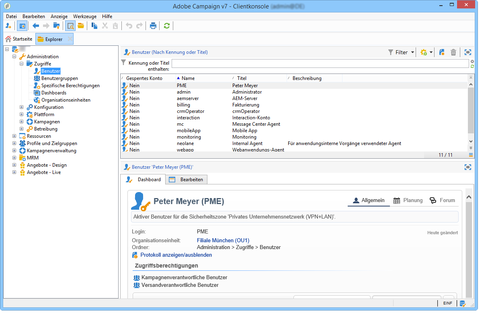

Benutzer können entweder manuell oder durch Mapping zu einem bestehenden LDAP-Verzeichnis erstellt werden.

Das Verfahren zum Erstellen eines Benutzers wird auf [dieser Seite](#creating-an-operator) erläutert.

Auf [dieser Seite](../../installation/using/connecting-through-ldap.md) finden Sie weitere Angaben zu Adobe Campaign und zur LDAP-Integration.

>[!CAUTION]
>
>Benutzer müssen einer Sicherheitszone zugeordnet sein, um sich auf einer Instanz anmelden zu können. Mehr Informationen über Sicherheitszonen in Adobe Campaign können auf [dieser Seite](../../installation/using/configuring-campaign-server.md#defining-security-zones) nachgelesen werden.

Benutzer können auch über ihre Adobe ID eine direkt Verbindung mit Adobe Campaign herstellen. Weiterführende Informationen hierzu finden Sie auf dieser [Seite](../../integrations/using/about-adobe-id.md).

### Benutzer erstellen {#creating-an-operator}

Gehen Sie wie folgt vor, um einen neuen Benutzer zu erstellen und Berechtigungen zu erteilen:

1. Klicken Sie auf die Schaltfläche **[!UICONTROL Neu]** oberhalb der Benutzerliste und erfassen Sie die Details des Benutzers.

   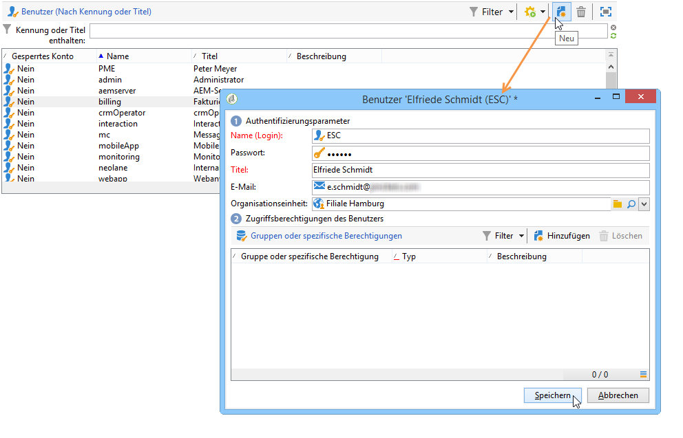

1. Spezifizieren Sie die **[!UICONTROL Authentifizierungsparameter]** des Benutzers: Login, Password und Name. Login und Passwort werden vom jeweiligen Benutzer zur Anmeldung bei Adobe Campaign verwendet. Nach der Anmeldung kann der Benutzer sein Passwort im Menü **[!UICONTROL Werkzeuge > Passwort ändern...]** ändern. Die E-Mail-Adresse des Benutzers ist notwendig, um dem Benutzer Benachrichtigungen zukommen zu lassen, beispielsweise wenn er für Validierungen verantwortlich ist.

   In diesem Abschnitt kann ein Benutzer zudem einer Organisationseinheit zugeordnet werden. Siehe hierzu auch [diese Seite](../../campaign/using/about-distributed-marketing.md).

1. Wählen Sie die dem Benutzer erteilten Berechtigungen im Bereich **[!UICONTROL Zugriffsberechtigungen des Benutzers]** aus.

   Um dem Benutzer Berechtigungen einzuräumen, klicken Sie auf die Schaltfläche **[!UICONTROL Hinzufügen]** oberhalb der Liste der Berechtigungen. Wählen Sie anschließend eine Benutzergruppe in der Liste der verfügbaren Gruppen aus:

   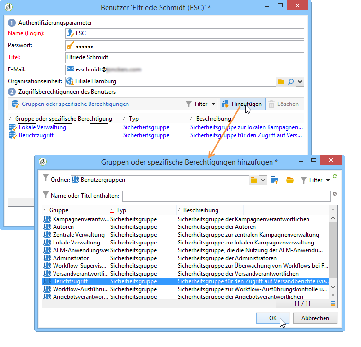

   Sie können auch eine oder mehrere spezifische Berechtigungen auswählen (siehe [Spezifische Berechtigungen](#named-rights)). Klicken Sie dazu auf den Pfeil rechts neben dem Feld **[!UICONTROL Ordner]** und wählen Sie **[!UICONTROL Spezifische Berechtigungen]** aus:

   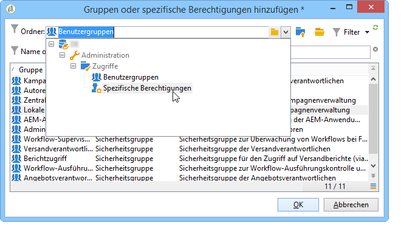

   Wählen Sie die jeweiligen Gruppen und/oder spezifischen Berechtigungen aus und klicken Sie zur Bestätigung auf **[!UICONTROL OK]**.

1. Klicken Sie auf **[!UICONTROL OK]**, um den Benutzer zu erstellen. Sein Profil wird der Liste der bereits existierenden Benutzer hinzugefügt.

   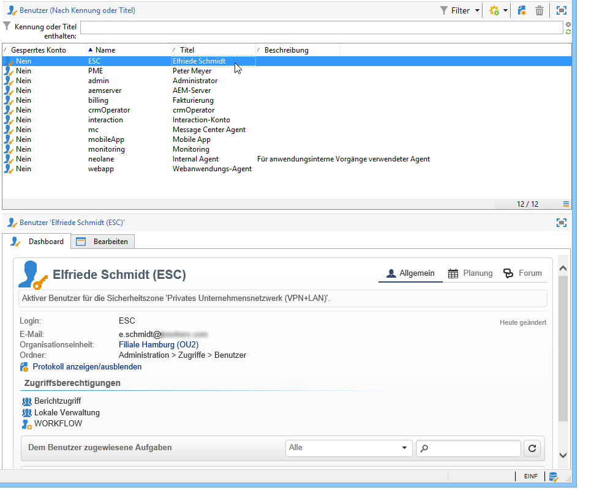

>[!NOTE]
>
>Die Benutzer können bei Bedarf verschiedenen Ordnern zugewiesen werden. Klicken Sie zur Erstellung weiterer Ordner mit der rechten Maustaste auf den Benutzer-Ordner und wählen Sie **[!UICONTROL Benutzer-Ordner hinzufügen]** aus.

Wenn das Benutzerprofil erstellt wurde, können darin enthaltende Informationen vervollständigt oder aktualisiert werden. Klicken Sie hierzu auf den Tab **[!UICONTROL Bearbeiten]**.

>[!NOTE]
>
>Im Feld **[!UICONTROL Sitzungs-Timeout]** können Sie die Verzögerung vor dem Timeout der FDA-Sitzung anpassen. Weitere Informationen finden Sie unter [Über Federated Data Access - FDA](../../platform/using/about-fda.md).

### Benutzer-Zeitzone {#time-zone-of-the-operator}

Im Tab **[!UICONTROL Allgemein]** können Sie die Zeitzone des Benutzers auswählen. Standardmäßig arbeiten die Benutzer in der Zeitzone des Servers. Es ist jedoch möglich, über die Dropdown-Liste eine andere Zeitzone auszuwählen.

Die Konfiguration der Zeitzonen wird auf [dieser Seite](../../installation/using/time-zone-management.md) beschrieben.

>[!NOTE]
>
>Eine Zusammenarbeit mehrerer Benutzer in unterschiedlichen Zeitzonen erfordert die Speicherung der Daten in UTC. Ein Datum wird in folgenden Kontexten in die adäquate Zeitzone konvertiert: wenn ein Datum in der Zeitzone des Benutzers angezeigt wird, wenn Dateien importiert und exportiert werden, wenn ein E-Mail-Versand terminiert ist, wenn Aktivitäten in einem Workflow terminiert sind (Planung, warten, zeitliche Beschränkung usw.)
>
>Beschränkungen und Empfehlungen bezüglich dieser Verwendungskontexte werden in den entsprechenden Abschnitten der Adobe-Campaign-Dokumentation beschrieben.

Zusätzlich können Sie aus der Dropdown-Liste **[!UICONTROL Regionale Parameter]** das Format auswählen, in dem das Datum und Zahlen dargestellt werden sollen.

### Optionen für Zugriffsberechtigungen {#access-rights-options}

Im Tab **[!UICONTROL Zugriffsberechtigungen]** können die dem Benutzer zugeordneten Gruppen und spezifischen Berechtigungen aktualisiert werden.

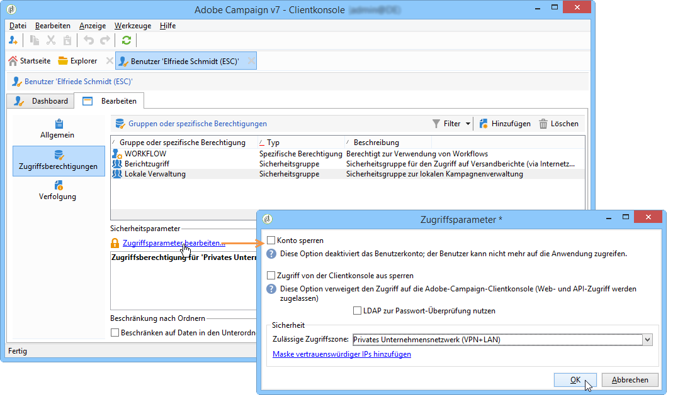

Über den Link **[!UICONTROL Zugriffsparameter bearbeiten...]** sind folgende Optionen verfügbar:

* Über die Option **[!UICONTROL Konto sperren]** kann das Benutzerkonto deaktiviert werden: Der Benutzer kann nicht mehr auf Adobe Campaign zugreifen.
* Über die Option **[!UICONTROL Zugriff von der Clientkonsole aus sperren]** kann die Nutzung von Adobe Campaign auf den [Webzugriff](../../platform/using/adobe-campaign-workspace.md#console-and-web-access) oder den Zugriff über APIs beschränkt werden: Der Zugriff auf die Adobe-Campaign-Clientkonsole ist nicht mehr verfügbar.
* Dem Benutzer kann eine Sicherheitszone zugeordnet werden. Mehr Informationen hierzu finden Sie auf [dieser Seite](../../installation/using/configuring-campaign-server.md#defining-security-zones).
* Zudem kann über den entsprechenden Link eine Maske vertrauenswürdiger IP-Adressen hinzugefügt werden.

   Der Benutzer kann sich in Adobe Campaign einloggen, ohne sein Passwort erfassen zu müssen, wenn seine IP-Adresse in dieser Liste enthalten ist.

   Es besteht außerdem die Möglichkeit, einen IP-Adressen-Bereich anzugeben. Alle Benutzer, deren Adresse enthalten ist, können sich, wie in folgendem Beispiel, ohne Passwort einloggen:

   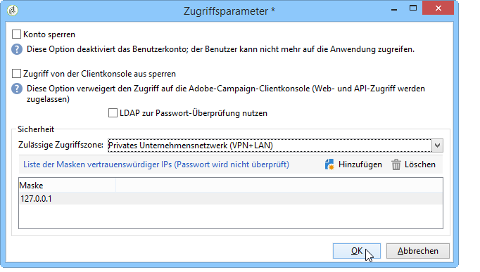

   >[!NOTE]
   >
   >Um den Zugriff auf Ihre Plattform zu sichern, ist diese Option jedoch mit Vorsicht anzuwenden.

* Die Option **[!UICONTROL Beschränken auf Daten in den Unterordnern von]** ermöglicht die Beschränkung von Zugriffsberechtigungen eines Benutzers für einen Ordner, sodass lediglich die Unterordner des in dieser Option angegebenen Knotens für den Benutzer sichtbar sind:

   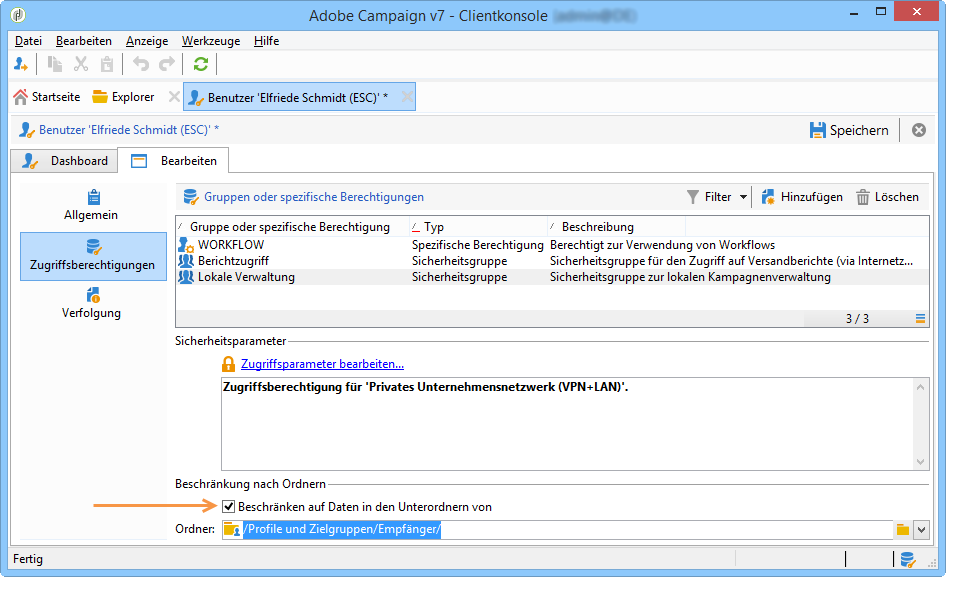

   >[!CAUTION]
   >
   >Es handelt sich um eine die Anzeige betreffende Einschränkung, die mit Vorsicht angewandt werden sollte. Der mit dieser Art von Berechtigung angemeldete Benutzer sieht tatsächlich NUR den Inhalt des angegebenen Ordners und kann auf keinen anderen Verzeichnisknoten zugreifen. Je nach Funktionen, auf die er Zugriff hat (z. B. Workflows), kann es jedoch möglich sein, dass Daten angezeigt werden, die in Knoten enthalten sind, die normalerweise für ihn nicht verfügbar sind.

### Ordner, Validierung und Aufgaben eines Benutzers {#folders--approval-and-tasks-of-an-operator}

Im Tab **[!UICONTROL Verfolgung]** können detaillierte Informationen über den Benutzer eingesehen werden. Die unterschiedlichen Tabs werden automatisch entsprechend den festgelegten Einstellungen und den Einsatzbereichen des Benutzers angereichert.

Sie haben Zugriff auf Folgendes:

* Liste der dem jeweiligen Benutzer zugeordneten Berechtigungen bezüglich Ordnern;

   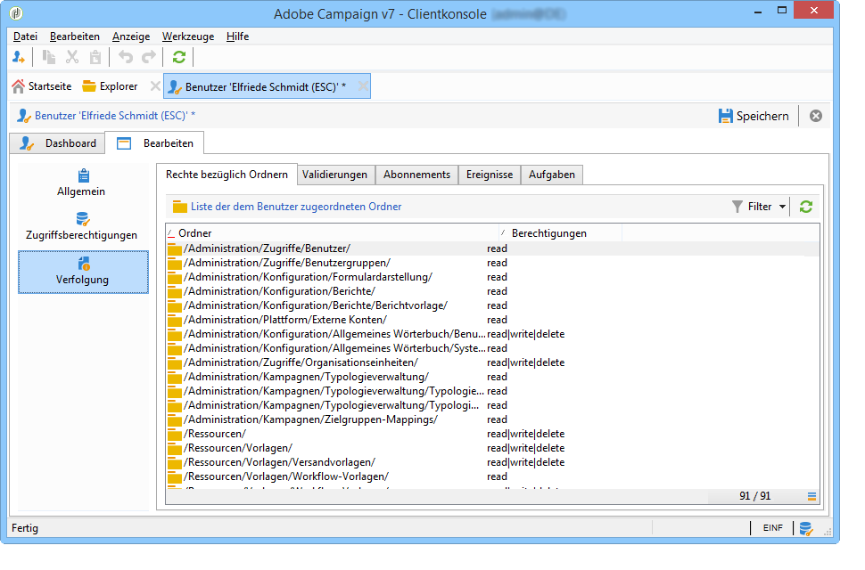

   >[!NOTE]
   >
   >Weitere Informationen hierzu finden Sie unter [Zugriffsverwaltungsordner](#folder-access-management).

* Validierungsprotokoll des Benutzers;

   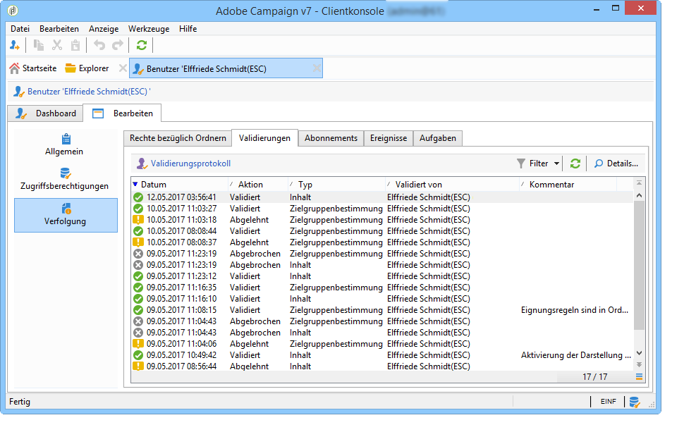

* Liste der Forumsdiskussionen, die der Benutzer abonniert hat;
* Ereignisse im Kalender des Benutzers;
* Liste der dem Benutzer zugeteilten Aufgaben.

### Standardbenutzer {#default-operators}

Adobe Campaign verwendet technische Benutzer mit standardmäßig konfigurierten Parametern: Administrator (&#39;admin&#39;), Fakturierung (&#39;billing&#39;), Monitoring, Webanwendungs-Agent (&#39;wepapp&#39;) etc. Einige hängen von den auf der Plattform installierten Anwendungen und Optionen ab: Beispielsweise sind die Benutzer &#39;central&#39; und &#39;local&#39; nur vorhanden, wenn die Option Distributed Marketing installiert ist.

>[!CAUTION]
>
>Diese technischen Benutzer werden standardmäßig benachrichtigt, wenn von der Plattform Informationsnachrichten oder Warnungen gesendet werden. Es wird daher dringend empfohlen, eine Kontakt-E-Mail-Adresse für diese Benutzer anzugeben.
>
>Um eine korrekte Ausführung der Webanwendungen zu gewährleisten, empfehlen wir zudem, für den Benutzer &#39;webapp&#39; keine spezifischen regionalen Parameter anzugeben.

Der technische Benutzer &#39;webapp&#39; verfügt standardmäßig über die spezifische Berechtigung ADMINISTRATION, was zu Sicherheitslücken führen kann. Um diesem Problem entgegenzuwirken, empfiehlt es sich, ihm diese Berechtigung zu entziehen. Gehen Sie hierzu wie folgt vor:

1. Wählen Sie über den Knoten **[!UICONTROL Administration > Zugriffe > Spezifische Berechtigungen]** die Schaltfläche **[!UICONTROL Neu]** aus, um eine Berechtigung zu erstellen, die Sie z. B. WEBAPP nennen.

   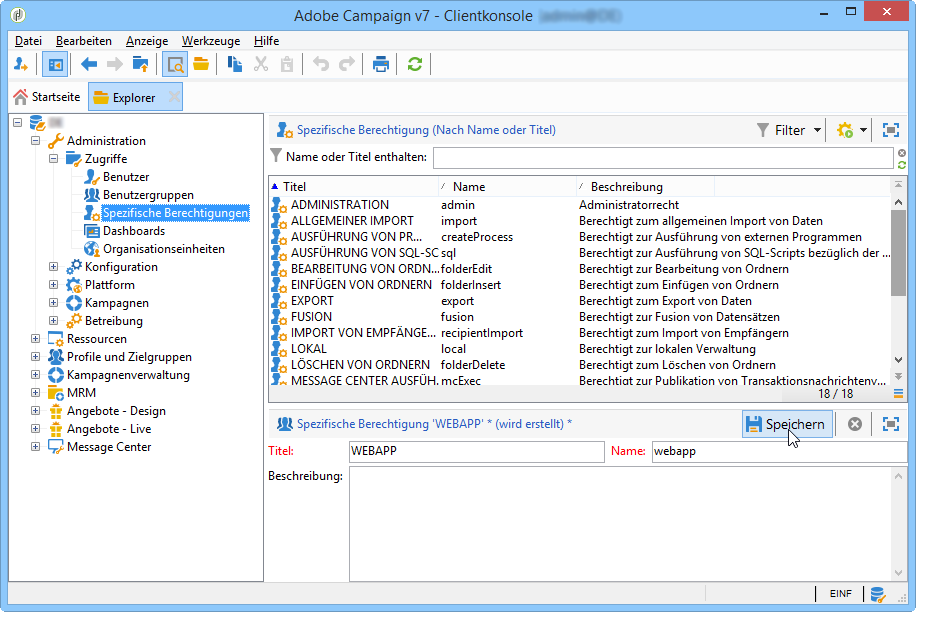

   Die spezifischen Berechtigungen werden im Abschnitt [Spezifische Berechtigungen](#named-rights) beschrieben.

1. Wählen Sie anschließend im Knoten **[!UICONTROL Administration > Zugriffe > Benutzer]** den Benutzer Webanwendungs-Agent (&#39;webapp&#39;).

   Gehen Sie in den Tab **[!UICONTROL Bearbeiten]**, dann in den Tab **[!UICONTROL Zugriffsberechtigungen]**, um die spezifische Berechtigung ADMINISTRATION aus der Liste zu löschen.

   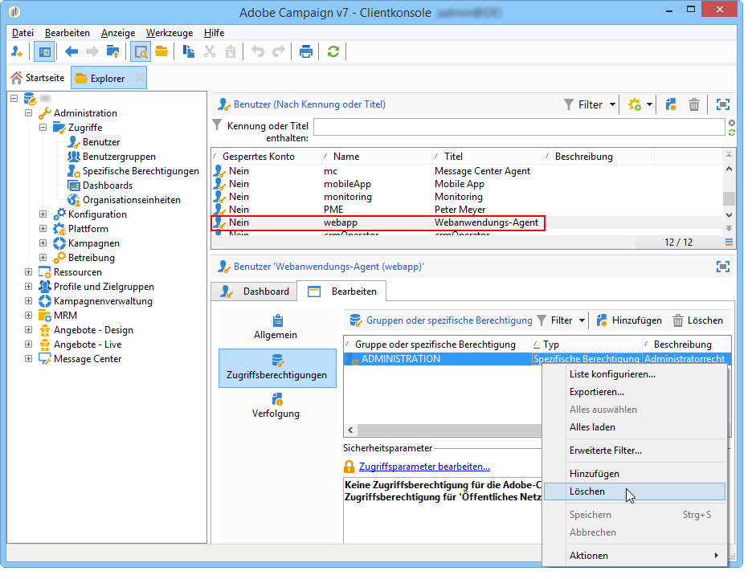

   Klicken Sie auf die Schaltfläche **[!UICONTROL Hinzufügen]** und wählen Sie die gerade von Ihnen erstellte Berechtigung WEBAPP aus, speichern Sie dann Ihre Änderungen.

   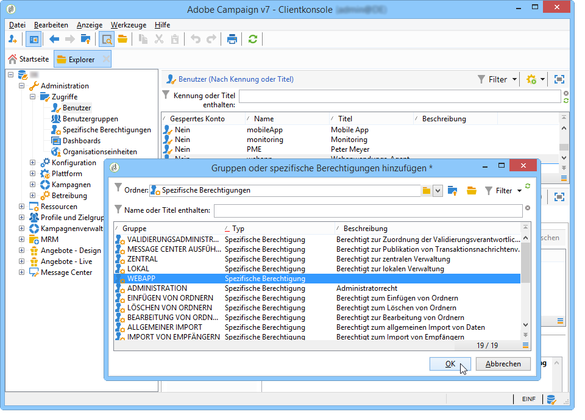

1. Erteilen Sie dem &#39;webapp&#39;-Benutzer Lese- und Schreibzugriffsberechtigungen für die ihn betreffenden Ordner, hier hauptsächlich für die &#39;Empfänger&#39;-Ordner.

   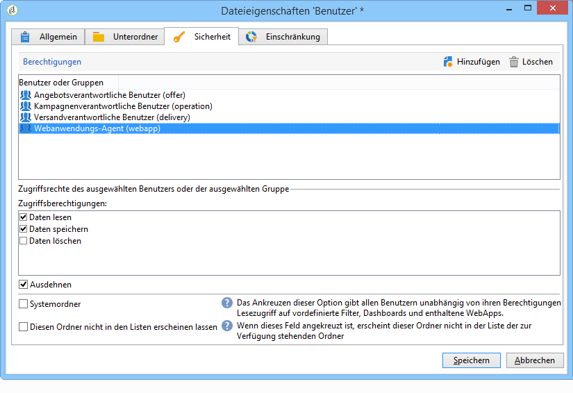

   Die Änderung von Berechtigungen bezüglich Ordnern im Navigationsbaum wird im Abschnitt [Zugriffsverwaltungsordner](#folder-access-management) beschrieben.

>[!NOTE]
>
>Weiterführende Informationen zu den Sicherheitsrichtlinien finden Sie unter [Checkliste von Adobe Campaign zur Sicherheitskonfiguration](https://docs.campaign.adobe.com/doc/AC/getting_started/DE/security.html).

## Benutzergruppen {#operator-groups}

Benutzergruppen werden über den Verzeichnisknoten **[!UICONTROL Administration > Zugriffe > Benutzergruppen]** erstellt.

### Erstellung neuer Benutzergruppen {#creating-a-new-operator-group}

Gehen Sie wie folgt vor, um eine neue Benutzergruppe zu erstellen:

1. Klicken Sie oberhalb der Gruppenliste auf die Schaltfläche **[!UICONTROL Neu]** oder klicken Sie mit der rechten Maustaste auf die Liste und wählen Sie **[!UICONTROL Neu]**.
1. Geben Sie im unteren Bereich des Fensters im Tab **[!UICONTROL Allgemein]** den Namen und die Beschreibung der Gruppe in die entsprechenden Felder ein.

   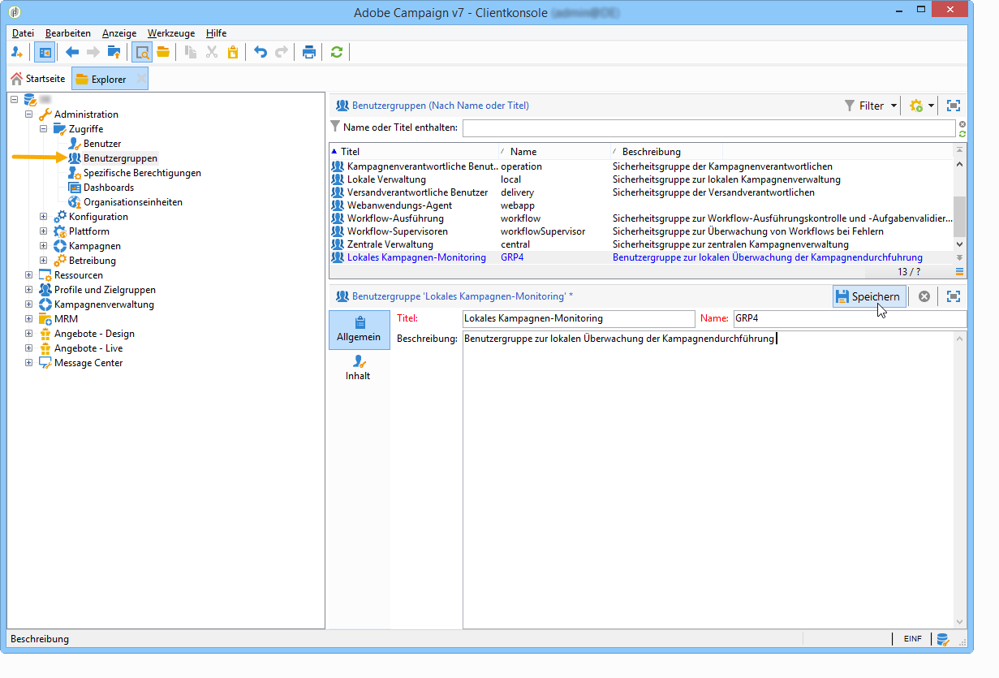

1. Klicken Sie auf den Tab **[!UICONTROL Inhalt]**, um der Gruppe Berechtigungen einzuräumen.
1. Klicken Sie auf die Schaltfläche **[!UICONTROL Hinzufügen]**, um spezifische Berechtigungen oder Benutzer auszuwählen, die der Gruppe hinzugefügt werden sollen.
1. Klicken Sie auf die Dropdown-Liste oder auf das Ordnersymbol rechts neben dem Feld **[!UICONTROL Ordner]**, um die der Gruppe zuzuordnenden spezifischen Berechtigungen oder Benutzer zu lokalisieren und anzuzeigen.
1. Wählen Sie die hinzuzufügenden Berechtigungen oder Benutzer aus und klicken Sie zum Bestätigen auf **[!UICONTROL OK]**.

   

   Wiederholen Sie diese Schritte, um weitere Berechtigungen oder Benutzer hinzuzufügen.

1. Klicken Sie abschließend auf die Schaltfläche **[!UICONTROL Speichern]**, um die Gruppe der Liste hinzuzufügen.

### Standardgruppen {#default-groups}

Es existieren folgende Standardgruppen:

1. Versandverantwortliche Benutzer

   Die Benutzer dieser Gruppe sind für die Versandverwaltung verantwortlich. Die Gruppe verleiht Zugriff auf die für die Erstellung und Vorbereitung von Sendungen notwendigen Hauptressourcen (Kampagnentypologien, Versandmappings, Standardvorlagen, Gestaltungsbausteine etc.).

   Die Gruppe beinhaltet folgende spezifische Berechtigungen:

   * SENDUNGEN VORBEREITEN: Berechtigt zum Erstellen, Bearbeiten und Starten der Versandanalyse;
   * SENDUNGEN STARTEN: Berechtigt zur Validierung von zuvor analysierten Sendungen;

1. Kampagnenverantwortliche Benutzer

   Die Benutzer dieser Gruppe können Marketingkampagnen verwalten. Sie verleiht Zugriff auf mit Kampagnen verbundene Elemente (Pläne, Programme, Workflows, Budgets etc.).

   Die Gruppe beinhaltet folgende spezifische Berechtigungen:

   * EINFÜGEN VON ORDNERN: Berechtigt zum Einfügen von Ordnern in den Adobe-Campaign-Navigationsbaum (erfordert Schreibzugriff auf betroffene Zweige);
   * WORKFLOW: Berechtigt zur Nutzung von Workflows.
   >[!NOTE]
   >
   >Benutzer dieser Gruppe können keine Sendungen starten.

1. Autoren

   Benutzer dieser Gruppe haben im Rahmen der **Inhaltsverwaltung** (optionales Adobe-Campaign-Modul Content Manager) Zugriff auf Inhaltsordner. Die Gruppe verleiht keine zusätzlichen Berechtigungen.

1. Berichtzugriff

   Diese Gruppe ermöglicht es externen Benutzern, über einen Webzugriff Versandberichte einzusehen.

1. Workflow-Ausführung

   Diese Gruppe verleiht Benutzern die Berechtigung, die von Kampagnen unabhängigen Workflows zu verwalten.

1. Workflow-Supervisoren

   Die Benutzer dieser Gruppe werden im Falle von Meldungen bezüglich Kampagnen-Workflows per E-Mail benachrichtigt.

1. Lokale/Zentrale Verwaltung

   Diese Gruppen ermöglichen den Einsatz des **Dezentralen Marketings** (optionales Adobe-Campaign-Modul).

## Spezifische Berechtigungen {#named-rights}

Adobe Campaign bietet standardmäßig eine Reihe von spezifischen Berechtigungen, die Benutzern und Gruppen bestimmte Rechte einräumen. Diese Berechtigungen können über den Verzeichnisknoten **[!UICONTROL Administration > Zugriffe > Spezifische Berechtigungen]** bearbeitet werden.

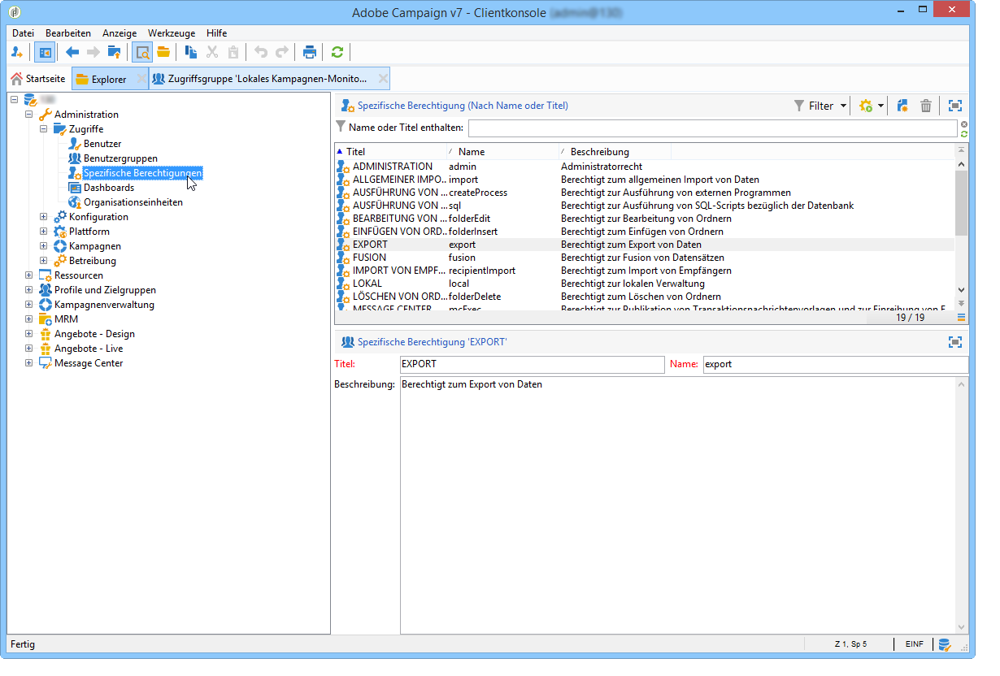

Es handelt sich um folgende Berechtigungen:

* **[!UICONTROL ADMINISTRATION]**: Benutzer mit **[!UICONTROL ADMINISTRATORRECHTEN]** haben vollen Zugriff auf die Instanz. Administratoren können Objekte wie Workflows, Sendungen, Skripte usw. ausführen, erstellen, bearbeiten und löschen.

* **[!UICONTROL VALIDIERUNGSADMINISTRATION]**: Sie können verschiedene Validierungsschritte innerhalb von Workflows und Sendungen festlegen, um sicherzustellen, dass der aktuelle Status durch einen zugewiesenen Benutzer oder eine zugewiesene Gruppe validiert wurde. Benutzer mit der Berechtigung **[!UICONTROL VALIDIERUNGSADMINISTRATION]** können Validierungsschritte festlegen und auch einen Benutzer oder eine Benutzergruppe zuweisen, der bzw. die diese Schritte validieren soll.

* **[!UICONTROL ZENTRAL]**: Berechtigt zur zentralen Verwaltung (Dezentrales Marketing).

* **[!UICONTROL LÖSCHEN VON ORDNERN]**: Berechtigt zum Löschen von Ordnern. Mit dieser Berechtigung können Benutzer Ordner aus der Explorer-Ansicht löschen.

* **[!UICONTROL BEARBEITUNG VON ORDNERN]**: Berechtigt zum Ändern von Ordnereigenschaften wie interner Name, Titel, verknüpftes Bild, Reihenfolge der Unterordner usw.

* **[!UICONTROL EXPORTIEREN]**: Mit der Workflow-Aktivität **[!UICONTROL EXPORTIEREN]** können Benutzer Daten aus ihren Adobe Campaign-Instanzen in eine Datei auf einem Server oder lokalen Computer exportieren.

* **[!UICONTROL ZUGRIFF AUF DATEIEN]**: Berechtigung für Lese- und Schreibzugriff auf Dateien über ein Skript, das in die **[!UICONTROL JavaScript]**-Workflow-Aktivität geschrieben werden kann, um Dateien auf einem Server zu lesen und zu schreiben.

* **[!UICONTROL ALLGEMEINER IMPORT]**: Berechtigt zum allgemeinen Import von Daten. Mit **[!UICONTROL ALLGEMEINER IMPORT]** können Sie Daten in eine andere Tabelle importieren, während die Berechtigung **[!UICONTROL BERECHTIGT ZUM IMPORT VON EMPFÄNGERN]** nur den Import in die Empfängertabelle erlaubt.

* **[!UICONTROL EINFÜGEN VON ORDNERN]**: Berechtigt zum Einfügen von Ordnern. Benutzer mit der Berechtigung **[!UICONTROL EINFÜGEN VON ORDNERN]** können in der Ordnerstruktur der Explorer-Ansicht neue Ordner erstellen.

* **[!UICONTROL LOKAL]**: Berechtigt zur lokalen Verwaltung (Dezentrales Marketing).

* **[!UICONTROL FUSION]**: Berechtigt zum Verbinden der ausgewählten Datensätze zu einem Datensatz. Wenn Empfänger als Duplikate vorhanden sind, kann der Benutzer mit der Berechtigung **[!UICONTROL FUSION]** die Duplikate auswählen und zu einem primären Empfänger vereinen.

* **[!UICONTROL SENDUNGEN VORBEREITEN]**: Berechtigung zum Erstellen, Bearbeiten und Speichern einer Sendung. Benutzer mit der Berechtigung **[!UICONTROL SENDUNGEN VORBEREITEN]** können auch den Prozess der Versandanalyse starten.

* **[!UICONTROL DATENSCHUTZRECHT]**: Berechtigt dazu, Datenschutzdaten zu sammeln und zu löschen. Weiterführende Informationen hierzu finden Sie auf dieser [Seite](https://helpx.adobe.com/de/campaign/kb/acc-privacy.html).

* **[!UICONTROL AUSFÜHRUNG VON PROGRAMMEN]**: Berechtigt dazu, Befehle in verschiedenen Programmiersprachen auszuführen.

* **[!UICONTROL IMPORT VON EMPFÄNGERN]**: Berechtigt zum Import von Empfängern. Benutzer mit der Berechtigung **[!UICONTROL IMPORT VON EMPFÄNGERN]** können eine lokale Datei in eine Empfängertabelle importieren.

* **[!UICONTROL AUSFÜHRUNG VON SQL-SCRIPTS]**: Berechtigt zur Ausführung von SQL-Befehlen direkt in der Datenbank.

* **[!UICONTROL SENDUNGEN STARTEN]**: Berechtigt zur Validierung von zuvor analysierten Sendungen. Nach der Versandanalyse wird der Versand bei verschiedenen Validierungsschritten angehalten und muss validiert werden, damit er wieder aufgenommen werden kann. Benutzer mit der Berechtigung **[!UICONTROL SENDUNGEN STARTEN]** können Sendungen validieren.

* **[!UICONTROL SQL-DATEN-MANAGEMENT-AKTIVITÄT VERWENDEN]**: Berechtigt zum Schreiben Ihrer eigenen SQL-Scripts unter Verwendung der SQL-Daten-Management-Aktivität, um Arbeitstabellen zu erstellen und zu füllen (siehe [diesen Abschnitt](../../workflow/using/sql-data-management.md)).

* **[!UICONTROL WORKFLOW]**: Berechtigt zur Ausführung von Workflows. Ohne diese Berechtigung können Benutzer Workflows nicht starten, anhalten oder neu starten.

* **[!UICONTROL WEBAPP]**: Berechtigt zur Nutzung von Web-Anwendungen.

>[!NOTE]
>
>Diese Liste kann je nach den auf der Plattform installierten Add-ons unterschiedlich aussehen.

## Matrix der Zugriffsberechtigungen {#access-rights-matrix}

Standardgruppen und spezifische Berechtigungen legen den Zugriff auf bestimmte Ordner des Navigationsbaums sowie die Art des Zugriffs fest: Lesezugriff, Schreibzugriff und Löschzugriff.

Die Matrix der Zugriffsberechtigungen von Adobe Campaign ist [hier](/help/platform/using/assets/accessrights.pdf) verfügbar.

## Zugriffsverwaltungsordner {#folder-access-management}

Jedem Ordner des Navigationsbaums sind Schreib-, Lese- und Lösch-Zugriffseigenschaften zugeordnet. Um auf einen Ordner zugreifen zu können, müssen ein Benutzer oder eine Benutzergruppe mindestens über einen Lesezugriff verfügen.

### Berechtigungen für einen Ordner bearbeiten {#edit-permissions-on-a-folder}

Um Berechtigungen für einen bestimmten Ordner des Baums zu bearbeiten, gehen Sie folgendermaßen vor:

1. Klicken Sie mit der rechten Maustaste auf den entsprechenden Ordner und wählen Sie **[!UICONTROL Eigenschaften...]**.

   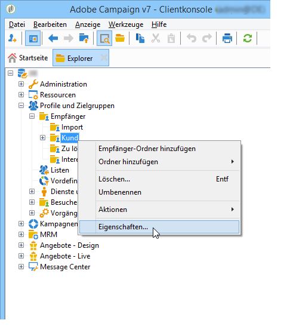

1. Klicken Sie auf den Tab **[!UICONTROL Sicherheit]**, um die Berechtigungen bezüglich des Ordners anzusehen.

   

### Berechtigungen ändern {#modify-permissions}

Zum Ändern von Berechtigungen haben Sie folgende Möglichkeiten:

* **Gruppe oder Benutzer ersetzen**: Klicken Sie hierzu auf eine der Gruppen (oder Benutzer), die über Berechtigungen bezüglich des Ordners verfügen, und wählen Sie eine neue Gruppe (oder einen neuen Benutzer) über die Auswahlliste aus:

   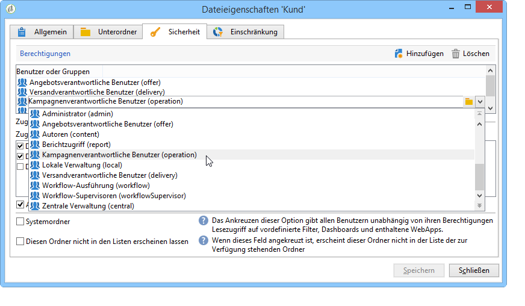

* **Gruppe oder Benutzer berechtigen**: Klicken Sie hierzu auf die Schaltfläche **[!UICONTROL Hinzufügen]** und wählen Sie die Gruppe oder den Benutzer aus, denen Berechtigungen bezüglich des Ordners zugewiesen werden sollen.
* **Gruppe oder Benutzer verbieten**: Klicken Sie hierzu auf die Schaltfläche **[!UICONTROL Löschen]** und wählen Sie die Gruppe oder den Benutzer aus, denen Sie jegliche Berechtigung bezüglich des Ordners entziehen möchten.
* **Berechtigungen einer Gruppe oder eines Benutzers auswählen**: Klicken Sie hierzu auf die betroffene Gruppe oder den Benutzer und wählen Sie anschließend die Zugriffsberechtigungen aus bzw. ab, die Sie zuweisen oder entziehen möchten.

   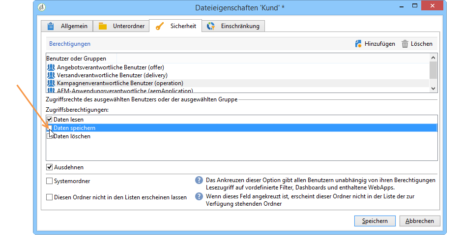

### Berechtigungen ausdehnen {#propagate-permissions}

Sie können Berechtigungen und Zugriffsberechtigungen ausdehnen. Wählen Sie dazu die Option **[!UICONTROL Ausdehnen]** in den Dateieigenschaften aus.

Die in diesem Fenster festgelegten Berechtigungen werden dadurch auf alle Unterordner des aktuellen Verzeichnisknotens ausgeweitet. Die Berechtigungen können anschließend für jeden einzelnen der Unterordner überschrieben werden.

>[!NOTE]
>
>Wenn Sie diese Option für einen Ordner abwählen, ist sie nicht automatisch auch für alle Unterordner dieses Ordners abgewählt. Sie muss für jeden Unterordner einzeln abgewählt werden.

### Allen Benutzern Zugriff gewähren {#grant-access-to-all-operators}

Wenn im Tab **[!UICONTROL Sicherheit]** die Option **[!UICONTROL Systemordner]** angekreuzt ist, haben alle Benutzer ungeachtet ihrer Berechtigungen Zugriff auf die Daten des Ordners. Wenn die Option nicht angekreuzt ist, muss ein Benutzer (oder seine Gruppe) der Liste ausdrücklich hinzugefügt werden, um Zugriff zu erhalten.

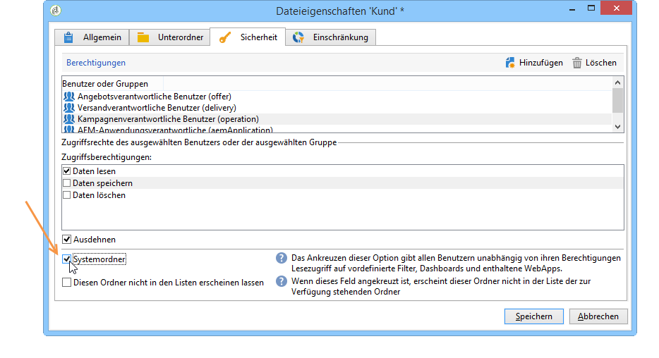

## Ordner und Ansichten {#folders-and-views}

### Über Ordner und Ansichten {#about-folders-and-views}

Ordner sind Knoten im Adobe Campaign-Navigationsbaum. Diese werden mit der rechten Maustaste über das Menü **[!UICONTROL Ordner hinzufügen]** im Verzeichnis erstellt. Anschließend kann der zu erstellende Ordnertyp ausgewählt werden. Das erste Menü ermöglicht standardmäßig die Erstellung eines dem aktuellen Kontext entsprechenden Ordners.

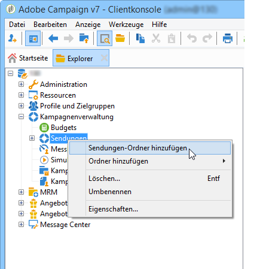

Berechtigungen bezüglich dieser Ordner werden auf die gleiche Weise wie über alle anderen Ordner des Navigationsbaums eingeräumt. Siehe [Zugriffsverwaltungsordner](#folder-access-management).

Es besteht außerdem die Möglichkeit, Ansichten zu erstellen, um den Datenzugriff einzuschränken und den Inhalt des Navigationsbaums Ihren Bedürfnissen entsprechend zu organisieren. Es ist darüber hinaus möglich, den jeweiligen Ansichten Berechtigungen zuzuordnen.

Eine Ansicht ist ein Ordner, der in einem oder mehreren anderen Ordnern des gleichen Typs gespeicherte Datensätze anzeigt. Wenn Sie beispielsweise einen Kampagnen-Ordner erstellen, der eine Ansicht ist, zeigt dieser standardmäßig alle in der Datenbank vorhandenen Kampagnen an, unabhängig von ihrer Herkunft. Ansichten bieten zudem die Möglichkeit, die enthaltenen Daten zu filtern.

Wenn ein Ordner zu einer Ansicht gemacht wird, werden alle dem Ordnertyp entsprechenden Daten, die in der Datenbank vorhanden sind, unabhängig von ihrer tatsächlichen Ordnerzuordnung angezeigt. Anschließend können sie gefiltert werden, um die Liste der angezeigten Daten einzuschränken.

>[!CAUTION]
>
>Ansichten fassen Daten zusammen und verleihen Zugriff auf sie. Die Daten sind jedoch nicht physisch im Ordner der Ansicht gespeichert. Der Benutzer muss über die der gewünschten Aktion entsprechenden Berechtigungen über den oder die Herkunftsordner der Daten verfügen (mindestens Lesezugriff).
>
>Um Zugriff auf eine Ansicht ohne Zugriff auf den Herkunftsordner zu verleihen, darf kein Lesezugriff auf den Elternknoten des Herkunftsordners gegeben werden.

### Hinzufügung von Ordnern und Erstellung von Ansichten {#adding-folders-and-creating-views}

Im folgenden Beispiel werden wir neue Ordner erstellen, um bestimmte Daten darzustellen:

1. Erstellen Sie einen neuen Ordner vom Typ **[!UICONTROL Sendungen]** und nennen Sie ihn **Sendungen Deutschland**.
1. Klicken Sie mit der rechten Maustaste auf diesen Ordner und wählen Sie **[!UICONTROL Eigenschaften...]** aus.

   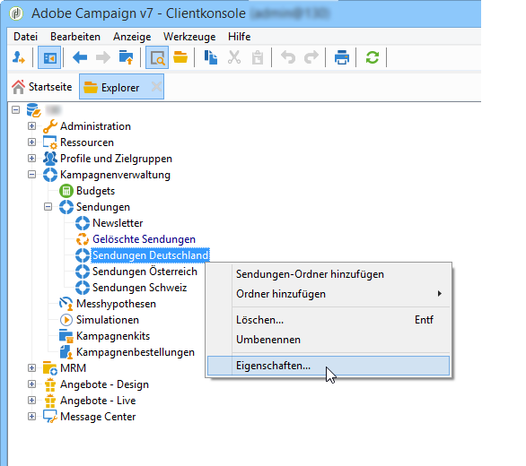

1. Wählen Sie im Tab **[!UICONTROL Einschränkung]** die Option **[!UICONTROL Dieser Ordner ist eine Ansicht]**: Nun werden alle Sendungen der Datenbank in diesem Ordner angezeigt.

   

1. Bestimmen Sie mithilfe des Abfragetools im mittleren Abschnitt des Fensters die Bedingungen, nach denen die Sendungen gefiltert werden sollen: Es werden nur die dem Filter entsprechenden Sendungen angezeigt.

   >[!NOTE]
   >
   >Der Abfrageeditor wird in [diesem Abschnitt](../../platform/using/about-queries-in-campaign.md) beschrieben.

   Mit den folgenden Filterbedingungen:

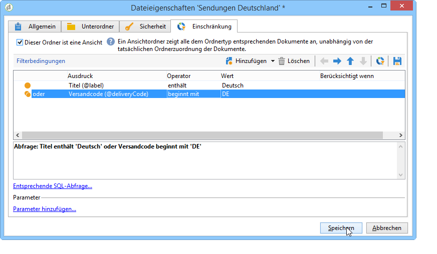

werden folgende Sendungen in der Ansicht angezeigt:

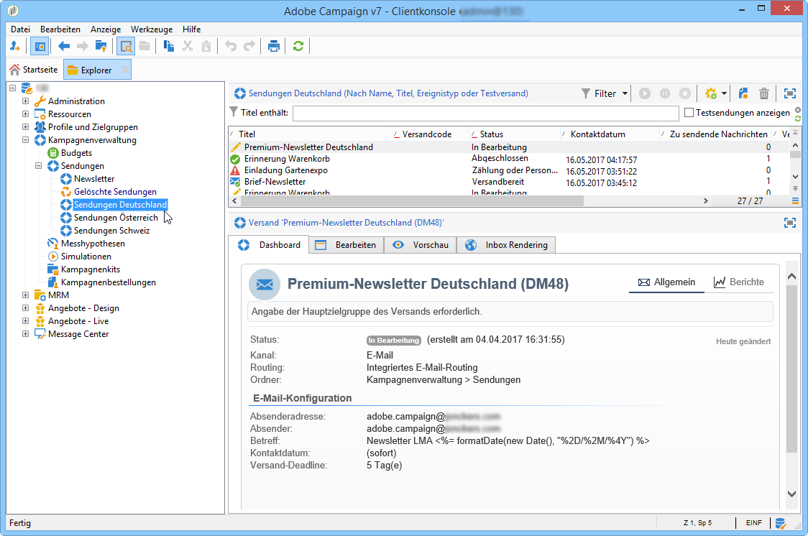

