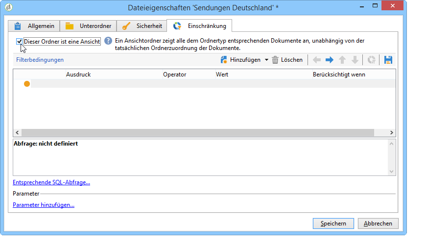

# Zugriffsverwaltung{#access-management}

## Über Berechtigungen {#about-permissions}

Adobe Campaign ermöglicht es, die den unterschiedlichen Benutzern zugeteilten Rechte zu bestimmen und zu verwalten. Es handelt es sich um Berechtigungen und Beschränkungen folgender Aktivitäten:

* Zugriff auf bestimmte Funktionen (über spezifische Berechtigungen);
* Zugriff auf bestimmte Datensätze;
* Erstellung, Veränderung und/oder Löschung von Datensätzen (Aktionen, Kontakte, Kampagnen, Gruppen etc.).

Die Rechte können sowohl für einzelne Benutzerprofile als auch Benutzergruppen gelten.

Sie werden durch Sicherheitsparameter ergänzt, die im Zusammenhang mit dem jeweiligen Verbindungsmodus des Benutzers stehen. Mehr Informationen hierzu finden Sie auf [dieser Seite](../../installation/using/configuring-campaign-server.md#defining-security-zones).

Es gibt zwei Arten von Berechtigungen, die einem Benutzer erteilt werden können:

* Sie können Gruppen von Operatoren definieren, denen Sie Rechte zuweisen, und dann die Operatoren einer oder mehreren Gruppen zuordnen. Dadurch können Sie Rechte wiederverwenden und die Benutzerprofile konsistenter gestalten. Sie erleichtert auch die Verwaltung und Pflege von Profilen. Gruppenerstellung und -verwaltung werden in [Operatorgruppen](#operator-groups)dargestellt.
* Sie können benannte Rechte Benutzern direkt zuweisen, in einigen Fällen, um die über Gruppen zugewiesenen Rechte zu überladen. Diese Rechte werden in [Namensrechten](#named-rights)dargestellt.

>[!NOTE]
>
>Adobe empfiehlt, vor der Definition von Berechtigungen die [Checkliste zur Sicherheitskonfiguration](https://docs.campaign.adobe.com/doc/AC/getting_started/EN/security.html) zu lesen.

## Benutzer {#operators}

### Über Benutzer {#about-operators}

Ein Benutzer ist ein Benutzer von Adobe Campaign, der die Berechtigung besitzt, sich anzumelden und Aktionen durchzuführen.

Standardmäßig werden Operatoren im **[!UICONTROL Administration > Access management > Operators]** Knoten gespeichert.

Benutzer können entweder manuell oder durch Mapping zu einem bestehenden LDAP-Verzeichnis erstellt werden.

Das Verfahren zum Erstellen eines Benutzers wird auf [dieser Seite](#creating-an-operator) erläutert.

Auf [dieser Seite](../../installation/using/connecting-through-ldap.md) finden Sie weitere Angaben zu Adobe Campaign und zur LDAP-Integration.

>[!CAUTION]
>
>Benutzer müssen einer Sicherheitszone zugeordnet sein, um sich auf einer Instanz anmelden zu können. Mehr Informationen über Sicherheitszonen in Adobe Campaign können auf [dieser Seite](../../installation/using/configuring-campaign-server.md#defining-security-zones) nachgelesen werden.

Benutzer können auch über ihre Adobe ID eine direkt Verbindung mit Adobe Campaign herstellen. Weiterführende Informationen hierzu finden Sie auf dieser [Seite](../../integrations/using/about-adobe-id.md).

### Benutzer erstellen {#creating-an-operator}

Gehen Sie wie folgt vor, um einen neuen Benutzer zu erstellen und Berechtigungen zu erteilen:

1. Click the **[!UICONTROL New]** button located above the list of operators, and enter the details of the new operator.

   

1. Geben Sie den **[!UICONTROL Identification parameters]** Benutzer an: Login, Kennwort und Name. Die Anmeldung und das Kennwort werden vom Bediener bei Adobe Campaign verwendet. Sobald der Benutzer angemeldet ist, kann er sein Passwort über das **[!UICONTROL Tools > Change password]** Menü ändern. Die E-Mail-Adresse des Operators ist unverzichtbar, da sie es dem Operator ermöglicht, Benachrichtigungen zu empfangen, z. B. bei der Verarbeitung von Genehmigungen.

   In diesem Abschnitt kann ein Benutzer zudem einer Organisationseinheit zugeordnet werden. Siehe hierzu auch [diese Seite](../../campaign/using/about-distributed-marketing.md).

1. Select the permissions granted to the operator in the **[!UICONTROL Operator access rights]** section.

   To assign rights to the operator, click the **[!UICONTROL Add]** button located above the list of rights, then select a group of operators from the list of available groups:

   

   Sie können auch eine oder mehrere benannte Rechte auswählen (siehe [Benannte Rechte](#named-rights)). Klicken Sie dazu auf den Pfeil rechts neben dem **[!UICONTROL Folder]** Feld und wählen Sie **[!UICONTROL Named rights]**:

   

   Wählen Sie die jeweiligen Gruppen und/oder spezifischen Berechtigungen aus und klicken Sie zur Bestätigung auf **[!UICONTROL OK]**.

1. Klicken Sie auf **[!UICONTROL Ok]**, um den Benutzer zu erstellen. Sein Profil wird der Liste der bereits existierenden Benutzer hinzugefügt.

   

>[!NOTE]
>
>You can organize the operators according to your requirements by creating new operator folders. To do this, right-click the operator folder and select **[!UICONTROL Add an 'Operators' folder]**.

Nachdem das Profil des Operators erstellt wurde, können Sie dessen Informationen hinzufügen oder aktualisieren. To do this, click the **[!UICONTROL Edit]** tab.

>[!NOTE]
>
>Im **[!UICONTROL Session timeout]** Feld können Sie die Verzögerung vor dem Timeout der FDA-Sitzung anpassen. Weitere Informationen finden Sie unter [Informationen zum Zugriff auf](../../platform/using/accessing-an-external-database.md#about-federated-data-access)Federated Data.

### Benutzer-Zeitzone {#time-zone-of-the-operator}

Auf der **[!UICONTROL General]** Registerkarte können Sie die Zeitzone des Operators auswählen. Standardmäßig arbeiten Operatoren in der Zeitzone des Servers. Es ist jedoch möglich, mithilfe der Dropdownliste eine andere Zeitzone auszuwählen.

Die Konfiguration der Zeitzonen wird auf [dieser Seite](../../installation/using/time-zone-management.md) beschrieben.

>[!NOTE]
>
>Eine Zusammenarbeit mehrerer Benutzer in unterschiedlichen Zeitzonen erfordert die Speicherung der Daten in UTC. Ein Datum wird in folgenden Kontexten in die adäquate Zeitzone konvertiert: wenn ein Datum in der Zeitzone des Benutzers angezeigt wird, wenn Dateien importiert und exportiert werden, wenn ein E-Mail-Versand terminiert ist, wenn Aktivitäten in einem Workflow terminiert sind (Planung, warten, zeitliche Beschränkung usw.)
>
>Beschränkungen und Empfehlungen bezüglich dieser Verwendungskontexte werden in den entsprechenden Abschnitten der Adobe-Campaign-Dokumentation beschrieben.

In addition, the **[!UICONTROL Regional settings]** drop-down list lets you select the format to display dates and numbers.

### Optionen für Zugriffsberechtigungen {#access-rights-options}

Use the **[!UICONTROL Access rights]** tab to update the groups and named rights linked to the operator.

The **[!UICONTROL Edit the access parameters...]** link lets you access the following options:

* The **[!UICONTROL Disable account]** option lets you disable the operator&#39;s account: he will no longer access Adobe Campaign.
* The **[!UICONTROL Forbid access from the rich client]** option lets you restrict the use of Adobe Campaign to [Web access](../../platform/using/adobe-campaign-workspace.md#console-and-web-access) or through APIs: access to the Adobe Campaign client console is no longer available.
* Dem Benutzer kann eine Sicherheitszone zugeordnet werden. Mehr Informationen hierzu finden Sie auf [dieser Seite](../../installation/using/configuring-campaign-server.md#defining-security-zones).
* Zudem kann über den entsprechenden Link eine Maske vertrauenswürdiger IP-Adressen hinzugefügt werden.

   Der Benutzer kann sich in Adobe Campaign einloggen, ohne sein Passwort erfassen zu müssen, wenn seine IP-Adresse in dieser Liste enthalten ist.

   Es besteht außerdem die Möglichkeit, einen IP-Adressen-Bereich anzugeben. Alle Benutzer, deren Adresse enthalten ist, können sich, wie in folgendem Beispiel, ohne Passwort einloggen:

   

   >[!NOTE]
   >
   >Um den Zugriff auf Ihre Plattform zu sichern, ist diese Option jedoch mit Vorsicht anzuwenden.

* Mit der **[!UICONTROL Restrict to information found in sub-folders of:]** Option können Sie die dem Ordnerbetreiber zugewiesenen Rechte einschränken. Für den Benutzer sind nur die Unterordner des in dieser Option angegebenen Knotens sichtbar:

   

   >[!CAUTION]
   >
   >Es handelt sich um eine die Anzeige betreffende Einschränkung, die mit Vorsicht angewandt werden sollte. Der mit dieser Art von Berechtigung angemeldete Benutzer sieht tatsächlich NUR den Inhalt des angegebenen Ordners und kann auf keinen anderen Verzeichnisknoten zugreifen. Je nach Funktionen, auf die er Zugriff hat (z. B. Workflows), kann es jedoch möglich sein, dass Daten angezeigt werden, die in Knoten enthalten sind, die normalerweise für ihn nicht verfügbar sind.

### Ordner, Validierung und Aufgaben eines Benutzers {#folders--approval-and-tasks-of-an-operator}

Auf der **[!UICONTROL Audit]** Registerkarte können Sie Informationen zum Operator anzeigen. Die verschiedenen Registerkarten werden automatisch hinzugefügt, basierend auf den Einstellungen, die im Interventionsbereich des Operators definiert sind.

Sie haben Zugriff auf Folgendes:

* Liste der dem jeweiligen Benutzer zugeordneten Berechtigungen bezüglich Ordnern;

   

   >[!NOTE]
   >
   >Weitere Informationen finden Sie unter [Ordnerzugriffsverwaltung](#folder-access-management).

* Validierungsprotokoll des Benutzers;

   

* Liste der Forumsdiskussionen, die der Benutzer abonniert hat;
* Ereignisse im Kalender des Benutzers;
* Liste der dem Benutzer zugeteilten Aufgaben.

### Standardbenutzer {#default-operators}

Adobe Campaign verwendet technische Benutzer mit standardmäßig konfigurierten Parametern: Administrator (&#39;admin&#39;), Fakturierung (&#39;billing&#39;), Monitoring, Webanwendungs-Agent (&#39;wepapp&#39;) etc. Einige hängen von den auf der Plattform installierten Anwendungen und Optionen ab: Beispielsweise sind die Benutzer &#39;central&#39; und &#39;local&#39; nur vorhanden, wenn die Option Distributed Marketing installiert ist.

>[!CAUTION]
>
>Diese technischen Benutzer werden standardmäßig benachrichtigt, wenn von der Plattform Informationsnachrichten oder Warnungen gesendet werden. Es wird daher dringend empfohlen, eine Kontakt-E-Mail-Adresse für diese Benutzer anzugeben.
>
>Um eine korrekte Ausführung der Webanwendungen zu gewährleisten, empfehlen wir zudem, für den Benutzer &#39;webapp&#39; keine spezifischen regionalen Parameter anzugeben.

Der technische Benutzer &#39;webapp&#39; verfügt standardmäßig über die spezifische Berechtigung ADMINISTRATION, was zu Sicherheitslücken führen kann. Um diesem Problem entgegenzuwirken, empfiehlt es sich, ihm diese Berechtigung zu entziehen. Gehen Sie hierzu wie folgt vor:

1. Klicken Sie im **[!UICONTROL Administration > Access management > Named rights]** Knoten auf , **[!UICONTROL New]** um eine rechte Seite zu erstellen und sie WEBAPP zu benennen.

   

   Named rights are detailed in the [Named rights](#named-rights) section.

1. Wählen Sie im **[!UICONTROL Administration > Access management > Operators]** Knoten den Webanwendungs-Agent-Operator (&#39;webapp&#39;).

   Select the **[!UICONTROL Edit]** tab, then the **[!UICONTROL Access rights]** tab and delete the ADMINISTRATION named right from the list.

   

   Click **[!UICONTROL Add]** and select the WEBAPP right that you have just created, then save your changes.

   

1. Erteilen Sie dem &#39;webapp&#39;-Benutzer Lese- und Schreibzugriffsberechtigungen für die ihn betreffenden Ordner, hier hauptsächlich für die &#39;Empfänger&#39;-Ordner.

   

   Modifying rights on tree folders is detailed in the [Folder access management](#folder-access-management) section.

>[!NOTE]
>
>Weiterführende Informationen zu den Sicherheitsrichtlinien finden Sie unter [Checkliste von Adobe Campaign zur Sicherheitskonfiguration](https://docs.campaign.adobe.com/doc/AC/getting_started/EN/security.html).

## Benutzergruppen {#operator-groups}

Operatorgruppen werden über den **[!UICONTROL Administration > Access management > Operator groups]** Knoten in der Struktur erstellt.

### Erstellung neuer Benutzergruppen {#creating-a-new-operator-group}

Gehen Sie wie folgt vor, um eine neue Benutzergruppe zu erstellen:

1. Click the **[!UICONTROL New]** button to the right of the list of groups or right-click the list and choose **[!UICONTROL New]**.
1. In the section lower window, from the **[!UICONTROL General]** tab, enter the name and a description for this group in the corresponding fields.

   

1. Click the **[!UICONTROL Content]** tab to define authorizations for this group.
1. Click the **[!UICONTROL Add]** button to select an appointed right or an operator to associate to the group.
1. Click the drop-down list or on the folder to the right of the **[!UICONTROL Folder]** field to locate the appointed rights or operators to associate to this group.
1. Wählen Sie die hinzuzufügenden Berechtigungen oder Benutzer aus und klicken Sie zum Bestätigen auf **[!UICONTROL OK]**.

   

   Wiederholen Sie diese Schritte, um weitere Berechtigungen oder Benutzer hinzuzufügen.

1. Click the **[!UICONTROL Save]** button to add the group to the list.

### Standardgruppen {#default-groups}

Es existieren folgende Standardgruppen:

1. Versandverantwortliche Benutzer

   Die Benutzer dieser Gruppe sind für die Versandverwaltung verantwortlich. Die Gruppe verleiht Zugriff auf die für die Erstellung und Vorbereitung von Sendungen notwendigen Hauptressourcen (Kampagnentypologien, Versandmappings, Standardvorlagen, Gestaltungsbausteine etc.).

   Die Gruppe beinhaltet folgende spezifische Berechtigungen:

   * SENDUNGEN VORBEREITEN: Berechtigt zum Erstellen, Bearbeiten und Starten der Versandanalyse;
   * SENDUNGEN STARTEN: Berechtigt zur Validierung von zuvor analysierten Sendungen;

1. Kampagnenverantwortliche Benutzer

   Die Benutzer dieser Gruppe können Marketingkampagnen verwalten. Sie verleiht Zugriff auf mit Kampagnen verbundene Elemente (Pläne, Programme, Workflows, Budgets etc.).

   Die Gruppe beinhaltet folgende spezifische Berechtigungen:

   * EINFÜGEN VON ORDNERN: Berechtigt zum Einfügen von Ordnern in den Adobe-Campaign-Navigationsbaum (erfordert Schreibzugriff auf betroffene Zweige);
   * WORKFLOW: Berechtigt zur Nutzung von Workflows.
   >[!NOTE]
   >
   >Benutzer dieser Gruppe können keine Sendungen starten.

1. Autoren

   Benutzer dieser Gruppe haben im Rahmen der **Inhaltsverwaltung** (optionales Adobe-Campaign-Modul Content Manager) Zugriff auf Inhaltsordner. Die Gruppe verleiht keine zusätzlichen Berechtigungen.

1. Berichtzugriff

   Diese Gruppe ermöglicht es externen Benutzern, über einen Webzugriff Versandberichte einzusehen.

1. Workflow-Ausführung

   Diese Gruppe verleiht Benutzern die Berechtigung, die von Kampagnen unabhängigen Workflows zu verwalten.

1. Workflow-Supervisoren

   Die Benutzer dieser Gruppe werden im Falle von Meldungen bezüglich Kampagnen-Workflows per E-Mail benachrichtigt.

1. Lokale/Zentrale Verwaltung

   Diese Gruppen ermöglichen den Einsatz des **Dezentralen Marketings** (optionales Adobe-Campaign-Modul).

## Spezifische Berechtigungen {#named-rights}

Adobe Campaign bietet standardmäßig einen Satz benannter Rechte, mit denen Sie die den Operatoren und Gruppen von Operatoren zugewiesenen Berechtigungen definieren können. Diese Rechte können vom **[!UICONTROL Administration > Access management > Named rights]** Knoten des Baums bearbeitet werden.

Es handelt sich um folgende Berechtigungen:

* ADMINISTRATION: Allgemeine Berechtigung zur Verwaltung aller Ordner der Konsole.
* VALIDIERUNGSADMINISTRATION: Berechtigt zur Zuordnung der Validierungsverantwortlichen.
* ZENTRAL: Berechtigt zur zentralen Verwaltung (Distributed Marketing).
* LÖSCHEN VON ORDNERN: Berechtigt zum Löschen von Ordnern.
* BEARBEITUNG VON ORDNERN: Berechtigt zur Bearbeitung der Ordnereigenschaften (Name, Titel, zugeordnetes Bild etc.).
* EXPORT: Berechtigt zum Export von Daten.
* ZUGRIFF AUF DATEIEN: Berechtigt zum Lese- und Schreibzugriff auf Dateien von einem Script ausgehend.
* ALLGEMEINER IMPORT: Berechtigt zum allgemeinen Import von Daten.
* EINFÜGEN VON ORDNERN: Berechtigt zum Einfügen von Ordnern.
* LOKAL: Berechtigt zur lokalen Verwaltung (Distributed Marketing).
* FUSION: Berechtigt zur Fusion von Datensätzen.
* SENDUNGEN VORBEREITEN: Berechtigt zum Erstellen, Bearbeiten und Starten der Versandanalyse.
* DATENRECHT: Recht, Datenschutzdaten zu sammeln und zu löschen. Weiterführende Informationen hierzu finden Sie auf dieser [Seite](https://helpx.adobe.com/campaign/kb/acc-privacy.html).
* AUSFÜHRUNG VON PROGRAMMEN: Berechtigt zur Ausführung von externen Programmen.
* IMPORT VON EMPFÄNGERN: Berechtigt zum Import von Empfängern.
* AUSFÜHRUNG VON SQL-Scripts: Berechtigt zur Ausführung von SQL-Scripts bezüglich der Datenbank.
* SENDUNGEN STARTEN: Berechtigt zur Validierung von zuvor analysierten Sendungen.
* USE SQL DATA MANAGEMENT ACTIVITY: Berechtigt zum Schreiben Ihrer eigenen SQL-Scripts unter Verwendung der SQL-Data-Management-Aktivität, um Arbeitstabellen zu erstellen und zu füllen (siehe [diesen Abschnitt](../../workflow/using/sql-data-management.md)).
* WORKFLOW: Berechtigt zur Nutzung von Workflows.
* WEBAPP: Berechtigt zur Nutzung von Webanwendungen.

>[!NOTE]
>
>Diese Liste kann je nach den auf der Plattform installierten Add-ons unterschiedlich aussehen.

## Matrix der Zugriffsberechtigungen {#access-rights-matrix}

Standardgruppen und spezifische Berechtigungen legen den Zugriff auf bestimmte Ordner des Navigationsbaums sowie die Art des Zugriffs fest: Lesezugriff, Schreibzugriff und Löschzugriff.

Die Matrix der Zugriffsberechtigungen von Adobe Campaign ist [hier](/help/platform/using/assets/accessrights.pdf) verfügbar.

## Zugriffsverwaltungsordner {#folder-access-management}

Jedem Ordner des Navigationsbaums sind Schreib-, Lese- und Lösch-Zugriffseigenschaften zugeordnet. Um auf einen Ordner zugreifen zu können, müssen ein Benutzer oder eine Benutzergruppe mindestens über einen Lesezugriff verfügen.

### Berechtigungen für einen Ordner bearbeiten {#edit-permissions-on-a-folder}

Um Berechtigungen für einen bestimmten Ordner des Baums zu bearbeiten, gehen Sie folgendermaßen vor:

1. Right-click on the folder and select **[!UICONTROL Properties...]**.

   

1. Click the **[!UICONTROL Security]** tab to view authorizations on this folder.

   

### Berechtigungen ändern {#modify-permissions}

Zum Ändern von Berechtigungen haben Sie folgende Möglichkeiten:

* **Gruppe oder Benutzer ersetzen**: Klicken Sie hierzu auf eine der Gruppen (oder Benutzer), die über Berechtigungen bezüglich des Ordners verfügen, und wählen Sie eine neue Gruppe (oder einen neuen Benutzer) über die Auswahlliste aus:

   

* **Genehmigen Sie eine Gruppe oder einen Operator**. To do this, click the **[!UICONTROL Add]** button and select the group or operator to which you want to assign authorizations for this folder.
* **Verbieten Sie eine Gruppe oder einen Operator**. Klicken Sie dazu auf **[!UICONTROL Delete]** und wählen Sie die Gruppe oder den Operator aus, aus der Sie die Autorisierung für diesen Ordner entfernen möchten.
* **Berechtigungen einer Gruppe oder eines Benutzers auswählen**: Klicken Sie hierzu auf die betroffene Gruppe oder den Benutzer und wählen Sie anschließend die Zugriffsberechtigungen aus bzw. ab, die Sie zuweisen oder entziehen möchten.

   

### Berechtigungen ausdehnen {#propagate-permissions}

Sie können Berechtigungen und Zugriffsrechte weitergeben. Wählen Sie dazu die **[!UICONTROL Propagate]** Option in den Ordnereigenschaften aus.

Die in diesem Fenster festgelegten Berechtigungen werden dadurch auf alle Unterordner des aktuellen Verzeichnisknotens ausgeweitet. Die Berechtigungen können anschließend für jeden einzelnen der Unterordner überschrieben werden.

>[!NOTE]
>
>Wenn Sie diese Option für einen Ordner abwählen, ist sie nicht automatisch auch für alle Unterordner dieses Ordners abgewählt. Sie muss für jeden Unterordner einzeln abgewählt werden.

### Allen Benutzern Zugriff gewähren {#grant-access-to-all-operators}

Wenn auf der **[!UICONTROL Security]** Registerkarte die **[!UICONTROL System folder]** Option ausgewählt ist, haben alle Operatoren unabhängig von ihren Rechten Zugriff auf diese Daten. Wenn diese Option gelöscht wird, müssen Sie den Operator (oder seine Gruppe) explizit zur Liste der Genehmigungen hinzufügen, damit sie Zugriff haben.

## Ordner und Ansichten {#folders-and-views}

### Über Ordner und Ansichten {#about-folders-and-views}

Ordner sind Knoten in der Adobe Campaign-Struktur. Diese Knoten werden durch Rechtsklick auf den Baum über das **[!UICONTROL Add new folder]** Menü erstellt. Standardmäßig können Sie im ersten Menü den Ordner hinzufügen, der dem aktuellen Kontext entspricht.

Sie können diesen Ordnern wie in allen anderen Ordnern der Struktur Berechtigungen erteilen. Siehe [Ordnerzugriffsverwaltung](#folder-access-management).

Es besteht außerdem die Möglichkeit, Ansichten zu erstellen, um den Datenzugriff einzuschränken und den Inhalt des Navigationsbaums Ihren Bedürfnissen entsprechend zu organisieren. Es ist darüber hinaus möglich, den jeweiligen Ansichten Berechtigungen zuzuordnen.

Eine Ansicht ist ein Ordner, der in einem oder mehreren anderen Ordnern des gleichen Typs gespeicherte Datensätze anzeigt. Wenn Sie beispielsweise einen Kampagnen-Ordner erstellen, der eine Ansicht ist, zeigt dieser standardmäßig alle in der Datenbank vorhandenen Kampagnen an, unabhängig von ihrer Herkunft. Ansichten bieten zudem die Möglichkeit, die enthaltenen Daten zu filtern.

Wenn ein Ordner zu einer Ansicht gemacht wird, werden alle dem Ordnertyp entsprechenden Daten, die in der Datenbank vorhanden sind, unabhängig von ihrer tatsächlichen Ordnerzuordnung angezeigt. Anschließend können sie gefiltert werden, um die Liste der angezeigten Daten einzuschränken.

>[!CAUTION]
>
>Ansichten fassen Daten zusammen und verleihen Zugriff auf sie. Die Daten sind jedoch nicht physisch im Ordner der Ansicht gespeichert. Der Benutzer muss über die der gewünschten Aktion entsprechenden Berechtigungen über den oder die Herkunftsordner der Daten verfügen (mindestens Lesezugriff).
>
>Um Zugriff auf eine Ansicht ohne Zugriff auf den Herkunftsordner zu verleihen, darf kein Lesezugriff auf den Elternknoten des Herkunftsordners gegeben werden.

### Hinzufügung von Ordnern und Erstellung von Ansichten {#adding-folders-and-creating-views}

Im folgenden Beispiel werden wir neue Ordner erstellen, um bestimmte Daten darzustellen:

1. Create a new **[!UICONTROL Deliveries]** type folder, and name it **Deliveries France**.
1. Right-click this folder and select **[!UICONTROL Properties...]**.

   

1. Wählen Sie auf der **[!UICONTROL Restriction]** Registerkarte **[!UICONTROL This folder is a view]**. Alle Auslieferungen in der Datenbank werden dann angezeigt.

   

1. Bestimmen Sie mithilfe des Abfragetools im mittleren Abschnitt des Fensters die Bedingungen, nach denen die Sendungen gefiltert werden sollen: Es werden nur die dem Filter entsprechenden Sendungen angezeigt.

   >[!NOTE]
   >
   >Der Abfrageeditor wird in [diesem Abschnitt](../../platform/using/about-queries-in-campaign.md) beschrieben.

   Mit den folgenden Filterbedingungen:

werden folgende Sendungen in der Ansicht angezeigt:

