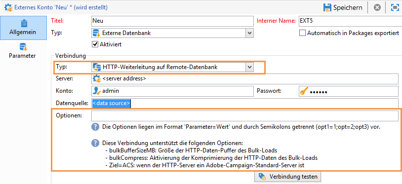
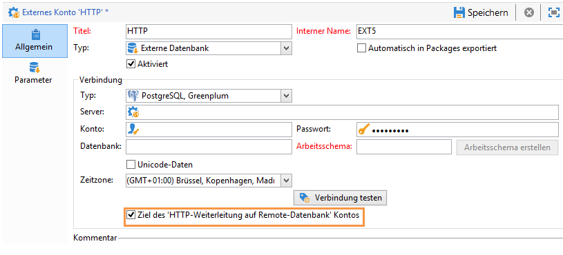
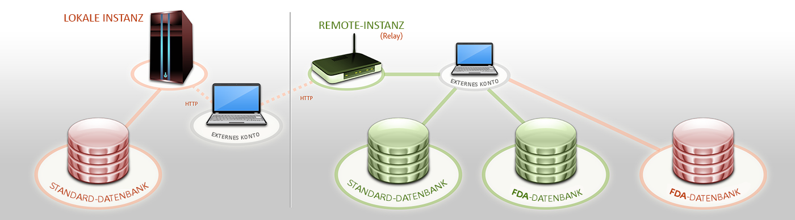
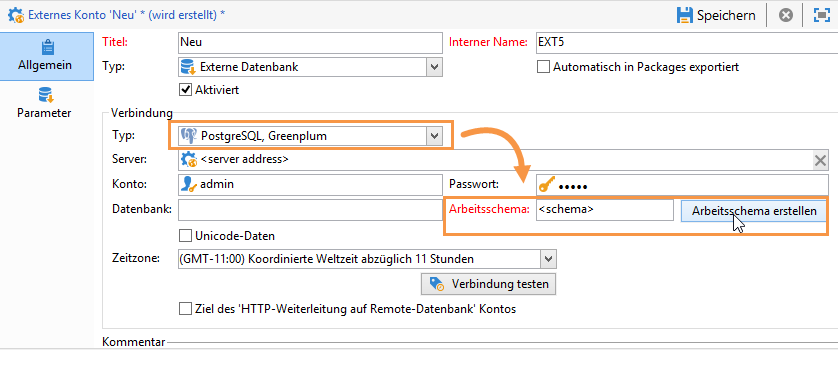

# Zugriff auf externe Datenbanken{#accessing-an-external-database}

## Über Federated Data Access - FDA {#about-federated-data-access}

Adobe Campaign bietet die Option **Federated Data Access** (FDA), um in externen Datenbanken gespeicherte Informationen nutzen zu können. Auf diese Weise ist der Zugriff auf externe Daten möglich, ohne die Datenstruktur in Adobe Campaign zu verändern.

>[!CAUTION]
>
>Das **Federated Data Access** (FDA)-Modul ist optional. Bitte prüfen Sie diesbezüglich Ihren Adobe-Campaign-Lizenzvertrag.
>  
>Der Zugriff auf externe Datenbanken per FDA ist außerdem nur für On-Premise- oder Hybridinstallationen möglich.

### Grundprinzip {#operating-principle}

Mit der FDA-Option können Sie Daten von SQL-Quellen abrufen und die Struktur der Zieltabellen automatisch erkennen.

Um diese Funktion zu verwenden, gehen Sie folgendermaßen vor:

1. Sie benötigen eine externe Datenbank, die mit dem FDA-Modul von Adobe Campaign kompatibel ist. Die Liste mit Datenbanksystemen und kompatiblen Versionen finden Sie in der [Kompatibilitätsmatrix](https://helpx.adobe.com/campaign/kb/compatibility-matrix.html). Benutzer benötigen zudem die [entsprechenden Berechtigungen](#remote-database-access-rights) für Adobe Campaign und die externe Datenbank.
1. [Installieren Sie die entsprechenden Treiber](#specific-configurations-by-database-type) für Ihre Datenbank auf dem Adobe-Campaign-Server.
1. [Erstellen und konfigurieren Sie ein externes Konto](#connecting-to-the-database), über das Sie die Verbindung zwischen Adobe Campaign und der externen Datenbank herstellen können. Weitere Informationen zu verfügbaren externen Konten finden Sie auf dieser [Seite](../../platform/using/external-accounts.md).
1. [Erstellen Sie das Leseschema](#creating-the-data-schema) der externen Datenbank in Adobe Campaign, mithilfe dessen die Datenstruktur der externen Datenbank erkannt wird.
1. [Erstellen Sie abschließend ein neues Zielgruppen-Mapping](#defining-data-mapping) aus dem zuvor erstellten Schema, wenn die Empfänger Ihrer Sendungen aus der externen Datenbank stammen. Dies bringt gewisse Einschränkungen mit sich, vor allem in Bezug auf die Personalisierung der Sendungen.

Sobald das Datenleseschema erstellt wurde, können die Daten in Adobe Campaign-Workflows verarbeitet werden. Weitere Informationen hierzu finden Sie in [diesem Abschnitt](../../workflow/using/executing-a-workflow.md#architecture).

### Best Practices und Empfehlungen {#best-practices-and-recommendations}

Die FDA-Option ist so konzipiert, dass Daten in externen Datenbanken mithilfe von Workflows im Batch-Modus bearbeitet werden können. Die Verwendung von FDA für andere Zwecke, z. B. für Einzeloperationen, erfordert besondere Vorsicht (Personalisierung, Interaction, Echtzeit-Sendungen etc.).

Führen Sie vor der Nutzung Ihrer externen Datenbank Tests durch, um mögliche Probleme zu erkennen und die Nutzung dieser Option zu optimieren.

Vermeiden Sie möglichst Vorgänge, bei denen sowohl Adobe Campaign als auch die externe Datenbank zum Einsatz kommen. Gehen Sie dazu folgendermaßen vor:

* Exportieren Sie die Adobe-Campaign-Datenbank in die externe Datenbank und führen Sie die Aktionen nur in der externen Datenbank aus. Importieren Sie danach die Ergebnisse wieder in Adobe Campaign.
* Rufen Sie die Daten aus der externen Adobe-Campaign-Datenbank ab und führen Sie die Aktionen lokal durch.

Wenn Sie Ihre Sendungen unter Verwendung von Daten aus der externen Datenbank personalisieren möchten, rufen Sie die entsprechenden Daten über einen Workflow ab und stellen Sie sie in einer temporären Tabelle bereit. Personalisieren Sie dann Ihren Versand mit den Daten aus der temporären Tabelle.

### Einschränkungen {#limitations}

Die FDA-Option unterliegt den Einschränkungen des von Ihnen verwendeten externen Datenbanksystems.

Um die Leistung nicht zu beeinträchtigen, empfehlen wir, diese Funktionalität nicht zur Durchführung von Einzeloperationen zu verwenden (Versandpersonalisierung, Interaction-Modul, Echtzeit).

## Spezifische Konfigurationen nach Datenbanktyp {#specific-configurations-by-database-type}

Abhängig von der externen Datenbank, auf die Sie von Adobe Campaign aus zugreifen möchten, müssen Sie bestimmte Konfigurationen vornehmen. Hierzu zählen im Prinzip die Einrichtung von Treibern und die Deklaration von Umgebungsvariablen für jedes DBMS auf dem Adobe-Campaign-Server.

Dazu müssen Sie die jeweilige Client-Ebene in der externen Datenbank auf dem Adobe-Campaign-Server installieren.

>[!NOTE]
>
>Kompatible Versionen sind in der [Campaign-Kompatibilitätsmatrix](https://helpx.adobe.com/campaign/kb/compatibility-matrix.html#FederatedDataAccessFDA) aufgeführt .

### Zugriff auf Hadoop konfigurieren {#configure-access-to-hadoop}

Die Verbindung mit einer externen Hadoop-Datenbank über die FDA-Option erfordert folgende Konfigurationen auf dem Adobe Campaign-Server.

#### Für Windows:{#for-windows}

1. Installieren Sie die ODBC- und [Azure HD Insight](https://www.microsoft.com/en-us/download/details.aspx?id=40886)-Treiber für Windows.
1. Erstellen Sie den DSN (Data Source Name), indem Sie das Tool ODBC DataSource Administrator ausführen. Dort finden Sie ein Beispiel für einen System-DSN für Hive, das Sie anpassen können.

   ```
   Description: vorac (or any name you like)
   Host: vorac.azurehdinsight.net
   Port: 443
   Database: sm_tst611 (or your database name)
   Mechanism: Azure HDInsight Service
   User/Password: admin/<your password here>
   ```

1. Erstellen Sie das externe Hadoop-Konto, wie im Abschnitt [Erstellen einer freigegebenen Verbindung](#creating-a-shared-connection) beschrieben.

#### Für Linux:{#for-linux}

1. Installieren Sie unixodbc für Linux.

   ```
   apt-get install unixodbc
   ```

1. Laden Sie ODBC-Treiber für Apache Hive von HortonWorks herunter und installieren Sie sie: [https://www.hortonworks.com/downloads/](https://www.hortonworks.com/downloads/).

   ```
   dpkg -i hive-odbc-native_2.1.10.1014-2_amd64.deb
   ```

1. Sehen Sie nach, wo die ODBC-Dateien gespeichert sind.

   ```
   root@campadpac71:/tmp# odbcinst -j
   unixODBC 2.3.1
   DRIVERS............: /etc/odbcinst.ini
   SYSTEM DATA SOURCES: /etc/odbc.ini
   FILE DATA SOURCES..: /etc/ODBCDataSources
   USER DATA SOURCES..: /root/.odbc.ini
   SQLULEN Size.......: 8
   SQLLEN Size........: 8
   SQLSETPOSIROW Size.: 8
   ```

1. Erstellen Sie den DSN (Data Source Name) und bearbeiten Sie die Datei odbc.ini. Erstellen Sie dann einen DSN für Ihre Hive-Verbindung.

   Hier ist ein Beispiel für HDInsight zur Herstellung einer Verbindung mit der Bezeichnung &quot;viral&quot;:

   ```
   [ODBC Data Sources]
   vorac 
   
   [vorac]
   Driver=/usr/lib/hive/lib/native/Linux-amd64-64/libhortonworkshiveodbc64.so
   HOST=vorac.azurehdinsight.net
   PORT=443
   Schema=sm_tst611
   HiveServerType=2
   AuthMech=6
   UID=admin
   PWD=<your password here>
   HTTPPath=
   UseNativeQuery=1
   ```

   >[!NOTE]
   >
   >Der Parameter **UseNativeQuery** ist dabei sehr wichtig. Campaign unterstützt Hive und funktioniert nur dann ordnungsgemäß, wenn UseNativeQuery eingerichtet ist. Üblicherweise formuliert der Treiber oder Hive SQL Connector Abfragen um und ändert die Spaltenanordnung.

   Die Authentifizierungseinrichtung hängt von der Konfiguration von Hive/Hadoop ab. Verwenden Sie z. B. für HD Insight AuthMech=6 für die Benutzer-/Passwort-Authentifizierung entsprechend [dieser Beschreibung](http://www.simba.com/products/Spark/doc/ODBC_InstallGuide/unix/content/odbc/hi/configuring/authenticating/azuresvc.htm).

1. Exportieren Sie die Variablen.

   ```
   export ODBCINI=/etc/myodbc.ini
   export ODBCSYSINI=/etc/myodbcinst.ini
   ```

1. Richten Sie Hortonworks-Treiber über /usr/lib/hive/lib/native/Linux-amd64-64/hortonworks.hiveodbc.ini ein.

   Sie müssen UTF-16 verwenden, um eine Verbindung mit Campaign und unix-odbc (libodbcinst) herstellen zu können.

   ```
   [Driver]
   
   DriverManagerEncoding=UTF-16
   ErrorMessagesPath=/usr/lib/hive/lib/native/hiveodbc/ErrorMessages/
   LogLevel=0
   LogPath=/tmp/hive
   SwapFilePath=/tmp
   
   ODBCInstLib=libodbcinst.so
   ```

1. Jetzt können Sie Ihre Verbindung unter Verwendung von isql testen.

   ```
   isql vorac
   isql vorac -v
   ```

1. Erstellen Sie das externe Hadoop-Konto, wie im Abschnitt [Erstellen einer freigegebenen Verbindung](#creating-a-shared-connection) beschrieben.

### Zugriff auf MySQL konfigurieren {#configure-access-to-mysql}

Weiterführende Information zur Konfiguration Ihrer MySQL -Datenbank finden Sie in diesem [Artikel](https://helpx.adobe.com/campaign/kb/campaign_fda_mysql.html).

### Zugriff auf Netezza konfigurieren {#configure-access-to-netezza}

Die Verbindung zu einer externen Netezza-Datenbank über die FDA-Option erfordert die zusätzlichen unten aufgeführten Konfigurationen auf dem Adobe Campaign Server:

1. Installieren Sie die ODBC-Treiber für Netezza entsprechend dem verwendeten Betriebssystem:

   * **nz-linuxclient-v7.2.0.0.tar.gz für Linux: Wählen Sie den Ordner aus, der Ihrem Betriebssystem entspricht (linux oder linux64) und starten Sie den Entpacken-Befehl. Sie können die Installation im standardmäßig empfohlenen Verzeichnis ausführen: &quot;/usr/local/nz&quot;.**
   * **nz-winclient-v7.2.0.0.zip für Windows: Dekomprimieren Sie die Datei und führen Sie das jeweilige Script für Ihr Betriebssystem aus: nzodbcsetup.exe oder nzodbcsetup64.exe. Folgen Sie den Anweisungen des Assistenten, um die Treiber zu installieren.**

1. Configure the ODBC driver. The configuration can be carried out in the standard files: **/etc/odbc.ini** for general parameters and **/etc/odbcinst.ini** for declaring drivers.

   * **/etc/odbc.ini**

      ```
      [ODBC]
      InstallDir=/etc/
      ```

      &quot;InstallDir&quot; entspricht dem Pfad der odbcinst.ini-Datei.

   * **/etc/odbcinst.ini**

      ```
      [ODBC Drivers]
      NetezzaSQL = Installed
      
      [NetezzaSQL]
      Driver           = /usr/local/nz/lib/libnzsqlodbc3.so
      Setup            = /usr/local/nz/lib/libnzsqlodbc3.so
      APILevel         = 1
      ConnectFunctions = YYN
      Description      = Netezza ODBC driver
      DriverODBCVer    = 03.51
      DebugLogging     = false
      LogPath          = /tmp
      UnicodeTranslationOption = utf8
      CharacterTranslationOption = all
      PreFetch         = 256
      Socket           = 16384
      ```

1. Spezifizieren Sie die Umgebungsvariablen des Adobe Campaign-Servers:

   * **LD_LIBRARY_PATH**: /usr/local/nz/lib und /usr/local/nz/lib64. &quot;/usr/local/nz&quot; entspricht dem standardmäßig bei der Installation der Treiber angebotenen Installationsverzeichnis. Hier müssen Sie das Repository angeben, das Sie für die Installation ausgewählt haben.
   * **ODBCINI**: Speicherort der Datei &quot;odbc.ini&quot;(z. B. /etc/odbc.ini).
   * **NZ_ODBC_INI_PATH**: Speicherort der Datei &quot;odbc.ini&quot;. Netezza benötigt diese zweite Variable auch zur Verwendung der Datei &quot;odbc.ini&quot;.

1. Erstellen Sie das externe Netezza-Konto, wie im Abschnitt [Erstellen einer freigegebenen Verbindung](#creating-a-shared-connection) beschrieben.

>[!NOTE]
>
>Vorgänge, die Schemata betreffen und automatisch erstellte Primärschlüssel enthalten, werden hierbei nicht berücksichtigt.
>
>The table will be using the **Organize on** clause on the first index defined in the schema. As this clause is limited to 1 to 4 columns with Netezza, this index cannot contain more than 4 columns.

### Zugriff auf Oracle konfigurieren {#configure-access-to-oracle}

Die Verbindung zu einer externen Oracle-Datenbank über die FDA-Option erfordert die zusätzlichen unten aufgeführten Konfigurationen auf dem Adobe Campaign Server:

#### Für Linux:{#for-linux-1}

1. Installieren Sie den vollständigen Oracle-Client für Ihre jeweilige Oracle-Version.
1. Add your TNS definitions to your installation. To do this, specify them in a **tnsnames.ora** file in the /etc/oracle repository. If this repository does not exist, create it.

   Erstellen Sie dann eine neue TNS_ADMIN-Umgebungsvariable: Exportieren Sie TNS_ADMIN=/etc/oracle und starten Sie das Gerät neu.

1. Integrate Oracle into your Adobe Campaign server (nlserver). To do this, check that the **customer.sh** file is present in the &quot;nl6&quot; folder of the Adobe Campaign server tree structure and that it includes the links to the Oracle libraries.

   Beispiel für einen Client in 11.2:

   ```
   export ORACLE_HOME=/usr/lib/oracle/11.2
   export TNS_ADMIN=/etc/oracle
   export LD_LIBRARY_PATH=$ORACLE_HOME/client64/lib:$LD_LIBRARY_PATH
   ```

   >[!NOTE]
   >
   >Diese Werte (vor allem ORACLE_HOME) hängen von Ihren Installationsverzeichnissen ab. Prüfen Sie Ihren Navigationsbaums, bevor Sie diese Werte referenzieren.

1. Installieren Sie die für Oracle nötigen Bibliotheken:

   * **libclntsh.so**

      ```
      cd /usr/lib/oracle/<version>/client<architecture>/lib
      ln -s libclntsh.so.<version> libclntsh.so
      ```

   * **libaio1**

      ```
      aptitude install libaio1
      or
      yum install libaio1
      ```

#### Für Windows:{#for-windows-1}

1. Installieren Sie den Oracle-Client.
1. In the C:Oracle folder, create a **tnsnames.ora** file containing your TNS definition.

   Fügen Sie eine Umgebungsvariable TNS_ADMIN mit C:Oracle als Wert hinzu und starten Sie den Computer neu.

### Zugriff auf Sybase IQ konfigurieren {#configure-access-to-sybase-iq}

Die Verbindung zu einer externen Sybase IQ-Datenbank über die FDA-Option erfordert die zusätzlichen unten aufgeführten Konfigurationen auf dem Adobe Campaign Server:

1. Prüfen Sie, ob sich das unixodbc-Package auf dem Server befindet.
1. Installieren Sie **iq_odbc**. Nach Abschluss der Installation wird möglicherweise ein Fehler angezeigt, der ignoriert werden kann.
1. Installieren Sie **iq_client_common**. Nach Abschluss der Installation wird möglicherweise ein Java-Fehler angezeigt, der ignoriert werden kann.
1. Konfigurieren sie den ODBC-Treiber. Die Konfiguration kann in den Standarddateien ausgeführt werden: /etc/odbc.ini für allgemeine Parameter und /etc/odbcinst.ini zur Deklarierung der Treiber:

   * **/etc/odbc.ini** (Werte wie `<server_alias>` Zeichen durch eigene ersetzen):

      ```
      [ODBC Data Sources]
      <server_alias>=libdbodbc.so
      
      [<server_alias>]
      Driver=/opt/sybase/IQ-16_0/lib64/libdbodbc16.so
      Description=<description>
      Username=<username>
      Password=<password>
      ServerName=<server_name>
      CommLinks=tcpip(host=<host>)
      ```

   * **/etc/odbcinst.ini**

      ```
      [ODBC DRIVERS]
      SAP SybaseIQ=Installed
      
      [SAP SybaseIQ]
      Driver=/opt/sybase/IQ-16_0/lib64/libdbodbc16.so
      ```

1. Fügen Sie den Pfad für die neue Bibliothek libodbc16.so in der Variablen LD_LIBRARY_PATH hinzu. Gehen Sie dazu folgendermaßen vor:

   * Wenn Sie eine customer.sh-Datei verwenden, um Ihren Pfad zu deklarieren: Fügen Sie den Pfad /opt/sybase/IQ-16_0/lib64 für die Variable LD_LIBRARY_PATH hinzu.
   * Verwenden Sie ansonsten einen Unix-Befehl.

1. Erstellen Sie ein neues externes FDA-Konto, wie im Abschnitt [Erstellen einer freigegebenen Verbindung](#creating-a-shared-connection) beschrieben. Bei Sybase IQ entspricht der Servername der ODBC-Verbindung (`<server_alias>`), die in Schritt 5 definiert ist. Es ist nicht unbedingt der Name des Servers selbst.

>[!NOTE]
>
>Für Windows muss der Sybase-IQ-Client auf dem Adobe-Campaign-Server installiert und eine ODBC-Verbindung hergestellt werden. Erstellen Sie eine System-Datenquelle, wenn der Adobe-Campaign-Server (nlserver) als Dienst in Windows läuft.

### Zugriff auf Teradata konfigurieren {#configure-access-to-teradata}

Die Verbindung mit einer externen Teradata-Datenbank über die FDA-Option erfordert gewisse zusätzliche Konfigurationen auf dem Adobe Campaign-Server. Weiterführende Informationen zur Konfiguration Ihrer Teradata-Datenbank finden Sie in diesem [Artikel](https://helpx.adobe.com/campaign/kb/campaign_fda_teradata.html).

1. Installieren Sie den [ODBC-Treiber für Teradata](http://downloads.teradata.com/download/connectivity/odbc-driver/linux).

   Er besteht aus drei Packages, die in der folgenden Reihenfolge auf Red Hat (oder CentOS)/Suse installiert werden können:

   * TeraGSS
   * tdicu1510 (Installation mit setup_wrapper.sh)
   * tdodbc1510 (installieren Sie es mithilfe von setup_wrapper.sh)

1. Configure the ODBC driver. The configuration can be carried out in the standard files: **/etc/odbc.ini** for general parameters and /etc/odbcinst.ini for declaring drivers:

   * **/etc/odbc.ini**

      ```
      [ODBC]
      InstallDir=/etc/
      ```

      &quot;InstallDir&quot; corresponds to the location of the **odbcinst.ini** file.

   * **/etc/odbcinst.ini**

      ```
      [ODBC DRIVERS]
      teradata=Installed
      
      [teradata]
      Driver=/opt/teradata/client/15.10/lib64/tdata.so
      APILevel=CORE
      ConnectFunctions=YYY
      DriverODBCVer=3.51
      SQLLevel=1
      ```

1. Spezifizieren Sie die Umgebungsvariablen des Adobe Campaign-Servers:

   * **LD_LIBRARY_PATH**: /opt/teradata/client/15.10/lib64 und /opt/teradata/client/15.10/odbc_64/lib.
   * **ODBCINI**: Speicherort der Datei &quot;odbc.ini&quot;(z. B. /etc/odbc.ini).
   * **NLSPATH**: Speicherort der Datei &quot;opermsgs.cat&quot;(/opt/teradata/client/15.10/msg/opermsgs.cat)

### Zugriff auf SAP HANA konfigurieren {#configure-access-to-sap-hana}

Die Verbindung mit einer externen SAP-HANA-Datenbank über die FDA-Option erfordert gewisse zusätzliche Konfigurationen auf dem Adobe-Campaign-Server:

1. Installieren Sie entsprechend dem verwendeten Betriebssystem die nötigen ODBC-Treiber für SAP HANA:

   * **hdb_client_linux.tgz für Linux: Dekomprimieren Sie die Datei, führen Sie den hdbinst-Befehl aus und folgen Sie der Anleitung zur Installation der Treiber.**
   * **hdb_client_windows.zip** für Windows. Dekomprimieren Sie die Datei und starten Sie die ausführbare Datei: **hdbinst.exe**. Folgen Sie den Anweisungen des Assistenten, um die Installation der Treiber abzuschließen.

1. Konfigurieren sie den ODBC-Treiber. Die Konfiguration kann in den Standarddateien ausgeführt werden: /etc/odbc.ini für allgemeine Parameter und /etc/odbcinst.ini zur Deklarierung der Treiber.

   * **/etc/odbc.ini**

      ```
      [ODBC]
      InstallDir=/etc/
      
      [HDB]
      Driver=HDBODBC
      servernode=localhost:39013 (this value depend of your server)
      User:SYSTEM
      ```

      &quot;InstallDir&quot; corresponds to the location of the **odbcinst.ini** file.

   * **/etc/odbcinst.ini**

      ```
      [HDBODBC]
      Description = "SmartCloudPT HANA"
      Driver = /usr/sap/hdbclient/libodbcHDB.so
      ```

1. Spezifizieren Sie die Umgebungsvariablen des Adobe Campaign-Servers:

   * **** LD_LIBRARY_PATH: Diese Variable sollte die Verknüpfung zu Ihrem SAP Hana Client enthalten (standardmäßig /usr/sap/hdbclient/[libodbcHDB.so](http://libodbchdb.so/)).
   * **ODBCINI**: Speicherort der Datei &quot;odbc.ini&quot;(z. B. /etc/odbc.ini).

1. Erstellen Sie das externe SAP Hana-Konto, wie im Abschnitt [Erstellen einer freigegebenen Verbindung](#creating-a-shared-connection) beschrieben.

## Zugriffsberechtigungen auf Remote-Datenbank {#remote-database-access-rights}

Damit ein Benutzer über FDA Aktionen in einer Datenbank ausführen kann, muss er über eine entsprechende Berechtigung in Adobe Campaign verfügen.

1. Wählen Sie den **[!UICONTROL Administration > Access Management > Named Rights]** Knoten im Adobe Campaign-Explorer aus.
1. Erstellen Sie eine neue Berechtigung, indem Sie einen Titel eingeben.
1. The **[!UICONTROL Name]** field must take the following format **user:base@server**, where :

   * **user** dem Namen des Benutzers in der externen Datenbank entspricht.
   * **base** dem Namen der externen Datenbank entspricht.
   * **server** dem Namen des Servers der externen Datenbank entspricht.

      >[!NOTE]
      >
      >Der Teil **:base** ist in Oracle optional.

1. Save the named right then link it to your chosen user from the **[!UICONTROL Administration > Access Management > Operators]** node of the Adobe Campaign explorer.

Damit die in einer externen Datenbank enthaltenen Daten verarbeitet werden können, muss der Adobe-Campaign-Benutzer zumindest Schreibberechtigungen für die Datenbank besitzen, damit er Arbeitstabellen erstellen kann. Diese werden automatisch von Adobe Campaign gelöscht.

Generell sind die folgenden Berechtigungen erforderlich:

* **CONNECT**: Verbindung mit der Remote-Datenbank,
* **READ Data**: Nur Lesezugriff auf Tabellen, die Kundendaten enthalten,
* **READ &#39;MetaData&#39;**: Zugriff auf Serverdatenkataloge zum Abruf der Tabellenstruktur,
* **LOAD**: Ladevorgänge für große Datenmengen in Arbeitstabellen (erforderlich bei der Arbeit an Kollektionen und Joins),
* **CREATE/DROP** für **TABLE/INDEX/PROCEDURE/FUNCTION**,
* **EXPLAIN** (empfohlen): für die Leistungsüberwachung im Fall von Problemen,
* **WRITE Data** (abhängig vom Integrationsszenario).

>[!NOTE]
>
>Der Datenbankadministrator muss diese Berechtigungen an die jeweiligen Berechtigungen für jede Datenbank-Engine anpassen. Weiterführende Informationen finden Sie unter [Spezifische RDBMS-Berechtigungen](https://docs.campaign.adobe.com/doc/AC6.1/en/technicalResources/technicalResources.html).

## Herstellung der Datenbankverbindung {#connecting-to-the-database}

Um eine Verbindung mit der externe Datenbank zu ermöglichen, müssen Sie die Verbindungsparameter angeben, d. h. die gewünschte Datenquelle und den Namen der Tabelle mit den zu ladenden Daten.

>[!CAUTION]
>
>Der Adobe Campaign-Benutzer benötigt spezifische Rechte für die externe Datenbank und den Adobe Campaign-Anwendungsserver, um Daten aus einer externen Datenbank zu verarbeiten. Weitere Informationen finden Sie im Abschnitt [Zugriffsrechte](#remote-database-access-rights) für Remote-Datenbanken.
>
>Um Fehlfunktionen zu verhindern, müssen Benutzer, die auf geteilte Remote-Daten zugreifen, von getrennten Arbeitsplätzen aus arbeiten.

### Geteilte Verbindung erstellen {#creating-a-shared-connection}

Sie können auf eine gemeinsam genutzte externe Datenbank über Adobe Campaign zugreifen, vorausgesetzt die Verbindung ist aktiv.

1. Die Konfiguration muss vorher über den **[!UICONTROL Administration > Platform > External accounts]** Knoten definiert werden.
1. Klicken Sie auf die **[!UICONTROL New]** Schaltfläche und wählen Sie den **[!UICONTROL External database]** Typ aus.
1. Define the **[!UICONTROL Connection]** parameters of the external database.

   Bei Verbindungen zu einer **ODBC**-Datenbank muss das Feld **[!UICONTROL Server]** den Namen der ODBC-Datenquelle und nicht den Servernamen enthalten. Darüber hinaus können je nach verwendeter Datenbank zusätzliche Konfigurationen erforderlich sein. Siehe Abschnitt [Spezifische Konfigurationen nach Datenbanktyp](#specific-configurations-by-database-type) .

1. Once the parameters are entered, click the **[!UICONTROL Test the connection]** button to approve them.

   

1. If necessary, uncheck the **[!UICONTROL Enabled]** option to disable access to this database without deleting its configuration.
1. Damit Adobe Campaign auf diese Datenbank zugreifen kann, müssen Sie die SQL-Funktionen bereitstellen. Klicken Sie auf die **[!UICONTROL Parameters]** Registerkarte und dann auf die **[!UICONTROL Deploy functions]** Schaltfläche.

   

You can define specific work tablespaces for the tables and for the index in the **[!UICONTROL Parameters]** tab.

### Herstellen einer Verbindung mit Windows-Authentifizierung {#creating-a-connection-with-windows-authentication}

Sie können auch mit einer Windows-Authentifizierung eine Verbindung über FDA herstellen. Gehen Sie dazu folgendermaßen vor:

* Vergewissern Sie sich, dass der Adobe-Campaign-Dienst von einem Windows-Konto ausgeführt wird, das sich vom lokalen Systemkonto unterscheidet.
* Stellen Sie sicher, dass der Adobe-Campaign-Benutzer die nötigen Berechtigungen für den Adobe-Campaign-Anwendungsserver und die externe Datenbank besitzt.
* Erstellen Sie das entsprechende externe Konto, ohne die **[!UICONTROL Account]** und die anzugeben **[!UICONTROL Password]**. Geben Sie nur den Namen der Datenbank an.

### Herstellen einer temporären Verbindung {#creating-a-temporary-connection}

Sie können eine Verbindung zu einer externen Datenbank direkt aus den Workflow-Aktivitäten definieren. In diesem Fall befindet es sich in einer lokalen externen Datenbank, die für die Verwendung in einem aktuellen Workflow reserviert ist: sie wird nicht in den externen Konten gespeichert. Diese Art der pünktlichen Verbindung kann für verschiedene Aktivitäten des Workflows erstellt werden, insbesondere für die **[!UICONTROL Query]**, die **[!UICONTROL Data loading (RDBMS)]** Aktivität, die **[!UICONTROL Enrichment]** Aktivität oder die **[!UICONTROL Split]** Aktivität.

>[!CAUTION]
>
>Diese Art der Konfiguration wird nicht empfohlen, kann aber regelmäßig verwendet werden, um Daten abzurufen. Dennoch sollten Sie ein externes Konto gemäß der Beschreibung in Abschnitt [Erstellen einer geteilten Verbindung](#creating-a-shared-connection) erstellen.

Gehen Sie in der Abfrageaktivität zur Erstellung einer periodischen Verbindung zu einer externen Datenbank beispielsweise folgendermaßen vor:

1. Klicken Sie auf die Schaltfläche **[!UICONTROL Add data...]** und wählen Sie die **[!UICONTROL External data]** Optionen aus.
1. Select the **[!UICONTROL Locally defining the data source]** option.

   

1. Wählen Sie aus der Dropdown-Liste die Zieldatenbank-Engine aus. Geben Sie den Namen des Servers und die Authentifizierungsparameter ein.

   Geben Sie auch den Namen der externen Datenbank an.

   

   Click the **[!UICONTROL Next]** button.

1. Wählen Sie die Tabelle aus, in der die Daten gespeichert sind.

   Sie können den Namen der Tabelle direkt in das entsprechende Feld eingeben oder auf das Bearbeiten-Symbol klicken, um eine Liste mit Datenbanktabellen zu öffnen.

   

1. Klicken Sie auf die **[!UICONTROL Add]** Schaltfläche, um ein oder mehrere Abgleichungsfelder zwischen den externen Datenbankdaten und den Daten in der Adobe Campaign-Datenbank zu definieren. Die **[!UICONTROL Edit expression]** Symbole der **[!UICONTROL Remote field]** und **[!UICONTROL Local field]** gibt Ihnen Zugriff auf die Liste der Felder der einzelnen Tabellen.

   

1. Spezifizieren Sie nötigenfalls eine Filterbedingung und den Datensortierungsmodus.
1. Select the additional data to be collected in the external database. To do this, double click on the fields(s) that you want to add to display them in the **[!UICONTROL Output columns]**.

   

   Click **[!UICONTROL Finish]** to confirm this configuration.

### Sichere Verbindung {#secure-connection}

Sie können durch das Konfigurieren eines externen FDA-Kontos eine sichere Verbindung für den Zugriff auf eine externe Datenbank herstellen.

Schreiben Sie zu diesem Zweck &quot;**:ssl**&quot; hinter die Serveradresse und die Adresse des verwendeten Ports. Beispiel: **192.168.0.52:4501:ssl**.

Die Daten werden dadurch unter Verwendung des sicheren SSL-Protokolls gesendet.

### Ergänzende Konfigurationen {#additional-configurations}

Nötigenfalls können Sie das Schema zur Datenverarbeitung in einer externe Datenbank erstellen. Ebenso ermöglicht Ihnen Adobe Campaign das Definieren eines Mappings für die Daten in einer externen Tabelle. Diese Konfigurationen sind allgemeiner Art und werden nicht auf einzelne Workflows angewendet.

>[!NOTE]
>
>Weiterführende Informationen zur Erstellung von Schemata in Adobe Campaign und zur Definition eines neuen Daten-Mappings finden Sie auf [dieser Seite](../../configuration/using/about-schema-edition.md).

## Erstellen des Datenschemas {#creating-the-data-schema}

To create a schema on an external database, click the **[!UICONTROL New]** button above the list of data schemas and choose **[!UICONTROL Access external data]**.


Geben Sie für das Schema einen Namen und eine Beschreibung ein und wählen Sie das externes Konto aus, über das die Verbindung mit der Datenbank hergestellt werden soll. Dadurch erhalten Sie Zugriff auf die Liste mit den in der externen Datenbank verfügbaren Tabellen. Wählen Sie die Tabelle aus, die die Daten enthält, die abgerufen werden sollen.


Klicken Sie **[!UICONTROL OK]** zur Bestätigung. Adobe Campaign erkennt automatisch die Struktur der ausgewählten Tabelle und generiert das logische Schema.

>[!NOTE]
>
>Adobe Campaign erstellt keine Relationen.

Click **[!UICONTROL Save]** to confirm creation.


Die Indexe werden beim Mapping einer Tabelle automatisch erstellt (Standard- oder FDA-Mapping).

## Definition des Daten-Mappings {#defining-data-mapping}

Mit Adobe Campaign können Sie das Mapping für Daten in einer externen Tabelle definieren.

Dazu müssen Sie nach der Erstellung des Schemas der externen Tabelle ein neues Versand-Mapping erstellen, wobei die Daten in dieser Tabelle als Versandzielgruppe verwendet werden.

Gehen Sie hierzu wie folgt vor:

1. Erstellen Sie ein neues Versand-Mapping und wählen Sie die Zielgruppendimension, z. B. das soeben erstellte Schema.

   

1. Geben Sie die Felder an, in denen die Versandinformationen gespeichert sind (Nachname, Vorname, E-Mail-Adresse, Adresse etc.).

   

1. Geben Sie die Parameter für die Speicherung der Informationen an, einschließlich des Suffix der Erweiterungsschemata, damit diese leicht identifiziert werden können.

   

   Wählen Sie aus, ob Ausschlüsse (**excludelog**) mit Nachrichten (**broadlog**) oder in einer separaten Tabelle gespeichert werden sollen.

   Sie können für dieses Versand-Mapping (**trackinglog**) auch auswählen, ob Tracking verwaltet werden soll.

1. Wählen Sie dann die zu berücksichtigenden Erweiterungen. Der Erweiterungstyp hängt von den Parametern und Optionen Ihrer Plattform ab (bitte überprüfen Sie Ihren Lizenzvertrag).

   

   Click the **[!UICONTROL Save]** button to launch delivery mapping creation: all linked tables are created automatically based on the selected parameters.

## Zusätzliche Optionen {#additional-options}

### HTTP-Weiterleitung auf Remote-Instanz {#http-relay-to-a-remote-instance}

Sie können mit dem HTTP-Protokoll auf externe Datenbanken zugreifen, die in Remote-Instanzen konfiguriert wurden.

>[!NOTE]
>
>Nicht alle SQL-Datentypen werden von dieser Funktion unterstützt. Blob-Datentypen werden überhaupt nicht unterstützt. Es ist möglich, dass andere Datentypen in Abhängigkeit von der Ziel-Datenbank nicht funktionieren (z. B. Zeitstempel auf Microsoft SQL Server). Weitere Informationen erhalten Sie beim Adobe-Support.

Dies vereinfacht den Transfer und die Synchronisation von Daten zwischen zwei Instanzen. Sie können damit auch das Tunneln zwischen einer Instanz und einer Remote-Datenbank sowie die Installation der Client-Ebenen für den Zugriff auf diese Datenbank umgehen. Die Zielinstanz kann eine gehostete Instanz sein.

>[!CAUTION]
>
>Diese Option dient nur zur Erleichterung der Datenreplikationsabläufe (ETL).
>
>Beispielsweise ermöglicht diese Option einer Cloud-gehosteten Instanz direkten Zugriff auf die Daten in einer „On-Premise“ gehosteten Datenbank. Sie ermöglicht jedoch nicht die Zielgruppenbestimmung in einer „On-Premise“ gehosteten Datenbank direkt von der Cloud aus.

Um das zu erreichen, müssen Sie die externen Konten der beiden Instanzen so konfigurieren, dass die lokale Instanz mit der Remote-Instanz über das HTTP-Protokoll kommunizieren kann:

* Lokale Instanz: Wählen Sie den neuen **[!UICONTROL HTTP relay to a remote database]** Verbindungstyp.

   Geben Sie im Fall einer Bulk-Load-Datenübertragung auch die Puffergröße an. Wählen Sie die Komprimierungsoption, wenn Sie die Größe der übertragenen Daten reduzieren möchten.

   Die **[!UICONTROL Data source]** muss mit der folgenden Syntax definiert werden: &quot;nms:extAccount: `<internal_name_of_the_external_account>`&quot;

   

   >[!NOTE]
   >
   >Wir empfehlen die Verwendung einer HTTPS-Verbindung.

* Remote-Instanz: im externen FDA-Konto der Datenbank, auf die über den HTTP-Relais zugegriffen wird, überprüfen Sie das Target eines **[!UICONTROL 'HTTP relay to a remote database' account option]**.

   

Das folgende Beispiel zeigt die neue Funktionsweise:



>[!CAUTION]
>
>Auf die Standarddatenbank der Remote-Instanz muss ebenfalls über ein externes Konto zugegriffen werden.

Diese Funktionsweise verhindert, dass der Datenbereinigungs-Workflow jeder Instanz die Arbeitstabellen der Datenbanken löscht, die die Instanz als Relais verwenden.

Deshalb führt der Datenbereinigungs-Workflow der Remote-Instanz keine Aktion auf die rote FDA-Datenbank aus, da sie von der lokalen Instanz verwendet wird.

### Direktes Erstellen temporärer Schemata {#directly-creating-temporary-schemas}

Wenn Sie mehrere Zugriffe auf eine externe FDA-Datenbank verwalten möchten, ermöglicht Ihnen die neue Funktion die Erstellung eines Arbeitsschemas unmittelbar beim Konfigurieren eines externen Kontos.

>[!NOTE]
>
>Diese Option funktioniert nur mit PostgreSQL.



### Optimieren von E-Mail-Personalisierung mit externen Daten {#optimizing-email-personalization-with-external-data}

Ab Build 8740 **[!UICONTROL Prepare the personalization data with a workflow]** ist die Option jetzt auf der **[!UICONTROL Analysis]** Registerkarte der Bereitstellungseigenschaften verfügbar.

Diese Option ermöglicht es, im Zuge der Versandanalyse automatisch einen Workflow zu erstellen und auszuführen, welcher alle auf eine Zielgruppe bezogenen Daten in einer temporären Tabelle speichert (insbesondere Daten aus über FDA verknüpften Tabellen).

Durch Aktivierung dieser Option werden erhebliche Leistungsverbesserungen bei der Versandpersonalisierung erzielt.

### Cloud Messaging - FDA-Synchronisation {#cloud-messaging---fda-synchronization}

Wenn der Cloud Messaging Server und der Marketingserver lange nicht mehr synchronisiert wurden, kann die Größe der auf dem Marketingserver fehlenden BroadLogs enorm sein. Um die BroadLog-Synchronisation über FDA zu optimieren, wurde die Option **NmsMidSourcing_LogsPeriodHour** hinzugefügt. Dadurch kann ein maximaler Zeitraum (ausgedrückt in Stunden) festgelegt werden, damit die Anzahl der BroadLogs beschränkt werden kann, die bei jeder Ausführung des Synchronisations-Workflows abgerufen werden.

The option is to be added in the console, in the **[!UICONTROL Administration > Options]** node.

>[!CAUTION]
>
>Diese Option darf **nur** zur Synchronisation einer beträchtlichen Menge von BroadLogs über FDA verwendet werden.

>[!NOTE]
>
>Diese Option wird nur berücksichtigt, wenn ein letztes Abrufdatum existiert (**NmsMidSourcing_LastBroadLog_*** option).

### Message Center - Lesezugriff auf die XtkFolder-Tabelle {#message-center---read-access-on-the-xtkfolder-table}

Ab Build 8141 ist ein manueller Eingriff nötig, wenn FDA vom Message Center als Archivierungsmodus verwendet wird.

Sie müssen dem mit dem externen FDA-Konto verknüpften Benutzer Lesezugriff für die XtKFolder-Tabelle gewähren.

Für eine PostgreSQL-Datenbank lautet der Befehl beispielsweise folgendermaßen:

```
GRANT SELECT ON XtkFolder TO DBUSER;
```

Dieser Benutzer muss Lesezugriff auf die folgenden Tabellen haben:

* NmsBroadLogRtEvent
* NmsBroadLogBatchEvent
* NmsTrackingLogRtEvent
* NmsTrackingLogBatchEvent
* NmsRtEvent
* NmsBatchEvent
* NmsBroadLogMsg
* NmsTrackingUrl
* NmsDelivery
* NmsWebTrackingLog

>[!NOTE]
Durch diese Änderung wird die Fehlermeldung &quot;Zugriff für Verknüpfungstabelle xtkfolder verweigert&quot; gelöscht.

Wenn das im externen FDA-Konto ausgewählte Arbeitsschema nicht das standardmäßige Neolane-Konto ist, ist diese Änderung der Zugriffsberechtigungen nicht nötig.

## Verwenden von Daten aus einer externen Datenbank in einem Workflow {#using-data-from-an-external-database-in-a-workflow}

In mehreren Workflow-Aktivitäten in Adobe Campaign können Sie die in einer externen Datenbank gespeicherten Daten verwenden.

### Filtern externer Daten {#filtering-on-external-data}

Die Abfrageaktivität ermöglicht Ihnen, externe Daten hinzuzufügen und in den definierten Filterkonfigurationen zu verwenden.

Lesen Sie diesbezüglich auch den Abschnitt [Query](../../workflow/using/targeting-data.md#selecting-data).

### Erstellen von Segmenten {#creating-sub-sets}

Die Split-Aktivität ermöglicht Ihnen die Erstellung von Segmenten. Sie können externe Daten nutzen, um die zu verwendenden Filterkriterien zu definieren.

Lesen Sie diesbezüglich auch den Abschnitt [Split](../../workflow/using/split.md).

### Laden externer Datenbanken {#loading-external-database}

Sie können die externen Daten die das Laden (DBMS) verwenden. Diese Aktivität finden Sie im Abschnitt [Laden der Daten](../../workflow/using/data-loading--rdbms-.md).

### Hinzufügen von Informationen und Links {#adding-information-and-links}

Die Anreicherungsaktivität ermöglicht Ihnen das Hinzufügen von Daten zur Arbeitstabelle des Workflows sowie von Links zu einer externen Tabelle. Somit können damit die Daten von einer externen Datenbank genutzt werden. Diese Aktivität finden Sie im Abschnitt [Anreicherung](../../workflow/using/enrichment.md).
