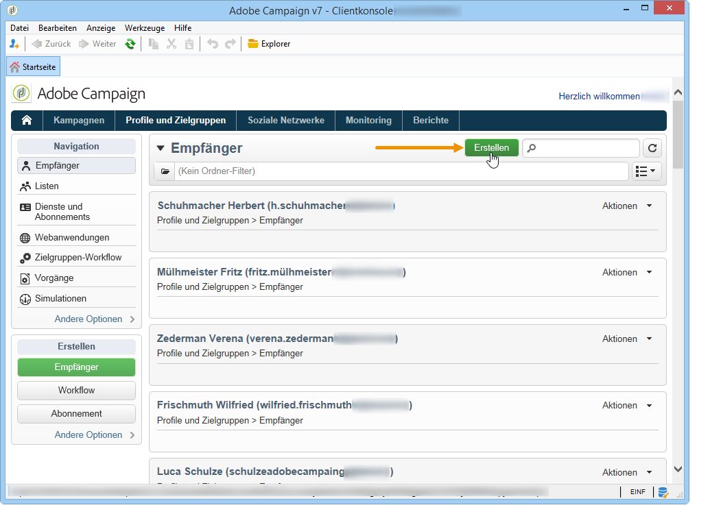

# Profile hinzufügen{#adding-profiles}

Meist werden Profile [über einen Workflow in Campaign importiert](../../workflow/using/importing-data.md). Es besteht aber auch die Möglichkeit, neue Profile direkt über die Benutzeroberfläche hinzuzufügen. Wählen Sie hierzu die Schaltfläche **[!UICONTROL Erstellen]** aus.

Machen Sie die erforderlichen Angaben zum Profil. Die auszufüllenden Tabs und Felder werden unter [Profile bearbeiten](../../platform/using/editing-a-profile.md) beschrieben.

Verwenden Sie **[!UICONTROL Speichern]**, um die Profilerstellung abzuschließen. Das Profil wird der Adobe-Campaign-Datenbank hinzugefügt.
