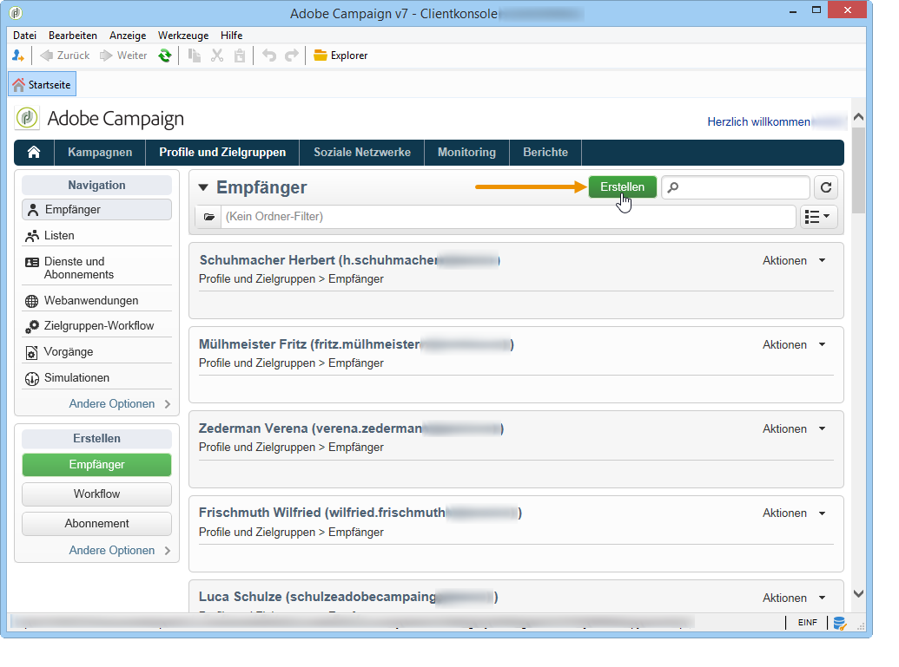

# Hinzufügen von Profilen{#adding-profiles}

In den meisten Fällen werden Profile [über einen Workflow in Campaign importiert](../../platform/using/import-export-workflows.md). Sie können jedoch ein oder mehrere Profile direkt über die Benutzeroberfläche hinzufügen, indem Sie auf die Schaltfläche **[!UICONTROL Erstellen]** klicken. Sie werden dann der Datenbank hinzugefügt.

>[!NOTE]
>
>Weitere Informationen zum Erstellen von Profilen in der Adobe Campaign-Konsole finden Sie in der [Dokumentation zu Campaign v8.](https://experienceleague.adobe.com/de/docs/campaign-classic/using/getting-started/profile-management/adding-profiles){target=_blank}

<!--
Enter the information for this profile. The tabs and fields to be completed are described in [Editing a profile](../../platform/using/editing-a-profile.md).

Click **[!UICONTROL Save]** to validate profile creation. The profile is then added in Adobe Campaign database.
-->