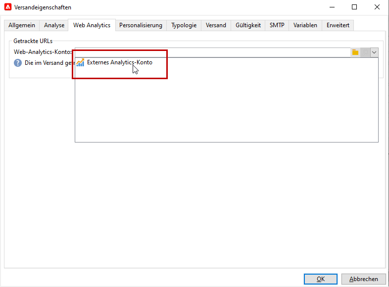
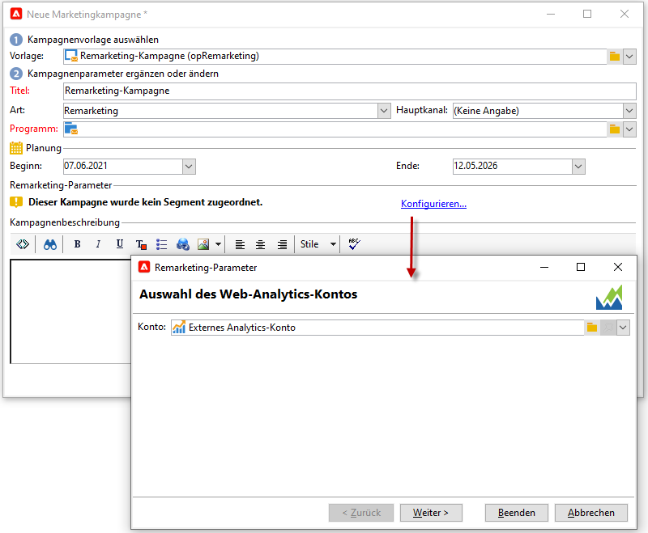
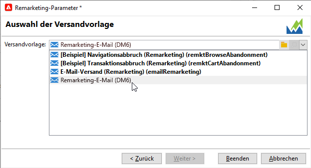

# Adobe Analytics Connector{#adobe-analytics-connector}

## Über die Integration mittels Adobe Analytics-Connector {#about-analytics-connector-integration}

Der Adobe Analytics-Connector ermöglicht die Interaktion von Adobe Campaign und Adobe Analytics über das Package **[!UICONTROL Web-Analytics-Connectoren]**. Es leitet Daten in Form von Segmenten zum Benutzerverhalten nach einer Kampagne an Adobe Campaign weiter. Umgekehrt werden Indikatoren und Attribute von Kampagnen gesendet, die von Adobe Campaign an Adobe Analytics bereitgestellt werden.

>[!CAUTION]
>
>* Adobe Analytics Connector ist nicht kompatibel mit Transaktionsnachrichten (Message Center).
>
>* Stellen Sie vor dem Beginn sicher, dass das Adobe Identity Management System (IMS) in Campaign implementiert ist. [Weiterführende Informationen finden Sie auf dieser Seite](../../integrations/using/about-adobe-id.md).

Der Adobe Analytics-Connector ermöglicht es Adobe Campaign, Messungen zur Internet-Zielgruppe (Web Analytics) anzustellen. Dank dieser Integrationen kann Adobe Campaign Daten über das Besucherverhalten für eine oder mehrere Websites nach einer Marketing-Kampagne wiederherstellen und (nach der Analyse) Remarketing-Kampagnen mit dem Ziel durchführen, sie in Käufer zu konvertieren. Umgekehrt ermöglichen die Web-Analyse-Tools von Adobe Campaign die Weiterleitung von Indikatoren und Kampagnenattributen an ihre Plattformen.

Der Aktionsradius der verschiedenen Tools gestaltet sich wie folgt:

* Web-Analytics-Connector:

   1. markiert die mit Adobe Campaign gestarteten Kampagnen,
   1. speichert das Empfängerverhalten in Form von Segmenten auf der Site, die nach Klick auf die Kampagne durchsucht wurde. Segmente beziehen sich auf verlassene Produkte (angesehen, aber nicht zum Warenkorb hinzugefügt oder gekauft), Käufe oder Warenkorbabbrüche.

* Adobe Campaign:

   1. sendet die Indikatoren und Attribute der Kampagne an den Connector, welcher sie an das Web-Analytics-Tool übermittelt,
   1. ruft Segmente ab und analysiert sie,
   1. löst eine Remarketing-Kampagne aus.

## Integration einrichten {#setting-up-the-integration}

>[!IMPORTANT]
>
> Bei Hybrid- und On-Premise-Implementierungen müssen Sie die auf dieser [Seite](../../platform/using/adobe-analytics-provisioning.md) beschriebenen Bereitstellungsschritte ausführen.

Um den Daten-Connector einzurichten, verbinden Sie sich mit Ihrer Adobe Campaign-Instanz und gehen Sie folgendermaßen vor:

1. [Konfigurieren Sie Konversionsvariablen und Erfolgsereignisse.](#configure-conversion-success)
1. [Konfigurieren Sie Ihr externes Konto in Adobe Campaign Classic.](#external-account-classic)

<!--
### Create your Report suite in Adobe Analytics {#report-suite-analytics}

To set up the Adobe Analytics/Adobe Campaign Classic integration, you must connect to your [!DNL Adobe Analytics] instance and perform the following operations:

1. From [!DNL Adobe Analytics], select the **[!UICONTROL Admin tab]** then click **[!UICONTROL All admin]**.

   

1. Click **[!UICONTROL Report suites]**.

   

1. From the **[!UICONTROL Report suite manager]** page, click **[!UICONTROL Create new]** then **[!UICONTROL Report suite]**.

   For the detailed procedure on **[!UICONTROL Report suite]** creation, refer to this [section](https://experienceleague.adobe.com/docs/analytics/admin/manage-report-suites/new-report-suite/t-create-a-report-suite.html?lang=en#prerequisites).

   

1. Select a template. 

1. Configure your new report suite with the following information:

   * **[!UICONTROL Report Suite ID]**
   * **[!UICONTROL Site Title]**
   * **[!UICONTROL Time Zone]**
   * **[!UICONTROL Go Live Date]**
   * **[!UICONTROL Estimated Page Views Per Day]**

   

1. When configured, click **[!UICONTROL Create report suite]**.
-->

### Konfigurieren von Konversionsvariablen und Erfolgsereignissen {#configure-conversion-success}

Sie müssen die **[!UICONTROL Konversionsvariablen]** und **[!UICONTROL Erfolgsereignisse]** wie folgt konfigurieren:

1. Wählen Sie die **[!UICONTROL Report Suite]** aus, die Sie mit Adobe Campaign verknüpfen möchten.

1. Klicken Sie auf die Schaltfläche **[!UICONTROL Einstellungen bearbeiten]** und wählen Sie **[!UICONTROL Konversion]** > **[!UICONTROL Konversionsvariablen]** aus.

   

1. Klicken **[!UICONTROL Neu hinzufügen]** um die zur Messung der Wirkung der Kampagne erforderlichen Kennungen zu erstellen, d. h. den internen Kampagnennamen (cid) und die iNmsBroadlog (bid)-Tabellen-ID.

   Weiterführende Informationen zur Bearbeitung von **[!UICONTROL Konversionsvariablen]** finden Sie in [diesem Abschnitt](https://experienceleague.adobe.com/docs/analytics/admin/admin-tools/conversion-variables/t-conversion-variables-admin.html?lang=de#admin-tools).

   

1. Klicken Sie abschließend auf **[!UICONTROL Speichern]**.

1. Um **[!UICONTROL Erfolgsereignisse]** zu erstellen, wählen Sie **[!UICONTROL Konversion]** > **[!UICONTROL Erfolgsereignisse]** über die Schaltfläche **[!UICONTROL Einstellungen bearbeiten]** aus.

   

1. Klicken Sie auf **[!UICONTROL Neu hinzufügen]**, um die folgenden **[!UICONTROL Erfolgsereignisse]** zu konfigurieren:

   * **[!UICONTROL Haben geklickt]**
   * **[!UICONTROL Haben geöffnet]**
   * **[!UICONTROL Personenklicks]**
   * **[!UICONTROL Verarbeitet]**
   * **[!UICONTROL Geplant]**
   * **[!UICONTROL Gesendet]**
   * **[!UICONTROL Bounces insgesamt]**
   * **[!UICONTROL Einzelklicks]**
   * **[!UICONTROL Einzelöffnungen]**
   * **[!UICONTROL Abgemeldet]**

   Näheres dazu, wie Sie **[!UICONTROL Erfolgsereignisse]** konfigurieren, finden Sie in [diesem Abschnitt](https://experienceleague.adobe.com/docs/analytics/admin/admin-tools/success-events/t-success-events.html?lang=de#admin-tools)..

   >[!NOTE]
   >
   > Es werden nur **[!UICONTROL Erfolgsereignisse]** des numerischen Typs unterstützt.

   

1. Klicken Sie abschließend auf **[!UICONTROL Speichern]**.

Nachdem Sie die **[!UICONTROL Konversionsvariablen]** und **[!UICONTROL Erfolgsereignisse]** konfiguriert haben, stellen Sie sicher, dass die Variablen in dem für den Analytics-Connector erstellten **[!UICONTROL Produktprofil]** enthalten sind. Weitere Informationen hierzu finden Sie unter [Adobe Analytics-Produktprofil erstellen](../../platform/using/adobe-analytics-provisioning.md#analytics-product-profile).

Anschließend müssen Sie die **[!UICONTROL externen Konten]** in Adobe Campaign Classic konfigurieren.

### Konfigurieren Sie Ihr externes Konto in Adobe Campaign Classic. {#external-account-classic}

>[!IMPORTANT]
>
> Damit diese Integration funktioniert, müssen Sie in Adobe Campaign das Package **[!UICONTROL Web-Analytics-Connectoren]** installieren.
>
>Weiterführende Informationen zur Installation von Packages finden Sie auf [dieser Seite](../../installation/using/installing-campaign-standard-packages.md).

Nun müssen Sie in Adobe Campaign ein externes **[!UICONTROL Web Analytics]**-Konto konfigurieren, um die Synchronisation zwischen den beiden Lösungen zu aktivieren.

Beachten Sie Folgendes: Wenn eine Ihrer **[!UICONTROL Report Suites]**, **[!UICONTROL Konversionsvariablen]** oder eines Ihrer **[!UICONTROL Erfolgsereignisse]** beim Konfigurieren Ihres externen Kontos nicht angezeigt wird, bedeutet dies, dass Sie im **[!UICONTROL Produktprofil]**, das dem Benutzer zugeordnet ist, über keine Berechtigung für diese neu erstellte Komponente verfügen.

Weiterführende Informationen hierzu finden Sie auf der Seite [Produktprofile für Adobe Analytics](https://experienceleague.adobe.com/docs/analytics/admin/admin-console/permissions/product-profile.html?lang=de#product-profile-admins).

1. Rufen Sie im Navigationsbaum von Adobe Campaign den Ordner **[!UICONTROL Administration]** > **[!UICONTROL Plattform]** > **[!UICONTROL Externe Konten]** auf und klicken Sie auf **[!UICONTROL Neu]**.

   

1. Wählen Sie in der Dropdown-Liste &quot;Typ&quot; **[!UICONTROL Web Analytics]** und in der Dropdown-Liste **[!UICONTROL Integration]** **[!UICONTROL Adobe Analytics]** aus.

   

1. Klicken Sie auf den Link **[!UICONTROL Konfigurieren]**, der sich neben der Dropdown-Liste **[!UICONTROL Integration]** befindet.

1. Ordnen Sie das externe Konto Ihrer zuvor erstellten Report Suite zu, indem Sie im Fenster **[!UICONTROL Analytics-Integration konfigurieren]** die folgenden Informationen angeben:

   * **[!UICONTROL E-Mail]**
   * **[!UICONTROL IMS Org]**
   * **[!UICONTROL Analytics-Unternehmen]**
   * **[!UICONTROL Report Suite]**

1. Ordnen Sie unter der Kategorie **[!UICONTROL eVars]** die beiden **[!UICONTROL Konversionsvariablen]** zu, die in [!DNL Adobe Analytics] konfiguriert sind.

   

1. Ordnen Sie unter der Kategorie **[!UICONTROL Ereignisse]** die zehn **[!UICONTROL Erfolgsereignisse]** zu, die in [!DNL Adobe Analytics] konfiguriert sind.

1. Klicken Sie abschließend auf **[!UICONTROL OK]**. Adobe Campaign erstellt in der in Analytics zugeordneten **[!UICONTROL Report Suite]** eine **[!UICONTROL Datenquelle]**, **[!UICONTROL berechnete Metriken]**, **[!UICONTROL Remarketing-Segmente]** und **[!UICONTROL Klassifizierungen]**.

   Nach Abschluss der Synchronisation zwischen [!DNL Adobe Analytics] und Adobe Campaign können Sie das Fenster schließen.

1. Die Einstellungen können im Tab **[!UICONTROL Dateneinstellungen]** im Fenster **[!UICONTROL Analytics-Integration konfigurieren]** eingesehen werden.

   Durch Klicken auf die Schaltfläche **[!UICONTROL Synchronisieren]** synchronisiert [!DNL Adobe Campaign] die Namensänderungen, die in [!DNL Adobe Analytics] vorgenommen wurden. Wenn die Komponente in [!DNL Adobe Analytics] gelöscht wird, wird die Komponente in [!DNL Adobe Campaign] durchgestrichen oder es wird für sie die Meldung **Nicht gefunden** angezeigt.

   

1. Bei Bedarf können Sie über den Tab **[!UICONTROL Segmente aktualisieren]** Segmente hinzufügen oder entfernen.

1. Klicken Sie in Ihrem **[!UICONTROL externen Konto]** auf den Link **[!UICONTROL Formel anreichern]**. Damit können Sie die Formel zur URL-Berechnung ändern, anhand derer die Informationen zur Web Analytics-Tool-Integration (d. h. die Kampagnenkennungen) sowie die Domains der Websites spezifiziert werden, deren Aktivität getrackt werden soll.

   

1. Geben Sie den oder die Namen der betroffenen Webseitendomains ein.

   

1. Klicken Sie auf **[!UICONTROL Weiter]** und stellen Sie sicher, dass die Domainnamen tatsächlich gespeichert wurden.

   

1. Bei Bedarf können Sie die Berechnungsformel überschreiben. Aktivieren Sie dazu das Kontrollkästchen und bearbeiten Sie die Formel direkt im Fenster.

   >[!IMPORTANT]
   >
   >Dieser Konfigurationsmodus sollte erfahrenen Benutzern vorbehalten bleiben: Fehler in dieser Formel können zu gestoppten Sendungen führen.

1. Im Tab **[!UICONTROL Erweitert]** können Sie fortgeschrittene Parameter ändern.

   * **[!UICONTROL Lebensdauer]**: Ermöglicht nach Ablauf des angegebenen Zeitraums (standardmäßig 180 Tage) die Löschung der Webereignisse, die aus Adobe Campaign mithilfe der technischen Workflows abgerufen wurden.
   * **[!UICONTROL Persistenz]**: Zeitraum (standardmäßig 7 Tage), während dem ein Webereignis (z. B. eine Bestellung) einer Remarketing-Kampagne zugeordnet werden kann.

>[!NOTE]
>
>Bei Verwendung verschiedener Audience-Mess-Tools können Sie bei der Erstellung des externen Kontos in der Dropdown-Liste des Felds **[!UICONTROL Partner]** die Option **[!UICONTROL Sonstige]** auswählen. Da in den Versandeigenschaften jeweils nur ein externes Konto bestimmt werden kann, ist eine Anpassung der Formel für die getrackten URLs notwendig, indem Sie die von Adobe und dem anderen Messtool erwarteten Parameter hinzufügen.

### Technische Workflows der Web-Analyse-Prozesse {#technical-workflows-of-web-analytics-processes}

Der Datenaustausch zwischen Adobe Campaign und Adobe Analytics wird durch vier im Hintergrund ablaufende technische Workflows gesteuert.

Sie finden diese im Navigationsbaum von Adobe Campaign unter dem Ordner **[!UICONTROL Administration]** > **[!UICONTROL Betreibung]** > **[!UICONTROL Technische Workflows]** > **[!UICONTROL Web-Analytics-Prozesse]**.

* **[!UICONTROL Abruf von Webereignissen]**: Dieser Workflow ruft stündlich die auf das Verhalten von Besuchern bestimmter Webseiten bezogenen Segmente ab, fügt sie zur Adobe-Campaign-Datenbank hinzu und startet den Remarketing-Workflow.
* **[!UICONTROL Ereignislöschung]**: Dieser Workflow löscht alle Ereignisse aus der Datenbank gemäß dem im Feld **[!UICONTROL Lebensdauer]** angegebenen Zeitraum. Weiterführende Informationen hierzu finden Sie unter [Konfigurieren des externen Kontos in Adobe Campaign Classic](#external-account-classic).
* **[!UICONTROL Identifizierung der konvertierten Kontakte]**: Dieser Workflow erfasst die Besucher, die nach einer Remarketing-Kampagne einen Kauf getätigt haben. Die durch diesen Workflow abgerufenen Daten stehen im Bericht **[!UICONTROL Remarketing-Effizienz]** zur Verfügung. Weiterführende Informationen hierzu finden Sie auf dieser [Seite](#creating-a-re-marketing-campaign).
* **[!UICONTROL Übermittlung der Kampagnenattribute]**: ermöglicht den Versand von Kampagnenindikatoren über Adobe Campaign an die Adobe Experience Cloud mithilfe von Adobe Analytics Connector. Dieser Workflow wird jeden Tag um 4 Uhr ausgelöst. Es kann 24 Stunden dauern, bis die Daten an Analytics gesendet werden.

   Bitte beachten Sie, dass dieser Workflow nicht neu gestartet werden sollte, da sonst alle vorherigen Daten erneut gesendet werden, was die Analyseergebnisse verfälschen könnte.

   Folgende Indikatoren werden übermittelt:

   * **[!UICONTROL Zu sendende Nachrichten]** (@toDeliver)
   * **[!UICONTROL Verarbeitet]** (@processed)
   * **[!UICONTROL Erfolg]** (@success)
   * **[!UICONTROL Öffnungen insgesamt]** (@totalRecipientOpen)
   * **[!UICONTROL Empfänger, die geöffnet haben]** (@recipientOpen)
   * **[!UICONTROL Gesamtzahl der Empfänger, die geklickt haben]** (@totalRecipientClick)
   * **[!UICONTROL Personen, die geklickt haben]** (@personClick)
   * **[!UICONTROL Unique-Clicks-Anzahl]** (@recipientClick)
   * **[!UICONTROL Abmeldung (Opt-out)]** (@optOut)
   * **[!UICONTROL Fehler]** (@error)

   >[!NOTE]
   >
   >Die gesendete Daten sind die Differenz zur letzten Übermittlung, was zu einem negativen Wert in den Metrikdaten führen kann.

   Folgende Attribute werden übermittelt:

   * **[!UICONTROL Interner Name]** (@internalName)
   * **[!UICONTROL Titel]** (@label)
   * **[!UICONTROL Titel]** (operation/@label): nur bei installiertem **Campaign**-Package
   * **[!UICONTROL Art]** (operation/@nature): nur bei installiertem **Campaign**-Package
   * **[!UICONTROL Tag 1]** (webAnalytics/@tag1)
   * **[!UICONTROL Tag 2]** (webAnalytics/@tag2)
   * **[!UICONTROL Tag 3]** (webAnalytics/@tag3)
   * **[!UICONTROL Kontaktdatum]** (scheduling/@contactDate)

## Versandverfolgung in Adobe Campaign {#tracking-deliveries-in-adobe-campaign}

Damit die Adobe Experience Cloud nach Versand der Nachrichten durch Adobe Campaign die Aktivitäten auf den Webseiten verfolgen kann, muss der entsprechende Connector in den Versandeigenschaften angegeben werden. Gehen Sie wie folgt vor:

1. Öffnen Sie den Versand der zu verfolgenden Kampagne.

   

1. Öffnen Sie die Versandeigenschaften.
1. Wählen Sie im Tab **[!UICONTROL Web Analytics]** das zuvor erstellte externe Konto aus. Näheres hierzu finden Sie unter [Konfigurieren des externen Kontos in Adobe Campaign Classic](#external-account-classic).

   

1. Jetzt können Sie Ihre Nachrichten senden und auf den entsprechenden Bericht in Adobe Analytics zugreifen.

## Remarketing-Kampagne erstellen {#creating-a-re-marketing-campaign}

Zur Vorbereitung von Remarketing-Kampagnen ist die Erstellung von spezifischen Versandvorlagen erforderlich. Anschließend ist die Remarketing-Kampagne zu konfigurieren und einem Segment zuzuweisen. Jedem Segment muss eine andere Remarketing-Kampagne entsprechen.

Remarketing-Kampagnen werden automatisch gestartet, sobald Adobe Campaign Daten zur Verhaltensanalyse der Zielgruppe der ursprünglichen Kampagne abgerufen hat. Wenn eine Transaktion abgebrochen oder ein Artikel ohne Kauf angesehen wurde, erhalten die entsprechenden Zielpersonen einen Versand, um die Kaufentscheidung auszulösen.

Adobe Campaign stellt vorkonfigurierte Versandvorlagen zur Verfügung, die Sie verwenden oder als Anregung für Ihre Kampagnen nutzen können.

1. Rufen Sie vom **[!UICONTROL Explorer]** aus den Ordner **[!UICONTROL Ressourcen]** > **[!UICONTROL Vorlagen]** > **[!UICONTROL Versandvorlagen]** im Navigationsbaum von Adobe Campaign auf.

1. Duplizieren Sie die Vorlage **[!UICONTROL E-Mail-Versand (Remarketing)]** oder die von Adobe Campaign vorgeschlagenen Remarketing-Vorlagenbeispiele.

   

1. Passen Sie die Vorlage Ihren Bedürfnissen an und speichern Sie sie.

1. Erstellen Sie eine neue Kampagne und wählen Sie aus der Dropdown-Liste die Vorlage **[!UICONTROL Remarketing-Kampagne]** aus;

   

1. Klicken Sie auf den Link **[!UICONTROL Konfigurieren...]**, um das Segment und die der Kampagne entsprechende Versandvorlage anzugeben;

1. Wählen Sie zunächst das zuvor konfigurierte externe Konto aus;

   

1. Wählen Sie das betreffende Segment aus;

   

1. Wählen Sie die für diese Remarketing-Kampagne zu verwendende Versandvorlage aus und klicken Sie auf **[!UICONTROL Beenden]**, um das Konfigurationsfenster zu schließen.

   

1. Klicken Sie nun auf **[!UICONTROL OK]**, um das Kampagnenfenster zu schließen.

Der Bericht zur **[!UICONTROL Remarketing-Effizienz]** steht in der allgemeinen Berichtübersicht zur Verfügung. Er zeigt die Anzahl konvertierter Kontakte (die einen Kauf getätigt haben) in Bezug auf die Zahl der Transaktionsabbrüche im Anschluss an die mit Adobe Campaign durchgeführte Remarketing-Kampagne an. Die Konversionsrate wird über die letzten 7 oder 30 Tage bzw. ab der Synchronisation von Adobe Campaign und der Web-Analytics-Tools berechnet.

