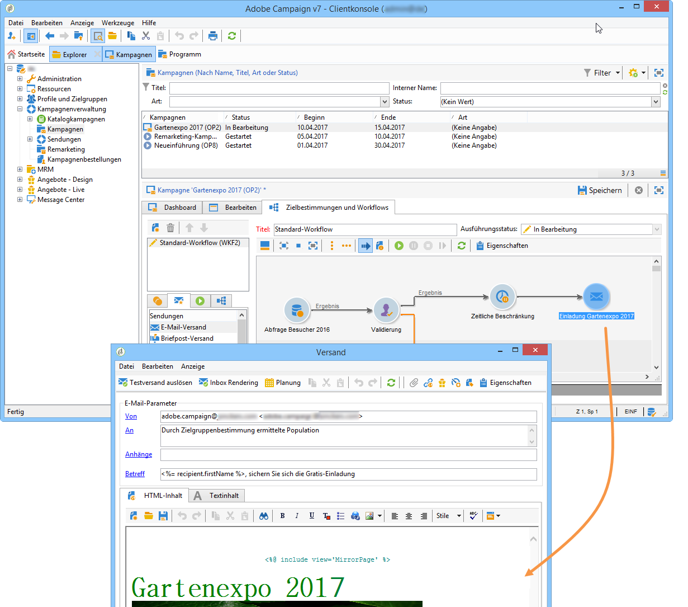
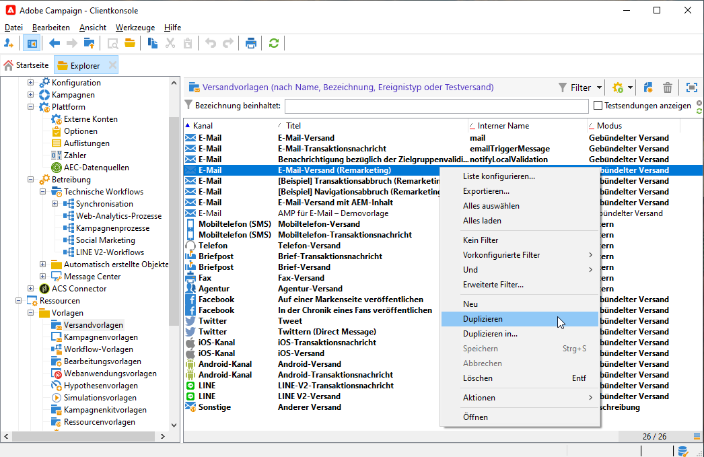
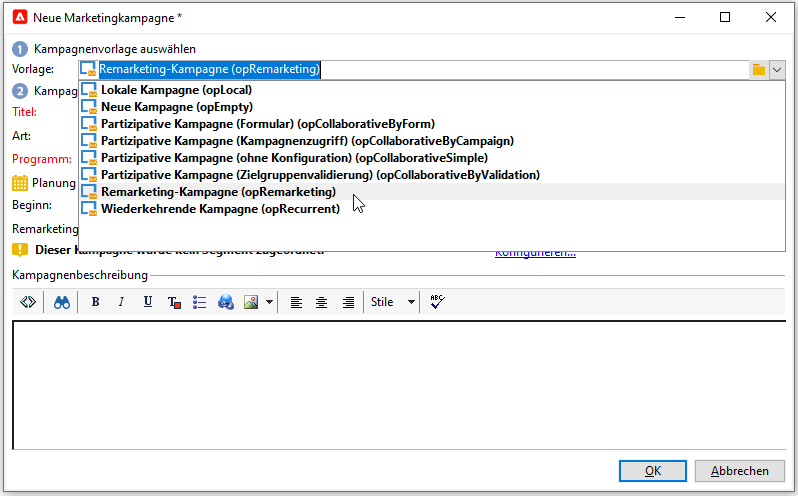

# Adobe Analytics Connector{#adobe-analytics-connector}

## Über die Integration von Adobe Analytics Connector {#about-analytics-connector-integration}

Mit Adobe Analytics Connector können Adobe Campaign und Adobe Analytics über das Paket **[!UICONTROL Web Analytics Connectors]** interagieren. Es leitet Daten in Form von Segmenten zum Benutzerverhalten nach einer E-Mail-Kampagne an Adobe Campaign weiter. Umgekehrt werden Indikatoren und Attribute von E-Mail-Kampagnen gesendet, die von Adobe Campaign an Adobe Analytics gesendet werden.

>[!CAUTION]
>
>* Adobe Analytics Connector ist nicht kompatibel mit Transaktionsnachrichten (Message Center).
   >
   >
* Stellen Sie vor dem Start sicher, dass das Adobe Identity Management System (IMS) in Campaign implementiert ist. [Weiterführende Informationen finden Sie auf dieser Seite](../../integrations/using/about-adobe-id.md).

Mit Adobe Analytics Connector kann Adobe Campaign die Internet-Audience (Web Analytics) messen. Dank dieser Integrationen kann Adobe Campaign Daten über das Besucherverhalten für eine oder mehrere Websites nach einer Marketing-Kampagne wiederherstellen und (nach der Analyse) Remarketing-Kampagnen mit dem Ziel durchführen, sie in Käufer zu konvertieren. Umgekehrt ermöglichen die Web-Analyse-Tools von Adobe Campaign die Weiterleitung von Indikatoren und Kampagnenattributen an ihre Plattformen.

Der Aktionsradius der verschiedenen Tools gestaltet sich wie folgt:

* Web-Analytics-Connector:

   1. markiert die mit Adobe Campaign ausgeführten E-Mail-Kampagnen,
   1. speichert in Form von Segmenten das Verhalten der Empfänger auf der Webseite, auf die sie nach Klick auf einen in der E-Mail enthaltenen Link gelangt sind. Die Segmente beziehen sich auf aufgegebene Produkte (auf der Webseite angesehen aber weder gekauft noch in den Warenkorb gelegt), Bestellungen und Transaktionsabbrüche.

* Adobe Campaign:

   1. sendet die Indikatoren und Attribute der Kampagne an den Connector, welcher sie an das Web-Analytics-Tool übermittelt,
   1. ruft Segmente ab und analysiert sie,
   1. löst eine Remarketing-Kampagne aus.

## Integration einrichten {#setting-up-the-integration}

Um den Data Connector einzurichten, verbinden Sie sich mit Ihrer Adobe-Campaign-Instanz und gehen Sie folgendermaßen vor:

1. [Report Suite in Adobe Analytics erstellen](#report-suite-analytics)
1. [Konfigurieren von Konversionsvariablen und Erfolgsereignissen](#configure-conversion-success)
1. [Externes Konto in Adobe Campaign konfigurieren Classic](#external-account-classic)

### Report Suite in Adobe Analytics erstellen {#report-suite-analytics}

Um die Adobe Analytics/Adobe Campaign Classic-Integration einzurichten, müssen Sie eine Verbindung zu Ihrer [!DNL Adobe Analytics]-Instanz herstellen und die folgenden Vorgänge durchführen:

1. Wählen Sie in [!DNL Adobe Analytics] die Registerkarte **[!UICONTROL Admin]** und klicken Sie dann auf **[!UICONTROL Alle Admin]**.

   

1. Klicken Sie auf **[!UICONTROL Report Suites]**.

   

1. Klicken Sie auf der Seite **[!UICONTROL Report Suite Manager]** auf **[!UICONTROL Neu erstellen]** und dann auf **[!UICONTROL Report Suite]**.

   Eine detaillierte Anleitung zur Erstellung von **[!UICONTROL Report Suites]** finden Sie in [diesem Abschnitt](https://experienceleague.adobe.com/docs/analytics/admin/manage-report-suites/new-report-suite/t-create-a-report-suite.html?lang=de#prerequisites).

   

1. Wählen Sie eine Vorlage aus.

1. Konfigurieren Sie Ihre neue Report Suite mit den folgenden Informationen:

   * **[!UICONTROL Report Suite-ID]**
   * **[!UICONTROL Site-Titel]**
   * **[!UICONTROL Zeitzone]**
   * **[!UICONTROL Freigabedatum]**
   * **[!UICONTROL Geschätzte Seitenansichten pro Tag]**

   

1. Klicken Sie nach der Konfiguration auf **[!UICONTROL Report Suite erstellen]**.

### Konfigurieren von Konversionsvariablen und Erfolgsereignissen {#configure-conversion-success}

Nach Erstellung der **[!UICONTROL Report Suite]** müssen Sie die **[!UICONTROL Konversionsvariablen]** und **[!UICONTROL Erfolgsereignisse]** wie folgt konfigurieren:

1. Wählen Sie Ihre zuvor konfigurierte **[!UICONTROL Report Suite]** aus.

1. Wählen Sie über die Schaltfläche **[!UICONTROL Einstellungen bearbeiten]** die Option **[!UICONTROL Konversion]** > **[!UICONTROL Konversionsvariablen]** aus.

   

1. Klicken Sie auf **[!UICONTROL Neu hinzufügen]**, um die Kennungen zu erstellen, die zur Messung der Wirkung der E-Mail-Kampagne erforderlich sind: den internen Kampagnennamen (cid) und die iNmsBroadlog (bid)-Tabellen-ID.

   Weitere Informationen zur Bearbeitung von **[!UICONTROL Konversionsvariablen]** finden Sie in diesem [Abschnitt](https://experienceleague.adobe.com/docs/analytics/admin/admin-tools/conversion-variables/t-conversion-variables-admin.html?lang=de#admin-tools).

   

1. Klicken Sie abschließend auf **[!UICONTROL Speichern]**.

1. Um **[!UICONTROL Erfolgsereignisse]** zu erstellen, wählen Sie **[!UICONTROL Konversion]** > **[!UICONTROL Erfolgsereignisse]** über die Schaltfläche **[!UICONTROL Einstellungen bearbeiten]** aus.

   

1. Klicken Sie auf **[!UICONTROL Neu hinzufügen]**, um die folgenden **[!UICONTROL Erfolgsereignisse]** zu konfigurieren:

   * **[!UICONTROL Geklickt]**
   * **[!UICONTROL Geöffnet]**
   * **[!UICONTROL Personenklicks]**
   * **[!UICONTROL Verarbeitet]**
   * **[!UICONTROL Geplant]**
   * **[!UICONTROL Gesendet]**
   * **[!UICONTROL Bounces insgesamt]**
   * **[!UICONTROL Einzelklicks]**
   * **[!UICONTROL Einzelöffnungen]**
   * **[!UICONTROL Abgemeldet]**

   Weitere Informationen zum Konfigurieren von **[!UICONTROL Erfolgsereignissen]** finden Sie in diesem [Abschnitt](https://experienceleague.adobe.com/docs/analytics/admin/admin-tools/success-events/t-success-events.html?lang=de#admin-tools)

   

1. Klicken Sie abschließend auf **[!UICONTROL Speichern]**.

Wenn Ihre Report Suite konfiguriert ist, müssen Sie die **[!UICONTROL Externen Konten]** in Adobe Campaign Classic konfigurieren.

### Externes Konto in Adobe Campaign Classic konfigurieren {#external-account-classic}

>[!IMPORTANT]
>
> Damit diese Integration funktioniert, müssen Sie das Paket **[!UICONTROL Web Analytics Connectors]** in Adobe Campaign installieren.
>
>Weiterführende Informationen zur Paketinstallation finden Sie auf dieser [Seite](../../installation/using/installing-campaign-standard-packages.md).

Nun müssen Sie Ihr externes **[!UICONTROL Web Analytics]**-Konto in Adobe Campaign konfigurieren, um die Synchronisierung zwischen beiden Lösungen zu aktivieren.

Beachten Sie dabei Folgendes: Wenn Ihre **[!UICONTROL Report Suite]**, **[!UICONTROL Konversionsvariablen]** oder **[!UICONTROL Erfolgsereignisse]** beim Konfigurieren Ihres externen Kontos nicht sichtbar sind, fehlt im **[!UICONTROL Produktprofil]** des zugeordneten Benutzers eine Berechtigung für diese neu erstellte Komponente.

Weitere Informationen hierzu finden Sie auf der Seite [Produktprofile für Adobe Analytics](https://experienceleague.adobe.com/docs/analytics/admin/admin-console/permissions/product-profile.html?lang=de#product-profile-admins).

1. Navigieren Sie im Adobe Campaign-Navigationsbaum zu **[!UICONTROL Administration]** > **[!UICONTROL Plattform]** > **[!UICONTROL Externe Konten]** und klicken Sie auf **[!UICONTROL Neu]**.

   

1. Verwenden Sie die Dropdown-Liste, um den Typ **[!UICONTROL Web Analytics]** und **[!UICONTROL Adobe Analytics]** aus der Dropdown-Liste **[!UICONTROL Integration]** auszuwählen.

   

1. Klicken Sie neben der Dropdown-Liste **[!UICONTROL Integration]** auf **[!UICONTROL Konfigurieren]**.

1. Ordnen Sie im Fenster **[!UICONTROL Analytics-Integration konfigurieren]** Ihr externes Konto Ihrer zuvor erstellten Report Suite zu, indem Sie die folgenden Informationen angeben:

   * **[!UICONTROL E-Mail]**
   * **[!UICONTROL IMS Org]**
   * **[!UICONTROL Analytics-Unternehmen]**
   * **[!UICONTROL Report Suite]**

1. Ordnen Sie in der Kategorie **[!UICONTROL eVars]** die beiden **[!UICONTROL Konversionsvariablen]** zu, die in [!DNL Adobe Analytics] konfiguriert sind.

   

1. Ordnen Sie in der Kategorie **[!UICONTROL Ereignisse]** die zehn **[!UICONTROL Erfolgsereignisse]** zu, die in [!DNL Adobe Analytics] konfiguriert sind.

1. Klicken Sie abschließend auf **[!UICONTROL Absenden]**. Adobe Campaign erstellt eine **[!UICONTROL Datenquelle]**, **[!UICONTROL Berechnete Metriken]**, **[!UICONTROL Remarketing-Segmente]** und **[!UICONTROL Klassifizierungen]** in der zugeordneten Analytics-**[!UICONTROL Report Suite]**.

   Sobald diese Synchronisation zwischen [!DNL Adobe Analytics] und Adobe Campaign abgeschlossen ist, können Sie das Fenster schließen.

1. Die Einstellungen werden auf der Registerkarte **[!UICONTROL Dateneinstellungen]** im Fenster **[!UICONTROL Analytics-Integration konfigurieren]** angezeigt.

   Klicken Sie auf die Schaltfläche **[!UICONTROL Synchronisieren]**, damit [!DNL Adobe Campaign] die vorgenommenen Namensänderungen in [!DNL Adobe Analytics] synchronisiert. Wenn die Komponente in [!DNL Adobe Analytics] gelöscht wird, wird die Komponente in [!DNL Adobe Campaign] durchgestrichen oder mit der Meldung **Nicht gefunden** angezeigt.

   

1. Bei Bedarf können Sie auf der Registerkarte **[!UICONTROL Segmente aktualisieren]** Segmente hinzufügen oder entfernen.

1. Klicken Sie über Ihr **[!UICONTROL externes Konto]** auf den Link **[!UICONTROL Formel anreichern...]**. Ändern Sie die URL-Formel, um die zur Integration in das Web-Analytics-Tool notwendigen Informationen (d. h. die Kampagnenkennungen) sowie die Website-Domains anzugeben, deren Aktivität verfolgt werden soll.

   

1. Geben Sie den oder die Namen der betroffenen Webseitendomains ein.

   

1. Klicken Sie auf **[!UICONTROL Weiter]** und stellen Sie sicher, dass die Domainnamen tatsächlich gespeichert wurden.

   

1. Bei Bedarf können Sie die Berechnungsformel überschreiben. Markieren Sie dazu die Checkbox und bearbeiten Sie die Formel direkt im Fenster.

   >[!IMPORTANT]
   >
   >Diese Konfigurationsoption sollte erfahrenen Nutzern vorbehalten bleiben, da Fehler in der Formel den Versand der Nachrichten blockieren können.

1. Im Tab **[!UICONTROL Erweitert]** können Sie fortgeschrittene Parameter ändern.

   * **[!UICONTROL Lebensdauer]**: Ermöglicht nach Ablauf des angegebenen Zeitraums (standardmäßig 180 Tage) die Löschung der Webereignisse, die aus Adobe Campaign mithilfe der technischen Workflows abgerufen wurden.
   * **[!UICONTROL Persistenz]**: Zeitraum (standardmäßig 7 Tage), während dem ein Webereignis (z. B. eine Bestellung) einer Remarketing-Kampagne zugeordnet werden kann.

>[!NOTE]
>
>Bei Verwendung verschiedener Audience-Mess-Tools können Sie bei der Erstellung des externen Kontos in der Dropdown-Liste des Felds **[!UICONTROL Partner]** die Option **[!UICONTROL Sonstige]** auswählen. Da in den Versandeigenschaften jeweils nur ein externes Konto bestimmt werden kann, ist eine Anpassung der Formel für die getrackten URLs notwendig, indem Sie die von Adobe und dem anderen Messtool erwarteten Parameter hinzufügen.

### Technische Workflows der Web-Analytics-Prozesse {#technical-workflows-of-web-analytics-processes}

Der Datenaustausch zwischen Adobe Campaign und Adobe Analytics erfolgt durch vier technische Workflows, die als Hintergrundaufgabe ausgeführt werden.

Sie sind im Adobe Campaign-Baum im Ordner **[!UICONTROL Administration]** > **[!UICONTROL Produktion]** > **[!UICONTROL Technische Workflows]** > **[!UICONTROL Web-Analytics-Prozess]** verfügbar.

* **[!UICONTROL Abruf von Webereignissen]**: Dieser Workflow ruft stündlich die auf das Verhalten von Besuchern bestimmter Webseiten bezogenen Segmente ab, fügt sie zur Adobe-Campaign-Datenbank hinzu und startet den Remarketing-Workflow.
* **[!UICONTROL Ereignislöschung]**: Dieser Workflow löscht alle Ereignisse aus der Datenbank gemäß dem im Feld **[!UICONTROL Lebensdauer]** angegebenen Zeitraum. Weitere Informationen hierzu finden Sie unter [Externes Konto in Adobe Campaign Classic konfigurieren](#external-account-classic).
* **[!UICONTROL Identifizierung der konvertierten Kontakte]**: Dieser Workflow erfasst die Besucher, die nach einer Remarketing-Kampagne einen Kauf getätigt haben. Die durch diesen Workflow abgerufenen Daten stehen im Bericht **[!UICONTROL Remarketing-Effizienz]** zur Verfügung. Weitere Informationen hierzu finden Sie auf dieser [Seite](#creating-a-re-marketing-campaign).
* **[!UICONTROL Übermittlung von Indikatoren und Kampagnenattributen]**: ermöglicht den Versand von E-Mail-Kampagnenindikatoren über Adobe Campaign an die Adobe Experience Cloud mithilfe von Adobe Analytics Connector. Dieser Workflow wird jeden Tag um 4 Uhr ausgelöst. Es kann 24 Stunden dauern, bis die Daten an Analytics gesendet werden.

   Bitte beachten Sie, dass dieser Workflow nicht neu gestartet werden sollte, da sonst alle vorherigen Daten erneut gesendet werden, was die Analyseergebnisse verfälschen könnte.

   Folgende Indikatoren werden übermittelt:

   * **[!UICONTROL Zu sendende Nachrichten]** (@toDeliver)
   * **[!UICONTROL Verarbeitet]** (@processed)
   * **[!UICONTROL Erfolg]** (@success)
   * **[!UICONTROL Öffnungen insgesamt]** (@totalRecipientOpen)
   * **[!UICONTROL Empfänger, die geöffnet haben]** (@recipientOpen)
   * **[!UICONTROL Gesamtzahl der Empfänger, die geklickt haben]** (@totalRecipientClick)
   * **[!UICONTROL Personen, die geklickt haben]** (@personClick)
   * **[!UICONTROL Unique-Clicks-Anzahl]** (@recipientClick)
   * **[!UICONTROL Abmeldung (Opt-out)]** (@optOut)
   * **[!UICONTROL Fehler]** (@error)

   >[!NOTE]
   >
   >Die gesendete Daten sind die Differenz zur letzten Übermittlung, was zu einem negativen Wert in den Metrikdaten führen kann.

   Folgende Attribute werden übermittelt:

   * **[!UICONTROL Interner Name]** (@internalName)
   * **[!UICONTROL Titel]** (@label)
   * **[!UICONTROL Titel]** (operation/@label): nur bei installiertem **Campaign**-Package
   * **[!UICONTROL Art]** (operation/@nature): nur bei installiertem **Campaign**-Package
   * **[!UICONTROL Tag 1]** (webAnalytics/@tag1)
   * **[!UICONTROL Tag 2]** (webAnalytics/@tag2)
   * **[!UICONTROL Tag 3]** (webAnalytics/@tag3)
   * **[!UICONTROL Kontaktdatum]** (scheduling/@contactDate)

## Versandverfolgung in Adobe Campaign {#tracking-deliveries-in-adobe-campaign}

Damit die Adobe Experience Cloud nach Versand der Nachrichten durch Adobe Campaign die Aktivitäten auf den Webseiten verfolgen kann, muss der entsprechende Connector in den Versandeigenschaften angegeben werden. Gehen Sie wie folgt vor:

1. Öffnen Sie den Versand der zu verfolgenden Kampagne.

   

1. Öffnen Sie die Versandeigenschaften.
1. Wählen Sie im Tab **[!UICONTROL Web Analytics]** das zuvor erstellte externe Konto aus. Siehe [Externes Konto in Adobe Campaign Classic konfigurieren](#external-account-classic).

   

1. Jetzt können Sie Ihre Nachrichten senden und auf den entsprechenden Bericht in Adobe Analytics zugreifen.

## Remarketing-Kampagne erstellen {#creating-a-re-marketing-campaign}

Zur Vorbereitung von Remarketing-Kampagnen ist die Erstellung von spezifischen Versandvorlagen erforderlich. Anschließend ist die Remarketing-Kampagne zu konfigurieren und einem Segment zuzuweisen. Jedem Segment muss eine andere Remarketing-Kampagne entsprechen.

Remarketing-Kampagnen werden automatisch gestartet, sobald Adobe Campaign Daten zur Verhaltensanalyse der Zielgruppe der ursprünglichen Kampagne abgerufen hat. Wenn eine Transaktion abgebrochen oder ein Artikel ohne Kauf angesehen wurde, erhalten die entsprechenden Zielpersonen einen Versand, um die Kaufentscheidung auszulösen.

Adobe Campaign stellt vorkonfigurierte Versandvorlagen zur Verfügung, die Sie verwenden oder als Anregung für Ihre Kampagnen nutzen können.

1. Gehen Sie im Ordner **[!UICONTROL Explorer]** zum Ordner **[!UICONTROL Ressourcen]** > **[!UICONTROL Vorlagen]** > **[!UICONTROL Versandvorlagen]** des Adobe Campaign-Navigationsbaums.

1. Duplizieren Sie die Vorlage **[!UICONTROL E-Mail-Versand (Remarketing)]** oder die von Adobe Campaign vorgeschlagenen Remarketing-Vorlagenbeispiele.

   

1. Passen Sie die Vorlage Ihren Bedürfnissen an und speichern Sie sie.

1. Erstellen Sie eine neue Kampagne und wählen Sie aus der Dropdown-Liste die Vorlage **[!UICONTROL Remarketing-Kampagne]** aus;

   

1. Klicken Sie auf den Link **[!UICONTROL Konfigurieren...]**, um das Segment und die der Kampagne entsprechende Versandvorlage anzugeben;

1. Wählen Sie zunächst das zuvor konfigurierte externe Konto aus;

   

1. Wählen Sie das betreffende Segment aus;

   

1. Wählen Sie die für diese Remarketing-Kampagne zu verwendende Versandvorlage aus und klicken Sie auf **[!UICONTROL Beenden]**, um das Konfigurationsfenster zu schließen.

   

1. Klicken Sie nun auf **[!UICONTROL OK]**, um das Kampagnenfenster zu schließen.

Der Bericht zur **[!UICONTROL Remarketing-Effizienz]** steht in der allgemeinen Berichtübersicht zur Verfügung. Er zeigt die Anzahl konvertierter Kontakte (die einen Kauf getätigt haben) in Bezug auf die Zahl der Transaktionsabbrüche im Anschluss an die mit Adobe Campaign durchgeführte Remarketing-Kampagne an. Die Konversionsrate wird über die letzten 7 oder 30 Tage bzw. ab der Synchronisation von Adobe Campaign und der Web-Analytics-Tools berechnet.

