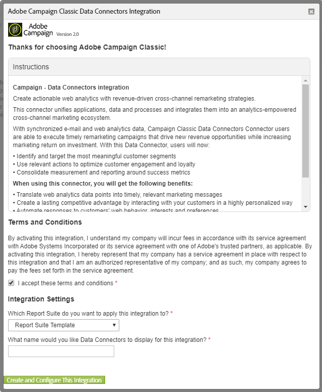
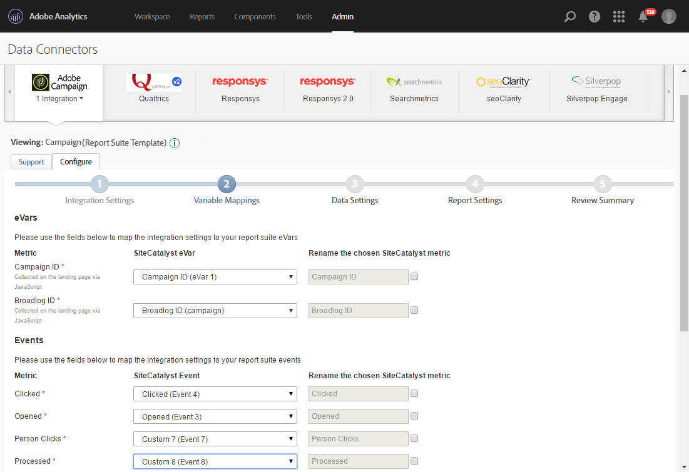

# Der Data Connector von Adobe Analytics{#adobe-analytics-data-connector}

## Über die Integration des Data Connectors {#about-data-connector-integration}

>[!CAUTION]
>
>Adobe Analytics Data Connector ist nicht kompatibel mit Transaktionsnachrichten (Message Center).

Der Data Connector (vormals Adobe-Genesis-Connector) ermöglicht Adobe Campaign und Adobe Analytics die Interaktion über das Package **Web-Analytics-Connectoren**. Dabei werden Daten an Adobe Campaign in Form von Segmenten zum Nutzerverhalten nach einer E-Mail-Kampagne weitergeleitet. Im Gegenzug werden Indikatoren und Attribute von E-Mail-Kampagnen von Adobe Campaign an Adobe Analytics – Data Connector gesendet.

Adobe Campaign verfügt mit dem Data Connector über eine Funktion zur Messung der Performance von Online-Marketingkampagnen (Web Analytics). Adobe Campaign ist somit in der Lage, Daten zum Verhalten von Webseitenbesuchern, die auf eine Marketingkampagne reagieren, abzurufen und nach Analyse gezielte Remarketing-Kampagnen zu schalten, um die Konversionsrate zu steigern. Zugleich ermöglichen die Web-Analytics-Tools die Übermittlung der in Adobe Campaign erzeugten Kampagnenindikatoren und -attribute an die entsprechenden Plattformen.

Weitere Informationen zur Implementierung der Integration von Adobe Analytics mit Adobe Campaign finden Sie in diesem [Handbuch](https://helpx.adobe.com/de/marketing-cloud/how-to/analytics-ac.html).

Der Aktionsradius der verschiedenen Tools gestaltet sich wie folgt:

* Web-Analytics-Connector:

   1. markiert die mit Adobe Campaign ausgeführten E-Mail-Kampagnen,
   1. speichert in Form von Segmenten das Verhalten der Empfänger auf der Webseite, auf die sie nach Klick auf einen in der E-Mail enthaltenen Link gelangt sind. Die Segmente beziehen sich auf aufgegebene Produkte (auf der Webseite angesehen aber weder gekauft noch in den Warenkorb gelegt), Bestellungen und Transaktionsabbrüche.

* Adobe Campaign:

   1. sendet die Indikatoren und Attribute der Kampagne an den Connector, welcher sie an das Web-Analytics-Tool übermittelt,
   1. ruft Segmente ab und analysiert sie,
   1. löst eine Remarketing-Kampagne aus.

## Integration einrichten {#setting-up-the-integration}

Um den Data Connector einzurichten, verbinden Sie sich mit Ihrer Adobe-Campaign-Instanz und gehen Sie folgendermaßen vor:

* [1. Schritt: Integration in Analytics konfigurieren](#step-1--configure-integration-in-analytics)
* [2. Schritt: Externes Konto in Adobe Campaign erstellen](#step-2--create-the-external-account-in-campaign)
* [3. Schritt: Adobe Campaign und Adobe Analytics synchronisieren](#step-3--synchronize-adobe-campaign-and-adobe-analytics)

### 1. Schritt: Integration in Analytics konfigurieren {#step-1--configure-integration-in-analytics}

Im Folgenden wird die Konfiguration des Data Connectors mithilfe eines Assistenten beschrieben.

1. Melden Sie sich mit einer Adobe-ID oder einer Unternehmenskennung bei Adobe Experience Cloud an.

   

1. Wählen Sie aus der Liste der Experience Cloud-Lösungen die Option **[!UICONTROL Analytics]** aus.

   

1. Wählen Sie im Tab **[!UICONTROL Admin]** die Option **[!UICONTROL Data Connectors]**.

   Sie benötigen die folgenden Berechtigungen für Analytics-Tools, um auf das Menü **[!UICONTROL Connectoren]** zugreifen zu können. Weiterführende Informationen hierzu finden Sie auf dieser [Seite](https://docs.adobe.com/content/help/de-DE/analytics/admin/admin-console/permissions/analytics-tools.html).
   * Integrationen (Erstellen)
   * Integrationen (Aktualisieren)
   * Integrationen (Löschen)

   

1. Wählen Sie in der Liste der Partner die Option **[!UICONTROL Adobe Campaign Classic]**.

   

1. Klicken Sie im Dialogfeld **[!UICONTROL Integration hinzufügen]** auf **[!UICONTROL Aktivieren]**.
1. Wählen Sie die Option **[!UICONTROL Ich akzeptiere diese Nutzungsbedingungen]** aus und danach die mit dieser Integration verknüpfte **[!UICONTROL Report suite]** und geben Sie den Connector-Namen ein.

   Wenn Sie fertig sind, klicken Sie auf **[!UICONTROL Diese Integration erstellen und konfigurieren]**.

   

1. Geben Sie die E-Mail-Adresse ein, an die die Benachrichtigungen in Bezug auf den Connector gesendet werden sollen. Kopieren Sie dann die **[!UICONTROL Konto-ID]**, wie sie im externen Adobe Campaign-Konto erscheint (weitere Informationen hierzu finden Sie unter [2. Schritt: Externes Konto in Adobe Campaign erstellen](#step-2--create-the-external-account-in-campaign)).

   

1. Spezifizieren Sie die für die Wirkungsmessung der E-Mail-Kampagne erforderlichen Kennungen, d. h. den internen Kampagnennamen (cid) und die iNmsBroadlog (bid)-Tabellen-ID. Die Indikatoren für die abzurufenden Ereignisse sollten ebenfalls festgelegt werden.
Achten Sie darauf, dass Ihre **[!UICONTROL Ereignisse]** vom Typ „Numerisch“ sind, da sie sonst nicht im Dropdown-Menü angezeigt werden.

   

1. Spezifizieren Sie nötigenfalls die personalisierten Segmente.

   

1. Wählen Sie in **[!UICONTROL Datenerfassung]** eine Methode für den Abruf von Daten aus, in diesem Fall die in Schritt 6 spezifizierten Kennungen **[!UICONTROL cid]** und **[!UICONTROL bid]**.

   

1. Wählen Sie die Informationen aus, die im Dashboard dargestellt werden sollen.

   

1. Prüfen Sie die Konfiguration auf der Seite, in der die vorherigen Schritte zusammengefasst werden.

   

1. Klicken Sie auf **[!UICONTROL Activate Now]**, um die Konfiguration zu bestätigen und den Connector zu aktivieren.

   

   Der Data Connector ist jetzt konfiguriert.

### 2. Schritt: Externes Konto in Adobe Campaign erstellen {#step-2--create-the-external-account-in-campaign}

Die Integration von Adobe Campaign in die Analytics-Plattformen geschieht mithilfe eines Connectors. Gehen Sie zur Synchronisation wie folgt vor:

1. Installieren Sie das Package **Web-Analytics-Connectoren** in Adobe Campaign.
1. Positionieren Sie sich hierfür im Adobe-Campaign-Navigationsbaum im Knoten **[!UICONTROL Administration > Plattform > Externe Konten]**.
1. Klicken Sie mit der rechten Maustaste in die Liste der externen Konten und wählen Sie aus dem Kontextmenü den Punkt **[!UICONTROL Neu]** aus. Sie haben auch die Möglichkeit, auf die Schaltfläche **[!UICONTROL Neu]** rechts über der Liste zu klicken.
1. Wählen Sie aus der Dropdown-Liste den Typ **[!UICONTROL Web Analytics]** aus.
1. Wählen Sie den Anbieter aus, hier z. B. **[!UICONTROL Adobe Analytics Data Connector]**.

   

1. Klicken Sie auf den Link **[!UICONTROL Formel anreichern...]** zum Ändern der URL-Formel, um die zur Integration in das Web-Analytics-Tool notwendigen Informationen (d. h. die Kampagnenkennungen) sowie die Webseitendomains, deren Aktivität verfolgt werden soll, anzugeben.
1. Geben Sie den oder die Namen der betroffenen Webseitendomains ein.

   

1. Klicken Sie auf **[!UICONTROL Weiter]** und stellen Sie sicher, dass die Domainnamen tatsächlich gespeichert wurden.

   

1. Bei Bedarf können Sie die Formel überschreiben. Kreuzen Sie hierfür das entsprechende Feld an und ändern Sie die Formel direkt im angezeigten Fenster.

   

   >[!CAUTION]
   >
   >Diese Konfigurationsoption sollte erfahrenen Nutzern vorbehalten bleiben, da Fehler in der Formel die Versendung der Nachrichten blockieren können.

1. Im Tab **[!UICONTROL Erweitert]** können Sie fortgeschrittene Parameter ändern.

   * **[!UICONTROL Lebensdauer]**: Ermöglicht nach Ablauf des angegebenen Zeitraums (standardmäßig 180 Tage) die Löschung der Webereignisse, die aus Adobe Campaign mithilfe der technischen Workflows abgerufen wurden.
   * **[!UICONTROL Persistenz]**: Zeitraum (standardmäßig 7 Tage), während dem ein Webereignis (z. B. eine Bestellung) einer Remarketing-Kampagne zugeordnet werden kann.

>[!NOTE]
>
>Bei Verwendung verschiedener Performance-Messtools können Sie bei der Erstellung des externen Kontos in der Dropdown-Liste des Felds **[!UICONTROL Partner]** die Option **[!UICONTROL Sonstige]** auswählen. Da in den Versandeigenschaften jeweils nur ein externes Konto bestimmt werden kann, ist eine Anpassung der Formel für die getrackten URLs notwendig, indem Sie die von Adobe und dem anderen Messtool erwarteten Parameter hinzufügen.

### 3. Schritt: Adobe Campaign und Adobe Analytics synchronisieren {#step-3--synchronize-adobe-campaign-and-adobe-analytics}

Nach Erstellung des externen Kontos ist eine Synchronisation der beiden Anwendungen erforderlich.

1. Gehen Sie zum zuvor erstellten externen Konto.
1. Ändern Sie falls erforderlich den **[!UICONTROL Titel]** des Kontos.
1. Ändern Sie den **[!UICONTROL internen Namen]**, damit er dem im Data-Connector-Assistenten konfigurierten **[!UICONTROL Namen]** entspricht.

   

1. Klicken Sie auf den Link **[!UICONTROL Verbindung bestätigen]**.

   

   Versichern Sie sich, dass der **[!UICONTROL interne Name]** tatsächlich dem im Data-Connector-Konfigurationsassistenten bezeichneten **[!UICONTROL Namen]** entspricht.

1. Geben Sie im Data-Connector-Konfigurationsassistenten die **[!UICONTROL Kontonummer]** ein.

   

1. Durchlaufen Sie alle Schritte des Data Connector-Assistenten bis zum Ende und kehren Sie zum externen Konto in Adobe Campaign zurück.
1. Klicken Sie auf **[!UICONTROL Weiter]**, um den Datenaustausch zwischen Adobe Campaign und Adobe Analytics – Data Connector zu starten.

   Nach erfolgter Synchronisation wird die Liste der Segmente angezeigt:

   

Nach erfolgter Synchronisation von Adobe Campaign und Adobe Analytics – Data Connector werden die drei im Data Connector-Assistenten als Standard festgelegten Segmente von Adobe Campaign abgerufen und im Tab **[!UICONTROL Segmente]** des externen Adobe-Campaign-Kontos zugänglich gemacht.

Wenn im Data Connector-Assistenten weitere Segmente angegeben wurden, können Sie diese nun zu Adobe Campaign hinzufügen. Klicken Sie hierfür auf den Link **[!UICONTROL Segmentliste aktualisieren...]** und durchlaufen Sie den Assistenten des externen Kontos bis zum Ende. Die neuen Segmente werden in der Liste angezeigt.

### Technische Workflows der Web-Analytics-Prozesse {#technical-workflows-of-web-analytics-processes}

Der Datenaustausch zwischen Adobe Campaign und Adobe Analytics – Data Connector wird durch vier im Hintergrund ablaufende technische Workflows gesteuert.

Auf diese Workflows kann im Adobe-Campaign-Navigationsbaum über den Knoten **[!UICONTROL Administration > Betreibung > Technische Workflows > Web-Analytics-Prozesse]** zugegriffen werden.

* **[!UICONTROL Abruf von Webereignissen]**: Dieser Workflow ruft stündlich die auf das Verhalten von Besuchern bestimmter Webseiten bezogenen Segmente ab, fügt sie zur Adobe-Campaign-Datenbank hinzu und startet den Remarketing-Workflow.
* **[!UICONTROL Ereignislöschung]**: Dieser Workflow löscht alle Ereignisse aus der Datenbank gemäß dem im Feld **[!UICONTROL Lebensdauer]** angegebenen Zeitraum. Weitere Informationen hierzu finden Sie in [2. Schritt: Externes Konto in Adobe Campaign erstellen](#step-2--create-the-external-account-in-campaign).
* **[!UICONTROL Identifizierung der konvertierten Kontakte]**: Dieser Workflow erfasst die Besucher, die nach einer Remarketing-Kampagne einen Kauf getätigt haben. Die durch diesen Workflow abgerufenen Daten stehen im Bericht **[!UICONTROL Remarketing-Effizienz]** zur Verfügung. Weitere Informationen hierzu finden Sie auf dieser [Seite](#creating-a-re-marketing-campaign).
* **[!UICONTROL Übermittlung der Kampagnen-Indikatoren und -Attribute]**: Dieser Workflow sendet die in Adobe Campaign enthaltenen Indikatoren aus E-Mail-Kampagnen über den Adobe Analytics Data Connector an Adobe Experience Cloud. Dieser Workflow wird jeden Tag um 4 Uhr ausgelöst. Es kann 24 Stunden dauern, bis die Daten an Analytics gesendet werden.

   Bitte beachten Sie, dass dieser Workflow nicht neu gestartet werden sollte, da sonst alle vorherigen Daten erneut gesendet werden, was die Analyseergebnisse verfälschen könnte.

   Folgende Indikatoren werden übermittelt:

   * **[!UICONTROL Zu sendende Nachrichten]** (@toDeliver)
   * **[!UICONTROL Verarbeitet]** (@processed)
   * **[!UICONTROL Erfolg]** (@success)
   * **[!UICONTROL Öffnungen insgesamt]** (@totalRecipientOpen)
   * **[!UICONTROL Empfänger, die geöffnet haben]** (@recipientOpen)
   * **[!UICONTROL Gesamtzahl der Empfänger, die geklickt haben]** (@totalRecipientClick)
   * **[!UICONTROL Personen, die geklickt haben]** (@personClick)
   * **[!UICONTROL Unique-Clicks-Anzahl]** (@recipientClick)
   * **[!UICONTROL Abmeldung (Opt-out)]** (@optOut)
   * **[!UICONTROL Fehler]** (@error)

   >[!NOTE]
   >
   >Die gesendete Daten sind die Differenz zur letzten Übermittlung, was zu einem negativen Wert in den Metrikdaten führen kann.

   Folgende Attribute werden übermittelt:

   * **[!UICONTROL Interner Name]** (@internalName)
   * **[!UICONTROL Titel]** (@label)
   * **[!UICONTROL Titel]** (operation/@label): nur bei installiertem **Campaign**-Package
   * **[!UICONTROL Art]** (operation/@nature): nur bei installiertem **Campaign**-Package
   * **[!UICONTROL Tag 1]** (webAnalytics/@tag1)
   * **[!UICONTROL Tag 2]** (webAnalytics/@tag2)
   * **[!UICONTROL Tag 3]** (webAnalytics/@tag3)
   * **[!UICONTROL Kontaktdatum]** (scheduling/@contactDate)

## Versandverfolgung in Adobe Campaign {#tracking-deliveries-in-adobe-campaign}

Damit die Adobe Experience Cloud nach Versand der Nachrichten durch Adobe Campaign die Aktivitäten auf den Webseiten verfolgen kann, muss der entsprechende Connector in den Versandeigenschaften angegeben werden. Gehen Sie wie folgt vor:

1. Öffnen Sie den Versand der zu verfolgenden Kampagne.

   

1. Öffnen Sie die Versandeigenschaften.
1. Wählen Sie im Tab **[!UICONTROL Web Analytics]** das zuvor erstellte externe Konto aus. Refer to [Step 2: Create the external account in Campaign](#step-2--create-the-external-account-in-campaign).

   

1. Jetzt können Sie Ihre Nachrichten senden und auf den entsprechenden Bericht in Adobe Analytics zugreifen.

## Remarketing-Kampagne erstellen {#creating-a-re-marketing-campaign}

Zur Vorbereitung von Remarketing-Kampagnen ist die Erstellung von spezifischen Versandvorlagen erforderlich. Anschließend ist die Remarketing-Kampagne zu konfigurieren und einem Segment zuzuweisen. Jedem Segment muss eine andere Remarketing-Kampagne entsprechen.

Remarketing-Kampagnen werden automatisch gestartet, sobald Adobe Campaign Daten zur Verhaltensanalyse der Zielgruppe der ursprünglichen Kampagne abgerufen hat. Wenn eine Transaktion abgebrochen oder ein Artikel ohne Kauf angesehen wurde, erhalten die entsprechenden Zielpersonen einen Versand, um die Kaufentscheidung auszulösen.

Adobe Campaign stellt vorkonfigurierte Versandvorlagen zur Verfügung, die Sie verwenden oder als Anregung für Ihre Kampagnen nutzen können.

1. Öffnen Sie im **[!UICONTROL Explorer]** den Ordner im Adobe-Campaign-Navigationsbaum über den Knoten **[!UICONTROL Ressourcen > Vorlagen > Versandvorlagen]**.
1. Duplizieren Sie die Vorlage **[!UICONTROL E-Mail-Versand (Remarketing)]** oder die von Adobe Campaign vorgeschlagenen Remarketing-Vorlagenbeispiele.
1. Passen Sie die Vorlage Ihren Bedürfnissen an und speichern Sie sie.

   

1. Erstellen Sie eine neue Kampagne und wählen Sie aus der Dropdown-Liste die Vorlage **[!UICONTROL Remarketing-Kampagne]** aus;

   

1. Klicken Sie auf den Link **[!UICONTROL Konfigurieren...]**, um das Segment und die der Kampagne entsprechende Versandvorlage anzugeben;
1. Wählen Sie zunächst das zuvor konfigurierte externe Konto aus;

   

1. Wählen Sie das betreffende Segment aus;

   

1. Wählen Sie die für diese Remarketing-Kampagne zu verwendende Versandvorlage aus und klicken Sie auf **[!UICONTROL Beenden]**, um das Konfigurationsfenster zu schließen.

   

1. Klicken Sie nun auf **[!UICONTROL OK]**, um das Kampagnenfenster zu schließen.

Der Bericht zur **[!UICONTROL Remarketing-Effizienz]** steht in der allgemeinen Berichtübersicht zur Verfügung. Er zeigt die Anzahl konvertierter Kontakte (die einen Kauf getätigt haben) in Bezug auf die Zahl der Transaktionsabbrüche im Anschluss an die mit Adobe Campaign durchgeführte Remarketing-Kampagne an. Die Konversionsrate wird über die letzten 7 oder 30 Tage bzw. ab der Synchronisation von Adobe Campaign und der Web-Analytics-Tools berechnet.

