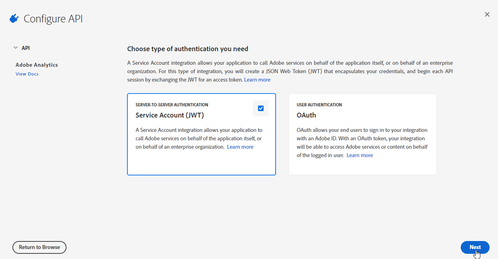
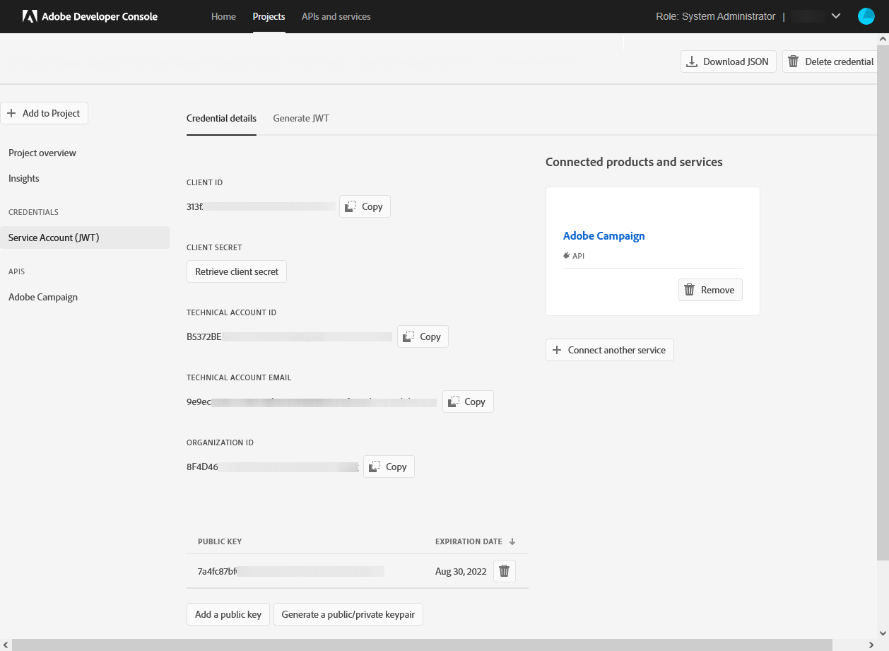

# Bereitstellung des Adobe Analytics-Connectors {#adobe-analytics-connector-provisioning}


>[!IMPORTANT]
>
> Diese Schritte sollten nur von Hybrid- und On-Premise-Implementierungen durchgeführt werden.
>
>Bei gehosteten Implementierungen wenden Sie sich an das [Adobe-Kundenunterstützungs](https://helpx.adobe.com/de/enterprise/admin-guide.html/enterprise/using/support-for-experience-cloud.ug.html)-Team.

Die Integration zwischen Adobe Campaign Classic und Adobe Analytics-Authentifizierung unterstützt Adobe Identity Management Service (IMS):

* Wenn Sie ein migriertes externes Konto verwalten, müssen Sie Adobe IMS implementieren und über eine Adobe ID eine Verbindung zu Adobe Campaign herstellen. Der über Adobe ID IMS angemeldete Benutzer sollte Eigentümer der **Data Connector** -Konto in Adobe Analytics verwenden und über eine Reihe von Berechtigungen für die **Produktprofil** unten aufgeführt.

* Wenn Sie einen neuen Connector implementieren, ist die Implementierung von Adobe IMS optional. Ohne einen Adobe ID-Benutzer verwendet Adobe Campaign einen technischen Anwender zur Synchronisierung mit Adobe Analytics.

Damit diese Integration funktioniert, müssen Sie ein Adobe Analytics-Produktprofil erstellen, das ausschließlich für den Analytics-Connector verwendet wird. Anschließend müssen Sie ein Adobe I/O-Projekt erstellen.

## Erstellen eines Adobe Analytics-Produktprofils {#analytics-product-profile}

Das Produktprofil bestimmt die Zugriffsebene eines Benutzers auf Ihre verschiedenen Analytics-Komponenten.

Wenn Sie bereits über ein Analytics-Produktprofil verfügen, sollten Sie dennoch ein neues Adobe Analytics-Produktprofil erstellen, das ausschließlich für den Analytics-Connector verwendet wird. Dadurch wird sichergestellt, dass Ihr Produktprofil mit den richtigen Berechtigungen für diese Integration ausgestattet ist.

Weiterführende Informationen zu Produktprofilen finden Sie in der [Dokumentation zur Admin Console](https://helpx.adobe.com/de/enterprise/admin-guide.html).

1. Wählen Sie in der [Admin Console](https://adminconsole.adobe.com/) Ihr Adobe Analytics-**[!UICONTROL Produkt]** aus.

   

1. Klicken Sie auf **[!UICONTROL Neues Profil]**.

   

1. Fügen Sie einen **[!UICONTROL Produktprofilnamen]** hinzu. Wir empfehlen, die folgende Syntax zu verwenden: `reserved_campaign_classic_<Company Name>`. Klicken Sie dann auf **[!UICONTROL Weiter]**.

   Dieses **[!UICONTROL Produktprofil]** sollte ausschließlich für den Analytics-Connector verwendet werden, um Konfigurationsfehler zu vermeiden.

1. Öffnen Sie das neu erstellte **[!UICONTROL Produktprofil]** und wählen Sie die Registerkarte **[!UICONTROL Berechtigungen]** aus.

   

1. Konfigurieren Sie die verschiedenen Funktionen, indem Sie auf **[!UICONTROL Bearbeiten]** klicken, und wählen Sie die Berechtigungen aus, die Sie Ihrem **[!UICONTROL Produktprofil]** zuweisen möchten, indem Sie auf das Pluszeichen (+) klicken.

   Weitere Informationen zum Verwalten von Berechtigungen finden Sie in der [Dokumentation zur Admin Console](https://helpx.adobe.com/de/enterprise/using/manage-permissions-and-roles.html).

1. Fügen Sie für die Funktion **[!UICONTROL Report Suites]** die **[!UICONTROL Report Suites]** hinzu, die Sie später verwenden müssen.

   Wenn Sie über keine Report Suites verfügen, können Sie diese mit [diesen Schritten](../../platform/using/adobe-analytics-connector.md#report-suite-analytics) erstellen.

   

1. Fügen Sie für die Funktion **[!UICONTROL Metriken]** die **[!UICONTROL Metriken]** hinzu, die Sie später konfigurieren müssen.

   Bei Bedarf können Sie die Option &quot;Automatisch einschließen&quot; aktivieren, mit der jedes Berechtigungselement zur eingeschlossenen Liste hinzugefügt wird und automatisch neue Berechtigungselemente hinzugefügt werden.

   

1. Fügen Sie für die Funktion **[!UICONTROL Dimensionen]** die **[!UICONTROL Dimensionen]** hinzu, die Sie später konfigurieren müssen.

1. Fügen Sie für die Funktion **[!UICONTROL Report Suite-Tools]** die folgenden Berechtigungen hinzu:

   * **[!UICONTROL Report Suite-Verwaltung]**
   * **[!UICONTROL Konversionsvariablen]**
   * **[!UICONTROL Erfolgsereignisse]**
   * **[!UICONTROL Benutzerdefinierter Data Warehouse-Bericht]**
   * **[!UICONTROL Datenquellen-Manager]**
   * **[!UICONTROL Klassifizierungen]**

1. Fügen Sie für die Funktion **[!UICONTROL Analytics-Tools]** die folgenden Berechtigungen hinzu:

   * **[!UICONTROL Code-Manager - Web-Services]**
   * **[!UICONTROL Protokolle - Web-Services]**
   * **[!UICONTROL Web-Services]**
   * **[!UICONTROL Web-Service-Zugriff]**
   * **[!UICONTROL Erstellung berechneter Metriken]**
   * **[!UICONTROL Segmenterstellung]**

Ihr Produktprofil ist jetzt konfiguriert. Anschließend müssen Sie das Adobe I/O-Projekt erstellen.

## Erstellen eines Adobe I/O-Projekts {#create-adobe-io}

1. Rufen Sie Adobe I/O auf und melden Sie sich als **Systemadministrator** für die IMS-Organisation an.

   Weiterführende Informationen zu Administratorrollen finden Sie auf dieser [Seite](https://helpx.adobe.com/de/enterprise/using/admin-roles.html).

1. Klicken Sie auf **[!UICONTROL Neues Projekt erstellen]**.

   

1. Klicken Sie auf **[!UICONTROL Zum Projekt hinzufügen]** und wählen Sie **[!UICONTROL API]** aus.

   

1. Wählen Sie [!DNL Adobe Analytics] und klicken Sie auf **[!UICONTROL Weiter]**.

   

1. Wählen Sie **[!UICONTROL Dienstkonto (JWT)]** als Authentifizierungstyp aus und klicken Sie auf **[!UICONTROL Weiter]**. 

   

1. Wählen Sie die **[!UICONTROL Option 1: Schlüsselpaar generieren]** aus und klicken Sie auf **[!UICONTROL Schlüsselpaar generieren]**.

   Die Datei config.zip wird dann automatisch heruntergeladen.

   

1. Klicken Sie auf **[!UICONTROL Weiter]**.

   

1. Wählen Sie das **[!UICONTROL Produktprofil]** aus, das in den vorherigen Schritten erstellt wurde, die in diesem [Abschnitt](#analytics-product-profile) beschrieben sind.

1. Klicken Sie dann auf **[!UICONTROL Konfigurierte API speichern]**.

   

1. Wählen Sie in Ihrem Projekt [!DNL Adobe Analytics] aus und kopieren Sie die folgenden Informationen unter **[!UICONTROL Dienstkonto (JWT)]**:

   * **[!UICONTROL Client ID]** (Client-ID)
   * **[!UICONTROL Client Secret]** (Client-Geheimnis)
   * **[!UICONTROL Technical account ID]** (Kennung des technischen Kontos)
   * **[!UICONTROL Organization ID]** (Organisationskennung)

   

1. Fügen Sie diese Anmeldedaten für das Dienstkonto mithilfe des folgenden Befehls in den nlserver ein:

   ```
   nlserver config -instance:<instanceName> -setimsjwtauth::<ImsOrgId>/<ClientId>/<TechnicalAccountId>/<ClientSecret>/<$(base64 -w0 /path/to/private.key)>
   ```

Sie können jetzt mit der Verwendung des Analytics-Connectors beginnen und Ihr Kundenverhalten verfolgen.
