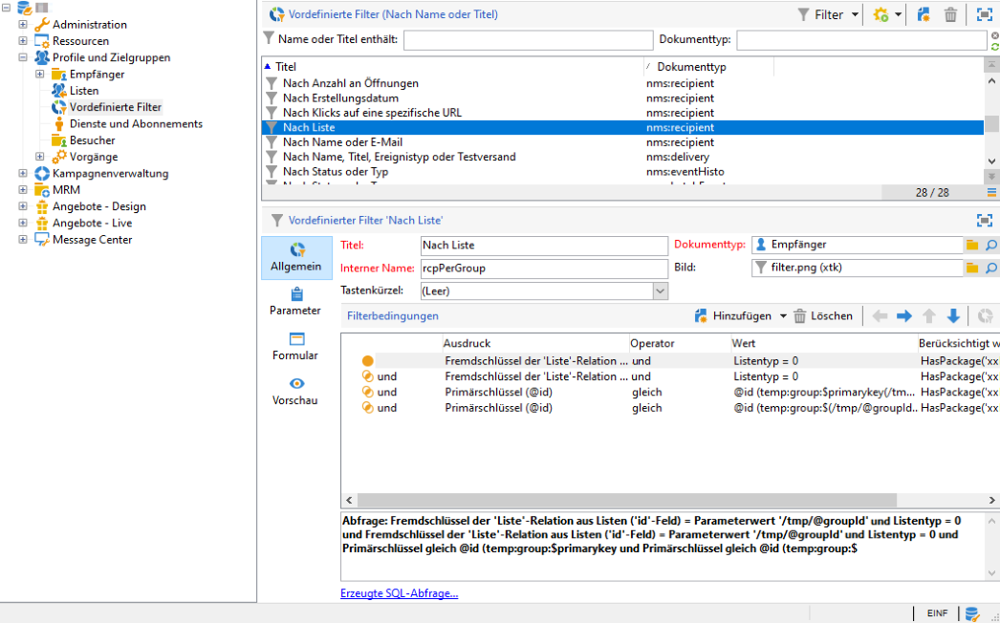
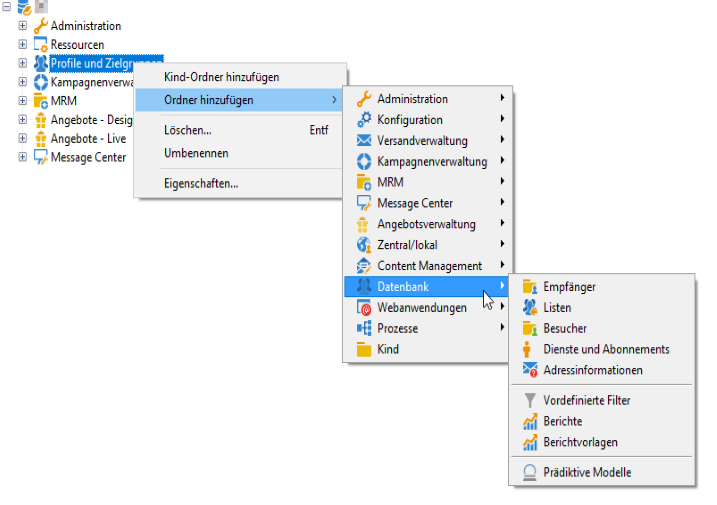

# Adobe Campaign-Explorer verwenden {#using-adobe-campaign-explorer}

Auf den Adobe-Campaign-Explorer kann über das entsprechende Symbol in der Symbolleiste zugegriffen werden. Mit seiner Hilfe gelangen Sie zu allen Adobe-Campaign-Funktionen und in die verschiedenen Konfigurationsbildschirme der Adobe-Campaign-Plattform. Darüber hinaus bietet er eine detaillierte Ansicht gewisser Elemente.

Die **[!UICONTROL Explorer]**-Ansicht ist in drei Bereiche unterteilt:

**1 – Baum**: Sie können den Inhalt des Baums anpassen (Knoten hinzufügen, verschieben oder löschen). Dies sollte nur von Experten durchgeführt werden. Weiterführende Informationen hierzu finden Sie in [diesem Abschnitt](#about-navigation-hierarchy).

**2 – Liste**: Sie können diese Liste filtern, Suchvorgänge durchführen, Informationen hinzufügen und Daten darin sortieren. [Weitere Informationen](adobe-campaign-ui-lists.md).

**3 – Details**: Sie können Details des ausgewählten Elements anzeigen. Mit dem Symbol rechts oben können Sie die Anzeige zum Vollbildschirm vergrößern.

## Ordner und Navigationsbaum{#about-navigation-hierarchy}

Der Navigationsbaum funktioniert wie ein Datei-Browser (z. B. Windows Explorer). Ordner können Unterordner enthalten. Wenn Sie einen Knoten auswählen, wird die dem Knoten entsprechende Ansicht angezeigt.

Die angezeigte Ansicht ist eine Liste, die mit einem Schema und einem Eingabeformular zur Bearbeitung der ausgewählten Zeile verknüpft ist.

Um dem Baum einen neuen Ordner hinzuzufügen, klicken Sie mit der rechten Maustaste auf den Ordner in der Verzweigung, wo Sie einen Ordner einfügen möchten, und wählen Sie **[!UICONTROL Neuen Ordner hinzufügen]** aus. Wählen Sie im Shortcut-Menü den zu erstellenden Dateityp aus.

[In diesem Abschnitt](../../configuration/using/configuration.md) erfahren Sie, wie Sie den Campaign-Navigationsbaum konfigurieren.

[In diesem Abschnitt](access-management-folders.md) erfahren Sie, wie Sie Berechtigungen für Ordner festlegen.

## Best Practices für die Ordnerkonfiguration

* **Integrierte Ordner verwenden**

   Die Verwendung der integrierten Ordner macht es für nicht am Projekt beteiligte Personen einfacher, das Programm zu verwenden, zu warten und Fehler zu beheben. Sie sollten keine benutzerdefinierten Ordnerstrukturen für Empfänger, Listen, Versand usw. erstellen, sondern die Standardordner wie &quot;Administration&quot;, &quot;Profile und Zielgruppen&quot; und &quot;Kampagnenverwaltung&quot; verwenden.

* **Unterordner erstellen**

   Legen Sie technische Workflows im Standardordner &quot;Administration/Produktion/Technische Workflows&quot; ab und legen Sie für jeden Workflow-Typ Unterverzeichnisse an.

* **Namenskonventionen festlegen**

   Sie können die Workflows beispielsweise in alphabetischer Reihenfolge benennen, sodass sie nach der Reihenfolge der Ausführung geordnet angezeigt werden.

   Beispiel:

   * A1 – Empfänger importieren, Beginn um 10:00 Uhr;
   * A2 – Tickets importieren, Beginn um 11:00 Uhr.

* **Vorlagen als Ausgangsbasis für Benutzer erstellen**

   Erstellen Sie benutzerspezifische Versandvorlagen, Workflow-Vorlagen und Kampagnenvorlagen. Dies kann Zeit sparen und sicherstellen, dass für jeden Benutzer das richtige Versand-Mapping und die korrekten Typologien verwendet werden.

## Bildschirmauflösung {#screen-resolution}

Adobe empfiehlt für optimale Navigation und Nutzung eine Bildschirmauflösung von mindestens 1600 x 900 Pixel.

>[!CAUTION]
>
>Auflösungen von weniger als 1.600 x 900 Pixel werden von Adobe Campaign unterstützt.

Wenn im **[!UICONTROL Explorer]** einige Teile des Bereichs **[!UICONTROL Details]** abgeschnitten sind, erweitern Sie den Bereich mit dem Pfeil am oberen Rand oder klicken Sie auf die Schaltfläche **[!UICONTROL Vergrößern]**.

## Durchsuchen und Anpassen von Listen {#browsing-lists}

[In diesem Abschnitt ](adobe-campaign-ui-lists.md) erfahren Sie, wie Sie Listen durchsuchen, verwalten und anpassen.
