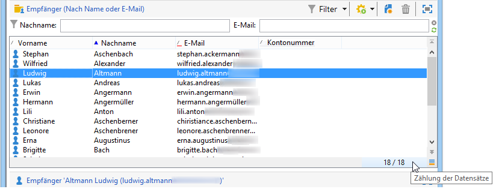
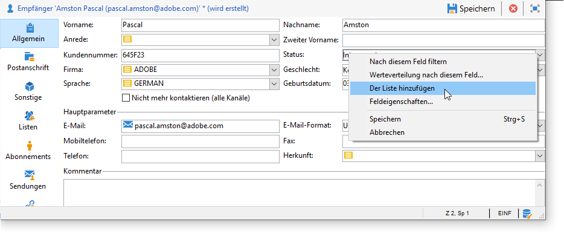
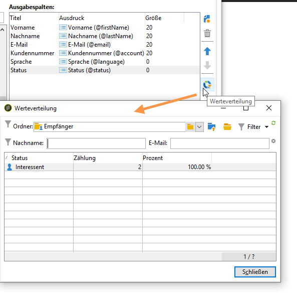
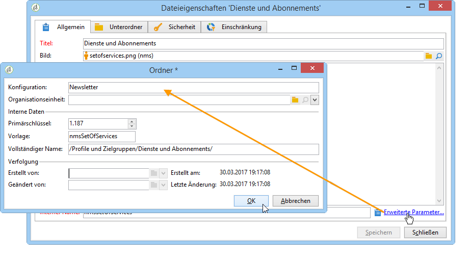
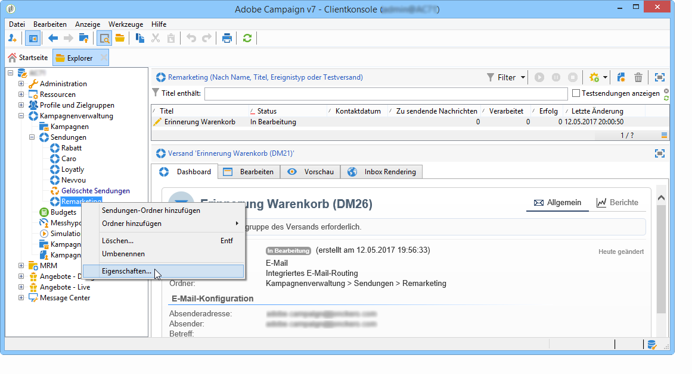

# Verwalten und Anpassen von Listen{#manage-and-customize-lists}

Sie können mit dem Explorer auf die Listen von Datensätzen in der Kampagnen-Datenbank zugreifen. Sie können diese Listen filtern, Suchvorgänge ausführen, Informationen hinzufügen, Daten filtern und sortieren.

## Datensätze zählen {#counting-records}

Standardmäßig lädt Adobe Campaign die 200 ersten Datensätze einer Liste in den Arbeitsspeicher. Dies bedeutet, dass eventuell nicht alle Datensätze einer Tabelle angezeigt werden. Sie haben die Möglichkeit, die Anzahl an Datensätzen einer Liste zu zählen und zusätzliche Datensätze in den Arbeitsspeicher zu laden.

Im rechten unteren Bereich der Listenanzeige zeigt ein **[!UICONTROL Zähler]** die Anzahl an geladenen Datensätzen sowie die Gesamt-Datensatzanzahl an (unter Berücksichtigung aller angewendeten Filter):

Wenn anstelle der Gesamtzahl ein &quot;**?**&quot; angezeigt wird, können Sie durch Klick auf das Feld die Gesamtzahl abrufen.

### Weitere Datensätze {#loading-more-records} laden

Verwenden Sie die Schaltfläche **[!UICONTROL Weiter laden]**, um mehr als die standardmäßigen 200 Datensätze zu laden (und anzuzeigen).

Klicken Sie zur Ladung aller Datensätze mit der rechten Maustaste auf die Liste und wählen Sie **[!UICONTROL Alles laden]**.

>[!CAUTION]
>
>Je nach der Anzahl der Datensätze kann das Laden der gesamten Liste relativ viel Zeit in Anspruch nehmen.

### Anzahl der standardmäßig geladenen Datensätze ändern {#change-default-number-of-records}

Verwenden Sie zur Änderung der Anzahl standardmäßig geladener Datensätze die Schaltfläche **[!UICONTROL Liste konfigurieren]** im rechten unteren Bereich der Listenanzeige.

Klicken Sie im Konfigurationsfenster der Liste auf **[!UICONTROL Erweiterte Parameter]** (unten links) und ändern Sie die Anzahl der abzurufenden Zeilen.

## Listen {#configuring-lists} konfigurieren

### Spalten hinzufügen {#add-columns}

Spalten können auf zwei verschiedene Arten zu einer Liste hinzugefügt werden.

Sie können ausgehend von der Detailansicht eines Datensatzes eine Spalte zu einer Liste hinzufügen. Gehen Sie dazu folgendermaßen vor:

1. Wählen Sie auf einer Detailseite mit der rechten Maustaste das Feld aus, das in einer Spalte dargestellt werden soll.
1. Wählen Sie **[!UICONTROL Der Liste hinzufügen]** aus.

   Die Spalte wird rechts von den bereits angezeigten Spalten hinzugefügt.

Eine weitere Möglichkeit zum Hinzufügen von Spalten besteht im Listenkonfigurationsfenster. Dies ist hilfreich, wenn Sie beispielsweise Daten anzeigen möchten, die nicht auf der Detailseite dargestellt werden. Gehen Sie dazu folgendermaßen vor:

1. Wählen Sie rechts unten von der Liste **[!UICONTROL Liste konfigurieren]** aus.

   

1. Durch Doppelklick auf ein Feld in der Liste **[!UICONTROL Verfügbare Felder]** wird dieses zu den **[!UICONTROL Ausgabespalten]** hinzugefügt.

   

   >[!NOTE]
   >
   >Erweiterte Felder werden standardmäßig nicht angezeigt. Verwenden Sie das Symbol **Erweiterte Felder anzeigen** im rechten unteren Bereich der Liste der verfügbaren Felder, um sie sichtbar zu machen.
   >
   >Die Titel werden nach Tabellen geordnet und innerhalb der Tabellen in alphabetischer Reihenfolge angezeigt.
   >
   >Mithilfe des Feldes **Suchen** können Sie die Auswahl der verfügbaren Felder einschränken. Weiterführende Informationen erfahren Sie in [diesem Abschnitt](#sorting-a-list).
   >
   >Die Art der Felder (SQL-Felder, verknüpfte Tabellen, berechnete Felder usw.) wird durch verschiedene Symbole verdeutlicht. Für das jeweils ausgewählte Feld wird unter der Liste der verfügbaren Felder die entsprechende Beschreibung angezeigt. [Weitere Informationen](#configuring-lists).
   >
   >Sie können außerdem Daten sortieren und filtern. Siehe [diesen Abschnitt](../../platform/using/filtering-options.md).

1. Wiederholen Sie diesen Vorgang für jede Spalte, die dargestellt werden soll.
1. Mithilfe der Pfeile können Sie die **Anzeigereihenfolge** der Spalten ändern. Das erste Feld in der Liste der Ausgabespalten entspricht der in der Datensatzliste ganz links gelegenen Spalte.

   

1. Durch Auswahl von **[!UICONTROL Werteverteilung]** können Sie die Werteverteilung für das ausgewählte Feld im aktuellen Ordner anzeigen.

   

1. Wählen Sie **[!UICONTROL OK]** aus, um die Konfigurationen zu bestätigen und das Ergebnis anzuzeigen.

### Neue Spalte erstellen {#create-a-new-column}

Sie können neue Spalten erstellen, um zusätzliche Felder in der Liste anzuzeigen. Gehen Sie dazu folgendermaßen vor:

1. Wählen Sie rechts unten von der Liste **[!UICONTROL Liste konfigurieren]** aus.
1. Wählen Sie **[!UICONTROL Hinzufügen]** aus, um die Ausgabespalten um ein weiteres Feld zu ergänzen.

### Spalte entfernen {#remove-a-column}

Über die Schaltfläche **[!UICONTROL Liste konfigurieren]** im rechten unteren Bereich der Listenansicht haben Sie die Möglichkeit, Spalten aus der Datensatzliste auszublenden.

Wählen Sie im Bereich der **[!UICONTROL Ausgabespalten]** des Listenkonfigurationsfensters die auszublendende Spalte aus und klicken Sie auf die Schaltfläche Löschen.

Wiederholen Sie dies für jede Spalte, die ausgeblendet werden soll, und klicken Sie auf **[!UICONTROL OK]**, um die Konfigurationen zu bestätigen und das Ergebnis anzuzeigen.

### Spaltenbreite anpassen {#adjust-column-width}

Bei aktiven Listen (d. h. mit mindestens einer ausgewählten Zeile) ermöglicht die F9-Taste die Anpassung der Spaltenbreite an die Bildschirmgröße, sodass alle Spalten angezeigt werden.

### Daten in Unterordnern {#display-sub-folders-records} anzeigen

Bei Listen stehen zwei verschiedene Anzeigemodi zur Verfügung:

* Anzeige der Datensätze nur des ausgewählten Ordners,
* Anzeige der Datensätze des ausgewählten Ordners und der Unterordner.

Klicken Sie auf **[!UICONTROL Unterordner anzeigen]** in der Symbolleiste, um zwischen den Anzeigemodi zu wechseln.

## Speichern einer Liste-Konfiguration {#saving-a-list-configuration}

Die Konfigurationen von Listen werden lokal auf Arbeitsplatzebene definiert. Wenn der lokale Cache geleert wird, werden die lokalen Konfigurationen deaktiviert.

Standardmäßig werden die definierten Anzeigeeinstellungen auf alle Listen mit identischem Ordnertyp angewendet. Wenn Sie also z. B. die Anzeige der Empfängerliste von einem Ordner ausgehend ändern, wird die Konfiguration auf alle anderen Empfängerordner übertragen.

Es ist jedoch möglich, verschiedene Konfigurationen zu speichern, um sie auf verschiedene Ordner des gleichen Typs anzuwenden. Die Konfiguration wird in den Ordnereigenschaften gespeichert und kann wiederverwendet werden.

Für einen Versandordner lässt sich z. B. folgende Anzeige konfigurieren:

Gehen Sie folgendermaßen vor, um diese Listenkonfiguration zu speichern, damit sie wiederverwendet werden kann:

1. Wählen Sie mit der rechten Maustaste den Ordner aus, der die angezeigten Daten enthält.
1. Wählen Sie **[!UICONTROL Eigenschaften]** aus.
1. Wählen Sie **[!UICONTROL Erweiterte Parameter]** aus und geben Sie im Feld **[!UICONTROL Konfiguration]** einen Namen ein.

   

1. Wählen Sie **[!UICONTROL OK]** und danach **[!UICONTROL Speichern]** aus.

Anschließend kann diese Konfiguration auf einen anderen Ordner vom Typ **Versand** angewendet werden:

Wählen Sie im Fenster der Ordnereigenschaften **[!UICONTROL Speichern]** aus, um die Listenanzeige der angegebenen Konfiguration entsprechend anzupassen:

## Eine Liste {#exporting-a-list} exportieren

Zum Export von Listendaten steht Ihnen der Export-Assistent zur Verfügung. Markieren Sie die zu exportierenden Datensätze und klicken Sie mit der rechten Maustaste auf die Liste. Wählen Sie dann im Kontextmenü die Option **[!UICONTROL Exportieren...]**.

Die Verwendung der Import- und Exportfunktionen wird unter [Allgemeine Importe und Exporte](../../platform/using/about-generic-imports-exports.md) erläutert.

>[!CAUTION]
>
>Listenelemente dürfen nicht mithilfe der Kopieren/Einfügen-Funktion exportiert werden.

## Sortieren einer Liste {#sorting-a-list}

Listen enthalten oft große Datenmengen, die sortiert und mit einfachen oder erweiterten Filtern eingeschränkt werden können. Während die Sortierung eine Anzeige aller Datensätze in steigender oder fallender Reihenfolge nach sich zieht, wird durch Anwendung von Filtern unter Kombination verschiedener Kriterien die Auswahl der anzuzeigenden Datensätze eingeschränkt.

Durch die Auswahl eines Spaltentitels werden die Daten aufsteigend oder absteigend sortiert oder die Sortierung aufgehoben. Ein blauer Pfeil vor dem Spaltentitel zeigt an, dass nach dieser Spalte sortiert wurde und ob es sich um eine auf- oder absteigende Sortierung handelt. Ein roter Unterstrich bedeutet, dass die Sortierung sich auf in der Datenbank indizierte Daten bezieht. Dieser Sortiermodus trägt zur Optimierung der Sortiervorgänge bei.

Sie können die Sortierung konfigurieren oder Sortierkriterien kombinieren. Gehen Sie dazu folgendermaßen vor:

1. Wählen Sie rechts unten von der Liste **[!UICONTROL Liste konfigurieren]** aus.

   

1. Wählen Sie im Listenkonfigurationsfenster den Tab **[!UICONTROL Sortierung]** aus.
1. Wählen Sie die zu sortierenden Felder und die Sortierrichtung aus (auf- oder absteigend).

   

1. Die Priorität der Sortierkriterien hängt von der Reihenfolge der Sortierungsspalten ab. Diese Reihenfolge kann mithilfe der Pfeile rechts in der Symbolleiste angepasst werden.

   

   Die Anzeige der Spalten in der Liste ist unabhängig von der Priorität der Sortierkriterien.

1. Wählen Sie **[!UICONTROL OK]** aus, um die Einstellungen zu bestätigen und das Ergebnis anzuzeigen.

### Suchen nach Elementen {#running-a-search}

In Editoren haben Sie die Möglichkeit, mithilfe des **[!UICONTROL Suchen]**-Feldes die Auswahl der verfügbaren Felder einzuschränken. Mit der **Enter**-Taste können Sie die Liste durchsuchen. Die Ihrem Suchkriterium entsprechenden Felder erscheinen fettgedruckt.

>[!NOTE]
>
>Es ist möglich, Filter zu erstellen, um nur gewisse Daten innerhalb einer Liste anzuzeigen. [Weitere Informationen](../../platform/using/creating-filters.md).
