# Adobe Campaign-Arbeitsbereich{#adobe-campaign-workspace}

## Über die Benutzeroberfläche von Adobe Campaign {#about-adobe-campaign-interface}

Nach Herstellung der Datenbankverbindung gelangen Sie auf die Startseite von Adobe Campaign. Diese ist wie ein Dashboard gestaltet und besteht aus Links und Verknüpfungen, die Ihnen je nach Installation den Zugriff auf Funktionen und die allgemeinen Konfigurationselemente der Plattform erlauben.

In der Mitte des Fensters haben Sie die Möglichkeit, auf die Online-Dokumentation, das Forum und die Webseite des Supports zuzugreifen.

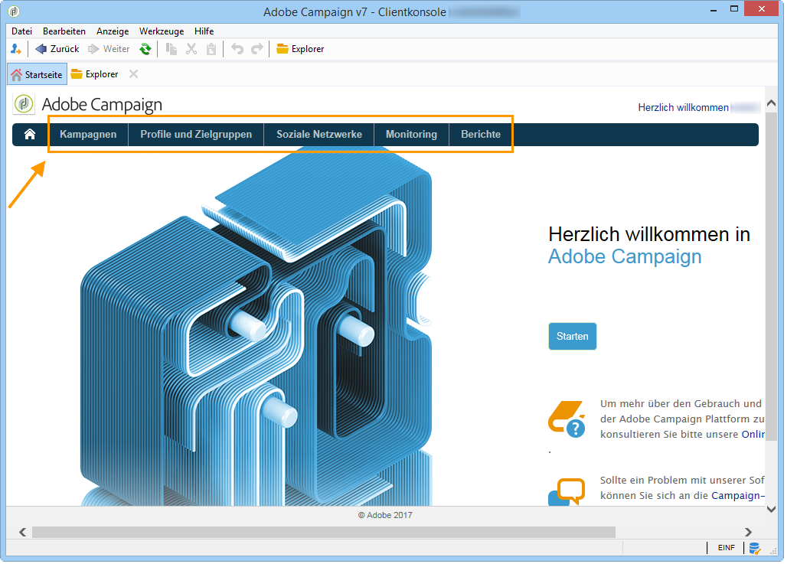

 [Campaign-Arbeitsbereich im Video kennenlernen](https://docs.adobe.com/content/help/de-DE/campaign-classic-learn/tutorials/getting-started/exploring-the-adobe-campaign-classic-user-interface.html)

>[!NOTE]
>
>Die in Ihrer Instanz verfügbaren Adobe-Campaign-Funktionen hängen von den installierten Modulen und Add-ons ab. Je nach Ihren Berechtigungen und Konfigurationen sind manche möglicherweise nicht verfügbar.
>
>Prüfen Sie Ihren Lizenzvertrag oder kontaktieren Sie Ihren Adobe-Kundenbetreuer, bevor Sie Module oder Add-ons installieren.

### Zugriff über Clientkonsole versus Webzugriff {#console-and-web-access}

Auf die Adobe-Campaign-Plattform kann entweder über eine Clientkonsole oder über einen Webbrowser zugegriffen werden.

Der Webzugriff bietet eine der Clientkonsole ähnliche Bedieneroberfläche mit eingeschränkten Funktionalitäten.

So wird z. B. für einen Benutzer eine Kampagne in der Clientkonsole mit folgenden Optionen angezeigt:

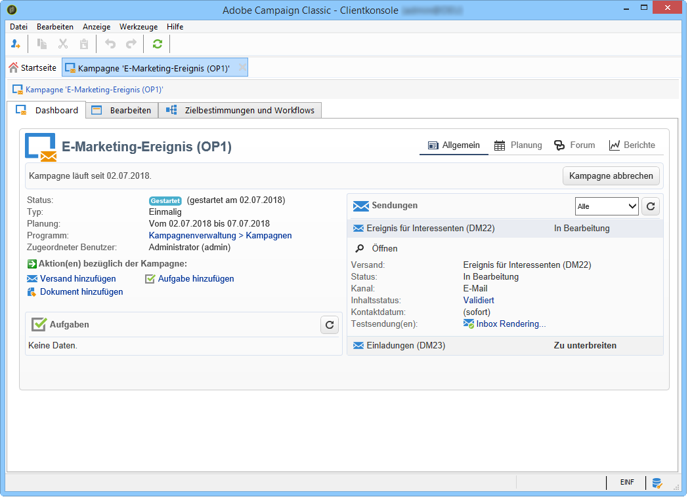

Im Webzugriff hingegen stehen vorwiegend konsultative Optionen zur Verfügung:

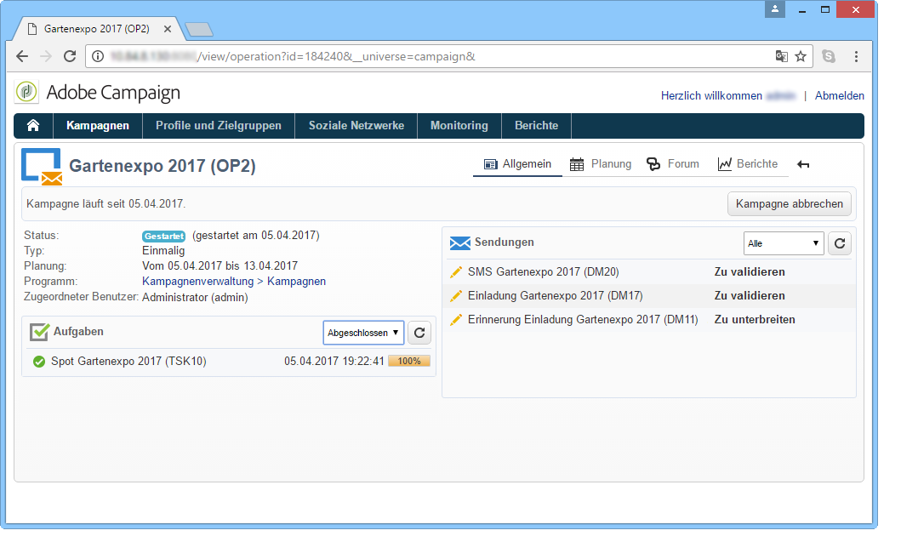

### Sprachen {#languages}

Die Sprache wird bei der Installation der Adobe Campaign Classic-Instanz ausgewählt.

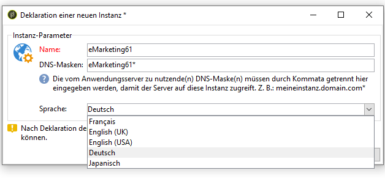

Sie können zwischen fünf verschiedenen Sprachen wählen:

* Englisch (UK)
* Englisch (US)
* Französisch
* Deutsch
* Japanisch

Die für Ihre Adobe Campaign Classic-Instanz ausgewählte Sprache kann sich auf Datums- und Uhrzeitformate auswirken. Weiterführende Informationen hierzu finden Sie in diesem [Abschnitt](../../platform/using/adobe-campaign-workspace.md#date-and-time).

Weiterführende Informationen zum Erstellen einer Instanz finden Sie auf dieser [Seite](../../installation/using/creating-an-instance-and-logging-on.md).

>[!CAUTION]
>
>Die Sprache kann nach der Instanzerstellung nicht mehr geändert werden.

## Navigationsprinzipien {#navigation-basics}

### Auf Seiten navigieren {#browsing-pages}

Die Funktionen der Plattform sind in verschiedene Rubriken unterteilt. Verwenden Sie die Links im oberen Bereich der Bedieneroberfläche, um darauf zuzugreifen.

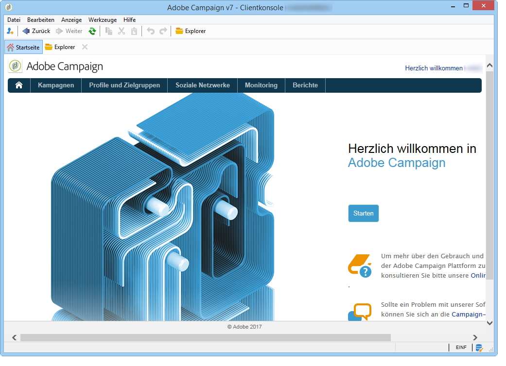

Die Liste der Rubriken hängt von den installierten Packages und Add-ons sowie den Zugriffsberechtigungen des aktuellen Benutzers ab.

Jede Rubrik enthält eine Reihe von Funktionen, die dem Benutzerkontext und den spezifischen Bedürfnissen entsprechend angeordnet wurden. So haben Sie z. B. in der Rubrik **[!UICONTROL Profile und Zielgruppen]** Zugriff auf Empfängerlisten, Abonnements, existierende Zielgruppen-Workflows sowie auf Verknüpfungen zur Elementerstellung.

Listen z. B. sind somit über den Link **[!UICONTROL Listen]** verfügbar, der sich auf der linken Seite des Fensters **[!UICONTROL Profile und Zielgruppen]** befindet.

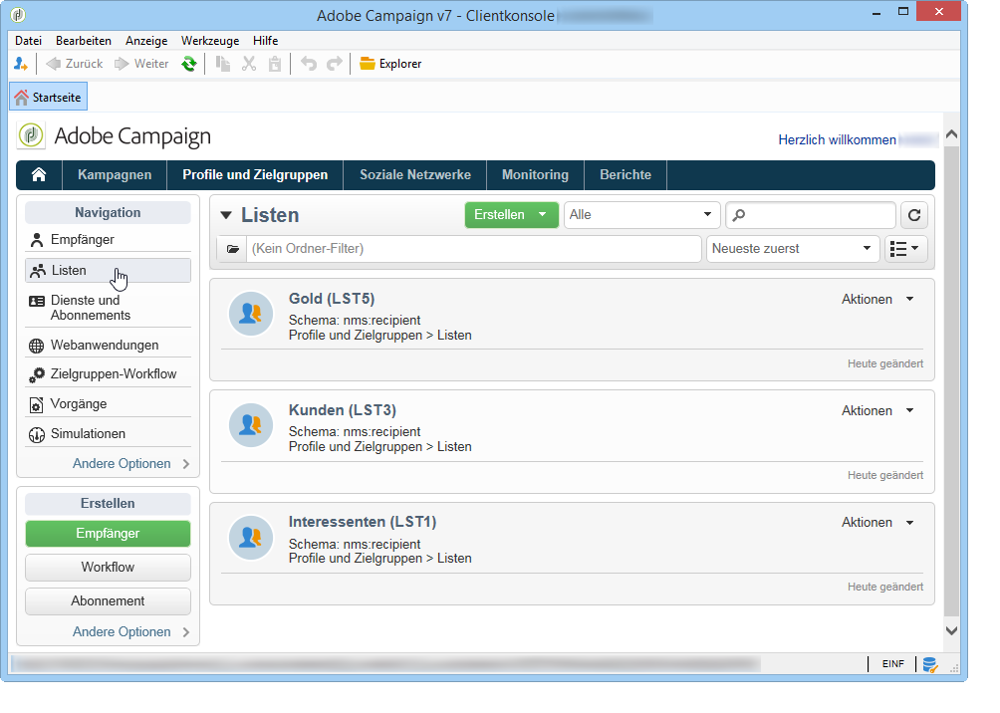

### Tabs verwenden {#using-tabs}

* Wenn Sie eine Rubrik oder einen Link auswählen, ersetzt die aufgerufene Seite die aktuelle. Mithilfe der Schaltflächen **[!UICONTROL Zurück]** und **[!UICONTROL Startseite]** können Sie zum Ausgangspunkt zurückkehren.

   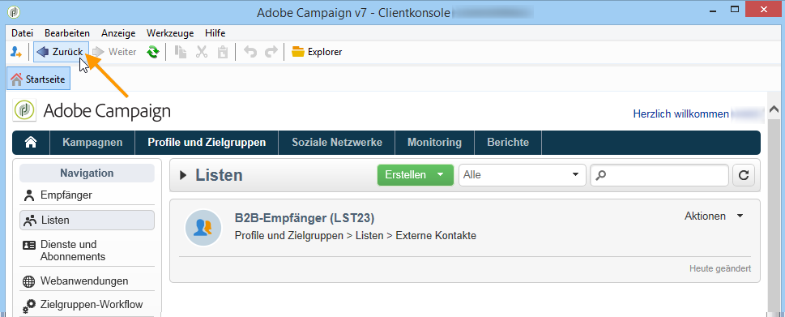

* Bei der Auswahl eines Menüs oder einer Verknüpfung mit einer Webanwendung, einem Programm, einem Versand, einem Bericht o. Ä. öffnet sich die Seite in einem neuen Tab. Dies ermöglicht das Wechseln zwischen verschiedenen Ansichten durch die Auswahl des entsprechenden Tabs.

   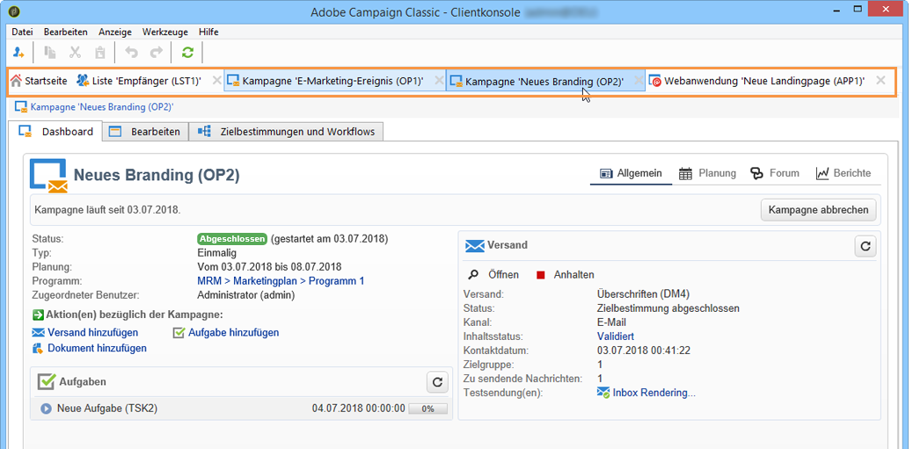

### Element erstellen {#creating-an-element}

In jeder Rubrik können Sie sich innerhalb der verschiedenen Elemente bewegen. Nutzen Sie hierzu die im Abschnitt **[!UICONTROL Navigation]** zur Verfügung stehenden Verknüpfungen. Der Link **[!UICONTROL Andere Optionen]** erlaubt den Zugriff auf alle anderen Seiten, unabhängig von der aktuellen Rubrik.

Neue Elemente (Versand, Webanwendung, Workflow etc.) können über die im Abschnitt **[!UICONTROL Erstellen]** angebotenen Verknüpfungen angelegt werden. Die Schaltfläche **[!UICONTROL Erstellen]** rechts oberhalb der Liste erlaubt das Hinzufügen eines neuen Listenelements.

Nutzen Sie beispielsweise auf der Seite der Sendungen die Schaltfläche **[!UICONTROL Erstellen]**, um einen neuen Versand anzulegen.

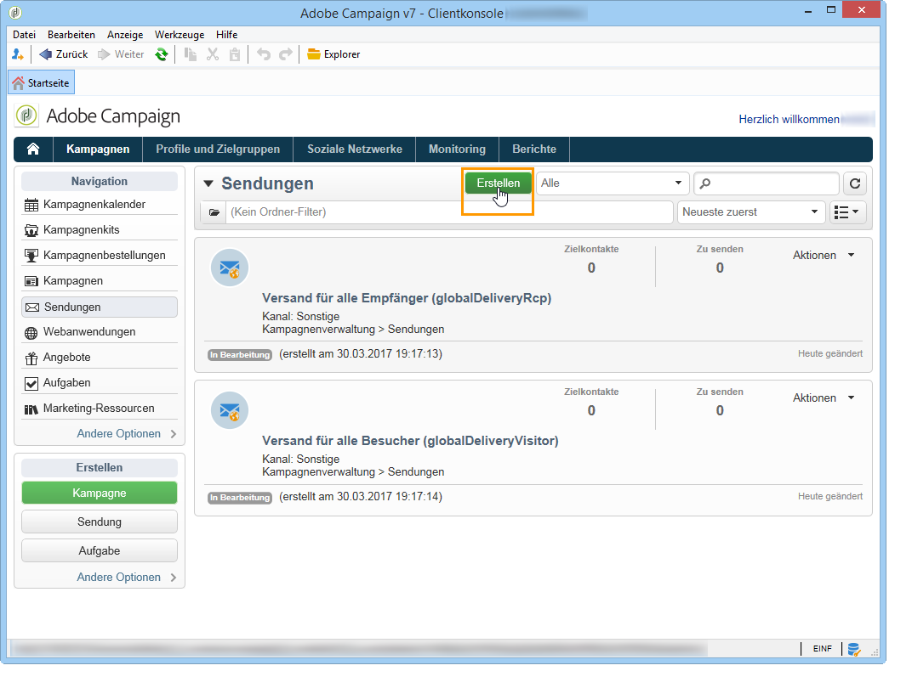

## Adobe-Campaign-Explorer verwenden {#using-adobe-campaign-explorer}

### Über den Adobe-Campaign-Explorer {#about-adobe-campaign-explorer}

Auf den Adobe-Campaign-Explorer kann über das entsprechende Symbol in der Symbolleiste zugegriffen werden. Mit seiner Hilfe gelangen Sie zu allen Adobe-Campaign-Funktionen und in die verschiedenen Konfigurationsbildschirme der Adobe-Campaign-Plattform. Darüber hinaus bietet er eine detaillierte Ansicht gewisser Elemente.

Die **[!UICONTROL Explorer]**-Ansicht ist in drei Bereiche unterteilt:

**1 - Navigationsbaum**: Sie können den Inhalt des Navigationsbaums Ihren Bedürfnissen anpassen (Knoten hinzufügen, verschieben, löschen). Diese Konfigurationsoption sollte erfahrenen Benutzern vorbehalten bleiben. Lesen Sie diesbezüglich auch [diese Seite](../../configuration/using/about-navigation-hierarchy.md).

**2 - Liste**: Sie können die angezeigten Listen filtern und sortieren, in ihnen suchen sowie die Spaltenanzeige je nach Bedarf gestalten.

**3 - Details**: Sie können Details des ausgewählten Elements anzeigen. Das Symbol rechts in der Titelzeile vergrößert die Anzeige zum Vollbildschirm.

### Bildschirmauflösung {#screen-resolution}

Adobe empfiehlt für optimale Navigation und Nutzung eine Bildschirmauflösung von mindestens 1600 x 900 Pixel.

>[!CAUTION]
>
>Auflösungen unter 1600 x 900 Pixel werden möglicherweise nicht von Adobe Campaign unterstützt.

Wenn im **[!UICONTROL Explorer]** einige Teile des Bereichs **[!UICONTROL Details]** abgeschnitten sind, erweitern Sie diesen mit dem Pfeil am oberen Rand des Bereichs oder klicken Sie auf die Schaltfläche **[!UICONTROL Vergrößern]**.

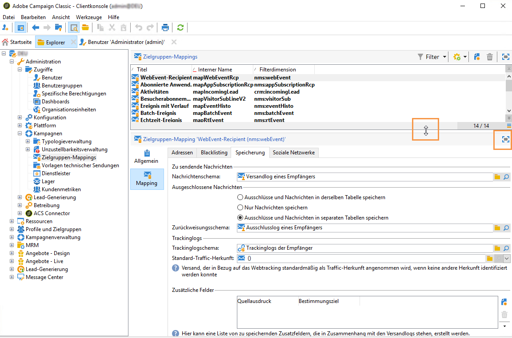

### In Listen navigieren {#browsing-lists}

Um sich innerhalb einer Liste zu bewegen, können Sie sich der horizontalen und vertikalen **Bildlaufleisten** bedienen. So können Sie die Liste ansehen, ohne den ausgewählten Datensatz zu wechseln. Weitere Möglichkeiten sind das **Maus-Scrollrad** und die **Tastaturpfeile**.

>[!NOTE]
>
>Konfiguration und Anpassung des Listeninhalts werden im Abschnitt [Listen konfigurieren](#configuring-lists) beschrieben.
>
>Sie können außerdem Daten sortieren und filtern. Siehe [Filteroptionen](../../platform/using/filtering-options.md).

### Datensätze zählen {#counting-records}

Standardmäßig lädt Adobe Campaign die 200 ersten Datensätze einer Liste in den Arbeitsspeicher. Dies bedeutet, dass eventuell nicht alle Datensätze einer Tabelle angezeigt werden. Sie haben die Möglichkeit, die Anzahl an Datensätzen einer Liste zu zählen und zusätzliche Datensätze in den Arbeitsspeicher zu laden.

Im rechten unteren Bereich der Listenanzeige zeigt ein **[!UICONTROL Zähler]** die Anzahl an geladenen Datensätzen sowie die Gesamt-Datensatzanzahl an (unter Berücksichtigung aller angewendeten Filter):

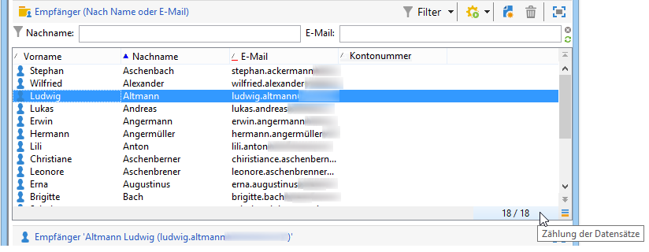

Wenn anstelle der Gesamtzahl ein &quot;**?**&quot; angezeigt wird, können Sie durch Klick auf das Feld die Gesamtzahl abrufen.

### Weitere Datensätze in den Arbeitsspeicher laden {#loading-more-records}

Verwenden Sie die Schaltfläche **[!UICONTROL Weiter laden]**, um mehr als die standardmäßigen 200 Datensätze zu laden (und anzuzeigen).

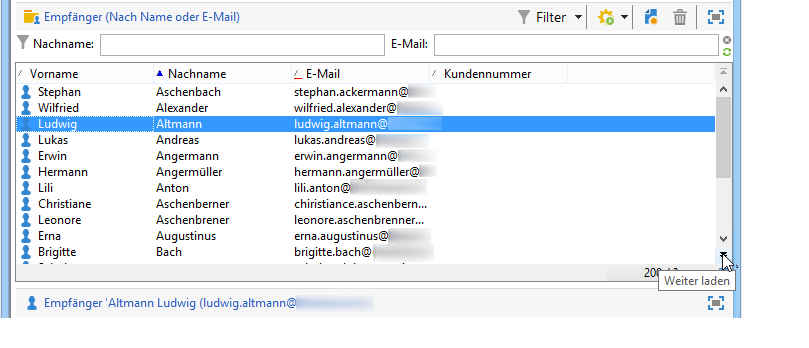

Klicken Sie zur Ladung aller Datensätze mit der rechten Maustaste auf die Liste und wählen Sie **[!UICONTROL Alles laden]**.

>[!CAUTION]
>
>Je nach der Anzahl der Datensätze kann das Laden der gesamten Liste relativ viel Zeit in Anspruch nehmen.

### Anzahl der standardmäßig geladenen Datensätze ändern {#change-default-number-of-records}

Verwenden Sie zur Änderung der Anzahl standardmäßig geladener Datensätze die Schaltfläche **[!UICONTROL Liste konfigurieren]** im rechten unteren Bereich der Listenanzeige.

Im Listenkonfigurationsfenster können Sie dann durch Klick auf den Link &quot;Erweiterte Parameter&quot; (unten links) die Anzahl der abzurufenden Zeilen ändern.

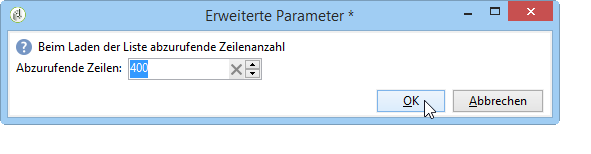

## Listen konfigurieren {#configuring-lists}

### Spalten hinzufügen {#add-columns}

Spalten können auf zwei verschiedene Arten zu einer Liste hinzugefügt werden.

Sie können ausgehend von der Detailansicht eines Datensatzes eine Spalte zu einer Liste hinzufügen. Gehen Sie dazu folgendermaßen vor:

1. Wählen Sie auf einer Detailseite mit der rechten Maustaste das Feld aus, das in einer Spalte dargestellt werden soll.
1. Wählen Sie **[!UICONTROL Der Liste hinzufügen]** aus.

   Die Spalte wird rechts von den bereits angezeigten Spalten hinzugefügt.

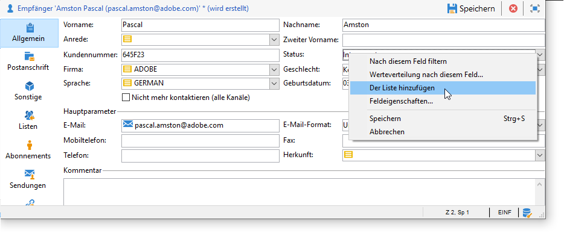

Eine weitere Möglichkeit zum Hinzufügen von Spalten besteht im Listenkonfigurationsfenster. Dies ist hilfreich, wenn Sie beispielsweise Daten anzeigen möchten, die nicht auf der Detailseite dargestellt werden. Gehen Sie dazu folgendermaßen vor:

1. Wählen Sie rechts unten von der Liste **[!UICONTROL Liste konfigurieren]** aus.

   

1. Durch Doppelklick auf ein Feld in der Liste **[!UICONTROL Verfügbare Felder]** wird dieses zu den **[!UICONTROL Ausgabespalten]** hinzugefügt.

   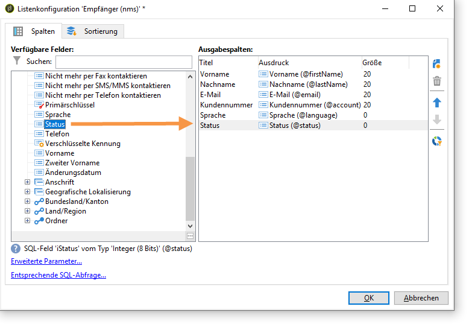

   >[!NOTE]
   >
   >Erweiterte Felder werden standardmäßig nicht angezeigt. Verwenden Sie das Symbol **Erweiterte Felder anzeigen** im rechten unteren Bereich der Liste der verfügbaren Felder, um sie sichtbar zu machen.
   >
   >Die Titel werden nach Tabellen geordnet und innerhalb der Tabellen in alphabetischer Reihenfolge angezeigt.
   >
   >Mithilfe des Feldes **Suchen** können Sie die Auswahl der verfügbaren Felder einschränken. Weiterführende Informationen finden Sie unter [Listen sortieren](#sorting-a-list).
   >
   >Die Art der Felder (SQL-Felder, verknüpfte Tabellen, berechnete Felder usw.) wird durch verschiedene Symbole verdeutlicht. Für das jeweils ausgewählte Feld wird unter der Liste der verfügbaren Felder die entsprechende Beschreibung angezeigt. [Listen konfigurieren](#configuring-lists).
   >
   >Sie können außerdem Daten sortieren und filtern. Siehe [Filteroptionen](../../platform/using/filtering-options.md).

1. Wiederholen Sie diesen Vorgang für jede Spalte, die dargestellt werden soll.
1. Mithilfe der Pfeile können Sie die **Anzeigereihenfolge** der Spalten ändern. Das erste Feld in der Liste der Ausgabespalten entspricht der in der Datensatzliste ganz links gelegenen Spalte.

   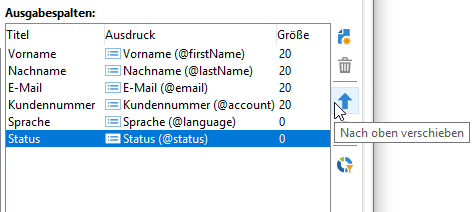

1. Durch Auswahl von **[!UICONTROL Werteverteilung]** können Sie die Werteverteilung für das ausgewählte Feld im aktuellen Ordner anzeigen.

   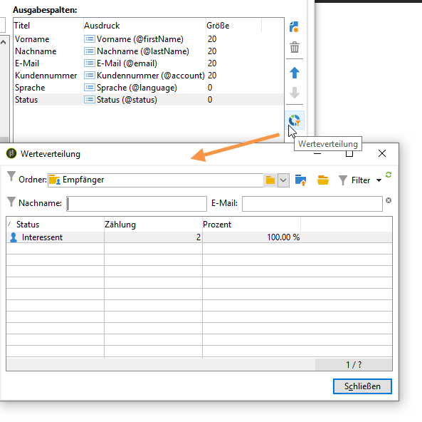

1. Wählen Sie **[!UICONTROL OK]** aus, um die Konfigurationen zu bestätigen und das Ergebnis anzuzeigen.

### Neue Spalte erstellen {#create-a-new-column}

Sie können neue Spalten erstellen, um zusätzliche Felder in der Liste anzuzeigen. Gehen Sie dazu folgendermaßen vor:

1. Wählen Sie rechts unten von der Liste **[!UICONTROL Liste konfigurieren]** aus.
1. Wählen Sie **[!UICONTROL Hinzufügen]** aus, um die Ausgabespalten um ein weiteres Feld zu ergänzen.

### Spalte entfernen {#remove-a-column}

Über die Schaltfläche **[!UICONTROL Liste konfigurieren]** im rechten unteren Bereich der Listenansicht haben Sie die Möglichkeit, Spalten aus der Datensatzliste auszublenden.

Wählen Sie im Bereich der **[!UICONTROL Ausgabespalten]** des Listenkonfigurationsfensters die auszublendende Spalte aus und klicken Sie auf die Schaltfläche Löschen.

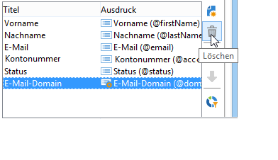

Wiederholen Sie dies für jede Spalte, die ausgeblendet werden soll, und klicken Sie auf **[!UICONTROL OK]**, um die Konfigurationen zu bestätigen und das Ergebnis anzuzeigen.

### Spaltenbreite anpassen {#adjust-column-width}

Bei aktiven Listen (d. h. mit mindestens einer ausgewählten Zeile) ermöglicht die F9-Taste die Anpassung der Spaltenbreite an die Bildschirmgröße, sodass alle Spalten angezeigt werden.

### Datensätze in Unterordnern anzeigen {#display-sub-folders-records}

Bei Listen stehen zwei verschiedene Anzeigemodi zur Verfügung:

* Anzeige der Datensätze nur des ausgewählten Ordners,
* Anzeige der Datensätze des ausgewählten Ordners und der Unterordner.

Klicken Sie auf **[!UICONTROL Unterordner anzeigen]** in der Symbolleiste, um zwischen den Anzeigemodi zu wechseln.

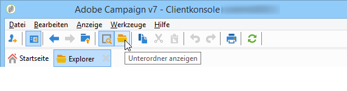

### Konfiguration einer Liste speichern {#saving-a-list-configuration}

Die Konfigurationen von Listen werden lokal auf Arbeitsplatzebene definiert. Wenn der lokale Cache geleert wird, werden die lokalen Konfigurationen deaktiviert.

Standardmäßig werden die definierten Anzeigeeinstellungen auf alle Listen mit identischem Ordnertyp angewendet. Wenn Sie also z. B. die Anzeige der Empfängerliste von einem Ordner ausgehend ändern, wird die Konfiguration auf alle anderen Empfängerordner übertragen.

Es ist jedoch möglich, verschiedene Konfigurationen zu speichern, um sie auf verschiedene Ordner des gleichen Typs anzuwenden. Die Konfiguration wird in den Ordnereigenschaften gespeichert und kann wiederverwendet werden.

Für einen Versandordner lässt sich z. B. folgende Anzeige konfigurieren:

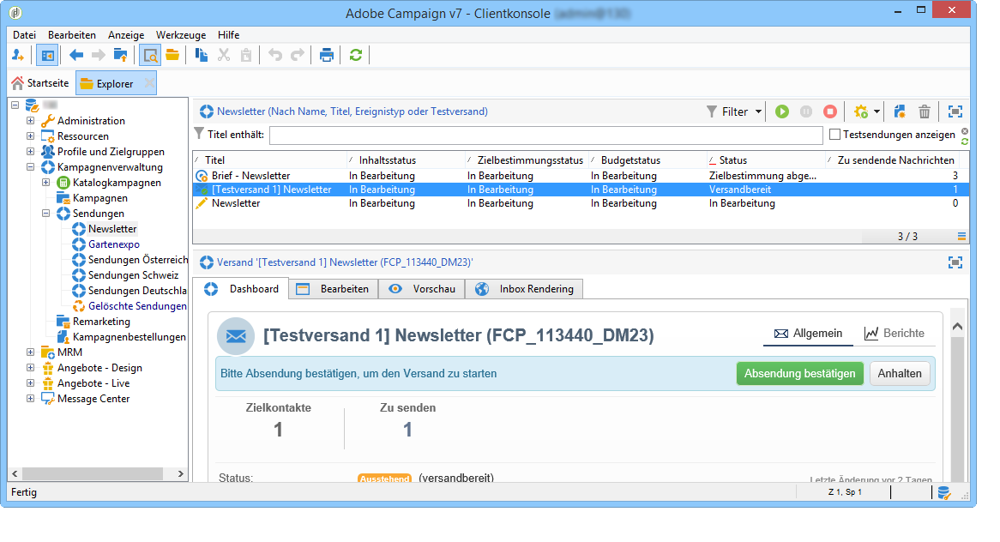

Gehen Sie folgendermaßen vor, um diese Listenkonfiguration zu speichern, damit sie wiederverwendet werden kann:

1. Wählen Sie mit der rechten Maustaste den Ordner aus, der die angezeigten Daten enthält.
1. Wählen Sie **[!UICONTROL Eigenschaften]** aus.
1. Wählen Sie **[!UICONTROL Erweiterte Parameter]** aus und geben Sie im Feld **[!UICONTROL Konfiguration]** einen Namen ein.

   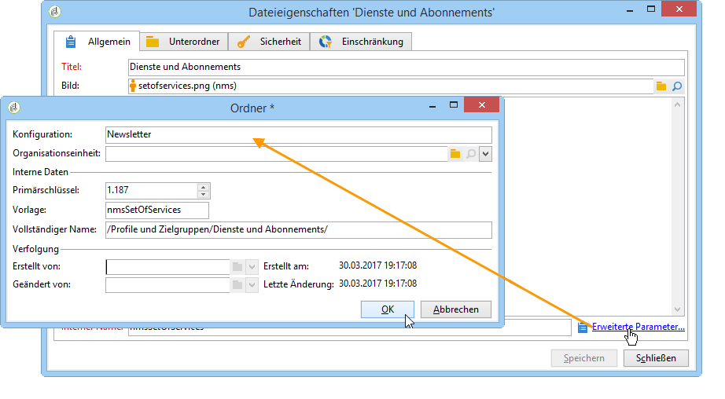

1. Wählen Sie **[!UICONTROL OK]** und danach **[!UICONTROL Speichern]** aus.

Anschließend kann diese Konfiguration auf einen anderen Ordner vom Typ **Versand** angewendet werden:

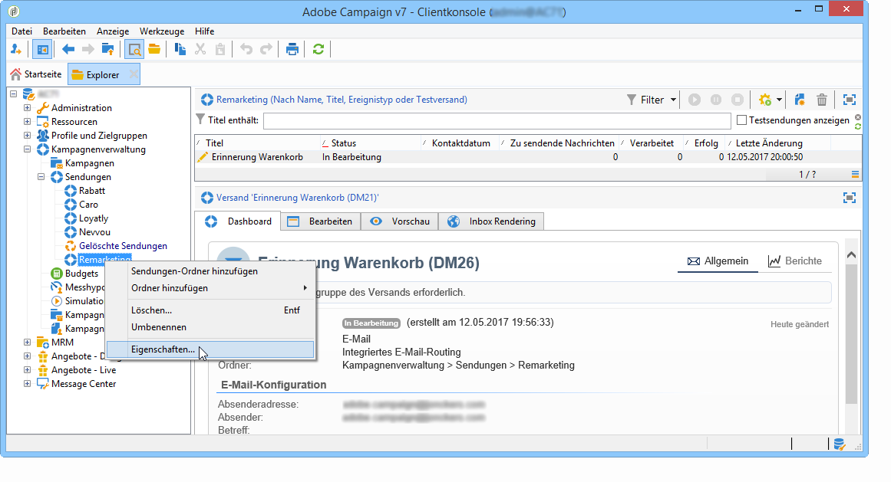

Wählen Sie im Fenster der Ordnereigenschaften **[!UICONTROL Speichern]** aus, um die Listenanzeige der angegebenen Konfiguration entsprechend anzupassen:

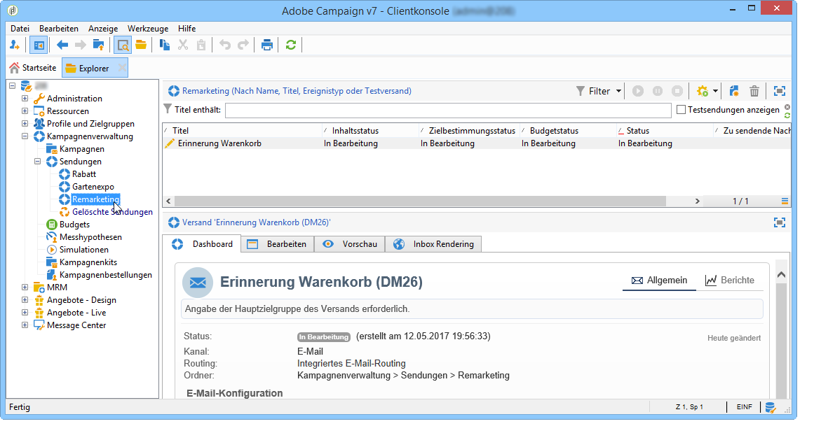

## Listen exportieren {#exporting-a-list}

Zum Export von Listendaten steht Ihnen der Export-Assistent zur Verfügung. Markieren Sie die zu exportierenden Datensätze und klicken Sie mit der rechten Maustaste auf die Liste. Wählen Sie dann im Kontextmenü die Option **[!UICONTROL Exportieren...]**.

Die Verwendung der Import- und Exportfunktionen wird unter [Allgemeine Importe und Exporte](../../platform/using/generic-imports-and-exports.md) erläutert.

>[!CAUTION]
>
>Listenelemente dürfen nicht mithilfe der Kopieren/Einfügen-Funktion exportiert werden.

## Listen sortieren {#sorting-a-list}

Listen enthalten oft große Datenmengen, die sortiert und mit einfachen oder erweiterten Filtern eingeschränkt werden können. Während die Sortierung eine Anzeige aller Datensätze in steigender oder fallender Reihenfolge nach sich zieht, wird durch Anwendung von Filtern unter Kombination verschiedener Kriterien die Auswahl der anzuzeigenden Datensätze eingeschränkt.

Durch die Auswahl eines Spaltentitels werden die Daten aufsteigend oder absteigend sortiert oder die Sortierung aufgehoben. Ein blauer Pfeil vor dem Spaltentitel zeigt an, dass nach dieser Spalte sortiert wurde und ob es sich um eine auf- oder absteigende Sortierung handelt. Ein roter Unterstrich bedeutet, dass die Sortierung sich auf in der Datenbank indizierte Daten bezieht. Dieser Sortiermodus trägt zur Optimierung der Sortiervorgänge bei.

Sie können die Sortierung konfigurieren oder Sortierkriterien kombinieren. Gehen Sie dazu folgendermaßen vor:

1. Wählen Sie rechts unten von der Liste **[!UICONTROL Liste konfigurieren]** aus.

   

1. Wählen Sie im Listenkonfigurationsfenster den Tab **[!UICONTROL Sortierung]** aus.
1. Wählen Sie die zu sortierenden Felder und die Sortierrichtung aus (auf- oder absteigend).

   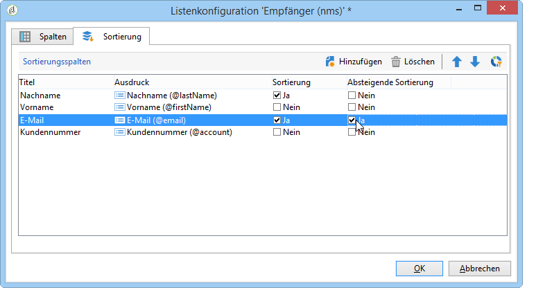

1. Die Priorität der Sortierkriterien hängt von der Reihenfolge der Sortierungsspalten ab. Diese Reihenfolge kann mithilfe der Pfeile rechts in der Symbolleiste angepasst werden.

   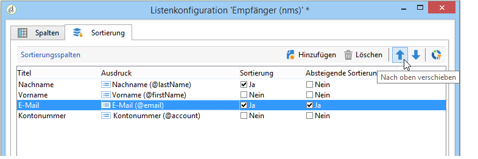

   Die Anzeige der Spalten in der Liste ist unabhängig von der Priorität der Sortierkriterien.

1. Wählen Sie **[!UICONTROL OK]** aus, um die Einstellungen zu bestätigen und das Ergebnis anzuzeigen.

### Suchen nach Elementen {#running-a-search}

In Editoren haben Sie die Möglichkeit, mithilfe des **[!UICONTROL Suchen]**-Feldes die Auswahl der verfügbaren Felder einzuschränken. Mit der **Enter**-Taste können Sie die Liste durchsuchen. Die Ihrem Suchkriterium entsprechenden Felder erscheinen fettgedruckt.

>[!NOTE]
>
>Es ist möglich, Filter zu erstellen, um nur gewisse Daten innerhalb einer Liste anzuzeigen. Siehe [Filter erstellen](../../platform/using/creating-filters.md).

## Formate und Einheiten {#formats-and-units}

### Datum und Uhrzeit {#date-and-time}

Die Sprache Ihrer Adobe-Campaign-Classic-Instanz hat Auswirkungen auf das Format von Datum und Uhrzeit.

Die Sprache wird während der Installation von Campaign ausgewählt und kann danach nicht mehr geändert werden. Zur Auswahl stehen: Englisch (US), Englisch (EN), Französisch, Deutsch oder Japanisch. Weiterführende Informationen dazu finden Sie auf [dieser Seite](../../installation/using/creating-an-instance-and-logging-on.md).

Die Hauptunterschiede zwischen US-amerikanischem Englisch und britischem Englisch sind:

<table> 
 <thead> 
  <tr> 
   <th> Formate  </th> 
   <th> Englisch (US)  </th> 
   <th> Englisch (EN)  </th> 
  </tr> 
 </thead> 
 <tbody> 
  <tr> 
   <td> Datum  </td> 
   <td> Woche beginnt am Sonntag  </td> 
   <td> Woche beginnt am Montag  </td> 
  </tr> 
  <tr> 
   <td> Kurzform des Datums  </td> 
   <td> 
%2M/%2D/%4Y

<strong>z. B.: 09/25/2018</strong>
 </td> 
   <td> 
%2D/%2M/%4Y

<strong>z. B.: 25/09/2018</strong>
 </td> 
  </tr> 
  <tr> 
   <td> Kurzform des Datums mit Uhrzeit  </td> 
   <td> 
%2M/%2D/%4Y %I:%2N:%2S %P

<strong>z. B.: 09/25/2018 10:47:25 PM</strong>
 </td> 
   <td> 
%2D/%2M/%4Y %2H:%2N:%2S

<strong>z. B.: 25/09/2018 22:47:25</strong>
 </td> 
  </tr> 
 </tbody> 
</table>

### Werte in einer Auflistung hinzufügen {#add-values-in-an-enumeration}

Die Eingabefelder in Dropdown-Listen ermöglichen die Angabe eines Auflistungswerts, der zur weiteren Verwendung gespeichert werden kann. Wenn Sie z. B. im Feld **[!UICONTROL Ort]** im Tab **[!UICONTROL Allgemein]** eines Empfängerprofils &quot;Berlin&quot; eingeben und auf Enter drücken, werden Sie gefragt, ob Sie diesen Wert zu der dem Feld entsprechenden Auflistung hinzufügen möchten.

Wenn Sie auf **[!UICONTROL Ja]** klicken, erscheint der Wert zukünftig in der Dropdown-Liste des entsprechenden Feldes. (Hier: **[!UICONTROL Ort]**).

>[!NOTE]
>
>Auflistungen werden vom Administrator im Bereich **[!UICONTROL Administration > Plattform > Auflistungen]** verwaltet. Weitere Informationen hierzu finden Sie im Abschnitt [Auflistungen verwalten](../../platform/using/managing-enumerations.md).

### Standardeinheiten {#default-units}

In Feldern, die eine Dauer bezeichnen (z. B. Gültigkeit von Versandressourcen, Validierungszeitraum einer Aufgabe etc.), sind verschiedene **Einheiten** möglich:

* **[!UICONTROL s]** für Sekunden,
* **[!UICONTROL min]** für Minuten,
* **[!UICONTROL h]** für Stunden,
* **[!UICONTROL T]** für Tage.

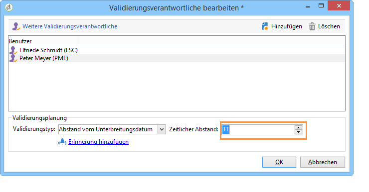
