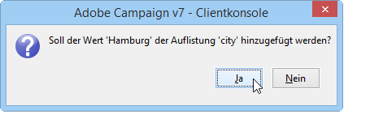

# Adobe Campaign-Arbeitsbereich{#adobe-campaign-workspace}

## Über die Benutzeroberfläche von Adobe Campaign {#about-adobe-campaign-interface}

Nach Herstellung der Datenbankverbindung gelangen Sie auf die Startseite von Adobe Campaign. Diese ist wie ein Dashboard gestaltet und besteht aus Links und Verknüpfungen, die Ihnen je nach Installation den Zugriff auf Funktionen und die allgemeinen Konfigurationselemente der Plattform erlauben.

In der Mitte des Fensters haben Sie die Möglichkeit, auf die Online-Dokumentation, das Forum und die Webseite des Supports zuzugreifen.

[ Campaign-Arbeitsbereich im Video kennenlernen](#video)

>[!NOTE]
>
>Die in Ihrer Instanz verfügbaren Adobe-Campaign-Funktionen hängen von den installierten Modulen und Add-ons ab. Je nach Ihren Berechtigungen und Konfigurationen sind manche möglicherweise nicht verfügbar.
>
>Prüfen Sie Ihren Lizenzvertrag oder kontaktieren Sie Ihren Adobe-Kundenbetreuer, bevor Sie Module oder Add-ons installieren.

### Zugriff über Clientkonsole versus Webzugriff {#console-and-web-access}

Auf die Adobe-Campaign-Plattform kann entweder über eine Clientkonsole oder über einen Webbrowser zugegriffen werden.

Der Webzugriff bietet eine der Clientkonsole ähnliche Bedieneroberfläche mit eingeschränkten Funktionalitäten.

So wird z. B. für einen Benutzer eine Kampagne in der Clientkonsole mit folgenden Optionen angezeigt:

Im Webzugriff hingegen stehen vorwiegend konsultative Optionen zur Verfügung:

### Sprachen {#languages}

Die Sprache wird bei der Installation der Adobe Campaign Classic-Instanz ausgewählt.

Sie können zwischen fünf verschiedenen Sprachen wählen:

* Englisch (UK)
* Englisch (US)
* Französisch
* Deutsch
* Japanisch

Die für Ihre Adobe Campaign Classic-Instanz ausgewählte Sprache kann sich auf Datums- und Uhrzeitformate auswirken. Weiterführende Informationen hierzu finden Sie in diesem [Abschnitt](../../platform/using/adobe-campaign-workspace.md#date-and-time).

Weiterführende Informationen zum Erstellen einer Instanz finden Sie auf dieser [Seite](../../installation/using/creating-an-instance-and-logging-on.md).

>[!CAUTION]
>
>Die Sprache kann nach der Instanzerstellung nicht mehr geändert werden.

## Navigationsprinzipien {#navigation-basics}

### Seiten durchsuchen {#browsing-pages}

Die Funktionen der Plattform sind in verschiedene Rubriken unterteilt. Verwenden Sie die Links im oberen Bereich der Bedieneroberfläche, um darauf zuzugreifen.

Die Liste der Rubriken hängt von den installierten Packages und Add-ons sowie den Zugriffsberechtigungen des aktuellen Benutzers ab.

Jede Rubrik enthält eine Reihe von Funktionen, die dem Benutzerkontext und den spezifischen Bedürfnissen entsprechend angeordnet wurden. So haben Sie z. B. in der Rubrik **[!UICONTROL Profile und Zielgruppen]** Zugriff auf Empfängerlisten, Abonnements, existierende Zielgruppen-Workflows sowie auf Verknüpfungen zur Elementerstellung.

Listen z. B. sind somit über den Link **[!UICONTROL Listen]** verfügbar, der sich auf der linken Seite des Fensters **[!UICONTROL Profile und Zielgruppen]** befindet.

### Tabs verwenden {#using-tabs}

* Wenn Sie eine Rubrik oder einen Link auswählen, ersetzt die aufgerufene Seite die aktuelle. Mithilfe der Schaltflächen **[!UICONTROL Zurück]** und **[!UICONTROL Startseite]** können Sie zum Ausgangspunkt zurückkehren.

   

* Bei der Auswahl eines Menüs oder einer Verknüpfung mit einer Webanwendung, einem Programm, einem Versand, einem Bericht o. Ä. öffnet sich die Seite in einem neuen Tab. Dies ermöglicht das Wechseln zwischen verschiedenen Ansichten durch die Auswahl des entsprechenden Tabs.

   

### Element erstellen {#creating-an-element}

In jeder Rubrik können Sie sich innerhalb der verschiedenen Elemente bewegen. Nutzen Sie hierzu die im Abschnitt **[!UICONTROL Navigation]** zur Verfügung stehenden Verknüpfungen. Der Link **[!UICONTROL Andere Optionen]** erlaubt den Zugriff auf alle anderen Seiten, unabhängig von der aktuellen Rubrik.

Neue Elemente (Versand, Webanwendung, Workflow etc.) können über die im Abschnitt **[!UICONTROL Erstellen]** angebotenen Verknüpfungen angelegt werden. Die Schaltfläche **[!UICONTROL Erstellen]** rechts oberhalb der Liste erlaubt das Hinzufügen eines neuen Listenelements.

Nutzen Sie beispielsweise auf der Seite der Sendungen die Schaltfläche **[!UICONTROL Erstellen]**, um einen neuen Versand anzulegen.

## Formate und Einheiten {#formats-and-units}

### Datum und Uhrzeit {#date-and-time}

Die Sprache Ihrer Adobe-Campaign-Classic-Instanz hat Auswirkungen auf das Format von Datum und Uhrzeit.

Die Sprache wird während der Installation von Campaign ausgewählt und kann danach nicht mehr geändert werden. Zur Auswahl stehen: Englisch (US), Englisch (EN), Französisch, Deutsch oder Japanisch. Weiterführende Informationen dazu finden Sie auf [dieser Seite](../../installation/using/creating-an-instance-and-logging-on.md).

Die Hauptunterschiede zwischen US-amerikanischem Englisch und britischem Englisch sind:

<table> 
 <thead> 
  <tr> 
   <th> Formate  </th> 
   <th> Englisch (US)  </th> 
   <th> Englisch (EN)  </th> 
  </tr> 
 </thead> 
 <tbody> 
  <tr> 
   <td> Datum  </td> 
   <td> Woche beginnt am Sonntag  </td> 
   <td> Woche beginnt am Montag  </td> 
  </tr> 
  <tr> 
   <td> Kurzform des Datums  </td> 
   <td> 
%2M/%2D/%4Y

<strong>z. B.: 09/25/2018</strong>
 </td> 
   <td> 
%2D/%2M/%4Y

<strong>z. B.: 25/09/2018</strong>
 </td> 
  </tr> 
  <tr> 
   <td> Kurzform des Datums mit Uhrzeit  </td> 
   <td> 
%2M/%2D/%4Y %I:%2N:%2S %P

<strong>z. B.: 09/25/2018 10:47:25 PM</strong>
 </td> 
   <td> 
%2D/%2M/%4Y %2H:%2N:%2S

<strong>z. B.: 25/09/2018 22:47:25</strong>
 </td> 
  </tr> 
 </tbody> 
</table>

### Werte in einer Auflistung hinzufügen {#add-values-in-an-enumeration}

Die Eingabefelder in Dropdown-Listen ermöglichen die Angabe eines Auflistungswerts, der zur weiteren Verwendung gespeichert werden kann. Wenn Sie z. B. im Feld **[!UICONTROL Ort]** im Tab **[!UICONTROL Allgemein]** eines Empfängerprofils &quot;Berlin&quot; eingeben und auf Enter drücken, werden Sie gefragt, ob Sie diesen Wert zu der dem Feld entsprechenden Auflistung hinzufügen möchten.

Wenn Sie auf **[!UICONTROL Ja]** klicken, erscheint der Wert zukünftig in der Dropdown-Liste des entsprechenden Feldes. (Hier: **[!UICONTROL Ort]**).

>[!NOTE]
>
>Auflistungen werden vom Administrator im Bereich **[!UICONTROL Administration > Plattform > Auflistungen]** verwaltet. Weitere Informationen hierzu finden Sie im Abschnitt [Auflistungen verwalten](../../platform/using/managing-enumerations.md).

### Standardeinheiten {#default-units}

In Feldern, die eine Dauer bezeichnen (z. B. Gültigkeit von Versandressourcen, Validierungszeitraum einer Aufgabe etc.), sind verschiedene **Einheiten** möglich:

* **[!UICONTROL s]** für Sekunden,
* **[!UICONTROL min]** für Minuten,
* **[!UICONTROL h]** für Stunden,
* **[!UICONTROL T]** für Tage.

## Anleitungsvideo {#video}

In diesem Video wird der Campaign Classic-Workspace vorgestellt.

>[!VIDEO](https://video.tv.adobe.com/v/35130?quality=12)

Weitere Anleitungsvideos zu Campaign Classic finden Sie [hier](https://experienceleague.adobe.com/docs/campaign-classic-learn/tutorials/overview.html?lang=de).
