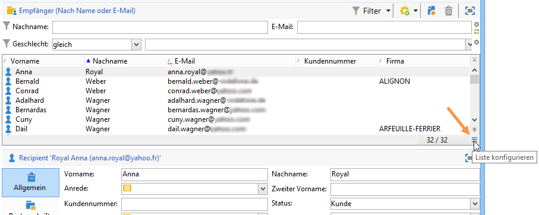

# Adobe Campaign-Arbeitsbereich{#adobe-campaign-workspace}

## Über die Benutzeroberfläche von Adobe Campaign {#about-adobe-campaign-interface}

Nach Herstellung der Datenbankverbindung gelangen Sie auf die Startseite von Adobe Campaign. Diese ist wie ein Dashboard gestaltet und besteht aus Links und Verknüpfungen, die Ihnen je nach Installation den Zugriff auf Funktionen und die allgemeinen Konfigurationselemente der Plattform erlauben.

In der Mitte des Fensters haben Sie die Möglichkeit, auf die Online-Dokumentation, das Forum und die Webseite des Supports zuzugreifen.

Der obige Screenshot zeigt ein Beispiel einer Startseite für einen Adobe-Campaign-Benutzer. Weiterführende Informationen dazu finden Sie im Video zur [Benutzeroberfläche von Adobe Campaign](https://docs.adobe.com/content/help/en/campaign-learn/campaign-classic-tutorials/getting-started/interface-overview.html).

>[!NOTE]
>
>Die in Ihrer Instanz verfügbaren Adobe-Campaign-Funktionen hängen von den installierten Modulen und Add-ons ab. Je nach Ihren Berechtigungen und Konfigurationen sind manche möglicherweise nicht verfügbar.
>
>Prüfen Sie Ihren Lizenzvertrag oder kontaktieren Sie Ihren Adobe-Kundenbetreuer, bevor Sie Module oder Add-ons installieren.

### Zugriff über Clientkonsole versus Webzugriff {#console-and-web-access}

Auf die Adobe-Campaign-Plattform kann entweder über eine Clientkonsole oder über einen Webbrowser zugegriffen werden.

Der Webzugriff bietet eine der Clientkonsole ähnliche Bedieneroberfläche mit eingeschränkten Funktionalitäten.

So wird z. B. für einen Benutzer eine Kampagne in der Clientkonsole mit folgenden Optionen angezeigt:

Im Webzugriff hingegen stehen vorwiegend konsultative Optionen zur Verfügung:

## Navigationsprinzipien {#navigation-basics}

### Auf Seiten navigieren {#browsing-pages}

Die Funktionen der Plattform sind in verschiedene Rubriken unterteilt. Verwenden Sie die Links im oberen Bereich der Bedieneroberfläche, um darauf zuzugreifen.

Die Liste der Rubriken hängt von den installierten Packages und Add-ons sowie den Zugriffsberechtigungen des aktuellen Benutzers ab.

Jede Funktionalität umfasst eine Reihe von Funktionen, die auf aufgabenbezogenen Anforderungen und dem jeweiligen Anwendungskontext basieren. Der **[!UICONTROL Profiles and targets]** Link ruft Sie beispielsweise zu den Empfängerlisten, den Abonnementdiensten, den vorhandenen Targeting-Arbeitsabläufen und den Verknüpfungen zum Erstellen dieser Elemente auf.

The lists are available via the **[!UICONTROL Lists]** link in the left-hand section of the **[!UICONTROL Profiles and Targets]** interface.

### Tabs verwenden {#using-tabs}

* Wenn Sie auf eine Kernfunktion oder einen Link klicken, ersetzt die entsprechende Seite die aktuelle Seite. Um zur vorherigen Seite zurückzukehren, klicken Sie auf die **[!UICONTROL Back]** Schaltfläche in der Symbolleiste. Um zur Homepage zurückzukehren, klicken Sie auf die **[!UICONTROL Home]** Schaltfläche.

   

* Bei der Auswahl eines Menüs oder einer Verknüpfung mit einer Webanwendung, einem Programm, einem Versand, einem Bericht o. Ä. öffnet sich die Seite in einem neuen Tab. Dies ermöglicht das Wechseln zwischen verschiedenen Ansichten durch die Auswahl des entsprechenden Tabs.

   

### Element erstellen {#creating-an-element}

In jedem Abschnitt mit den Hauptfunktionen können Sie zwischen den verfügbaren Elementen suchen. Verwenden Sie dazu die Verknüpfungen im **[!UICONTROL Browsing]** Abschnitt. Über den **[!UICONTROL Other choices]** Link können Sie unabhängig von der Umgebung auf alle anderen Seiten zugreifen.

Sie können ein neues Element erstellen (Bereitstellung, Webanwendung, Workflow usw.) mit den Tastaturbefehlen im **[!UICONTROL Create]** Abschnitt links im Bildschirm. Verwenden Sie die **[!UICONTROL Create]** Schaltfläche oberhalb der Liste, um der Liste neue Elemente hinzuzufügen.

For example, on the delivery page, use the **[!UICONTROL Create]** button to create a new delivery.

## Adobe-Campaign-Explorer verwenden {#using-adobe-campaign-explorer}

### Über den Adobe-Campaign-Explorer {#about-adobe-campaign-explorer}

Auf den Adobe-Campaign-Explorer kann über das entsprechende Symbol in der Symbolleiste zugegriffen werden. Mit seiner Hilfe gelangen Sie zu allen Adobe-Campaign-Funktionen und in die verschiedenen Konfigurationsbildschirme der Adobe-Campaign-Plattform. Darüber hinaus bietet er eine detaillierte Ansicht gewisser Elemente.

Die **[!UICONTROL Explorer]**-Ansicht ist in drei Bereiche unterteilt:

**1 - Navigationsbaum**: Sie können den Inhalt des Navigationsbaums Ihren Bedürfnissen anpassen (Knoten hinzufügen, verschieben, löschen). Diese Konfigurationsoption sollte erfahrenen Benutzern vorbehalten bleiben. Lesen Sie diesbezüglich auch [diese Seite](../../configuration/using/about-navigation-hierarchy.md).

**2 - Liste**: Sie können die angezeigten Listen filtern und sortieren, in ihnen suchen sowie die Spaltenanzeige je nach Bedarf gestalten.

**3 - Details**: Sie können Details des ausgewählten Elements anzeigen. Das Symbol rechts in der Titelzeile vergrößert die Anzeige zum Vollbildschirm.

### Bildschirmauflösung {#screen-resolution}

Adobe empfiehlt für optimale Navigation und Nutzung eine Bildschirmauflösung von mindestens 1600 x 900 Pixel.

>[!CAUTION]
>
>Auflösungen unter 1600 x 900 Pixel werden möglicherweise nicht von Adobe Campaign unterstützt.

In the **[!UICONTROL Explorer]** workspace, if some parts of the **[!UICONTROL Details]** zone appear to be truncated, expand it using the arrow on top of the zone or click the **[!UICONTROL Enlarge]** button.

### In Listen navigieren {#browsing-lists}

Um sich innerhalb einer Liste zu bewegen, können Sie sich der horizontalen und vertikalen **Bildlaufleisten** bedienen. So können Sie die Liste ansehen, ohne den ausgewählten Datensatz zu wechseln. Weitere Möglichkeiten sind das **Maus-Scrollrad** und die **Tastaturpfeile**.

>[!NOTE]
>
>Configuration and personalization of list content are presented in [Configuring lists](#configuring-lists).
>
>Sie können auch Daten sortieren und filtern. Siehe [Filteroptionen](../../platform/using/filtering-options.md).

### Datensätze zählen {#counting-records}

Standardmäßig lädt Adobe Campaign die 200 ersten Datensätze einer Liste in den Arbeitsspeicher. Dies bedeutet, dass eventuell nicht alle Datensätze einer Tabelle angezeigt werden. Sie haben die Möglichkeit, die Anzahl an Datensätzen einer Liste zu zählen und zusätzliche Datensätze in den Arbeitsspeicher zu laden.

In the lower right-hand part of the list screen, a **[!UICONTROL counter]** shows how many records have been loaded and the total number of records in the database (after applying any filters):

Wenn anstelle der Gesamtzahl ein &quot;**?**&quot; angezeigt wird, können Sie durch Klick auf das Feld die Gesamtzahl abrufen.

### Weitere Datensätze in den Arbeitsspeicher laden {#loading-more-records}

To load (and therefore display) additional records (200 lines by default) click **[!UICONTROL Continue loading]**.

To load all the records, right-click the list and select **[!UICONTROL Load all]**.

>[!CAUTION]
>
>Je nach der Anzahl der Datensätze kann das Laden der gesamten Liste relativ viel Zeit in Anspruch nehmen.

### Anzahl der standardmäßig geladenen Datensätze ändern {#change-default-number-of-records}

To change the default number of records loaded, click **[!UICONTROL Configure list]** in the bottom right-hand corner of the list.

Im Listenkonfigurationsfenster können Sie dann durch Klick auf den Link &quot;Erweiterte Parameter&quot; (unten links) die Anzahl der abzurufenden Zeilen ändern.

### Listen konfigurieren {#configuring-lists}

#### Spalten hinzufügen {#add-columns}

Spalten können auf zwei verschiedene Arten zu einer Liste hinzugefügt werden.

Sie können ausgehend von der Detailansicht eines Datensatzes eine Spalte zu einer Liste hinzufügen. Gehen Sie dazu folgendermaßen vor:

1. Wählen Sie auf einer Detailseite mit der rechten Maustaste das Feld aus, das in einer Spalte dargestellt werden soll.
1. Auswählen **[!UICONTROL Add in the list]**.

   Die Spalte wird rechts von den bereits angezeigten Spalten hinzugefügt.

Eine weitere Möglichkeit zum Hinzufügen von Spalten besteht im Listenkonfigurationsfenster. Dies ist hilfreich, wenn Sie beispielsweise Daten anzeigen möchten, die nicht auf der Detailseite dargestellt werden. Gehen Sie dazu folgendermaßen vor:

1. Click **[!UICONTROL Configure list]** below and to the right of the list.

   

1. In the list configuration window, double-click the field to be added in the **[!UICONTROL Available fields]** list in order to add it to the **[!UICONTROL Output columns]**.

   

   >[!NOTE]
   >
   >Erweiterte Felder werden standardmäßig nicht angezeigt. Verwenden Sie das Symbol **Erweiterte Felder anzeigen** im rechten unteren Bereich der Liste der verfügbaren Felder, um sie sichtbar zu machen.
   >
   >Die Titel werden nach Tabellen geordnet und innerhalb der Tabellen in alphabetischer Reihenfolge angezeigt.
   >
   >Use the **Search** field to run a search in the available fields. Weitere Informationen finden Sie unter [Sortieren einer Liste](#sorting-a-list).
   >
   >Die Art der Felder (SQL-Felder, verknüpfte Tabellen, berechnete Felder usw.) wird durch verschiedene Symbole verdeutlicht. Für das jeweils ausgewählte Feld wird unter der Liste der verfügbaren Felder die entsprechende Beschreibung angezeigt.
   [Listen konfigurieren](#configuring-lists).
   >
   >Sie können auch Daten sortieren und filtern. Siehe [Filteroptionen](../../platform/using/filtering-options.md).

1. Wiederholen Sie diesen Vorgang für jede Spalte, die dargestellt werden soll.
1. Mithilfe der Pfeile können Sie die **Anzeigereihenfolge** der Spalten ändern. Das erste Feld in der Liste der Ausgabespalten entspricht der in der Datensatzliste ganz links gelegenen Spalte.

   

1. If you need, you can click **[!UICONTROL Distribution of values]** to view the repartition of values for the selected field in the current folder.

   

1. Wählen Sie **[!UICONTROL OK]** aus, um die Konfigurationen zu bestätigen und das Ergebnis anzuzeigen.

#### Neue Spalte erstellen {#create-a-new-column}

Sie können neue Spalten erstellen, um zusätzliche Felder in der Liste anzuzeigen. Gehen Sie dazu folgendermaßen vor:

1. Click **[!UICONTROL Configure the list]** at below and to the right of the list.
1. Click **[!UICONTROL Add]** to display a new field in the list.

#### Spalte entfernen {#remove-a-column}

You can mask one or more columns in a list of records using **[!UICONTROL Configure list]** located below and to the right of the list.

In the list configuration window, select the column to be masked from the **[!UICONTROL Output columns]** zone, and click the delete button.

Wiederholen Sie diese Schritte für jede Spalte, die maskiert werden soll. Wählen Sie **[!UICONTROL OK]** aus, um die Konfigurationen zu bestätigen und das Ergebnis anzuzeigen.

#### Spaltenbreite anpassen {#adjust-column-width}

Bei aktiven Listen (d. h. mit mindestens einer ausgewählten Zeile) ermöglicht die F9-Taste die Anpassung der Spaltenbreite an die Bildschirmgröße, sodass alle Spalten angezeigt werden.

#### Datensätze in Unterordnern anzeigen {#display-sub-folders-records}

Bei Listen stehen zwei verschiedene Anzeigemodi zur Verfügung:

* Anzeige der Datensätze nur des ausgewählten Ordners,
* Anzeige der Datensätze des ausgewählten Ordners und der Unterordner.

To switch from one display mode to the other, click **[!UICONTROL Display sub-levels]** in the toolbar.

### Konfiguration einer Liste speichern {#saving-a-list-configuration}

Die Konfigurationen von Listen werden lokal auf Arbeitsplatzebene definiert. Wenn der lokale Cache geleert wird, werden die lokalen Konfigurationen deaktiviert.

Standardmäßig werden die definierten Anzeigeeinstellungen auf alle Listen mit identischem Ordnertyp angewendet. Wenn Sie also z. B. die Anzeige der Empfängerliste von einem Ordner ausgehend ändern, wird die Konfiguration auf alle anderen Empfängerordner übertragen.

Es ist jedoch möglich, verschiedene Konfigurationen zu speichern, um sie auf verschiedene Ordner des gleichen Typs anzuwenden. Die Konfiguration wird in den Ordnereigenschaften gespeichert und kann wiederverwendet werden.

Für einen Versandordner lässt sich z. B. folgende Anzeige konfigurieren:

Gehen Sie folgendermaßen vor, um diese Listenkonfiguration zu speichern, damit sie wiederverwendet werden kann:

1. Wählen Sie mit der rechten Maustaste den Ordner aus, der die angezeigten Daten enthält.
1. Auswählen **[!UICONTROL Properties]**.
1. Klicken Sie auf **[!UICONTROL Advanced settings]** und geben Sie einen Namen in das **[!UICONTROL Configuration]** Feld ein.

   

1. Klicken Sie auf **[!UICONTROL OK]** und dann auf **[!UICONTROL Save]**.

Anschließend kann diese Konfiguration auf einen anderen Ordner vom Typ **Versand** angewendet werden:

Klicken Sie **[!UICONTROL Save]** im Fenster mit den Ordnereigenschaften auf . Die Listenanzeige wurde entsprechend der angegebenen Konfiguration geändert:

### Listen exportieren {#exporting-a-list}

Zum von Listendaten steht Ihnen der Export-Assistent zur Verfügung. Markieren Sie die zu exportierenden Datensätze und klicken Sie mit der rechten Maustaste auf die Liste. Wählen Sie dann im Kontextmenü die Option **[!UICONTROL Export...]** Exportieren....

Die Verwendung der Import- und Exportfunktionen wird unter [Generische Ein- und Ausfuhren](../../platform/using/generic-imports-and-exports.md)erläutert.

>[!CAUTION]
>
>Listenelemente dürfen nicht mithilfe der Kopieren/Einfügen-Funktion exportiert werden.

### Listen sortieren {#sorting-a-list}

Listen enthalten oft große Datenmengen, die sortiert und mit einfachen oder erweiterten Filtern eingeschränkt werden können. Während die Sortierung eine Anzeige aller Datensätze in steigender oder fallender Reihenfolge nach sich zieht, wird durch Anwendung von Filtern unter Kombination verschiedener Kriterien die Auswahl der anzuzeigenden Datensätze eingeschränkt.

Durch die Auswahl eines Spaltentitels werden die Daten aufsteigend oder absteigend sortiert oder die Sortierung aufgehoben. Ein blauer Pfeil vor dem Spaltentitel zeigt an, dass nach dieser Spalte sortiert wurde und ob es sich um eine auf- oder absteigende Sortierung handelt. Ein roter Unterstrich bedeutet, dass die Sortierung sich auf in der Datenbank indizierte Daten bezieht. Dieser Sortiermodus trägt zur Optimierung der Sortiervorgänge bei.

Sie können die Sortierung konfigurieren oder Sortierkriterien kombinieren. Gehen Sie dazu folgendermaßen vor:

1. **[!UICONTROL Configure list]** unterhalb und rechts neben der Liste.

   

1. In the list configuration window, click the **[!UICONTROL Sorting]** tab.
1. Wählen Sie die zu sortierenden Felder und die Sortierrichtung aus (auf- oder absteigend).

   

1. Die Priorität der Sortierkriterien hängt von der Reihenfolge der Sortierungsspalten ab. Diese Reihenfolge kann mithilfe der Pfeile rechts in der Symbolleiste angepasst werden.

   

   Die Anzeige der Spalten in der Liste ist unabhängig von der Priorität der Sortierkriterien.

1. Wählen Sie **[!UICONTROL Ok]** aus, um die Einstellungen zu bestätigen und das Ergebnis anzuzeigen.

### In Listen suchen {#running-a-search}

Sie können eine Suche der verfügbaren Felder in einem Editor ausführen, indem Sie das **[!UICONTROL Search]** Feld oberhalb der Feldliste verwenden. Drücken Sie auf der Tastatur die **Eingabetaste** oder navigieren Sie zur Liste. Die Felder, die zu Ihrer Suche passen, sind fett markiert.

>[!NOTE]
>
>Sie können Filter erstellen, um nur einige der Daten in einer Liste anzuzeigen. Siehe [Erstellen von Filtern](../../platform/using/creating-filters.md).

## Formate und Einheiten {#formats-and-units}

### Datum und Uhrzeit {#date-and-time}

Die Sprache Ihrer Adobe-Campaign-Classic-Instanz hat Auswirkungen auf das Format von Datum und Uhrzeit.

Die Sprache wird während der Installation von Campaign ausgewählt und kann danach nicht mehr geändert werden. Zur Auswahl stehen: Englisch (US), Englisch (EN), Französisch, Deutsch oder Japanisch. Weiterführende Informationen dazu finden Sie auf [dieser Seite](../../installation/using/creating-an-instance-and-logging-on.md).

Die Hauptunterschiede zwischen US-amerikanischem Englisch und britischem Englisch sind:

<table> 
 <thead> 
  <tr> 
   <th> Formate  </th> 
   <th> English (US)  </th> 
   <th> English (EN)  </th> 
  </tr> 
 </thead> 
 <tbody> 
  <tr> 
   <td> Datum  </td> 
   <td> Woche beginnt am Sonntag  </td> 
   <td> Woche beginnt am Montag  </td> 
  </tr> 
  <tr> 
   <td> Kurzform des Datums  </td> 
   <td> 
%2M/%2D/%4Y

<strong>z. B.: 09/25/2018</strong>
 </td> 
   <td> 
%2D/%2M/%4Y

<strong>z. B.: 25/09/2018</strong>
 </td> 
  </tr> 
  <tr> 
   <td> Kurzform des Datums mit Uhrzeit  </td> 
   <td> 
%2M/%2D/%4Y %I:%2N:%2S %P

<strong>z. B.: 09/25/2018 10:47:25 PM</strong>
 </td> 
   <td> 
%2D/%2M/%4Y %2H:%2N:%2S

<strong>z. B.: 25/09/2018 22:47:25</strong>
 </td> 
  </tr> 
 </tbody> 
</table>

### Werte in einer Auflistung hinzufügen {#add-values-in-an-enumeration}

Mithilfe der Eingabefelder mit einer Dropdown-Liste können Sie einen Aufzählungswert eingeben, der gespeichert und dann als Option in der Dropdown-Liste angeboten werden kann. Beispielsweise können Sie im **[!UICONTROL City]** Feld der **[!UICONTROL General]** Registerkarte eines Empfängerprofils London eingeben. Wenn Sie die Eingabetaste drücken, um diesen Wert zu bestätigen, wird in einer Meldung gefragt, ob Sie diesen Wert für die mit dem Feld verknüpfte Aufzählung speichern möchten.

If you click **[!UICONTROL Yes]**, this value will be available in the combo box of the relevant field (in this case: **[!UICONTROL London]**).

>[!NOTE]
>
>Aufzählungen (auch als &quot;Einzellisten&quot;bezeichnet) werden vom Administrator über den **[!UICONTROL Administration > Platform > Enumerations]** Abschnitt verwaltet. For more on this, refer to [Managing enumerations](../../platform/using/managing-enumerations.md).

### Standardeinheiten {#default-units}

In Feldern, die eine Dauer bezeichnen (z. B. Gültigkeit von Versandressourcen, Validierungszeitraum einer Aufgabe etc.), sind verschiedene **Einheiten** möglich:

* **[!UICONTROL s]** für Sekunden,
* **[!UICONTROL mn]** für Minuten,
* **[!UICONTROL h]** für Stunden,
* **[!UICONTROL d]** für Tage.

