# Listen erstellen und verwalten{#creating-and-managing-lists}

## Über Listen in Adobe Campaign {#about-lists-in-adobe-campaign}

Eine Liste ist eine statische Gruppe von Profilen, die als Zielgruppe für Sendungen verwendet oder durch Importe sowie Workflows aktualisiert werden kann. So kann beispielsweise eine mithilfe einer Abfrage aus der Datenbank gefilterte Population in einer Liste gespeichert werden.

Listen werden über den Link **[!UICONTROL Listen]** im Tab **[!UICONTROL Profile und Zielgruppen]** erstellt und verwaltet.

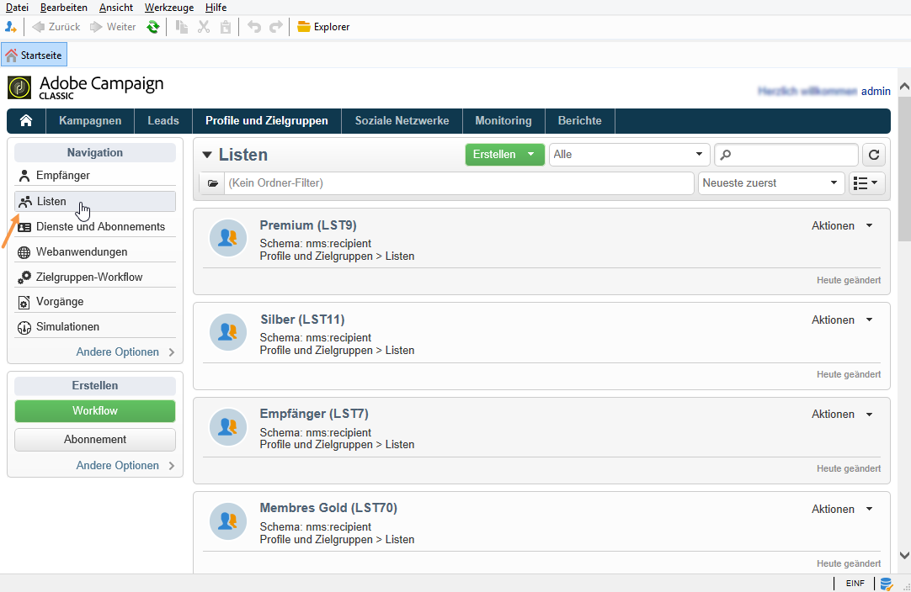

In Adobe Campaign sind zwei Arten von Listen verfügbar:

* **[!UICONTROL Gruppe]**: Diese Listen vom Typ **[!UICONTROL Gruppe]** gehören zu **statischen** Listen von nach bestimmten Kriterien ausgewählten Kontakten. Eine Liste ist eine Art Fotografie einer Profilgruppe zu einem bestimmten Zeitpunkt. Bitte beachten Sie, dass diese Listen nicht automatisch aktualisiert werden, wenn Profile zur Datenbank hinzugefügt werden.

   Weiterführende Informationen zum Erstellen einer Liste vom Typ **[!UICONTROL Gruppe]** finden Sie auf [dieser Seite](#creating-a-profile-list-from-a-group).

* **[!UICONTROL Liste]**: Die Listen vom Typ **[!UICONTROL Liste]** ermöglichen zum Erstellen und Verwalten von Listen die Verwendung von Workflows. In diesem Fall handelt es sich um besondere, durch Datenimport erstellte Listen, die mithilfe der Workflow-Aktivität **[!UICONTROL Listen-Update]** automatisch auf den neuesten Stand gebracht werden können.

   Im Gegensatz zu Listen vom Typ **[!UICONTROL Gruppe]** können diese Listen automatisch mit der Aktivität **[!UICONTROL Planung]** aktualisiert werden. Ein Beispiel für die Erstellung von Listen vom Typ **[!UICONTROL Liste]** finden Sie auf [dieser Seite](../../workflow/using/list-update.md).

 [Mehr zu dieser Funktion erfahren Sie im Video.](#create-list-video).

## Profilliste von einer Gruppe erstellen {#creating-a-profile-list-from-a-group}

Listen vom Typ **[!UICONTROL Gruppe]**, die über den Link **[!UICONTROL Profile und Zielgruppen]** erstellt wurden, basieren ausschließlich auf der Standard-Profiltabelle (nms:recipient).

>[!NOTE]
>
>Die Erstellung von Listen mit anderen Daten ist unter Verwendung eines Workflows möglich. Sie können beispielsweise eine Besucherliste anlegen, indem Sie einen Workflow mit einer Abfrage bezüglich der Besuchertabelle und der Aktivität Listenaktualisierung erstellen. Weiterführende Informationen zu Workflows finden Sie in [diesem Abschnitt](../../workflow/using/about-workflows.md).

Gehen Sie wie folgt vor, um eine neue Liste vom Typ **[!UICONTROL Gruppe]** zu erstellen:

1. Verwenden Sie die Schaltfläche **[!UICONTROL Erstellen]** und wählen Sie **[!UICONTROL Neue Liste]** aus.

   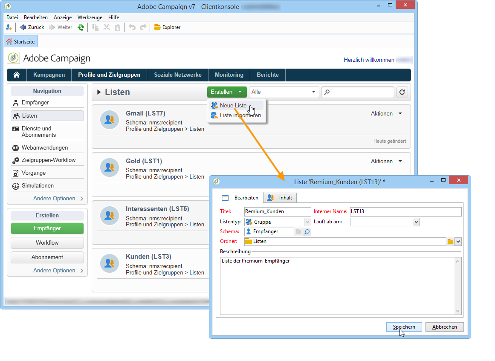

1. Erfassen Sie im Tab **[!UICONTROL Bearbeiten]** des Listenfensters alle nötigen Informationen.

   * Geben Sie im Feld **[!UICONTROL Titel]** den Namen der Liste an und ändern Sie ggf. den internen Namen.
   * Sie haben die Möglichkeit, eine Beschreibung in Bezug auf die Liste zu erfassen.
   * Des Weiteren können Sie ein Ablaufdatum angeben. Bei Erreichen des Datums wird die Liste automatisch gelöscht.

      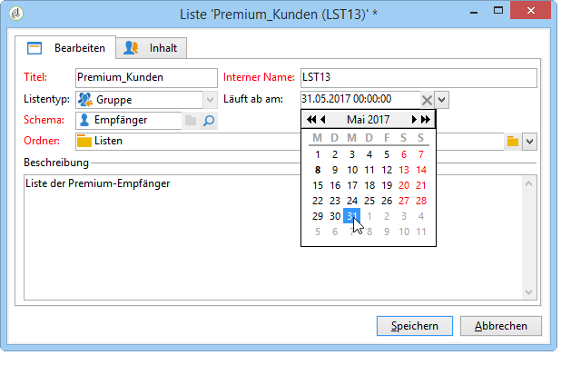

1. Setzen Sie im Tab **[!UICONTROL Inhalt]** durch Klick auf die Schaltfläche **[!UICONTROL Hinzufügen]** Profile auf die Liste.

   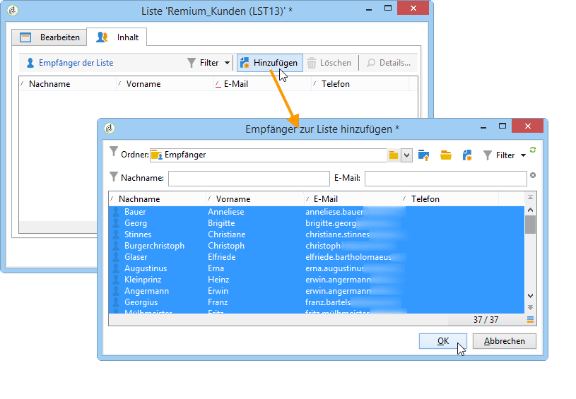

1. Verwenden Sie die Schaltfläche **[!UICONTROL Speichern]**. Die Liste ist nunmehr über die Listenübersicht zugänglich.

Es ist auch möglich, neue Profile direkt im Hinzufügefenster anzulegen, indem Sie die Schaltfläche **[!UICONTROL Erstellen]** verwenden. Das auf diese Weise hinzugefügte Profil wird in die Datenbank aufgenommen.

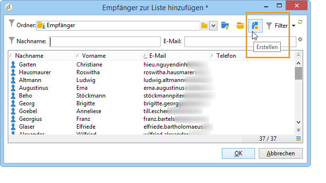

Die Darstellung der Empfängerliste kann wie andere Listen auch Ihren Bedürfnissen entsprechend angepasst werden. Siehe [Listen konfigurieren ](../../platform/using/adobe-campaign-workspace.md#configuring-lists).

## Daten einer Liste zuordnen {#linking-data-to-a-list}

>[!NOTE]
>
>Die Zuordnung von Daten zu einer Liste ist nur mit Listen vom Typ **[!UICONTROL Gruppe]** möglich.

Es besteht die Möglichkeit, Profile zu filtern und das Ergebnis einer Liste zuzuordnen. Diese Liste kann dann als Zielgruppe für Sendungen verwendet werden. Gehen Sie folgendermaßen vor, um Profile zusammenzufassen:

1. Markieren Sie die gewünschten Profile und wählen Sie sie mit der rechten Maustaste aus.
1. Wählen Sie nun > **[!UICONTROL Aktionen > Auswahl einer Liste zuordnen...]**.

   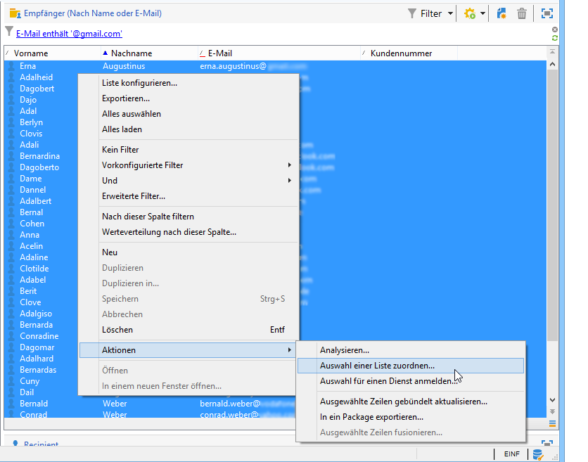

1. Wählen Sie eine existierende Liste aus oder erstellen Sie eine neue durch Auswahl der Schaltfläche **[!UICONTROL Erstellen]**. Verwenden Sie anschließend **[!UICONTROL Weiter]**.

   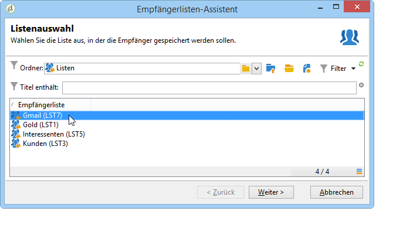

1. Klicken Sie auf die Schaltfläche **[!UICONTROL starten]**.

   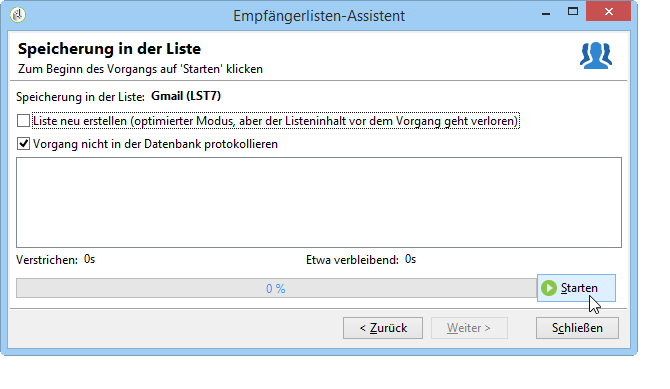

Bei Auswahl der Option **[!UICONTROL Liste neu erstellen]** wird der frühere Listeninhalt gelöscht. Es handelt sich hierbei um den optimierten Modus, da keine Abfrage erforderlich ist, um zu prüfen, ob gewisse Profile bereits dieser Liste zugeordnet wurden.

Wenn Sie die Option **[!UICONTROL Vorgang nicht in der Datenbank protokollieren]** abwählen, ist die Auswahl oder Erstellung eines Ausführungsordners erforderlich, in dem die den Vorgang betreffenden Protokollnachrichten gespeichert werden.

In der oberen Hälfte des Assistenten werden Informationen bezüglich der Ausführung angezeigt. Durch Klick auf die Schaltfläche **[!UICONTROL Abbrechen]** kann der Vorgang gestoppt werden. Bereits verarbeitete Datensätze werden jedoch trotzdem der Liste zugeordnet.

Im Tab **[!UICONTROL Listen]** der vom Vorgang betroffenen Profile kann das Ergebnis der Listenzuordnung geprüft werden:

Sie können Listen auch von der Adobe-Campaign-Startseite aus bearbeiten. Klicken Sie hierzu auf das Menü **[!UICONTROL Profile und Zielgruppen > Listen]** und wählen Sie die gewünschte Liste aus. Im Tab **[!UICONTROL Inhalt]** werden die der Liste zugeordneten Profile angezeigt.

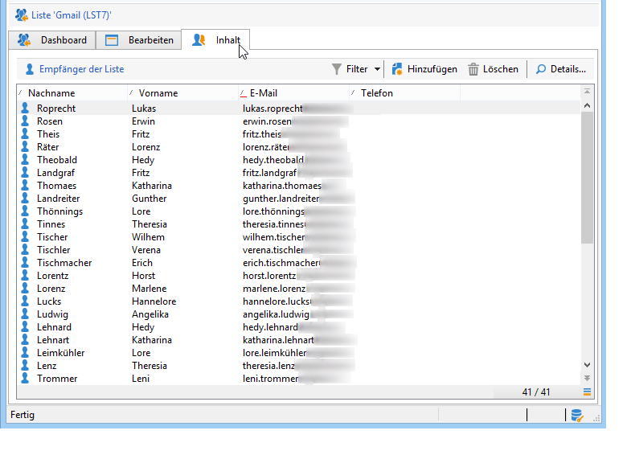

## Profil aus einer Liste entfernen {#removing-a-profile-from-a-list}

Sie haben verschiedene Möglichkeiten, Profile aus einer Liste zu entfernen. Sie können:

* die Liste bearbeiten, das Profil im Tab **[!UICONTROL Inhalt]** auswählen und auf das Symbol **[!UICONTROL Löschen]** klicken;

   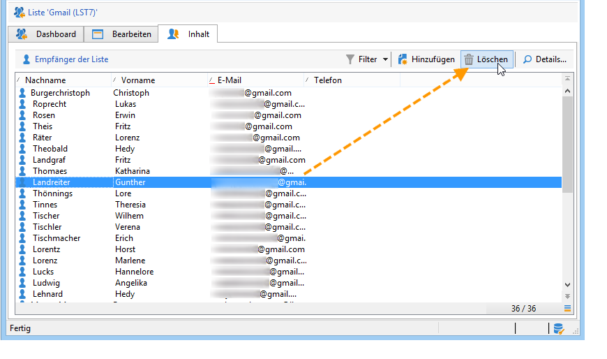

* das Profil bearbeiten und im Tab **[!UICONTROL Liste]** auf das Symbol **[!UICONTROL Löschen]** klicken.

   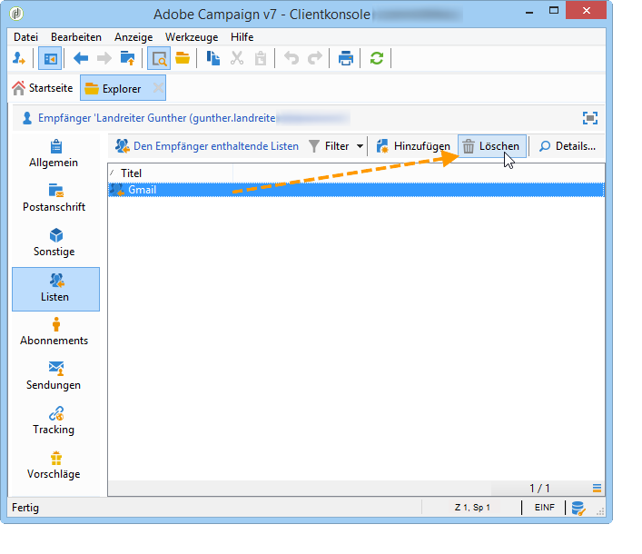

## Profilliste löschen {#deleting-a-list-of-profiles}

Listen werden ausgehend vom Adobe-Campaign-Navigationsbaum über den Link **[!UICONTROL Erweitert > Explorer]** der Adobe-Campaign-Startseite gelöscht. Wählen Sie die gewünschten Gruppen aus und klicken Sie mit der rechten Maustaste. Wählen Sie nun **[!UICONTROL Löschen]**. Vor der endgültigen Löschung ist eine Bestätigung erforderlich.

>[!NOTE]
>
>Die Löschung einer Liste hat außer der Aktualisierung der Profildaten keinen Einfluss auf die der Liste zugeordneten Profile.

## Eine Empfängerliste erstellen {#create-list-video}

Eine Liste ist ein statischer Satz von Empfängern, die in Versandaktionen als Zielkontakte dienen oder beim Importieren bzw. bei der Workflow-Ausführung aktualisiert werden können. Eine Liste von Empfängern wird auch als Audience bezeichnet.

Erfahren Sie mehr über das Erstellen einer Audience durch Konfigurieren einer Empfängerliste aus dem Explorer.

>[!VIDEO](https://video.tv.adobe.com/v/25602/quality=12)

## Empfängerliste erstellen mit einem Workflow {#create-list-in-a-wf-video}

Erfahren Sie, wie Sie einen Workflow erstellen, um Empfänger als Zielkontakte auszuwählen, und den Workflow als wiederkehrend einzurichten, bevor die Liste als Zielgruppe für eine E-Mail-Kampagne verwendet wird.

>[!VIDEO](https://video.tv.adobe.com/v/25603?quality=12)
