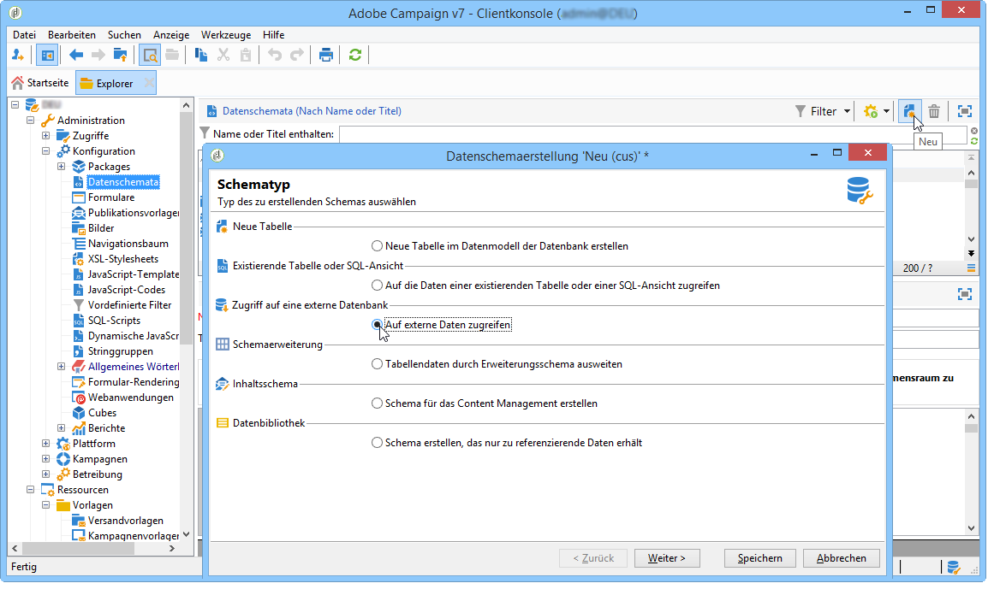
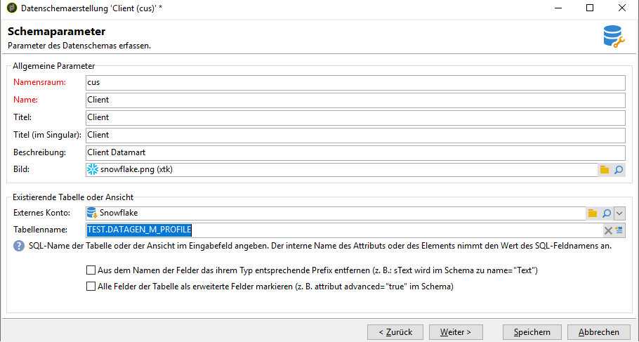
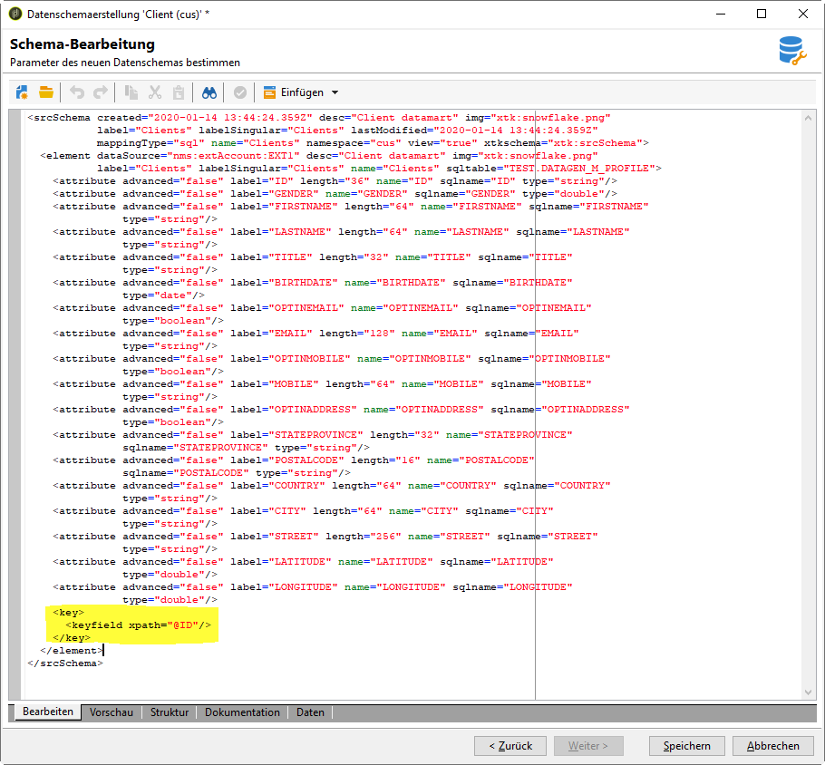

# Erstellen des Datenschemas {#creating-the-data-schema}

So erstellen Sie ein Schema für eine externe Datenbank:

1. Klicken Sie auf die Schaltfläche **[!UICONTROL Neu]** über der Liste der Datenschemata und wählen Sie **[!UICONTROL Auf externe Daten zugreifen]**.

   

1. Geben Sie für das Schema einen Namen und eine Beschreibung ein und wählen Sie das externe Konto aus, über das die Verbindung mit der Datenbank hergestellt werden soll. Dadurch erhalten Sie Zugriff auf die Liste mit den in der externen Datenbank verfügbaren Tabellen. Wählen Sie die Tabelle aus, die die Daten enthält, die abgerufen werden sollen.

   

1. Klicken Sie zur Bestätigung auf **[!UICONTROL OK]**. Adobe Campaign erkennt die Struktur der ausgewählten Tabelle automatisch und erstellt das logische Schema. Beachten Sie, dass Adobe Campaign keine Verknüpfungen generiert.

1. Klicken Sie auf **[!UICONTROL Speichern]**, um die Erstellung zu bestätigen.

   >[!CAUTION]
   >
   >Bei Snowflake ist ein Primärschlüssel obligatorisch.

   

Die Indexe werden beim Mapping einer Tabelle automatisch erstellt (Standard- oder FDA-Mapping).
