# Filter erstellen{#creating-filters}

## Einleitung {#introduction}

Beim Navigieren im Adobe-Campaign-**[!UICONTROL Explorer]** (zugänglich über die entsprechende Schaltfläche auf der Startseite) werden die Informationen der Datenbank in Form von Listen angezeigt. Diese Listen können so konfiguriert werden, dass nur die dem Benutzer nützlichen Elemente angezeigt werden. Auf den gefilterten Daten können dann Aktionen gestartet werden. Die Filterkonfiguration ermöglicht eine **[!UICONTROL dynamische]** Auswahl von Daten einer Liste. Bei Datenänderungen werden die gefilterten Daten automatisch aktualisiert.

>[!NOTE]
>
>Die Anzeige wird lokal am Arbeitsplatz konfiguriert und in verborgenen Dateien gespeichert. Insbesondere im Fall von Problemen bei der Datenaktualisierung kann es nützlich sein, diese Daten zu bereinigen. Gehen Sie hierzu ins Menü **[!UICONTROL Datei > Lokalen Cache leeren]**.

## Typologie verfügbarer Filter {#typology-of-available-filters}

Adobe Campaign ermöglicht die Filterung von Datenlisten.

Diese Filter können einmalig angewandt oder zur wiederholten Nutzung gespeichert werden. Es können mehrere Filter gleichzeitig genutzt werden.

Folgende Filtertypen sind in Adobe Campaign verfügbar:

* Standardfilter

   **Standardfilter** stehen oberhalb der Listen zur Verfügung. Sie ermöglichen die Filterung nach standardmäßig festgelegten Feldern (für Empfängerprofile z. B. sind dies Name und E-Mail). Über diese Felder kann nach Zeichen oder nach aus der Dropdown-Liste ausgewählten Bedingungen gefiltert werden.

   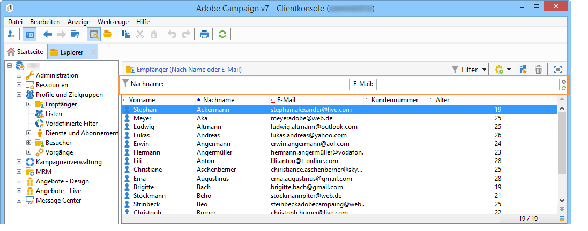
<!--
  >[!NOTE]
  >
  >The **%** character replaces any character string. For example, the string `%@yahoo.com` lets you display all the profiles with an e-mail address in the domain "yahoo.com".
-->
Sie können den Standardfilter einer Liste ändern. Weitere Informationen finden Sie unter [Standardfilter ändern](#altering-the-default-filter).

* Einfache Filter

   **Einfache Filter** ermöglichen die punktuelle Filterung der Spalten einer Liste. Sie können mittels einfacher Suchkriterien konfiguriert werden.

   Es können mehrere einfache Filter für eine Datenliste kombiniert werden, um eine Suche zu verfeinern. Die Felder der Filterkriterien werden untereinander angezeigt. Sie können unabhängig voneinander gelöscht werden.

   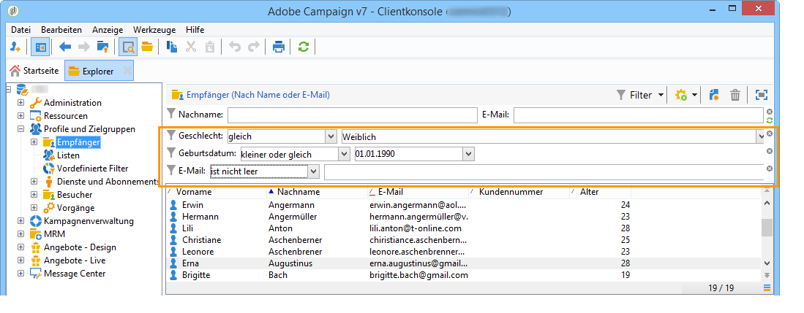

   Einfache Filter werden unter [Einfache Filter erstellen](#creating-a-simple-filter) ausführlich beschrieben.

* Erweiterte Filter

   **Erweiterte Filter** werden basierend auf einer Abfrage oder einer Kombination von Abfragen über die Daten erstellt.

   Weitere Informationen zum Erstellen eines erweiterten Filters finden Sie unter [Erweiterte Filter erstellen](#creating-an-advanced-filter).

   Sie können Funktionen verwenden, um den Inhalt des Filters zu definieren. Weitere Informationen finden Sie unter [Erweiterte Filter mit Funktionen erstellen](#creating-an-advanced-filter-with-functions).

   >[!NOTE]
   >
   >Mehr Informationen über die Erstellung von Abfragen in Adobe Campaign erhalten Sie in [diesem Abschnitt](../../platform/using/about-queries-in-campaign.md).

* Benutzerfilter

   Ein **Anwendungsfilter** ist ein erweiterter Filter, dessen Konfiguration zur wiederholten und gemeinsamen Nutzung mit anderen Benutzern gespeichert wird.

   Die Schaltfläche **[!UICONTROL Filter]** oberhalb der Listen enthält eine Reihe von Anwendungsfiltern, die kombiniert werden können, um die Filterung zu verfeinern. Die Methode zum Erstellen dieser Filter wird unter [Filter speichern](#saving-a-filter) beschrieben.

## Standardfilter ändern {#altering-the-default-filter}

Um den Standardfilter für eine Empfängerliste zu ändern, klicken Sie auf den Verzeichnisknoten **[!UICONTROL Profile und Zielgruppen > Vordefinierte Filter]**.

Standardfilter für andere Datentypen werden im Verzeichnisknoten **[!UICONTROL Administration > Konfigurationen > Vordefinierte Filter]** konfiguriert.

Gehen Sie wie folgt vor:

1. Wählen Sie den Filter aus, der als Standardfilter dienen soll.
1. Klicken Sie auf den Tab **[!UICONTROL Parameter]** und kreuzen Sie die Option **[!UICONTROL Standardfilter für den verbundenen Dokumenttyp]** an.

   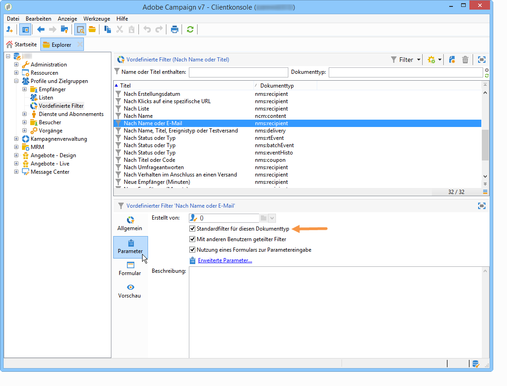

   >[!CAUTION]
   >
   >Wenn bereits ein Standardfilter für diese Liste definiert wurde, muss dieser vor der Anwendung des neuen Filters deaktiviert werden. Klicken Sie hierzu auf das rote Kreuz oberhalb der Filterfelder.

1. Klicken Sie auf die Schaltfläche **[!UICONTROL Speichern]**, um den Filter anzuwenden.

   >[!NOTE]
   >
   >Das Fenster „Filterdefinition“ wird unter [Erweiterte Filter erstellen](#creating-an-advanced-filter) und [Filter speichern](#saving-a-filter) ausführlich beschrieben.

## Einfache Filter erstellen {#creating-a-simple-filter}

Gehen Sie wie folgt vor, um einen **einfachen Filter** zu erstellen:

1. Klicken Sie mit der rechten Maustaste auf das Feld, nach dem Sie die Daten filtern möchten, und wählen Sie die Option **[!UICONTROL Nach diesem Feld filtern]** aus.

   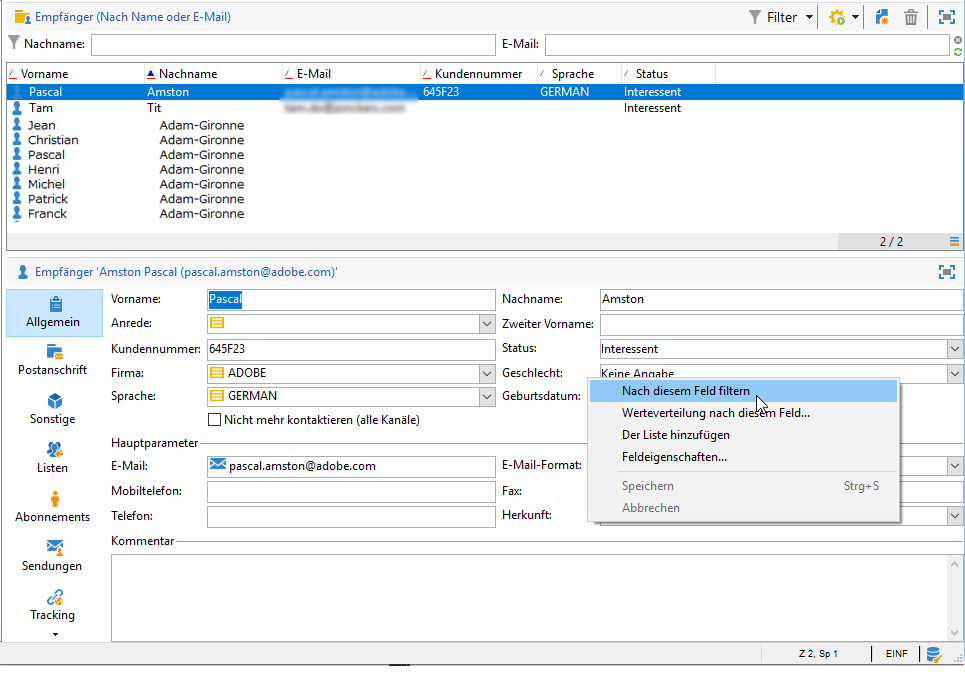

   Die Standard-Filterfelder werden oberhalb der Liste angezeigt.

1. Wählen Sie in der Dropdown-Liste die Filteroption aus oder geben Sie die anzuwendenden Filterbedingungen an (der Auswahl- oder Eingabemodus der Filterbedingungen hängt vom Feldtyp ab: Text, Auflistung etc.).

   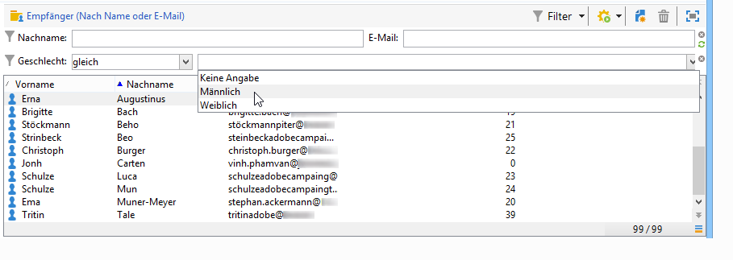

1. Drücken Sie auf die Enter-Taste oder klicken Sie auf den rechts von den Filterfeldern gelegenen grünen Pfeil, um den Filter zu aktivieren.

Wenn das Feld, nach dem die Daten gefiltert werden sollen, nicht im Profilformular angezeigt wird, können Sie es zu den angezeigten Spalten hinzufügen und anschließend nach dieser Spalte filtern. Befolgen Sie hierzu die nachstehenden Schritte:

1. Klicken Sie auf das Symbol **[!UICONTROL Liste konfigurieren]**.

   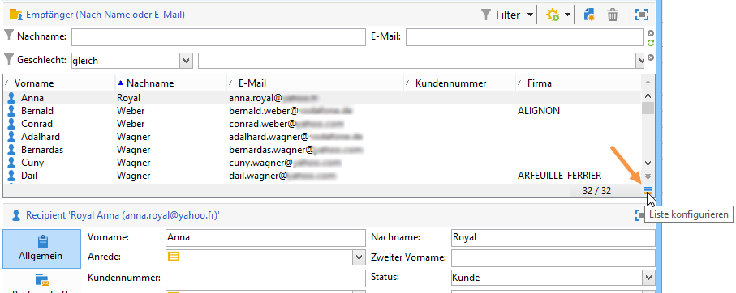

1. Wählen Sie die anzuzeigende Spalte aus, zum Beispiel das Alter des Empfängers. Durch Doppelklick wird das Feld zur Liste der Ausgabespalten hinzugefügt.

   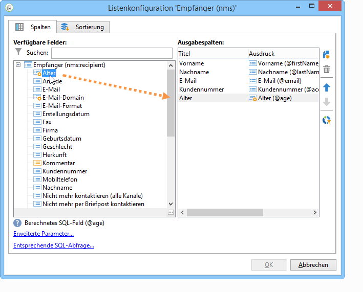

1. Klicken Sie anschließend mit der rechten Maustaste in der Empfängerliste auf die Spalte **Alter** und wählen Sie **[!UICONTROL Nach dieser Spalte filtern]** aus.

   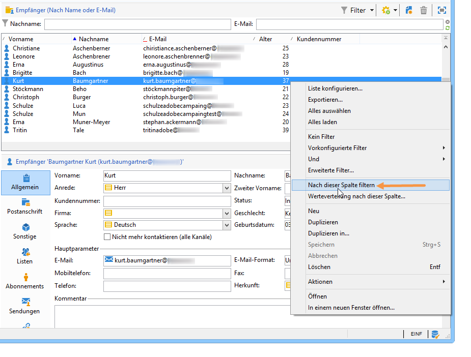

   Nun können Sie die Filteroptionen bezüglich des Alters auswählen.

   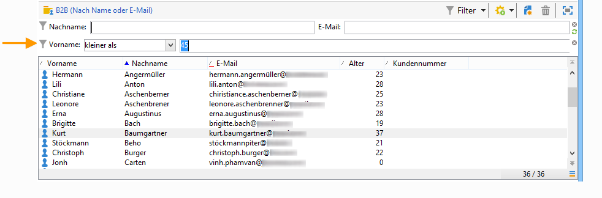

## Erweiterte Filter erstellen {#creating-an-advanced-filter}

Gehen Sie wie folgt vor, um einen **erweiterten Filter** zu erstellen.

1. Klicken Sie auf die Schaltfläche **[!UICONTROL Filter]** und wählen Sie **[!UICONTROL Erweiterte Filter...]** aus.

   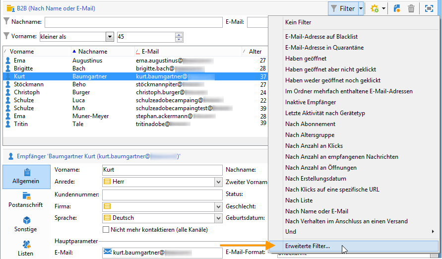

   Alternativ können Sie mit der rechten Maustaste in die Liste der zu filternden Daten klicken und **[!UICONTROL Erweiterte Filter...]** auswählen.

   Daraufhin wird das Fenster zur Bestimmung der Filterbedingungen angezeigt.

1. Klicken Sie in die Spalte **[!UICONTROL Ausdruck]**, um den Eingangswert zu bestimmen.
1. Klicken Sie auf das Symbol **[!UICONTROL Ausdruck bearbeiten]**, um das Feld auszuwählen, nach dem gefiltert werden soll.

   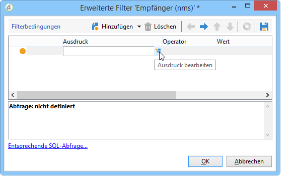

1. Wählen Sie in der Liste das Feld aus, nach dem die Daten gefiltert werden sollen. Klicken Sie zum Bestätigen auf **[!UICONTROL Beenden]**.
1. Klicken Sie in die Spalte **[!UICONTROL Operator]** und wählen Sie in der Dropdown-Liste den anzuwendenden Operator aus.
1. Geben Sie dann in der Spalte **[!UICONTROL Wert]** den Vergleichswert an. Sie können mehrere Filter kombinieren, um Ihre Abfrage zu verfeinern. Für jede weitere Filterbedingung klicken Sie auf die Schaltfläche **[!UICONTROL Hinzufügen]**.

   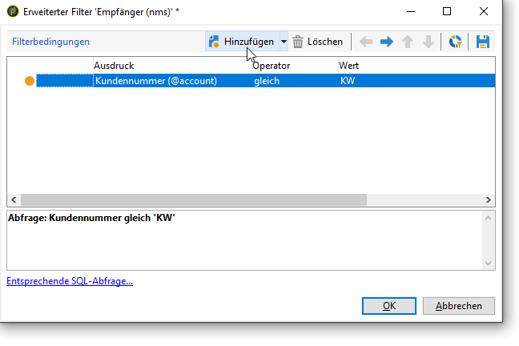

1. Mithilfe der Pfeile in der Symbolleiste können Sie die Ausdrücke hierarchisch gliedern oder die Reihenfolge der Ausdrücke der Abfrage ändern.
1. Der Standard-Operator zwischen den Ausdrücken ist **Und**, er kann jedoch durch einen Klick in das entsprechende Feld in das entsprechende Feld durch **Oder** bzw. Außer ersetzt werden.

   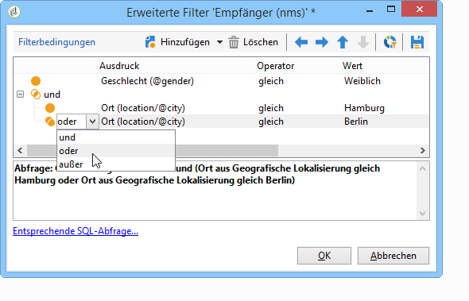

1. Klicken Sie auf **[!UICONTROL OK]**, um die Erstellung des Filters zu bestätigen und ihn auf die Liste anzuwenden.

Der angewendete Filter wird oberhalb der Liste angezeigt.

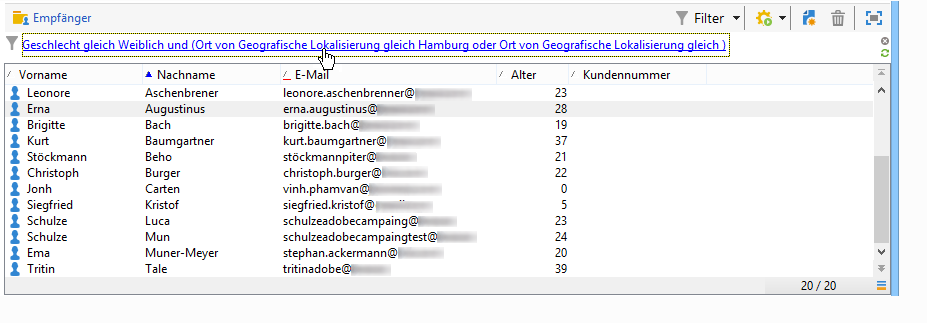

Durch Klick auf seinen Titel kann der Filter bearbeitet werden.

Um den Filter aufzuheben, klicken Sie auf das Symbol **[!UICONTROL Filter entfernen]**, das sich rechts vom Filter befindet.

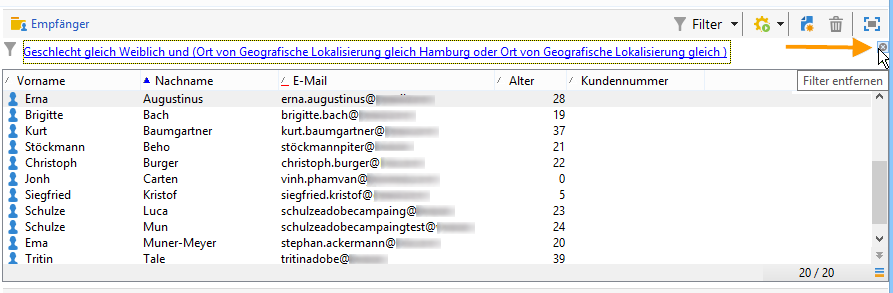

Sie können einen erweiterten Filter speichern, um ihn für die zukünftige Verwendung aufzubewahren. Weitere Informationen zu diesem Filtertyp finden Sie unter [Filter speichern](#saving-a-filter).

### Erweiterte Filter mit Funktionen erstellen {#creating-an-advanced-filter-with-functions}

Erweiterte Filter können Funktionen verwenden: **Filter mit Funktionen** werden über einen Ausdruckseditor erstellt, der es ermöglicht, anhand von Daten aus der Datenbank und erweiterten Funktionen Formeln zu definieren. Befolgen Sie die Schritte 1, 2 und 3 der Erstellung von erweiterten Filtern und gehen Sie anschließend wie folgt vor:

1. Klicken Sie im Fenster der Feldauswahl auf die Schaltfläche **[!UICONTROL Erweiterte Auswahl]**.
1. Wählen Sie den zu verwendenden Formeltyp aus.

   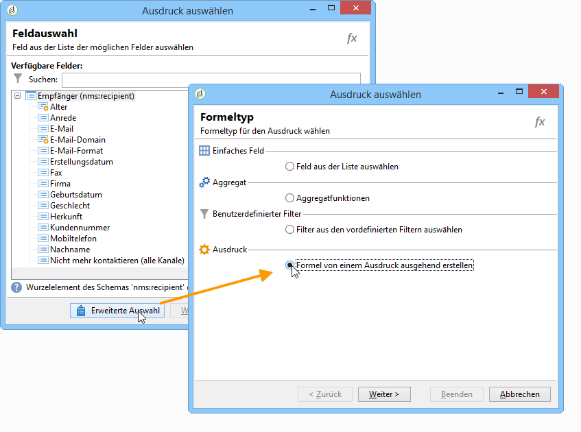

   Folgende Optionen stehen zur Verfügung:

   * **[!UICONTROL Einfaches Feld]**: Standardmodus.
   * **[!UICONTROL Aggregat]**: Auswahl der Aggregatformel (Zählung, Summe, Durchschnitt, minimaler Wert, maximaler Wert).
   * **[!UICONTROL Benutzerfilter]** zur Auswahl eines der vorhandenen Benutzerfilter. Benutzerfilter werden unter [Filter speichern](#saving-a-filter) ausführlich beschrieben.
   * **[!UICONTROL Ausdruck]**: Erstellung mithilfe des Ausdruckseditors.

      Der Ausdruckseditor dient der Erstellung erweiterter Filter. Er gestaltet sich wie folgt:

      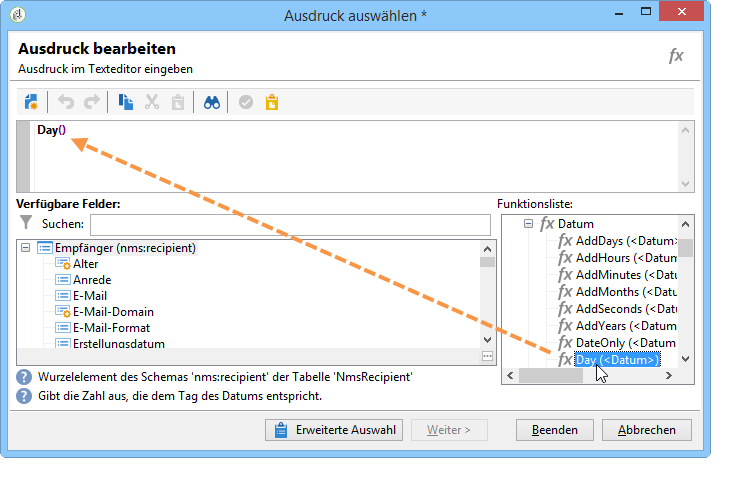

      Es ermöglicht Ihnen, Felder in den Datenbanktabellen auszuwählen und diesen erweiterte Funktionen hinzuzufügen: Wählen Sie die zu verwendende Funktion in der **[!UICONTROL Funktionsliste]** aus. Die verfügbaren Funktionen sind in [Funktionsliste](../../platform/using/defining-filter-conditions.md#list-of-functions) beschrieben. Wählen Sie anschließend das Feld bzw. die Felder aus, die von den Funktionen betroffen sind, und klicken Sie auf **[!UICONTROL OK]**, um den Ausdruck zu validieren.

      >[!NOTE]
      >
      >Im Abschnitt [Identifizieren von Empfängern, die Geburtstag haben](../../workflow/using/sending-a-birthday-email.md#identifying-recipients-whose-birthday-it-is) wird ein Beispiel eines auf einem Ausdruck basierenden Filters dargestellt.

## Filter speichern {#saving-a-filter}

Filter sind jedem Benutzer spezifisch und werden bei jeder Cache-Leerung der Clientkonsole zurückgesetzt.

Sie haben jedoch die Möglichkeit, einen **Anwendungsfilter** durch die Speicherung eines erweiterten Filters zu erstellen. Einmal gespeichert kann dieser über die rechte Maustaste in jeder Liste oder über die Schaltfläche **[!UICONTROL Filter]** oberhalb der Listen wiederverwendet werden.

Direkter Zugriff auf diese Filter besteht zudem über den Versand-Assistenten bei der Zielgruppenbestimmung (nähere Informationen zur Erstellung von Sendungen erhalten Sie in [diesem Abschnitt](../../delivery/using/creating-an-email-delivery.md)). Es gibt folgende Möglichkeiten, einen Anwendungsfilter zu erstellen:

* Umwandlung eines erweiterten Filters in einen Anwendungsfilter: Wählen Sie hierzu **[!UICONTROL Speichern]** aus, bevor Sie den Editor der erweiterten Filter schließen.

   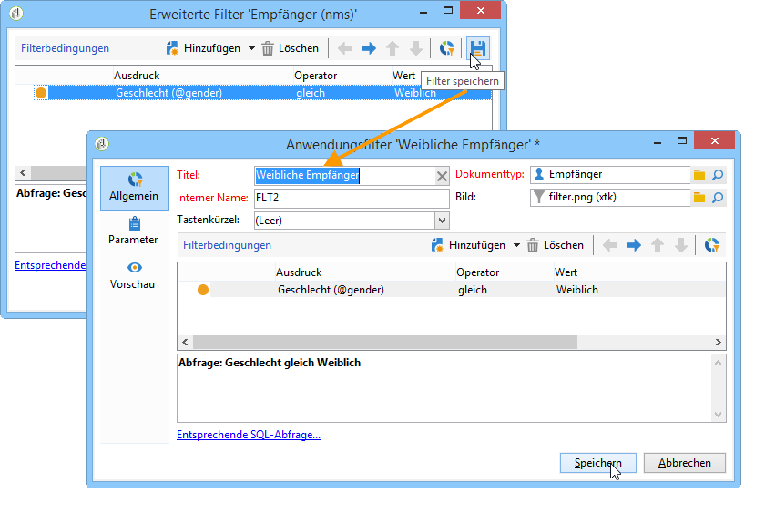

* Erstellung eines Anwendungsfilters über den Verzeichnisknoten **[!UICONTROL Administration > Konfiguration > Vordefinierte Filter]** (oder **[!UICONTROL Profile und Zielgruppen > Vordefinierte Filter]** für Empfänger): Klicken Sie mit der rechten Maustaste in die Filterliste und wählen Sie **[!UICONTROL Neu...]**. Die weitere Verfahrensweise entspricht der Erstellung erweiterter Filter.

   Im Feld **[!UICONTROL Titel]** kann der Filter benannt werden. Der Name erscheint in der Dropdown-Liste der Schaltfläche **[!UICONTROL Filter...]**.

   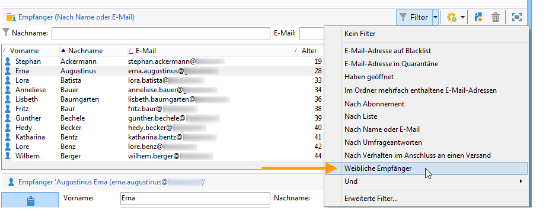

Sie können alle Filter auf der aktuellen Liste über die Option **[!UICONTROL Kein Filter]** aufheben, zugänglich über die rechte Maustaste oder die Schaltfläche **[!UICONTROL Filter]** oberhalb der Liste.

Sie haben die Möglichkeit, Filter über die Schaltfläche **[!UICONTROL Filter]** im Menü **[!UICONTROL Und...]** kombinieren.

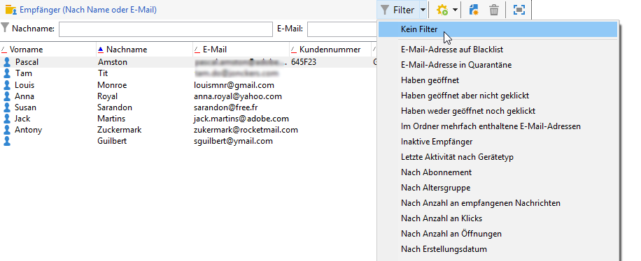

## Empfängerfilter {#filtering-recipients}

Vordefinierte Filter (siehe [Filter speichern ](#saving-a-filter)) ermöglichen es Ihnen, die Profile der in der Datenbank enthaltenen Empfänger zu filtern. Sie können Filter über den Knoten **[!UICONTROL Profile und Zielgruppen > Vordefinierte Filter]** des Baums bearbeiten. Die Filter werden über die Schaltfläche **[!UICONTROL Filter]** im oberen Bereich des Arbeitsbereichs angezeigt.

Wählen Sie einen Filter aus, um seine Parameter anzuzeigen und eine Vorschau der gefilterten Daten zu erhalten.

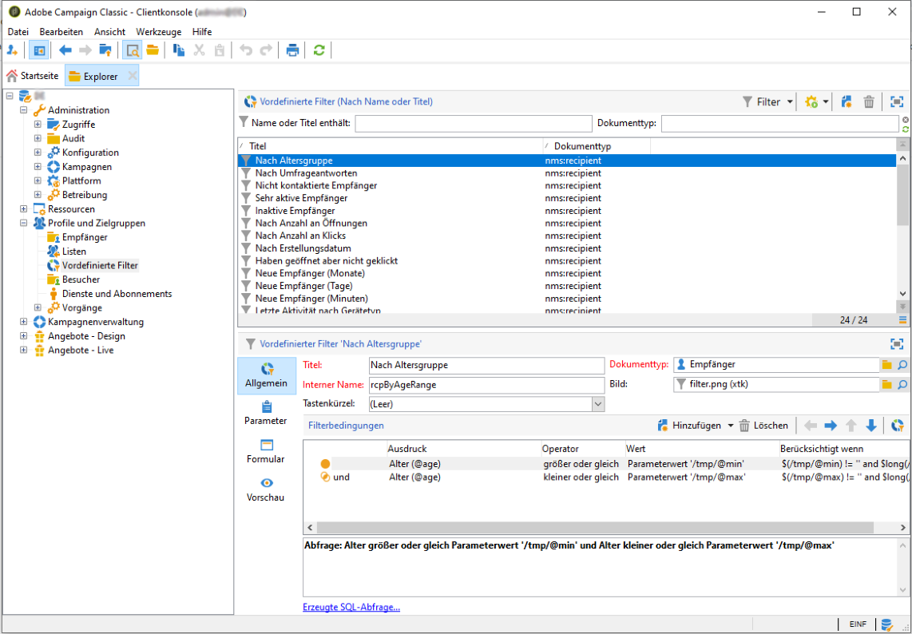

>[!NOTE]
>
>Ein detailliertes Beispiel zur Erstellung vordefinierter Filter finden Sie unter [Anwendungsbeispiel](../../platform/using/use-case.md).

Folgende vordefinierte Filter stehen standardmäßig zur Verfügung:

<table> 
 <tbody> 
  <tr> 
   <td> <strong>Titel</strong>  </td> 
   <td> <strong>Abfrage</strong>  </td> 
  </tr> 
  <tr> 
   <td> Haben geöffnet  </td> 
   <td> Auswahl der Empfänger, die einen Versand geöffnet haben.  </td> 
  </tr> 
  <tr> 
   <td> Haben geöffnet aber nicht geklickt  </td> 
   <td> Auswahl der Empfänger, die den angegebenen Versand geöffnet, aber keinen Link angeklickt haben.  </td> 
  </tr> 
  <tr> 
   <td> Inaktive Empfänger  </td> 
   <td> Auswahl der Empfänger, die seit der angegebenen Anzahl an Monaten keinen Versand geöffnet haben.  </td> 
  </tr> 
  <tr> 
   <td> Letzte Aktivität nach Gerätetyp  </td> 
   <td> Auswahl der Empfänger, die unter Verwendung eines Geräts vom Typ X den Versand Y in den letzten Z Tagen angeklickt oder geöffnet haben.  </td> 
  </tr> 
  <tr> 
   <td> Letzte Aktivität nach Gerätetyp (Tracking)  </td> 
   <td> Auswahl der Empfänger, die unter Verwendung eines Geräts vom Typ X den Versand Y in den letzten Z Tagen angeklickt oder geöffnet haben.  </td> 
  </tr> 
  <tr> 
   <td> Nicht kontaktierte Empfänger  </td> 
   <td> Auswahl der Empfänger, die seit X Monaten nicht über den Kanal Y kontaktiert wurden.  </td> 
  </tr> 
  <tr> 
   <td> Sehr aktive Empfänger  </td> 
   <td> Auswahl der Empfänger, die in den letzten X Monaten mindestens Y Mal geklickt haben.  </td> 
  </tr> 
  <tr> 
 <td> E-Mail-Adresse, die auf die Blockierungsliste gesetzt wurde  </td> 
    <td> Wählt Empfänger aus, deren E-Mail-Adresse sich auf der Blockierungsliste befindet.  </td>
  </tr> 
  <tr> 
   <td> E-Mail-Adresse in Quarantäne  </td> 
   <td> Auswahl der Empfänger, deren E-Mail-Adresse in Quarantäne ist.  </td> 
  </tr> 
  <tr> 
   <td> Im Ordner mehrfach enthaltene E-Mail-Adressen  </td> 
   <td> Auswahl der Empfänger, deren E-Mail-Adresse mehrfach im zugrunde liegenden Ordner enthalten ist.  </td> 
  </tr> 
  <tr> 
   <td> Haben weder geöffnet noch geklickt  </td> 
   <td> Auswahl der Empfänger, die den angegebenen Versand weder geöffnet noch darin auf einen Link geklickt haben.  </td> 
  </tr> 
  <tr> 
   <td> Neue Empfänger (Tage)  </td> 
   <td> Auswahl der Empfänger, die in den letzten X Tagen erstellt wurden.  </td> 
  </tr> 
  <tr> 
   <td> Neue Empfänger (Minuten)  </td> 
   <td> Auswahl der Empfänger, die in den letzten X Minuten erstellt wurden.  </td> 
  </tr> 
  <tr> 
   <td> Neue Empfänger (Monate)  </td> 
   <td> Auswahl der Empfänger, die in den letzten X Monaten erstellt wurden.  </td> 
  </tr> 
  <tr> 
   <td> Nach Abonnement  </td> 
   <td> Auswahl der Empfänger, die den angegebenen Dienst abonniert haben.  </td> 
  </tr> 
  <tr> 
   <td> Nach Klicks auf eine spezifische URL  </td> 
   <td> Auswahl der Empfänger, die im Versand X auf die URL Y geklickt haben.  </td> 
  </tr> 
  <tr> 
   <td> Nach Verhalten im Anschluss an einen Versand  </td> 
   <td> Auswahl der Empfänger, die nach Erhalt des Versands X mit dem Verhalten Y reagiert haben.  </td> 
  </tr> 
  <tr> 
   <td> Nach Erstellungsdatum  </td> 
   <td> Auswahl der Empfänger, die im Zeitraum von vor X bis Y Monaten (jeweils aktuelles Datum abzüglich n Monate) erstellt wurden.  </td> 
  </tr> 
  <tr> 
   <td> Nach Liste  </td> 
   <td> Auswahl der Empfänger, die der angegebenen Liste angehören.  </td> 
  </tr> 
  <tr> 
   <td> Nach Anzahl an Klicks  </td> 
   <td> Auswahl der Empfänger, die in den letzten X Monaten zwischen Y und Z Mal in Sendungen geklickt haben.  </td> 
  </tr> 
  <tr> 
   <td> Nach Anzahl an empfangenen Nachrichten  </td> 
   <td> Auswahl der Empfänger, die über den angegebenen Kanal in den letzten X Monaten zwischen Y und Z Nachrichten erhalten haben.  </td> 
  </tr> 
  <tr> 
   <td> Nach Anzahl an Öffnungen  </td> 
   <td> Auswahl der Empfänger, die in den letzten X Monaten zwischen Y und Z Sendungen geöffnet haben.  </td> 
  </tr> 
  <tr> 
   <td> Nach Name oder E-Mail  </td> 
   <td> Auswahl der Empfänger nach Nachname oder E-Mail-Adresse.  </td> 
  </tr> 
  <tr> 
   <td> Nach Altersgruppen  </td> 
   <td> Auswahl der Empfänger im Alter von X bis Y Jahren.  </td> 
  </tr> 
 </tbody> 
</table>

>[!NOTE]
>
>Alle Zählungen und Zeiträume betreffenden Vergleiche verstehen sich einschließlich der angegebenen Werte.

Zum Beispiel:

* Auswahl der Empfänger im Alter von 30 Jahren und jünger:

   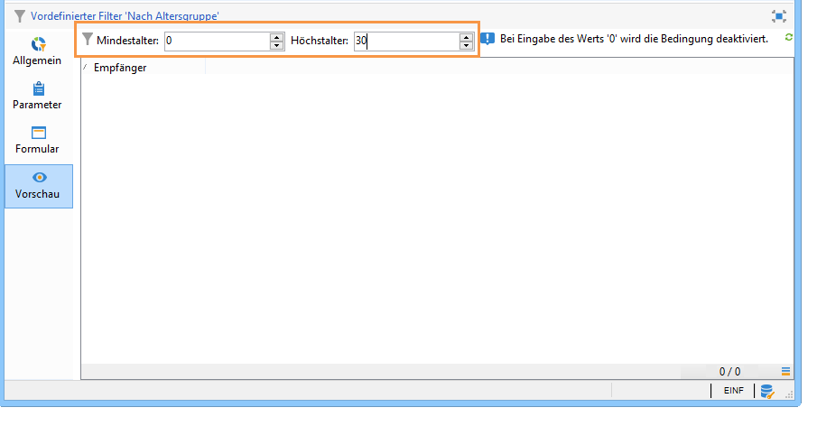

* Auswahl der Empfänger im Alter von 18 Jahren und älter:

   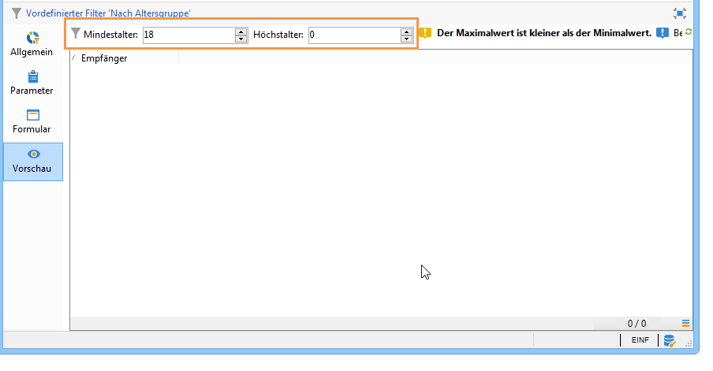

* Auswahl der Empfänger zwischen 18 und 30 Jahren:

   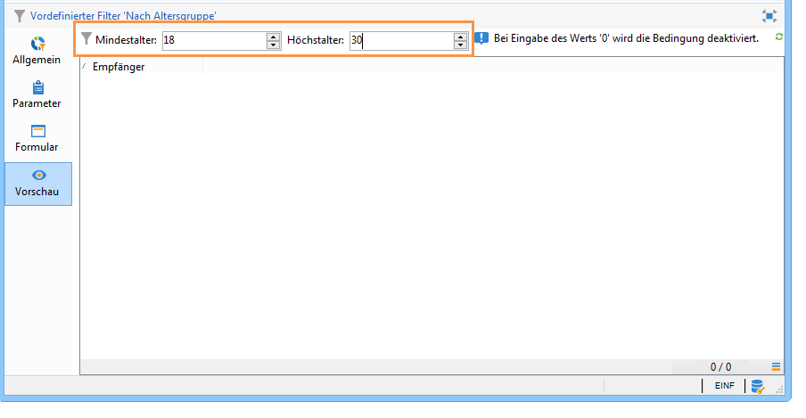

## Erweiterte Parameter von Datenfiltern {#advanced-settings-for-data-filters}

Klicken Sie auf den Tab **[!UICONTROL Parameter]**, um auf folgende Optionen zuzugreifen:

* **[!UICONTROL Standardfilter für diesen Dokumenttyp]**: Ermöglicht es, den entsprechenden Filter standardmäßig im Editor der von der Sortierung betroffenen Listen vorzuschlagen.

   Beispielsweise wird der Filter **[!UICONTROL Nach Name oder Login]** auf Benutzer angewendet. Die Option Standardfilter für diesen Dokumenttyp ist angekreuzt, der Filter wird daher systematisch für alle Benutzerlisten vorgeschlagen.

* **[!UICONTROL Mit anderen Benutzern geteilter Filter]**: Ermöglicht es, den Filter für alle anderen Benutzer der aktuellen Datenbank verfügbar zu machen.
* **[!UICONTROL Nutzung eines Formulars zur Parametereingabe]**: Ermöglicht die Bestimmung des oder der Filterfelder, die bei Auswahl des entsprechenden Filters oberhalb der Liste angezeigt werden. Über diese Felder lassen sich die Parameter des Filters bestimmen. Durch Klick auf die Schaltfläche **[!UICONTROL Formular]** gelangen Sie in den Texteditor, in dem die Parameter im XML-Format einzugeben sind. Der in der Empfängerliste verfügbare vordefinierte Filter **[!UICONTROL Haben geöffnet]** zeigt beispielsweise ein Filterfeld an, das die Einschränkung der Ergebnisse auf einen bestimmten Versand ermöglicht.

   Die Schaltfläche **[!UICONTROL Vorschau]** zeigt das Ergebnis des gewählten Filters an.

* Über den Link **[!UICONTROL Erweiterte Parameter]** können zusätzliche Einstellungen festgelegt werden. Insbesondere kann an dieser Stelle eine SQL-Tabelle mit dem Filter verknüpft werden, um ihn in allen Editoren zugänglich zu machen, die sich auf diese Tabelle beziehen.

   Aktivieren Sie die Option **[!UICONTROL Filter nicht weiter einschränken]**, wenn der Benutzer nicht berechtigt sein soll, den Filter zu überschreiben.

   Diese Option ist zum Beispiel für die im Versand-Assistenten angebotenen Filter &quot;Versandempfänger&quot; und &quot;Zu einem Ordner gehörende Versandempfänger&quot; aktiv, die nicht überschrieben werden können.

   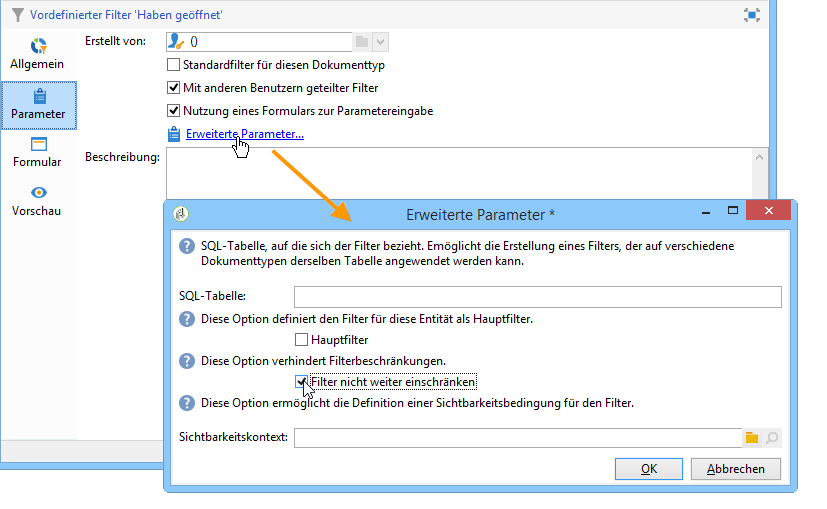

