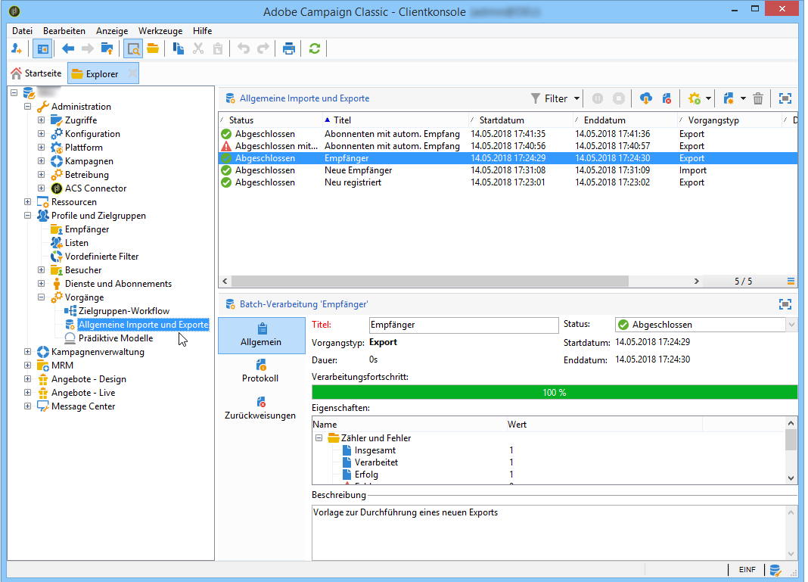

# Erstellen von Import- und Exportaufträgen {#creating-import-export-jobs}

Import- und Exportvorgänge können nach erfolgter Vorlagenkonfiguration in verschiedenen Kontexten von Adobe Campaign gestartet werden.

* Wählen Sie im Adobe Campaign-Arbeitsbereich im Bereich **[!UICONTROL Profile und Zielgruppen]** den Link **[!UICONTROL Aufträge]**. Daraufhin wird eine Liste der existierenden Importe und Exporte angezeigt.

  Verwenden Sie die Schaltfläche **[!UICONTROL Erstellen]** und wählen Sie die gewünschte Option aus.

  

* Sie können Importe und Exporte auch direkt über zwei eigene Links im **[!UICONTROL Monitoring]**-Bereich des Arbeitsbereichs starten.

  

* Auch vom Adobe Campaign-Explorer aus lassen sich Importe und Exporte starten.

  

Bei all diesen Optionen öffnen sich Datenimport- oder -export-Assistenten. Sie werden in den folgenden Abschnitten beschrieben:

* [Importauftrag konfigurieren](../../platform/using/executing-import-jobs.md)
* [Exportauftrag konfigurieren](../../platform/using/executing-export-jobs.md)
