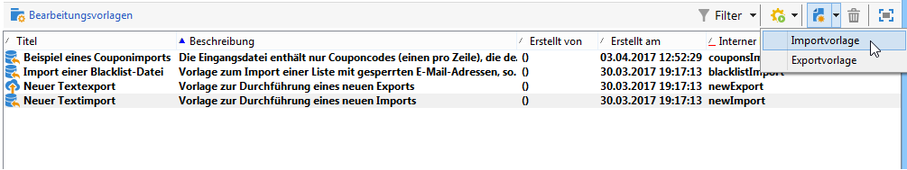

# Erstellen von Import- und Exportvorlagen {#creating-import-export-templates}

Import- und Exportvorlagen finden Sie im Adobe Campaign-Navigationsbaum unter dem Menüpunkt **[!UICONTROL Ressourcen > Vorlagen > Bearbeitungsvorlagen]**.

Standardmäßig sind in diesem Verzeichnis drei Importvorlagen und eine Exportvorlage vorhanden. Sie dürfen nicht geändert werden.

* Die native Vorlage **[!UICONTROL Blockierungsliste importieren]** ist bereits für den Import einer Liste von E-Mail-Adressen konfiguriert, die der Blockierungsliste hinzugefügt wurden.

* Mit den Vorlagen **[!UICONTROL Neuer Textimport]** und **[!UICONTROL Neuer Textexport]** können Sie einen völlig neuen Import oder Export konfigurieren.

Sie können vorhandene Vorlagen zum Erstellen eigener Vorlagen oder zum Erstellen einer neuen Vorlage über das Menü **[!UICONTROL Neu > Importvorlage]** / **[!UICONTROL Exportvorlage]** duplizieren.

Der Prozess zum Konfigurieren einer Vorlage entspricht den in diesen Abschnitten beschriebenen Schritten:

* [Importauftrag konfigurieren](../../platform/using/executing-import-jobs.md)
* [Exportauftrag konfigurieren](../../platform/using/executing-export-jobs.md)
