# CRM-Connectoren{#crm-connectors}

## Über CRM-Connectoren {#about-crm-connectors}

Adobe Campaign stellt verschiedene CRM-Connectoren zur Verfügung, die die Verbindung der Adobe Campaign-Plattform mit Drittsystemen ermöglichen. So erlauben die CRM-Connectoren z. B. das Synchronisieren von Kontakten, Konten und Bestellungen. Zudem vereinfachen sie die Integration der Anwendung in bestehende Systeme.

Dank der Connectoren ist eine schnelle und einfache Datenintegration möglich. Mithilfe eines spezifischen Assistenten lassen sich Daten aus den im CRM-System verfügbaren Tabellen auswählen und sammeln. Die Zwei-Wege-Synchronisation der Informationen gewährleistet einen einheitlichen Datenstand auf den verschiedenen Systemen.

>[!NOTE]
>
>Diese Funktion ist in Adobe Campaign über das **CRM Connectoren-** Package verfügbar.

Die Verbindung mit dem CRM erfolgt über spezielle Workflow-Aktivitäten. Diese sind im jeweiligen Kapitel in [diesem Abschnitt](../../workflow/using/crm-connector.md) beschrieben.

### Kompatible CRM-Systeme und Beschränkungen {#compatible-crm-systems-and-limitations}

Folgende CRM-Systeme lassen sich in Adobe Campaign integrieren.

Die unterstützten Versionen werden in der [Kompatibilitätsmatrix](https://helpx.adobe.com/de/campaign/kb/compatibility-matrix.html) erläutert.

* **Salesforce.com**

   In [diesem Abschnitt](#example-for-salesforce-com) erfahren Sie, wie die Verbindung mit Salesforce.com hergestellt wird.

   >[!IMPORTANT]
   >
   >Bei der Verbindung von Adobe Campaign mit Salesforce.com bestehen folgende Beschränkungen:
   >
   >    
   >    
   >    * Testproduktionsinstanzen werden unterstützt.
   >    * Zuweisungsregeln werden unterstützt.
   >    * Mehrfachauswahl-Auflistungen werden von Adobe Campaign nicht unterstützt.

* **Oracle On Demand**

   In [diesem Abschnitt](#example-for-oracle-on-demand) erfahren Sie, wie die Verbindung mit Oracle On Demand hergestellt wird.

   >[!IMPORTANT]
   >
   >Bei der Verbindung von Adobe Campaign mit Oracle On Demand bestehen folgende Beschränkungen:
   >
   >    
   >    
   >    * Adobe Campaign kann jedes beliebige Objekt in den Standardvorlagen von Oracle On Demand synchronisieren. Wenn Sie personalisierte Tabellen in Oracle On Demand hinzugefügt haben, werden diese nicht in Adobe Campaign abgerufen.
   >    * API Version v1.0 ermöglicht die Sortierung oder Filterung von Daten während einer Abfrage, lässt aber nicht beides gleichzeitig zu.
   >    * Die von Oracle On Demand gesendeten Daten enthalten keine Zeitzoneninformationen.
   >    * Mehrfachauswahl-Auflistungen werden von Adobe Campaign nicht unterstützt.

* **MS Dynamics CRM** und **MS Dynamics Online**

   In [diesem Abschnitt](#example-for-microsoft-dynamics) erfahren Sie, wie die Verbindung mit Microsoft Dynamics hergestellt wird.

   Anwendungsbeispiele zu Integrationen von Adobe Campaign mit Microsoft Dynamics finden Sie in [diesem Video](https://helpx.adobe.com/de/campaign/kt/acc/using/acc-integrate-dynamics365-with-acc-feature-video-set-up.html).

   >[!IMPORTANT]
   >
   >Bei der Verbindung von Adobe Campaign mit Microsoft Dynamics bestehen folgende Beschränkungen:
   >
   >    
   >    
   >    * Die Installation von Plug-ins kann das Verhalten des CRM verändern. Dadurch kann es zu Kompatibilitätsproblemen mit Adobe Campaign kommen.
   >    * Mehrfachauswahl-Auflistungen werden von Adobe Campaign nicht unterstützt.

## Verbindung einrichten {#setting-up-the-connection}

Folgende Schritte sind zu durchlaufen, um CRM-Connectoren in Adobe Campaign zu verwenden:

1. Erstellung eines externen Kontos,
1. Abruf der CRM-Tabellen,
1. Synchronisation der Auflistungen,
1. Erstellung des Synchronisations-Workflows.

>[!NOTE]
>
>Die CRM-Connectoren funktionieren ausschließlich unter Verwendung einer sicheren URL (https).

### Konfiguration für Salesforce.com {#example-for-salesforce-com}

Folgende Schritte sind bei der Konfiguration des **Salesforce.com** Connectors mit Adobe Campaign zu durchlaufen:

1. Erstellen Sie ein neues externes Konto ausgehend vom Knoten **[!UICONTROL Administration > Plattform > Externe Konten]** im Adobe-Campaign-Navigationsbaum.
1. Starten Sie den Konfigurationsassistenten, um die verfügbaren CRM-Tabellen zu erzeugen.

   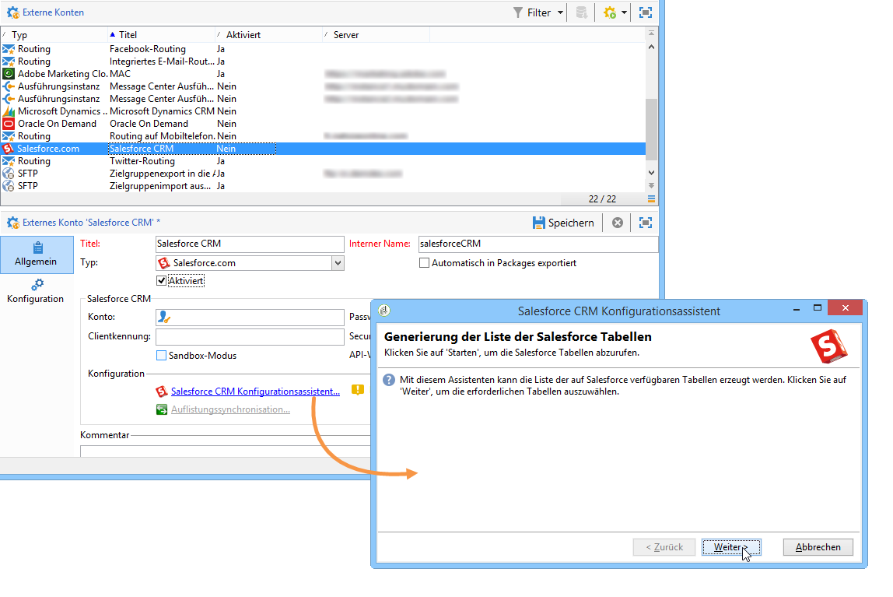

   Der Konfigurationsassistent ruft die Tabellen ab und erstellt das entsprechende Schema.

   Klicken Sie auf **[!UICONTROL Starten]**, um mit dem Abruf zu beginnen.

   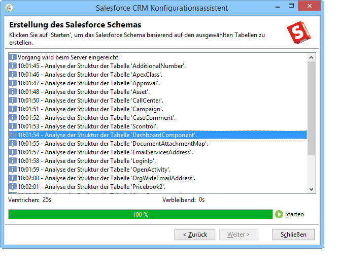

   >[!NOTE]
   >
   >Zur Übernahme der Konfiguration müssen Sie sich von der Konsole ab- und wieder anmelden.

1. Prüfen Sie unter dem Knoten **[!UICONTROL Administration > Konfiguration > Datenschema]** das in Adobe Campaign erzeugte Schema.

   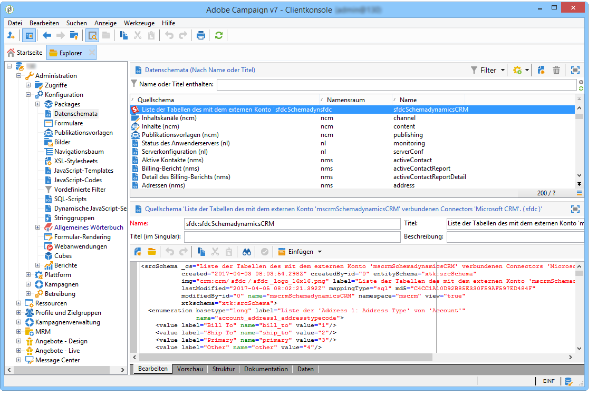

1. Anschließend können Sie automatisch die Auflistungen aus dem CRM-System mit Adobe Campaign synchronisieren.

   Klicken Sie hierzu auf den Link **[!UICONTROL Auflistungen synchronisieren...]** und wählen Sie die der Auflistung des CRM-Systems entsprechende Adobe-Campaign-Auflistung aus.

   Sie können alle Werte einer Adobe-Campaign-Auflistung durch die des CRM-Systems ersetzen: Wählen Sie hierzu in der Spalte **[!UICONTROL Ersetzen]** die Option **[!UICONTROL Ja]**.

   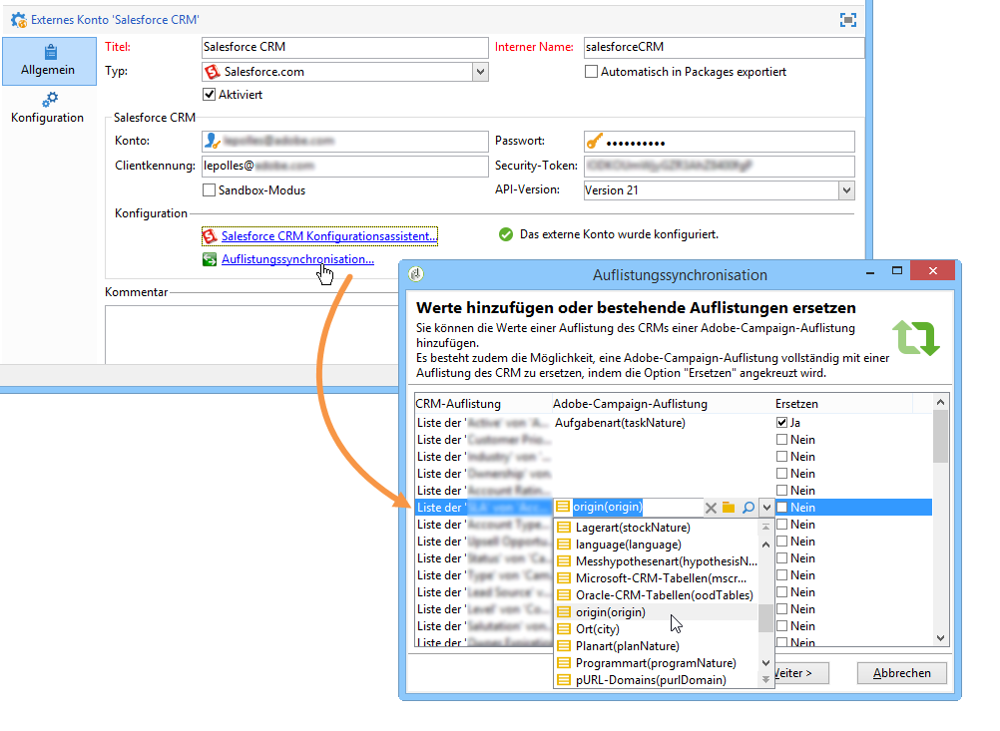

   Klicken Sie abschließend auf **[!UICONTROL Weiter]** und **[!UICONTROL Starten]**, um mit dem Listenimport zu beginnen.

1. Prüfen Sie die importierten Werte im Menü **[!UICONTROL Administration > Plattform > Auflistungen]**.

   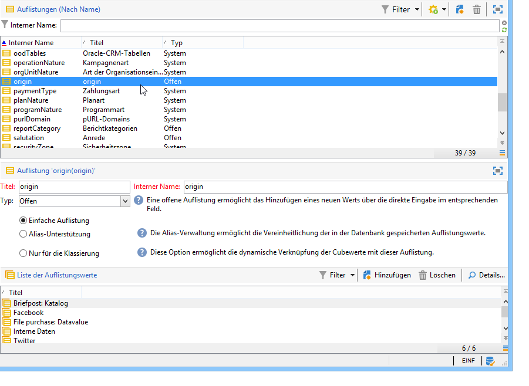

1. Zum Import von Daten aus Salesforce oder zum Export von Adobe-Campaign-Daten in Salesforce müssen Sie einen Workflow erstellen und die Aktivität **[!UICONTROL CRM-Connector]** auswählen.

   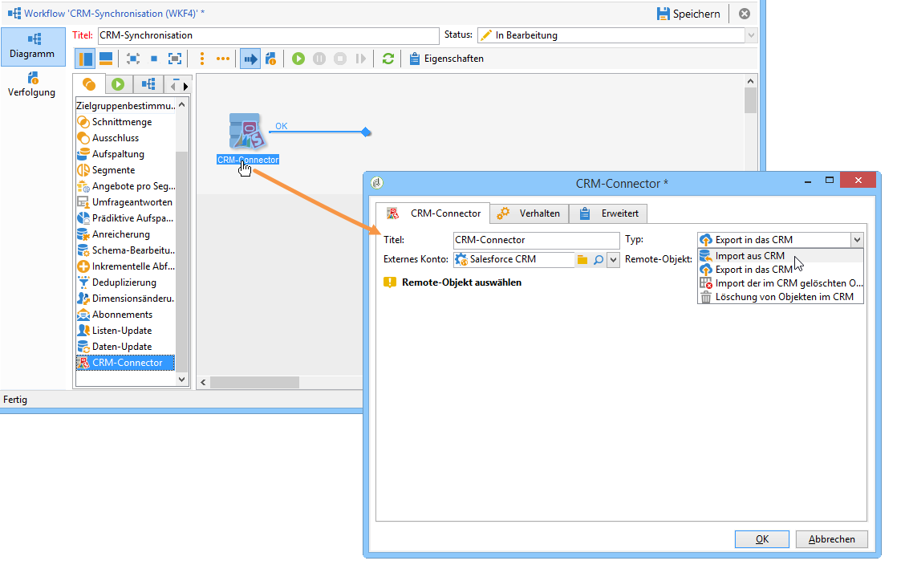

### Konfiguration für Oracle On Demand {#example-for-oracle-on-demand}

Folgende Schritte sind bei der Konfiguration des **Oracle-On-Demand**-Connectors mit Adobe Campaign zu durchlaufen:

1. Erstellen Sie ein neues externes Konto ausgehend vom Knoten **[!UICONTROL Administration > Plattform > Externe Konten]** im Adobe-Campaign-Navigationsbaum.

   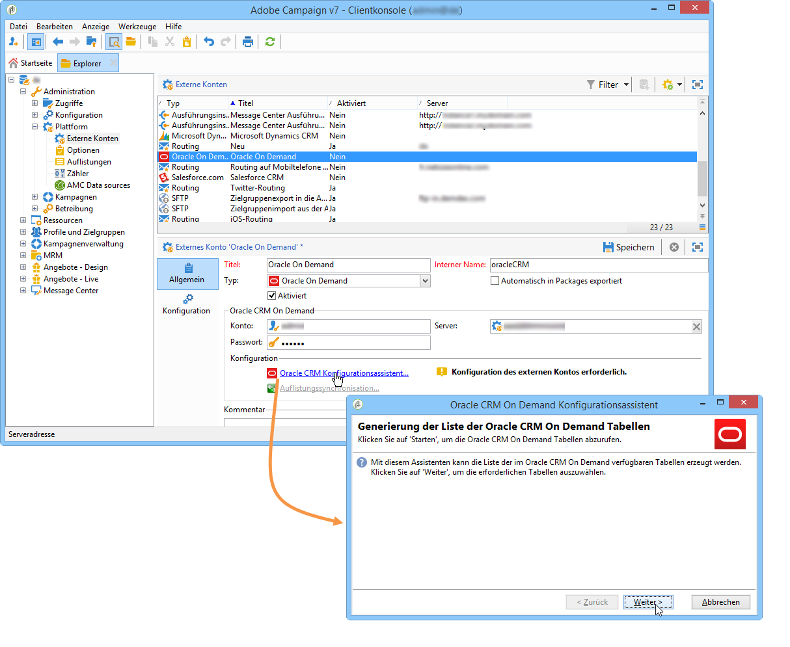

1. Öffnen Sie den Konfigurationsassistenten: Adobe Campaign erkennt automatisch die Tabellen des Oracle-Datenmodells. Wählen Sie die abzurufenden Tabellen aus.

   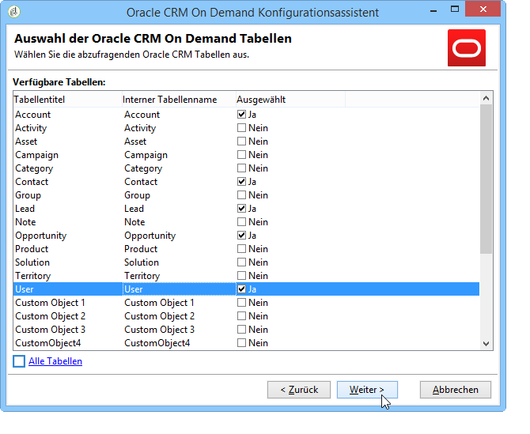

1. Klicken Sie auf **[!UICONTROL Weiter]** und beginnen Sie mit der Erstellung des entsprechenden Schemas.

   Das Datenschema wird hierdurch in der Adobe-Campaign-Anwendung zugänglich.

   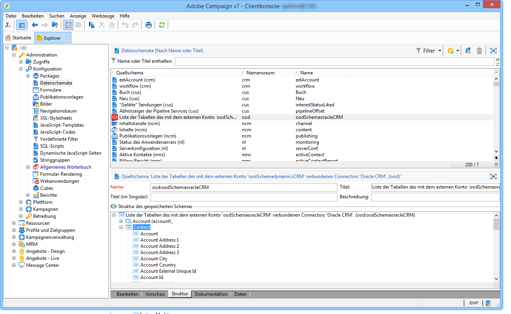

1. Starten Sie nun die Auflistungssynchronisation von Adobe Campaign und Oracle On Demand.

   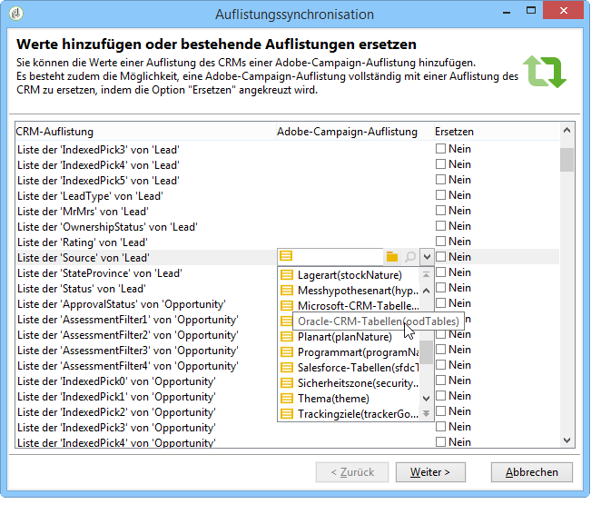

1. Zum Import der Oracle-On-Demand-Daten in Adobe Campaign erstellen Sie einen Workflow nach folgendem Muster:

   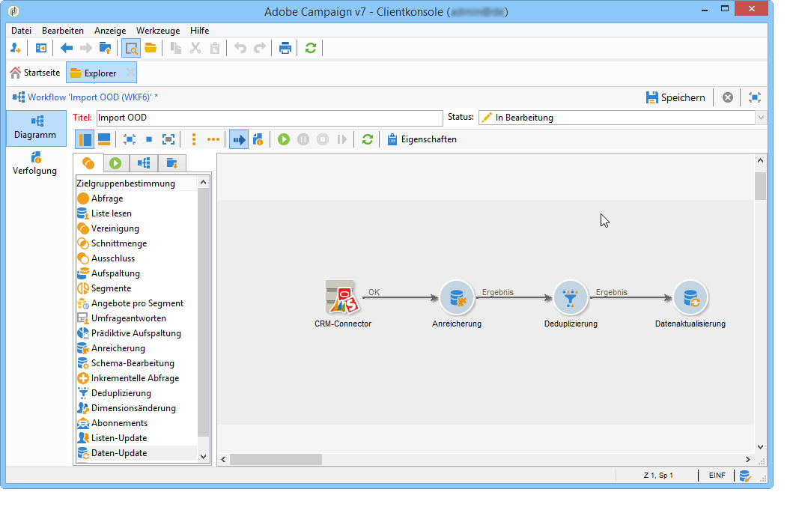

   Dieser Workflow importiert die Kontakte aus Oracle On Demand, synchronisiert sie mit in Adobe Campaign existierenden Daten, dedupliziert die Kontakte und aktualisiert die Adobe-Campaign-Datenbank.

   Die Aktivität **[!UICONTROL CRM-Connector]** ist wie in folgendem Beispiel zu konfigurieren:

   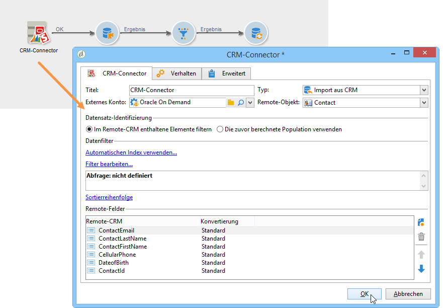

1. Um Adobe-Campaign-Daten in Oracle On Demand zu exportieren, können Sie einen wie unten dargestellten Workflow erstellen:

   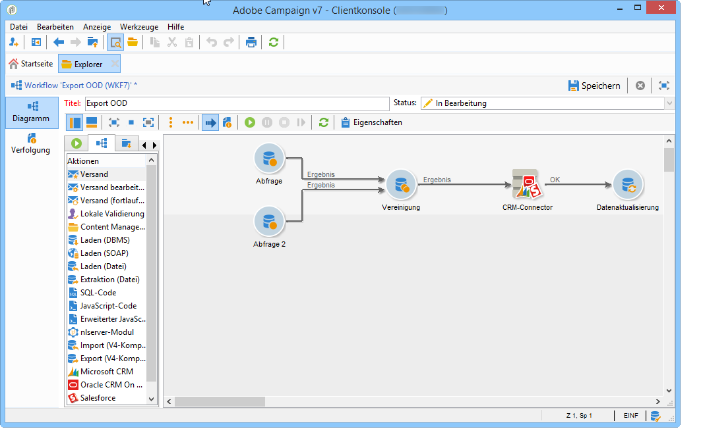

   Dieser Workflow sammelt die gewünschten Daten über Abfragen und exportiert sie in die Kontakttabelle von Oracle On Demand.

### Konfiguration für Microsoft Dynamics {#example-for-microsoft-dynamics}

Folgende Schritte sind bei der Konfiguration des Microsoft Dynamics Connectors mit Adobe Campaign zu durchlaufen:

1. Erstellen Sie ein neues externes Konto ausgehend vom Knoten **[!UICONTROL Administration > Plattform > Externe Konten]** im Adobe-Campaign-Navigationsbaum.

   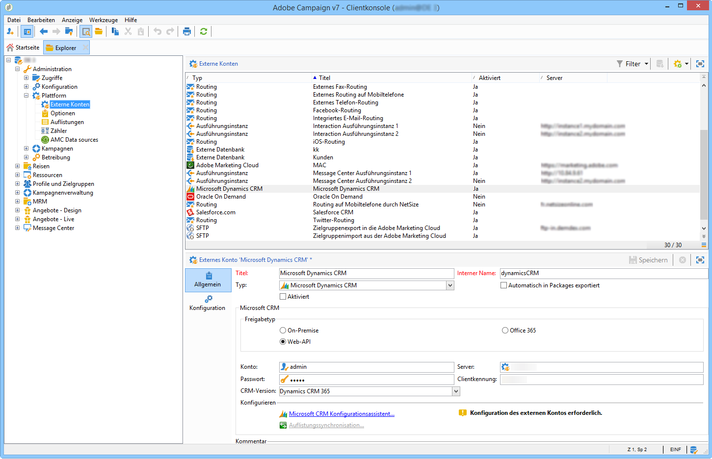

1. Wählen Sie je nach dem Connector, der konfiguriert werden soll, als **Freigabetyp** die Option **[!UICONTROL On-premise]**, **[!UICONTROL Office 365]** oder **[!UICONTROL Web API]** aus.

   Adobe Campaign Classic unterstützt die Dynamics 365 REST-Schnittstelle mit dem OAuth-Protokoll für die Authentifizierung.

   Wenn der Freigabetyp **[!UICONTROL WebAPI]** ausgewählt wurde, müssen Sie eine App in Azure Directory anmelden und die Clientkennung (**clientId**) von Azure Directory abrufen. Eine Beschreibung dieser Anmeldung finden Sie auf [dieser Seite](https://msdn.microsoft.com/de-de/library/mt622431.aspx).

   >[!NOTE]
   >
   >Der Parameter &quot;redirectURL&quot; ist für Adobe Campaign Classic nicht erforderlich.

   Der Wert **clientId** wird zusammen mit dem Benutzernamen/Passwort verwendet, um das Bearer-Token mithilfe des Passworts für Grant Type abzurufen. Dies wird als **Resource Owner Password Credentials Grant** bezeichnet. Weiterführende Informationen dazu finden Sie auf [dieser Seite](https://blogs.msdn.microsoft.com/wushuai/2016/09/25/resource-owner-password-credentials-grant-in-azure-ad-oauth/).

   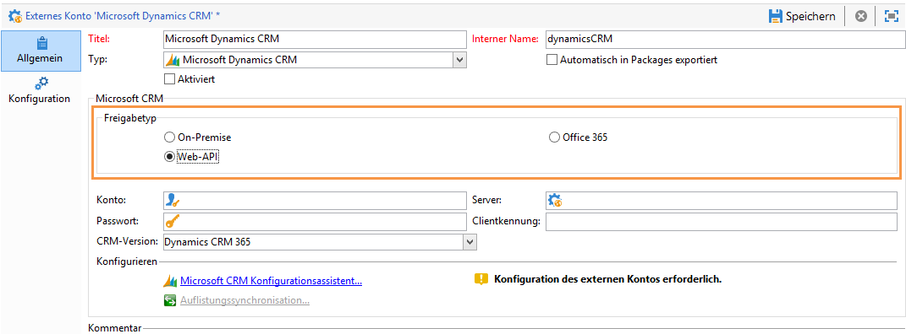

   Weiterführende Informationen bezüglich der Kompatibilität der CRM-Versionen finden Sie in der [Kompatibilitätsmatrix](https://helpx.adobe.com/de/campaign/kb/compatibility-matrix.html).

1. Starten Sie den Konfigurationsassistenten zum automatischen Abruf der Tabellen des Microsoft Dynamics Datenmodells.

   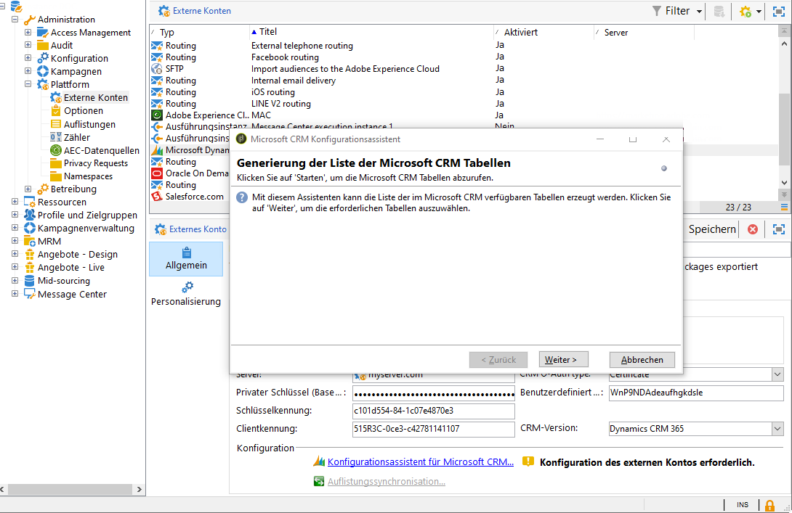

1. Wählen Sie die Tabellen aus, die abgerufen werden sollen.

   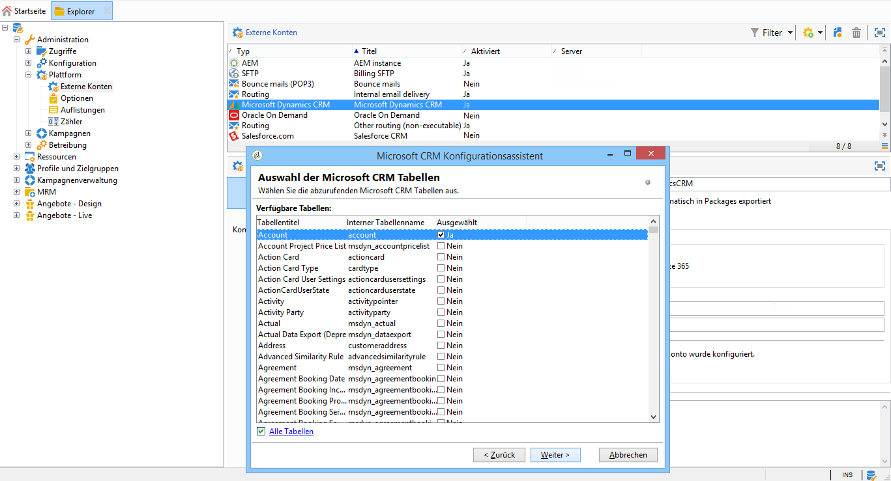

1. Klicken Sie auf **[!UICONTROL Weiter]** und starten Sie die Erstellung des entsprechenden Schemas.

   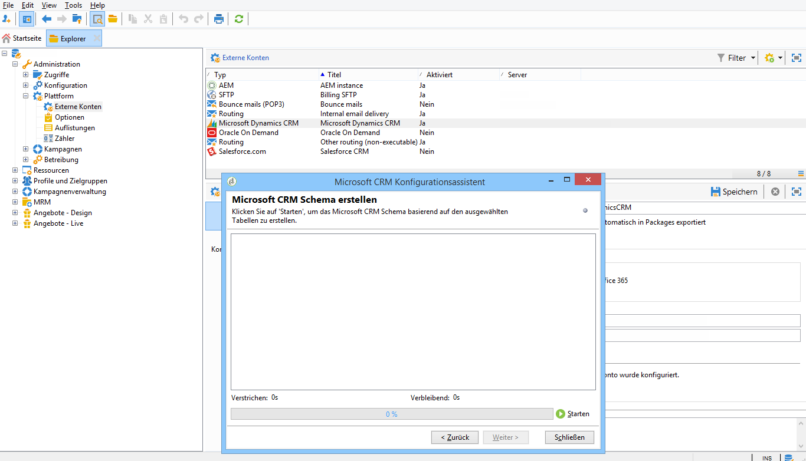

   >[!NOTE]
   >
   >Zur Übernahme der Konfiguration müssen Sie sich von der Konsole ab- und wieder anmelden.

   Das Datenschema wird hierdurch in der Adobe-Campaign-Anwendung zugänglich.

   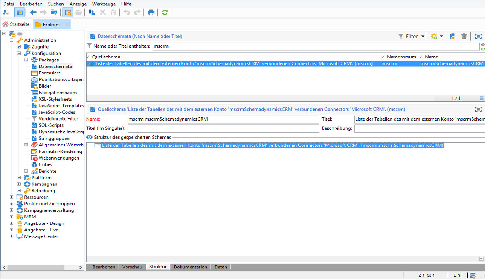

1. Starten Sie nun die Synchronisation der Auflistungen zwischen Adobe Campaign und Microsoft Dynamics.

   

1. Erstellen Sie zum Import der Daten aus Microsoft Dynamics in Adobe Campaign einen Workflow nach folgendem Beispiel:

   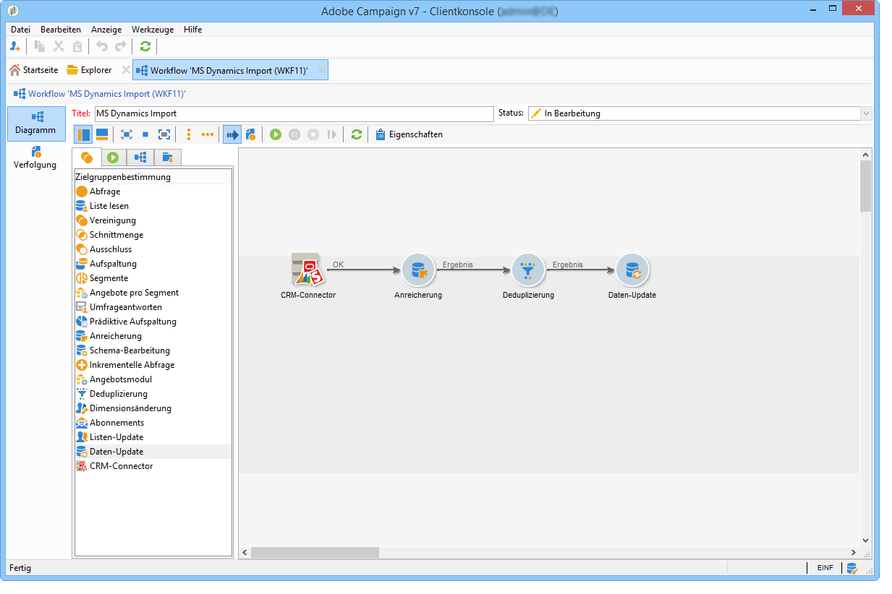

   Dieser Workflow importiert die Kontakte aus Microsoft Dynamics, synchronisiert sie und stimmt sie mit den in Adobe Campaign vorhandenen Daten ab und aktualisiert die Adobe-Campaign-Datenbank.

   Die Aktivität **[!UICONTROL CRM-Connector]** ist wie in folgendem Beispiel zu konfigurieren:

   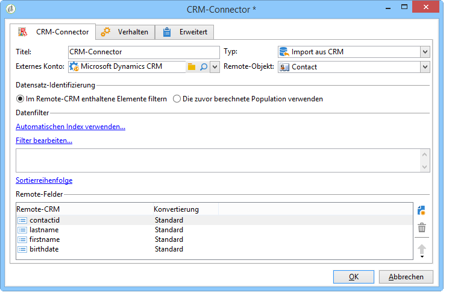

## Datensynchronisation {#data-synchronization}

Die Synchronisation zwischen Adobe Campaign und dem CRM-System geschieht über die spezifische Workflow-Aktivität [CRM-Connector](../../workflow/using/crm-connector.md).

Sie bietet folgende Möglichkeiten:

* Importieren aus CRM (siehe [Import aus CRM](#importing-from-the-crm)),
* Exportieren in CRM (siehe [Export in CRM](#exporting-to-the-crm)),
* Importieren der im CRM gelöschten Objekte (siehe [Import der im CRM gelöschten Objekte](#importing-objects-deleted-in-the-crm)),
* Löschen von Objekten im CRM (siehe [Löschungen von Objekten im CRM](#deleting-objects-in-the-crm)).

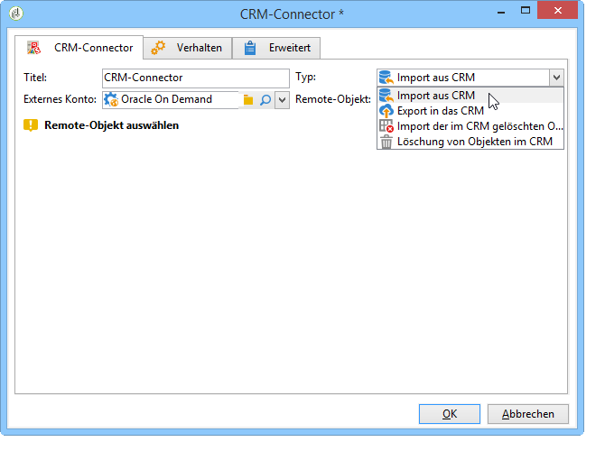

Wählen Sie zunächst das dem CRM-System, mit dem Sie eine Synchronisation konfigurieren möchten, entsprechende externe Konto aus und anschließend das zu synchronisierende Objekt (Konto, Opportunities, Leads, Kontakte etc.).

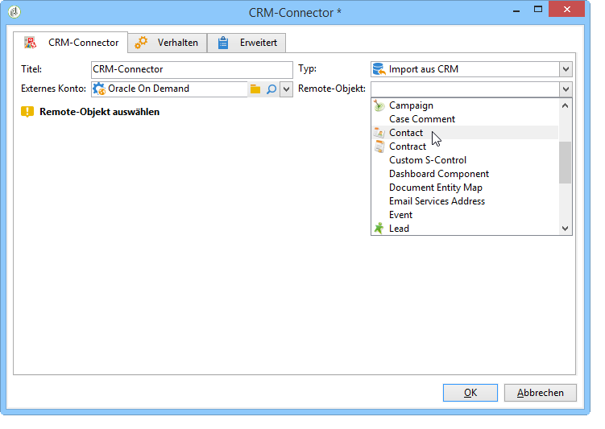

Die Konfiguration der Aktivität hängt von der gewählten Option ab und wird im Folgenden dargestellt:

### Import aus CRM {#importing-from-the-crm}

Zum Import von CRM-Daten in Adobe Campaign ist ein Workflow nach folgendem Muster zu erstellen:

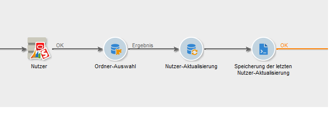

Gehen Sie zur Konfiguration der **CRM-Connector**-Aktivität wie folgt vor:

1. Wählen Sie den Vorgang vom Typ **[!UICONTROL Import aus CRM]**.
1. Wählen Sie in der Dropdown-Liste des Felds **[!UICONTROL Remote-Objekt]** das vom Vorgang betroffene Objekt aus. Das Objekt entspricht einer der Tabellen, die bei der Connector-Konfiguration in Adobe Campaign erstellt wurden.
1. Geben Sie im Abschnitt **[!UICONTROL Remote-Felder]** die zu importierenden Felder an.

   Um ein Feld hinzuzufügen, klicken Sie auf die Schaltfläche **[!UICONTROL Hinzufügen]** in der Symbolleiste und anschließend auf **[!UICONTROL Ausdruck bearbeiten]**.

   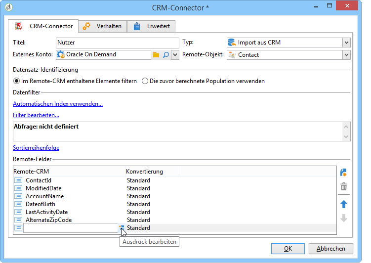

   Falls nötig, kann das Datenformat über die Dropdown-Liste der Spalte **[!UICONTROL Konvertierung]** geändert werden. Mögliche Konvertierungen werden im Abschnitt [Datenformat](#data-format) beschrieben.

   >[!IMPORTANT]
   >
   >Um die Objekte aus dem CRM-System mit denen in der Adobe-Campaign-Anwendung zu verknüpfen, wird die Kennung des CRM-Datensatzes benötigt. Diese wird automatisch bei Bestätigung des Dialogfensters hinzugefügt.
   >
   >Außerdem ist das Datum der letzten CRM-seitigen Änderung erforderlich, um einen inkrementellen Datenimport zu ermöglichen.

1. Je nach Bedarf können die zu importierenden Daten gefiltert werden. Klicken Sie hierzu auf den Link **[!UICONTROL Filter bearbeiten...]**.

   Im folgenden Beispiel importiert Adobe Campaign nur Kontakte, die nach dem 1. November 2012 aktiv waren.

   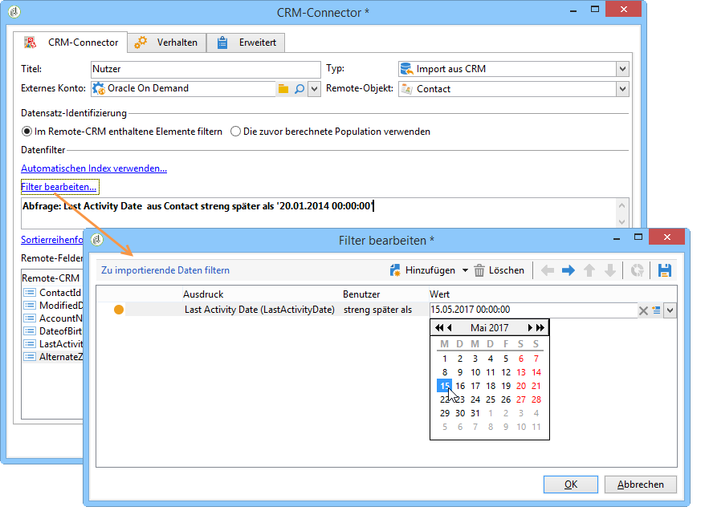

   >[!IMPORTANT]
   >
   >Einschränkungen in Bezug auf Datenfilter werden im Abschnitt [Datenfilter](#filtering-data) beschrieben.

1. Die Option **[!UICONTROL Automatischen Index verwenden...]** erlaubt die automatische Verwaltung der inkrementellen Synchronisation der Objekte zwischen dem CRM-System und Adobe Campaign in Abhängigkeit vom letzten Änderungsdatum.

   Weitere Informationen hierzu finden Sie im Abschnitt [Variablenverwaltung](#variable-management).

#### Variablenverwaltung {#variable-management}

Durch Aktivierung der Option **[!UICONTROL Automatischer Index]** ist es möglich, nur die seit dem letzten Import geänderten Objekte abzurufen.

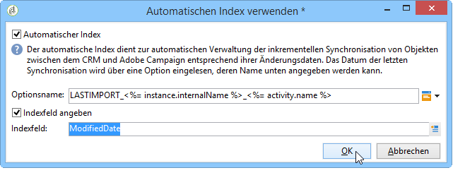

Das Datum der letzten Synchronisation wird in einer im Konfigurationsfenster angezeigten Option gespeichert. Standardmäßig ist dies: **LASTIMPORT_&lt;%=instance.internalName%>_&lt;%=activityName%>**.

>[!NOTE]
>
>Dieser Hinweis gilt nur für die allgemeine **[!UICONTROL CRM-Connector]**-Aktivität. Für andere CRM-Aktivitäten läuft der Prozess automatisch ab.
>
>Diese Option muss unter **[!UICONTROL Administration]** > **[!UICONTROL Plattform]** > **[!UICONTROL Optionen]** manuell erstellt und spezifiziert werden. Dabei muss es sich um eine Textoption handeln, deren Wert das folgende Format aufweist: **jjjj/MM/tt hh:mm:ss**.
> 
>Diese Option muss bei jedem weiteren Import manuell aktualisiert werden.

Sie können jedoch auch ein anderes CRM-Remote-Feld angeben, um die letzten Änderungen zu identifizieren.

Unten stehende Felder kommen (in der angegebenen Reihenfolge) zur Anwendung:

* Bei Microsoft Dynamics: **modifiedon**,
* Bei Oracle On Demand: **LastUpdated**, **ModifiedDate**, **LastLoggedIn**,
* Bei Salesforce.com: **LastModifiedDate**, **SystemModstamp**.

Die Aktivierung der Option **[!UICONTROL Automatischer Index]** erzeugt drei Variablen, die im Synchronisations-Workflow über eine **[!UICONTROL JavaScript]**-Aktivität genutzt werden können. Diese Variablen sind:

* **vars.crmOptionName**: entspricht dem Datum des letzten Imports.
* **vars.crmStartImport**: entspricht dem Startdatum des letzten Datenabrufs (einschließlich).
* **vars.crmEndDate**: entspricht dem Enddatum des letzten Datenabrufs (ausschließlich).

   >[!NOTE]
   >
   >Die Daten werden im Format **yyyy/MM/dd hh:mm:ss** ausgedrückt.

#### Datenfilter {#filtering-data}

Um eine effiziente Funktionsweise mit den diversen CRM-Systemen sicherzustellen, sind bei der Filtererstellung folgende Regeln zu beachten:

* Jedes Filterniveau darf nur einen Operatortyp verwenden.
* Der AND-NOT-Operator wird nicht unterstützt.
* Vergleiche dürfen sich nur auf Werte vom Typ &quot;ist leer&quot;/&quot;ist nicht leer&quot; oder auf Zahlen beziehen. Der Wert (rechte Spalte) wird ausgewertet und das Ergebnis muss eine Zahl sein. JOIN-Vergleiche werden nicht unterstützt.
* Der in der rechten Spalte angegebene Wert wird in JavaScript ausgewertet.
* Vergleiche vom Typ JOIN werden nicht unterstützt.
* Der Ausdruck (linke Spalte) muss zwingend ein Feld sein. Er darf weder eine Kombination aus mehreren Ausdrücken, noch eine Ziffer usw. sein.

So wäre z. B. folgende Filterbedingung im Rahmen eines CRM-Imports UNGÜLTIG, da der ODER-Operator auf demselben Niveau wie die UND-Operatoren verwendet werden:

* der ODER-Operator sich auf dem gleichen Niveau wie die UND-Operatoren befinden;
* die Vergleiche sich auf Zeichenketten beziehen.

#### Sortierreihenfolge {#order-by}

In Microsoft Dynamics und Salesforce.com haben Sie die Möglichkeit, die zu importierenden Remote-Felder auf- oder absteigend zu sortieren.

Klicken Sie hierfür auf **[!UICONTROL Sortierreihenfolge]** und fügen Sie die Spalten zur Liste hinzu.

Die Spaltenreihenfolge der Liste zeigt die Sortierreihenfolge an:

#### Datensatz-Identifizierung {#record-identification}

Statt im CRM-System enthaltene (und u. U. gefilterte) Elemente direkt zu importieren, können Sie eine zuvor im Workflow berechnete Population verwenden.

Kreuzen Sie hierfür die Option **[!UICONTROL Die zuvor berechnete Population verwenden]** an und geben Sie das die Remote-Kennung enthaltende Feld an.

Wählen Sie anschließend die aus der Eingangspopulation zu importierenden Felder wie in unten stehendem Beispiel aus:

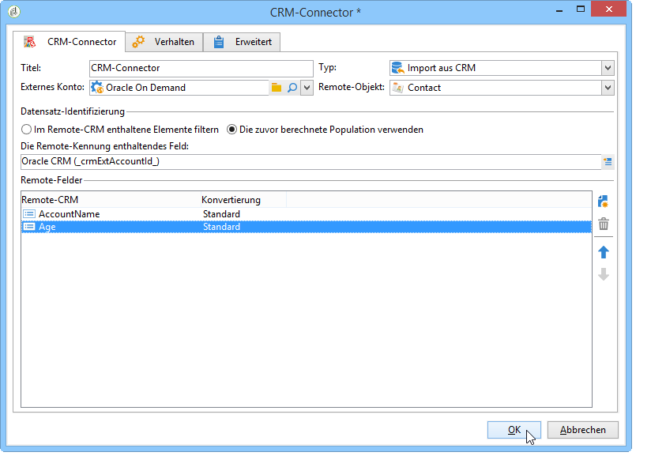

### Export in CRM {#exporting-to-the-crm}

Der Export von Daten aus Adobe Campaign ermöglicht die vollständige Kopie eines Inhalts in ein CRM-System.

Zum Export von Daten in ein CRM-System ist ein Workflow nach folgendem Muster zu erstellen:

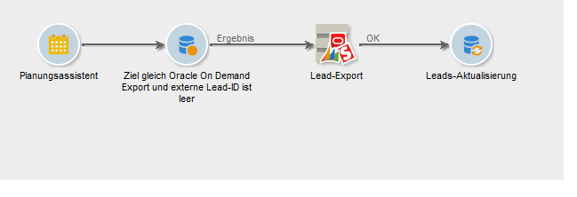

Gehen Sie bei der Konfiguration der **CRM-Connector**-Aktivität wie folgt vor:

1. Wählen Sie den Vorgang vom Typ **[!UICONTROL Export in das CRM]**.
1. Wählen Sie in der Dropdown-Liste des Felds **[!UICONTROL Remote-Objekt]** das vom Vorgang betroffene Objekt aus. Das Objekt entspricht einer der Tabellen, die bei der Connector-Konfiguration in Adobe Campaign erstellt wurden.

   >[!IMPORTANT]
   >
   >Die Exportfunktion der **CRM-Connector**-Aktivität ist in der Lage, Felder zum CRM-System hinzuzufügen oder existierende Felder zu aktualisieren. Für die Aktualisierung ist die Angabe des Primärschlüssels der Remote-Tabelle erforderlich. Andernfalls werden die Daten hinzugefügt (und nicht aktualisiert).

1. Geben Sie im Abschnitt **[!UICONTROL Mapping]** die zu exportierenden Adobe-Campaign-Felder und die entsprechenden CRM-Felder an.

   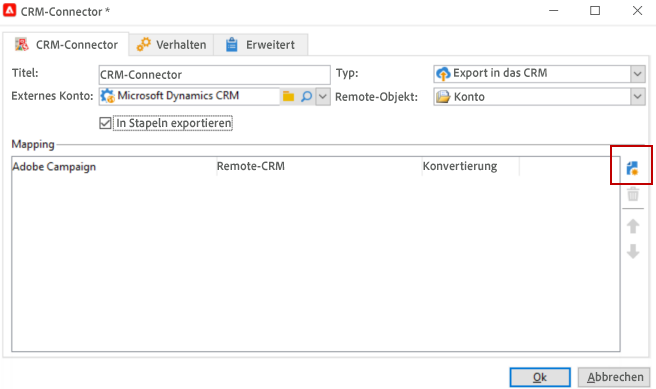

   Um ein Feld hinzuzufügen, klicken Sie auf die Schaltfläche **[!UICONTROL Hinzufügen]** in der Symbolleiste und anschließend auf **[!UICONTROL Ausdruck bearbeiten]**.

   >[!NOTE]
   >
   >Wenn für ein Feld keine CRM-seitige Entsprechung existiert, werden die enthaltenen Werte nicht aktualisiert, sondern direkt dem CRM-System hinzugefügt.

   Falls nötig, kann das Datenformat über die Dropdown-Liste der Spalte **[!UICONTROL Konvertierung]** geändert werden. Mögliche Konvertierungen werden im Abschnitt [Datenformat](#data-format) beschrieben.

   >[!NOTE]
   >
   >Die Liste der zu exportierenden Datensätze und das Exportergebnis werden in einer temporären Datei gespeichert, die zugänglich bleibt, solange der Workflow nicht abgeschlossen oder neu gestartet wurde. Dies gewährleistet, dass der Vorgang im Falle von Fehlern wieder aufgenommen werden kann, ohne Gefahr zu laufen, einen Datensatz mehrmals zu exportieren oder Daten zu verlieren.

### Ergänzende Konfigurationen {#additional-configurations}

#### Datenformat {#data-format}

Es besteht die Möglichkeit, das Datenformat beim Import aus dem oder beim Export in das CRM-System direkt zu konvertieren.

Wählen Sie hierzu in der entsprechenden Spalte die anzuwendende Konvertierung aus.

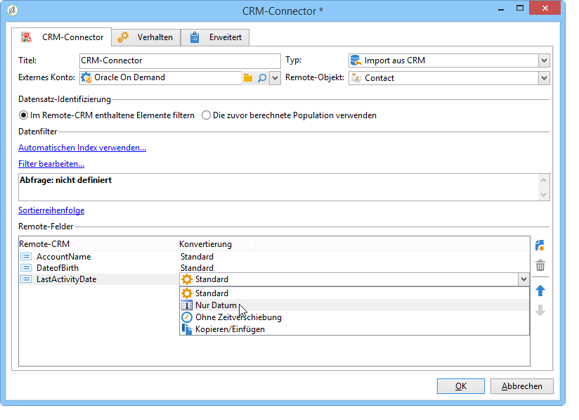

Im **[!UICONTROL Standard]**-Modus entspricht die Konvertierung zumeist einem einfachen Kopieren/Einfügen der Daten. Die verschiedenen Zeitzonen werden in jedem Fall berücksichtigt.

Darüber hinaus sind folgende Konvertierungen möglich:

* **[!UICONTROL Nur Datum]**: löscht die Uhrzeit aus Feldern vom Typ Datum+Uhrzeit.
* **[!UICONTROL Ohne Zeitverschiebung]**: gibt im Gegensatz zum Standardmodus die Uhrzeit ohne Berücksichtigung der Zeitzonen wieder.
* **[!UICONTROL Kopieren/Einfügen]**: verwendet die ursprünglichen Daten als Strings weiter (keine Konvertierung).

#### Umgang mit Fehlern {#error-processing}

Im Rahmen eines Imports oder Exports ist es möglich, einen spezifischen Umgang mit Fehlern und Zurückweisungen zu definieren. Wählen Sie diesbezüglich im Tab **[!UICONTROL Verhalten]** die Optionen **[!UICONTROL Zurückweisungen in einer Datei speichern]** und **[!UICONTROL Fehler verarbeiten]** aus.

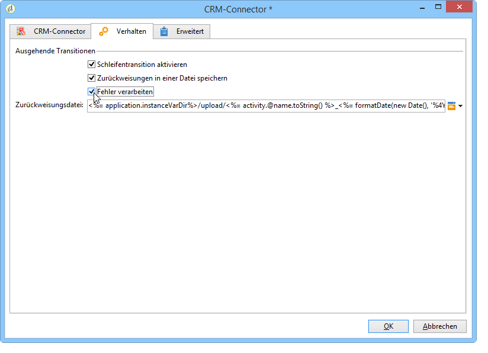

Diese Optionen erzeugen die entsprechenden ausgehenden Transitionen.

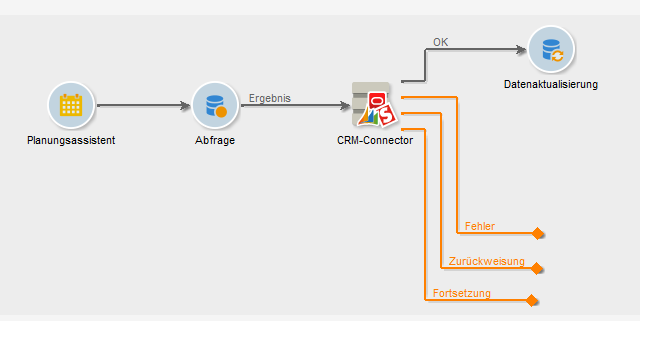

Nun können Sie nach Wunsch Aktivitäten im Zusammenhang mit den Vorgängen positionieren.

Im Bezug auf den Umgang mit Fehlern können Sie beispielsweise eine Warte-Aktivität anfügen und Wiederaufnahmen vorsehen.

Zurückweisungen werden mit dem Fehlercode und der entsprechenden Nachricht erfasst. Dies bietet die Möglichkeit, eine Zurückweisungsverfolgung zu etablieren, um Ihre Synchronisationsprozesse zu optimieren.

>[!NOTE]
>
>Auch wenn die Option **[!UICONTROL Zurückweisungen in einer Datei speichern]** nicht aktiviert wurde, werden für jede zurückgewiesene Spalte ein Fehlercode und die entsprechende Nachricht erzeugt.

Die ausgehende Transition **[!UICONTROL Zurückweisung]** verleiht Zugang zum Ausgabeschema, welches die Spalten für Fehlercodes- und -nachrichten enthält. Die Spalten präsentieren sich wie folgt:

* Bei Oracle On Demand: **errorLogFilename** (Name der Protokolldatei bei Oracle), **errorCode** (Fehlercode), **errorSymbol** (Fehlersymbol, unterscheidet sich vom Fehlercode), **errorMessage** (Beschreibung des Fehlerkontexts).
* Bei Salesforce.com: **errorSymbol** (Fehlersymbol, unterscheidet sich vom Fehlercode), **errorMessage** (Beschreibung des Fehlerkontexts).

### Import der im CRM gelöschten Objekte {#importing-objects-deleted-in-the-crm}

Für eine umfassende Datensynchronisation besteht die Möglichkeit, CRM-seitig gelöschte Objekte in Adobe Campaign zu importieren.

Gehen Sie hierzu wie folgt vor:

1. Wählen Sie den Vorgang vom Typ **[!UICONTROL Import der im CRM gelöschten Objekte]** aus.
1. Wählen Sie in der Dropdown-Liste des Felds **[!UICONTROL Remote-Objekt]** das vom Vorgang betroffene Objekt aus. Das Objekt entspricht einer der Tabellen, die bei der Connector-Konfiguration in Adobe Campaign erstellt wurden.
1. Bestimmen Sie durch Eingabe von **[!UICONTROL Startdatum]** und **[!UICONTROL Enddatum]** den Zeitraum, für den gelöschte Objekte importiert werden sollen. Der Zeitraum versteht sich einschließlich Start- und Enddatum.

   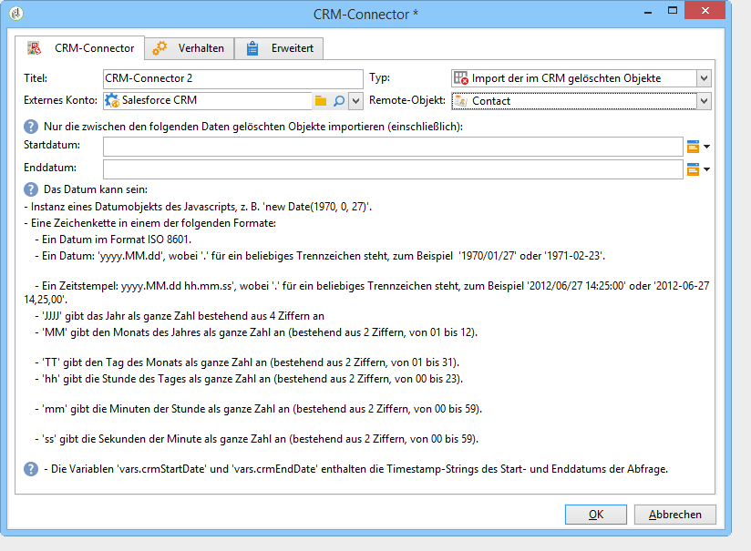

   >[!IMPORTANT]
   >
   >Der Löschzeitraum für die zu importierenden Objekte muss die Einschränkungen des jeweiligen CRM-Systems berücksichtigen. So ist es z. B. in Salesforce.com nicht möglich, Daten abzurufen, die vor mehr als 30 Tagen gelöscht wurden.

### Löschung von Objekten im CRM {#deleting-objects-in-the-crm}

Zur Löschung von Objekten im CRM ist die Angabe der Primärschlüssel der zu löschenden Remote-Elemente erforderlich.

Im Tab **[!UICONTROL Verhalten]** kann die Zurückweisungsverarbeitung aktiviert werden. Dies erzeugt eine weitere ausgehende Transition aus der **[!UICONTROL CRM-Connector]**-Aktivität. Konsultieren Sie diesbezüglich die [Fehlerverarbeitung](#error-processing).

>[!NOTE]
>
>Auch wenn die Option **[!UICONTROL Zurückweisungen in einer Datei speichern]** nicht aktiviert wurde, wird für jede zurückgewiesene Spalte ein Warnhinweis erzeugt.

