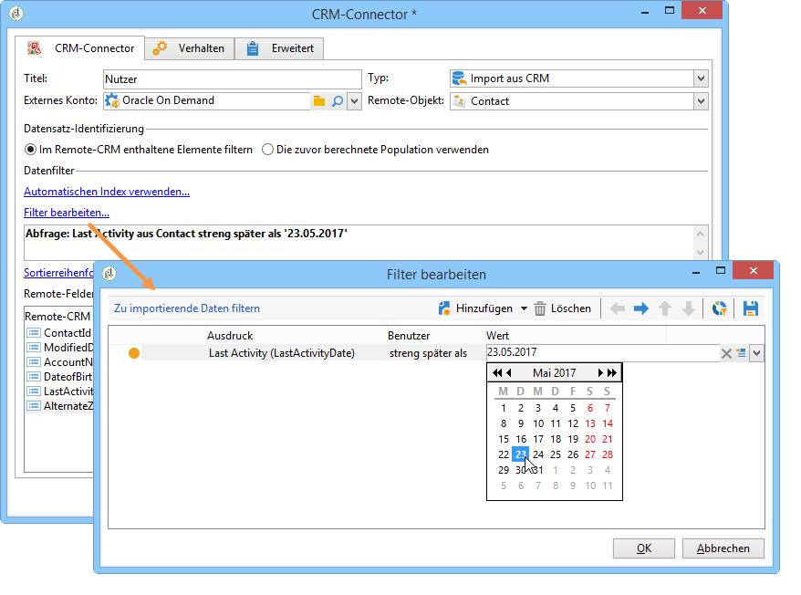
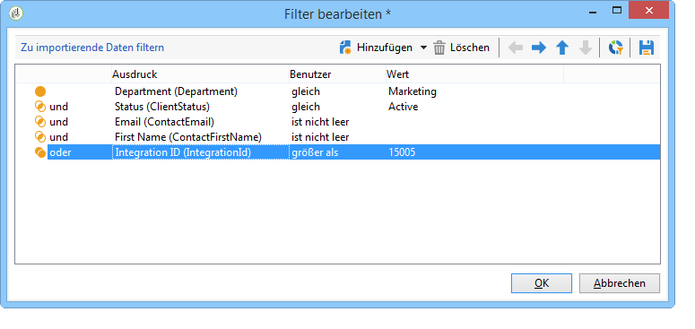
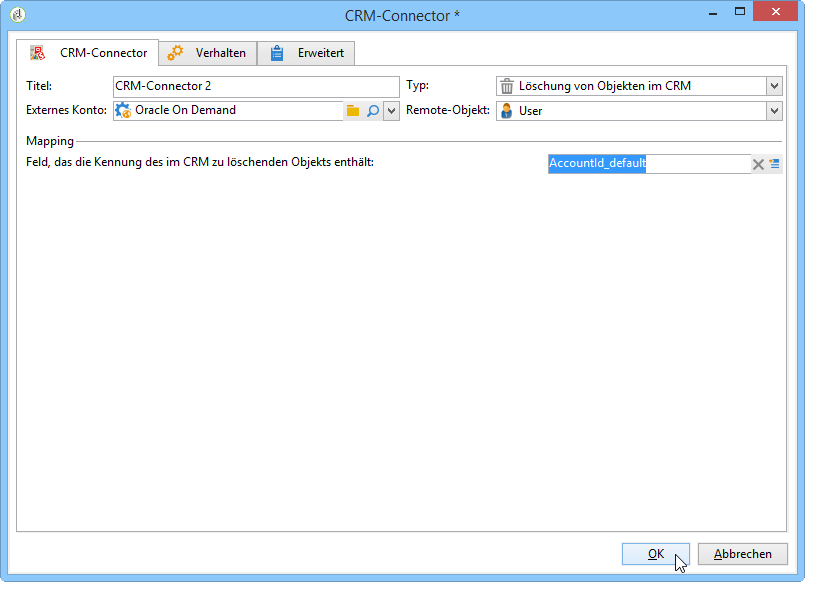

# CRM-Connectoren{#crm-connectors}

## Über CRM-Connectoren {#about-crm-connectors}

Adobe Campaign stellt verschiedene CRM-Connectoren zur Verfügung, die die Verbindung der Adobe Campaign-Plattform mit Drittsystemen ermöglichen. So erlauben die CRM-Connectoren z. B. das Synchronisieren von Kontakten, Konten und Bestellungen. Zudem vereinfachen sie die Integration der Anwendung in bestehende Systeme.

Dank der Connectoren ist eine schnelle und einfache Datenintegration möglich. Mithilfe eines spezifischen Assistenten lassen sich Daten aus den im CRM-System verfügbaren Tabellen auswählen und sammeln. Die Zwei-Wege-Synchronisation der Informationen gewährleistet einen einheitlichen Datenstand auf den verschiedenen Systemen.

>[!NOTE]
>
>Diese Funktion ist in Adobe Campaign über das **CRM Connectoren-** Package verfügbar.

Die Verbindung mit dem CRM erfolgt über spezielle Workflow-Aktivitäten. Diese sind im jeweiligen Kapitel in [diesem Abschnitt](../../workflow/using/crm-connector.md) beschrieben.

### Kompatible CRM-Systeme und Beschränkungen {#compatible-crm-systems-and-limitations}

Folgende CRM-Systeme lassen sich in Adobe Campaign integrieren.

Die unterstützten Versionen werden in der [Kompatibilitätsmatrix](https://helpx.adobe.com/campaign/kb/compatibility-matrix.html) erläutert.

* **Salesforce.com**

   In [diesem Abschnitt](#example-for-salesforce-com) erfahren Sie, wie die Verbindung mit Salesforce.com hergestellt wird.

   >[!CAUTION]
   >
   >Bei der Verbindung von Adobe Campaign mit Salesforce.com bestehen folgende Beschränkungen:
   >
   >    
   >    
   >    * Testproduktionsinstanzen werden unterstützt.
   >    * Zuweisungsregeln werden unterstützt.
   >    * Mehrfachauswahl-Auflistungen werden von Adobe Campaign nicht unterstützt.

* **Oracle On Demand**

   In [diesem Abschnitt](#example-for-oracle-on-demand) erfahren Sie, wie die Verbindung mit Oracle On Demand hergestellt wird.

   >[!CAUTION]
   >
   >Bei der Verbindung von Adobe Campaign mit Oracle On Demand bestehen folgende Beschränkungen:
   >
   >    
   >    
   >    * Adobe Campaign kann jedes beliebige Objekt in den Standardvorlagen von Oracle On Demand synchronisieren. Wenn Sie personalisierte Tabellen in Oracle On Demand hinzugefügt haben, werden diese nicht in Adobe Campaign abgerufen.
   >    * API Version v1.0 ermöglicht die Sortierung oder Filterung von Daten während einer Abfrage, lässt aber nicht beides gleichzeitig zu.
   >    * Die von Oracle On Demand gesendeten Daten enthalten keine Zeitzoneninformationen.
   >    * Mehrfachauswahl-Auflistungen werden von Adobe Campaign nicht unterstützt.

* **MS Dynamics CRM** und **MS Dynamics Online**

   In [diesem Abschnitt](#example-for-microsoft-dynamics) erfahren Sie, wie die Verbindung mit Microsoft Dynamics hergestellt wird.

   Anwendungsbeispiele zu Integrationen von Adobe Campaign mit Microsoft Dynamics finden Sie in [diesem Video](https://helpx.adobe.com/campaign/kt/acc/using/acc-integrate-dynamics365-with-acc-feature-video-set-up.html).

   >[!CAUTION]
   >
   >Bei der Verbindung von Adobe Campaign mit Microsoft Dynamics bestehen folgende Beschränkungen:
   >
   >    
   >    
   >    * Die Installation von Plug-ins kann das Verhalten des CRM verändern. Dadurch kann es zu Kompatibilitätsproblemen mit Adobe Campaign kommen.
   >    * Mehrfachauswahl-Auflistungen werden von Adobe Campaign nicht unterstützt.

## Verbindung einrichten {#setting-up-the-connection}

Folgende Schritte sind zu durchlaufen, um CRM-Connectoren in Adobe Campaign zu verwenden:

1. Erstellung eines externen Kontos,
1. Abruf der CRM-Tabellen,
1. Synchronisation der Auflistungen,
1. Erstellung des Synchronisations-Workflows.

>[!NOTE]
>
>Die CRM-Connectoren funktionieren ausschließlich unter Verwendung einer sicheren URL (https).

### Konfiguration für Salesforce.com {#example-for-salesforce-com}

Folgende Schritte sind bei der Konfiguration des **Salesforce.com** Connectors mit Adobe Campaign zu durchlaufen:

1. Create a new external account via the **[!UICONTROL Administration > Platform > External accounts]** node of the Adobe Campaign tree.
1. Starten Sie den Konfigurationsassistenten, um die verfügbaren CRM-Tabellen zu erzeugen.

   

   Der Konfigurationsassistent ruft die Tabellen ab und erstellt das entsprechende Schema.

   Click **[!UICONTROL Start]** to run the execution.

   

   >[!NOTE]
   >
   >Zur Übernahme der Konfiguration müssen Sie sich von der Konsole ab- und wieder anmelden.

1. Überprüfen Sie das in Adobe Campaign generierte Schema im **[!UICONTROL Administration > Configuration > Data schemas]** Knoten.

   

1. Anschließend können Sie automatisch die Auflistungen aus dem CRM-System mit Adobe Campaign synchronisieren.

   To do this, click the **[!UICONTROL Synchronizing enumerations...]** link and select the Adobe Campaign enumeration that matches the CRM enumeration.

   You can replace all values of an Adobe Campaign enumeration with those of the CRM: to do this, select **[!UICONTROL Yes]** in the **[!UICONTROL Replace]** column.

   

   Click **[!UICONTROL Next]** and then **[!UICONTROL Start]** to start importing the list.

1. Überprüfen Sie die importierten Werte im **[!UICONTROL Administration > Platform > Enumerations]** Menü.

   

1. To import Salesforce data or to export Adobe Campaign data to Salesforce, you need to create a workflow and use the **[!UICONTROL CRM connector]** activity.

   

### Konfiguration für Oracle On Demand {#example-for-oracle-on-demand}

Folgende Schritte sind bei der Konfiguration des **Oracle-On-Demand**-Connectors mit Adobe Campaign zu durchlaufen:

1. Create a new external account via the **[!UICONTROL Administration > Platform > External accounts]** node of the Adobe Campaign tree.

   

1. Öffnen Sie den Konfigurationsassistenten: Adobe Campaign erkennt automatisch die Tabellen des Oracle-Datenmodells. Wählen Sie die abzurufenden Tabellen aus.

   

1. Click **[!UICONTROL Next]** to start creating the matching schema.

   Das Datenschema wird hierdurch in der Adobe-Campaign-Anwendung zugänglich.

   

1. Starten Sie nun die Auflistungssynchronisation von Adobe Campaign und Oracle On Demand.

   

1. Zum Import der Oracle-On-Demand-Daten in Adobe Campaign erstellen Sie einen Workflow nach folgendem Muster:

   

   Dieser Workflow importiert die Kontakte aus Oracle On Demand, synchronisiert sie mit in Adobe Campaign existierenden Daten, dedupliziert die Kontakte und aktualisiert die Adobe-Campaign-Datenbank.

   The **[!UICONTROL CRM Connector]** activity needs to be configured as shown here:

   

1. Um Adobe-Campaign-Daten in Oracle On Demand zu exportieren, können Sie einen wie unten dargestellten Workflow erstellen:

   

   Dieser Workflow sammelt die gewünschten Daten über Abfragen und exportiert sie in die Kontakttabelle von Oracle On Demand.

### Konfiguration für Microsoft Dynamics {#example-for-microsoft-dynamics}

Folgende Schritte sind bei der Konfiguration des Microsoft Dynamics Connectors mit Adobe Campaign zu durchlaufen:

1. Create a new external account via the **[!UICONTROL Administration > Platform > External accounts]** node of the Adobe Campaign tree.

   

1. Select the **Deployment type**: **[!UICONTROL On-premise]**, **[!UICONTROL Office 365]** or **[!UICONTROL Web API]**, depending on the connector you want to configure.

   Adobe Campaign Classic unterstützt die Dynamics 365 REST-Schnittstelle mit dem OAuth-Protokoll für die Authentifizierung.

   Wenn Sie eine **[!UICONTROL WebAPI]** Bereitstellung auswählen, müssen Sie eine App im Azurblauen Verzeichnis registrieren und die **clientId** aus dem Azurblauen Verzeichnis abrufen. Diese Registrierung ist auf [dieser Seite](https://msdn.microsoft.com/en-us/library/mt622431.aspx)dokumentiert.

   >[!NOTE]
   >
   >Der Parameter &quot;redirectURL&quot; ist für Adobe Campaign Classic nicht erforderlich.

   Der Wert **clientId** wird zusammen mit dem Benutzernamen/Passwort verwendet, um das Bearer-Token mithilfe des Passworts für Grant Type abzurufen. Dies wird als **Resource Owner Password Credentials Grant** bezeichnet. Weiterführende Informationen dazu finden Sie auf [dieser Seite](https://blogs.msdn.microsoft.com/wushuai/2016/09/25/resource-owner-password-credentials-grant-in-azure-ad-oauth/).

   

   Weiterführende Informationen bezüglich der Kompatibilität der CRM-Versionen finden Sie in der [Kompatibilitätsmatrix](https://helpx.adobe.com/campaign/kb/compatibility-matrix.html).

1. Starten Sie den Konfigurationsassistenten zum automatischen Abruf der Tabellen des Microsoft Dynamics Datenmodells.

   

   Wählen Sie die Tabellen aus, die abgerufen werden sollen.

   

1. Click **[!UICONTROL Next]** and start creating the corresponding schema.

   

   >[!NOTE]
   >
   >Zur Übernahme der Konfiguration müssen Sie sich von der Konsole ab- und wieder anmelden.

   Das Datenschema wird hierdurch in der Adobe-Campaign-Anwendung zugänglich.

   

1. Starten Sie nun die Synchronisation der Auflistungen zwischen Adobe Campaign und Microsoft Dynamics.

   

1. Erstellen Sie zum Import der Daten aus Microsoft Dynamics in Adobe Campaign einen Workflow nach folgendem Beispiel:

   

   Dieser Workflow importiert die Kontakte aus Microsoft Dynamics, synchronisiert sie und stimmt sie mit den in Adobe Campaign vorhandenen Daten ab und aktualisiert die Adobe-Campaign-Datenbank.

   The **[!UICONTROL CRM Connector]** activity needs to be configured as below:

   

## Datensynchronisation {#data-synchronization}

Die Synchronisation zwischen Adobe Campaign und dem CRM-System geschieht über die spezifische Workflow-Aktivität [CRM-Connector](../../workflow/using/crm-connector.md).

Sie bietet folgende Möglichkeiten:

* Aus dem CRM-System importieren (siehe [Aus dem CRM](#importing-from-the-crm)importieren),
* Export in CRM (siehe [Export in CRM](#exporting-to-the-crm)),
* Im CRM gelöschte Objekte importieren (siehe [Importieren von Objekten, die im CRM](#importing-objects-deleted-in-the-crm)gelöscht wurden),
* Löschen Sie Objekte in CRM (siehe [Löschen von Objekten in CRM](#deleting-objects-in-the-crm)).

Wählen Sie zunächst das dem CRM-System, mit dem Sie eine Synchronisation konfigurieren möchten, entsprechende externe Konto aus und anschließend das zu synchronisierende Objekt (Konto, Opportunities, Leads, Kontakte etc.).

Die Konfiguration der Aktivität hängt von der gewählten Option ab und wird im Folgenden dargestellt:

### Import aus CRM {#importing-from-the-crm}

Zum Import von CRM-Daten in Adobe Campaign ist ein Workflow nach folgendem Muster zu erstellen:

Gehen Sie zur Konfiguration der **CRM-Connector**-Aktivität wie folgt vor:

1. Wählen Sie einen **[!UICONTROL Import from the CRM]** Vorgang aus.
1. Gehen Sie zur **[!UICONTROL Remote object]** Dropdownliste und wählen Sie das Objekt aus, das vom Prozess betroffen ist. Dieses Objekt fällt mit einer der Tabellen zusammen, die während der Connector-Konfiguration in Adobe Campaign erstellt wurden.
1. Go to the **[!UICONTROL Remote fields]** section and enter the fields to be imported.

   To add a field, click the **[!UICONTROL Add]** button in the toolbar, then click the **[!UICONTROL Edit expression]** icon.

   

   Ändern Sie bei Bedarf das Datenformat über die Dropdownliste der **[!UICONTROL Conversion]** Spalten. Mögliche Konvertierungstypen sind im [Datenformat](#data-format)detailliert.

   >[!CAUTION]
   >
   >Um die Objekte aus dem CRM-System mit denen in der Adobe-Campaign-Anwendung zu verknüpfen, wird die Kennung des CRM-Datensatzes benötigt. Diese wird automatisch bei Bestätigung des Dialogfensters hinzugefügt.
   >
   >Außerdem ist das Datum der letzten CRM-seitigen Änderung erforderlich, um einen inkrementellen Datenimport zu ermöglichen.

1. Sie können die zu importierenden Daten auch nach Ihren Anforderungen filtern. To do this, click the **[!UICONTROL Edit the filter...]** link.

   Im folgenden Beispiel importiert Adobe Campaign nur Kontakte, die nach dem 1. November 2012 aktiv waren.

   

   >[!CAUTION]
   >
   >The limitations linked to data filtering modes are detailed in [Filtering data](#filtering-data).

1. The **[!UICONTROL Use automatic index...]** option enables you to automatically manage incremental object synchronization between the CRM and Adobe Campaign, depending on the date and their last modification.

   For more on this, refer to [Variable management](#variable-management).

#### Variablenverwaltung {#variable-management}

Enabling the **[!UICONTROL Automatic index]** option lets you collect only objects modified since the last import.

Das Datum der letzten Synchronisation wird in einer im Konfigurationsfenster angezeigten Option gespeichert. Standardmäßig ist dies: **LASTIMPORT_&lt;%=instance.internalName%>_&lt;%=activityName%>**.

>[!NOTE]
>
>Dieser Hinweis gilt nur für die allgemeine **[!UICONTROL CRM Connector]** Aktivität. Bei anderen CRM-Aktivitäten ist der Prozess automatisch.
>
>This option has to be manually created and populated under **[!UICONTROL Administration]** > **[!UICONTROL Platform]** > **[!UICONTROL Options]**. It must be a text option and its value needs to match the following format: **yyyy/MM/dd hh:mm:ss**.
> 
>Diese Option muss bei jedem weiteren Import manuell aktualisiert werden.

Sie können jedoch auch ein anderes CRM-Remote-Feld angeben, um die letzten Änderungen zu identifizieren.

Unten stehende Felder kommen (in der angegebenen Reihenfolge) zur Anwendung:

* Bei Microsoft Dynamics: **modifiedon**,
* Bei Oracle On Demand: **LastUpdated**, **ModifiedDate**, **LastLoggedIn**,
* Bei Salesforce.com: **LastModifiedDate**, **SystemModstamp**.

Durch Aktivierung der **[!UICONTROL Automatic index]** Option werden drei Variablen generiert, die im Synchronisierungs-Workflow über eine **[!UICONTROL JavaScript code]** Typaktivität verwendet werden können. Diese Aktivitäten sind:

* **vars.crmOptionName**: entspricht dem Datum des letzten Imports.
* **vars.crmStartImport**: entspricht dem Startdatum des letzten Datenabrufs (einschließlich).
* **vars.crmEndDate**: entspricht dem Enddatum des letzten Datenabrufs (ausschließlich).

   >[!NOTE]
   >
   >Die Daten werden im Format **yyyy/MM/dd hh:mm:ss** ausgedrückt.

#### Datenfilter {#filtering-data}

Um eine effiziente Funktionsweise mit den diversen CRM-Systemen sicherzustellen, sind bei der Filtererstellung folgende Regeln zu beachten:

* Jedes Filterniveau darf nur einen Operatortyp verwenden.
* Der AND-NOT-Operator wird nicht unterstützt.
* Vergleiche dürfen sich nur auf Werte vom Typ &quot;ist leer&quot;/&quot;ist nicht leer&quot; oder auf Zahlen beziehen. Der Wert (rechte Spalte) wird ausgewertet und das Ergebnis muss eine Zahl sein. JOIN-Vergleiche werden nicht unterstützt.
* Der in der rechten Spalte angegebene Wert wird in JavaScript ausgewertet.
* Vergleiche vom Typ JOIN werden nicht unterstützt.
* Der Ausdruck (linke Spalte) muss zwingend ein Feld sein. Er darf weder eine Kombination aus mehreren Ausdrücken, noch eine Ziffer usw. sein.

So wäre z. B. folgende Filterbedingung im Rahmen eines CRM-Imports UNGÜLTIG, da der ODER-Operator auf demselben Niveau wie die UND-Operatoren verwendet werden:

* der ODER-Operator sich auf dem gleichen Niveau wie die UND-Operatoren befinden;
* die Vergleiche sich auf Zeichenketten beziehen.

#### Sortierreihenfolge {#order-by}

In Microsoft Dynamics und Salesforce.com haben Sie die Möglichkeit, die zu importierenden Remote-Felder auf- oder absteigend zu sortieren.

To do this, click the **[!UICONTROL Order by]** link and add the columns to the list.

Die Spaltenreihenfolge der Liste zeigt die Sortierreihenfolge an:

#### Datensatz-Identifizierung {#record-identification}

Statt im CRM-System enthaltene (und u. U. gefilterte) Elemente direkt zu importieren, können Sie eine zuvor im Workflow berechnete Population verwenden.

Wählen Sie dazu die **[!UICONTROL Use the population calculated upstream]** Option aus und geben Sie das Feld mit der Remote-Kennung an.

Wählen Sie anschließend die aus der Eingangspopulation zu importierenden Felder wie in unten stehendem Beispiel aus:

### Export in CRM {#exporting-to-the-crm}

Der Export von Daten aus Adobe Campaign ermöglicht die vollständige Kopie eines Inhalts in ein CRM-System.

Zum Export von Daten in ein CRM-System ist ein Workflow nach folgendem Muster zu erstellen:

Gehen Sie bei der Konfiguration der **CRM-Connector**-Aktivität wie folgt vor:

1. Wählen Sie einen **[!UICONTROL Export to CRM]** Vorgang aus.
1. Gehen Sie zur **[!UICONTROL Remote object]** Dropdownliste und wählen Sie das Objekt aus, das vom Prozess betroffen ist. Dieses Objekt fällt mit einer der Tabellen zusammen, die während der Connector-Konfiguration in Adobe Campaign erstellt wurden.

   >[!CAUTION]
   >
   >Die Exportfunktion der **CRM-Connector**-Aktivität ist in der Lage, Felder zum CRM-System hinzuzufügen oder existierende Felder zu aktualisieren. Für die Aktualisierung ist die Angabe des Primärschlüssels der Remote-Tabelle erforderlich. Andernfalls werden die Daten hinzugefügt (und nicht aktualisiert).

1. Geben Sie im Abschnitt **[!UICONTROL Mapping]** die zu exportierenden Adobe-Campaign-Felder und die entsprechenden CRM-Felder an.

   

   To add a field, click the **[!UICONTROL Add]** button in the toolbar, then click the **[!UICONTROL Edit expression]** icon.

   >[!NOTE]
   >
   >Wenn für ein Feld keine CRM-seitige Entsprechung existiert, werden die enthaltenen Werte nicht aktualisiert, sondern direkt dem CRM-System hinzugefügt.

   Ändern Sie bei Bedarf das Datenformat über die Dropdownliste der **[!UICONTROL Conversion]** Spalten. Mögliche Konvertierungstypen sind im [Datenformat](#data-format)detailliert.

   >[!NOTE]
   >
   >Die Liste der zu exportierenden Datensätze und das Exportergebnis werden in einer temporären Datei gespeichert, die zugänglich bleibt, solange der Workflow nicht abgeschlossen oder neu gestartet wurde. Dies gewährleistet, dass der Vorgang im Falle von Fehlern wieder aufgenommen werden kann, ohne Gefahr zu laufen, einen Datensatz mehrmals zu exportieren oder Daten zu verlieren.

### Ergänzende Konfigurationen {#additional-configurations}

#### Datenformat {#data-format}

Es besteht die Möglichkeit, das Datenformat beim Import aus dem oder beim Export in das CRM-System direkt zu konvertieren.

Wählen Sie hierzu in der entsprechenden Spalte die anzuwendende Konvertierung aus.

Der **[!UICONTROL Default]** Modus wendet eine automatische Datenkonvertierung an, was in den meisten Fällen einer Kopie/Einfügen der Daten entspricht. Das Zeitzonenmanagement wird jedoch angewendet.

Darüber hinaus sind folgende Konvertierungen möglich:

* **[!UICONTROL Date only]**: In diesem Modus werden die Felder Datum und Uhrzeit gelöscht.
* **[!UICONTROL Without time offset]**: In diesem Modus wird die Zeitzonenverwaltung im Standardmodus abgebrochen.
* **[!UICONTROL Copy/Paste]**: Dieser Modus verwendet Rohdaten wie Zeichenfolgen (keine Konvertierung).

#### Umgang mit Fehlern {#error-processing}

Im Rahmen von Datenimporten oder -exporten können Sie einen bestimmten Prozess auf Fehler und Ablehnungen anwenden. Wählen Sie dazu die Optionen **[!UICONTROL Process rejects]** und **[!UICONTROL Process errors]** auf der **[!UICONTROL Behavior]** Registerkarte aus.

Diese Optionen erzeugen die entsprechenden ausgehenden Transitionen.

Nun können Sie nach Wunsch Aktivitäten im Zusammenhang mit den Vorgängen positionieren.

Im Bezug auf den Umgang mit Fehlern können Sie beispielsweise eine Warte-Aktivität anfügen und Wiederaufnahmen vorsehen.

Zurückweisungen werden mit dem Fehlercode und der entsprechenden Nachricht erfasst. Dies bietet die Möglichkeit, eine Zurückweisungsverfolgung zu etablieren, um Ihre Synchronisationsprozesse zu optimieren.

>[!NOTE]
>
>Even when the **[!UICONTROL Process rejects]** option isn&#39;t enabled, a warning is generated for each rejected column with an error code and message.

The **[!UICONTROL Reject]** output transition lets you access the output schema that contains the specific columns relevant to error messages and codes. Diese Spalten sind:

* Bei Oracle On Demand: **errorLogFilename** (Name der Protokolldatei bei Oracle), **errorCode** (Fehlercode), **errorSymbol** (Fehlersymbol, unterscheidet sich vom Fehlercode), **errorMessage** (Beschreibung des Fehlerkontexts).
* Bei Salesforce.com: **errorSymbol** (Fehlersymbol, unterscheidet sich vom Fehlercode), **errorMessage** (Beschreibung des Fehlerkontexts).

### Import der im CRM gelöschten Objekte {#importing-objects-deleted-in-the-crm}

Für eine umfassende Datensynchronisation besteht die Möglichkeit, CRM-seitig gelöschte Objekte in Adobe Campaign zu importieren.

Gehen Sie hierzu wie folgt vor:

1. Wählen Sie einen **[!UICONTROL Import objects deleted in the CRM]** Vorgang aus.
1. Gehen Sie zur **[!UICONTROL Remote object]** Dropdownliste und wählen Sie das Objekt aus, das vom Prozess betroffen ist. Dieses Objekt fällt mit einer der Tabellen zusammen, die während der Connector-Konfiguration in Adobe Campaign erstellt wurden.
1. Geben Sie den Löschzeitraum an, der in den **[!UICONTROL Start date]** und den **[!UICONTROL End date]** Feldern berücksichtigt werden soll. Diese Daten werden in den Zeitraum einbezogen.

   

   >[!CAUTION]
   >
   >Der Löschzeitraum für die zu importierenden Objekte muss die Einschränkungen des jeweiligen CRM-Systems berücksichtigen. So ist es z. B. in Salesforce.com nicht möglich, Daten abzurufen, die vor mehr als 30 Tagen gelöscht wurden.

### Löschung von Objekten im CRM {#deleting-objects-in-the-crm}

Zur Löschung von Objekten im CRM ist die Angabe der Primärschlüssel der zu löschenden Remote-Elemente erforderlich.

Auf der **[!UICONTROL Behavior]** Registerkarte können Sie die Verarbeitung von Ablehnungen aktivieren. Diese Option generiert einen zweiten Ausgabenübergang für die **[!UICONTROL CRM connector]** Aktivität. For more on this, refer to [Error processing](#error-processing).

>[!NOTE]
>
>Even when the **[!UICONTROL Process rejects]** option is disabled, a warning is generated for each rejected column.

