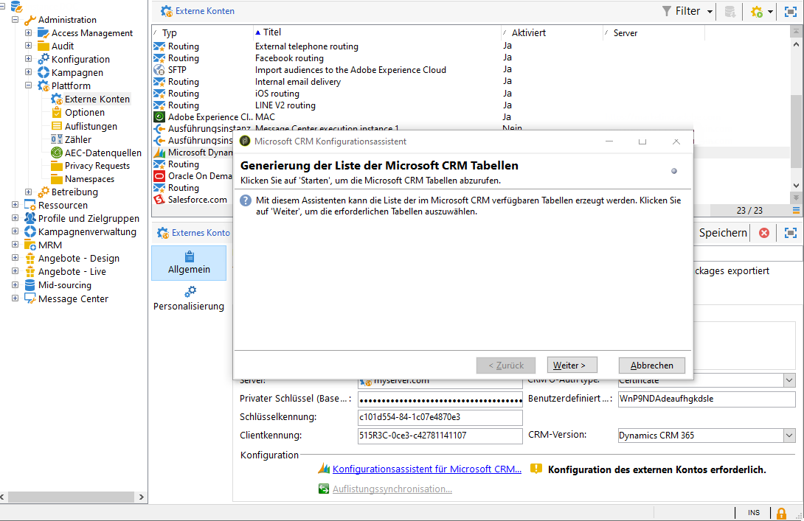
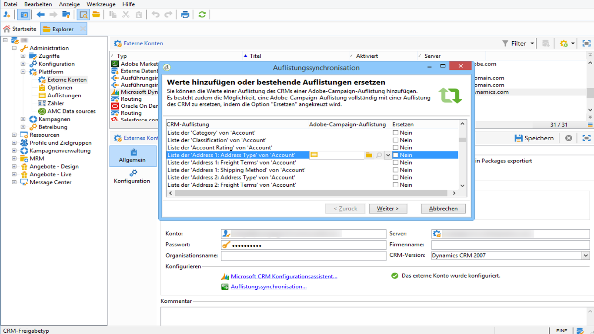

# Connect Kampagne und Microsoft Dynamics 365{#connect-to-msdyn}

Auf dieser Seite erfahren Sie, wie Sie Campaign Classic mit **Microsoft Dynamics CRM 365** verbinden.

Mögliche Bereitstellungen sind:

* über **Web API** (empfohlen). Weitere Informationen zum Einrichten der Verbindung mit Microsoft Dynamics finden Sie im Abschnitt [unter](#microsoft-dynamics-implementation-step).
* mit **Office 365**. Lesen Sie [dieses Video](#microsoft-dynamics-office-365), um die wichtigsten Schritte zum Einrichten dieser Integration zu erfahren.
* Für eine **Bereitstellung vor Ort** wenden Sie die Hauptschritte von Office 365 an.

Die Datensynchronisierung erfolgt über eine dedizierte Workflow-Aktivität. [Weitere Informationen](../../platform/using/crm-data-sync.md).


>[!NOTE]
>
> Die mit der Kampagne kompatible CRM-Systemversion ist in der [Kompatibilitätsmatrix](../../rn/using/compatibility-matrix.md#CRMconnectors) aufgeführt.


## Umsetzung{#microsoft-dynamics-implementation-steps}

Um Microsoft Dynamics 365 mit Adobe Campaign über **Web API** zu verbinden, müssen Sie die folgenden Schritte ausführen:

In Microsoft Dynamics CRM:
1. Microsoft Dynamics Client-ID abrufen
1. Generieren des geheimen Microsoft Dynamics Client
1. Berechtigungen konfigurieren
1. App-Benutzer erstellen
1. Kodieren des privaten Schlüssels

[Weitere Informationen finden Sie in diesem Abschnitt](#config-crm-microsoft)

Campaign Classic:
1. Neues Externe Konto erstellen
1. Externe Konto mit Microsoft Dynamics-Einstellungen konfigurieren
1. Verwenden Sie den Konfigurationsassistenten, um Tabellen zuzuordnen und Auflistungen zu synchronisieren
1. Erstellung des Synchronisations-Workflows.

[Weitere Informationen finden Sie in diesem Abschnitt](#configure-acc-for-microsoft)


>[!CAUTION]
> Beim Verbinden von Adobe Campaign mit Microsoft Dynamics ist Folgendes nicht möglich:
> * Installieren Sie Plug-Ins, die das CRM-Verhalten ändern und Kompatibilitätsprobleme mit Adobe Campaign verursachen können.
> * Mehrere Auflistungen auswählen

>


## Konfigurieren von Microsoft Dynamics CRM {#config-crm-microsoft}

Um das Zugriffstoken und die Tasten zum Einrichten des Kontos zu generieren, müssen Sie sich mit den Anmeldedaten [Microsoft Azurblau Directory](https://portal.azure.com) unter Verwendung der Anmeldedaten **Globaler Administrator** anmelden. Gehen Sie dann wie folgt vor:

### Microsoft Dynamics Client-ID {#get-client-id-microsoft} abrufen

Um die Client-ID abzurufen, müssen Sie eine App im Azurblauen Active Directory registrieren. Client-ID ist identisch mit Anwendungs-ID.

1. Navigieren Sie zu **Azurblauer Active Directory > App Registrierungen** und klicken Sie auf **Neue Anwendungsregistrierung**.
1. Geben Sie einen eindeutigen Namen ein, der zur Identifizierung einer Instanz beitragen kann, z. B. **adobeccampaign`<instance identifier>`**.
1. Wählen Sie **Anwendungstyp** als **Web-App / API**.
1. Verwenden Sie `http://localhost` für **Anmelde-URL**.

Nach dem Speichern erhalten Sie eine **Anwendungs-ID**, die die Client-ID für die Kampagne darstellt.

Weiterführende Informationen finden Sie auf [dieser Seite](https://docs.microsoft.com/de-de/powerapps/developer/common-data-service/walkthrough-register-app-azure-active-directory).

### Generieren des geheimen Microsoft Dynamics Client {#config-client-secret-microsoft}

Das Clientgeheimnis ist der Schlüssel, der für die Client-ID eindeutig ist. Gehen Sie wie folgt vor, um die Zertifikatschlüssel-ID abzurufen:

1. Navigieren Sie zu **Azurblauer Active Directory > App Registrierungen** und wählen Sie die zuvor erstellte Anwendung aus.
1. Klicken Sie auf **Zertifikate und Geheime**.
1. Klicken Sie auf **Zertifikat hochladen** und suchen und laden Sie dann Ihr öffentliches Zertifikat hoch.
1. Zum Generieren des Zertifikats können Sie openssl verwenden.

   Beispiel:

   ```
   - openssl req -x509 -sha256 -nodes -days 365 -newkey rsa:2048 -keyout '<'private key name'>' -out '<'public certificate name'>
   ```

1. Klicken Sie auf den Link **manifest**, um die **Zertifikatschlüssel-ID** und die **Schlüssel-ID** abzurufen.

### Berechtigungen {#config-permissions-microsoft} konfigurieren

Sie müssen die **Erforderliche Berechtigungen** für die erstellte App konfigurieren.

1. Navigieren Sie zu **Azurblauer Active Directory > App Registrierungen** und wählen Sie die zuvor erstellte Anwendung aus.
1. Klicken Sie oben links auf **Einstellungen**.
1. Klicken Sie unter **Erforderliche Berechtigungen** auf **Hinzufügen** und **Wählen Sie eine API > Dynamics CRM Online**.
1. Klicken Sie dann auf **Wählen Sie**, aktivieren Sie das Kontrollkästchen **Access Dynamics 365 als Organisationsbenutzer** und klicken Sie auf **Select**.

### App-Benutzer {#create-app-user-microsoft} erstellen

Der App-Benutzer ist der Benutzer, den die oben registrierte Anwendung verwenden wird. Alle Änderungen, die mit der oben registrierten App an Microsoft Dynamics vorgenommen werden, werden über diesen Benutzer vorgenommen.

**Schritt 1**: Erstellen eines nicht interaktiven Benutzers im aktiven Ordner von azure

1. Klicken Sie auf **Blaues Active Directory > Benutzer** und dann auf **Neuer Benutzer**.
1. Geben Sie einen richtigen Namen ein, den Sie verwenden möchten, und der Benutzername sollte ein E-Mail-Format sein.
1. Wählen Sie **Dynamics 365 Administrator** in der **Ordnerrolle**.

**Schritt 2**: Dem erstellten Benutzer eine ordnungsgemäße Lizenz zuweisen

1. Klicken Sie in [Microsoft Azurblau](https://portal.azure.com) auf **Admin-App**.
1. Gehen Sie zu **Benutzer > Aktive Benutzer** und klicken Sie auf den neu erstellten Benutzer.
1. Klicken Sie auf **Produktlizenzen bearbeiten** und wählen Sie **Dynamics 365 Kundenbindungsplan**.
1. Klicken Sie auf **Schließen**.

**Schritt 3**: Anwendungsbenutzer auf Dynamics CRM erstellen

1. Navigieren Sie von [Microsoft Azurblau](https://portal.azure.com) zu **Einstellungen > Sicherheit > Benutzer**.
1. Klicken Sie auf die Dropdownliste, wählen Sie **Anwendungsbenutzer** und klicken Sie auf **Neu**.
1. Verwenden Sie denselben Benutzernamen wie der Benutzer, der oben im aktiven Verzeichnis erstellt wurde

   >[!NOTE]
   >
   >Wenn Sie denselben Namen verwenden, wird der Duplikat-Key-Fehler ausgegeben. Verwenden Sie daher einen anderen Benutzernamen, bis wir eine Bestätigung erhalten, ob dieser Schritt erforderlich ist, und fahren Sie fort.

1. Weisen Sie **Anwendungs-ID** für [die zuvor erstellte Anwendung zu.](#get-client-id-microsoft)
1. Klicken Sie auf **Rollen verwalten** und wählen Sie die Rolle **Systemadministrator** für den Benutzer aus.

## Kampagne {#configure-acc-for-microsoft} konfigurieren

Um Microsoft Dynamics 365 und Kampagne zu verbinden, müssen Sie ein dediziertes Externe Konto in der Kampagne erstellen und konfigurieren.

1. Navigieren Sie zu **[!UICONTROL Administration > Plattform > Externe Konti]**.

1. Erstellen Sie ein neues Externe Konto, wählen Sie den Typ **[!UICONTROL Microsoft Dynamics CRM]** und die Option **[!UICONTROL Aktivieren]**.

1. Wählen Sie den Bereitstellungstyp **[!UICONTROL Web API]** aus:

   Adobe Campaign Classic unterstützt die Dynamics 365 REST-Schnittstelle mit dem OAuth-Protokoll zur Authentifizierung mit einem **[!UICONTROL Zertifikat]** oder **[!UICONTROL Kennwortberechtigungen]**.

   Verwenden Sie die Einstellungen [die zuvor](#get-client-id-microsoft) im &quot;Azurblauen Verzeichnis&quot;definiert wurden, um das Externe Konto zu konfigurieren.

   

   >[!NOTE]
   >
   >Die Konfiguration des Microsoft Dynamics CRM-Externen Kontos ist [in diesem Abschnitt ](../../installation/using/external-accounts.md#microsoft-dynamics-crm-external-account) detailliert.

1. Klicken Sie auf den Konfigurationsassistenten von **[!UICONTROL Microsoft CRM...]**-Link: Adobe Campaign erkennt die Tabellen automatisch aus der Microsoft Dynamics-Datenvorlage.

   

1. Wählen Sie die Tabellen aus, die abgerufen werden sollen.

   

1. Klicken Sie auf **[!UICONTROL Weiter]**, um das entsprechende Schema zu erstellen.

   

   >[!NOTE]
   >
   >Zur Übernahme der Konfiguration müssen Sie sich von der Konsole ab- und wieder anmelden.

   Sie können überprüfen, ob das entsprechende Schema in Adobe Campaign verfügbar ist.

   

1. Klicken Sie auf die Auflistungen **[!UICONTROL Synchronisieren...]** Link zum Beginn Synchronisieren von Auflistungen zwischen Adobe Campaign und Microsoft Dynamics.

   

Kampagne und Microsoft Dynamics sind nun miteinander verbunden. Sie können die Datensynchronisierung zwischen den beiden Systemen einrichten. Weitere Informationen finden Sie im Abschnitt [Datensynchronisierung](../../platform/using/crm-data-sync.md).

## Microsoft Dynamics CRM Office 365-Integration konfigurieren{#microsoft-dynamics-office-365}

Sehen Sie sich dieses Video an, um zu erfahren, wie Sie Dynamics 365 mit Adobe Campaign Classic integrieren können, im Rahmen eines Office 365-Einsatzes.

>[!VIDEO](https://video.tv.adobe.com/v/23837?quality=12)


## Unterstützte Felddatentypen {#ms-dyn-supported-types}

Für Microsoft Dynamics 365 werden die folgenden Attributtypen unterstützt/nicht unterstützt:


| Attributtyp | Unterstützt |
| --------------------------------------------------------------------------------- | --------- |
| Basistypen: boolean, dattime, decimal, float, Dublette, integer, bigint, string | Ja |
| Geld (als Dublette) | Ja |
| memo, entityname, primarykey, uniqueidentifier (als Zeichenfolgen) | Ja |
| Status, Auswahlliste (die möglichen Werte werden in Auflistungen gespeichert), Status (Zeichenfolge) | Ja |
| owner (als Zeichenfolge) | Ja |
| Suche (nur Referenzsuche einer einzelnen Entität) | Ja |
| customer | Nein |
| Bezüglich | Nein |
| PartyList | Nein |
| ManagedProperty | Nein |
