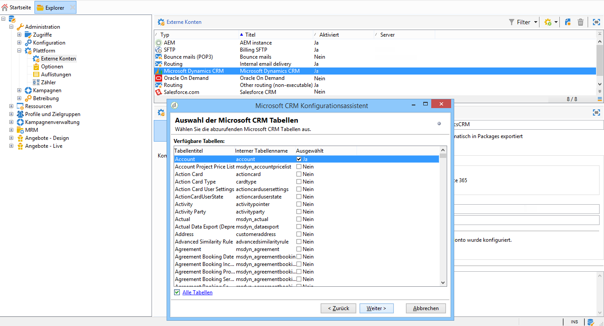

# Campaign und Microsoft Dynamics 365 verbinden{#connect-to-msdyn}


Auf dieser Seite erfahren Sie, wie Sie Campaign Classic mit **Microsoft Dynamics CRM 365** verbinden.

Die Implementierung kann über die **Web-API** erfolgten (empfohlen). Im [folgenden Abschnitt](#microsoft-dynamics-implementation-step) erfahren Sie, wie Sie die Verbindung mit Microsoft Dynamics herstellen.

Die Datensynchronisation erfolgt über eine eigene Workflow-Aktivität. [Weitere Informationen](../../platform/using/crm-data-sync.md).

## Implementierungsschritte{#microsoft-dynamics-implementation-steps}

Um Microsoft Dynamics 365 per **Web-API** mit Adobe Campaign zu verbinden, müssen Sie folgende Schritte ausführen:

In Microsoft Dynamics CRM:
1. Microsoft Dynamics Client-ID abrufen
1. Microsoft Dynamics-Zertifikatschlüsselkennung und Schlüssel-ID generieren
1. Berechtigungen konfigurieren
1. Anwender erstellen
1. Privaten Schlüssel kodieren

[Weiterführende Informationen finden Sie in diesem Abschnitt](#config-crm-microsoft)

In Campaign Classic:
1. Neues externes Konto erstellen
1. Externes Konto mit Microsoft Dynamics-Einstellungen konfigurieren
1. Konfigurationsassistenten nutzen, um Tabellen zuzuordnen und Auflistungen zu synchronisieren
1. Synchronisations-Workflows erstellen

[Weiterführende Informationen finden Sie in diesem Abschnitt](#configure-acc-for-microsoft)


>[!CAUTION]
> Bei der Verbindung von Adobe Campaign mit Microsoft Dynamics können Sie Folgendes nicht tun:
> * Plugins installieren, die das Verhalten des CRM verändern; dadurch könnte es zu Kompatibilitätsproblemen mit Adobe Campaign kommen
> * Mehrere Auflistungen auswählen


## Microsoft Dynamics CRM konfigurieren {#config-crm-microsoft}

Um das Zugriffs-Token und die Schlüssel zum Einrichten des Kontos zu generieren, müssen Sie sich bei [Microsoft Azure Directory](https://portal.azure.com) unter Verwendung von Anmeldedaten für einen **globalen Administrator** anmelden. Gehen Sie dann wie folgt vor:

### Microsoft Dynamics Client-ID abrufen {#get-client-id-microsoft}

Um die Client-ID abzurufen, müssen Sie eine Anwendung in Azure Active Directory registrieren. Die Client-ID ist mit der Anwendungs-ID identisch.

1. Navigieren Sie zu **Azure Active Directory > App-Registrierungen** und klicken Sie auf **Neue Anwendung registrieren**.
1. Geben Sie einen eindeutigen Namen ein, der zur Identifizierung einer Instanz verwendet werden kann, z. B. **adobeccampaign`<instance identifier>`**.
1. Wählen Sie **Anwendungstyp** als **Web-App/API**.
1. Verwenden Sie `http://localhost` für die **Anmelde-URL**.

Nach dem Speichern erhalten Sie eine **Anwendungs-ID**, die der Client-Kennung für Campaign entspricht.

Weiterführende Informationen finden Sie auf [dieser Seite](https://docs.microsoft.com/powerapps/developer/common-data-service/walkthrough-register-app-azure-active-directory).

### Microsoft Dynamics-Zertifikatschlüsselkennung und Schlüssel-ID generieren {#config-certificate-key-id}

Gehen Sie wie folgt vor, um die **Zertifikatschlüsselkennung (customKeyIdentifier)** und die **Schlüssel-ID (keyId)** abzurufen:

1. Navigieren Sie zu **Azure Active Directory > App-Registrierungen** und wählen Sie die zuvor erstellte Anwendung aus.
1. Klicken Sie auf **Zertifikate und Geheimnis**.
1. Klicken Sie auf **Zertifikat hochladen**, bevor Sie Ihr erzeugtes öffentliches Zertifikat suchen und hochladen.
1. Zum Generieren des Zertifikats können Sie &quot;openssl&quot; verwenden.

   Beispiel:

   ```
   - openssl req -x509 -sha256 -nodes -days 365 -newkey rsa:2048 -keyout '<'private key name'>' -out '<'public certificate name'>
   ```

   >[!NOTE]
   >
   >Sie können die Anzahl der Tage, hier `-days 365`, im Code-Beispiel ändern, sodass der Gültigkeitszeitraum des Zertifikats verlängert wird.

1. Sie müssen sie dann in Base64 codieren. Dazu können Sie einen Base64-Encoder oder die Befehlszeile `base64 -w0 private.key` für Linux verwenden.

1. Klicken Sie auf den Link **Manifest**, um die **Zertifikatschlüsselkennung (customKeyIdentifier)** und die **Schlüssel-ID (keyId)** abzurufen.

Die **Zertifikatschlüsselkennung (customKeyIdentifier)** und die **Schlüssel-ID (keyId)** werden später benötigt, um Ihr externes Microsoft Dynamics CRM-Konto mit dem **[!UICONTROL CRM-OAuth-Zertifikat]** zu konfigurieren.

### Berechtigungen konfigurieren {#config-permissions-microsoft}

**Schritt 1**: Konfigurieren Sie die **erforderlichen Berechtigungen** für die erstellte Anwendung.

1. Navigieren Sie zu **Azure Active Directory > App-Registrierungen** und wählen Sie die zuvor erstellte Anwendung aus.
1. Klicken Sie oben links auf **Einstellungen**.
1. Klicken Sie unter **Erforderliche Berechtigungen** auf **Hinzufügen** und **wählen Sie eine API > Dynamics CRM Online**.
1. Klicken Sie auf **Auswählen**, aktivieren Sie die Checkbox **Zugriff auf Dynamics 365 als Organisationsbenutzer** und klicken Sie erneut auf **Auswählen**.
1. Wählen Sie dann aus Ihrer Anwendung das **Manifest** unter dem Menü **Verwalten** aus.

1. Ändern Sie im **Manifest**-Editor die Eigenschaft `allowPublicClient` von `null` auf `true` und klicken Sie auf **Speichern**.

**Schritt 2**: Erteilen Sie die Zustimmung durch den Administrator

1. Gehen Sie zu **Azure Active Directory > Enterprise-Anwendungen**.

1. Wählen Sie die Anwendung aus, der Sie eine mandantenweite Administrator-Zustimmung erteilen möchten.

1. Wählen Sie im Menü im linken Fensterbereich unter **Sicherheit** die Option **Berechtigungen** aus.

1. Klicken Sie auf **Administratorzustimmung erteilen**.

Weiterführende Informationen dazu finden Sie in der [Dokumentation zu Azure](https://docs.microsoft.com/azure/active-directory/manage-apps/grant-admin-consent#grant-admin-consent-from-the-azure-portal).

### Anwender erstellen {#create-app-user-microsoft}

>[!NOTE]
>
> Dieser Schritt ist bei der Authentifizierung mit **[!UICONTROL einem Passwort]** optional.

Der Anwendungsbenutzer ist derjenige Benutzer, den die oben registrierte Anwendung verwenden wird. Alle Änderungen, die mit der oben registrierten Anwendung an Microsoft Dynamics vorgenommen werden, erfolgen über diesen Benutzer.

**Schritt 1**: Einen nicht interaktiven Benutzer in Azure Active Directory erstellen

1. Klicken Sie auf **Azure Active Directory > Benutzer** und dann auf **Neuer Benutzer**.
1. Geben Sie einen geeigneten Namen ein, den Sie verwenden möchten; der Benutzername sollte im E-Mail-Format vorliegen.
1. Wählen Sie **Dynamics 365-Administrator** in der **Verzeichnisrolle**.

**Schritt 2**: Dem erstellten Benutzer eine ordnungsgemäße Lizenz zuweisen

1. Klicken Sie in [Microsoft Azure](https://portal.azure.com) auf **Admin-App**.
1. Navigieren Sie zu **Benutzer > Aktive Benutzer** und klicken Sie auf den neu erstellten Benutzer.
1. Klicken Sie auf **Produktlizenzen bearbeiten** und wählen Sie **Dynamics 365 Customer Engagement-Plan**.
1. Klicken Sie auf **Schließen**.

**Schritt 3**: Anwendungsbenutzer in Dynamics CRM erstellen

1. Navigieren Sie von [Microsoft Azure](https://portal.azure.com) zu **Einstellungen > Sicherheit > Benutzer**.
1. Klicken Sie auf die Dropdown-Liste; wählen Sie dann **Anwender** und klicken Sie auf **Neu**.
1. Verwenden Sie denselben Benutzernamen wie für den Benutzer, der oben in Active Directory erstellt wurde.

   >[!NOTE]
   >
   >Sollten Sie denselben Namen verwenden, wird der Fehler für doppelte Schlüssel ausgegeben. Nutzen Sie daher einen anderen Benutzernamen und fahren Sie fort, bis Sie eine Bestätigung erhalten haben, ob dieser Schritt erforderlich ist.

1. Weisen Sie die **Anwendungs-ID** für [die zuvor erstellte Anwendung zu](#get-client-id-microsoft).
1. Klicken Sie auf **Rollen verwalten** und wählen Sie den Benutzer die Rolle **Systemadministrator** für aus.

## Campaign konfigurieren {#configure-acc-for-microsoft}

>[!NOTE]
>
> Nach der Beendigung von [RDS von Microsoft](https://docs.microsoft.com/previous-versions/dynamicscrm-2016/developers-guide/dn281891%28v=crm.8%29#microsoft-dynamics-crm-2011-endpoint) sind die CRM-Implentierungen vom Typ On-Premise und Office 365 von nicht mehr mit Campaign kompatibel. Adobe Campaign unterstützt jetzt nur mehr die Web-API-Implementierung für die CRM-Version **Dynamics CRM 365**. [Weitere Informationen](../../rn/using/deprecated-features.md#crm-connectors).

Um Microsoft Dynamics 365 mit Campaign zu verbinden, müssen Sie ein dediziertes **[!UICONTROL externes Konto]** in Campaign erstellen und konfigurieren.

1. Navigieren Sie zu **[!UICONTROL Administration > Plattform > Externe Konten]**.

1. Wählen Sie das externe **[!UICONTROL Microsoft Dynamics CRM]**-Konto aus. Kreuzen Sie die Option **[!UICONTROL Aktiviert]** an.

1. Geben Sie die Informationen ein, die zum Verbinden von Microsoft Dynamics 365 und Campaign erforderlich sind.

   >[!NOTE]
   >
   >Die Konfiguration des externen Microsoft Dynamics CRM-Kontos mit jedem **[!UICONTROL CRM-OAuth-Typ]** wird [in diesem Abschnitt](../../installation/using/external-accounts.md#microsoft-dynamics-crm-external-account) beschrieben.

   

1. Klicken Sie auf den Link **[!UICONTROL Konfigurationsassistent für Microsoft CRM ...]**. Adobe Campaign erkennt die Tabellen aus der Microsoft Dynamics-Datenvorlage automatisch.

   

1. Wählen Sie die Tabellen aus, die abgerufen werden sollen.

   

1. Klicken Sie auf **[!UICONTROL Weiter]**, um die Erstellung des entsprechenden Schemas zu starten.

   

   >[!NOTE]
   >
   >Zur Übernahme der Konfiguration müssen Sie sich von der Adobe Campaign-Konsole ab- und wieder anmelden.

   Sie können überprüfen, ob das entsprechende Datenschema in Adobe Campaign verfügbar ist.

   

1. Klicken Sie auf den Link **[!UICONTROL Auflistungssynchronisation...]**, um mit dem Synchronisieren von Auflistungen zwischen Adobe Campaign und Microsoft Dynamics zu beginnen.

   

Campaign und Microsoft Dynamics sind nun miteinander verbunden. Sie können eine Datensynchronisation zwischen den beiden Systemen einrichten. Weitere Informationen finden Sie im Abschnitt [Datensynchronisation](../../platform/using/crm-data-sync.md).

>[!NOTE]
>
> Fügen Sie der Zulassungsliste unbedingt zwei URLs hinzu: die Server-URL und `login.microsoftonline.com` in der Server-Konfiguration. Weitere Informationen zur Konfiguration der URL-Berechtigungen finden Sie auf dieser [Seite](../../installation/using/url-permissions.md).

## Unterstützte Felddatentypen {#ms-dyn-supported-types}

Bei Microsoft Dynamics 365 werden folgende Attributtypen unterstützt/nicht unterstützt:


| Attributtyp | Unterstützt |
| --------------------------------------------------------------------------------- | --------- |
| Basistypen: Boolesch, Datum + Uhrzeit, Dezimalzahl, Gleitkommazahl, Dublette, Integer, Bigint, Zeichenfolge | Ja |
| Geld (als Dublette) | Ja |
| memo, entityname, primarykey, uniqueidentifier (als Zeichenfolgen) | Ja |
| Status, Auswahlliste (wir speichern die möglichen Werte in Auflistungen), Status (Zeichenfolge) | Ja |
| owner (als Zeichenfolge) | Ja |
| Suche (nur Referenzsuche einzelner Entitäten) | Ja |
| customer | Nein |
| Regarding | Nein |
| PartyList | Nein |
| ManagedProperty | Nein |
