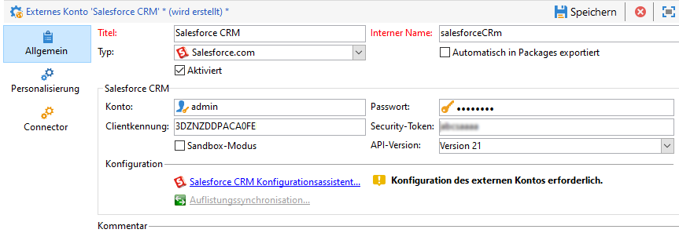
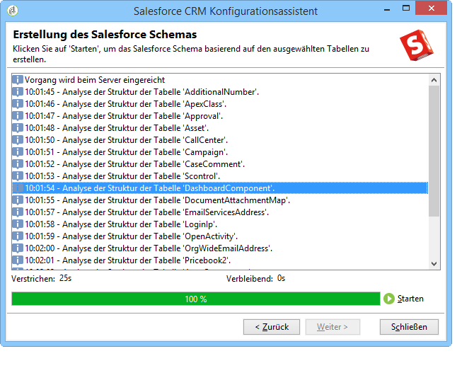
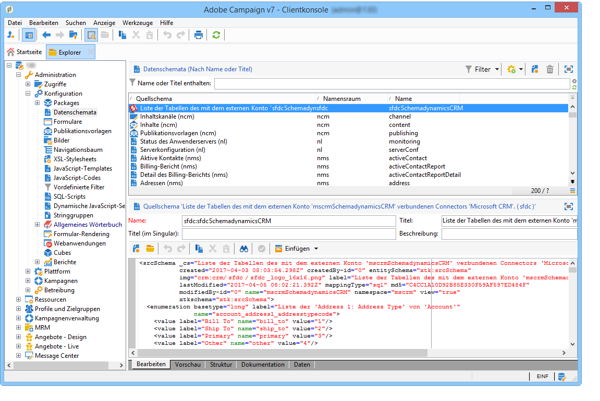
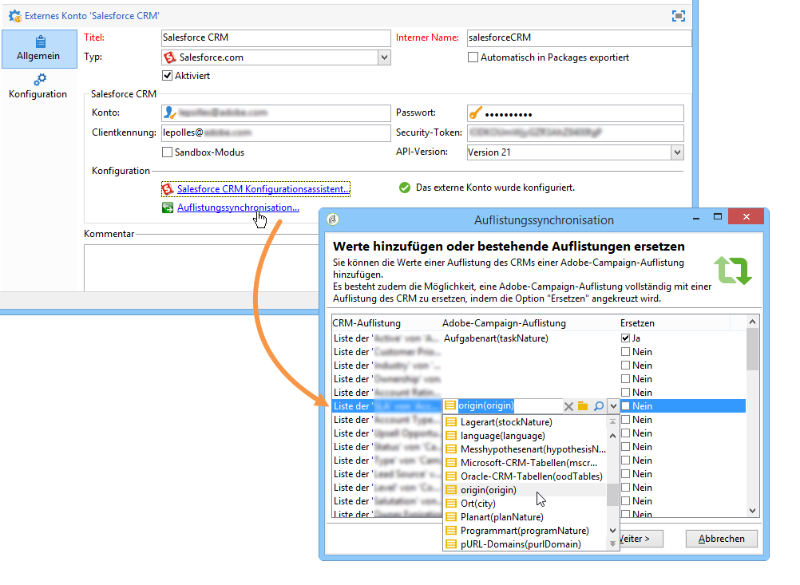
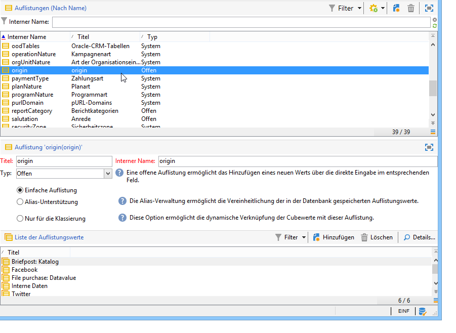
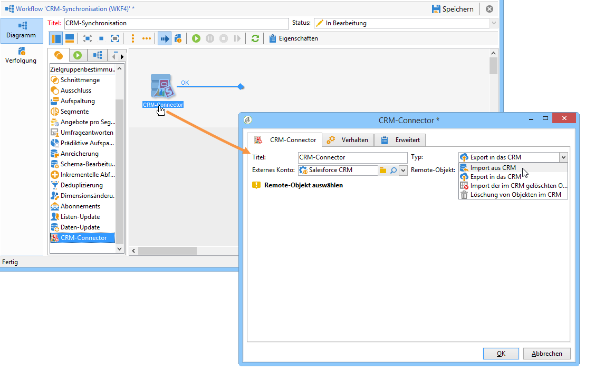

# Campaign und Salesforce.com verbinden{#connect-to-sfdc}

Auf dieser Seite erfahren Sie, wie Sie Campaign Classic mit **Salesforce** verbinden.

Die Datensynchronisation erfolgt über eine eigene Workflow-Aktivität. [Weitere Informationen](../../platform/using/crm-data-sync.md).

Das externe Konto ermöglicht Ihnen das Importieren und Exportieren von Salesforce-Daten in Adobe Campaign.
Um den CRM-Connector für Salesforce zu konfigurieren, gehen Sie wie folgt vor:

1. Erstellen Sie ein neues externes Konto ausgehend vom Knoten **[!UICONTROL Administration > Plattform > Externe Konten]** im Adobe Campaign-Navigationsbaum.
1. Wählen Sie **[!UICONTROL Salesforce.com]** aus.
1. Geben Sie Einstellungen zum Aktivieren der Verbindung ein.

   

   Um dieses externe Konto für die gemeinsame Verwendung mit Adobe Campaign zu konfigurieren, müssen Sie die folgenden Informationen eingeben:

   * **[!UICONTROL Konto]**
Für die Anmeldung bei Salesforce CRM verwendetes Konto.

   * **[!UICONTROL Passwort]**
Für die Anmeldung bei Salesforce CRM verwendetes Passwort.

   * **[!UICONTROL Client-Kennung]**
Informationen darüber, wo Sie Ihre Client-Kennung finden, erhalten Sie auf dieser [Seite](https://help.salesforce.com/articleView?id=000205876&type=1).

   * **[!UICONTROL Sicherheits-Token]**
Informationen darüber, wo Sie Ihr Sicherheits-Token finden, erhalten Sie auf dieser [Seite](https://help.salesforce.com/articleView?id=000205876&type=1).

   * **[!UICONTROL API-Version]**
Wählen Sie die Version der API aus.
1. Führen Sie den Konfigurationsassistenten aus, um die Tabelle mit verfügbaren CRMs zu generieren: Mit dem Konfigurationsassistenten können Sie Tabellen erfassen und das passende Schema erstellen.

   

   >[!NOTE]
   >
   >Zur Übernahme der Konfiguration müssen Sie sich von der Konsole ab- und wieder anmelden.

1. Prüfen Sie unter dem Knoten **[!UICONTROL Administration > Konfiguration > Datenschema]** das in Adobe Campaign erzeugte Schema.

   Beispiel für das Schema **Salesforce**:

   

1. Sobald das Schema erstellt ist, können Sie Aufzählungen in Salesforce automatisch mit Adobe Campaign synchronisieren.

   Klicken Sie hierzu auf den Link **[!UICONTROL Aufzählungssynchronisation...]** und wählen Sie die der Salesforce-Aufzählung entsprechende Adobe Campaign-Aufzählung aus.

   

   >[!NOTE]
   >
   >Sie können alle Werte einer Adobe Campaign-Aufzählung durch die des CRM-Systems ersetzen: Wählen Sie hierzu in der Spalte **[!UICONTROL Ersetzen]** die Option **[!UICONTROL Ja]**.

   Klicken Sie abschließend auf **[!UICONTROL Weiter]** und **[!UICONTROL Starten]**, um mit dem Listenimport zu beginnen.

1. Prüfen Sie die importierten Werte im Menü **[!UICONTROL Administration > Plattform > Aufzählungen]**.

   

   >[!NOTE]
   >
   > Aufzählungen mit Mehrfachauswahl werden nicht unterstützt.

Campaign und Salesforce.com sind jetzt verbunden. Sie können eine Datensynchronisation zwischen den beiden Systemen einrichten.

Um Daten zwischen Adobe Campaign und SFDC zu synchronisieren, müssen Sie einen Workflow erstellen und die Aktivität **[!UICONTROL CRM-Connector]** verwenden.

Weitere Informationen zur Datensynchronisation finden Sie [auf dieser Seite](../../platform/using/crm-data-sync.md).
