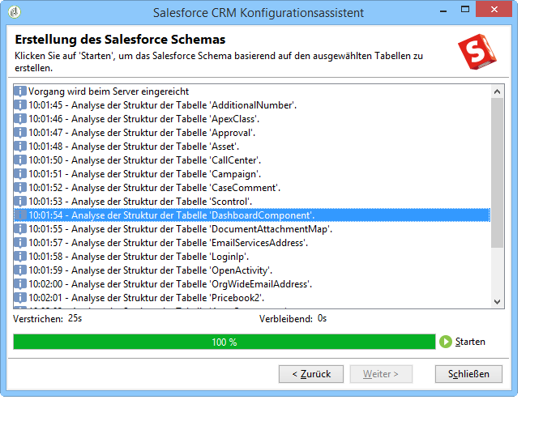
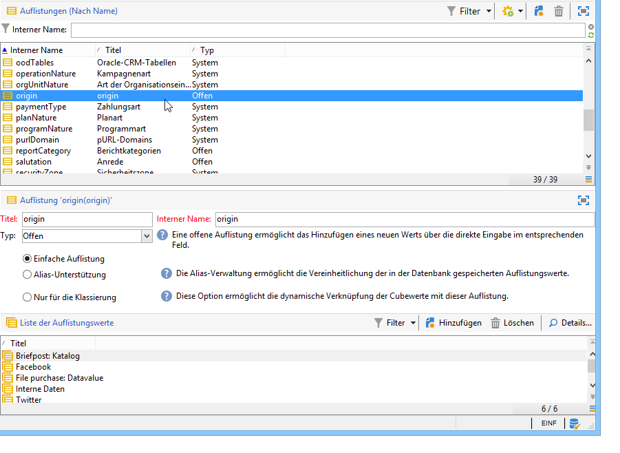
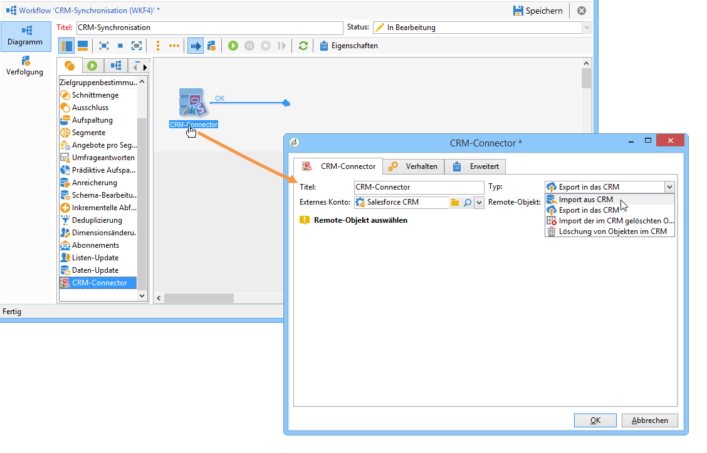

# Campaign und Microsoft Dynamics 365 verbinden {#connect-to-msdyn}

Auf dieser Seite erfahren Sie, wie Sie Campaign Classic mit **Salesforce** verbinden.

Die Datensynchronisation erfolgt über eine eigene Workflow-Aktivität. [Weitere Informationen](../../platform/using/crm-data-sync.md).

Das externe --Konto ermöglicht den Import und Export von Salesforce-Daten in Adobe Campaign.
Gehen Sie wie folgt vor, um CRM Connector für Salesforce zu konfigurieren:

1. Erstellen Sie ein neues externes Konto ausgehend vom Knoten **[!UICONTROL Administration > Plattform > Externe Konten]** im Adobe Campaign-Navigationsbaum.
1. Wählen Sie **[!UICONTROL Salesforce.com]**.
1. Geben Sie Einstellungen zum Aktivieren der Verbindung ein.

   

   Um dieses externe Konto für die gemeinsame Verwendung mit Adobe Campaign zu konfigurieren, müssen Sie die folgenden Informationen eingeben:

   * **[!UICONTROL Konto]**
Konto, mit dem die Anmeldung bei Salesforce CRM erfolgt

   * ****
PasswordPassword, mit dem Sie sich bei Salesforce CRM anmelden.

   * **[!UICONTROL Client-]**
IDsAuf dieser  [Seite](https://help.salesforce.com/articleView?id=000205876&amp;type=1) finden Sie Informationen dazu, wo Sie die Client-ID finden.

   * **[!UICONTROL Sicherheits-]**
TokenAuf dieser  [Seite finden Sie Informationen zum Auffinden Ihres Sicherheitstokens](https://help.salesforce.com/articleView?id=000205876&amp;type=1).

   * **[!UICONTROL API-]**
VersionWählen Sie die Version der API aus.
1. Führen Sie den Konfigurationsassistenten aus, um die Tabelle mit verfügbaren CRMs zu generieren: Mit dem Konfigurationsassistenten können Sie Tabellen erfassen und das passende Schema erstellen.

   

   >[!NOTE]
   >
   >Zur Übernahme der Konfiguration müssen Sie sich von der Konsole ab- und wieder anmelden.

1. Prüfen Sie unter dem Knoten **[!UICONTROL Administration > Konfiguration > Datenschema]** das in Adobe Campaign erzeugte Schema.

   Beispiel für das Schema **Salesforce**:

   

1. Nachdem das Schema erstellt wurde, können Sie Auflistungen automatisch von Salesforce auf Adobe Campaign synchronisieren.

   Klicken Sie dazu auf die Auflistungen **[!UICONTROL Synchronisieren...]** verknüpfen und die Adobe Campaign-Auflistung auswählen, die der Salesforce-Auflistung entspricht.

   

   >[!NOTE]
   >
   >Sie können alle Werte einer Adobe-Campaign-Auflistung durch die des CRM-Systems ersetzen: Wählen Sie hierzu in der Spalte **[!UICONTROL Ersetzen]** die Option **[!UICONTROL Ja]**.

   Klicken Sie abschließend auf **[!UICONTROL Weiter]** und **[!UICONTROL Starten]**, um mit dem Listenimport zu beginnen.

1. Prüfen Sie die importierten Werte im Menü **[!UICONTROL Administration > Plattform > Auflistungen]**.

   

   >[!NOTE]
   >
   > Mehrere Auflistungen werden nicht unterstützt.

Kampagne und Salesforce.com sind jetzt verbunden. Sie können eine Datensynchronisation zwischen den beiden Systemen einrichten.

Um Daten zwischen den Adobe Campaign-Daten und dem SFDC zu synchronisieren, müssen Sie einen Workflow erstellen und die Aktivität **[!UICONTROL CRM Connector]** verwenden.

Weitere Informationen zur Datensynchronisation finden Sie [auf dieser Seite ](../../platform/using/crm-data-sync.md).

