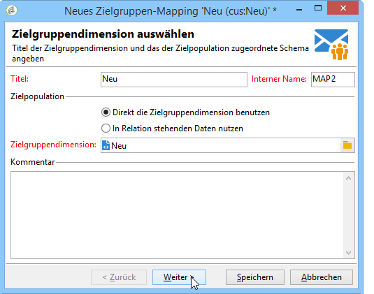
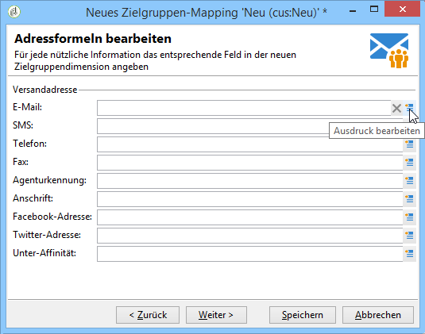
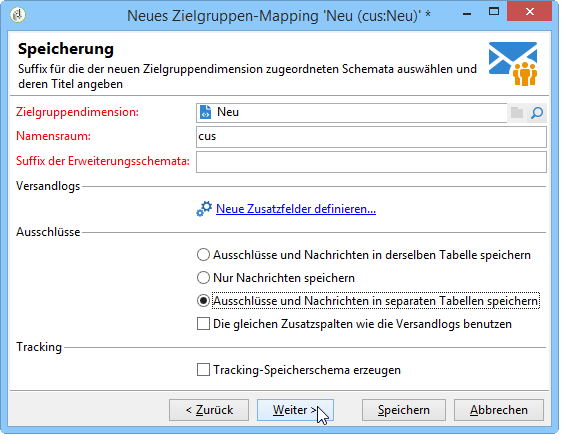
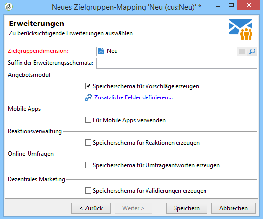

# Definition des Daten-Mappings {#defining-data-mapping}

Mit Adobe Campaign können Sie das Mapping für Daten in einer externen Tabelle definieren.

Dazu müssen Sie nach der Erstellung des Schemas der externen Tabelle ein neues Versand-Mapping erstellen, wobei die Daten in dieser Tabelle als Versandzielgruppe verwendet werden.

Gehen Sie hierzu wie folgt vor:

1. Erstellen Sie ein neues Versand-Mapping und wählen Sie die Zielgruppendimension, z. B. das soeben erstellte Schema.

   

1. Geben Sie die Felder an, in denen die Versandinformationen gespeichert sind (Nachname, Vorname, E-Mail-Adresse, Adresse etc.).

   

1. Geben Sie die Parameter für die Speicherung der Informationen an, einschließlich des Suffix der Erweiterungsschemata, damit diese leicht identifiziert werden können.

   

   Wählen Sie aus, ob Ausschlüsse (**excludelog**) mit Nachrichten (**broadlog**) oder in einer separaten Tabelle gespeichert werden sollen.

   Sie können für dieses Versand-Mapping (**trackinglog**) auch auswählen, ob Tracking verwaltet werden soll.

1. Wählen Sie dann die zu berücksichtigenden Erweiterungen. Der Erweiterungstyp hängt von den Parametern und Optionen Ihrer Plattform ab (bitte überprüfen Sie Ihren Lizenzvertrag).

   

   Klicken Sie auf die Schaltfläche **[!UICONTROL Speichern]**, um die Erstellung des Versand-Mappings zu beginnen: Alle verknüpften Tabellen werden automatisch auf der Basis der ausgewählten Parameter erstellt.
