# Filterbedingungen definieren{#defining-filter-conditions}

## Operator auswählen {#choosing-the-operator}

In einer Filterbedingung werden zwei Werte durch einen Operator zueinander in Beziehung gesetzt.

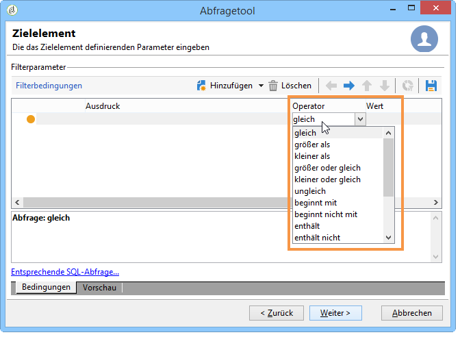

Die folgende Liste beschreibt alle verfügbaren Operatoren:

<table> 
 <thead> 
  <tr> 
   <th> Operator  </th> 
   <th> Zweck  </th> 
   <th> Beispiel  </th> 
  </tr> 
 </thead> 
 <tbody> 
  <tr> 
   <td> Gleich   </td> 
   <td> Die ausgegebenen Daten stimmen vollständig mit dem angegebenen Wert überein.  </td> 
   <td> <strong>Nachname (@lastName) gleich 'Müller'</strong>. Nur Empfänger mit dem Nachnamen "Müller" unter Beachtung der genauen Schreibung werden ausgegeben.  </td> 
  </tr> 
  <tr> 
   <td> Größer als   </td> 
   <td> Die ausgegebenen Daten übersteigen den angegebenen Wert.  </td> 
   <td> <strong>Alter (@age) größer als '50'</strong>. Nur Kontakte/Empfänger mit einem Alter von mehr als '50' Jahren werden ausgegeben (also z. B. '51', '52' usw.).  </td> 
  </tr> 
  <tr> 
   <td> Niedriger als   </td> 
   <td> Die ausgegebenen Daten unterschreiten den angegebenen Wert.  </td> 
   <td> <strong>Erstellungsdatum (@created) früher als 'DaysAgo(100)'</strong>. Es werden nur die Kontakte ausgegeben, die vor weniger als 100 Tagen angelegt wurden.  </td> 
  </tr> 
  <tr> 
   <td> Größer oder gleich   </td> 
   <td> Die ausgegebenen Daten sind identisch mit oder übersteigen den angegebenen Wert.  </td> 
   <td> <strong>Alter (@age) größer oder gleich '30'</strong>. Nur Kontakte/Empfänger mit einem Alter ab '30' Jahren werden ausgegeben (also z. B. '30', '31', '32' Jahre usw.).  </td> 
  </tr> 
  <tr> 
   <td> Kleiner oder gleich   </td> 
   <td> Die ausgegebenen Daten sind identisch mit oder unterschreiten den angegebenen Wert.  </td> 
   <td> <strong>Alter (@age) kleiner oder gleich '60'</strong>. Nur Kontakte/Empfänger mit einem Alter bis einschließlich '60' Jahren werden ausgegeben.  </td> 
  </tr> 
  <tr> 
   <td> Ungleich   </td> 
   <td> Die ausgegebenen Daten unterscheiden sich vom angegebenen Wert.  </td> 
   <td> <strong>Sprache (@language) ungleich 'Englisch'</strong>.  </td> 
  </tr> 
  <tr> 
   <td> Beginnt mit   </td> 
   <td> Die ausgegebenen Daten beginnen mit dem angegebenen Wert.  </td> 
   <td> <strong>Kundennummer (@account) beginnt mit '32010'.</strong>  </td> 
  </tr> 
  <tr> 
   <td> Beginnt nicht mit   </td> 
   <td> Die ausgegebenen Daten beginnen nicht mit dem angegebenen Wert.  </td> 
   <td> <strong>Kundennummer (@account) beginnt nicht mit '20'</strong>.  </td> 
  </tr> 
  <tr> 
   <td> Enthält   </td> 
   <td> Die ausgegebenen Daten enthalten den angegebenen Wert.  </td> 
   <td> <strong>E-Mail-Domain (@domain) enthält 'mail'</strong>. Nur E-Mail-Domains, die den Wert 'mail' enthalten, werden ausgegeben (z. B. 'gmail.com').  </td> 
  </tr> 
  <tr> 
   <td> Enthält nicht   </td> 
   <td> Die ausgegebenen Daten enthalten den angegebenen Wert nicht.  </td> 
   <td> <strong>E-Mail-Domain (@domain) enthält nicht 'oo'</strong>. E-Mail-Domains, die den Wert 'oo' enthalten, werden nicht ausgegeben (z. B. 'google.com' oder 'yahoo.de' zählen nicht zu den Ergebnissen).  </td> 
  </tr> 
  <tr> 
   <td> Ist wie   </td> 
   <td> Ist wie erzielt ähnliche Ergebnisse wie der Operator enthält.  Damit können Sie ein Platzhalterzeichen % in den Wert einfügen.  </td> 
   <td> <strong>Nachname (@lastName) ist wie 'Me%er'</strong>. In diesem Fall werden alle Empfänger ausgegeben, deren Nachname z. B. 'Meyer', 'Meier' oder 'Meiser' lautet.  </td> 
  </tr> 
  <tr> 
   <td> Ist nicht wie   </td> 
   <td> Negative Form des Operators ist wie. Hier dürfen die ausgegebenen Daten nicht dem angegebenen Wert ähneln. Auch in diesem Fall ist der Platzhalter % zu verwenden.  </td> 
   <td> <strong>Nachname (@lastName) ist nicht wie 'Schmi%t'</strong>. Alle Empfänger mit Nachnamen 'Schmiedt', 'Schmidt', 'Schmitt' usw. werden ausgeschlossen.  </td> 
  </tr> 
  <tr> 
   <td> Ist leer   </td> 
   <td> Die ausgegebenen Daten enthalten keinen Wert in der entsprechenden Spalte.  </td> 
   <td> <strong>Mobiltelefon (@mobilePhone) ist leer</strong>. Nur Empfänger, für die keine Mobiltelefonnummer angegeben wurde, werden ausgegeben.  </td> 
  </tr> 
  <tr> 
   <td> Ist nicht leer   </td> 
   <td> Negative Form des Operators ist leer. Auch hier wird in der Wert-Spalte nichts angegeben.  </td> 
   <td> <strong>E-Mail (@email) ist nicht leer</strong>. Nur Empfänger, die eine E-Mail-Adresse angegeben haben, werden ausgegeben.  </td> 
  </tr> 
  <tr> 
   <td> Ist enthalten in   </td> 
   <td> Die ausgegebenen Daten sind in den angegebenen Werten enthalten. Die Werte werden durch Kommata getrennt.  </td> 
   <td> <strong>Postleitzahl (location/@zipCode) ist enthalten in '21149,22041,22043'</strong>. Nur Empfänger, deren Postleitzahl '21149', '22041' oder '22043' lautet, werden ausgegeben.   </td> 
  </tr> 
  <tr> 
   <td> Ist nicht enthalten in   </td> 
   <td> Negative Form des Operators ist enthalten in. Die den angegebenen Werten entsprechenden Daten werden aus dem Ergebnis ausgeschlossen.  </td> 
   <td> <strong>Postleitzahl (location/@zipCode) ist nicht enthalten in '21149,22041,22043'</strong>. Alle Empfänger, deren Postleitzahl '21149', '22041' oder '22043' lautet, werden vom Ergebnis ausgeschlossen.  </td> 
  </tr> 
 </tbody> 
</table>

## UND, ODER, AUSSER verwenden {#using-and--or--except}

In Abfragen, die mehr als eine Bedingung enthalten, müssen die Bedingungen miteinander verknüpft werden. Mögliche Verknüpfungen sind:

* **[!UICONTROL And]** Sie können zwei Filterbedingungen kombinieren.
* **[!UICONTROL Or]** Sie können eine Alternative anbieten,
* **[!UICONTROL Except]** können Sie eine Ausnahme definieren.

Click **[!UICONTROL And]** (offered by default) and choose from the drop-down list.

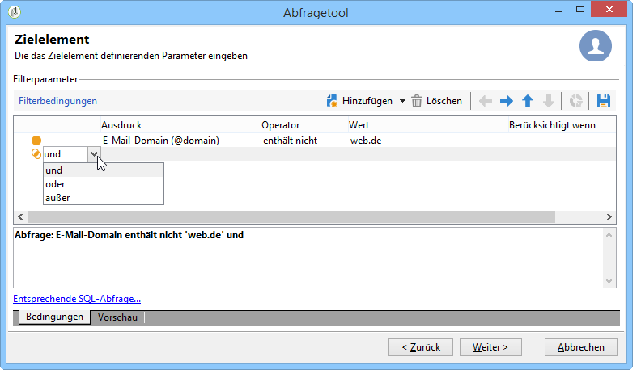

* **[!UICONTROL And]**: fügt eine Bedingung hinzu und aktiviert das Überfiltern.
* **[!UICONTROL Or]**: fügt eine Bedingung hinzu und aktiviert das Überfiltern.

   Im unten stehenden Beispiel werden die Empfänger ausgegeben, deren E-Mail-Domain &quot;web.de&quot; enthält ODER deren Postleitzahl mit &quot;20&quot; beginnt.

   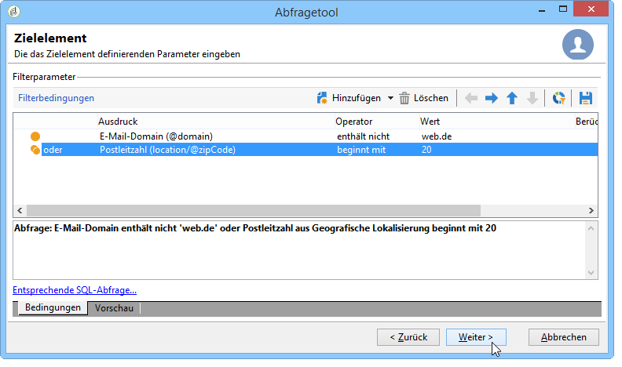

* **[!UICONTROL Except]**: Wenn Sie über zwei Filter verfügen und der erste keinen Wert zurückgibt, erstellt dieser Linktyp eine Ausnahme.

   Im unten stehenden Beispiel werden die Empfänger ausgegeben, deren E-Mail-Domain &quot;web.de&quot; enthält, AUSSER wenn der Familienname &quot;Schmidt&quot; lautet.

   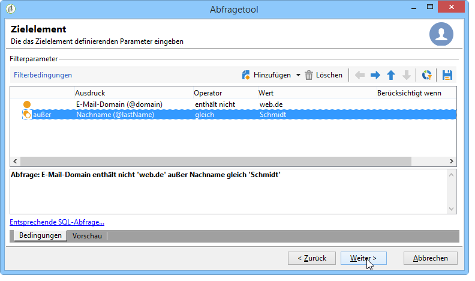

Folgendes Beispiel zeigt einen Filter zur Anzeige aller Empfänger spanischer Sprache ODER aller Frauen, deren Mobiltelefonnummer angegeben ist, ODER aller Empfänger, deren Kundennummer nicht angegeben ist und deren Firma mit &quot;N&quot; anfängt.

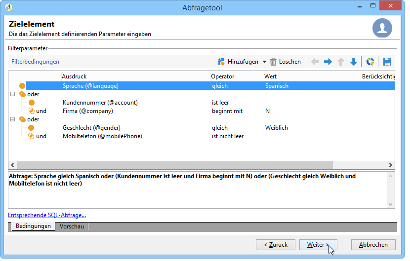

## Bedingungen hierarchisieren {#prioritizing-conditions}

In diesem Kapitel wird erläutert, wie anhand der blauen Pfeile in der Symbolleiste Filterbedingungen hierarchisiert werden können.

* Der Rechtspfeil fügt eine Klammerebene hinzu.
* Der Linkspfeil entfernt eine Klammerebene.

   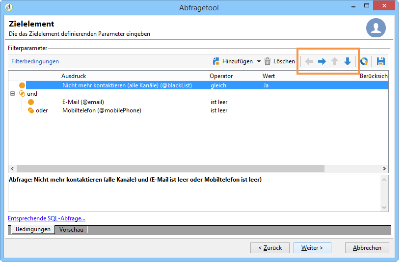

* Die nach oben und unten gerichteten Pfeile ermöglichen das Verschieben einer Bedingung und somit die Reihenfolge der Filterung.

Dieses Beispiel zeigt, wie Sie mit dem Pfeil eine Klammerebene löschen können. Beginnen Sie mit der folgenden Filterbedingung: **[!UICONTROL City equal to London OR gender equal to male and mobile not indicated OR account # starts with "95" and company name starts with "A"]**.

Platzieren Sie den Cursor auf die **[!UICONTROL Gender (@gender) equal to Male]** Filterbedingung und klicken Sie auf den **[!UICONTROL Remove a parenthesis level]** Pfeil.

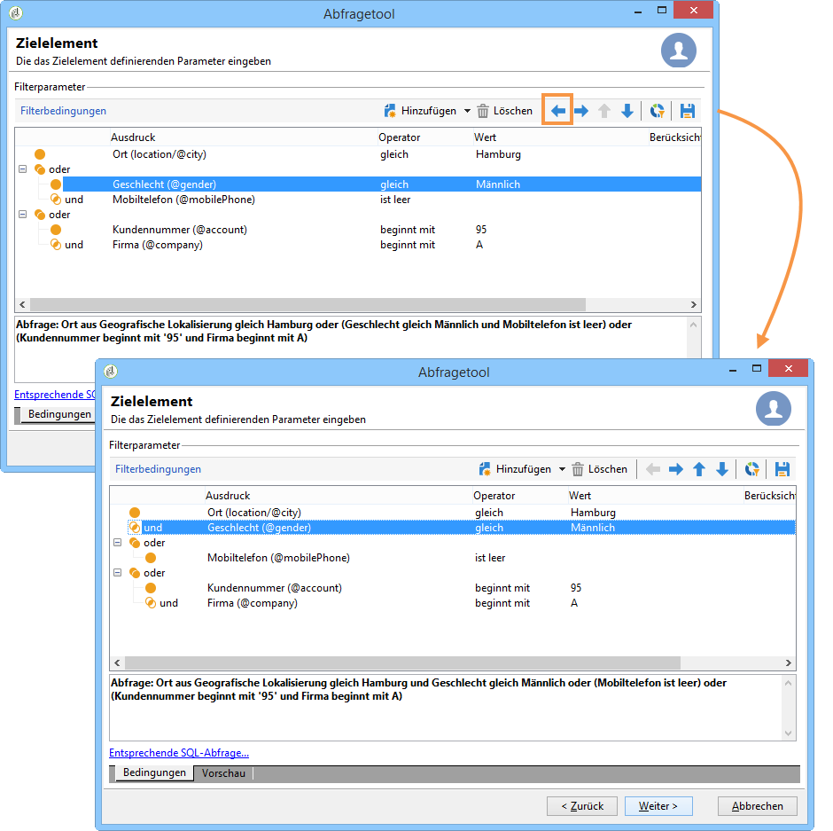

Die **[!UICONTROL Gender (@gender) equal to Male]** Bedingung wurde aus ihrer Klammer entfernt. Es hat sich auf die gleiche Ebene wie die Bedingung &quot;City equal to London&quot;. Diese Bedingungen sind miteinander verknüpft (**[!UICONTROL And]**).

## Zu extrahierende Daten auswählen {#selecting-data-to-extract}

The available fields vary from one table to another. All fields are stored in a main node known as the **[!UICONTROL Main element]**. In the following example, the available fields are in the recipient table. Felder werden immer alphabetisch angezeigt.

Die Details des ausgewählten Felds werden unten im Fenster angezeigt. Beispielsweise ist das **[!UICONTROL Email domain]** Feld ein **[!UICONTROL Calculated SQL field]** und seine Erweiterung ist **[!UICONTROL (@domain)]**.

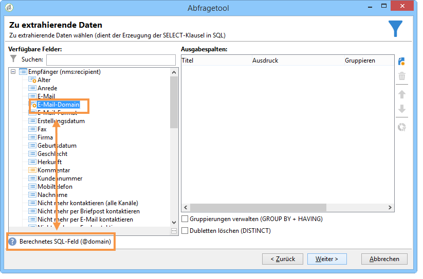

>[!NOTE]
>
>Use the **[!UICONTROL Search]** tool to find an available field.

Doppelklicken Sie auf ein verfügbares Feld, um es den Ausgabespalten hinzuzufügen. Am Ende der Abfrage erstellt jedes ausgewählte Feld eine Spalte im **[!UICONTROL Data preview]** Fenster.

Erweiterte Felder werden nicht standardmäßig angezeigt. Klicken Sie **[!UICONTROL Display advanced fields]** in der unteren rechten Ecke der verfügbaren Felder, um alles anzuzeigen. Klicken Sie erneut, um zur vorherigen Ansicht zurückzukehren.

In der Empfängertabelle sind die erweiterten Felder beispielsweise **Boolescher Wert 1**, **[!UICONTROL Boolean 2]**, **[!UICONTROL Boolean 3]**, **[!UICONTROL Foreign key of "Folder" link]** usw.

In unten stehendem Beispiel wurden alle erweiterten Felder der Empfängertabelle markiert.

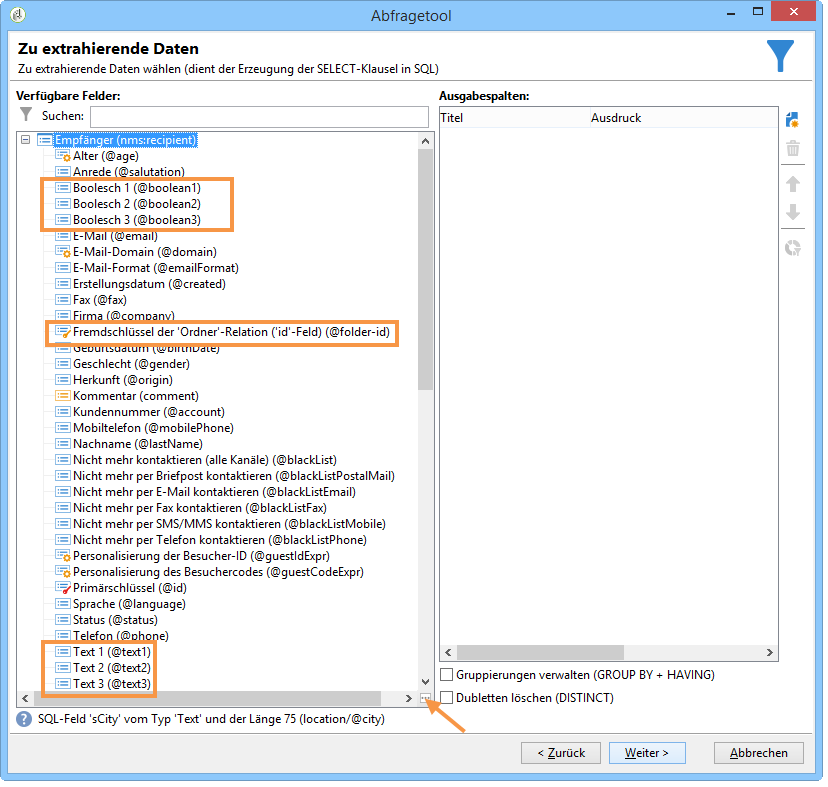

Feld-Kategorien:

<table> 
 <thead> 
  <tr> 
   <th> Symbol  </th> 
   <th> Beschreibung  </th> 
   <th> Beispiele  </th> 
  </tr> 
 </thead> 
 <tbody> 
  <tr> 
   <td>  </td> 
   <td> Einfaches Feld  </td> 
   <td> Anrede, E-Mail, Geschlecht usw.  </td> 
  </tr> 
  <tr> 
   <td>  </td> 
   <td> Primärschlüssel. This SQL field is a way of identifying a record in a table.  </td> 
   <td> Eine Benutzerkennung - von Natur aus "eindeutig" - ist ein Primärschlüssel.  </td> 
  </tr> 
  <tr> 
   <td>  </td> 
   <td> Fremdschlüssel. Used as a link to another table.  </td> 
   <td> Fremdschlüssel des Empfängers, Fremdschlüssel des Dienstes usw.  </td> 
  </tr> 
  <tr> 
   <td>  </td> 
   <td> Berechnetes Feld. This type of field is calculated on request using the values in the database.  </td> 
   <td> Alter, E-Mail-Domain usw.  </td> 
  </tr> 
  <tr> 
   <td>  </td> 
   <td> Textfeld für längere Texte  </td> 
   <td> Kommentare, vollständige Adressen usw.  </td> 
  </tr> 
  <tr> 
   <td>  </td> 
   <td> Indexed SQL field.   </td> 
   <td> Vollständiger Name, ISO-Code usw.   </td> 
  </tr> 
 </tbody> 
</table>

Relationen zu einer Tabelle oder zu Kollektionselementen:

<table> 
 <thead> 
  <tr> 
   <th> Symbol  </th> 
   <th> Beschreibung  </th> 
   <th> Beispiel  </th> 
  </tr> 
 </thead> 
 <tbody> 
  <tr> 
   <td>  </td> 
   <td> 1:1-Relationen zu einer bestimmten Tabelle. Einem Datensatz in der Quelltabelle entspricht höchstens ein Datensatz in der Zieltabelle. Ein Empfänger kann beispielsweise höchstens einem Land zugeordnet werden.  </td> 
   <td> Ordner, Zustand, Land usw.   </td> 
  </tr> 
  <tr> 
   <td>  </td> 
   <td> Kollektionselemente bezogen auf eine bestimmte Tabelle. Es handelt sich um 1:n-Relationen. Einem Datensatz in der Quelltabelle können mehrere Datensätze in der Zieltabelle entsprechen, aber ein Datensatz der Zieltabelle entspricht genau einem Datensatz in der Quelltabelle. Ein Empfänger kann z. B. für 'n' Newsletter angemeldet sein.  </td> 
   <td> Abonnements, Listen, Ausschlusslogs usw.  </td> 
  </tr> 
 </tbody> 
</table>

>[!NOTE]
>
>* Verwenden Sie die **[!UICONTROL Add]** Schaltfläche (über der Seitensymbolleiste), um eine Ausgabefalte hinzuzufügen, in der Sie den Ausdruck bearbeiten möchten. Weitere Informationen zum Bearbeiten eines Ausdrucks finden Sie unter [Erstellen von Ausdrücken](#building-expressions).
>* Klicken Sie auf das rote Kreuz **Löschen**, um eine Ausgabespalte zu entfernen.
>* Ändern Sie die Reihenfolge der Ausgabespalten anhand der Pfeile.
>* The **[!UICONTROL Distribution of values]** serves as a way to view the distributon of the values of the field selected (for example, the distributions linked to recipient towns, recipient languages, etc.).

## Erstellung berechneter Felder {#creating-calculated-fields}

If necessary, add a column during data formatting. A calculated field adds a column to the data preview section. Click **[!UICONTROL Add a calculated field]**.

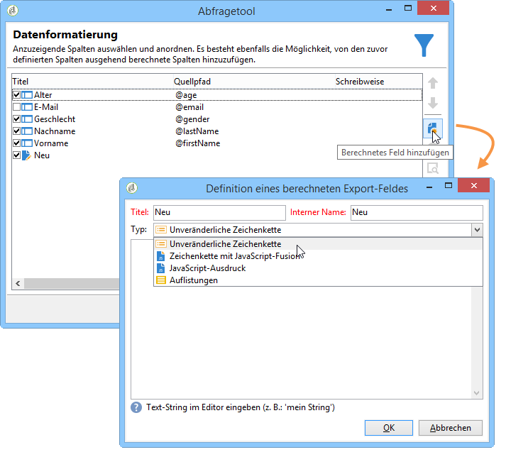

Vier verschiedene Feldtypen stehen zur Verfügung:

* **[!UICONTROL Fixed string]**: können Sie eine Zeichenfolge hinzufügen.

   

* **[!UICONTROL String with JavaScript tags]**: Der Wert des berechneten Felds kombiniert eine Zeichenfolge mit JavaScript-Direktiven.

   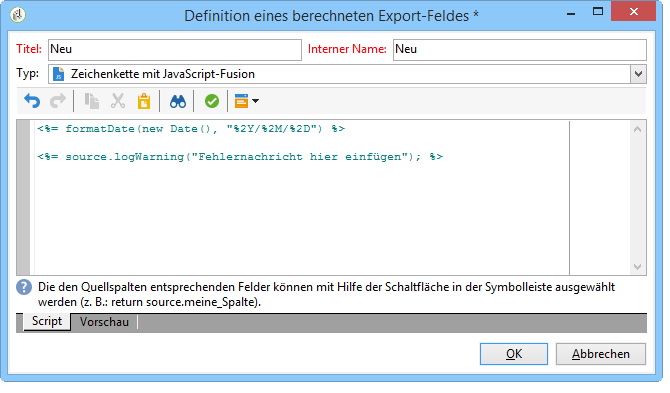

* **[!UICONTROL JavaScript expression]**: Der Wert des berechneten Felds ist das Ergebnis einer JavaScript-Funktionsbewertung. Der zurückgegebene Wert kann eingegeben werden (Zahl, Datum usw.).

   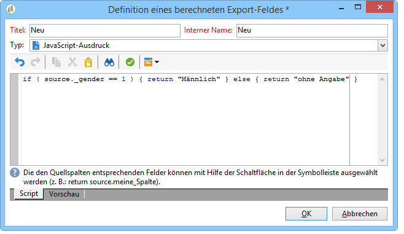

* **[!UICONTROL Enumerations]**: Mit diesem Feldtyp können Sie den Inhalt einer der Ausgabespalten in einer neuen Spalte verwenden/ändern.

   Dem Quellwert einer Spalte kann ein Zielwert zugeordnet werden. Es ist der Zielwert, der in der neuen Ausgabespalte angezeigt wird.

   An example of adding calculated field type **[!UICONTROL Enumerations]** is available, refer to [this section](../../workflow/using/adding-enumeration-type-calculated-field.md).

   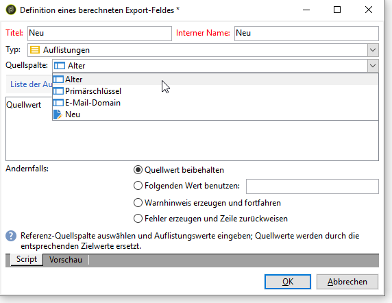

   The **[!UICONTROL Enumerations]** type calculated field can include 4 conditions:

   * **[!UICONTROL Keep the source value]** stellt den Quellwert dem Ziel wieder her, ohne ihn zu ändern.
   * **[!UICONTROL Use the following value]** können Sie einen Standardzielwert für nicht definierte Quellwerte eingeben.
   * **[!UICONTROL Generate a warning and continue]** warnt den Benutzer, dass der Quellwert nicht geändert werden kann.
   * **[!UICONTROL Generate an error and reject the line]** verhindert, dass die Zeile berechnet und importiert wird.

Klicken Sie auf **[!UICONTROL Detail of calculated field]** , um die Details des eingefügten Felds anzuzeigen.

Um dieses berechnete Feld zu entfernen, klicken Sie auf das **[!UICONTROL Remove the calculated field]** Kreuz.

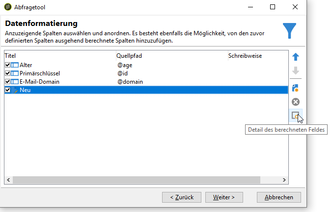

## Erstellung von Ausdrücken {#building-expressions}

Der Ausdruckseditor dient der Berechnung von Aggregaten, der Erstellung von Funktionen oder der Bearbeitung von Formeln von einem Ausdruck ausgehend.

Folgendes Beispiel zeigt die Erstellung eines Ausdrucks zum Zählen eines Primärschlüssels.

Gehen Sie wie folgt vor:

1. Klicken Sie **[!UICONTROL Add]** im **[!UICONTROL Data to extract]** Fenster. Wählen Sie im **[!UICONTROL Formula type]** Fenster einen Formeltyp aus, um den Ausdruck einzugeben.

   Es stehen verschiedene Formeln zur Verfügung: **[!UICONTROL Field only]**, **[!UICONTROL Aggregate]****[!UICONTROL Expression]**.

   Wählen Sie **[!UICONTROL Process on an aggregate function]** und **[!UICONTROL Count]**. Klicks **[!UICONTROL Next]**.

   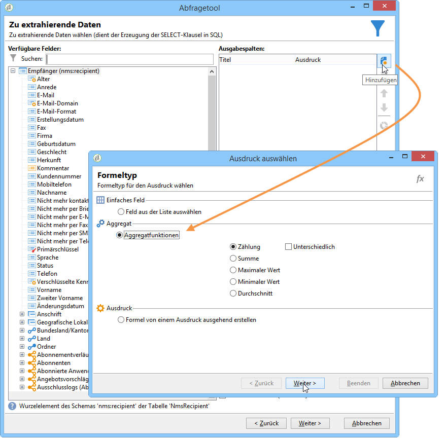

1. Die Zählung der Primärschlüssel wurde konfiguriert.

   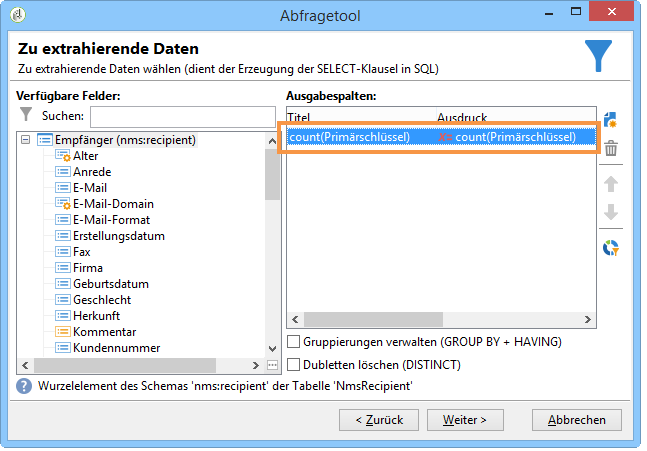

Here is a detailed view of the choices available in the **[!UICONTROL Formula types]** window:

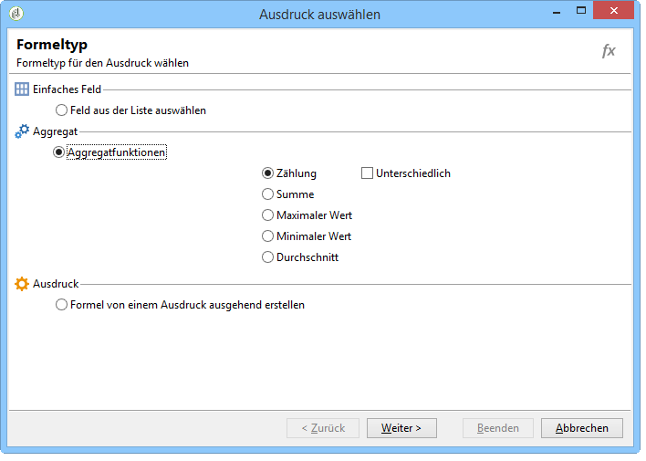

1. **[!UICONTROL Field only]** können Sie zum **[!UICONTROL Field to select]** Fenster zurückkehren.
1. **[!UICONTROL Aggregate (Process on an aggregate function)]**. Hier sind einige Beispiele für die Verwendung als Granulat:

   * **[!UICONTROL Count]** ermöglicht Ihnen die Ausführung einer primären Schlüsselanzahl.
   * **[!UICONTROL Sum]** können Sie alle Einkäufe eines Kunden über ein Jahr zusammenrechnen.
   * **[!UICONTROL Maximum value]** können Sie die Kunden finden, die die meisten &quot;n&quot; Produkte gekauft haben.
   * **[!UICONTROL Minimum value]** Sie können Kunden durchsuchen und diejenigen finden, die ein Angebot zuletzt abonniert haben.
   * **[!UICONTROL Average]**. Mit dieser Funktion können Sie das Durchschnittsalter der Empfänger berechnen.

      Mit **[!UICONTROL Distinct]** dem Feld können Sie eindeutige und ungleich null Werte einer Spalte wiederherstellen. Sie können beispielsweise alle Verfolgungsprotokolle eines Empfängers wiederherstellen, und diese Verfolgungsprotokolle werden in den Wert 1 geändert, da sie alle denselben Empfänger betreffen.

1. **[!UICONTROL Expression]** öffnet das **[!UICONTROL Edit the expression]** Fenster. Auf diese Weise können Sie Telefonnummern mit zu vielen Zahlen erkennen, die vermutlich Eingabefehler sind.

   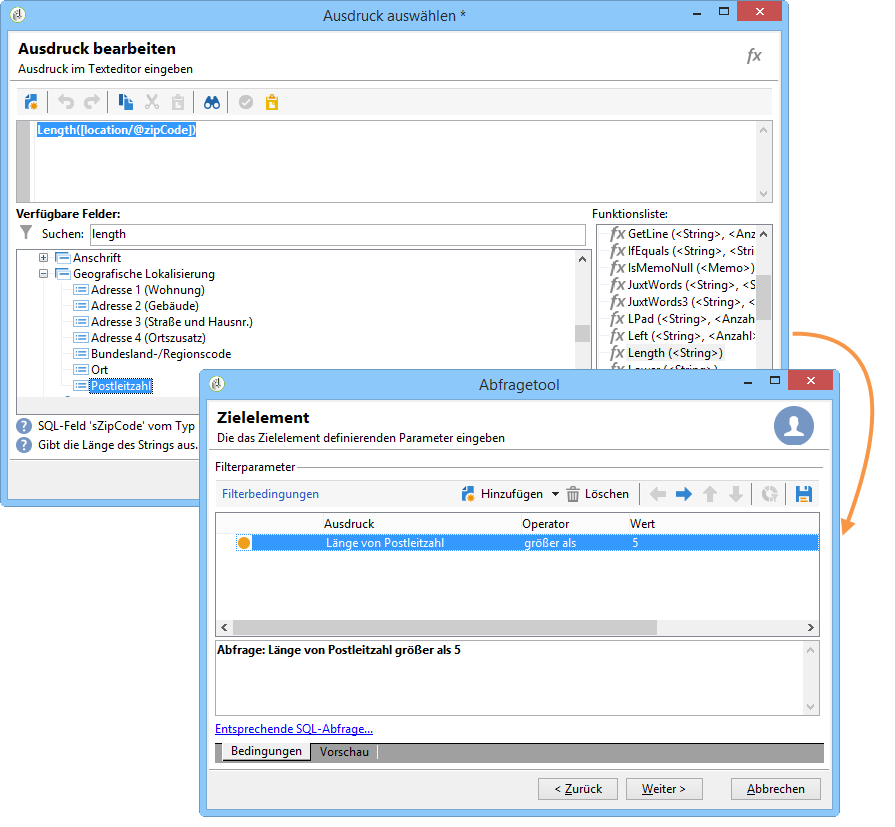

   For a list of all available functions, refer to [List of functions](#list-of-functions).

## Funktionsliste {#list-of-functions}

Wenn eine **[!UICONTROL Expression]** Typformel ausgewählt ist, gelangen Sie zum Fenster &quot;Ausdruck bearbeiten&quot;. Den verfügbaren Feldern können verschiedene Funktionskategorien zugeordnet werden: **[!UICONTROL Aggregates]**, **[!UICONTROL String]**, **[!UICONTROL Date]**, **[!UICONTROL Numerical]**, **[!UICONTROL Currency]**, **[!UICONTROL Geomarketing]**, **[!UICONTROL Windowing function]** und **[!UICONTROL Others]**.

Der Ausdruckseditor gestaltet sich wie folgt:

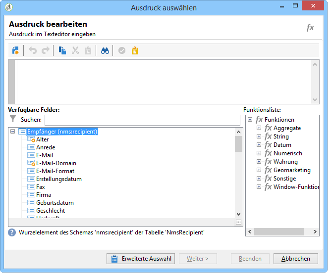

Er ermöglicht die Verknüpfung von Feldern aus den Datenbanktabellen mit folgenden fortgeschrittenen Funktionen:

**Aggregate**

<table> 
 <tbody> 
  <tr> 
   <td> <strong>Name</strong>  </td> 
   <td> <strong>Beschreibung</strong>  </td> 
   <td> <strong>Syntax</strong>  </td> 
  </tr> 
  <tr> 
   <td> <strong>Avg</strong>  </td> 
   <td> Gibt den Durchschnittswert einer Spalte vom Typ Zahl aus  </td> 
   <td> Avg(&lt;Wert&gt;) </td> 
  </tr> 
  <tr> 
   <td> <strong>Count</strong>  </td> 
   <td> Zählt die Werte ungleich null einer Spalte  </td> 
   <td> Count(&lt;Wert&gt;) </td>  
  </tr> 
  <tr> 
   <td> <strong>CountAll</strong>  </td> 
   <td> Zählt die ausgegebenen Werte (alle Felder)  </td> 
   <td> CountAll()  </td> 
  </tr> 
  <tr> 
   <td> <strong>Countdistinct</strong>  </td> 
   <td> Zählt die unterschiedlichen Werte ungleich null einer Spalte  </td> 
   <td> Countdistinct(&lt;Wert&gt;) </td> 
  </tr> 
  <tr> 
   <td> <strong>Max</strong>  </td> 
   <td> Gibt den Höchstwert einer Spalte vom Typ Zahl, String oder Datum aus  </td> 
   <td> Max(&lt;Wert&gt;) </td>  
  </tr> 
  <tr> 
   <td> <strong>Min</strong>  </td> 
   <td> Gibt den Mindestwert einer Spalte vom Typ Zahl, String oder Datum aus  </td> 
   <td> Min(&lt;Wert&gt;) </td> 
  </tr> 
  <tr> 
   <td> <strong>StdDev</strong>  </td> 
   <td> Gibt die Standardabweichung der Werte einer Spalte vom Typ Zahl aus  </td> 
   <td> StdDev(&lt;Wert&gt;) </td> 
  </tr> 
  <tr> 
   <td> <strong>Sum</strong>  </td> 
   <td> Gibt die Summe der Werte einer Spalte vom Typ Zahl, String oder Datum aus  </td> 
   <td> Sum(&lt;Wert&gt;) </td> 
  </tr> 
 </tbody> 
</table>

**String**

<table> 
 <tbody> 
  <tr> 
   <td> <strong>Name</strong>  </td> 
   <td> <strong>Beschreibung</strong>  </td> 
   <td> <strong>Syntax</strong>  </td> 
  </tr> 
  <tr> 
   <td> <strong>AllNonNull2</strong>  </td> 
   <td> Gibt an, ob alle Parameter ungleich null und nicht leer sind  </td> 
   <td> AllNonNull2(&lt;String&gt;, &lt;String&gt;) </td> 
  </tr> 
  <tr> 
   <td> <strong>AllNonNull3</strong>  </td> 
   <td> Gibt an, ob alle Parameter ungleich null und nicht leer sind  </td> 
   <td> AllNonNull3(&lt;String&gt;, &lt;String&gt;, &lt;String&gt;) </td> 
  </tr> 
  <tr> 
   <td> <strong>Ascii</strong>  </td> 
   <td> Gibt den ASCII-Wert des ersten Zeichens des Strings aus.  </td> 
   <td> Ascii(&lt;String&gt;) </td> 
  </tr> 
  <tr> 
   <td> <strong>Char</strong>  </td> 
   <td> Gibt das ASCII-Code-Zeichen 'n' aus  </td> 
   <td> Char(&lt;Zahl&gt;) </td>  
  </tr> 
  <tr> 
   <td> <strong>Charindex</strong>  </td> 
   <td> Gibt die Position des Strings 2 im String 1 aus..  </td> 
   <td> Charindex(&lt;String&gt;, &lt;String&gt;) </td> 
  </tr> 
  <tr> 
   <td> <strong>GetLine</strong>  </td> 
   <td> Gibt die n-te Zeile (beginnend bei 1) des Strings aus  </td> 
   <td> GetLine(&lt;String&gt;) </td> 
  </tr> 
  <tr> 
   <td> <strong>IfEquals</strong>  </td> 
   <td> Gibt den dritten Parameter aus, wenn die ersten beiden Parameter den gleichen Wert aufweisen, sonst wird der letzte Parameter ausgegeben  </td> 
   <td> IfEquals(&lt;String&gt;, &lt;String&gt;, &lt;String&gt;, &lt;String&gt;) </td> 
  </tr> 
  <tr> 
   <td> <strong>IsMemoNull</strong>  </td> 
   <td> Gibt an, ob das als Parameter ausgegebene Memo gleich null ist  </td> 
   <td> IsMemoNull(&lt;memo&gt;) </td> 
  </tr> 
  <tr> 
   <td> <strong>JuxtWords</strong>  </td> 
   <td> Konkatenation von drei als Parameter übergebenen Strings. Fügt, wenn nötig, Leerstellen hinzu.  </td> 
   <td> JuxtWords(&lt;String&gt;, &lt;String&gt;) </td> 
  </tr> 
  <tr> 
   <td> <strong>JuxtWords3</strong>  </td> 
   <td> Konkatenation von drei als Parameter übergebenen Strings. Fügt, wenn nötig, Leerstellen hinzu  </td> 
   <td> JuxtWords3(&lt;String&gt;, &lt;String&gt;, &lt;String&gt;) </td>  
  </tr> 
  <tr> 
   <td> <strong>LPad</strong>  </td> 
   <td> Gibt den String linksseitig aufgefüllt aus  </td> 
   <td> LPad(, &lt;number&gt;, &lt;character&gt;) </td> 
  </tr> 
  <tr> 
   <td> <strong>Left</strong>  </td> 
   <td> Gibt die n ersten Zeichen des Strings aus  </td> 
   <td> Left(&lt;String&gt;, &lt;Zahl&gt;) </td> 
  </tr> 
  <tr> 
   <td> <strong>Length</strong>  </td> 
   <td> Gibt die Länge des Strings aus  </td> 
   <td> Length(&lt;String&gt;) </td> 
  </tr> 
  <tr> 
   <td> <strong>Lower</strong>  </td> 
   <td> Gibt den String in Kleinbuchstaben aus  </td> 
   <td> Lower(&lt;String&gt;) </td> 
  </tr> 
  <tr> 
   <td> <strong>Ltrim</strong>  </td> 
   <td> Löscht die Leerstellen links vom String  </td> 
   <td> Ltrim(&lt;String&gt;) </td> 
  </tr> 
  <tr> 
   <td> <strong>Md5Digest</strong>  </td> 
   <td> Gibt eine hexadezimale Darstellung des MD5-Schlüssels eines Strings aus  </td> 
   <td> Md5Digest(&lt;String&gt;) </td> 
  </tr> 
  <tr> 
   <td> <strong>MemoContains</strong>  </td> 
   <td> Gibt an, ob das Memo den als Parameter übergebenen String enthält  </td> 
   <td> MemoContains(&lt;Memo&gt;, &lt;String&gt;) </td> 
  </tr> 
  <tr> 
   <td> <strong>RPad</strong>  </td> 
   <td> Gibt den String rechtsseitig aufgefüllt aus  </td> 
   <td> RPad(&lt;String&gt;, &lt;Zahl&gt;, &lt;Zeichen&gt;) </td> 
  </tr> 
  <tr> 
   <td> <strong>Right</strong>  </td> 
   <td> Gibt die n letzten Zeichen des Strings aus  </td> 
   <td> Right(&lt;String&gt;)  </td> 
  </tr> 
  <tr> 
   <td> <strong>Rtrim</strong>  </td> 
   <td> Löscht die Leerstellen rechts vom String  </td> 
   <td> Rtrim(&lt;String&gt;)  </td> 
  </tr> 
  <tr> 
   <td> <strong>Smart</strong>  </td> 
   <td> Gibt jedes Wort des Strings beginnend mit einem Großbuchstaben aus  </td> 
   <td> Smart(&lt;String&gt;)  </td> 
  </tr> 
  <tr> 
   <td> <strong>Substring</strong>  </td> 
   <td> Extrahiert aus dem String den Teilstring, der mit dem Zeichen n1 beginnt und die Länge n2 aufweist  </td> 
   <td> Substring(&lt;String&gt;, &lt;Start&gt;, &lt;Länge&gt;)  </td>  
  </tr> 
  <tr> 
   <td> <strong>ToString</strong>  </td> 
   <td> Konvertiert eine Zahl in einen String  </td> 
   <td> ToString(&lt;number&gt;, &lt;number&gt;)  </td>  
  </tr> 
  <tr> 
   <td> <strong>Upper</strong>  </td> 
   <td> Gibt den String in Großbuchstaben aus  </td> 
   <td> Upper(&lt;String&gt;)  </td>  
  </tr> 
  <tr> 
   <td> <strong>VirtualLink</strong>  </td> 
   <td> Gibt den Fremdschlüssel einer als erster Parameter übergebenen Relation aus, wenn die beiden anderen Parameter identisch sind  </td> 
   <td> VirtualLink(&lt;Zahl&gt;, &lt;Zahl&gt;, &lt;Zahl&gt;)  </td>  
  </tr> 
  <tr> 
   <td> <strong>VirtualLinkStr</strong>  </td> 
   <td> Gibt den Fremdschlüssel (Text) einer als erster Parameter übergebenen Relation aus, wenn die beiden anderen Parameter identisch sind  </td> 
   <td> VirtualLinkStr(&lt;String&gt;, &lt;Zahl&gt;, &lt;Zahl&gt;)  </td>  
  </tr> 
  <tr> 
   <td> <strong>dataLength</strong>  </td> 
   <td> Gibt die Größe des Strings in Byte aus  </td> 
   <td> dataLength(&lt;String&gt;)  </td>  
  </tr> 
 </tbody> 
</table>

**Datum**

<table> 
 <tbody> 
  <tr> 
   <td> <strong>Name</strong>  </td> 
   <td> <strong>Beschreibung</strong>  </td> 
   <td> <strong>Syntax</strong>  </td> 
  </tr> 
  <tr> 
   <td> <strong>AddDays</strong>  </td> 
   <td> Fügt dem Datum eine Anzahl an Tagen hinzu  </td> 
   <td> AddDays(&lt;Datum&gt;, &lt;Zahl&gt;)  </td>  
  </tr> 
  <tr> 
   <td> <strong>AddHours</strong>  </td> 
   <td> Fügt dem Datum eine Anzahl an Stunden hinzu  </td> 
   <td> AddHours(&lt;Datum&gt;, &lt;Zahl&gt;)  </td>  
  </tr> 
  <tr> 
   <td> <strong>AddMinutes</strong>  </td> 
   <td> Fügt dem Datum eine Anzahl an Minuten hinzu  </td> 
   <td> AddMinutes(&lt;Datum&gt;, &lt;Zahl&gt;)  </td>  
  </tr> 
  <tr> 
   <td> <strong>AddMonths</strong>  </td> 
   <td> Fügt dem Datum eine Anzahl an Monaten hinzu  </td> 
   <td> AddMonths(&lt;Datum&gt;, &lt;Zahl&gt;)  </td>  
  </tr> 
  <tr> 
   <td> <strong>AddSeconds</strong>  </td> 
   <td> Fügt dem Datum eine Anzahl an Sekunden hinzu  </td> 
   <td> AddSeconds(&lt;Datum&gt;, &lt;Zahl&gt;)  </td>  
  </tr> 
  <tr> 
   <td> <strong>AddYears</strong>  </td> 
   <td> Fügt dem Datum eine Anzahl an Jahren hinzu  </td> 
   <td> AddYears(&lt;Datum&gt;, &lt;Zahl&gt;)  </td>  
  </tr> 
  <tr> 
   <td> <strong>DateOnly</strong>  </td> 
   <td> Gibt nur das Datum aus (mit Uhrzeit = 00:00 Uhr)*  </td> 
   <td> DateOnly(&lt;Datum&gt;)  </td>  
  </tr> 
  <tr> 
   <td> <strong>Day</strong>  </td> 
   <td> Gibt die Zahl aus, die dem Tag des Datums entspricht  </td> 
   <td> Day(&lt;Datum&gt;)  </td>  
  </tr> 
  <tr> 
   <td> <strong>DayOfYear</strong>  </td> 
   <td> Gibt die Zahl des Tages im Jahr des angegebenen Datums aus  </td> 
   <td> DayOfYear(&lt;Datum&gt;)  </td>  
  </tr> 
  <tr> 
   <td> <strong>DaysAgo</strong>  </td> 
   <td> Gibt das Datum aus, das dem aktuellen Datum abzüglich n Tage entspricht  </td> 
   <td> DaysAgo(&lt;Zahl&gt;)  </td>  
  </tr> 
  <tr> 
   <td> <strong>DaysAgoInt</strong>  </td> 
   <td> Gibt das Datum (Integer JJJJMMTT) aus, das dem aktuellen Datum abzüglich n Tage entspricht  </td> 
   <td> DaysAgoInt(&lt;Zahl&gt;)  </td>  
  </tr> 
  <tr> 
   <td> <strong>DaysDiff</strong>  </td> 
   <td> Anzahl von Tagen zwischen zwei Daten  </td> 
   <td> DaysDiff(&lt;Enddatum&gt;, &lt;Startdatum&gt;)  </td>  
  </tr> 
  <tr> 
   <td> <strong>DaysOld</strong>  </td> 
   <td> Gibt das Alter in Tagen in Bezug auf ein Datum aus  </td> 
   <td> DaysOld(&lt;Datum&gt;)  </td>  
  </tr> 
  <tr> 
   <td> <strong>GetDate</strong>  </td> 
   <td> Gibt das aktuelle Systemdatum des Servers aus  </td> 
   <td> GetDate()  </td> 
  </tr> 
  <tr> 
   <td> <strong>Hour</strong>  </td> 
   <td> Gibt die Stunde der im Datum angegebenen Uhrzeit aus  </td> 
   <td> Hour(&lt;Datum&gt;)  </td>  
  </tr> 
  <tr> 
   <td> <strong>HoursDiff</strong>  </td> 
   <td> Gibt die Anzahl von Stunden zwischen zwei Daten aus  </td> 
   <td> HoursDiff(&lt;Enddatum&gt;, &lt;Startdatum&gt;)  </td>  
  </tr> 
  <tr> 
   <td> <strong>Minute</strong>  </td> 
   <td> Gibt die Minuten der im Datum angegebenen Uhrzeit aus  </td> 
   <td> Minute(&lt;Datum&gt;)  </td>  
  </tr> 
  <tr> 
   <td> <strong>MinutesDiff</strong>  </td> 
   <td> Gibt die Anzahl von Minuten zwischen zwei Daten aus  </td> 
   <td> MinutesDiff(&lt;Enddatum&gt;, &lt;Startdatum&gt;)  </td>  
  </tr> 
  <tr> 
   <td> <strong>Month</strong>  </td> 
   <td> Gibt die Zahl aus, die dem Monat des Datums entspricht  </td> 
   <td> Month(&lt;Datum&gt;)  </td>  
  </tr> 
  <tr> 
   <td> <strong>MonthsAgo</strong>  </td> 
   <td> Gibt das Datum aus, das dem aktuellen Datum abzüglich n Monate entspricht  </td> 
   <td> MonthsAgo(&lt;Zahl&gt;)  </td>  
  </tr> 
  <tr> 
   <td> <strong>MonthsDiff</strong>  </td> 
   <td> Gibt die Anzahl von Monaten zwischen zwei Daten aus  </td> 
   <td> MonthsDiff(&lt;Enddatum&gt;, &lt;Startdatum&gt;)  </td>  
  </tr> 
  <tr> 
   <td> <strong>MonthsOld</strong>  </td> 
   <td> Gibt das Alter in Monaten in Bezug auf ein Datum aus  </td> 
   <td> MonthsOld(&lt;Datum&gt;)  </td>  
  </tr> 
  <tr> 
   <td> <strong>Second</strong>  </td> 
   <td> Gibt die Sekunden der im Datum angegebenen Uhrzeit aus  </td> 
   <td> Second(&lt;Datum&gt;)  </td>  
  </tr> 
  <tr> 
   <td> <strong>SecondsDiff</strong>  </td> 
   <td> Gibt die Anzahl von Sekunden zwischen zwei Daten aus  </td> 
   <td> SecondsDiff(&lt;Enddatum&gt;, &lt;Startdatum&gt;)  </td>  
  </tr> 
  <tr> 
   <td> <strong>SubDays</strong>  </td> 
   <td> Zieht die angegebene Anzahl von Tagen vom Datum ab  </td> 
   <td> SubDays(&lt;Datum&gt;, &lt;Zahl&gt;)  </td>  
  </tr> 
  <tr> 
   <td> <strong>SubHours</strong>  </td> 
   <td> Zieht die angegebene Anzahl von Stunden vom Datum ab  </td> 
   <td> SubHours(&lt;Datum&gt;, &lt;Zahl&gt;)  </td>  
  </tr> 
  <tr> 
   <td> <strong>SubMinutes</strong>  </td> 
   <td> Zieht die angegebene Anzahl von Minuten vom Datum ab  </td> 
   <td> SubMinutes(&lt;Datum&gt;, &lt;Zahl&gt;)  </td>  
  </tr> 
  <tr> 
   <td> <strong>SubMonths</strong>  </td> 
   <td> Zieht die angegebene Anzahl von Monaten vom Datum ab  </td> 
   <td> SubMonths(&lt;Datum&gt;, &lt;Zahl&gt;)  </td>  
  </tr> 
  <tr> 
   <td> <strong>SubSeconds</strong>  </td> 
   <td> Zieht die angegebene Anzahl von Sekunden vom Datum ab  </td> 
   <td> SubSeconds(&lt;Datum&gt;, &lt;Zahl&gt;)  </td>  
  </tr> 
  <tr> 
   <td> <strong>SubYears</strong>  </td> 
   <td> Zieht die angegebene Anzahl von Jahren vom Datum ab  </td> 
   <td> SubYears(&lt;Datum&gt;, &lt;Zahl&gt;)  </td>  
  </tr> 
  <tr> 
   <td> <strong>ToDate</strong>  </td> 
   <td> Konvertiert eine Angabe Datum+Uhrzeit in Datum alleine  </td> 
   <td> ToDate(&lt;Datum + Uhrzeit&gt;)  </td>  
  </tr> 
  <tr> 
   <td> <strong>ToDateTime</strong>  </td> 
   <td> Konvertiert einen String in Datum+Uhrzeit  </td> 
   <td> ToDateTime(&lt;String&gt;)  </td>  
  </tr> 
  <tr> 
   <td> <strong>TruncDate</strong>  </td> 
   <td> Kürzt die Angabe Datum+Uhrzeit auf Sekunden  </td> 
   <td> TruncDate(@lastModified, &lt;Anzahl Sekunden&gt;)  </td> 
  </tr> 
  <tr> 
   <td> <strong>TruncDateTZ</strong>  </td> 
   <td> Kürzt die Angabe Datum+Uhrzeit auf Sekunden  </td> 
   <td> TruncDateTZ(&lt;Datum&gt;, &lt;Anzahl Sekunden&gt;, &lt;Zeitzone&gt;)  </td> 
  </tr> 
  <tr> 
   <td> <strong>TruncQuarter</strong>  </td> 
   <td> Kürzt die Angabe des Datums auf den ersten Tag des Quartals  </td> 
   <td> TruncQuarter(&lt;Datum&gt;)  </td>  
  </tr> 
  <tr> 
   <td> <strong>TruncTime</strong>  </td> 
   <td> Kürzt die Uhrzeitangabe auf Sekunden  </td> 
   <td> TuncTim(e&lt;Datum&gt;, &lt;Anzahl Sekunden&gt;)  </td>  
  </tr> 
  <tr> 
   <td> <strong>TruncWeek</strong>  </td> 
   <td> Kürzt ein Datum auf die Woche  </td> 
   <td> TruncWeek(&lt;Datum&gt;)  </td>  
  </tr> 
  <tr> 
   <td> <strong>TruncYear</strong>  </td> 
   <td> Kürzt die Angabe Datum+Uhrzeit auf den ersten Januar des Jahres  </td> 
   <td> TruncYear(&lt;Datum&gt;)  </td>  
  </tr> 
  <tr> 
   <td> <strong>TruncWeek</strong>  </td> 
   <td> Gibt die Zahl des Wochentags in Bezug auf das Datum aus (0=Montag, 6=Sonntag)  </td> 
   <td> WeekDay(&lt;Datum&gt;)  </td>  
  </tr> 
  <tr> 
   <td> <strong>Year</strong>  </td> 
   <td> Gibt die Zahl aus, die dem Jahr des Datums entspricht  </td> 
   <td> Year(&lt;Datum&gt;)  </td>  
  </tr> 
  <tr> 
   <td> <strong>YearAndMonth</strong>  </td> 
   <td> Gibt Jahr und Monat eines Datums aus  </td> 
   <td> YearAndMonth(&lt;Datum&gt;)  </td>  
  </tr> 
  <tr> 
   <td> <strong>YearsDiff</strong>  </td> 
   <td> Gibt die Anzahl von Jahren zwischen zwei Daten aus  </td> 
   <td> YearsDiff(&lt;Enddatum&gt;, &lt;Startdatum&gt;)  </td>  
  </tr> 
  <tr> 
   <td> <strong>YearsOld</strong>  </td> 
   <td> Gibt das Alter in Jahren in Bezug auf ein Datum aus  </td> 
   <td> YearsOld(&lt;Datum&gt;)  </td>  
  </tr> 
 </tbody> 
</table>

>[!NOTE]
>
>Beachten Sie, dass die Funktion **Dateonly** nicht die Zeitzone des Benutzers, sondern des Servers verwendet.

**Numerisch**

<table> 
 <tbody> 
  <tr> 
   <td> <strong>Name</strong>  </td> 
   <td> <strong>Beschreibung</strong>  </td> 
   <td> <strong>Syntax</strong>  </td> 
  </tr> 
  <tr> 
   <td> <strong>Abs</strong>  </td> 
   <td> Gibt den absoluten Wert einer Zahl aus  </td> 
   <td> Abs(&lt;Zahl&gt;)  </td>  
  </tr> 
  <tr> 
   <td> <strong>Ceil</strong>  </td> 
   <td> Gibt die kleinste ganze Zahl aus, die größer oder gleich der angegebenen Zahl ist  </td> 
   <td> Ceil(&lt;Zahl&gt;)  </td>  
  </tr> 
  <tr> 
   <td> <strong>Floor</strong>  </td> 
   <td> Gibt die größte ganze Zahl aus, die kleiner oder gleich der angegebenen Zahl ist  </td> 
   <td> Floor(&lt;Zahl&gt;)  </td>  
  </tr> 
  <tr> 
   <td> <strong>Greatest</strong>  </td> 
   <td> Gibt die größere von zwei Zahlen aus  </td> 
   <td> Greatest(&lt;Zahl 1&gt;, &lt;Zahl 2&gt;)  </td>  
  </tr> 
  <tr> 
   <td> <strong>Least</strong>  </td> 
   <td> Gibt die kleinere von zwei Zahlen aus  </td> 
   <td> Least(&lt;Zahl 1&gt;, &lt;Zahl 2&gt;)  </td>  
  </tr> 
  <tr> 
   <td> <strong>Mod</strong>  </td> 
   <td> Gibt den Rest der ganzzahligen Division von n1 durch n2 aus  </td> 
   <td> Mod(&lt;Zahl 1&gt;, &lt;Zahl 2&gt;)  </td>  
  </tr> 
  <tr> 
   <td> <strong>Percent</strong>  </td> 
   <td> Gibt das Verhältnis zwischen zwei Werten in Prozent aus  </td> 
   <td> Percent(&lt;Zahl 1&gt;, &lt;Zahl 2&gt;)  </td>  
  </tr> 
  <tr> 
   <td> <strong>Random</strong>  </td> 
   <td> Gibt einen Zufallswert aus  </td> 
   <td> Random()  </td> 
  </tr> 
  <tr> 
   <td> <strong>Round</strong>  </td> 
   <td> Rundet eine Zahl auf n Dezimalstellen  </td> 
   <td> Round(&lt;Zahl&gt;, &lt;Anzahl Dezimalstellen&gt;)  </td>  
  </tr> 
  <tr> 
   <td> <strong>Sign</strong>  </td> 
   <td> Gibt das Vorzeichen einer Zahl aus  </td> 
   <td> Sign(&lt;Zahl&gt;)  </td>  
  </tr> 
  <tr> 
   <td> <strong>ToDouble</strong>  </td> 
   <td> Konvertiert einen Integer in einen Real  </td> 
   <td> ToDouble(&lt;Zahl&gt;)  </td>  
  </tr> 
  <tr> 
   <td> <strong>ToInt64</strong>  </td> 
   <td> Konvertiert einen Real in einen 64-Bit-Integer  </td> 
   <td> ToInt64(&lt;Zahl&gt;)  </td>  
  </tr> 
  <tr> 
   <td> <strong>ToInteger</strong>  </td> 
   <td> Konvertiert einen Real in einen Integer  </td> 
   <td> ToInteger(&lt;Zahl&gt;)  </td>  
  </tr> 
  <tr> 
   <td> <strong>Trunc</strong>  </td> 
   <td> Kürzt n1 auf n2 Dezimalstellen  </td> 
   <td> Trunc(&lt;n1&gt;, &lt;n2&gt;)  </td>  
  </tr> 
 </tbody> 
</table>

1. Währung

<table> 
 <tbody> 
  <tr> 
   <td> <strong>Name</strong>  </td> 
   <td> <strong>Beschreibung</strong>  </td> 
   <td> <strong>Syntax</strong>  </td> 
  </tr> 
  <tr> 
   <td> <strong>ConvertCurrency</strong>  </td> 
   <td> Konvertiert einen Betrag der Ursprungswährung in einen Betrag der Zielwährung  </td> 
   <td> ConvertCurrency(&lt;Betrag&gt;, &lt;Ursprungswährung&gt;, &lt;Zielwährung&gt;, &lt;Umrechnungsdatum&gt;)  </td>  
  </tr> 
  <tr> 
   <td> <strong>FormatCurrency</strong>  </td> 
   <td> Formatiert einen Betrag, um ihn den Parametern der gewählten Währung entsprechend anzuzeigen  </td> 
   <td> FormatCurrency(&lt;Betrag&gt;, &lt;Währung&gt;)  </td>  
  </tr> 
 </tbody> 
</table>

**Geomarketing**

<table> 
 <tbody> 
  <tr> 
   <td> <strong>Name</strong>  </td> 
   <td> <strong>Beschreibung</strong>  </td> 
   <td> <strong>Syntax</strong>  </td> 
  </tr> 
  <tr> 
   <td> <strong>Distance</strong>  </td> 
   <td> Gibt die Entfernung zwischen zwei durch Längen- und Breitengrad bezeichneten Punkten aus (in Grad)..  </td> 
   <td> Distance(&lt;Längengrad A&gt;, &lt;Breitengrad A&gt;, &lt;Längengrad B&gt;, &lt;Breitengrad B&gt;)  </td>  
  </tr> 
 </tbody> 
</table>

**Sonstige**

<table> 
 <tbody> 
  <tr> 
   <td> <strong>Name</strong>  </td> 
   <td> <strong>Beschreibung</strong>  </td> 
   <td> <strong>Syntax</strong>  </td> 
  </tr> 
  <tr> 
   <td> <strong>Case</strong>  </td> 
   <td> Gibt den Wert 1 aus, wenn die Bedingung wahr ist, sonst den Wert 2  </td> 
   <td> Case(When(&lt;Bedingung&gt;, &lt;Wert 1&gt;), Else(&lt;Wert 2&gt;))  </td> 
  </tr> 
  <tr> 
   <td> <strong>ClearBit</strong>  </td> 
   <td> Löscht das Flag aus dem Wert  </td> 
   <td> ClearBit(&lt;Kennung&gt;, &lt;Flag&gt;)  </td>  
  </tr> 
  <tr> 
   <td> <strong>Coalesce</strong>  </td> 
   <td> Gibt den Wert 2 aus, wenn der Wert 1 gleich null oder leer ist, sonst den Wert 1  </td> 
   <td> Coalesce(&lt;Wert 1&gt;, &lt;Wert 2&gt;)  </td>  
  </tr> 
  <tr> 
   <td> <strong>Decode</strong>  </td> 
   <td> Gibt Wert 3 aus, wenn Wert 1 = Wert 2, sonst den Wert 4  </td> 
   <td> Decode(&lt;Wert 1&gt;, &lt;Wert 2&gt;, &lt;Wert 3&gt;, &lt;Wert 4&gt;)  </td>  
  </tr> 
  <tr> 
   <td> <strong>Else</strong>  </td> 
   <td> Gibt den Wert 1 aus (kann nur als Parameter der 'Case'-Funktion verwendet werden)  </td> 
   <td> Else(&lt;value 1&gt;, &lt;value 2&gt;)  </td>  
  </tr> 
  <tr> 
   <td> <strong>GetEmailDomain</strong>  </td> 
   <td> Extrahiert die Domain einer E-Mail-Adresse  </td> 
   <td> GetEmailDomain(&lt;Wert&gt;)  </td>  
  </tr> 
  <tr> 
   <td> <strong>GetMirrorURL</strong>  </td> 
   <td> Ruft die URL des Mirrorseiten-Servers ab  </td> 
   <td> GetMirrorURL(&lt;Wert&gt;)  </td>  
  </tr> 
  <tr> 
   <td> <strong>Iif</strong>  </td> 
   <td> Gibt den Wert 1 aus, wenn der Ausdruck wahr ist, sonst den Wert 2  </td> 
   <td> Iif(&lt;Bedingung&gt;, &lt;Wert 1&gt;, &lt;Wert 2&gt;)  </td>  
  </tr> 
  <tr> 
   <td> <strong>IsBitSet</strong>  </td> 
   <td> Gibt an, ob das Flag im Wert vorkommt  </td> 
   <td> IsBitSet(&lt;Kennung&gt;, &lt;Flag&gt;)  </td>  
  </tr> 
  <tr> 
   <td> <strong>IsEmptyString</strong>  </td> 
   <td> Gibt den Wert 2 aus, wenn der String 1 leer ist, sonst den Wert 3  </td> 
   <td> IsEmptyString(&lt;Wert 1&gt;, &lt;Wert 2&gt;, &lt;Wert 3&gt;)  </td>  
  </tr> 
  <tr> 
   <td> <strong>NoNull</strong>  </td> 
   <td> Gibt einen Leerstring aus, wenn das Argument gleich null ist  </td> 
   <td> NoNull(&lt;Wert&gt;)  </td>   
  </tr> 
  <tr> 
   <td> <strong>RowId</strong>  </td> 
   <td> Gibt die Zeilennummer aus  </td> 
   <td> RowId  </td> 
  </tr> 
  <tr> 
   <td> <strong>SetBit</strong>  </td> 
   <td> Setzt das Flag im Wert  </td> 
   <td> SetBit(&lt;Kennung&gt;, &lt;Flag&gt;)  </td>  
  </tr> 
  <tr> 
   <td> <strong>ToBoolean</strong>  </td> 
   <td> Konvertiert eine Zahl in einen booleschen Wert  </td> 
   <td> ToBoolean(&lt;Zahl&gt;)  </td>   
  </tr> 
  <tr> 
   <td> <strong>When</strong>  </td> 
   <td> Gibt den Wert 1 aus, wenn der Ausdruck wahr ist, sonst den Wert 2 (kann nur als Parameter der 'Case'-Funktion verwendet werden)  </td> 
   <td> When(&lt;Bedingung&gt;, &lt;Wert 1&gt;)  </td>  
  </tr> 
 </tbody> 
</table>

**Window-Funktionen**

<table> 
 <tbody> 
  <tr> 
   <td> <strong>Name</strong>  </td> 
   <td> <strong>Beschreibung</strong>  </td> 
   <td> <strong>Syntax</strong>  </td> 
  </tr> 
  <tr> 
   <td> <strong>Desc</strong>  </td> 
   <td> Absteigende Sortierung  </td> 
   <td> Desc(&lt;Wert 1&gt;)  </td>  
  </tr> 
  <tr> 
   <td> <strong>OrderBy</strong>  </td> 
   <td> Sortiert das Ergebnis innerhalb der Partition  </td> 
   <td> OrderBy(&lt;Wert 1&gt;)  </td>  
  </tr> 
  <tr> 
   <td> <strong>PartitionBy</strong>  </td> 
   <td> Partitioniert das Ergebnis einer Abfrage  </td> 
   <td> PartitionBy(&lt;Wert 1&gt;)  </td>  
  </tr> 
  <tr> 
   <td> <strong>RowNum</strong>  </td> 
   <td> Erzeugt eine Zeilennummer in Abhängigkeit von der Tabellenpartition und der Sortierreihenfolge  </td> 
   <td> RowNum(PartitionBy(&lt;Wert 1&gt;), OrderBy(&lt;Wert 1&gt;))  </td> 
  </tr> 
 </tbody> 
</table>