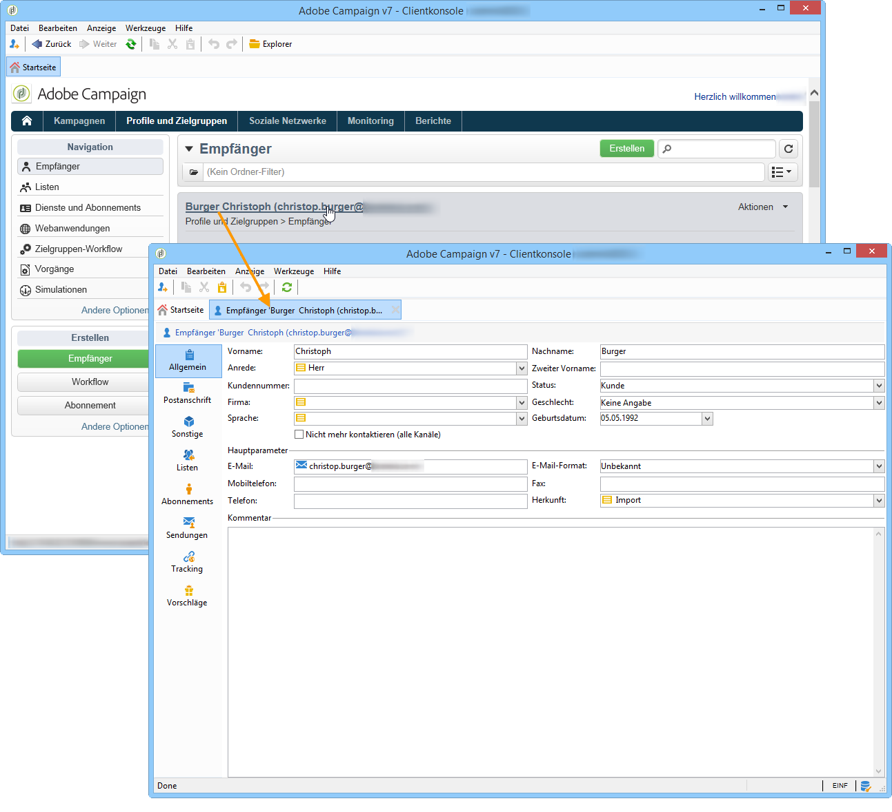
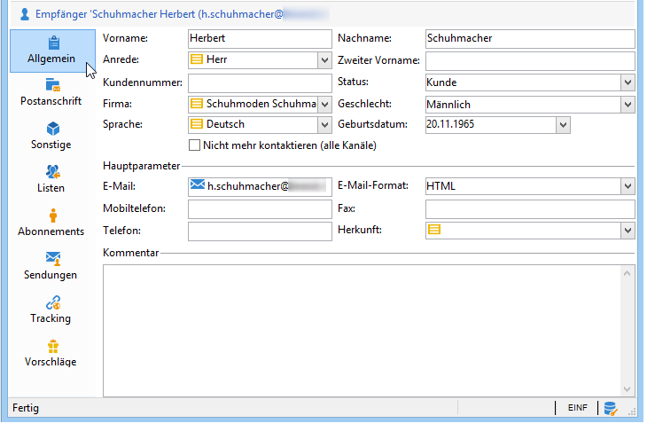
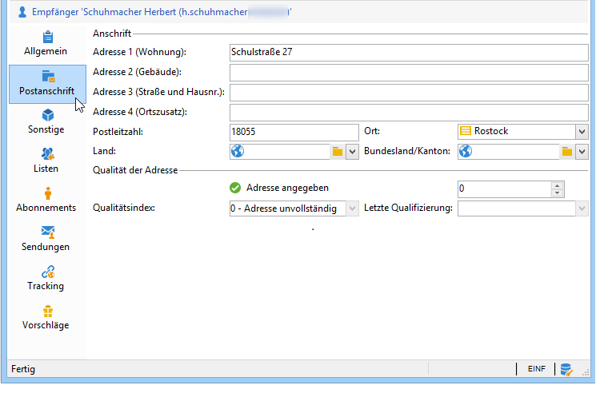
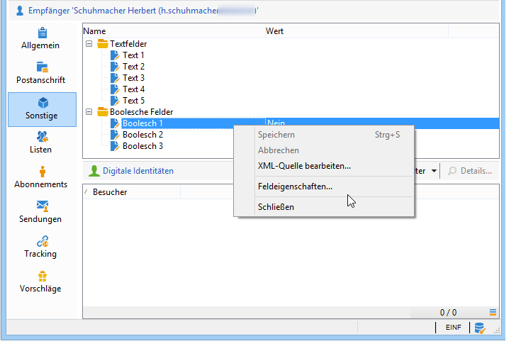
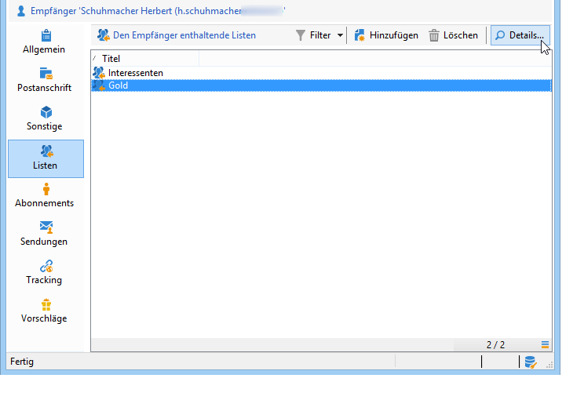
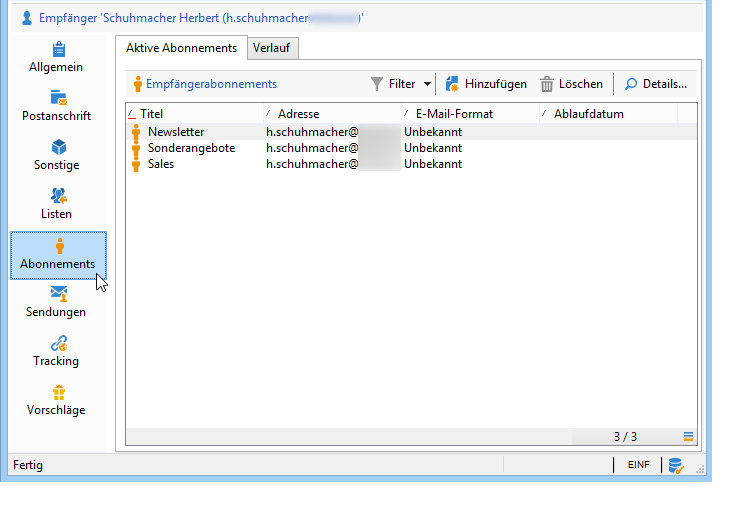
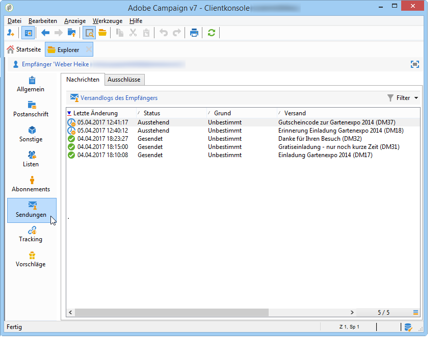
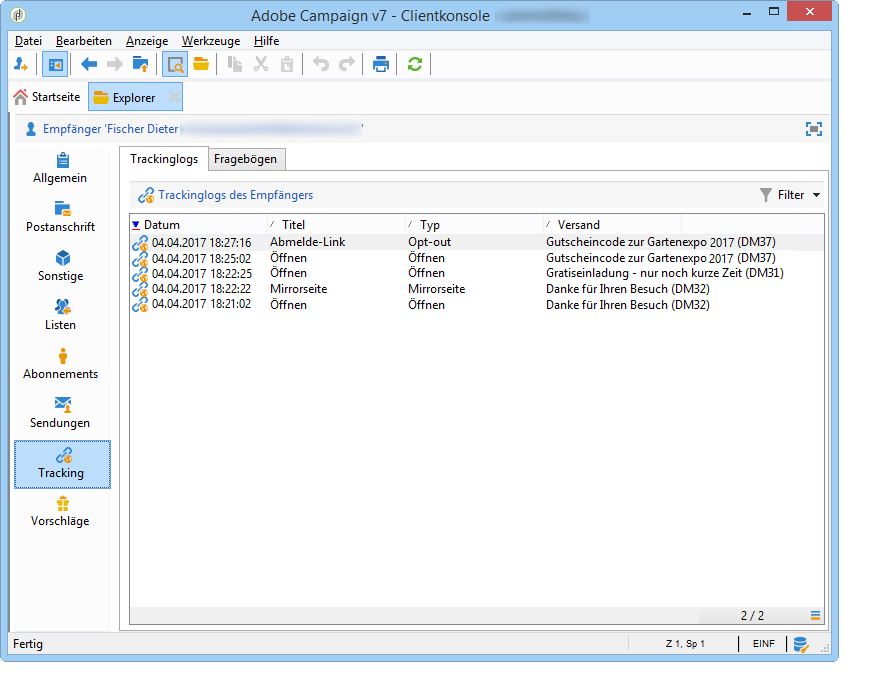

# Profile bearbeiten{#editing-a-profile}

Klicken Sie auf den Namen eines Profils, um seine Profilinformationen anzuzeigen.

Dies geschieht in einem neuen Fenster.

In verschiedenen Tabs werden die Informationen bezüglich eines Profils nach Themen geordnet.

Tabs und ihr Inhalt sind abhängig von Ihrer Konfiguration und den installierten Packages.

>[!CAUTION]
>
>Auf das XML-Schema und das den Feldern der Profiltabelle entsprechende Formular kann über den Verzeichnisknoten **[!UICONTROL Administration > Konfiguration > Datenschemata]** zugegriffen werden. Eventuelle Änderungen dieser Schemata sollten von erfahrenen Benutzern vorgenommen werden.
>
>Weiterführende Informationen dazu finden Sie auf [dieser Seite](../../configuration/using/about-schema-edition.md).

## Tab &quot;Allgemein&quot;{#general-tab}

Dieser Bildschirm enthält alle allgemeinen Informationen zum ausgewählten Profil, insbesondere Nachname, Vorname, E-Mail-Adresse, E-Mail-Empfangsformat etc.:

>[!NOTE]
>
>Wenn die Option **[!UICONTROL Nicht mehr kontaktieren (alle Kanäle)]** aktiviert ist, bedeutet dies, dass das Profil auf der Blockierungsliste steht; das Profil hat also den Wunsch geäußert, nicht kontaktiert zu werden (z. B. durch Klicken auf einen Abmelde-Link in einem Newsletter). Das Profil wird keine Sendungen mehr erhalten (auf keinem Kanal: ob E-Mail, Briefpost usw.). Weiterführende Informationen hierzu finden Sie auf dieser [Seite](../../delivery/using/understanding-quarantine-management.md).

## Tab &quot;Kontaktdaten&quot;{#contact-information-tab}

Dieser Bildschirm enthält die Postanschrift des ausgewählten Profils:

Hier werden zudem der Qualitätsindex sowie die Anzahl von fehlgeschlagenen Sendeversuchen in Bezug auf diese Adresse hinterlegt. Diese Informationen werden direkt vom für die Briefpost zuständigen Dienstleister eingespeist und können nicht manuell geändert werden.

## Tab &quot;Sonstige&quot;{#other-tab}

Dieser Bildschirm enthält frei vom Benutzer definierbare Felder. Sie haben über das Menü **[!UICONTROL Feldeigenschaften...]** die Möglichkeit, Felder umzubenennen oder das Format zu ändern, wie das folgende Beispiel zeigt:

>[!NOTE]
>
>Auf [dieser Seite](../../configuration/using/new-field-wizard.md) finden Sie weitere Angaben zu den Feldeigenschaften und zum Hinzufügen von Feldern.

## Tab &quot;Listen&quot;{#lists-tab}

Dieser Bildschirm zeigt an, welchen Gruppen der ausgewählte Empfänger angehört. Durch Klick auf die Schaltfläche **[!UICONTROL Hinzufügen]** kann das Profil zu einer Liste hinzugefügt werden. Klicken Sie auf die Schaltfläche **[!UICONTROL Details]**, um die Beschreibung der Liste und alle enthaltenen Profile anzuzeigen.

Weitere Informationen finden Sie unter [Listen erstellen und verwalten](../../platform/using/creating-and-managing-lists.md).

## Tab &quot;Abonnements&quot;{#subscriptions-tab}

Dieser Bildschirm enthält die Informationsdienste, die das Profil abonniert hat.

Die Schaltfläche **[!UICONTROL Details]** zeigt die Eigenschaften des ausgewählten Abonnements an. Die Schaltfläche **[!UICONTROL Hinzufügen]** erlaubt die manuelle Anmeldung eines Empfängers für einen Informationsdienst.

Weiterführende Informationen hierzu finden Sie auf dieser [Seite](../../delivery/using/managing-subscriptions.md).

## Tab &quot;Sendungen&quot;{#deliveries-tab}

Dieser Bildschirm enthält die Versandlogs für das ausgewählte Profil. Es werden Titel, Datum und Status aller an das Profil adressierten Sendungen für alle Kanäle angezeigt.

## Tab Tracking {#tracking-tab}

Dieser Bildschirm enthält die Trackinglogs für das ausgewählte Profil. Mithilfe dieser Informationen können Sie das Verhalten des Profils nach Erhalt eines Versands verfolgen.

Dieser Tab zeigt alle in Sendungen getrackten URLs an.

In der Regel enthält die anpassbare Liste folgende Daten: die geklickte URL, Datum und Uhrzeit des Klicks, das Dokument, in dem die URL enthalten war.

>[!NOTE]
>
>Auf [dieser Seite](../../delivery/using/monitoring-a-delivery.md) finden Sie weitere Informationen zur Trackingfunktion.

