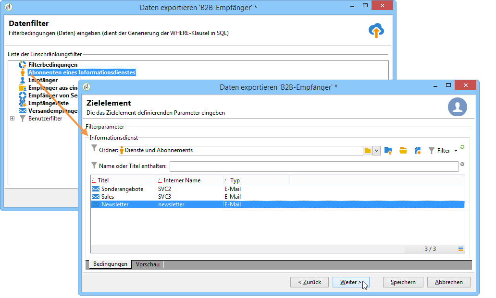
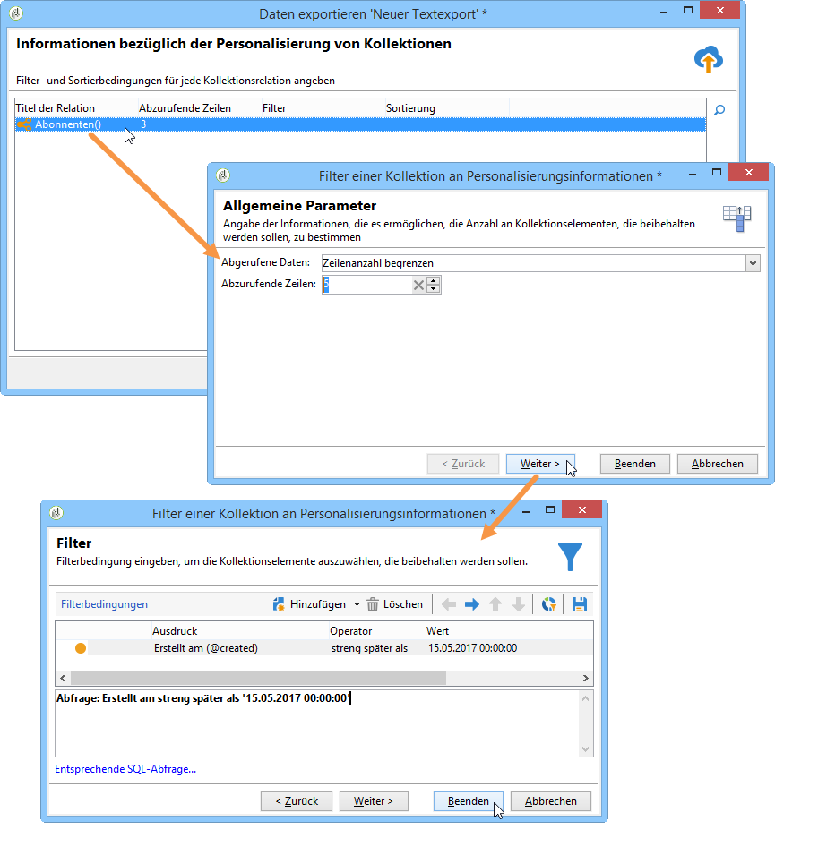

# Konfigurieren von Exportvorgängen {#executing-export-jobs}

Mit Exportvorgängen können Sie Daten aus der Datenbank aufrufen und extrahieren: Kontakte, Kunden, Listen, Segmente usw.

So kann es sinnvoll sein, Tracking-Daten von Kampagnen (Tracking-Verlauf usw.) in einer Tabelle zu verwenden. Die Ausgabedaten können in den Formaten &quot;txt&quot;, &quot;CSV&quot;, &quot;TAB&quot; oder &quot;XML&quot; vorliegen.

Mit dem Export-Assistenten können Sie einen Export konfigurieren, seine Optionen definieren und die Ausführung starten. Es handelt sich dabei um eine Reihe von Bildschirmen, deren Inhalt von der Art des Exports (einfach oder mehrfach) und den Rechten des Benutzers abhängt.

Der Export-Assistent wird nach der Erstellung eines neuen Exportvorgangs angezeigt (siehe [Erstellen von Import- und Exportvorgängen](../../platform/using/creating-import-export-jobs.md).

## 1. Schritt – Exportvorlage auswählen {#step-1---choosing-the-export-template}

Beim Start des Export-Assistenten muss zunächst eine Vorlage ausgewählt werden. Um beispielsweise den Export von Empfängern zu konfigurieren, die sich kürzlich angemeldet haben, gehen Sie folgendermaßen vor:

1. Gehen Sie zum Ordner **[!UICONTROL Profile und Zielgruppen > Vorgang > Allgemeine Importe und Exporte]**.
1. Wählen Sie **Neu** und danach **Exportieren** aus, um die Exportvorlage zu erstellen.

   

1. Klicken Sie zur Auswahl der gewünschten Vorlage rechts vom Feld **[!UICONTROL Exportvorlage]** entweder auf den Pfeil oder auf **[!UICONTROL Verknüpftes Element auswählen]**, um den Navigationsbaum zu durchsuchen.

   Die native Vorlage lautet **[!UICONTROL Neuer Textexport]**. Diese Vorlage darf nicht geändert werden. Sie können sie jedoch duplizieren, um eine neue Vorlage zu konfigurieren. Standardmäßig werden Exportvorlagen im **[!UICONTROL Ressourcen > Vorlagen > Bearbeitungsvorlagen]** Knoten.

1. Geben Sie im Feld **[!UICONTROL Titel]** einen Namen für den Export ein und fügen Sie eventuell eine Beschreibung hinzu.
1. Wählen Sie den Exporttyp aus. Es gibt zwei mögliche Exporttypen: **[!UICONTROL Einfacher Export]** nur eine Datei exportieren und **[!UICONTROL Mehrfach-Export]** um mehrere Dateien in einer Ausführung aus einem oder mehreren Quelldokumenttypen zu exportieren.

## 2. Schritt – Dateityp auswählen {#step-2---type-of-file-to-export}

Wählen Sie den Typ des zu exportierenden Dokuments aus, d. h. das Schema der zu exportierenden Daten.

Standardmäßig, wenn der Export über die **[!UICONTROL Aufträge]** -Knoten aus der Empfängertabelle stammt. Wenn der Export aus einer Datenliste (aus der **[!UICONTROL Rechtsklick > Export]** ), die Tabelle, zu der die Daten gehören, automatisch im **[!UICONTROL Dokumenttyp]** -Feld.

* Standardmäßig wird die Variable **[!UICONTROL Laden Sie die nach dem Export auf dem Server generierte Datei herunter]** ausgewählt ist. Im **[!UICONTROL Lokale Datei]** Geben Sie den Namen und Pfad der zu erstellenden Datei ein oder durchsuchen Sie Ihre lokale Festplatte, indem Sie auf den Ordner rechts vom Feld klicken. Sie können diese Option deaktivieren, um den Zugriffspfad und den Namen der Server-Ausgabedatei einzugeben.

  >[!NOTE]
  >
  >Automatische Im- und Exporte werden stets auf dem Server durchgeführt.
  >
  >Sollten Sie nur einen Teil der Daten exportieren wollen, klicken Sie auf **[!UICONTROL Erweiterte Parameter...]** und geben Sie die Anzahl der zu exportierenden Zeilen an.

* Sie können einen Differenzexport erstellen, um nur Datensätze zu exportieren, die seit der letzten Ausführung geändert wurden. Klicken Sie dazu auf die Schaltfläche **[!UICONTROL Erweiterte Parameter]** und klicken Sie auf die **[!UICONTROL Differenzexport]** Registerkarte und wählen Sie **[!UICONTROL Differenzexport aktivieren]**.

  

  Hier ist die Angabe des Datums der letzten Änderung erforderlich. Dies geschieht durch Abruf aus einem Feld oder durch Berechnung.

## 3. Schritt – Ausgabeformat bestimmen {#step-3---defining-the-output-format}

Wählen Sie nun das Ausgabeformat der Exportdatei aus. Mögliche Formate sind Text, Text in festen Spalten, CSV und XML.

* Beim Format **[!UICONTROL Text]** sind die Spaltentrennzeichen (Tabstopp, Komma, Semikolon oder Sonstige) sowie die Zeichenfolgen-Qualifizierer (Ohne, Doppelte Anführungszeichen, Einfache Anführungszeichen) anzugeben.
* Bei den Formaten **[!UICONTROL Text]** und **[!UICONTROL CSV]** besteht die Möglichkeit, die Option **[!UICONTROL Erste Zeile enthält die Spaltentitel]** anzukreuzen.
* Geben Sie das Format von Datum und Zahl an. Klicken Sie dazu auf die Schaltfläche **[!UICONTROL Bearbeiten]** für das entsprechende Feld und verwenden Sie den Editor.
* Bei Feldern, die Aufzählungswerte enthalten, können Sie **[!UICONTROL Exportieren von Bezeichnungen anstelle der internen Werte von Auflistungen]**. Beispielsweise kann der Titel im Formular gespeichert werden **1 = Herr**, **2=Miss**, **3 = Mrs.**. Wenn diese Option ausgewählt wird, werden **Mr.**, **Miss** und **Mrs.** exportiert.

## 4. Schritt – Daten auswählen {#step-4---data-selection}

Wählen Sie die zu exportierenden Felder aus. Gehen Sie dazu folgendermaßen vor:

1. Wählen Sie per Doppelklick die gewünschten Felder in der Liste **[!UICONTROL Verfügbare Felder]** aus, um sie zum Bereich **[!UICONTROL Ausgabespalten]** hinzuzufügen.
1. Mit den Pfeilen rechts neben der Liste können Sie die Reihenfolge der Felder in der Ausgabedatei festlegen.

   

1. Klicken Sie auf die Schaltfläche **[!UICONTROL Hinzufügen]**, um Funktionen aufzurufen. Weitere Informationen hierzu finden Sie unter [Funktionsliste](../../platform/using/defining-filter-conditions.md#list-of-functions).

## 5. Schritt – Spalten sortieren {#step-5---sorting-columns}

An dieser Stelle kann die Sortierreihenfolge der einzelnen Spalten festgelegt werden.

## 6. Schritt – Filterbedingungen {#step-6---filter-conditions-}

Sie können Filterbedingungen hinzufügen, um den Export aller Daten zu vermeiden. Die Konfiguration dieser Filterung entspricht der Zielgruppenbestimmung im Versand-Assistenten. Mehr dazu erfahren Sie auf [dieser Seite](../../delivery/using/steps-defining-the-target-population.md).

## 7. Schritt – Daten formatieren {#step-7---data-formatting}

An dieser Stelle können die Reihenfolge der Spalten in der Ausgabedatei und ihre Titel festgelegt sowie die Schreibweise der Quelldaten angepasst werden.

* Die Reihenfolge der zu exportierenden Spalten lässt sich mithilfe der blauen Pfeile rechts von der Tabelle ändern.
* Der Titel eines Felds lässt sich ändern, indem Sie in die Zelle der **[!UICONTROL Titel]**-Spalte klicken, die dem zu ändernden Feld entspricht. Nun können Sie den neuen Titel eingeben. Bestätigen Sie die Eingabe durch Enter.
* In der Spalte **[!UICONTROL Schreibweise]** haben Sie die Möglichkeit, Groß- und Kleinschreibung zu verändern. Wählen Sie zwischen:

   * Alles in Großbuchstaben
   * Alles in Kleinbuchstaben
   * Ersten Buchstaben großschreiben

  

* Verwenden Sie die Schaltfläche **[!UICONTROL Berechnetes Feld hinzufügen]**, um eine neue Spalte zu erstellen (z. B. eine Spalte mit Vor- und Nachnamen). Weitere Informationen hierzu finden Sie unter [Berechnete Felder](../../platform/using/executing-import-jobs.md#calculated-fields).

Wenn Sie Sammlungselemente exportieren (beispielsweise Abonnements von Empfängern, Listen, denen sie angehören usw.), müssen Sie angeben, wie viele Elemente exportiert werden sollen.

## 8. Schritt – Datenvorschau {#step-8---data-preview}

Klicks **[!UICONTROL Datenvorschau starten]** für eine Vorschau des Exportergebnisses. Standardmäßig werden die ersten 200 Zeilen angezeigt. Um diesen Wert zu ändern, klicken Sie auf die Pfeile rechts neben dem **[!UICONTROL Anzuzeigende Zeilen]** -Feld.

Durch Klick auf die Tabs unten im Fenster können Sie von der Ergebnisansicht in Spalten zur XML-Anzeige und zur SQL-Entsprechung der Abfrage wechseln.

## 9. Schritt – Export starten {#step-9---launching-the-export}

Klicken Sie auf die Schaltfläche **[!UICONTROL Starten]**, um den Exportprozess zu beginnen.

Anschließend können Sie die Ausführung des Importvorgangs überwachen (siehe [Überwachung der Vorgangsausführung](../../platform/using/monitoring-jobs-execution.md)).
