# Konfigurieren von Importaufträgen {#executing-import-jobs}

Mit Adobe Campaign können Sie Daten aus einer oder mehreren Dateien im Text-, CSV-, TAB- oder XML-Format in die Datenbank importieren. Diese Dateien sind mit einer Tabelle (Haupttabelle oder verknüpfte Tabelle) verbunden; jedes Feld der Quelldateien ist mit einem Feld der Datenbank verknüpft.

>[!NOTE]
>
>Um Daten zu importieren, ohne sie mit Daten in der Datenbank zu mappen, steht die Funktion **[!UICONTROL Liste importieren]** zur Verfügung. Diese Daten können dann ausschließlich in Workflows mit dem Objekt **[!UICONTROL Liste lesen]** verwendet werden. Weitere Informationen finden Sie in der [Dokumentation zu Campaign v8](https://experienceleague.adobe.com/docs/campaign/automation/workflows/wf-activities/targeting-activities/read-list.html?lang=de){target="_blank"}.

Mit dem Import-Assistenten können Sie einen Import konfigurieren, seine Optionen definieren (z. B. Formatierung) und die Ausführung starten. Es handelt sich dabei um eine Reihe von Bildschirmen, deren Inhalt von der Art des Imports (einfach oder mehrfach) und den Rechten der Benutzerin bzw. des Benutzers abhängt.

Der Import-Assistent wird nach der Erstellung eines neuen Importauftrags angezeigt (siehe [Erstellen von Import- und Exportaufrägen](../../platform/using/creating-import-export-jobs.md)).

>[!NOTE]
>
>Bei Verwendung eines IIS-Webservers ist u. U. eine zusätzliche Konfiguration erforderlich, um das Hochladen großer Dateien (> 28 MB) zu ermöglichen. Weiterführende Informationen hierzu finden Sie in [diesem Abschnitt](../../installation/using/integration-into-a-web-server-for-windows.md#changing-the-upload-file-size-limit).

## Quelldatei {#source-file}

In der Quelldatei entspricht jede Zeile einem Eintrag. Die Daten in Einträgen werden durch Trennzeichen (Leerzeichen, Tabulatoren, Zeichen usw.) voneinander getrennt. Die Daten werden somit in Form von Spalten abgerufen, wobei jede Spalte mit einem Datenbankfeld verknüpft wird.

## &#x200B;1. Schritt – Importvorlage auswählen {#step-1---choosing-the-import-template}

Beim Start des Import-Assistenten muss zunächst eine Vorlage ausgewählt werden. Um beispielsweise den Import von Empfangenden zu konfigurieren, die einen Newsletter erhalten haben, gehen Sie folgendermaßen vor:

1. Gehen Sie zum Ordner **[!UICONTROL Profile und Zielgruppen > Auftrag > Allgemeine Importe und Exporte]**.
1. Wählen Sie **Neu** und danach **Importieren**, um die Importvorlage zu erstellen.

   

1. Klicken Sie zur Auswahl der gewünschten Vorlage rechts vom Feld **[!UICONTROL Importvorlage]** entweder auf den Pfeil oder auf **[!UICONTROL Verknüpftes Element auswählen]**, um den Navigationsbaum zu durchsuchen.

   Die native Vorlage ist **[!UICONTROL Neuer Textimport]**. Diese Vorlage darf nicht geändert werden. Sie können sie jedoch duplizieren, um entsprechend Ihren Anforderungen eine neue Vorlage zu konfigurieren. Standardmäßig werden Importvorlagen im Knoten **[!UICONTROL Ressourcen > Vorlagen > Bearbeitungsvorlagen]** gespeichert.

1. Geben Sie im Feld **[!UICONTROL Titel]** einen Namen für diesen Import ein. Sie können eine Beschreibung hinzufügen.
1. Wählen Sie anschließend den Importtyp aus. Es gibt zwei mögliche Importtypen: **[!UICONTROL Einfacher Import]**, um nur eine Datei zu importieren, und **[!UICONTROL Mehrfacher Import]**, um mehrere Dateien in einer Ausführung zu importieren.

   Wählen Sie zum gleichzeitigen Importieren mehrerer Dateien im ersten Schritt des Import-Assistenten aus der Dropdown-Liste des Felds **[!UICONTROL Importtyp]** die Option **[!UICONTROL Multipler Import]** aus.

   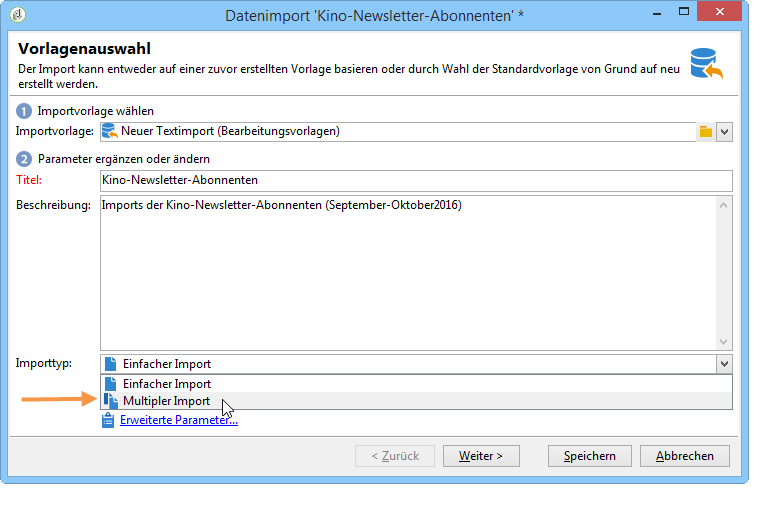

1. Geben Sie dann die zu importierenden Dateien an, indem Sie für jede Datei auf **[!UICONTROL Hinzufügen]** klicken.

   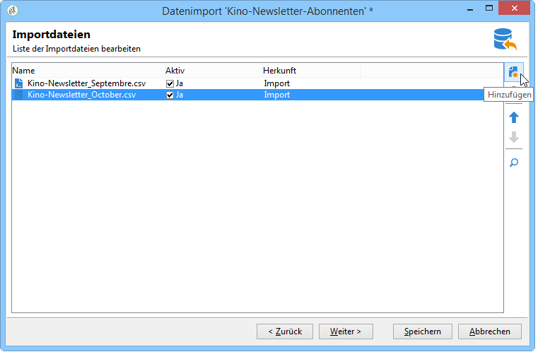

   Jedes Mal, wenn eine Datei hinzugefügt wird, wird der Bildschirm des Assistenten **[!UICONTROL Zu importierende Datei auswählen]** angezeigt. Lesen Sie den Abschnitt [2. Schritt - Quelldatei auswählen](#step-2---source-file-selection) und befolgen Sie die Schritte im Assistenten, um die Importoptionen wie für einen einfachen Import zu definieren.

   >[!NOTE]
   >
   >Multiple Importe sollten nur in bestimmten Situationen durchgeführt werden und sind nicht empfehlenswert.

### Erweiterte Parameter {#advanced-parameters}

Der Link **[!UICONTROL Erweiterte Parameter...]** bietet Zugriff auf folgende Optionen:

* Im Tab **[!UICONTROL Allgemein]**

   * **[!UICONTROL Bei zu großer Anzahl an Zurückweisungen Ausführung stoppen]**

     Diese Option ist standardmäßig aktiviert. Wenn Sie mit dem Import unabhängig von der Anzahl der Zurückweisungen fortfahren möchten, können Sie die Option deaktivieren. Standardmäßig wird die Ausführung angehalten, wenn die ersten 100 Zeilen zurückgewiesen werden.

   * **[!UICONTROL Spurenmodus]**

     Kreuzen Sie diese Option an, um die Durchführung Zeile für Zeile zu verfolgen.

   * **[!UICONTROL Auftrag in einem separaten Prozess starten]**

     Diese Option ist standardmäßig aktiviert. Sie ermöglicht es, den Import separat auszuführen, damit keine anderen, zur selben Zeit in der Datenbank laufenden Aufträge beeinträchtigt werden.

   * **[!UICONTROL Aufzählungen nicht aktualisieren]**

     Aktivieren Sie diese Option, wenn die Liste der Aufzählungswerte in der Datenbank nicht ergänzt werden soll. Weitere Informationen zum **Arbeiten mit Aufzählungen** finden Sie in der [Dokumentation zu Adobe Campaign v8 (Konsole)](https://experienceleague.adobe.com/de/docs/campaign/campaign-v8/config/settings/enumerations){target=_blank}.

* Im Tab **[!UICONTROL Variablen]**

  Hier besteht die Möglichkeit, dem Vorgang zugeordnete Variablen zu definieren, auf die im Abfragetool und in berechneten Feldern zugegriffen werden kann. Klicken Sie hierfür auf **[!UICONTROL Hinzufügen]** und machen Sie im Variableneditor die entsprechenden Angaben.

  >[!IMPORTANT]
  >
  >Der Tab **[!UICONTROL Variablen]** sollte programmierten Verwendungen vom Typ Workflow sowie erfahrenen Benutzern vorbehalten bleiben.

## &#x200B;2. Schritt – Quelldatei auswählen {#step-2---source-file-selection}

Die Quelldatei kann entweder in Textformat (TXT, CSV, TAB, feste Spalten) oder in XML vorliegen.

Standardmäßig ist die Option **[!UICONTROL Datei auf den Server laden]** angekreuzt. Durchsuchen Sie Ihre lokale Festplatte, indem Sie auf das Ordnersymbol rechts vom Feld **[!UICONTROL Lokale Datei]** klicken und wählen Sie die zu importierende Datei aus. Sie haben die Möglichkeit, diese Option abzuwählen und den Pfad und Namen der Datei anzugeben, wenn sie sich bereits auf dem Server befindet.

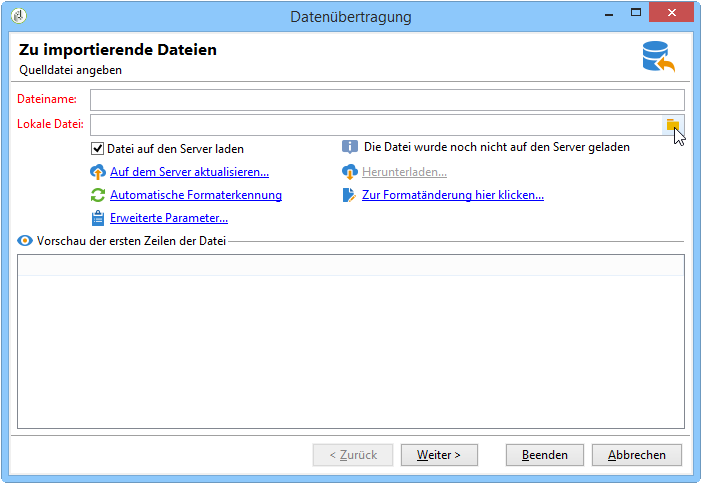

Nach Auswahl der Datei können Sie die Daten im unteren Bereich des Fensters ansehen. Klicken Sie hierzu auf **[!UICONTROL Automatische Formaterkennung]**. In dieser Vorschau werden die ersten 200 Zeilen der Quelldatei angezeigt.

Verwenden Sie die über dieser Ansicht angebotenen Optionen, um den Import zu konfigurieren. Die mit diesen Optionen definierten Parameter werden in die Vorschau übertragen. Folgende Optionen stehen zur Verfügung:

* Die Option **[!UICONTROL Zur Formatänderung hier klicken...]** erlaubt die Überprüfung des Formats und eventuell seine Anpassung.
* **[!UICONTROL Auf dem Server aktualisieren...]** ermöglicht die Übertragung der lokalen Datei auf den Server. Diese Option ist nur verfügbar, wenn **[!UICONTROL Datei auf den Server hochladen]** ausgewählt ist.
* Die Option **[!UICONTROL Herunterladen]** ist nur verfügbar, wenn die Datei auf den Server geladen wurde.
* **[!UICONTROL Format automatisch erkennen]** wird verwendet, um das Format der Datenquelle neu zu initialisieren. Diese Option stellt das ursprüngliche Format von durch die Option **[!UICONTROL Zur Formatänderung hier klicken...]** formatierten Daten wieder her.
* Über den Link **[!UICONTROL Erweiterte Parameter]** können Sie die Quelldaten filtern und erweiterte Optionen aufrufen. Auf diesem Bildschirm können Sie festlegen, dass nur ein Teil der Datei importiert werden soll. Sie können auch einen Filter definieren und zum Beispiel nur Personen des Typs „Interessentin/Interessent“ oder „Kundin/Kunde“ je nach Wert der entsprechenden Zeile zu importieren. Diese Optionen sind erfahrenen JavaScript-Benutzenden vorbehalten.

### Dateiformat ändern {#changing-the-file-format}

Über die Option **[!UICONTROL Zur Formatänderung hier klicken…]** können Sie die Daten der Quelldatei formatieren und insbesondere das Spalten-Trennzeichen und den Datentyp für jedes Feld angeben. Diese Konfiguration erfolgt über das folgende Fenster:

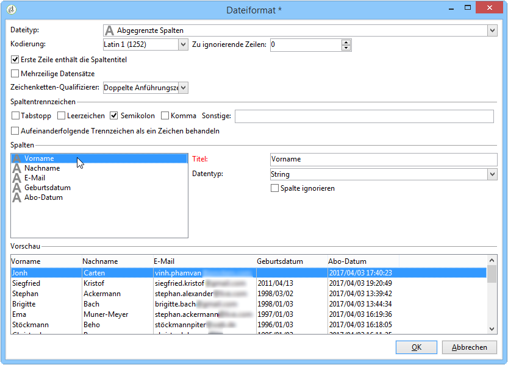

In diesem Schritt können Sie beschreiben, wie die Werte der Dateifelder gelesen werden sollen. Beispielsweise können bei einem Datum die Werte „Datum“ oder „Datum + Uhrzeit“ mit einem Format verknüpft werden (TT/MM/JJJJ, MM/TT/JJ usw.). Wenn die Eingabedaten nicht dem erwarteten Format entsprechen, werden sie beim Import zurückgewiesen.

Das Ergebnis der Konfigurationen wird im unteren Teil des Fensters angezeigt.

Klicken Sie auf **[!UICONTROL OK]**, um die Formatierung zu speichern, und anschließend auf **[!UICONTROL Weiter]**.

## &#x200B;3. Schritt – Felder zuordnen {#step-3---field-mapping}

Wählen Sie nun das Zielschema aus und ordnen Sie die Quellfelder den Datenbankfeldern zu.

* Das Feld **[!UICONTROL Zielschema]** ermöglicht Ihnen die Auswahl des Schemas, in das die Daten importiert werden sollen. Diese Informationen sind obligatorisch. Klicken Sie auf das Symbol **[!UICONTROL Verknüpftes Element auswählen]**, um ein existierendes Schema auszuwählen. Klicken Sie auf **[!UICONTROL Verknüpftes Element öffnen]**, um die Struktur der zugrunde liegenden Tabelle anzusehen.
* Die zentrale Tabelle zeigt alle in der Quelldatei definierten Felder an. Wählen Sie die zu importierenden Felder aus, um ihnen eine Zieldatei zuzuordnen. Diese Felder können manuell oder automatisch zugeordnet werden.

  Kreuzen Sie für eine manuelle Zuordnung das gewünschte Quellfeld an und klicken Sie dann in die zweite Spalte, um die zugehörige Zelle zu aktivieren. Klicken Sie auf **[!UICONTROL Ausdruck bearbeiten]**, um alle verfügbaren Felder der Tabelle anzuzeigen. Wählen Sie das Zielfeld aus und bestätigen Sie die Zuordnung mit **[!UICONTROL OK]**.

  Um die Quell- und Zielfelder automatisch zu verknüpfen, klicken Sie rechts neben der Liste der Felder auf das Symbol **[!UICONTROL Zielfelder automatisch zuordnen]**. Die vorgeschlagenen Felder können bei Bedarf geändert werden.

  >[!IMPORTANT]
  >
  >Prüfen Sie die ordnungsgemäße Zuordnung, bevor Sie zum nächsten Schritt übergehen.

* Es besteht die Möglichkeit, die Schreibweise der importierten Felder anzupassen. Klicken Sie hierfür in der Spalte **[!UICONTROL Schreibweise]** in die dem Feld entsprechende Zelle und wählen Sie die gewünschte Option aus.

  

  >[!IMPORTANT]
  >
  >Die Schreibweise wird zum Zeitpunkt des Imports angewendet. Wurden zuvor für die Zielfelder bestimmte Formatierungen festgelegt (wie in unserem Beispiel für das Feld @lastname), haben diese jedoch Vorrang.

* Sie können berechnete Felder über das entsprechende Symbol rechts neben der zentralen Tabelle hinzufügen. Mit berechneten Feldern können Sie komplexe Umwandlungen durchführen, virtuelle Spalten hinzufügen oder die Daten mehrerer Spalten zusammenführen. Einzelheiten zu den verschiedenen Möglichkeiten finden Sie in den folgenden Abschnitten.

### Berechnete Felder {#calculated-fields}

Berechnete Felder sind neue Spalten, die der Quelldatei hinzugefügt und aus anderen Spalten berechnet werden. Berechnete Felder können dann mit Feldern der Adobe Campaign-Datenbank verknüpft werden. Abstimmvorgänge sind jedoch für berechnete Felder nicht möglich.

Vier verschiedene Feldtypen stehen zur Verfügung:

* **[!UICONTROL Unveränderlicher String]**: Der Wert des berechneten Feldes ist für jede Zeile der Quelldatei derselbe. Ermöglicht das Festlegen des Feldwerts eingefügter oder aktualisierter Einträge. Sie können beispielsweise für alle importierten Einträge einen Indikator auf „Ja“ setzen.
* **[!UICONTROL Zeichenfolge mit JavaScript-Fusion]**: Das berechnete Feld kombiniert eine Zeichenfolge mit JavaScript-Direktiven.
* **[!UICONTROL JavaScript-Ausdruck]**: Der Wert des berechneten Felds ist das Ergebnis der Auswertung einer JavaScript-Funktion. Der zurückgegebene Wert kann eine Zahl, ein Datum usw. sein.
* **[!UICONTROL Aufzählung]**: Der Wert des Felds wird entsprechend einem Wert der Quelldatei zugeordnet. Im Editor können Sie die Quellspalte angeben und die Liste mit Aufzählungswerten eingeben, wie in folgendem Beispiel dargestellt:

  

  Im **[!UICONTROL Vorschau]**-Tab können Sie das Ergebnis der Konfiguration ansehen. Im Beispiel wurde die Spalte **[!UICONTROL Abonnements]** hinzugefügt. Der Wert wird vom Feld **Status** ausgehend berechnet.

  

## &#x200B;4. Schritt – Datensätze abstimmen {#step-4---reconciliation}

Der Import-Assistent bietet die Möglichkeit, durch die Angabe von Abstimmkriterien die Art der Zusammenführung von importierten und existierenden Daten sowie Prioritätsregeln zu definieren. Das Konfigurationsfenster sieht wie folgt aus:

Der mittlere Bereich des dargestellten Bildschirms zeigt die Felder und Tabellen der Adobe Campaign-Datenbank an, in die die Daten importiert werden.

Für jeden Knoten (Tabelle oder Feld) stehen spezielle Optionen zur Verfügung. Wenn Sie in der Liste auf den betreffenden Knoten klicken, werden unten seine Parameter und eine kurze Beschreibung angezeigt. Für jedes Element werden in der Spalte **[!UICONTROL Verhalten]** die Auswirkungen der gewählten Optionen angegeben.

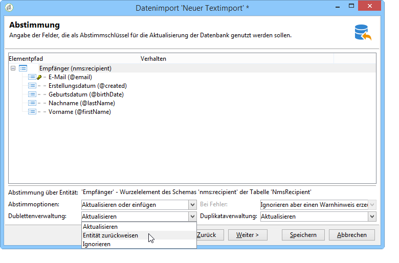

### Vorgangstypen {#types-of-operation}

Für jede vom Import betroffene Tabelle müssen Sie den Typ des Vorgangs angeben. Für das Hauptelement der Datenbank bestehen folgende Möglichkeiten:

* **[!UICONTROL Aktualisieren oder einfügen]**: Aktualisiert Datensätze oder erstellt sie, falls sie noch nicht in der Datenbank existieren.
* **[!UICONTROL Einfügen]**: Erstellt neue Datensätze in der Datenbank.
* **[!UICONTROL Aktualisieren]**: Aktualisiert bestehende Datensätze, ignoriert alle anderen.
* **[!UICONTROL Nur Abstimmung]**: Sucht in der Datenbank nach dem Eintrag, führt jedoch keine Aktualisierung durch. Dies ermöglicht beispielsweise die Zuordnung des zu importierenden Empfängerordners entsprechend einer Spalte der Datei, ohne die Daten in den Ordnern zu aktualisieren.
* **[!UICONTROL Löschen]**: Löscht die Datensätze der Datenbank.

Für die Felder der vom Import betroffenen Tabellen stehen folgende Optionen zur Verfügung:

* **[!UICONTROL Aktualisieren (löschen), wenn der Quelldatensatz leer ist]**: Beim Aktualisieren wird der Wert des Datenbankfelds gelöscht, wenn das Feld in der Quelldatei leer ist. Anderenfalls wird das Datenbankfeld beibehalten.
* **[!UICONTROL Nur aktualisieren, wenn das Zielfeld leer ist]**: Der Wert aus der Quelldatei überschreibt den Wert im Datenbankfeld nicht, außer das Datenbankfeld ist leer. In diesem Fall wird der Wert der Quelldatei übernommen.
* **[!UICONTROL Nur bei Einfügen des Datensatzes aktualisieren]**: Bei Aktualisierungs- oder Ergänzungsvorgängen werden nur die Datensätze der Quelldatei importiert, die neu in der Datenbank sind.

>[!NOTE]
>
>Außer bei einem Import ohne Deduplizierung ist die Angabe eines Abstimmschlüssels **zwingend erforderlich**.

### Abstimmschlüssel {#reconciliation-keys}

Für die Deduplizierung ist die Angabe von mindestens einem Abstimmschlüssel erforderlich.

Ein Abstimmschlüssel ist ein Satz von Feldern, die zur Identifizierung eines Eintrags verwendet werden. Für das Importieren von Empfängerinnen und Empfängern kann der Abstimmschlüssel beispielsweise die Kontonummer, das Feld „E-Mail“ oder die Felder „Nachname“, „Vorname“, „Unternehmen“ usw. sein.

In diesem Fall vergleicht die Import-Engine die Werte der Datei mit jenen der Datenbank für alle Felder des Schlüssels, um herauszufinden, ob eine Zeile einer Datei einer vorhandenen Empfängerin bzw. einem vorhandenen Empfänger in der Datenbank entspricht.Wenn Felder für einen Eintrag spezifisch sind, kann ein genauer Vergleich zwischen den Quell- und Zieldaten durchgeführt werden, um die Integrität der Daten nach dem Import zu gewährleisten. Für dieselbe Tabelle kann ein zweiter Abstimmschlüssel ausgefüllt werden. Er wird für die Zeilen verwendet, deren erster Schlüssel leer ist.

Um die Erstellung doppelter Datensätze zu vermeiden, dürfen im Abstimmschlüssel keine Felder verwendet werden, die beim Import verändert werden könnten.

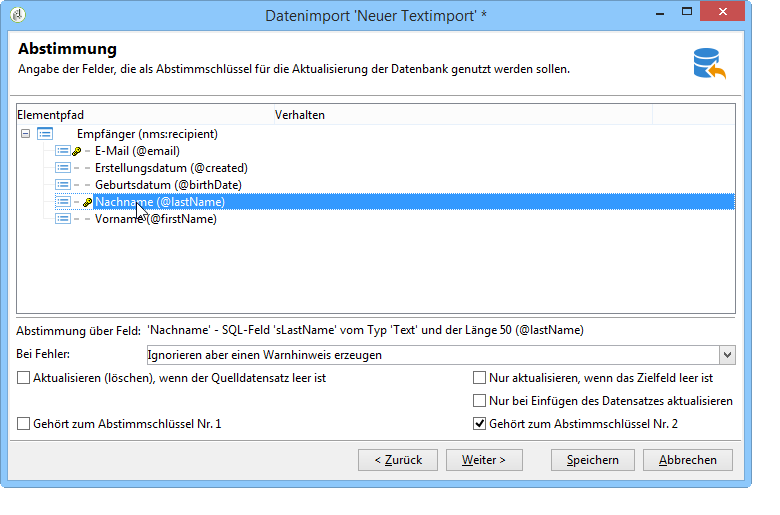

>[!NOTE]
>
>Bei einem Empfängerimport wird die Kennung des ausgewählten Ordners implizit zum Schlüssel hinzugefügt.
>
>Die Abstimmung wird daher nur für diesen Ordner durchgeführt (es sei denn, es ist kein Ordner ausgewählt).

### Deduplizierung {#deduplication}

>[!NOTE]
>
>Eine Dublette ist ein Element, das mindestens zweimal in der zu importierenden Datei enthalten ist.
>
>Ein Duplikat ist ein Element, das sowohl in der Quelldatei als auch in der Datenbank enthalten ist.

Das Feld **[!UICONTROL Dublettenverwaltung]** dient der Konfiguration der Deduplizierung in Bezug auf Dubletten. Deduplizierung in Bezug auf Dubletten, d. h. Einträge, die wiederholt in der **Quelldatei** (oder den Quelldateien bei einem multiplen Import) vorkommen. Bei Dubletten sind die den Abstimmschlüssel bildenden Felder identisch.

* Im Modus **[!UICONTROL Aktualisieren]** (Standardmodus) wird von der Duplikatverwaltung keine Deduplizierung durchgeführt. Der letzte Eintrag hat daher Priorität (da er die Daten der vorherigen Einträge aktualisiert). In diesem Modus werden Duplikate nicht gezählt.
* Im Modus **[!UICONTROL Ignorieren]** oder **[!UICONTROL Entität zurückweisen]** werden Duplikate beim Import von der Duplikatverwaltung ausgeschlossen. In diesem Fall wird kein Eintrag importiert.
* Im Modus **[!UICONTROL Entität zurückweisen]** werden die entsprechenden Datensätze nicht importiert und im Importprotokoll wird ein Fehler ausgewiesen.
* Im Modus **[!UICONTROL Ignorieren]** wird das Element nicht importiert, der Fehler wird jedoch nicht protokolliert. In diesem Modus kann die Leistung optimiert werden.

>[!IMPORTANT]
>
>Die Deduplizierung erfolgt nur im Speicher. Der Umfang eines Imports mit Deduplizierung ist daher begrenzt. Das Limit hängt von mehreren Parametern ab (Kapazität des Anwendungs-Servers, Aktivität, Anzahl der Felder im Schlüssel usw.). Die maximale Größe für eine Deduplizierung liegt in der Größenordnung von 1.000.000 Zeilen.

Deduplizierung bezieht sich auf einen Datensatz, der sowohl in der Quelldatei als auch in der Datenbank vorhanden ist. Es kommt nur bei Importen mit Datenaktualisierung zum Tragen (**[!UICONTROL Aktualisieren und einfügen]** oder **[!UICONTROL Aktualisieren]**). Die Option **[!UICONTROL Duplikataverwaltung]** ermöglicht es, einen Datensatz entweder zu aktualisieren oder zu ignorieren, wenn er sowohl in der Quelldatei als auch der Datenbank vorkommt. Die Option **[!UICONTROL Je nach Herkunft aktualisieren oder hinzufügen]** ist Teil eines optionalen Moduls, sie steht im Standardkontext nicht zur Verfügung.

Die Optionen **[!UICONTROL Zurückweisen]** und **[!UICONTROL Ignorieren]** arbeiten auf die gleiche Weise wie zuvor beschrieben.

### Beim Auftreten von Fehlern {#behavior-in-the-event-of-an-error}

Bei den meisten Datenübertragungsvorgängen treten verschiedene Fehlertypen auf (inkohärentes Zeilenformat, ungültige E-Mail-Adresse usw.). Alle von der Import-Engine erzeugten Fehler und Warnungen werden gespeichert und mit der Importinstanz verknüpft.

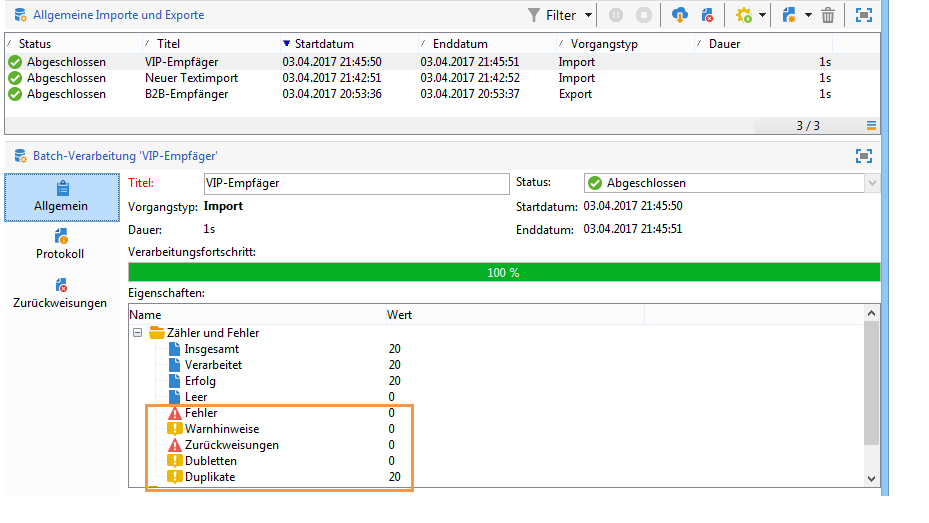

Im Tab **[!UICONTROL Zurückweisungen]** können Details eingesehen werden.

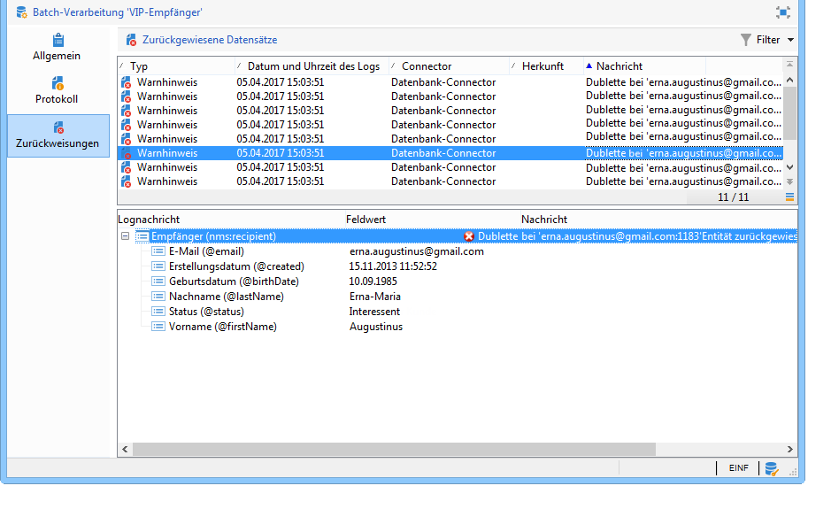

Zurückweisungen können zwei verschiedenen, in der Spalte **[!UICONTROL Connector]** angezeigten Typen zugeordnet werden:

* Zurückweisungen des Text-Connectors stehen mit Fehlern im Zusammenhang, die bei der Verarbeitung einer Zeile auftreten (berechnetes Feld, Datenanalyse usw.). In diesem Fall wird bei einem Fehler immer die gesamte Zeile zurückgewiesen.
* Zurückweisungen des Datenbank-Connectors stehen mit Fehlern im Zusammenhang, die bei der Datenabstimmung oder beim Schreiben in die Datenbank auftreten. Im Fall von Importen in mehrere Tabellen betrifft die Zurückweisung womöglich nur einen Teil des Eintrags (bei einem Import von Empfangenden und verknüpften Ereignissen kann ein Fehler das Aktualisieren des Ereignisses beispielsweise verhindern, ohne die Empfangenden zurückzuweisen).

Auf der Abstimmungsseite besteht die Möglichkeit, für jedes Feld und jede Tabelle gesondert den Umgang mit Fehlern festzulegen.

* **[!UICONTROL Ignorieren aber einen Warnhinweis erzeugen]**: Es werden alle Felder in die Datenbank importiert, ausgenommen das Feld, das den Fehler erzeugt hat.
* **[!UICONTROL Übergeordnetes Element zurückweisen]**: Die gesamte Zeile wird zurückgewiesen (nicht nur das den Fehler auslösende Feld).
* **[!UICONTROL Alle Elemente zurückweisen]**: Der Import wird gestoppt und alle Elemente des Datensatzes werden zurückgewiesen.

  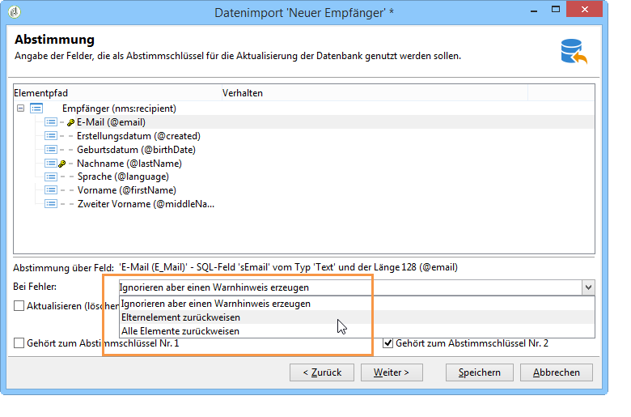

Der Navigationsbaum im Zurückweisungsbildschirm einer Importinstanz zeigt die zurückgewiesenen Felder und aufgetretene Fehler an.

Über das Symbol **[!UICONTROL Zurückweisungen exportieren]** können Sie eine Datei mit den entsprechenden Informationen erzeugen.

## Schritt 5 – Zusätzlicher Schritt beim Import von Empfängern {#step-5---additional-step-when-importing-recipients}

Der folgende Schritt im Import-Assistenten ermöglicht die Auswahl oder Erstellung eines Importordners, die automatische Zuordnung der importierten Empfangenden zu einer neuen oder existierenden Liste und ihre Anmeldung für Informationsdienste.

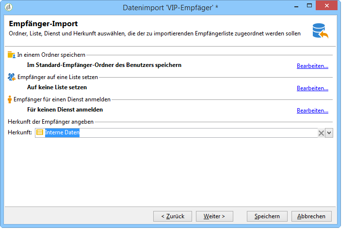

>[!NOTE]
>
>Dieser Schritt wird nur im Falle eines Empfängerimports und bei Verwendung der Standardempfängertabelle (**nms:recipient**) von Adobe Campaign angezeigt.

* Klicken Sie auf den **[!UICONTROL Bearbeiten]**-Link, um den Ordner, die Liste oder den Dienst auszuwählen, mit denen die Empfänger verknüpft werden sollen.

   1. In einem Ordner speichern

      Über den Link **[!UICONTROL Bearbeiten…]** im Abschnitt **[!UICONTROL In einem Ordner speichern]** können Sie den Ordner auswählen oder erstellen, in den die Empfängerinnen und Empfänger importiert werden sollen. Falls keine Partition angegeben ist, werden standardmäßig die Daten in den Standard-Ordner der benutzenden Person eingefügt.

      >[!NOTE]
      >
      >Der Standardordner des Benutzers entspricht dem ersten Ordner, für den der Benutzer Schreibzugriff hat. Weitere Informationen finden Sie unter [Ordnerzugriffsverwaltung](../../platform/using/access-management-folders.md).

      Klicken Sie zur Auswahl des Importordners auf den Pfeil rechts des **[!UICONTROL Ordner]**-Feldes und wählen Sie den gewünschten Ordner aus. Über das Symbol **[!UICONTROL Verknüpftes Element auswählen]** können Sie den Navigationsbaum in einem neuen Fenster anzeigen und einen neuen Ordner erstellen.

      

      Wählen Sie zur Erstellung eines neuen Ordners den Knoten aus, in den der Ordner eingefügt werden soll, und klicken Sie mit der rechten Maustaste. Wählen Sie **[!UICONTROL Empfänger-Ordner hinzufügen]**.

      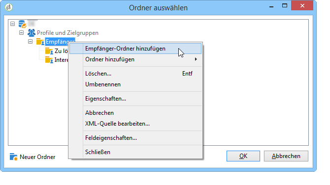

      Der Ordner wird als Unterordner des aktuellen Knotens eingefügt. Geben Sie den Namen des neuen Ordners an, drücken Sie zum Bestätigen die Enter-Taste und klicken Sie auf **[!UICONTROL OK]**.

      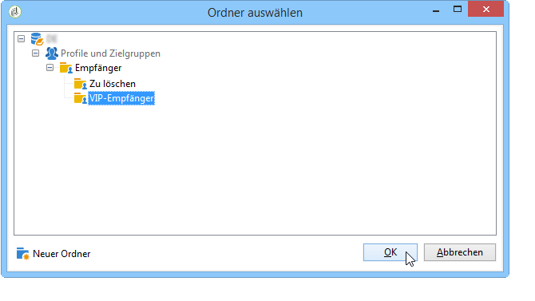

   1. Einer Liste zuordnen

      Der **[!UICONTROL Bearbeiten...]**-Link der Option **[!UICONTROL Empfänger auf eine Liste setzen]** ermöglicht die Auswahl oder die Erstellung der Liste, zu der die Empfänger hinzugefügt werden sollen.

      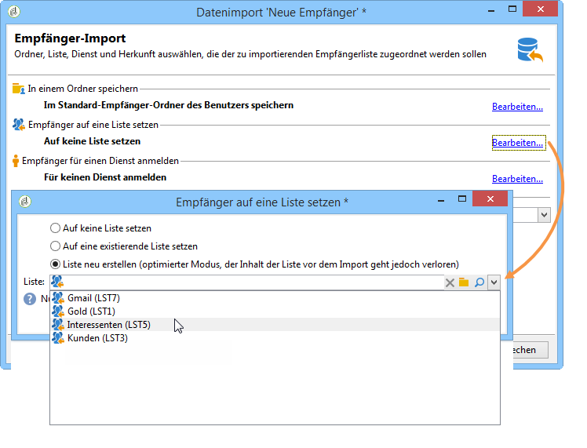

      Sie können eine neue Liste für diese Empfänger erstellen, indem Sie auf **[!UICONTROL Verknüpftes Element auswählen]** und dann auf **[!UICONTROL Erstellen]** klicken. Informationen zur Erstellung und Verwaltung von Listen finden Sie in [diesem Abschnitt](../../platform/using/creating-and-managing-lists.md).

      

      Sie können eine Liste um die neuen Empfangenden ergänzen oder die Liste mit den neuen Empfangenden neu erstellen. Wenn die Liste bereits Empfangende enthält, werden diese gelöscht und durch die importierten Empfangenden ersetzt.

   1. Anmeldung für einen Dienst

      Um alle importierten Empfänger für einen Informationsdienst anzumelden, klicken Sie auf den Link **[!UICONTROL Bearbeiten...]** der Option **[!UICONTROL Empfänger für einen Dienst anmelden]**, um den Informationsdienst auszuwählen oder zu erstellen, für den die Empfänger angemeldet werden sollen. Aktivieren Sie **[!UICONTROL Benachrichtigung versenden]**, wenn die Empfänger von der Anmeldung in Kenntnis gesetzt werden sollen. Der Benachrichtigungsinhalt wird in den die An- und Abmeldungen betreffenden Versandvorlagen bestimmt.

      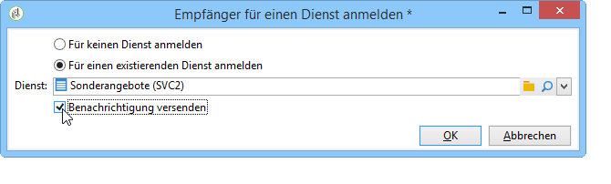

      Sie haben auch die Möglichkeit, einen neuen Informationsdienst für diese Empfängerinnen und Empfänger zu erstellen. Klicken Sie hierfür auf **[!UICONTROL Verknüpftes Element auswählen]** und dann auf das Symbol **[!UICONTROL Erstellen]**. Informationsdienste werden in [diesem Abschnitt](../../delivery/using/managing-subscriptions.md) näher erläutert.

* Das Feld **[!UICONTROL Herkunft]** bietet die Möglichkeit, eine Information bezüglich der Empfängerherkunft im Profil zu hinterlegen. Diese Informationen sind insbesondere im Rahmen eines Mehrfachimports nützlich.

Klicken Sie auf **[!UICONTROL Weiter]**, um die in diesem Schritt vorgenommenen Konfigurationen zu bestätigen.

## &#x200B;6. Schritt – Import starten {#step-6---launching-the-import}

Im letzten Schritt des Assistenten wird der Datenimport ausgelöst. Klicken Sie hierfür auf die Schaltfläche **[!UICONTROL Starten]**.

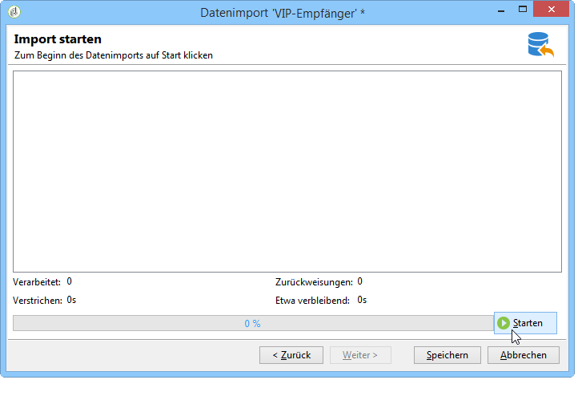

Anschließend können Sie die Ausführung des Importauftrags überwachen (siehe [Überwachung der Auftragsausführung](../../platform/using/monitoring-jobs-execution.md)).
