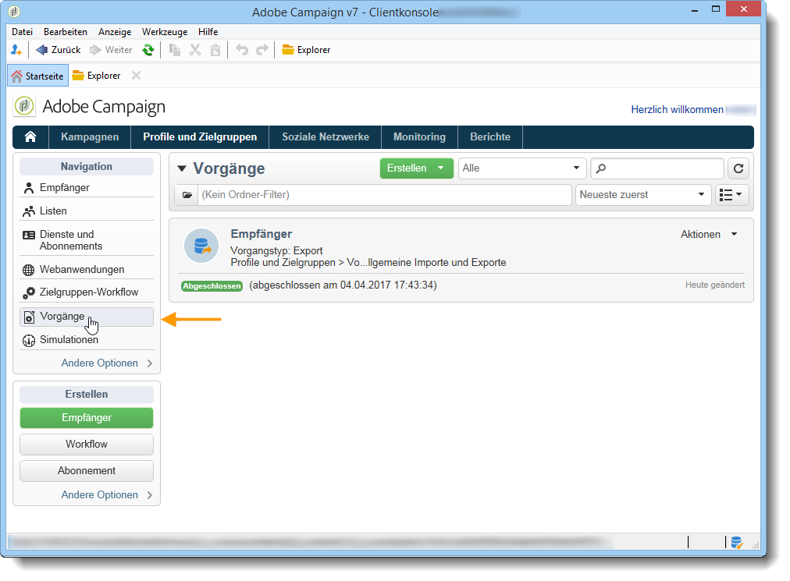

# Importing and exporting profiles{#exporting-and-importing-profiles}

Sie können Empfänger-Profil [Workflows](#use-workflows) zum Importieren oder Exportieren in die Adobe Campaign-Datenbank verwenden oder [generische Import- oder Exportaufträge](#create-jobs)einrichten.

 [Diese Funktion im Video entdecken](#import-profiles-video)

## Workflows verwenden{#use-workflows}

Exporte und Importe werden in dedizierten Vorlagen konfiguriert, die über Workflows über die **[!UICONTROL Import]** - und **[!UICONTROL Export]** -Aktivitäten ausgeführt werden. Sie können automatisch nach einem Zeitplan wiederholt werden, um beispielsweise den Datenaustausch zwischen verschiedenen Informationssystemen zu automatisieren. [Mehr dazu](../../workflow/using/importing-data.md#best-practices-when-importing-data)

Bei Bedarf können Sie gelegentlich einen Import- oder Exportauftrag über die unten beschriebene Funktion &quot; **[!UICONTROL Generische Ein- und Ausfuhren]** &quot;erstellen.

## Erstellen von Aufträgen{#create-jobs}

To configure and execute data imports and exports jobs, go to the **[!UICONTROL Profiles and targets]** tab and click the **[!UICONTROL Jobs]** link. [Mehr dazu](../../platform/using/generic-imports-and-exports.md)

## Wie importiere ich Profile{#import-profiles-video}

In diesem Video wird erläutert, wie Profil in Adobe Campaign importiert werden, um sie gelegentlich zu importieren.

>[!VIDEO](https://video.tv.adobe.com/v/25608?quality=12)
