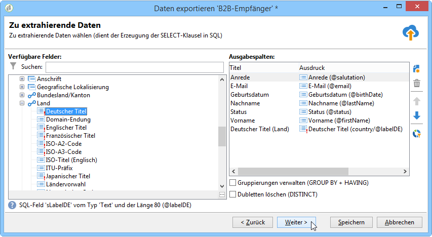

# Export von Daten{#exporting-data}

## Export-Assistent {#export-wizard}

Exportparameter werden mithilfe eines Assistenten konfiguriert. Das allgemeine Exportmodul (im Standard-Package enthalten) erlaubt die Extraktion von Daten wie z. B. Kontakten, Kunden, Listen oder Segmenten aus der Datenbank. Beispielsweise könnte es nützlich sein, den Trackingverlauf einer Kampagne in einer Tabellenkalkulationssoftware zu analysieren. Folgende Exportformate stehen zur Verfügung: TXT, CSV, TAB oder XML.

### 1. Schritt - Exportvorlage auswählen {#step-1---choosing-the-export-template}

Beim Start des Export-Assistenten muss zunächst eine Vorlage ausgewählt werden. Um beispielsweise den Export von Empfängern zu konfigurieren, die sich kürzlich angemeldet haben, gehen Sie folgendermaßen vor:

1. Wählen Sie den **[!UICONTROL Profiles and Targets > Job > Generic imports and exports]** Ordner aus.
1. Wählen Sie **Neu** und danach **Exportieren** aus, um die Exportvorlage zu erstellen.

   

1. Click the arrow to the right of the **[!UICONTROL Export template]** field to select your template, or click **[!UICONTROL Select link]** to browse the tree.

   Die native Vorlage ist **[!UICONTROL New text export]**. Diese Vorlage darf nicht geändert werden, Sie können sie jedoch duplizieren, um eine neue Vorlage zu konfigurieren. Exportvorlagen werden standardmäßig im **[!UICONTROL Resources > Templates > Job templates]** Knoten gespeichert.

1. Geben Sie einen Namen für den Export in das **[!UICONTROL Label]** Feld ein. Sie können eine Beschreibung hinzufügen.
1. Wählen Sie den Exporttyp aus. There are two possible types of export: **[!UICONTROL Simple export]** to export only one file, and **[!UICONTROL Multiple export]** to export several files in a single execution, from one or more types of source document.

### 2. Schritt - Dateityp auswählen {#step-2---type-of-file-to-export}

Wählen Sie den Typ des zu exportierenden Dokuments aus, d. h. das Schema der zu exportierenden Daten.

Wenn der Export von der **[!UICONTROL Jobs]** Node aus gestartet wird, stammen die Daten standardmäßig aus der Empfängertabelle. Wenn der Export aus einer Datenliste (aus dem **[!UICONTROL right click > Export]** Menü) gestartet wird, wird die Tabelle, zu der die Daten gehören, automatisch in das **[!UICONTROL Document type]** Feld eingetragen.

* Standardmäßig ist die **[!UICONTROL Download the file generated on the server after the export]** Option ausgewählt. Geben Sie im **[!UICONTROL Local file]** Feld den Namen und den Pfad der zu erstellenden Datei ein, oder suchen Sie die lokale Festplatte, indem Sie auf den Ordner rechts neben dem Feld klicken. Sie können diese Option deaktivieren, um den Zugriffspfad und den Namen der Serverausgabedatei einzugeben.

   >[!NOTE]
   >
   >Automatische Im- und Exporte werden stets auf dem Server durchgeführt.
   >
   >To export only some of the data, click **[!UICONTROL Advanced parameters]** and enter the number of lines to be exported in the appropriate field.

* Sie können einen differenziellen Export erstellen, um nur Datensätze zu exportieren, die seit der letzten Ausführung geändert wurden. Klicken Sie dazu auf den **[!UICONTROL Advanced parameters]** Link und dann auf die **[!UICONTROL Differential export]** Registerkarte und wählen Sie **[!UICONTROL Activate differential export]**.

   

   Hier ist die Angabe des Datums der letzten Änderung erforderlich. Dies geschieht durch Auswahl des entsprechenden Tabellenfelds.

### 3. Schritt - Ausgabeformat bestimmen {#step-3---defining-the-output-format}

Wählen Sie nun das Ausgabeformat der Exportdatei aus. Mögliche Formate sind Text, Text in festen Spalten, CSV und XML.

* Beim Format **[!UICONTROL Text]** sind die Spaltentrennzeichen (Tabstopp, Komma, Semikolon oder Sonstige) sowie die Zeichenketten-Qualifizierer (Ohne, Doppelte Anführungszeichen, Einfache Anführungszeichen) anzugeben.
* Für **[!UICONTROL text]** und **[!UICONTROL CSV]** können Sie die Option auswählen **[!UICONTROL Use first lines as column titles]**.
* Datumsformat und Zahlenformat angeben. Klicken Sie dazu auf die **[!UICONTROL Edit]** Schaltfläche für das betreffende Feld und verwenden Sie den Editor.
* Bei Feldern mit aufgezählten Werten können Sie auswählen **[!UICONTROL Export labels instead of internal values of enumerations]**. Der Titel kann beispielsweise im Format **1=Mr. gespeichert werden.**, **2=Miss**,** 3=Mrs.**. Wenn diese Option gewählt wird, werden **Herr**, **Frau** und **Frau.** exportiert.

### 4. Schritt - Daten auswählen {#step-4---data-selection}

Wählen Sie die zu exportierenden Felder aus. Gehen Sie dazu folgendermaßen vor:

1. Double-click the desired fields in the **[!UICONTROL Available fields]** list in order to add them to the **[!UICONTROL Output columns]** section.
1. Mit den Pfeilen rechts neben der Liste können Sie die Reihenfolge der Felder in der Ausgabedatei festlegen.

   

1. Klicken Sie auf die **[!UICONTROL Add]** Schaltfläche, um Funktionen aufzurufen. Weitere Informationen finden Sie unter [Liste der Funktionen](../../platform/using/defining-filter-conditions.md#list-of-functions).

### 5. Schritt - Spalten sortieren {#step-5---sorting-columns}

An dieser Stelle kann die Sortierreihenfolge der einzelnen Spalten festgelegt werden.

### 6. Schritt - Filterbedingungen {#step-6---filter-conditions-}

Um nicht alle Datensätze zu exportieren, haben Sie die Möglichkeit, Filterbedingungen zu konfigurieren. Die Vorgehensweise entspricht der Zielgruppenbestimmung im Versand-Assistenten. Diese wird auf [dieser Seite](../../delivery/using/steps-defining-the-target-population.md) erläutert.

### 7. Schritt - Daten formatieren {#step-7---data-formatting}

An dieser Stelle können die Reihenfolge der Spalten in der Ausgabedatei und ihre Titel festgelegt sowie die Schreibweise der Quelldaten angepasst werden.

* Die Reihenfolge der zu exportierenden Spalten lässt sich mithilfe der blauen Pfeile rechts von der Tabelle ändern.
* To change the label of a field, click in the cell of the **[!UICONTROL Label]** column that matches the field to be modified, and enter the new label. Drücken Sie zur Bestätigung die Eingabetaste auf der Tastatur.
* To apply a case transformation to the content of a field, select it from the **[!UICONTROL Transformation]** column. Sie können Folgendes auswählen:

   * Alles in Großbuchstaben
   * Alles in Kleinbuchstaben
   * Ersten Buchstaben großschreiben
   

* Klicken Sie auf **[!UICONTROL Add a calculated field]** , wenn Sie ein neues berechnetes Feld erstellen möchten (z. B. eine Spalte mit Nachname und Vorname). For more on this, refer to [Calculated fields](../../platform/using/importing-data.md#calculated-fields).

Wenn Sie Kollektionselemente exportieren (beispielsweise Abonnements von Empfängern, Listen, denen sie angehören usw.), müssen Sie angeben, wie viele Elemente exportiert werden sollen.

### 8. Schritt - Datenvorschau {#step-8---data-preview}

Klicken Sie auf **[!UICONTROL Start the preview of the data]** , um eine Vorschau des Exportergebnisses anzuzeigen. Standardmäßig werden die ersten 200 Zeilen angezeigt. Um diesen Wert zu ändern, klicken Sie auf die Pfeile rechts neben dem **[!UICONTROL Lines to display]** Feld.

Durch Klick auf die Tabs unten im Fenster können Sie von der Ergebnisansicht in Spalten zur XML-Anzeige und zur SQL-Entsprechung der Abfrage wechseln.

### 9. Schritt - Export starten {#step-9---launching-the-export}

Click **[!UICONTROL Start]** to launch data export.

## Daten mithilfe eines Workflows exportieren {#exporting-data-via-a-workflow}

Workflows sind eine nützliche Methode, einige Ihrer Exportverfahren zu automatisieren oder spezifische Datensätze zu exportieren, nachdem die verfügbaren Datenverwaltungsaktivitäten zur Transformation Ihrer Daten angewendet wurden.

Weiterführende Informationen zum Datenexport mithilfe eines Workflows finden Sie in [diesem Abschnitt](../../workflow/using/how-to-use-workflow-data.md).
