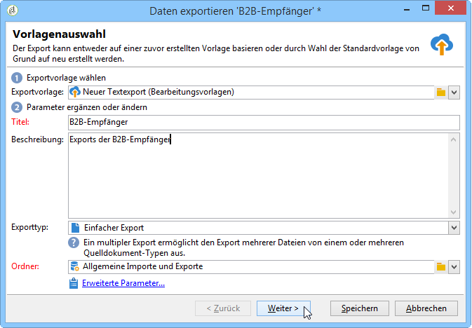

# Export von Daten{#exporting-data}

## Export-Assistent {#export-wizard}

Exportparameter werden mithilfe eines Assistenten konfiguriert. Das allgemeine Exportmodul (im Standard-Package enthalten) erlaubt die Extraktion von Daten wie z. B. Kontakten, Kunden, Listen oder Segmenten aus der Datenbank. Beispielsweise könnte es nützlich sein, den Trackingverlauf einer Kampagne in einer Tabellenkalkulationssoftware zu analysieren. Folgende Exportformate stehen zur Verfügung: TXT, CSV, TAB oder XML.

### 1. Schritt - Exportvorlage auswählen {#step-1---choosing-the-export-template}

Beim Start des Export-Assistenten muss zunächst eine Vorlage ausgewählt werden. Um beispielsweise den Export von Empfängern zu konfigurieren, die sich kürzlich angemeldet haben, gehen Sie folgendermaßen vor:

1. Gehen Sie zum Ordner **[!UICONTROL Profile und Zielgruppen > Vorgang > Allgemeine Importe und Exporte]**.
1. Wählen Sie **Neu** und danach **Exportieren** aus, um die Exportvorlage zu erstellen.

   

1. Klicken Sie zur Auswahl der gewünschten Vorlage rechts vom Feld **[!UICONTROL Exportvorlage]** entweder auf den Pfeil oder auf **[!UICONTROL Verknüpftes Element auswählen]**, um den Navigationsbaum zu durchsuchen.

   Die anwendungseigene Vorlage **[!UICONTROL Neuer Textexport]** darf nicht geändert werden. Sie können sie jedoch duplizieren, um eine neue Vorlage zu erstellen. Standardmäßig werden Exportvorlagen im Knoten **[!UICONTROL Ressourcen > Vorlagen > Bearbeitungsvorlagen]** gespeichert.

1. Geben Sie im Feld **[!UICONTROL Titel]** einen Namen für den Export ein und fügen Sie eventuell eine Beschreibung hinzu.
1. Wählen Sie anschließend den Exporttyp aus. Mit der Option **[!UICONTROL Einfacher Export]** kann jeweils nur eine Datei exportiert werden. Die Option **[!UICONTROL Multipler Export]** hingegen bietet die Möglichkeit, in einem Durchgang mehrere Dateien u. U. mit verschiedenen Quelldokumenttypen zu exportieren.

### 2. Schritt - Dateityp auswählen {#step-2---type-of-file-to-export}

Wählen Sie den Typ des zu exportierenden Dokuments aus, d. h. das Schema der zu exportierenden Daten.

Bei einem vom Knoten **[!UICONTROL Vorgänge]** ausgehenden Export wird standardmäßig die Empfängertabelle vorgeschlagen. Wenn der Export von einer Liste ausgehend gestartet wird (durch **[!UICONTROL Rechtsklick > Export]**), wird der **[!UICONTROL Dokumenttyp]** in der Tabelle, zu der die Daten gehören, automatisch ausgefüllt.

* Standardmäßig ist die Option **[!UICONTROL Nach dem Export erzeugte Datei herunterladen]** angekreuzt: Geben Sie in diesem Fall den Namen der zu erstellenden Datei im Feld **[!UICONTROL Lokale Datei]** an oder durchsuchen Sie Ihre lokale Festplatte, indem Sie auf das Ordnersymbol rechts vom Feld klicken. Sie haben die Möglichkeit, diese Option abzuwählen und den Pfad und Namen der Ausgabedatei auf dem Server anzugeben.

   >[!NOTE]
   >
   >Automatische Im- und Exporte werden stets auf dem Server durchgeführt.
   >
   >Sollten Sie nur einen Teil der Daten exportieren wollen, klicken Sie auf **[!UICONTROL Erweiterte Parameter...]** und geben Sie die Anzahl der zu exportierenden Zeilen an.

* Es besteht die Möglichkeit, einen Differenzexport vorzunehmen, d. h. nur die seit der letzten Durchführung geänderten Datensätze zu exportieren. Klicken Sie hierfür auf **[!UICONTROL Erweiterte Parameter...]** und kreuzen Sie im Tab **[!UICONTROL Differenzexport]** die Option **[!UICONTROL Differenzexport aktivieren]** an.

   

   Hier ist die Angabe des Datums der letzten Änderung erforderlich. Dies geschieht durch Auswahl des entsprechenden Tabellenfelds.

### 3. Schritt - Ausgabeformat bestimmen {#step-3---defining-the-output-format}

Wählen Sie nun das Ausgabeformat der Exportdatei aus. Mögliche Formate sind Text, Text in festen Spalten, CSV und XML.

* Beim Format **[!UICONTROL Text]** sind die Spaltentrennzeichen (Tabstopp, Komma, Semikolon oder Sonstige) sowie die Zeichenketten-Qualifizierer (Ohne, Doppelte Anführungszeichen, Einfache Anführungszeichen) anzugeben.
* Bei den Formaten **[!UICONTROL Text]** und **[!UICONTROL CSV]** besteht die Möglichkeit, die Option **[!UICONTROL Erste Zeile enthält die Spaltentitel]** anzukreuzen.
* Die Formate für Daten und Zahlen können angepasst werden. Klicken Sie hierfür auf den Link **[!UICONTROL Bearbeiten...]** neben dem entsprechenden Feld und konfigurieren Sie die gewünschte Option.
* Bei Feldern, die Aufzählungswerte enthalten, können Sie **[!UICONTROL Titel anstelle der internen Werte der Auflistungen exportieren]** auswählen. Der Titel kann beispielsweise im folgenden Format gespeichert werden: **1=Mr.**, **2=Miss**, **3=Mrs.**. Wenn diese Option ausgewählt wird, werden **Mr.**, **Miss** und **Mrs.** exportiert.

### 4. Schritt - Daten auswählen {#step-4---data-selection}

Wählen Sie die zu exportierenden Felder aus. Gehen Sie dazu folgendermaßen vor:

1. Wählen Sie per Doppelklick die gewünschten Felder in der Liste **[!UICONTROL Verfügbare Felder]** aus, um sie zum Bereich **[!UICONTROL Ausgabespalten]** hinzuzufügen.
1. Mit den Pfeilen rechts neben der Liste können Sie die Reihenfolge der Felder in der Ausgabedatei festlegen.

   

1. Klicken Sie auf die Schaltfläche **[!UICONTROL Hinzufügen]**, um Funktionen aufzurufen. Weitere Informationen hierzu finden Sie unter [Funktionsliste](../../platform/using/defining-filter-conditions.md#list-of-functions).

### 5. Schritt - Spalten sortieren {#step-5---sorting-columns}

An dieser Stelle kann die Sortierreihenfolge der einzelnen Spalten festgelegt werden.

### 6. Schritt - Filterbedingungen {#step-6---filter-conditions-}

Um nicht alle Datensätze zu exportieren, haben Sie die Möglichkeit, Filterbedingungen zu konfigurieren. Die Vorgehensweise entspricht der Zielgruppenbestimmung im Versand-Assistenten. Diese wird auf [dieser Seite](../../delivery/using/steps-defining-the-target-population.md) erläutert.

### 7. Schritt - Daten formatieren {#step-7---data-formatting}

An dieser Stelle können die Reihenfolge der Spalten in der Ausgabedatei und ihre Titel festgelegt sowie die Schreibweise der Quelldaten angepasst werden.

* Die Reihenfolge der zu exportierenden Spalten lässt sich mithilfe der blauen Pfeile rechts von der Tabelle ändern.
* Der Titel eines Felds lässt sich ändern, indem Sie in die Zelle der **[!UICONTROL Titel]**-Spalte klicken, die dem zu ändernden Feld entspricht. Nun können Sie den neuen Titel eingeben. Bestätigen Sie die Eingabe durch Enter.
* In der Spalte **[!UICONTROL Schreibweise]** haben Sie die Möglichkeit, Groß- und Kleinschreibung zu verändern. Wählen Sie zwischen:

   * Alles in Großbuchstaben
   * Alles in Kleinbuchstaben
   * Ersten Buchstaben großschreiben

   

* Verwenden Sie die Schaltfläche **[!UICONTROL Berechnetes Feld hinzufügen]**, um eine neue Spalte zu erstellen (z. B. eine Spalte mit Vor- und Nachnamen). Weitere Informationen hierzu finden Sie unter [Berechnete Felder](../../platform/using/importing-data.md#calculated-fields).

Wenn Sie Kollektionselemente exportieren (beispielsweise Abonnements von Empfängern, Listen, denen sie angehören usw.), müssen Sie angeben, wie viele Elemente exportiert werden sollen.

### 8. Schritt - Datenvorschau {#step-8---data-preview}

Klicken Sie auf **[!UICONTROL Datenvorschau starten]**. Standardmäßig werden die ersten 200 Zeilen des Abfrageergebnisses angezeigt. Durch Eingabe eines anderen Werts im Feld **[!UICONTROL Angezeigte Zeilen]** können Sie die Liste Ihren Bedürfnissen gemäß anpassen.

Durch Klick auf die Tabs unten im Fenster können Sie von der Ergebnisansicht in Spalten zur XML-Anzeige und zur SQL-Entsprechung der Abfrage wechseln.

### 9. Schritt - Export starten {#step-9---launching-the-export}

Klicken Sie auf die Schaltfläche **[!UICONTROL Starten]**, um den Exportprozess zu beginnen.

## Daten mithilfe eines Workflows exportieren {#exporting-data-via-a-workflow}

Workflows sind eine nützliche Methode, einige Ihrer Exportverfahren zu automatisieren oder spezifische Datensätze zu exportieren, nachdem die verfügbaren Datenverwaltungsaktivitäten zur Transformation Ihrer Daten angewendet wurden.

Weiterführende Informationen zum Datenexport mithilfe eines Workflows finden Sie in [diesem Abschnitt](../../workflow/using/how-to-use-workflow-data.md).
